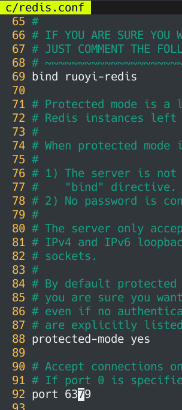
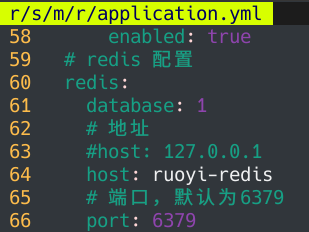
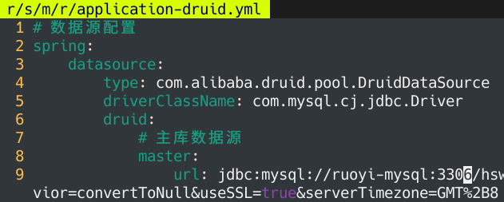
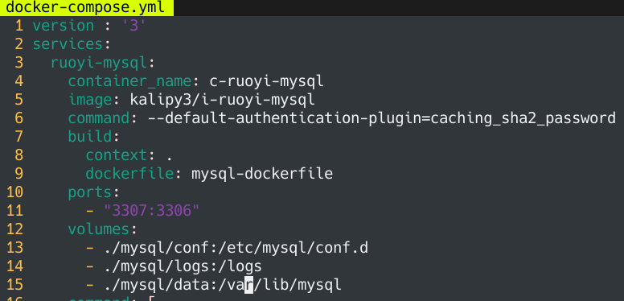
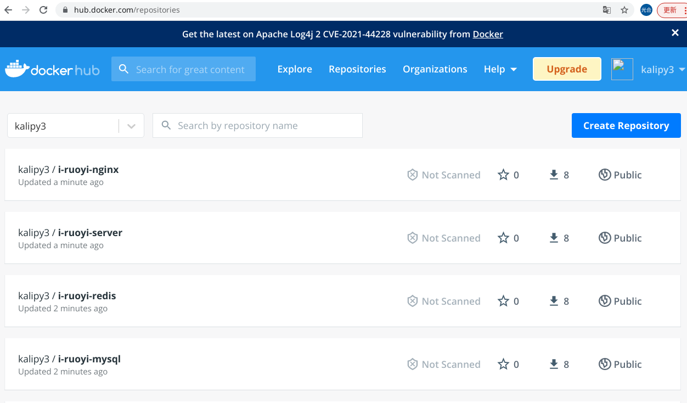
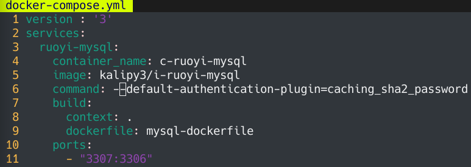
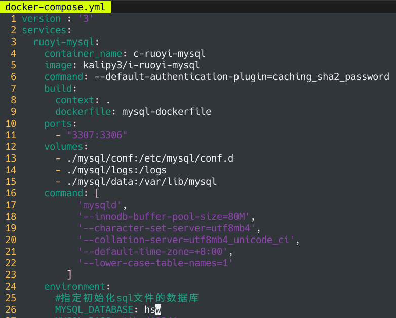

    readme总结.md
    
    :Author: kalipy
    :Email: kalipy@debian
    :Date: 2022-01-14 10:48

### 总结

1. docker-compose.yml中没配置build参数，本地没有镜像，`docker-compose up`会直接去远程pull

2. docker-compose.yml中配置build了参数，本地没有镜像，`docker-compose up`不会直接去远程pull(即使远程已经有了)，而是直接会本地build

3. docker-compose.yml中配置build了参数，本地有镜像，`docker-compose up`直接会用本地镜像启动

### docker-compose远程部署(远程运行环境搭建)

#### 项目说明

请先看项目结构：

    kalipy@debian ~/桌/r/ruoyi> unzip docker_compose_ruoyi.zip
    kalipy@debian ~/桌/r/ruoyi> ls
    conf/  docker-compose.yml  jar/              nginx-dockerfile  ruoyi-dockerfile
    db/    html/               mysql-dockerfile  redis-dockerfile
    kalipy@debian ~/桌/r/ruoyi> tree -L 2
    .
    ├── conf
    │   ├── nginx.conf
    │   └── redis.conf
    ├── db
    │   ├── doc_hsw_20201215_ok.sql
    │   └── quartz_ok.sql
    ├── docker-compose.yml
    ├── html
    │   └── dist
    ├── jar
    │   └── hsw.jar
    ├── mysql-dockerfile
    ├── nginx-dockerfile
    ├── redis-dockerfile
    └── ruoyi-dockerfile
    
    5 directories, 10 files

##### 前端项目配置说明

nginx配置：

    server {
        listen       8080;//docker容器内部的
        server_name  localhost;//docker容器内部的
        client_max_body_size 100M;
        location / {
            root /home/ruoyi/projects/ruoyi-ui;//docker容器内部的
            try_files $uri $uri/ /index.html;//docker容器内部的
            index  index.html index.htm;//docker容器内部的
        }
        location /stage-api {//docker容器内部的
            proxy_set_header   Host             $host;
            proxy_set_header   x-forwarded-for  $remote_addr;
            proxy_set_header   X-Real-IP        $remote_addr;
            proxy_pass http://ruoyi-server:9001/;//port对应docker容器内部，ip填docker-compose.yml中的services名
            rewrite ^/stage-api/(.*)$  /$1 break;
        }

        location /api {//docker容器内部的
            proxy_set_header   Host             $host;
            proxy_set_header   x-forwarded-for  $remote_addr;
            proxy_set_header   X-Real-IP        $remote_addr;
            proxy_pass http://ruoyi-server:9001/;//docker容器内部的
            rewrite ^/(.*)$  /$1 break;
        }
    }

前端vue项目配置:

    kalipy@debian ~/K/p/hsw-web2> ls
    babel.config.js  build/   dist/          package.json  README.md  vue.config.js
    bin/             config/  node_modules/  public/       src/
    kalipy@debian ~/K/p/hsw-web2> more config/proxyConfig.js 
    module.exports = {
      // APP下载地址配置
      downloadURL: "http://demo.huashiwei.net/server_config/download",
      // api跨域代理
      proxy: {
        [process.env.VUE_APP_BASE_API]: {
          /*target: `http://81.68.216.217:9003`,*/
          target: `http://ruoyi-server:9001`,
          changeOrigin: true,
          pathRewrite: {
            ["^" + process.env.VUE_APP_BASE_API]: ""
          }
        }
      }
    };

说明：

* 前端的ip要全部改为docker-compose.yml中的services名

#### 后端项目配置说明

redis配置：

说明：

* bind ip填docker-compose.yml中的services名

* port对应docker容器内部

后端springboot项目配置：

说明：

* host填docker-compose.yml中的services名

* port对应docker容器内部

说明：

* ip填docker-compose.yml中的services名

* port对应docker容器内部

..

等等配置..

#### 配置总结

##### 总结1

总之，这些配置文件和前后端项目最终都是放到docker容器内部加载和运行的，所以ip和port都是对应docker容器内部的，ip由于是容器内部的，且由于容器是独立的环境(类似于一个docker就是一个独立的电脑)，要让容器之间互相认识，可以通过填写docker-compose.yml中的services名来让容器之间互相访问

##### 总结2

    ports:
      - "3307:3306"

    volumes:
      - ./mysql/conf:/etc/mysql/conf.d
      - ./mysql/logs:/logs
      - ./mysql/data:/var/lib/mysql

上面这种配置，左边:右边，左边对应宿主机，右边对应docker内部容器

#### 本地构建(机器a中执行这些命令)

测试时为了防止其它镜像干扰，先把所有镜像和容器都删除：

    kalipy@debian ~/桌/r/ruoyi> sudo docker images
    REPOSITORY   TAG       IMAGE ID   CREATED   SIZE
    kalipy@debian ~/桌/r/ruoyi> sudo /home/kalipy/docker-compose-Linux-x86_64 images
    Container   Repository   Tag   Image Id   Size
    ----------------------------------------------
    kalipy@debian ~/桌/r/ruoyi> sudo /home/kalipy/docker-compose-Linux-x86_64 ps
    Name   Command   State   Ports
    ------------------------------

构建镜像：

    kalipy@debian ~/桌/r/ruoyi> sudo /home/kalipy/docker-compose-Linux-x86_64 build
    Building ruoyi-mysql
    Sending build context to Docker daemon  227.8MB
    Step 1/3 : FROM mysql:5.7
    5.7: Pulling from library/mysql
    72a69066d2fe: Pull complete 
    ...
    ...

结果：

    kalipy@debian ~/桌/r/ruoyi> sudo /home/kalipy/docker-compose-Linux-x86_64 ps
    Name   Command   State   Ports
    ------------------------------
    kalipy@debian ~/桌/r/ruoyi> sudo /home/kalipy/docker-compose-Linux-x86_64 images
    Container   Repository   Tag   Image Id   Size
    ----------------------------------------------
    kalipy@debian ~/桌/r/ruoyi> sudo docker images
    REPOSITORY               TAG       IMAGE ID       CREATED              SIZE
    kalipy3/i-ruoyi-nginx    latest    d632358c5bc1   57 seconds ago       153MB
    kalipy3/i-ruoyi-server   latest    b78aa0e0826c   About a minute ago   719MB
    kalipy3/i-ruoyi-redis    latest    30d1867c5fee   3 minutes ago        113MB
    kalipy3/i-ruoyi-mysql    latest    14e47eb5412e   3 minutes ago        450MB
    nginx                    latest    605c77e624dd   2 weeks ago          141MB
    redis                    latest    7614ae9453d1   3 weeks ago          113MB
    mysql                    5.7       c20987f18b13   3 weeks ago          448MB
    java                     8         d23bdf5b1b1b   4 years ago          643MB

#### 发布到远程dockerhub(机器a中执行这些命令)

发布到远程:

    kalipy@debian ~/桌/r/ruoyi> sudo /home/kalipy/docker-compose-Linux-x86_64 push

结果：

#### 拉取镜像(机器a/b/..中执行这些命令)

测试时，我为了防止其它镜像干扰，先把所有镜像和容器都删除：

    kalipy@debian ~/桌/r/ruoyi> sudo docker images
    REPOSITORY   TAG       IMAGE ID   CREATED   SIZE
    kalipy@debian ~/桌/r/ruoyi> sudo /home/kalipy/docker-compose-Linux-x86_64 images
    Container   Repository   Tag   Image Id   Size
    ----------------------------------------------
    kalipy@debian ~/桌/r/ruoyi> sudo /home/kalipy/docker-compose-Linux-x86_64 ps
    Name   Command   State   Ports
    ------------------------------

拉取镜像：

    kalipy@debian ~/桌/r/ruoyi> sudo /home/kalipy/docker-compose-Linux-x86_64 pull
    Pulling ruoyi-mysql  ... done
    Pulling ruoyi-redis  ... done
    Pulling ruoyi-server ... done
    Pulling ruoyi-nginx  ... done

结果：

    kalipy@debian ~/桌/r/ruoyi> sudo /home/kalipy/docker-compose-Linux-x86_64 ps
    Name   Command   State   Ports
    ------------------------------
    kalipy@debian ~/桌/r/ruoyi> sudo /home/kalipy/docker-compose-Linux-x86_64 images
    Container   Repository   Tag   Image Id   Size
    ----------------------------------------------
    kalipy@debian ~/桌/r/ruoyi> sudo docker images
    REPOSITORY               TAG       IMAGE ID       CREATED          SIZE
    kalipy3/i-ruoyi-nginx    latest    d632358c5bc1   12 minutes ago   153MB
    kalipy3/i-ruoyi-server   latest    b78aa0e0826c   12 minutes ago   719MB
    kalipy3/i-ruoyi-redis    latest    30d1867c5fee   14 minutes ago   113MB
    kalipy3/i-ruoyi-mysql    latest    14e47eb5412e   15 minutes ago   450MB

#### 运行镜像(机器a/b/..中执行这些命令)

    kalipy@debian ~/桌/r/ruoyi_yuan> sudo /home/kalipy/docker-compose-Linux-x86_64 up
    Creating network "ruoyi_yuan_default" with the default driver
    Creating c-ruoyi-mysql ... done
    Creating c-ruoyi-redis ... done
    Creating c-ruoyi-server ... 
    ..

此时只是运行，这一步删除所有dockerifle也可以运行成功:

    kalipy@debian ~/桌/r/ruoyi_yuan> ls
    conf/  docker-compose.yml      html/ 
    db/    jar/   mysql-dockerfile  nginx-dockerfile  redis-dockerfile  ruoyi-dockerfile
    kalipy@debian ~/桌/r/ruoyi_yuan> rm *file
    kalipy@debian ~/桌/r/ruoyi_yuan> ls
    conf/  db/  docker-compose.yml html/  jar/

    kalipy@debian ~/桌/r/ruoyi_yuan> sudo /home/kalipy/docker-compose-Linux-x86_64 up
    Creating network "ruoyi_yuan_default" with the default driver
    Creating c-ruoyi-mysql ... done
    Creating c-ruoyi-redis ... done
    Creating c-ruoyi-server ... 
    ..

### docker中的mysql的坑

#### docker内部可以访问mysql，远程无法访问mysql

授权即可(注意：下面命令都是在docker内部执行)

    #首先要进入容器内部
    docker exec -it 容器名或容器ID
    
    #进入mysql，初次进入不需要密码，直接回车即可
    mysql -u root -p
    
    #授权
    GRANT ALL PRIVILEGES ON *.* TO root@"%" IDENTIFIED BY "Abcd1234";
    flush privileges;
    
    #退出
    exit
    exit#第一个exit退出mysql#第二个exit退出容器的bash

#### mysql用户名和密码都是正确的，但是就是说我密码错误

对于mysql8.x:

配置command为：

    command: --default-authentication-plugin=caching_sha2_password

对于mysql5.x:

配置command为：

    command: --default-authentication-plugin=mysql_native_password

#### sql文件没有被执行，hsw库也没有被创建

docker-compose.yml文件中，加入`MYSQL_DATABASE: 库名`，该库会在mysql启动是自动创建:

    environment:
      #指定初始化sql文件的数据库
      MYSQL_DATABASE: hsw
      MYSQL_PASS: 'Abcd1234'
      MYSQL_ROOT_PASSWORD: 'Abcd1234'

### docker-compose本地部署(本地运行环境搭建)

和远程部署一样，只是没有了push和pull这两步

