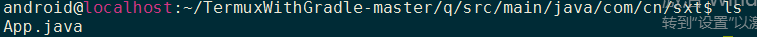
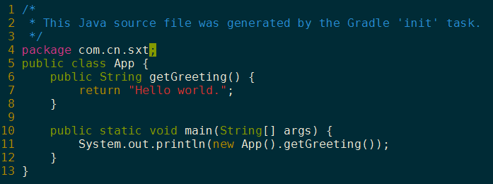
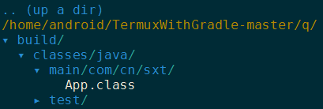
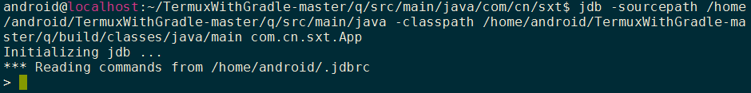
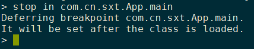
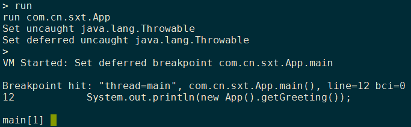
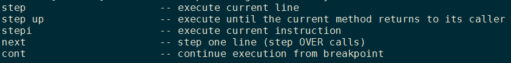
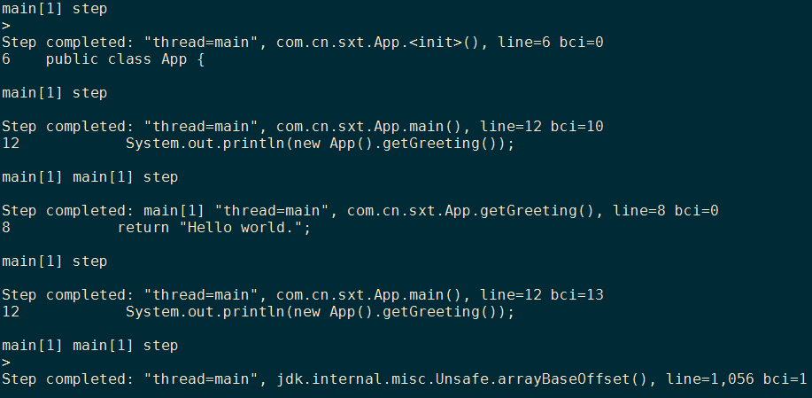
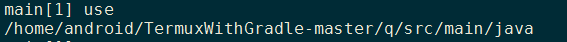

# jdb调试时使用list看不到源码和classpath问题
  
### 解决  
1.  查看该包的完整路径，然后找到包名对应的前缀目录。  
比如：  
hadoop模块中包名为：org.apache.hadoop.fs.ceph.CephFileSystem的包  
该包所在完整目录为/root/dev/dev-ceph-src/src/java/cephfs-hadoop/src/main/java/org/apache/hadoop/fs/ceph  
则对应的use命令应该为：
use /root/dev/dev-ceph-src/src/java/cephfs-hadoop/src/main/java

### 例子：
1.  cd到你要调试的那个源码目录:  
  

2. App.java内容如下：  
  

3. build目录结构如下：  
  

4. 执行jdb命令调试：  
```
jdb -sourcepath /home/android/TermuxWithGradle-master/q/src/main/java -classpath /home/android/TermuxWithGradle-master/q/build/classes/java/main com.cn.sxt.App
```  

5. 回显结果如图：  
  

6. `>`表示jdb正在等待我们输入调试命令，我们可以键盘输入`stop in com.cn.sxt.App.main`给`App.java`的`main`函数下断点：  
  

7. 然后输入`run`运行App.class,jvm运行到App.main()即停在那里(刚刚下的断点处):  
  

8. 输入`help`可以查看jdb给我们提供的调试命令:  
 
```
main[1] help
** command list **
connectors                -- list available connectors and transports in this VM

run [class [args]]        -- start execution of application's main class

threads [threadgroup]     -- list threads
thread <thread id>        -- set default thread
suspend [thread id(s)]    -- suspend threads (default: all)
resume [thread id(s)]     -- resume threads (default: all)
where [<thread id> | all] -- dump a thread's stack
wherei [<thread id> | all]-- dump a thread's stack, with pc info
up [n frames]             -- move up a thread's stack
down [n frames]           -- move down a thread's stack
kill <thread id> <expr>   -- kill a thread with the given exception object
interrupt <thread id>     -- interrupt a thread

print <expr>              -- print value of expression
dump <expr>               -- print all object information
eval <expr>               -- evaluate expression (same as print)
set <lvalue> = <expr>     -- assign new value to field/variable/array element
locals                    -- print all local variables in current stack frame

classes                   -- list currently known classes
class <class id>          -- show details of named class
methods <class id>        -- list a class's methods
fields <class id>         -- list a class's fields

threadgroups              -- list threadgroups
threadgroup <name>        -- set current threadgroup

stop in <class id>.<method>[(argument_type,...)]
                          -- set a breakpoint in a method
stop at <class id>:<line> -- set a breakpoint at a line
clear <class id>.<method>[(argument_type,...)]
                          -- clear a breakpoint in a method
clear <class id>:<line>   -- clear a breakpoint at a line
clear                     -- list breakpoints
catch [uncaught|caught|all] <class id>|<class pattern>
                          -- break when specified exception occurs
ignore [uncaught|caught|all] <class id>|<class pattern>
                          -- cancel 'catch' for the specified exception
watch [access|all] <class id>.<field name>
                          -- watch access/modifications to a field
unwatch [access|all] <class id>.<field name>
                          -- discontinue watching access/modifications to a field
trace [go] methods [thread]
                          -- trace method entries and exits.
                          -- All threads are suspended unless 'go' is specified
trace [go] method exit | exits [thread]
                          -- trace the current method's exit, or all methods' exits
                          -- All threads are suspended unless 'go' is specified
untrace [methods]         -- stop tracing method entrys and/or exits
step                      -- execute current line
step up                   -- execute until the current method returns to its caller
stepi                     -- execute current instruction
next                      -- step one line (step OVER calls)
cont                      -- continue execution from breakpoint

list [line number|method] -- print source code
use (or sourcepath) [source file path]
                          -- display or change the source path
exclude [<class pattern>, ... | "none"]
                          -- do not report step or method events for specified classes
classpath                 -- print classpath info from target VM

monitor <command>         -- execute command each time the program stops
monitor                   -- list monitors
unmonitor <monitor#>      -- delete a monitor
read <filename>           -- read and execute a command file

lock <expr>               -- print lock info for an object
threadlocks [thread id]   -- print lock info for a thread

pop                       -- pop the stack through and including the current frame
reenter                   -- same as pop, but current frame is reentered
redefine <class id> <class file name>
                          -- redefine the code for a class

disablegc <expr>          -- prevent garbage collection of an object
enablegc <expr>           -- permit garbage collection of an object

!!                        -- repeat last command
<n> <command>             -- repeat command n times
# <command>               -- discard (no-op)
help (or ?)               -- list commands
version                   -- print version information
exit (or quit)            -- exit debugger

<class id>: a full class name with package qualifiers
<class pattern>: a class name with a leading or trailing w ildcard ('*')
<thread id>: thread number as reported in the 'threads' command
<expr>: a Java(TM) Programming Language expression.
Most common syntax is supported.

Startup commands can be placed in either "jdb.ini" or ".jdbrc"
in user.home or user.dir
main[1]

```
9.主要看这几条：  
  

10.`step`单步执行：  
  

11.使用`use`命令查看刚刚设置的源码路径：  
  

