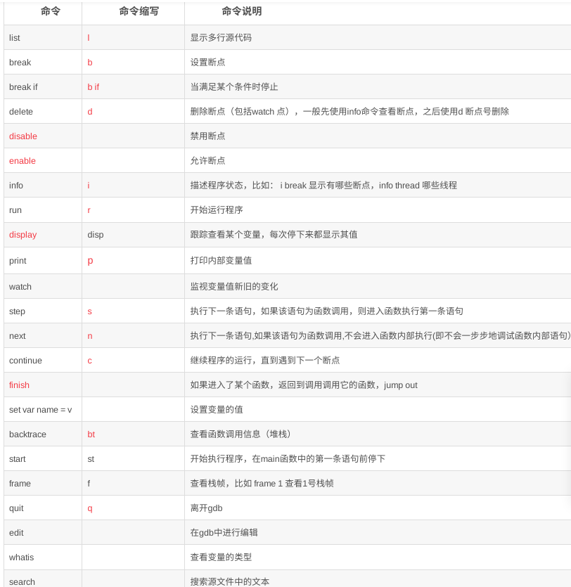

    gdbgui.md
    
    :Author: kalipy
    :Email: kalipy@debian
    :Date: 2021-06-11 13:19

### gdb调试常用基础命令

### gdbgui安装

    pip3 install gdbgui

### 使用

#### x86平台

    gdbgui -p 8888 -r "a.out"

    浏览器访问:127.0.0.1:8888

#### x86平台上让gdbgui使用arm-none-eabi-gdb编译器交叉调试arm平台的程序

    //指定gdbgui使用的调试器
    gdbgui -g arm-none-eabi-gdb

### 注意

    xxx.c文件名不要有中文，不然gdbgui识别不出xxx.c源文件
