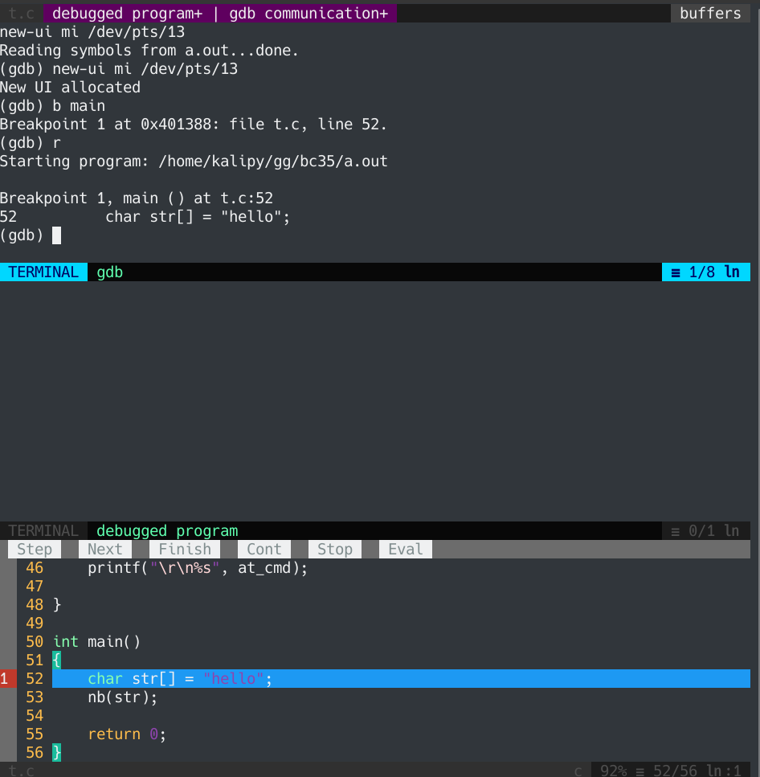

    使用vim自带的调试器Termdebug调试c程序.md
    
    :Author: kalipy
    :Email: kalipy@debian
    :Date: 2021-06-11 13:31

### 安装Termdebug

* vim8.1以上版本自带
* Termdebug本质是使用的gdb

### 使用

编译t.c并用vim打开

    kalipy@debian ~/g/bc35> gcc t.c -g
    kalipy@debian ~/g/bc35> ls
    a.out* t.c
    kalipy@debian ~/g/bc35> vim t.c

使能vim的debug功能

    :packadd termdebug

调试a.out(从上到下依次是`gdb命令行窗口` `IO交互窗口` `源码窗口`)

    :Termdebug a.out

效果

### x86平台让Termdebug使用arm-none-eabi-gdb交叉调试arm平台的程序

查看Termdebug文档

    :h terminal-debug

打开vim配置文件

    vim /usr/share/vim/vimrc

追加如下配置信息

    let termdebugger = "arm-none-eabi-gdb"
