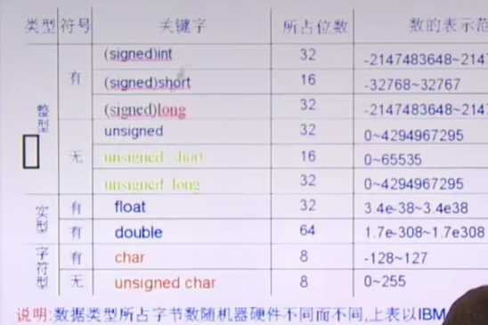
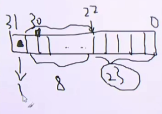
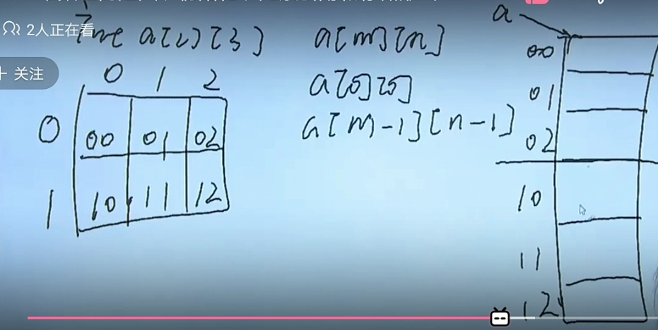
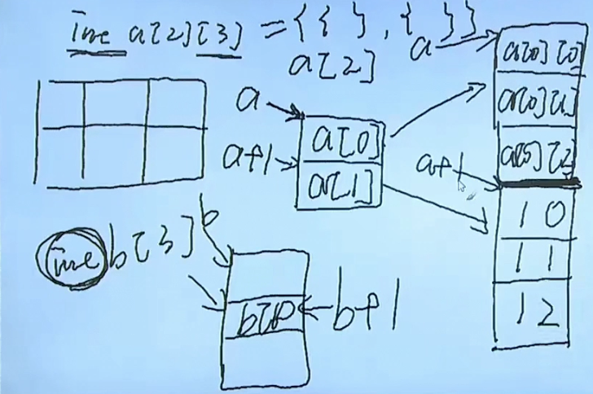
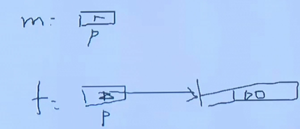

    linux_c入门.md
    
    :Author: kalipy
    :Email: kalipy@debian
    :Date: 2022-04-11 20:23

### p3 基本概念 编程注意问题

eg1.

    kalipy@debian ~/g/linux_c入门> more main.c 
    #include <stdio.h>
    
    int main(void)
    {
        int *p = NULL;
        p = malloc(sizeof(int));
        if (p == NULL)
        {
            return -1;
        }
    
        return 0;
    }
    
    kalipy@debian ~/g/linux_c入门> gcc main.c
    main.c: In function ‘main’:
    main.c:13:9: warning: implicit declaration of function ‘malloc’ [-Wimplicit-function-declaration]
         p = malloc(sizeof(int));
             ^~~~~~
    main.c:13:9: warning: incompatible implicit declaration of built-in function ‘malloc’
    main.c:13:9: note: include ‘<stdlib.h>’ or provide a declaration of ‘malloc’
    main.c:9:1:
    +#include <stdlib.h>
     
    main.c:13:9:
         p = malloc(sizeof(int));
             ^~~~~~

eg1原因：没加malloc的头文件stdlib.h

eg1解决方法：

错误的方法(因为把`void*`赋值给任何指针都天经地义，把任何指针赋值给`void*`也天经地义，压根不需要强制类型转换，除了一种特例)：

`p = (int *)malloc(sizeof(int))`

正确的方法：加上头文件`#include <stdlib.h>`

    kalipy@debian ~/g/linux_c入门> more main.c
    #include <stdio.h>
    #include <stdlib.h>
    
    int main(void)
    {
        int *p = NULL;
        p = malloc(sizeof(int));
        if (p == NULL)
        {
            return -1;
        }
    
        return 0;
    }
    
    kalipy@debian ~/g/linux_c入门> gcc main.c
    kalipy@debian ~/g/linux_c入门> gcc main.c -Wall

eg2.

    kalipy@debian ~/g/linux_c入门> more main.c
    #include <stdio.h>
    #include <stdlib.h>
    #include <errno.h>
    
    int main(void)
    {
        FILE *fp;
    
        fp = fopen("tmp", "r");
        if (fp == NULL)
        {
            fprintf(stderr, "fopen():%s\n", strerror(errno));
            exit(1);
        }
    
        puts("ok!");
        exit(0);
    }
    
    kalipy@debian ~/g/linux_c入门> gcc main.c
    main.c: In function ‘main’:
    main.c:12:41: warning: implicit declaration of function ‘strerror’; did you mean ‘perror’? [-Wimplicit-function-declaration]
             fprintf(stderr, "fopen():%s\n", strerror(errno));
                                             ^~~~~~~~
                                             perror

可以看到，只是报了个隐式声明，看起来无关紧要，然而运行却是：

    kalipy@debian ~/g/linux_c入门> ./a.out
    fish: Job 2, './a.out' terminated by signal SIGSEGV (Address boundary error)

我们`-Wall`把警告打印出来，发现报参数不对的警告：

    kalipy@debian ~/g/linux_c入门> gcc main.c -Wall
    main.c: In function ‘main’:
    main.c:12:41: warning: implicit declaration of function ‘strerror’; did you mean ‘perror’? [-Wimplicit-function-declaration]
             fprintf(stderr, "fopen():%s\n", strerror(errno));
                                             ^~~~~~~~
                                             perror
    main.c:12:35: warning: format ‘%s’ expects argument of type ‘char *’, but argument 3 has type ‘int’ [-Wformat=]
             fprintf(stderr, "fopen():%s\n", strerror(errno));
                                      ~^     ~~~~~~~~~~~~~~~
                                      %d

解决方法：

加上strerror函数的头文件`#include <string.h>`即可，请看，现在警告消失了：

    kalipy@debian ~/g/linux_c入门> gcc main.c -Wall


### p4 基本概念 编程注意问题

`return`和`exit(0)`的区别：

eg1.

    kalipy@debian ~/g/linux_c入门> more main.c
    #include <stdio.h>
    #include <stdlib.h>
    
    int main(void)
    {
        return 0;
        //exit(0);
    }
    
    kalipy@debian ~/g/linux_c入门> gcc main.c -Wall
    kalipy@debian ~/g/linux_c入门> ./a.out
    kalipy@debian ~/g/linux_c入门> echo $status         //在这里shell是a.out的父进程，打印shell中上条语句的执行结果
    0
    kalipy@debian ~/g/linux_c入门> fg
    将任务 1，“vim main.c” 发送到前台
    Job 1, 'vim main.c' has stopped
    kalipy@debian ~/g/linux_c入门> more main.c
    #include <stdio.h>
    #include <stdlib.h>
    
    int main(void)
    {
        return 111;
        //exit(0);
    }
    
    kalipy@debian ~/g/linux_c入门> gcc main.c -Wall
    kalipy@debian ~/g/linux_c入门> ./a.out
    kalipy@debian ~/g/linux_c入门> echo $status
    111

return 是返回给父进程的，exit(0)是正常退出。

### p5 数据类型 二进制及数值类型的存储



注意：图中`char`的符号错了，其有没有正负符号是未定义行为

eg1. 二进制转八进制:

    (011 111 110)2 = (376)8

eg2. 二进制转16进制：

    (1111 1110)2 = (FE)16

eg3. 八进制转16进制：

    (376)8 = (011 111 110)2 = (1111 1110)2 = (FE)16

eg3. 正整数和负整数在内存中的存储形式(都是以补码的形式存储)：

正整数是其本身二进制：

    254 -> unsigned int -> 32位

负整数是其绝对值的二进制取反加1：

    -254 -> 254 -> (1111 1110)2 -> 取反 + 1

eg4. `3.14`的存储(转换成0.xx * 10^n的形式，以小数点`.`后面的第一位非零开始)：

    如：3.14 = 0.314 * 10^1

    如：0.000789 = 0.789 * 10^-3

以`float`为例：



第0-22位存储小数部分(共23位)，第23-30存储10的次方的那个指数部分(共8位)，第31位存储正负符号

### p6 数据类型bool

    kalipy@debian ~/g/linux_c入门> more main.c
    #include <stdio.h>
    #include <stdlib.h>
    #include <stdbool.h>
    
    int main(void)
    {
        bool a = false;
    
        printf("a = %d\n", a);
    
        return 0;
    }
    
    kalipy@debian ~/g/linux_c入门> gcc main.c
    kalipy@debian ~/g/linux_c入门> ./a.out
    a = 0

注意与零的比较，|f - 0| <= 10^-6，认为其等于0:

    #include <stdio.h>
    #include <stdlib.h>
    
    int foo(float f)
    {
        if (f < 0)
            return -1;
        else if (f == 0)// if(fabs(f-0) <= 1e-6)
            return 0;
        else 
            return 1;
    }
    
    int main(void)
    {
        printf("%d\n", foo(0.000001));
    
        return 0;
    }

### p8 常量 define的使用

    kalipy@debian ~/g/linux_c入门> more main.c
    #include <stdio.h>
    #include <stdlib.h>
    
    #define MAX(a, b)   \
        ({typeof(a) A=a,B=b; ((A) > (B) ? (A) : (B));})
    
    int main(void)
    {
        
        printf("%d\n", MAX(1, 2));
    
        return 0;
    }
    
    kalipy@debian ~/g/linux_c入门> gcc main.c 
    kalipy@debian ~/g/linux_c入门> ./a.out
    2

-E选项打印预处理的结果：

    kalipy@debian ~/g/linux_c入门> gcc main.c -E

    int main(void)
    {
        printf("%d\n", ({typeof(1) A=1,B=2; ((A) > (B) ? (A) : (B));}));
        return 0;
    }

### p9 变量 定义

进程内存布局：

    4g---------
        kernel
    3g---------
        栈(可以向下增长)
    -----------
        |   
       \|/
    
       /|\
        |
    -----------
        堆(可以向上增长)
    -----------
        bss
    -----------
        data
    -----------
        text
    -----------
        xxx
    0g---------

存储类型：

auto    static  register    extern(说明型)

auto:默认，自动分配空间，自动回收空间

register:(建议型)寄存器类型，只能定义局部变量，不能定义全局变量，大小有限制，如在32位机器上只能定义32位大小的数据类型。寄存器没有地址，所以一个寄存器类型的变量无法打印出地址查看或使用

extern:说明型，意味着不能改变被说明的变量的值或类型(extern定义变量的时候只能是声明，如extern int a，不能写成extern int a = 1)

### p10 变量 全局变量

eg1.

    kalipy@debian ~/g/linux_c入门> more main.c
    #include <stdio.h>
    #include <stdlib.h>
    
    int i = 100;
    
    int main(void)
    {
        int i = 3;
        
        printf("%d\n", i);
    
        exit(0);
    }
    
    kalipy@debian ~/g/linux_c入门> gcc main.c 
    kalipy@debian ~/g/linux_c入门> ./a.out
    3

eg2.

    kalipy@debian ~/g/linux_c入门> more main.c
    #include <stdio.h>
    #include <stdlib.h>
    
    int i = 100;
    
    int main(void)
    {
        int i = 3;
        
        {
            printf("%d\n", i);
        }
    
        exit(0);
    }
    
    kalipy@debian ~/g/linux_c入门> gcc main.c
    kalipy@debian ~/g/linux_c入门> ./a.out
    3
 
eg3.

    kalipy@debian ~/g/linux_c入门> more main.c
    #include <stdio.h>
    #include <stdlib.h>
    
    int i = 100;
    
    int main(void)
    {
        int i = 3;
        
        {
            int i = 5;
            printf("%d\n", i);
        }
    
        exit(0);
    }
    
    kalipy@debian ~/g/linux_c入门> gcc main.c
    kalipy@debian ~/g/linux_c入门> ./a.out
    5

eg4.

    kalipy@debian ~/g/linux_c入门> more main.c
    #include <stdio.h>
    #include <stdlib.h>
    
    int i = 100;
    
    void foo(int i)
    {
        printf("i = %d\n", i);
    }
    
    int main(void)
    {
        int i = 3;
        foo(i);
        
        {
            int i = 5;
            printf("%d\n", i);
        }
    
        exit(0);
    }
    
    kalipy@debian ~/g/linux_c入门> gcc main.c
    kalipy@debian ~/g/linux_c入门> ./a.out
    i = 3
    5
 
eg5. 全局变量的坏处，各个函数互相影响了，不正交

    kalipy@debian ~/g/linux_c入门> nl main.c 
         1  #include <stdio.h>
         2  #include <stdlib.h>
           
         3  int i = 0;
           
         4  void print_star(void)
         5  {
         6      for (i = 0; i < 5; i++) {
         7          printf("*");
         8      }
         9      printf("\n");
        10      
        11      printf("[%s]i = %d\n", __FUNCTION__, i);
        12  }
           
        13  int main(void)
        14  {
        15      for (i = 0; i < 5; i++) {
        16          print_star();
        17      }
        18      printf("[%s]i = %d\n", __FUNCTION__, i);
           
        19      exit(0);
        20  }
           
    kalipy@debian ~/g/linux_c入门> gcc main.c
    kalipy@debian ~/g/linux_c入门> ./a.out
    *****
    [print_star]i = 5
    [main]i = 6

###(todo) p11 变量 static extern 生命周期

### p15 输入输出 基本函数介绍

IO函数:

格式化IO函数：scanf, printf
字符IO函数：getchar, putchar
字符串IO函数：gets(!), puts

### p16 输入输出 修饰字符

eg1.(没单位没有任何意义)

    #define SEC_YEAR    (60*60*24*365)


eg2.

    #define SEC_YEAR    (60LL*60LL*24LL*365LL)

eg3.

    foo(long long i) {
    }

    foo(12LL);

### 输入输出 变参介绍 缓冲区刷新

因为c语言没有函数重载机制，下面这种其实是变参函数:

    int open(const char *pathname, int flags);
    int open(const char *pathname, int flags, mode_t mode);
    
eg1.

    kalipy@debian ~/g/linux_c入门> more main.c
    #include <stdio.h>
    #include <stdlib.h>
    
    int main(void)
    {
        printf("[%s:%d]before while()", __FUNCTION__, __LINE__);
    
        while (1);
    
        printf("[%s:%d]after while()", __FUNCTION__, __LINE__);
    
        exit(0);
    }
    
    kalipy@debian ~/g/linux_c入门> gcc main.c
    kalipy@debian ~/g/linux_c入门> ./a.out
    ^C⏎ 
    
为什么没有任何打印呢？

答：

缓冲设备有3种，分别为全缓冲，行缓冲，无缓冲

终端设备是行缓冲，通常用`\n`来刷新缓冲区(请看eg2就能正常打印)

eg2.

    kalipy@debian ~/g/linux_c入门> nl main.c
         1  #include <stdio.h>
         2  #include <stdlib.h>
           
         3  int main(void)
         4  {
         5      printf("[%s:%d]before while()\n", __FUNCTION__, __LINE__);
           
         6      while (1);
           
         7      printf("[%s:%d]after while()\n", __FUNCTION__, __LINE__);
           
         8      exit(0);
         9  }
           
           
    kalipy@debian ~/g/linux_c入门> gcc main.c
    kalipy@debian ~/g/linux_c入门> ./a.out
    [main:6]before while()
    
eg3.

    kalipy@debian ~/g/linux_c入门> nl main.c
         1  #include <stdio.h>
         2  #include <stdlib.h>
           
         3  int main(void)
         4  {
         5      printf("[%s:%d]before while()", __FUNCTION__, __LINE__);
           
         6      //while (1);
           
         7      printf("[%s:%d]after while()", __FUNCTION__, __LINE__);
           
         8      exit(0);
         9  }
           
           
    kalipy@debian ~/g/linux_c入门> gcc main.c
    kalipy@debian ~/g/linux_c入门> ./a.out
    [main:6]before while()[main:10]after while()⏎
    
为什么现在把eg1中的`while(1)`注释掉且又没加`\n`又可以正常打印了呢？

答：程序结束后，程序的缓冲区会自动刷新

### scanf函数

eg1.

    kalipy@debian ~/g/linux_c入门> nl main.c
         1  #include <stdio.h>
         2  #include <stdlib.h>
           
         3  int main(void)
         4  {
         5      int i;
         6      char ch;
           
         7      scanf("%d", &i);
         8      scanf("%c", &ch);
           
         9      printf("i = %d, ch = %d\n", i, ch);
           
        10      exit(0);
        11  }
           
           
    kalipy@debian ~/g/linux_c入门> gcc main.c
    kalipy@debian ~/g/linux_c入门> ./a.out
    89
    i = 89, ch = 10

可以看到，输入89，按回车后，马上就打印了，丝毫不给我们输入第8行的机会，解决，请看eg2和eg3:

eg2.

    kalipy@debian ~/g/linux_c入门> more main.c
    #include <stdio.h>
    #include <stdlib.h>
    
    int main(void)
    {
        int i;
        char ch;
    
        scanf("%d", &i);
        scanf("%*c%c", &ch);//抑止符 `%*c`，吃掉一个字符
    
        printf("i = %d, ch = %d\n", i, ch);
    
        exit(0);
    }
    
    kalipy@debian ~/g/linux_c入门> gcc main.c
    kalipy@debian ~/g/linux_c入门> ./a.out
    89
    a
    i = 89, ch = 97
    
eg3(eg1解决的方法二).

    kalipy@debian ~/g/linux_c入门> nl main.c
         1  #include <stdio.h>
         2  #include <stdlib.h>
           
         3  int main(void)
         4  {
         5      int i;
         6      char ch;
           
         7      scanf("%d", &i);
         8      //scanf("%*c%c", &ch);
         9      getchar();
        10      scanf("%c", &ch);
           
        11      printf("i = %d, ch = %d\n", i, ch);
           
        12      exit(0);
        13  }
           
    kalipy@debian ~/g/linux_c入门> gcc main.c
    kalipy@debian ~/g/linux_c入门> ./a.out
    89
    a
    i = 89, ch = 97
    
getchar为什么也可以，请看man手册:
    
    getchar() is equivalent to getc(stdin).

    fgetc()  reads  the next character from stream and returns it as an unsigned char cast to an int, or EOF
    on end of file or error.

    getc() is equivalent to fgetc() except that it may be implemented as a macro which evaluates stream more
    than once.

    fgets()  reads  in  at  most  one  less than size characters from stream and stores them into the buffer
    pointed to by s.  Reading stops after an EOF or a newline.  If a newline is read, it is stored into  the
    buffer.  A terminating null byte ('\0') is stored after the last character in the buffer.

eg4.

    kalipy@debian ~/g/linux_c入门> more main.c
    #include <stdio.h>
    #include <stdlib.h>
    
    #define STRSIZE 32
    
    int main(void)
    {
        char str[STRSIZE];
    
        scanf("%s", str);
        printf("%s\n", str);
    
        exit(0);
    }
    
    kalipy@debian ~/g/linux_c入门> gcc main.c
    kalipy@debian ~/g/linux_c入门> gcc main.c -Wall
    kalipy@debian ~/g/linux_c入门> ./a.out
    hello world
    hello

eg5.

    kalipy@debian ~/g/linux_c入门> more main.c
    #include <stdio.h>
    #include <stdlib.h>
    
    int main(void)
    {
        int i;
    
        while (1)
        {
            scanf("%d", &i);
            printf("i = %d\n", i);
        }
    
        exit(0);
    }
    
    
    kalipy@debian ~/g/linux_c入门> gcc main.c 

输入正确的类型数据，没问题：
    
    kalipy@debian ~/g/linux_c入门> ./a.out
    4
    i = 4
    1
    i = 1

但是现在我输入非法字符比如`a`，居然死循环了：

    kalipy@debian ~/g/linux_c入门> ./a.out
    4
    i = 4
    1
    i = 1
    i = 1
    i = 1
    i = 1
    ...
    ^C⏎ 

eg6(scanf正确写法应该是检查scanf的返回值).

    kalipy@debian ~/g/linux_c入门> more main.c
    #include <stdio.h>
    #include <stdlib.h>
    
    int main(void)
    {
        int i;
    
        while (1)
        {
            int ret = scanf("%d", &i);
            printf("ret = %d\n", ret);
            if (ret != 1) {
                printf("Enter error!\n");
                break;
            }
            printf("i = %d\n", i);
        }
    
        exit(0);
    }
    
    kalipy@debian ~/g/linux_c入门> gcc main.c
    kalipy@debian ~/g/linux_c入门> ./a.out
    4
    ret = 1
    i = 4
    1
    ret = 1
    i = 1
    a
    ret = 0
    Enter error!

man手册：

    RETURN VALUE
           On success, these functions return the number of input items successfully matched and assigned; this can be fewer than provided for, or even zero, in the event of an early matching failure.

eg7.

    kalipy@debian ~/g/linux_c入门> nl main.c
         1  #include <stdio.h>
         2  #include <stdlib.h>
           
         3  int main(void)
         4  {
         5      int i;
         6      char ch;
           
         7      scanf("%d", &i);
         8      ch = getchar();
           
         9      printf("i = %d, ch = %c\n", i, ch);
           
        10      exit(0);
        11  }
           
           
    kalipy@debian ~/g/linux_c入门> gcc main.c
    kalipy@debian ~/g/linux_c入门> ./a.out
    67
    i = 67, ch = 

我们发现，输入`67`后，居然不给我们输入`ch`的机会，我们尝试把`ch`打印出来:

    kalipy@debian ~/g/linux_c入门> more main.c
    #include <stdio.h>
    #include <stdlib.h>
    
    int main(void)
    {
        int i;
        char ch;
    
        scanf("%d", &i);
        ch = getchar();
    
        printf("i = %d, ch = %d\n", i, ch);
    
        exit(0);
    }
    
    
    kalipy@debian ~/g/linux_c入门> gcc main.c
    kalipy@debian ~/g/linux_c入门> ./a.out
    67
    i = 67, ch = 10
    
### 字符 字符串输入/输出

eg1(字符输入输出).

    kalipy@debian ~/g/linux_c入门> nl main.c
         1  #include <stdio.h>
         2  #include <stdlib.h>
           
         3  int main(void)
         4  {
         5      //char ch;
         6      int ch;
           
         7      ch = getchar();
         8      putchar(ch);
           
         9      exit(0);
        10  }
           
    kalipy@debian ~/g/linux_c入门> ./a.out
    a
    a⏎ 

首先纠正一个问题，getchar()的返回值是int，不要在写成char了，请看man手册：

    RETURN VALUE
           fgetc(), getc() and getchar() return the character read as an unsigned char cast to an int or EOF on end of file or error.

eg2(字符串输入输出).

    kalipy@debian ~/g/linux_c入门> more main.c
    #include <stdio.h>
    #include <stdlib.h>
    
    #define STRSIZE 32
    
    int main(void)
    {
        char str[STRSIZE];
    
        gets(str);
        puts(str);
    
        exit(0);
    }
    
    kalipy@debian ~/g/linux_c入门> gcc main.c
    main.c: In function ‘main’:
    main.c:10:5: warning: implicit declaration of function ‘gets’; did you mean ‘fgets’? [-Wimplicit-function-declaration]
         gets(str);
         ^~~~
         fgets
    /usr/bin/ld: /tmp/ccJZFKYg.o: in function `main':
    main.c:(.text+0x15): 警告：the `gets' function is dangerous and should not be used.
    kalipy@debian ~/g/linux_c入门> ./a.out
    hello world
    hello world

不推荐使用`gets()`，请看man手册，因为其`No check for buffer`：

    gets()  reads  a  line  from stdin into the buffer pointed to by s until either a terminating newline or
    EOF, which it replaces with a null byte ('\0').  No check for buffer overrun is performed (see BUGS  be-
    low).

不推荐使用怎么办？请看man手册，用`fgets()`替换：

    BUGS
    Never use gets().  Because it is impossible to tell without knowing the data in advance how many charac-
    ters gets() will read, and because gets() will continue to store characters past the end of the  buffer,
    it is extremely dangerous to use.  It has been used to break computer security.  Use fgets() instead.

eg3(获取一行，请看man手册):

    NAME
    getline, getdelim - delimited string input
    
    SYNOPSIS
    #include <stdio.h>
    
    ssize_t getline(char **lineptr, size_t *n, FILE *stream);
    
    CONFORMING TO
    Both getline() and getdelim() were originally GNU extensions.  They were standardized in POSIX.1-2008.

eg4.

闰年的判断：能被4整除但不能被100整除，或者能被400整除

### 

goto缺点: 不能跨函数跳转

### 二维数组的定义 初始化 元素引用和存储形式



eg1.

    kalipy@debian ~/g/linux_c入门> more main.c
    #include <stdio.h>
    #include <stdlib.h>
    
    #define M 2
    #define N 3
    
    int main(void)
    {
        int a[M][N] = {1, 3, 4, 6, 7};
        for (int i = 0; i < M; i++) {
            for (int j = 0; j < N; j++) {
                printf("%d ", a[i][j]);
            }
            printf("\n");
        }
    
        exit(0);
    }
    
    kalipy@debian ~/g/linux_c入门> gcc main.c
    kalipy@debian ~/g/linux_c入门> ./a.out
    1 3 4 
    6 7 0



### 字符数组和输入输出和常用函数


eg1(strlen的使用).

man手册：

    SYNOPSIS
           #include <string.h>
    
           size_t strlen(const char *s);
    
    DESCRIPTION
           The  strlen()  function  calculates  the length of the string pointed to by s, excluding the terminating
           null byte ('\0').
    
    RETURN VALUE
           The strlen() function returns the number of characters in the string pointed to by s.

    kalipy@debian ~/g/linux_c入门> more main2.c
    #include <stdio.h>
    #include <stdlib.h>
    #include <string.h>
    
    int main(void)
    {
        char str[] = "hello";
        printf("%d\n", strlen(str));
    
        exit(0);
    }
    
    kalipy@debian ~/g/linux_c入门> gcc main2.c
    kalipy@debian ~/g/linux_c入门> ./a.out
    5

eg2.

    kalipy@debian ~/g/linux_c入门> more main2.c
    #include <stdio.h>
    #include <stdlib.h>
    #include <string.h>
    
    int main(void)
    {
        char str[] = "hello";
        printf("%d\n", strlen(str));
        printf("%d\n", sizeof(str));
    
        exit(0);
    }
    
    kalipy@debian ~/g/linux_c入门> gcc main2.c
    kalipy@debian ~/g/linux_c入门> ./a.out
    5
    6

eg3.

    kalipy@debian ~/g/linux_c入门> more main2.c
    #include <stdio.h>
    #include <stdlib.h>
    #include <string.h>
    
    int main(void)
    {
        char str[] = "hello\0abc";
        printf("%d\n", strlen(str));
        printf("%d\n", sizeof(str));
    
        exit(0);
    }
    
    kalipy@debian ~/g/linux_c入门> gcc main2.c
    kalipy@debian ~/g/linux_c入门> ./a.out
    5
    10

eg4(数组的名字是地址常量，是右值).

    kalipy@debian ~/g/linux_c入门> more main2.c
    #include <stdio.h>
    #include <stdlib.h>
    #include <string.h>
    
    int main(void)
    {
        char str[] = "hello\0abc";
        str = "abcde";
    
        exit(0);
    }
    
    kalipy@debian ~/g/linux_c入门> gcc main2.c
    main2.c: In function ‘main’:
    main2.c:8:9: error: assignment to expression with array type
         str = "abcde";

eg5(字符串复制).

    SYNOPSIS
           #include <string.h>
    
           char *strcpy(char *dest, const char *src);
    
           char *strncpy(char *dest, const char *src, size_t n);
    
    DESCRIPTION
           The  strcpy()  function copies the string pointed to by src, including the terminating null byte ('\0'),
           to the buffer pointed to by dest.  The strings may not overlap, and the destination string dest must  be
           large enough to receive the copy.  Beware of buffer overruns!  (See BUGS.

       If the length of src is less than n, strncpy() writes additional null bytes to dest to ensure that a to-
       tal of n bytes are written.

       A simple implementation of strncpy() might be:

           char *
           strncpy(char *dest, const char *src, size_t n)
           {
               size_t i;

               for (i = 0; i < n && src[i] != '\0'; i++)
                   dest[i] = src[i];
               for ( ; i < n; i++)
                   dest[i] = '\0';

               return dest;
           }

    kalipy@debian ~/g/linux_c入门> more main2.c
    #include <stdio.h>
    #include <stdlib.h>
    #include <string.h>
    
    int main(void)
    {
        char str[] = "hello\0abc";
        strcpy(str, "abcde");
        puts(str);
    
        exit(0);
    }
    
    kalipy@debian ~/g/linux_c入门> gcc main2.c
    kalipy@debian ~/g/linux_c入门> ./a.out
    abcde

eg5有缓冲区溢出的危险，请看：

    char str[3];
    strcpy(str, "abcde");
    //strcpy(str, "abc");//这样也是溢出了，因为str[3]中包含了`\0`
    

eg6(字符串复制推荐写法):

    kalipy@debian ~/g/linux_c入门> more main2.c
    #include <stdio.h>
    #include <stdlib.h>
    #include <string.h>
    
    #define STRSIZE 32
    
    int main(void)
    {
        char str[STRSIZE];
        strncpy(str, "abcde", STRSIZE);
        puts(str);
    
        exit(0);
    }
    
    kalipy@debian ~/g/linux_c入门> gcc main2.c
    kalipy@debian ~/g/linux_c入门> ./a.out
    abcde
    
eg7(缓冲区不够将复制失败).

    kalipy@debian ~/g/linux_c入门> more main2.c
    #include <stdio.h>
    #include <stdlib.h>
    #include <string.h>
    
    #define STRSIZE 5
    
    int main(void)
    {
        char str[STRSIZE];//这里只能存储{'a', 'b', 'c', 'd', '\0'}，所以只能存储4个有效字符
        strncpy(str, "abcde", STRSIZE);
        puts(str);
    
        exit(0);
    }
    
    kalipy@debian ~/g/linux_c入门> gcc main2.c
    kalipy@debian ~/g/linux_c入门> ./a.out
    abcdep��uQV

man手册：

```
       If there is no terminating null byte in the first n bytes of src,  strncpy()  produces  an  unterminated
       string in dest.  If buf has length buflen, you can force termination using something like the following:

           strncpy(buf, str, buflen - 1);
           if (buflen > 0)
               buf[buflen - 1]= '\0';

       (Of  course,  the above technique ignores the fact that, if src contains more than buflen - 1 bytes, in-
       formation is lost in the copying to dest.)

   strlcpy()
       Some systems (the BSDs, Solaris, and others) provide the following function:

           size_t strlcpy(char *dest, const char *src, size_t size);

       This function is similar to strncpy(), but it copies at most size-1 bytes to dest, always adds a  termi-
       nating  null  byte,  and does not pad the target with (further) null bytes.  This function fixes some of
       the problems of strcpy() and strncpy(), but the caller must still handle the possibility of data loss if
       size is too small.  The return value of the function is the length of src, which allows truncation to be
       easily detected: if the return value is greater than or equal to size, truncation occurred.  If loss  of
       data  matters,  the  caller must either check the arguments before the call, or test the function return
       value.  strlcpy() is not present in glibc and is not standardized by POSIX, but is  available  on  Linux
       via the libbsd library.
```

#### strcat

man手册:

```
SYNOPSIS
       #include <string.h>

       char *strcat(char *dest, const char *src);

       char *strncat(char *dest, const char *src, size_t n);

DESCRIPTION
       The  strcat()  function appends the src string to the dest string, overwriting the terminating null byte
       ('\0') at the end of dest, and then adds a terminating null byte.  The strings may not overlap, and  the
       dest string must have enough space for the result.  If dest is not large enough, program behavior is un-
       predictable; buffer overruns are a favorite avenue for attacking secure programs.

       The strncat() function is similar, except that

       *  it will use at most n bytes from src; and

       *  src does not need to be null-terminated if it contains n or more bytes.

       As with strcat(), the resulting string in dest is always null-terminated.

       If src contains n or more bytes, strncat() writes n+1 bytes to dest (n from  src  plus  the  terminating
       null byte).  Therefore, the size of dest must be at least strlen(dest)+n+1.

       A simple implementation of strncat() might be:

           char *
           strncat(char *dest, const char *src, size_t n)
           {
               size_t dest_len = strlen(dest);
               size_t i;

               for (i = 0 ; i < n && src[i] != '\0' ; i++)
                   dest[dest_len + i] = src[i];
               dest[dest_len + i] = '\0';

               return dest;
           }
```

eg1(不推荐，推荐用strncat).

    kalipy@debian ~/g/linux_c入门> more main2.c
    #include <stdio.h>
    #include <stdlib.h>
    #include <string.h>
    
    #define STRSIZE 32
    
    int main(void)
    {
        char str[STRSIZE] = "hello";
    
        strcat(str, " ");
        strcat(str, "world");
    
        puts(str);
    
        exit(0);
    }
    
    kalipy@debian ~/g/linux_c入门> gcc main2.c
    kalipy@debian ~/g/linux_c入门> ./a.out
    hello world
    
eg2(推荐).

    kalipy@debian ~/g/linux_c入门> more main2.c
    #include <stdio.h>
    #include <stdlib.h>
    #include <string.h>
    
    #define STRSIZE 32
    
    int main(void)
    {
        char str[STRSIZE] = "hello";
    
        strncat(str, " ", STRSIZE);
        strncat(str, "world", STRSIZE);
    
        puts(str);
    
        exit(0);
    }
    
    kalipy@debian ~/g/linux_c入门> gcc main2.c
    main2.c: In function ‘main’:
    main2.c:11:5: warning: ‘strncat’ specified bound 32 equals destination size [-Wstringop-overflow=]
         strncat(str, " ", STRSIZE);
         ^~~~~~~~~~~~~~~~~~~~~~~~~~
    main2.c:12:5: warning: ‘strncat’ specified bound 32 equals destination size [-Wstringop-overflow=]
         strncat(str, "world", STRSIZE);
         ^~~~~~~~~~~~~~~~~~~~~~~~~~~~~~
    kalipy@debian ~/g/linux_c入门> ./a.out
    hello world

### strcmp

man手册:

```
NAME
       strcmp, strncmp - compare two strings

SYNOPSIS
       #include <string.h>

       int strcmp(const char *s1, const char *s2);

       int strncmp(const char *s1, const char *s2, size_t n);

DESCRIPTION
       The strcmp() function compares the two strings s1 and s2.  It returns an integer less than, equal to, or
       greater than zero if s1 is found, respectively, to be less than, to match, or be greater than s2.

       The strncmp() function is similar, except it compares only the first (at most) n bytes of s1 and s2.

RETURN VALUE
       The strcmp() and strncmp() functions return an integer less than, equal to, or greater than zero  if  s1
       (or the first n bytes thereof) is found, respectively, to be less than, to match, or be greater than s2.

```

eg1.

    kalipy@debian ~/g/linux_c入门> more main2.c
    #include <stdio.h>
    #include <stdlib.h>
    #include <string.h>
    
    #define STRSIZE 6
    
    int main(void)
    {
        char str[STRSIZE] = "hello";
        char str1[STRSIZE] = "world";
    
        printf("%d\n", strcmp(str, str1));
    
        exit(0);
    }
    
    kalipy@debian ~/g/linux_c入门> gcc main2.c
    kalipy@debian ~/g/linux_c入门> ./a.out
    -15//所有字符差值的累加

eg2.

    kalipy@debian ~/g/linux_c入门> more main2.c
    #include <stdio.h>
    #include <stdlib.h>
    #include <string.h>
    
    #define STRSIZE 32
    
    int main(void)
    {
        char str[STRSIZE] = "hello";
        char str1[STRSIZE] = "hello";
    
        printf("%d\n", strncmp(str, str1, 5));
    
        exit(0);
    }
    
    kalipy@debian ~/g/linux_c入门> gcc main2.c
    kalipy@debian ~/g/linux_c入门> ./a.out
    0
        
### 指针运算

eg1.

    kalipy@debian ~/g/linux_c入门> more main2.c
    #include <stdio.h>
    #include <stdlib.h>
    #include <string.h>
    
    #define STRSIZE 32
    
    int main(void)
    {
        int i = 1;
        int *p;
        float *q;
        double *d;
        char *c;
    
        printf("%d\n", sizeof(p));
        printf("%d\n", sizeof(q));
        printf("%d\n", sizeof(d));
        printf("%d\n", sizeof(c));
    
        exit(0);
    }
    
    kalipy@debian ~/g/linux_c入门> gcc main2.c
    kalipy@debian ~/g/linux_c入门> ./a.out
    8
    8
    8
    8

eg2.

    kalipy@debian ~/g/linux_c入门> more main2.c
    #include <stdio.h>
    #include <stdlib.h>
    
    int main(void)
    {
        int *p = NULL;
        *p = 1;
    
        printf("%d\n", *p);
    
        exit(0);
    }
    
    kalipy@debian ~/g/linux_c入门> gcc main2.c
    kalipy@debian ~/g/linux_c入门> ./a.out
    fish: Job 2, './a.out' terminated by signal SIGSEGV (Address boundary error)

### ..

eg1.

    kalipy@debian ~/g/linux_c入门> more main2.c
    #include <stdio.h>
    #include <stdlib.h>
    
    int main(void)
    {
        int a[2][3] = {1, 2, 3, 4, 5, 6};
    
        for (int i = 0; i < 2; i++) {
            for (int j = 0; j < 3; j++) {
                printf("%p->%d\n", &a[i][j], a[i][j]);
            }
            printf("\n");
        }
    
        exit(0);
    }
    
    kalipy@debian ~/g/linux_c入门> gcc main2.c
    kalipy@debian ~/g/linux_c入门> ./a.out
    0x7ffe06dbe510->1
    0x7ffe06dbe514->2
    0x7ffe06dbe518->3
    
    0x7ffe06dbe51c->4
    0x7ffe06dbe520->5
    0x7ffe06dbe524->6
    
eg2.

    kalipy@debian ~/g/linux_c入门> more main2.c
    #include <stdio.h>
    #include <stdlib.h>
    
    int main(void)
    {
        int a[2][3] = {1, 2, 3, 4, 5, 6};
        printf("%p %p\n", a, a + 1);
    
        for (int i = 0; i < 2; i++) {
            for (int j = 0; j < 3; j++) {
                printf("%p->%d\n", &a[i][j], a[i][j]);
            }
            printf("\n");
        }
    
        exit(0);
    }
    
    kalipy@debian ~/g/linux_c入门> gcc main2.c
    kalipy@debian ~/g/linux_c入门> ./a.out
    0x7ffc4e989180 0x7ffc4e98918c
    0x7ffc4e989180->1
    0x7ffc4e989184->2
    0x7ffc4e989188->3
    
    0x7ffc4e98918c->4
    0x7ffc4e989190->5
    0x7ffc4e989194->6

eg3.

    kalipy@debian ~/g/linux_c入门> more main2.c
    #include <stdio.h>
    #include <stdlib.h>
    
    int main(void)
    {
        int a[2][3] = {1, 2, 3, 4, 5, 6};
        printf("%p %p\n", a, a + 1);
    
        for (int i = 0; i < 2; i++) {
            for (int j = 0; j < 3; j++) {
                printf("%p->%d\n", *(a+i)+j, *(*(a+i)+j));
            }
            printf("\n");
        }
    
        exit(0);
    }
    
    kalipy@debian ~/g/linux_c入门> gcc main2.c
    kalipy@debian ~/g/linux_c入门> ./a.out
    0x7ffdbb61c690 0x7ffdbb61c69c
    0x7ffdbb61c690->1
    0x7ffdbb61c694->2
    0x7ffdbb61c698->3
    
    0x7ffdbb61c69c->4
    0x7ffdbb61c6a0->5
    0x7ffdbb61c6a4->6

eg4(不推荐a这个行指针赋值给p这个列指针,推荐写法请看eg5).

    kalipy@debian ~/g/linux_c入门> more main2.c
    #include <stdio.h>
    #include <stdlib.h>
    
    int main(void)
    {
        int a[2][3] = {1, 2, 3, 4, 5, 6};
        int *p;
    
        p = a;
    
        printf("%p %p\n", p, p + 1);
        printf("%d %d\n", p[0], p[1]);
    
        exit(0);
    }
    
    kalipy@debian ~/g/linux_c入门> gcc main2.c
    main2.c: In function ‘main’:
    main2.c:9:7: warning: assignment to ‘int *’ from incompatible pointer type ‘int (*)[3]’ [-Wincompatible-pointer-types]
         p = a;
           ^
    kalipy@debian ~/g/linux_c入门> ./a.out
    0x7ffd05ff2830 0x7ffd05ff2834
    1 2

eg5(推荐写法).

    kalipy@debian ~/g/linux_c入门> more main2.c
    #include <stdio.h>
    #include <stdlib.h>
    
    int main(void)
    {
        int a[2][3] = {1, 2, 3, 4, 5, 6};
        int *p;
    
        p = &a[0][0];//*(a+0), *a 也都ok
    
        for (int i = 0; i < 2*3; i++) {
            printf("%d ", p[i]);//*p也ok
        }
    
        exit(0);
    }
    
    kalipy@debian ~/g/linux_c入门> gcc main2.c
    kalipy@debian ~/g/linux_c入门> ./a.out
    1 2 3 4 5 6 ⏎  

本质为：

arr是行指针
p是列指针

eg6.

    kalipy@debian ~/g/linux_c入门> more main2.c
    #include <stdio.h>
    #include <stdlib.h>
    
    int main(void)
    {
        int a[2][3] = {1, 2, 3, 4, 5, 6};
        int *p = *a;
        int (*q)[3] = a;
    
        printf("%p %p\n", a, a+1);
        printf("%p %p\n", q, q+1);
    
        for (int i = 0; i < 2; i++) {
            for (int j = 0; j < 3; j++) {
                printf("%p->%d\n", *(a+i)+j, *(*(a+i)+j));//a换成q也是一样的
            }
            printf("\n");
        }
    
        exit(0);
    }
    
    kalipy@debian ~/g/linux_c入门> gcc main2.c
    kalipy@debian ~/g/linux_c入门> ./a.out
    0x7ffce79ac5a0 0x7ffce79ac5ac
    0x7ffce79ac5a0 0x7ffce79ac5ac
    0x7ffce79ac5a0->1
    0x7ffce79ac5a4->2
    0x7ffce79ac5a8->3
    
    0x7ffce79ac5ac->4
    0x7ffce79ac5b0->5
    0x7ffce79ac5b4->6
    
### 指针数组和数组指针区别

eg1.

    kalipy@debian ~/g/linux_c入门> more main2.c
    #include <stdio.h>
    #include <stdlib.h>
    
    int main(void)
    {
        char str[] = "I love kalipy!";
        char *p = str + 7;
    
        puts(str);
        puts(p);
    
        exit(0);
    }
    
    kalipy@debian ~/g/linux_c入门> gcc main2.c
    kalipy@debian ~/g/linux_c入门> ./a.out
    I love kalipy!
    kalipy!

eg2.

    kalipy@debian ~/g/linux_c入门> more main2.c
    #include <stdio.h>
    #include <stdlib.h>
    
    int main(void)
    {
        char str[] = "I love kalipy!";
        str = "hanser";
    
        puts(str);
    
        exit(0);
    }
    
    kalipy@debian ~/g/linux_c入门> gcc main2.c
    main2.c: In function ‘main’:
    main2.c:7:9: error: assignment to expression with array type
         str = "hanser";//error 因为str是地址常量，不是左值
             ^
eg3.

    kalipy@debian ~/g/linux_c入门> more main2.c
    #include <stdio.h>
    #include <stdlib.h>
    #include <string.h>
    
    int main(void)
    {
        char str[] = "kalipy";
    
        printf("%d %d\n", sizeof(str), strlen(str));
    
        strcpy(str, "hanser");
    
        puts(str);
    
        exit(0);
    }
    
    kalipy@debian ~/g/linux_c入门> gcc main2.c
    kalipy@debian ~/g/linux_c入门> ./a.out
    7 6
    hanser
    

eg4.

    kalipy@debian ~/g/linux_c入门> more main2.c
    #include <stdio.h>
    #include <stdlib.h>
    #include <string.h>
    
    int main(void)
    {
        char *str = "kalipy";
    
        printf("%d %d\n", sizeof(str), strlen(str));
    
        strcpy(str, "hanser");
    
        puts(str);
    
        exit(0);
    }
    
    kalipy@debian ~/g/linux_c入门> gcc main2.c
    kalipy@debian ~/g/linux_c入门> ./a.out
    8 6
    fish: Job 2, './a.out' terminated by signal SIGSEGV (Address boundary error)

eg5.

    kalipy@debian ~/g/linux_c入门> more main2.c
    #include <stdio.h>
    #include <stdlib.h>
    #include <string.h>
    
    int main(void)
    {
        char *str = "kalipy";
    
        printf("%d %d\n", sizeof(str), strlen(str));
    
        str[0] = 'a';
    
        puts(str);
    
        exit(0);
    }
    
    kalipy@debian ~/g/linux_c入门> gcc main2.c
    kalipy@debian ~/g/linux_c入门> ./a.out
    8 6
    fish: Job 2, './a.out' terminated by signal SIGSEGV (Address boundary error)

eg6.

    kalipy@debian ~/g/linux_c入门> more main2.c
    #include <stdio.h>
    #include <stdlib.h>
    #include <string.h>
    
    int main(void)
    {
        char *str = "kalipy";
    
        printf("%d %d\n", sizeof(str), strlen(str));
    
        str = "hanser";
    
        puts(str);
    
        exit(0);
    }
    
    kalipy@debian ~/g/linux_c入门> gcc main2.c
    kalipy@debian ~/g/linux_c入门> ./a.out
    8 6
    hanser

eg7.

    kalipy@debian ~/g/linux_c入门> more main2.c
    #include <stdio.h>
    #include <stdlib.h>
    #include <string.h>
    
    int main(void)
    {
        char *name[3] = {"hanser", "yousa", "ringuo"};
    
        for (int i = 0; i < 3; i++) {
            puts(name[i]);
        }
    
        exit(0);
    }
    
    kalipy@debian ~/g/linux_c入门> gcc main2.c
    kalipy@debian ~/g/linux_c入门> ./a.out
    hanser
    yousa
    ringuo

### 多级指针

eg1.

    kalipy@debian ~/g/linux_c入门> more main2.c
    #include <stdio.h>
    #include <stdlib.h>
    
    void printf_arr(int *p)
    {
        printf("%s:%d\n", __FUNCTION__, sizeof(p));
    }
    
    int main(void)
    {
        int a[] = {1, 3, 5, 7, 9};
    
        printf("%s:%d\n", __FUNCTION__, sizeof(a));
        printf_arr(a);
    
        exit(0);
    }
    
    kalipy@debian ~/g/linux_c入门> gcc main2.c
    kalipy@debian ~/g/linux_c入门> ./a.out
    main:20
    printf_arr:8
    
eg2.

    kalipy@debian ~/g/linux_c入门> more main2.c
    #include <stdio.h>
    #include <stdlib.h>
    
    void printf_arr(int *p, int n)
    {
        printf("%s:%d\n", __FUNCTION__, sizeof(p));
    
        for (int i = 0; i < n; i++) {
            printf("%d ", p[i]);//*(p+i)也ok
        }
        printf("\n");
    }
    
    int main(void)
    {
        int a[] = {1, 3, 5, 7, 9};
    
        printf("%s:%d\n", __FUNCTION__, sizeof(a));
        printf_arr(a, sizeof(a) / sizeof(*a));
    
        exit(0);
    }
    
    kalipy@debian ~/g/linux_c入门> gcc main2.c
    kalipy@debian ~/g/linux_c入门> ./a.out
    main:20
    printf_arr:8
    1 3 5 7 9
    
eg3.

    kalipy@debian ~/g/linux_c入门> more main2.c
    #include <stdio.h>
    #include <stdlib.h>
    
    void printf_arr(int p[], int n)
    {
        printf("%s:%d\n", __FUNCTION__, sizeof(p));
    
        for (int i = 0; i < n; i++) {
            printf("%d ", *(p+i));
        }
        printf("\n");
    }
    
    int main(void)
    {
        int a[] = {1, 3, 5, 7, 9};
    
        printf("%s:%d\n", __FUNCTION__, sizeof(a));
        printf_arr(a, sizeof(a) / sizeof(*a));
    
        exit(0);
    }
    
    kalipy@debian ~/g/linux_c入门> gcc main2.c
    main2.c: In function ‘printf_arr’:
    main2.c:6:43: warning: ‘sizeof’ on array function parameter ‘p’ will return size of ‘int *’ [-Wsizeof-array-argument]
         printf("%s:%d\n", __FUNCTION__, sizeof(p));
                                               ^
    main2.c:4:21: note: declared here
     void printf_arr(int p[], int n)
                     ~~~~^~~
    kalipy@debian ~/g/linux_c入门> ./a.out
    main:20
    printf_arr:8
    1 3 5 7 9
    
本质为：

int arr[]和int *p在函数的形式参数中，是等价的

可以理解为一个[]就等价于一个*

比如：`main(int argc, char *argv[])`我们也经常写成`main(int argc, char *argv[])`

### 函数与二维数组

eg1.

    kalipy@debian ~/g/linux_c入门> more main2.c
    #include <stdio.h>
    #include <stdlib.h>
    
    #define M   3
    #define N   4
    
    void printf_arr(int *p, int n)
    {
        for (int i = 0; i < n; i++) {
            printf("%d ", p[i]);
        }
        printf("\n");
    }
    
    int main(void)
    {
        int a[M][N] = {1, 2, 3, 4, 5, 6, 7, 8, 9, 10, 11, 12};
    
        printf_arr(&a[0][0], M * N);//*a    a[0]    *(a+0) 都ok
    
        exit(0);
    }
    
    kalipy@debian ~/g/linux_c入门> gcc main2.c
    kalipy@debian ~/g/linux_c入门> ./a.out
    1 2 3 4 5 6 7 8 9 10 11 12
    
本质为：

把int[][]arr的行指针转换为int *p可以接收的列指针
    
eg2(不推荐).

    kalipy@debian ~/g/linux_c入门> more main2.c
    #include <stdio.h>
    #include <stdlib.h>
    
    #define M   3
    #define N   4
    
    void printf_arr(int (*p)[N], int m, int n)
    {
        for (int i = 0; i < m; i++) {
            for (int j = 0; j < n; j++) {
                printf("%d ", p[i][j]);
            }
        }
        printf("\n");
    }
    
    int main(void)
    {
        int a[M][N] = {1, 2, 3, 4, 5, 6, 7, 8, 9, 10, 11, 12};
    
        printf_arr(&a[0][0], M, N);
    
        exit(0);
    }
    
    kalipy@debian ~/g/linux_c入门> gcc main2.c
    main2.c: In function ‘main’:
    main2.c:21:16: warning: passing argument 1 of ‘printf_arr’ from incompatible pointer type [-Wincompatible-pointer-types]
         printf_arr(&a[0][0], M, N);
                    ^~~~~~~~
    main2.c:7:23: note: expected ‘int (*)[4]’ but argument is of type ‘int *’
     void printf_arr(int (*p)[N], int m, int n)
                     ~~~~~~^~~~~
    kalipy@debian ~/g/linux_c入门> ./a.out
    1 2 3 4 5 6 7 8 9 10 11 12 
        
        
eg3(推荐).

eg2中`printf_arr(&a[0][0], M, N);`改为`printf_arr(a, M, N);`，请看:

    kalipy@debian ~/g/linux_c入门> more main2.c
    #include <stdio.h>
    #include <stdlib.h>
    
    #define M   3
    #define N   4
    
    void printf_arr(int (*p)[N], int m, int n)
    {
        printf("%p %p\n", p, p + 1);
    
        for (int i = 0; i < m; i++) {
            for (int j = 0; j < n; j++) {
                printf("%d ", p[i][j]);//printf("%d ", *(*(p+i)+j)); 也ok
            }
        }
        printf("\n");
    }
    
    int main(void)
    {
        int a[M][N] = {1, 2, 3, 4, 5, 6, 7, 8, 9, 10, 11, 12};
    
        printf_arr(a, M, N);
    
        exit(0);
    }
    
    kalipy@debian ~/g/linux_c入门> gcc main2.c
    kalipy@debian ~/g/linux_c入门> ./a.out
    0x7ffc8fa38d00 0x7ffc8fa38d10
    1 2 3 4 5 6 7 8 9 10 11 12 
    
本质为：

这种写法才最接近arr的本质，因为这样arr和形式参数p都是行指针了

eg4.

    kalipy@debian ~/g/linux_c入门> more main2.c
    #include <stdio.h>
    #include <stdlib.h>
    
    #define M   3
    #define N   4
    
    void printf_arr(int (*p)[N], int m, int n)
    {
        printf("sizeof(p) = %d\n", sizeof(p));
    
        for (int i = 0; i < m; i++) {
            for (int j = 0; j < n; j++) {
                printf("%d ", *(*(p+i)+j));
            }
            printf("\n");
        }
    }
    
    int main(void)
    {
        int a[M][N] = {1, 2, 3, 4, 5, 6, 7, 8, 9, 10, 11, 12};
    
        printf("sizeof(a) = %d\n", sizeof(a));
        printf_arr(a, M, N);
    
        exit(0);
    }
    
    kalipy@debian ~/g/linux_c入门> gcc main2.c
    kalipy@debian ~/g/linux_c入门> ./a.out
    sizeof(a) = 48
    sizeof(p) = 8
    1 2 3 4 
    5 6 7 8 
    9 10 11 12 
    
eg5.

    kalipy@debian ~/g/linux_c入门> more main2.c
    #include <stdio.h>
    #include <stdlib.h>
    
    #define M   3
    #define N   4
    
    void printf_arr(int p[][N], int m, int n)
    {
        printf("sizeof(p) = %d\n", sizeof(p));
    
        for (int i = 0; i < m; i++) {
            for (int j = 0; j < n; j++) {
                printf("%d ", p[i][j]);
            }
            printf("\n");
        }
    }
    
    int main(void)
    {
        int a[M][N] = {1, 2, 3, 4, 5, 6, 7, 8, 9, 10, 11, 12};
    
        printf("sizeof(a) = %d\n", sizeof(a));
        printf_arr(a, M, N);
    
        exit(0);
    }
    
    kalipy@debian ~/g/linux_c入门> gcc main2.c
    main2.c: In function ‘printf_arr’:
    main2.c:9:38: warning: ‘sizeof’ on array function parameter ‘p’ will return size of ‘int (*)[4]’ [-Wsizeof-array-argument]
         printf("sizeof(p) = %d\n", sizeof(p));
                                          ^
    main2.c:7:21: note: declared here
     void printf_arr(int p[][N], int m, int n)
                     ~~~~^~~~~~
    kalipy@debian ~/g/linux_c入门> ./a.out
    sizeof(a) = 48
    sizeof(p) = 8
    1 2 3 4 
    5 6 7 8 
    9 10 11 12
    

### 函数与字符数组

eg1.

    kalipy@debian ~/g/linux_c入门> more main2.c
    #include <stdio.h>
    #include <stdlib.h>
    
    char *mystrcpy(char *dest, const char *src)
    {
        char *ret = dest;
        if (dest != NULL && src != NULL) {
            while ('\0' != (*dest++ = *src++));
        }
    
        return ret;
    }
    
    int main(void)
    {
        char str1[] = "helloworld";
        char str2[128];
        mystrcpy(str2, str1);
    
        puts(str2);
    
        exit(0);
    }
    
    kalipy@debian ~/g/linux_c入门> gcc main2.c
    kalipy@debian ~/g/linux_c入门> ./a.out
    helloworld
    
    
eg2.

    kalipy@debian ~/g/linux_c入门> more main2.c
    #include <stdio.h>
    #include <stdlib.h>
    
    char *mystrcpy(char *dest, const char *src, size_t n)
    {
        int i;
        for (i = 0; i < n && (dest[i] = src[i]); i++) {
            ;
        }
    
        dest[i] = '\0';
    
        return dest;
    }
    
    int main(void)
    {
        char str1[] = "ab";
        char str2[3];
        mystrcpy(str2, str1, 3);
    
        puts(str2);
    
        exit(0);
    }
    
    kalipy@debian ~/g/linux_c入门> gcc main2.c
    kalipy@debian ~/g/linux_c入门> ./a.out
    ab

eg3.

    kalipy@debian ~/g/linux_c入门> more main2.c
    #include <stdio.h>
    #include <stdlib.h>
    
    int add(int a, int b)
    {
        return a + b;
    }
    
    int main(void)
    {
        int a = 3, b = 5;
        int ret;
        int (*p)(int, int);
    
        p = add;//p = &add 也ok
    
        ret = p(a, b);//(*p)(a, b) 也ok
        printf("%d\n", ret);
    
        exit(0);
    }
    
    kalipy@debian ~/g/linux_c入门> gcc main2.c
    kalipy@debian ~/g/linux_c入门> ./a.out
    8
    
eg4.

    kalipy@debian ~/g/linux_c入门> more main2.c
    #include <stdio.h>
    #include <stdlib.h>
    
    int add(int a, int b)
    {
        return a + b;
    }
    
    int sub(int a, int b)
    {
        return a - b;
    }
    
    int main(void)
    {
        int a = 3, b = 5;
        int ret;
        int (*funcp[2])(int, int);
    
        funcp[0] = add;
        funcp[1] = sub;
    
        for (int i = 0; i < 2; i++) {
            ret = funcp[i](a, b);
            printf("%d\n", ret);
    
        }
    
        exit(0);
    }
    
    kalipy@debian ~/g/linux_c入门> gcc main2.c
    kalipy@debian ~/g/linux_c入门> ./a.out
    8
    -2

### ..

eg1.

    kalipy@debian ~/g/linux_c入门> more main2.c
    #include <stdio.h>
    #include <stdlib.h>
    
    struct simp_st
    {
        int i;
        float f;
        char ch;
    };
    
    int main(void)
    {
        struct simp_st a;
        struct simp_st *p = &a;
    
        printf("sizeof(point) = %d\n", sizeof(p));
        printf("sizeof(struct) = %d\n", sizeof(a));
    
        exit(0);
    }
    
    kalipy@debian ~/g/linux_c入门> gcc main2.c
    kalipy@debian ~/g/linux_c入门> ./a.out
    sizeof(point) = 8
    sizeof(struct) = 12
    

eg2.

    kalipy@debian ~/g/linux_c入门> more main2.c
    #include <stdio.h>
    #include <stdlib.h>
    
    struct simp_st
    {
        int i;
        char ch;
        float f;
    };
    
    int main(void)
    {
        struct simp_st a;
        struct simp_st *p = &a;
    
        printf("sizeof(point) = %d\n", sizeof(p));
        printf("sizeof(struct) = %d\n", sizeof(a));
    
        exit(0);
    }
    
    kalipy@debian ~/g/linux_c入门> gcc main2.c
    kalipy@debian ~/g/linux_c入门> ./a.out
    sizeof(point) = 8
    sizeof(struct) = 12
    
eg3.

    kalipy@debian ~/g/linux_c入门> more main2.c
    #include <stdio.h>
    #include <stdlib.h>
    
    struct simp_st
    {
        int i;
        char ch;
        char ch1;
        float f;
    };
    
    int main(void)
    {
        struct simp_st a;
        struct simp_st *p = &a;
    
        printf("sizeof(point) = %d\n", sizeof(p));
        printf("sizeof(struct) = %d\n", sizeof(a));
    
        exit(0);
    }
    
    kalipy@debian ~/g/linux_c入门> gcc main2.c
    kalipy@debian ~/g/linux_c入门> ./a.out
    sizeof(point) = 8
    sizeof(struct) = 12
    
    
eg4.

    kalipy@debian ~/g/linux_c入门> more main2.c
    #include <stdio.h>
    #include <stdlib.h>
    
    struct simp_st
    {
        int i;
        char ch;
        float f;
        char ch1;
    };
    
    int main(void)
    {
        struct simp_st a;
        struct simp_st *p = &a;
    
        printf("sizeof(point) = %d\n", sizeof(p));
        printf("sizeof(struct) = %d\n", sizeof(a));
    
        exit(0);
    }
    
    kalipy@debian ~/g/linux_c入门> gcc main2.c
    kalipy@debian ~/g/linux_c入门> ./a.out
    sizeof(point) = 8
    sizeof(struct) = 16
    
eg5.

    kalipy@debian ~/g/linux_c入门> more main2.c
    #include <stdio.h>
    #include <stdlib.h>
    
    struct simp_st
    {
        int i;
        char ch;
        float f;
        //char ch1;
    } __attribute__((packed));
    
    int main(void)
    {
        struct simp_st a;
        struct simp_st *p = &a;
    
        printf("sizeof(point) = %d\n", sizeof(p));
        printf("sizeof(struct) = %d\n", sizeof(a));
    
        exit(0);
    }
    
    kalipy@debian ~/g/linux_c入门> gcc main2.c
    kalipy@debian ~/g/linux_c入门> ./a.out
    sizeof(point) = 8
    sizeof(struct) = 9
    
eg6.

    kalipy@debian ~/g/linux_c入门> more main2.c
    #include <stdio.h>
    #include <stdlib.h>
    
    struct simp_st
    {
        int i;
        char ch;
        float f;
        //char ch1;
    }; // __attribute__((packed));
    
    void func(struct simp_st b)
    {
        printf("%d\n", sizeof(b));
    }
    
    int main(void)
    {
        struct simp_st a;
        struct simp_st *p = &a;
    
        func(a);
    
        exit(0);
    }
    
    kalipy@debian ~/g/linux_c入门> gcc main2.c
    kalipy@debian ~/g/linux_c入门> ./a.out
    12
    
    
eg7.

    kalipy@debian ~/g/linux_c入门> more main2.c
    #include <stdio.h>
    #include <stdlib.h>
    
    struct simp_st
    {
        int i;
        char ch;
        float f;
        //char ch1;
    }; // __attribute__((packed));
    
    void func(struct simp_st *b)
    {
        printf("%d\n", sizeof(b));
    }
    
    int main(void)
    {
        struct simp_st a;
        struct simp_st *p = &a;
    
        //func(a);  -> func(a.i, a.ch, a.f);
    
        func(p);
    
        exit(0);
    }
    
    kalipy@debian ~/g/linux_c入门> gcc main2.c
    kalipy@debian ~/g/linux_c入门> ./a.out
    8

### union

eg1.

    kalipy@debian ~/g/linux_c入门> more main2.c
    #include <stdio.h>
    #include <stdlib.h>
    
    union test_un
    {
        int i;
        float f;
        double d;
        char ch;
    };
    
    int main(void)
    {
        union test_un a;
    
        a.f = 345.678;
    
        printf("%f\n", a.f);
    
        exit(0);
    }
    
    kalipy@debian ~/g/linux_c入门> gcc main2.c
    kalipy@debian ~/g/linux_c入门> ./a.out
    345.678009
    
eg2.

    kalipy@debian ~/g/linux_c入门> more main2.c
    #include <stdio.h>
    #include <stdlib.h>
    
    union test_un
    {
        int i;
        float f;
        double d;
        char ch;
    };
    
    int main(void)
    {
        union test_un a;
    
        a.f = 345.678;
    
        printf("%d\n", sizeof(a));
    
        exit(0);
    }
    
    kalipy@debian ~/g/linux_c入门> gcc main2.c
    kalipy@debian ~/g/linux_c入门> ./a.out
    8
    
    

eg3.

    kalipy@debian ~/g/linux_c入门> more main2.c
    #include <stdio.h>
    #include <stdlib.h>
    
    union test_un
    {
        int i;
        float f;
        char ch;
    };
    
    int main(void)
    {
        union test_un a;
    
        a.f = 345.678;
    
        printf("%d\n", sizeof(a));
    
        exit(0);
    }
    
    kalipy@debian ~/g/linux_c入门> gcc main2.c
    kalipy@debian ~/g/linux_c入门> ./a.out
    4

### 构造类型 共用体的嵌套定义及位域问题

eg1.

    kalipy@debian ~/g/linux_c入门> more main2.c
    #include <stdio.h>
    #include <stdlib.h>
    
    int main(void)
    {
        u_int32_t i = 0x11223344;
    
        printf("%x\n", (i >> 16) + i & 0xFFFF);
    
        exit(0);
    }
    
    kalipy@debian ~/g/linux_c入门> gcc main2.c
    kalipy@debian ~/g/linux_c入门> ./a.out
    4466
    
eg2(巧妙的算法).

    kalipy@debian ~/g/linux_c入门> more main2.c
    #include <stdio.h>
    #include <stdlib.h>
    
    union
    {
        struct
        {
            u_int16_t i;
            u_int16_t j;
        } x;
        u_int32_t y;
    } a;
    
    int main(void)
    {
        a.y = 0x11223344;
    
        printf("%x\n", a.x.i + a.x.j);
    
        exit(0);
    }
    
    kalipy@debian ~/g/linux_c入门> gcc main2.c
    kalipy@debian ~/g/linux_c入门> ./a.out
    4466
    

### enum

eg1.

    kalipy@debian ~/g/linux_c入门> more main2.c
    #include <stdio.h>
    #include <stdlib.h>
    
    enum day
    {
        MON,
        TUS,
        THR,
        WES,
        FRI,
        SAT,
        SUN
    };
    
    int main(void)
    {
        enum day a = MON;
    
        printf("%d\n", a);
    
        exit(0);
    }
    
    kalipy@debian ~/g/linux_c入门> gcc main2.c
    kalipy@debian ~/g/linux_c入门> ./a.out
    0

eg2.

    kalipy@debian ~/g/linux_c入门> more main2.c
    #include <stdio.h>
    #include <stdlib.h>
    
    enum day
    {
        MON = 1,
        TUS,
        THR,
        WES,
        FRI,
        SAT,
        SUN
    };
    
    int main(void)
    {
        enum day a = FRI;
    
        printf("%d\n", a);
    
        exit(0);
    }
    
    kalipy@debian ~/g/linux_c入门> gcc main2.c
    kalipy@debian ~/g/linux_c入门> ./a.out
    5
    

eg3.

    kalipy@debian ~/g/linux_c入门> more main2.c
    #include <stdio.h>
    #include <stdlib.h>
    
    enum day
    {
        MON = 1,
        TUS,
        THR,
        WES,
        FRI = 1,
        SAT,
        SUN
    };
    
    int main(void)
    {
        enum day a = FRI;
    
        printf("%d\n", a);
    
        exit(0);
    }
    
    kalipy@debian ~/g/linux_c入门> gcc main2.c
    kalipy@debian ~/g/linux_c入门> ./a.out
    1

eg4(enum相比于#define的优点，enum预处理后信息不丢失).

    kalipy@debian ~/g/linux_c入门> more main2.c
    #include <stdio.h>
    #include <stdlib.h>
    
    enum day
    {
        STATE_RUNNING = 1,
        STATE_CANCELED,
        STATE_OVER
    };
    
    struct job_st
    {
        int id;
        int state;
        time_t start, end;
    };
    
    int main(void)
    {
        struct job_st job1;
    
        //获取任务状态
        switch (job1.state)
        {
            case STATE_RUNNING:
                break;
            case STATE_RUNNING:
                break;
            case STATE_OVER:
                break;
            default:
                abort();
        }
    
        exit(0);
    }

kalipy@debian ~/g/linux_c入门> gcc main2.c -E

    # 4 "main2.c"
    enum day
    {
        STATE_RUNNING = 1,
        STATE_CANCELED,
        STATE_OVER
    };
    
    struct job_st
    {
        int id;
        int state;
        time_t start, end;
    };
    
    int main(void)
    {
        struct job_st job1;
    
    
        switch (job1.state)
        {
            case STATE_RUNNING:
                break;
            case STATE_RUNNING:
                break;
            case STATE_OVER:
                break;
            default:
                abort();
        }
    
        exit(0);
    }
    
### 动态内存分配 malloc realloc的使用

原则：谁申请谁释放

man手册：

```
SYNOPSIS
       #include <stdlib.h>

       void *malloc(size_t size);
       void free(void *ptr);
```

eg1.

    kalipy@debian ~/g/linux_c入门> more main2.c
    #include <stdio.h>
    #include <stdlib.h>
    
    int main(void)
    {
        int *p = NULL;
        p = malloc(sizeof(int));
        if (p == NULL)
            printf("malloc() error!\n");
    
        *p = 10;
    
        printf("%d\n", *p);
    
        exit(0);
    }
    
    kalipy@debian ~/g/linux_c入门> gcc main2.c
    kalipy@debian ~/g/linux_c入门> ./a.out
    10
    

本质为：

为什么有的人的malloc返回值没有强制类型转换gcc会给警告，因为你没有包含相应头文件，进而gcc找不到该函数的原型，所以gcc就不知道malloc的返回值类型是void*

eg2.

    kalipy@debian ~/g/linux_c入门> more main2.c
    #include <stdio.h>
    #include <stdlib.h>
    
    int main(void)
    {
        int *p = NULL;
        int num = 5;
    
        p = malloc(sizeof(int) * num);
        if (p == NULL)
            printf("malloc() error!\n");
    
        for (int i = 0; i < num; i++) {
            scanf("%d", &p[i]);//scanf("%d", (p + i));也ok
        }
    
        for (int i = 0; i < num; i++) {
            printf("%d ", p[i]);
            
        }
    
        printf("\n");
    
        exit(0);
    }
    
    kalipy@debian ~/g/linux_c入门> gcc main2.c
    kalipy@debian ~/g/linux_c入门> ./a.out
    1 2 3 4 5
    1 2 3 4 5
    

eg3(错误写法).

    kalipy@debian ~/g/linux_c入门> more main2.c
    #include <stdio.h>
    #include <stdlib.h>
    
    void func(int *p, int n)
    {
        p = malloc(n);
        printf("%s:%x\n", __FUNCTION__, p);
    
        if (p == NULL)
            exit(1);
    
        return;
    }
    
    int main(void)
    {
        int *p = NULL;
        int num = 100;
        
        func(p, num);
        
        printf("%s:%x\n", __FUNCTION__, p);
        free(p);
    
        exit(0);
    }
    
    kalipy@debian ~/g/linux_c入门> gcc main2.c
    kalipy@debian ~/g/linux_c入门> ./a.out
    func:d4677260
    main:0



内存泄漏了，应该传递p的地址，即函数形式参数应为int** p

eg4(正确写法).

    kalipy@debian ~/g/linux_c入门> more main2.c
    #include <stdio.h>
    #include <stdlib.h>
    
    void func(int **p, int n)
    {
        *p = malloc(n);
        printf("%s:%x\n", __FUNCTION__, *p);
    
        if (*p == NULL)
            exit(1);
    
        return;
    }
    
    int main(void)
    {
        int *p = NULL;
        int num = 100;
        
        func(&p, num);
        
        printf("%s:%x\n", __FUNCTION__, p);
        free(p);
    
        exit(0);
    }
    
    kalipy@debian ~/g/linux_c入门> gcc main2.c
    kalipy@debian ~/g/linux_c入门> ./a.out
    func:7e294260
    main:7e294260
    
    

eg5(写法二).

    kalipy@debian ~/g/linux_c入门> more main2.c
    #include <stdio.h>
    #include <stdlib.h>
    
    void *func(int n)
    {
        void *p = malloc(n);
        printf("%s:%x\n", __FUNCTION__, p);
    
        if (p == NULL)
            exit(1);
    
        return p;
    }
    
    int main(void)
    {
        int *p = NULL;
        int num = 100;
        
        p = func(num);
        
        printf("%s:%x\n", __FUNCTION__, p);
        free(p);
    
        exit(0);
    }
    
    kalipy@debian ~/g/linux_c入门> gcc main2.c
    kalipy@debian ~/g/linux_c入门> ./a.out
    func:5fc1d260
    main:5fc1d260


eg6.

    kalipy@debian ~/g/linux_c入门> more main2.c
    #include <stdio.h>
    #include <stdlib.h>
    
    int main(void)
    {
        int *p = NULL;
        p = malloc(sizeof(int));
        if (p == NULL)
        {
            printf("malloc() error!\n");
            exit(1);
        }
        *p = 10;
        printf("%d\n", *p);
    
        //printf("%s:%x\n", __FUNCTION__, p);
        free(p);
    
        exit(0);
    }
    
    kalipy@debian ~/g/linux_c入门> gcc main2.c
    kalipy@debian ~/g/linux_c入门> ./a.out
    10


eg7(错误写法，野指针).

    kalipy@debian ~/g/linux_c入门> more main2.c
    #include <stdio.h>
    #include <stdlib.h>
    
    int main(void)
    {
        int *p = NULL;
        p = malloc(sizeof(int));
        if (p == NULL)
        {
            printf("malloc() error!\n");
            exit(1);
        }
        *p = 10;
        printf("%d\n", *p);
    
        printf("%s:%x\n", __FUNCTION__, p);
        free(p);
    
        *p = 100;
        printf("%d\n", *p);
        
        printf("%s:%x\n", __FUNCTION__, p);
    
        exit(0);
    }
    
    kalipy@debian ~/g/linux_c入门> gcc main2.c
    kalipy@debian ~/g/linux_c入门> ./a.out
    10
    main:d0690260
    100
    main:d0690260//两个p的地址很有可能会不一样，因为free(p)后，p随时有可能分配给其它成员使用

为什么命名已经释放了，但是依然可以访问和使用呢?

答：free(p)只是一个标识，free(p)后，意味着p的地址空间随时会分配给其它人员使用。

eg8.

    kalipy@debian ~/g/linux_c入门> more main2.c
    #include <stdio.h>
    #include <stdlib.h>
    
    int main(void)
    {
        int *p = NULL;
        p = malloc(sizeof(int));
        if (p == NULL)
        {
            printf("malloc() error!\n");
            exit(1);
        }
        *p = 10;
        printf("%p-->%d\n", *p);
    
        free(p);
    
        *p = 100;
        printf("%p-->%d\n", *p);
        
        exit(0);
    }
    
    kalipy@debian ~/g/linux_c入门> gcc main2.c
    kalipy@debian ~/g/linux_c入门> ./a.out
    0xa-->-980946336
    0x64-->0

eg9.

    kalipy@debian ~/g/linux_c入门> more main2.c
    #include <stdio.h>
    #include <stdlib.h>
    
    int main(void)
    {
        int *p = NULL;
        p = malloc(sizeof(int));
        if (p == NULL)
        {
            printf("malloc() error!\n");
            exit(1);
        }
        *p = 10;
        printf("%p-->%d\n", *p);
    
        free(p);
    
        //*p = 100;
        printf("%p-->%d\n", *p);
        
        exit(0);
    }
    
    kalipy@debian ~/g/linux_c入门> gcc main2.c
    kalipy@debian ~/g/linux_c入门> ./a.out
    0xa-->-242646432
    (nil)-->0


eg10(报段错误其实是好事，推荐在free(p)后，为了避免野指针，主动另p = NULL).

    kalipy@debian ~/g/linux_c入门> more main2.c
    #include <stdio.h>
    #include <stdlib.h>
    
    int main(void)
    {
        int *p = NULL;
        p = malloc(sizeof(int));
        if (p == NULL)
        {
            printf("malloc() error!\n");
            exit(1);
        }
        *p = 10;
        printf("%p-->%d\n", *p);
    
        free(p);
        p = NULL;
    
        *p = 100;
        printf("%p-->%d\n", *p);
        
        exit(0);
    }
    
    kalipy@debian ~/g/linux_c入门> gcc main2.c
    kalipy@debian ~/g/linux_c入门> ./a.out
    0xa-->1282736736
    fish: Job 2, './a.out' terminated by signal SIGSEGV (Address boundary error)

### typedef

eg1.

    typedef int ARR[6];   --> int [6] --> ARR 即给int[6]取别名为ARR
    ARR a;  --> int a[6];

最直观的理解：

请用a替换typefef中的ARR


eg2(指针函数).

    typedef int FUNC(int);  --> int(int)  FUNC
    FUNC f;  --> int f(int);
    
    typedef int *FUNCP(int);
    
    FUNCP p;  --> int *p(int);


eg3(函数指针).

    typedef int *(*FUNCP)(int);
    
    FUNCP P; --> int *(*p)(int);

### makefile

eg1.

    kalipy@debian ~/g/linux_c入门> ls
    main.c  makefile  tool1.c  tool1.h  tool2.c  tool2.h
    kalipy@debian ~/g/linux_c入门> more makefile 
    mytool:main.o tool1.o tool2.o
            gcc main.o tool1.o tool2.o -o mytool
    
    main.o:main.c
            gcc main.c -c -Wall -g -o main.o
    
    tool1.o:tool1.c
            gcc tool1.c -c -Wall -g -o tool1.o
    
    tool2.o:tool2.c
            gcc tool2.c -c -Wall -g -o tool2.o
    
    clean:
            rm *.o mytool -rf
    kalipy@debian ~/g/linux_c入门> make
    gcc main.c -c -Wall -g -o main.o
    gcc tool1.c -c -Wall -g -o tool1.o
    gcc tool2.c -c -Wall -g -o tool2.o
    gcc main.o tool1.o tool2.o -o mytool
    kalipy@debian ~/g/linux_c入门> ls
    main.c  main.o  makefile  mytool*  tool1.c  tool1.h  tool1.o  tool2.c  tool2.h  tool2.o
    kalipy@debian ~/g/linux_c入门> make clean
    rm *.o mytool -rf
    kalipy@debian ~/g/linux_c入门> ls
    main.c  makefile  tool1.c  tool1.h  tool2.c  tool2.h
    

eg2.

    kalipy@debian ~/g/linux_c入门> more makefile
    OBJS=main.o tool1.o tool2.o
    CC=gcc
    
    mytool:$(OBJS)
            $(CC) $(OBJS) -o mytool
    
    main.o:main.c
            $(CC) main.c -c -Wall -g -o main.o
    
    tool1.o:tool1.c
            $(CC) tool1.c -c -Wall -g -o tool1.o
    
    tool2.o:tool2.c
            $(CC) tool2.c -c -Wall -g -o tool2.o
    
    clean:
            rm *.o mytool -rf
    kalipy@debian ~/g/linux_c入门> make
    gcc main.c -c -Wall -g -o main.o
    gcc tool1.c -c -Wall -g -o tool1.o
    gcc tool2.c -c -Wall -g -o tool2.o
    gcc main.o tool1.o tool2.o -o mytool
    kalipy@debian ~/g/linux_c入门> ls
    main.c  main.o  makefile  mytool*  tool1.c  tool1.h  tool1.o  tool2.c  tool2.h  tool2.o
    kalipy@debian ~/g/linux_c入门> ./mytool
    kalipy@debian ~/g/linux_c入门> make clean
    rm *.o mytool -rf
    kalipy@debian ~/g/linux_c入门> ls
    main.c  makefile  tool1.c  tool1.h  tool2.c  tool2.h

eg3.

    kalipy@debian ~/g/linux_c入门> more makefile
    OBJS=main.o tool1.o tool2.o
    CC=gcc
    CFLAGS+=-c -Wall -g
    
    mytool:$(OBJS)
            $(CC) $(OBJS) -o mytool
    
    main.o:main.c
            $(CC) main.c $(CFLAGS) -o main.o
    
    tool1.o:tool1.c
            $(CC) tool1.c $(CFLAGS) -o tool1.o
    
    tool2.o:tool2.c
            $(CC) tool2.c $(CFLAGS) -o tool2.o
    
    clean:
            rm *.o mytool -rf
    kalipy@debian ~/g/linux_c入门> make
    gcc main.c -c -Wall -g -o main.o
    gcc tool1.c -c -Wall -g -o tool1.o
    gcc tool2.c -c -Wall -g -o tool2.o
    gcc main.o tool1.o tool2.o -o mytool
    kalipy@debian ~/g/linux_c入门> ls
    main.c  main.o  makefile  mytool*  tool1.c  tool1.h  tool1.o  tool2.c  tool2.h  tool2.o
    kalipy@debian ~/g/linux_c入门> ./mytool


eg4.

    kalipy@debian ~/g/linux_c入门> more makefile
    OBJS=main.o tool1.o tool2.o
    CC=gcc
    CFLAGS+=-c -Wall -g
    
    mytool:$(OBJS)
            $(CC) $^ -o $@
    
    main.o:main.c
            $(CC) $^ $(CFLAGS) -o $@
    
    tool1.o:tool1.c
            $(CC) $^ $(CFLAGS) -o $@
    
    tool2.o:tool2.c
            $(CC) $^ $(CFLAGS) -o $@
    
    clean:
            rm *.o mytool -rf
    kalipy@debian ~/g/linux_c入门> make
    gcc main.c -c -Wall -g -o main.o
    gcc tool1.c -c -Wall -g -o tool1.o
    gcc tool2.c -c -Wall -g -o tool2.o
    gcc main.o tool1.o tool2.o -o mytool
    kalipy@debian ~/g/linux_c入门> ls
    main.c  main.o  makefile  mytool*  tool1.c  tool1.h  tool1.o  tool2.c  tool2.h  tool2.o
    kalipy@debian ~/g/linux_c入门> ./mytool
    kalipy@debian ~/g/linux_c入门> ls
    main.c  main.o  makefile  mytool*  tool1.c  tool1.h  tool1.o  tool2.c  tool2.h  tool2.o

$^:取上一条语句xx:yy的右边，即yy
$@:取上一条语句xx:yy的左边，即xx

eg5.

    kalipy@debian ~/g/linux_c入门> more makefile
    OBJS=main.o tool1.o tool2.o
    CC=gcc
    CFLAGS+=-c -Wall -g
    
    mytool:$(OBJS)
            $(CC) $^ -o $@
    
    %.o:%.c
            $(CC) $^ $(CFLAGS) -o $@
    
    clean:
            $(RM) *.o mytool -rf
    kalipy@debian ~/g/linux_c入门> ls
    main.c  makefile  tool1.c  tool1.h  tool2.c  tool2.h
    kalipy@debian ~/g/linux_c入门> make
    gcc main.c -c -Wall -g -o main.o
    gcc tool1.c -c -Wall -g -o tool1.o
    gcc tool2.c -c -Wall -g -o tool2.o
    gcc main.o tool1.o tool2.o -o mytool
    kalipy@debian ~/g/linux_c入门> ls
    main.c  main.o  makefile  mytool*  tool1.c  tool1.h  tool1.o  tool2.c  tool2.h  tool2.o
    kalipy@debian ~/g/linux_c入门> ./mytool
    kalipy@debian ~/g/linux_c入门> make clean
    rm -f *.o mytool -rf
    kalipy@debian ~/g/linux_c入门> ls
    main.c  makefile  tool1.c  tool1.h  tool2.c  tool2.h

