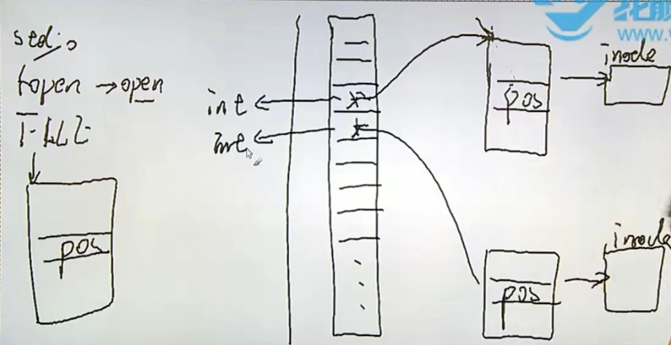

    linux_c入门_2.md
    
    :Author: kalipy
    :Email: kalipy@debian
    :Date: 2022-04-12 16:25
 
### 标准IO介绍

stdio:

    fopen();
    fclose();

    fgetc();
    fputc();
    fgets();
    fputs();
    fread();
    fwrite();

    printf();
    scanf();

    fseek();
    ftell();
    rewind();

    fflush();

### fopen函数1

man手册：

    NAME
           fopen, fdopen, freopen - stream open functions
    
    SYNOPSIS
           #include <stdio.h>
    
           FILE *fopen(const char *pathname, const char *mode);
    
           FILE *fdopen(int fd, const char *mode);
    
           FILE *freopen(const char *pathname, const char *mode, FILE *stream);

    CONFORMING TO
           fopen(), freopen(): POSIX.1-2001, POSIX.1-2008, C89, C99.
    
           fdopen(): POSIX.1-2001, POSIX.1-2008.

       The argument mode points to a string beginning with one of the following sequences (possibly followed by
       additional characters, as described below):

       r      Open text file for reading.  The stream is positioned at the beginning of the file.

       r+     Open for reading and writing.  The stream is positioned at the beginning of the file.

       w      Truncate  file  to  zero length or create text file for writing.  The stream is positioned at the
              beginning of the file.

       w+     Open for reading and writing.  The file is created if it does not exist, otherwise  it  is  trun-
              cated.  The stream is positioned at the beginning of the file.

       a      Open  for  appending  (writing  at  end of file).  The file is created if it does not exist.  The
              stream is positioned at the end of the file.

       a+     Open for reading and appending (writing at end of file).  The file is created if it does not  ex-
              ist.  The initial file position for reading is at the beginning of the file, but output is always
              appended to the end of the file.

       The mode string can also include the letter 'b' either as a last character or as a character between the
       characters in any of the two-character strings described above.  This is strictly for compatibility with
       C89 and has no effect; the 'b' is ignored on all POSIX conforming systems, including Linux.

       The  file  descriptor associated with the stream is opened as if by a call to open(2) with the following
       flags:

              +-------------+-------------------------------+
              |fopen() mode | open() flags                  |
              +-------------+-------------------------------+
              |     r       | O_RDONLY                      |
              +-------------+-------------------------------+
              |     w       | O_WRONLY | O_CREAT | O_TRUNC  |
              +-------------+-------------------------------+
              |     a       | O_WRONLY | O_CREAT | O_APPEND |
              +-------------+-------------------------------+
              |     r+      | O_RDWR                        |
              +-------------+-------------------------------+
              |     w+      | O_RDWR | O_CREAT | O_TRUNC    |
              +-------------+-------------------------------+
              |     a+      | O_RDWR | O_CREAT | O_APPEND   |
              +-------------+-------------------------------+

一个小问题：

    char *ptr = "abc";
    ptr[0] = 'x';

    ? or "xbc"

errno在这个地方：

kalipy@debian ~/g/linux_c入门> more /usr/include/asm-generic/errno.h

eg1.

    kalipy@debian ~/g/linux_c入门> more test.c
    #include <errno.h>
    
    errno;

    kalipy@debian ~/g/linux_c入门> gcc test.c -E
    # 37 "/usr/include/errno.h" 3 4
    extern int *__errno_location (void) __attribute__ ((__nothrow__ , __leaf__)) __attribute__ ((__const__));
    # 52 "/usr/include/errno.h" 3 4
    
    # 2 "test.c" 2
    
    (*__errno_location ())
    # 3 "test.c"
        ;

error并没有被替换成int等变量，说明现在它已经不是全局变量的实现了，而是私有宏，请看man手册：

       errno is defined by the ISO C standard to be a modifiable lvalue of type int, and must not be explicitly
       declared; errno may be a macro.  errno is thread-local; setting it in one thread  does  not  affect  its
       value in any other thread.

eg2.

    kalipy@debian ~/g/linux_c入门> more main.c
    #include <stdio.h>
    #include <stdlib.h>
    #include <errno.h>
    
    int main(void)
    {
        FILE *fp;
    
        fp = fopen("tmp", "r");
        if (fp == NULL)
        {
            fprintf(stderr, "fopen() failed! errno = %d\n", errno);
            exit(1);
        }
    
        puts("ok!");
    
        exit(0);
    }
    
    kalipy@debian ~/g/linux_c入门> gcc main.c
    kalipy@debian ~/g/linux_c入门> ./a.out
    fopen() failed! errno = 2


eg3(改进eg2).

man手册：

    NAME
           perror - print a system error message
    
    SYNOPSIS
           #include <stdio.h>
    
           void perror(const char *s);
    
           #include <errno.h>
    
           const char * const sys_errlist[];
           int sys_nerr;
           int errno;       /* Not really declared this way; see errno(3) */

kalipy@debian ~/g/linux_c入门> more main.c

    #include <stdio.h>
    #include <stdlib.h>
    #include <errno.h>
    
    int main(void)
    {
        FILE *fp;
    
        fp = fopen("tmp", "r");
        if (fp == NULL)
        {
            //fprintf(stderr, "fopen() failed! errno = %d\n", errno);
            perror("fopen()");
            exit(1);
        }
    
        puts("ok!");
    
        exit(0);
    }
    
    kalipy@debian ~/g/linux_c入门> gcc main.c
    kalipy@debian ~/g/linux_c入门> ./a.out
    fopen(): No such file or directory

eg4(方法三).

man手册:

```
NAME
       strerror, strerror_r, strerror_l - return string describing error number

SYNOPSIS
       #include <string.h>

       char *strerror(int errnum);

       int strerror_r(int errnum, char *buf, size_t buflen);
                   /* XSI-compliant */

       char *strerror_r(int errnum, char *buf, size_t buflen);
```

kalipy@debian ~/g/linux_c入门> more main.c

    #include <stdio.h>
    #include <stdlib.h>
    #include <errno.h> 
    #include <string.h> 
    
    int main(void)
    {
        FILE *fp;
    
        fp = fopen("tmp", "r");
        if (fp == NULL)
        {
            //fprintf(stderr, "fopen() failed! errno = %d\n", errno);
            //perror("fopen()");
            fprintf(stderr, "fopen():%s\n", strerror(errno));
            exit(1);
        }
    
        puts("ok!");
    
        exit(0);
    }
    
    kalipy@debian ~/g/linux_c入门> gcc main.c
    kalipy@debian ~/g/linux_c入门> ./a.out
    fopen():No such file or directory

eg5.

man手册：

```
NAME
       fclose - close a stream

SYNOPSIS
       #include <stdio.h>

       int fclose(FILE *stream);

DESCRIPTION
       The  fclose()  function  flushes the stream pointed to by stream (writing any buffered output data using
       fflush(3)) and closes the underlying file descriptor.

       The behaviour of fclose() is undefined if the stream parameter is an illegal pointer, or is a descriptor
       already passed to a previous invocation of fclose().

RETURN VALUE
       Upon  successful completion, 0 is returned.  Otherwise, EOF is returned and errno is set to indicate the
       error.  In either case, any further access (including another call to fclose()) to the stream results in
       undefined behavior.
```

eg6.

    kalipy@debian ~/g/linux_c入门> touch tmp
    kalipy@debian ~/g/linux_c入门> more main.c
    #include <stdio.h>
    #include <stdlib.h>
    #include <errno.h> 
    #include <string.h> 
    
    int main(void)
    {
        int count = 0;
        FILE *fp = NULL;
    
        while (1)
        {
            fp = fopen("tmp", "r");
            if (fp == NULL)
            {
                perror("fopen()");
                break;
            }
            count++;
        }
    
        printf("count = %d\n", count);
    
        exit(0);
    }
    
    kalipy@debian ~/g/linux_c入门> gcc main.c

kalipy@debian ~/g/linux_c入门> ./a.out

    fopen(): Too many open files
    count = 1021

kalipy@debian ~/g/linux_c入门> ulimit -a

    Maximum size of core files created                           (kB, -c) 0
    Maximum size of a process’s data segment                     (kB, -d) unlimited
    Maximum size of files created by the shell                   (kB, -f) unlimited
    Maximum size that may be locked into memory                  (kB, -l) 65536
    Maximum resident set size                                    (kB, -m) unlimited
    Maximum number of open file descriptors                          (-n) 1024
    Maximum stack size                                           (kB, -s) 8192
    Maximum amount of cpu time in seconds                   (seconds, -t) unlimited
    Maximum number of processes available to a single user           (-u) 47478
    Maximum amount of virtual memory available to the shell      (kB, -v) unlimited

### fgetc和fputc

eg1.

实现一个：

    ./mycpy srcfile destfile

第一步:

int main(void)
{
    fopen();
    fopen();

    while (1)
    {
        fgetc();
        fputc();
    }

    fclose();
    fclose();

    exit(0);
}

第二步：

    kalipy@debian ~/g/linux_c入门> more main.c
    #include <stdio.h>
    #include <stdlib.h>
    #include <errno.h> 
    
    int main(int argc, char **argv)
    {
        FILE *fps, *fpd;
        int ch;
    
        fps = fopen(argv[1], "r");
        if (fps == NULL)
        {
            perror("fopen()");
            exit(1);
        }
    
        fpd = fopen(argv[2], "w");
        if (fpd == NULL)
        {
            perror("fopen()");
            exit(1);
        }
    
        while (1)
        {
            ch = fgetc(fps);
            if (ch == EOF)
                break;
            fputc(ch, fpd);
        }
    
        fclose(fpd);
        fclose(fps);
    
        exit(0);
    }
    
kalipy@debian ~/g/linux_c入门> gcc main.c

    kalipy@debian ~/g/linux_c入门> ./a.out
    fopen(): Bad address
    kalipy@debian ~/g/linux_c入门> ls
    a.out*  main.c  tmp
    kalipy@debian ~/g/linux_c入门> ./a.out ./tmp tmp_dest
    kalipy@debian ~/g/linux_c入门> diff tmp tmp_dest

eg2.

eg1的不足：

    kalipy@debian ~/g/linux_c入门> ./a.out
    fopen(): Bad address

改进：

    kalipy@debian ~/g/linux_c入门> more main.c
    #include <stdio.h>
    #include <stdlib.h>
    #include <errno.h> 
    
    int main(int argc, char **argv)
    {
        FILE *fps, *fpd;
        int ch;
    
        if (argc < 3)
        {
            fprintf(stderr, "Usage:%s <src_file> <dest_file>", argv[0]);
            exit(1);
        }
    
        fps = fopen(argv[1], "r");
        if (fps == NULL)
        {
            perror("fopen()");
            exit(1);
        }
    
        fpd = fopen(argv[2], "w");
        if (fpd == NULL)
        {
            perror("fopen()");
            exit(1);
        }
    
        while (1)
        {
            ch = fgetc(fps);
            if (ch == EOF)
                break;
            fputc(ch, fpd);
        }
    
        fclose(fpd);
        fclose(fps);
    
        exit(0);
    }
    
    kalipy@debian ~/g/linux_c入门> gcc main.c
    kalipy@debian ~/g/linux_c入门> ./a.out
    Usage:./a.out <src_file> <dest_file>⏎ 


eg2.1(方法二).

    kalipy@debian ~/g/linux_c入门> more main.c
    #include <stdio.h>
    #include <stdlib.h>
    #include <errno.h> 
    
    #define BUFSIZE 1024
    
    int main(int argc, char **argv)
    {
        FILE *fps, *fpd;
        char buf[BUFSIZE];
    
        if (argc < 3)
        {
            fprintf(stderr, "USage:%s <src_file> <dest_file>\n", argv[0]);
            exit(1);
        }
    
        fps = fopen(argv[1], "r");
        if (fps == NULL)
        {
            perror("fopen()");
            exit(1);
        }
    
        fpd = fopen(argv[2], "w");
        if (fpd == NULL)
        {
            perror("fopen()");
            exit(1);
        }
    
        while (fgets(buf, BUFSIZE, fps) != NULL)
            fputs(buf, fpd);
    
        fclose(fpd);
        fclose(fps);
    
        exit(0);
    }
    kalipy@debian ~/g/linux_c入门> gcc main.c
    kalipy@debian ~/g/linux_c入门> ./a.out tmp tmp_dest 
    kalipy@debian ~/g/linux_c入门> diff tmp tmp_dest

注意：

    #define SIZE 5
    char buf[SIZE];
    fgets(buf, SIZE, stream);

    size-1
    '\n'

    abcd
    1-> a b c d '\0'
    2-> '\n' '\0' ...?

man手册解决：

```
       fgets()  reads  in  at  most  one  less than size characters from stream and stores them into the buffer
       pointed to by s.  Reading stops after an EOF or a newline.  If a newline is read, it is stored into  the
       buffer.  A terminating null byte ('\0') is stored after the last character in the buffer.
```

eg3(统计字符个数).

    kalipy@debian ~/g/linux_c入门> more main.c
    #include <stdio.h>
    #include <stdlib.h>
    #include <errno.h> 
    
    int main(int argc, char **argv)
    {
        FILE *fp;
        int count = 0;
    
        if (argc < 2)
        {
            fprintf(stderr, "Usage...\n");
            exit(1);
        }
    
        fp = fopen(argv[1], "r");
        if (fp == NULL)
        {
            perror("fopen()");
            exit(1);
        }
    
        while (fgetc(fp) != EOF)
        {
            count++;
        }
    
        printf("count = %d\n", count);
    
        fclose(fp);
    
        exit(0);
    }
    
    kalipy@debian ~/g/linux_c入门> gcc main.c
    kalipy@debian ~/g/linux_c入门> ./a.out tmp
    count = 4
    kalipy@debian ~/g/linux_c入门> ll tmp
    -rw-r--r-- 1 kalipy kalipy 4 4月  12 17:22 tmp
    kalipy@debian ~/g/linux_c入门> more tmp
    abc


### fread和fwrite

man手册：

```
NAME
       fread, fwrite - binary stream input/output

SYNOPSIS
       #include <stdio.h>

       size_t fread(void *ptr, size_t size, size_t nmemb, FILE *stream);

       size_t fwrite(const void *ptr, size_t size, size_t nmemb,
                     FILE *stream);

DESCRIPTION
       The  function  fread()  reads  nmemb  items of data, each size bytes long, from the stream pointed to by
       stream, storing them at the location given by ptr.

       The function fwrite() writes nmemb items of data, each size bytes long, to  the  stream  pointed  to  by
       stream, obtaining them from the location given by ptr.

RETURN VALUE
       On  success,  fread()  and  fwrite() return the number of items read or written.  This number equals the
       number of bytes transferred only when size is 1.  If an error occurs, or the end of the file is reached,
       the return value is a short item count (or zero).

       fread()  does  not distinguish between end-of-file and error, and callers must use feof(3) and ferror(3)
       to determine which occurred.
```

注意：

fread(buf, size, nmemb, fp);

1->数据量足够
2->只有5个字节

fread(buf, 1, 10, fp);
1-> 10(函数返回值:读到的nmemb) -> 10字节
2-> 5(函数返回值) -> 5字节

fread(buf, 10, 1, fp);
1-> 1 -> 10字节
2-> 0 -> ??

综上：

推荐用fread(buf, 1, xx, fp);

eg1.

    kalipy@debian ~/g/linux_c入门> cp mycpy_fgets.c mycpy_fread.c
    kalipy@debian ~/g/linux_c入门> more main.c
    #include <stdio.h>
    #include <stdlib.h>
    #include <errno.h> 
    
    #define BUFSIZE 1024
    
    int main(int argc, char **argv)
    {
        FILE *fps, *fpd;
        char buf[BUFSIZE];
        int n;
    
        if (argc < 3)
        {
            fprintf(stderr, "USage:%s <src_file> <dest_file>\n", argv[0]);
            exit(1);
        }
    
        fps = fopen(argv[1], "r");
        if (fps == NULL)
        {
            perror("fopen()");
            exit(1);
        }
    
        fpd = fopen(argv[2], "w");
        if (fpd == NULL)
        {
            perror("fopen()");
            exit(1);
        }
    
        while ((n = fread(buf, 1, BUFSIZE, fps)) > 0)
            fwrite(buf, 1, n, fpd);
    
        fclose(fpd);
        fclose(fps);
    
        exit(0);
    }
    kalipy@debian ~/g/linux_c入门> gcc main.c
    kalipy@debian ~/g/linux_c入门> ./a.out tmp tmp_dest
    kalipy@debian ~/g/linux_c入门> diff tmp tmp_dest


### 标准IO printf和scanf函数族

man手册：

```
SYNOPSIS
       #include <stdio.h>

       int printf(const char *format, ...);
       int fprintf(FILE *stream, const char *format, ...);
       int dprintf(int fd, const char *format, ...);
       int sprintf(char *str, const char *format, ...);
       int snprintf(char *str, size_t size, const char *format, ...);

       #include <stdarg.h>

       int vprintf(const char *format, va_list ap);
       int vfprintf(FILE *stream, const char *format, va_list ap);
       int vdprintf(int fd, const char *format, va_list ap);
       int vsprintf(char *str, const char *format, va_list ap);
       int vsnprintf(char *str, size_t size, const char *format, va_list ap);

   Feature Test Macro Requirements for glibc (see feature_test_macros(7)):

       snprintf(), vsnprintf():
           _XOPEN_SOURCE >= 500 || _ISOC99_SOURCE ||
               || /* Glibc versions <= 2.19: */ _BSD_SOURCE
```

man手册：

```
NAME
       atoi, atol, atoll - convert a string to an integer

SYNOPSIS
       #include <stdlib.h>

       int atoi(const char *nptr);
       long atol(const char *nptr);
       long long atoll(const char *nptr);

   Feature Test Macro Requirements for glibc (see feature_test_macros(7)):

       atoll():
           __ISOC99_SOURCE ||
               || /* Glibc versions <= 2.19: */ _BSD_SOURCE || _SVID_SOURCE

DESCRIPTION
       The  atoi() function converts the initial portion of the string pointed to by nptr to int.  The behavior
       is the same as

           strtol(nptr, NULL, 10);

       except that atoi() does not detect errors.

       The atol() and atoll() functions behave the same as atoi(), except that they convert the initial portion
       of the string to their return type of long or long long.

RETURN VALUE
       The converted value.
```

man手册：

```
SYNOPSIS
       #include <stdio.h>

       int scanf(const char *format, ...);
       int fscanf(FILE *stream, const char *format, ...);
       int sscanf(const char *str, const char *format, ...);

       #include <stdarg.h>

       int vscanf(const char *format, va_list ap);
       int vsscanf(const char *str, const char *format, va_list ap);
       int vfscanf(FILE *stream, const char *format, va_list ap);
```

eg1.

    kalipy@debian ~/g/linux_c入门> more main.c
    #include <stdio.h>
    #include <stdlib.h>
    #include <errno.h> 
    
    int main(void)
    {
        char str[] = "123a456";
    
        printf("%d\n", atoi(str));
    
        exit(0);
    }
    kalipy@debian ~/g/linux_c入门> gcc main.c
    kalipy@debian ~/g/linux_c入门> ./a.out
    123

eg2.

    kalipy@debian ~/g/linux_c入门> more main.c
    #include <stdio.h>
    #include <stdlib.h>
    #include <errno.h> 
    
    int main(void)
    {
        char buf[1024];
        int year = 2222, month = 1, day = 2;
        sprintf(buf, "%d-%d-%d\n", year, month, day);
    
        puts(buf);
    
        exit(0);
    }
    kalipy@debian ~/g/linux_c入门> gcc main.c
    kalipy@debian ~/g/linux_c入门> ./a.out
    2222-1-2
    
    
### 标准IO fseeko和ftello

man手册:

```
NAME
       fgetpos, fseek, fsetpos, ftell, rewind - reposition a stream

SYNOPSIS
       #include <stdio.h>

       int fseek(FILE *stream, long offset, int whence);

       long ftell(FILE *stream);

       void rewind(FILE *stream);

       int fgetpos(FILE *stream, fpos_t *pos);

       int fsetpos(FILE *stream, const fpos_t *pos);

DESCRIPTION
       The  fseek() function sets the file position indicator for the stream pointed to by stream.  The new po-
       sition, measured in bytes, is obtained by adding offset bytes to the position specified by  whence.   If
       whence  is  set to SEEK_SET, SEEK_CUR, or SEEK_END, the offset is relative to the start of the file, the
       current position indicator, or end-of-file, respectively.  A successful call  to  the  fseek()  function
       clears  the end-of-file indicator for the stream and undoes any effects of the ungetc(3) function on the
       same stream.

       The ftell() function obtains the current value of the file position indicator for the stream pointed  to
       by stream.

       The rewind() function sets the file position indicator for the stream pointed to by stream to the begin-
       ning of the file.  It is equivalent to:

              (void) fseek(stream, 0L, SEEK_SET)

       except that the error indicator for the stream is also cleared (see clearerr(3)).

       The fgetpos() and fsetpos() functions are alternate interfaces equivalent to ftell() and  fseek()  (with
       whence  set  to SEEK_SET), setting and storing the current value of the file offset into or from the ob-
       ject referenced by pos.  On some non-UNIX systems, an fpos_t object may be a complex  object  and  these
       routines may be the only way to portably reposition a text stream.

RETURN VALUE
       The  rewind()  function returns no value.  Upon successful completion, fgetpos(), fseek(), fsetpos() re-
       turn 0, and ftell() returns the current offset.  Otherwise, -1 is returned and errno is set to  indicate
       the error.
```

man手册：

```
NAME
       fseeko, ftello - seek to or report file position

SYNOPSIS
       #include <stdio.h>

       int fseeko(FILE *stream, off_t offset, int whence);

       off_t ftello(FILE *stream);

DESCRIPTION
       The fseeko() and ftello() functions are identical to fseek(3) and ftell(3) (see fseek(3)), respectively,
       except that the offset argument of fseeko() and the return value of ftello() is of type off_t instead of
       long.

       On  some  architectures,  both  off_t and long are 32-bit types, but defining _FILE_OFFSET_BITS with the
       value 64 (before including any header files) will turn off_t into a 64-bit type.

RETURN VALUE
       On successful completion, fseeko() returns 0, while ftello() returns the current offset.  Otherwise,  -1
       is returned and errno is set to indicate the error.
```

注意：

       On  some  architectures,  both  off_t and long are 32-bit types, but defining _FILE_OFFSET_BITS with the
       value 64 (before including any header files) will turn off_t into a 64-bit type.

这样使用：

    gcc a.c -o a -D_FILE_OFFSET_BITS=64

或者makefile中：

    CFLAGS+=-D_FILE_OFFSET_BITS=64

eg1(统计字符个数).

    kalipy@debian ~/g/linux_c入门> more main.c 
    #include <stdio.h>
    #include <stdlib.h>
    #include <errno.h> 
    
    int main(int argc, char **argv)
    {
        FILE *fp;
        int count = 0;
    
        if (argc < 2)
        {
            fprintf(stderr, "Usage...\n");
            exit(1);
        }
    
    //方法二
        fp = fopen(argv[1], "r");
        if (fp == NULL)
        {
            perror("fopen()");
            exit(1);
        }
    
        fseek(fp, 0, SEEK_END);
    
        printf("%ld\n", ftell(fp));
    
    //方法一
    #if 0
        fp = fopen(argv[1], "r");
        if (fp == NULL)
        {
            perror("fopen()");
            exit(1);
        }
    
        while (fgetc(fp) != EOF)
        {
            count++;
        }
    
        printf("count = %d\n", count);
    #endif
    
        fclose(fp);
    
        exit(0);
    }
    kalipy@debian ~/g/linux_c入门> gcc main.c
    kalipy@debian ~/g/linux_c入门> ./a.out tmp
    4
    kalipy@debian ~/g/linux_c入门> ll tmp
    -rw-r--r-- 1 kalipy kalipy 4 4月  12 17:22 tmp
    kalipy@debian ~/g/linux_c入门> more tmp
    abc


### 标准IO 文件位置函数和缓冲区刷新函数

eg1.

    kalipy@debian ~/g/linux_c入门> more fflush.c 
    #include <stdio.h>
    #include <stdlib.h>
    #include <errno.h> 
    
    int main(int argc, char **argv)
    {
        int i;
    
        printf("before while()");
    
        while (1);
    
        printf("after while()");
    
        exit(0);
    }
    kalipy@debian ~/g/linux_c入门> gcc fflush.c 
    kalipy@debian ~/g/linux_c入门> ./a.out
    ^C⏎ 
    
eg2.

    kalipy@debian ~/g/linux_c入门> more fflush.c
    #include <stdio.h>
    #include <stdlib.h>
    #include <errno.h> 
    
    int main(int argc, char **argv)
    {
        int i;
    
        printf("before while()\n");
    
        while (1);
    
        printf("after while()\n");
    
        exit(0);
    }
    kalipy@debian ~/g/linux_c入门> gcc fflush.c
    kalipy@debian ~/g/linux_c入门> ./a.out
    before while()
    ^C⏎  
    

man手册：

```
NAME
       fflush - flush a stream

SYNOPSIS
       #include <stdio.h>

       int fflush(FILE *stream);

DESCRIPTION
       For  output streams, fflush() forces a write of all user-space buffered data for the given output or up-
       date stream via the stream's underlying write function.

       For input streams associated with seekable files  (e.g.,  disk  files,  but  not  pipes  or  terminals),
       fflush()  discards  any  buffered  data that has been fetched from the underlying file, but has not been
       consumed by the application.

       The open status of the stream is unaffected.

       If the stream argument is NULL, fflush() flushes all open output streams.

       For a nonlocking counterpart, see unlocked_stdio(3).

RETURN VALUE
       Upon successful completion 0 is returned.  Otherwise, EOF is returned and errno is set to  indicate  the
       error.
```

eg1.

    kalipy@debian ~/g/linux_c入门> more fflush.c
    #include <stdio.h>
    #include <stdlib.h>
    #include <errno.h> 
    
    int main(int argc, char **argv)
    {
        int i;
    
        printf("before while()");
        fflush(stdout);
    
        while (1);
    
        printf("after while()");
        fflush(NULL);
    
        exit(0);
    }
    kalipy@debian ~/g/linux_c入门> gcc fflush.c
    kalipy@debian ~/g/linux_c入门> ./a.out
    before while()^C⏎  

缓冲区的作用：大多数情况是好事，合并系统调用

行缓存：换行的时候刷新，满了的时候刷新，强制刷新(标准输出是如此，因为是终端设备)

全缓冲：满了的时候刷新，强制刷新(默认，只要不是终端设备)

无缓冲：如stderr，需要立即输出的内容

man手册：

```
NAME
       stdin, stdout, stderr - standard I/O streams

SYNOPSIS
       #include <stdio.h>

       extern FILE *stdin;
       extern FILE *stdout;
       extern FILE *stderr;
```

怎么修改默认缓冲？man手册：

```
NAME
       setbuf, setbuffer, setlinebuf, setvbuf - stream buffering operations

SYNOPSIS
       #include <stdio.h>

       void setbuf(FILE *stream, char *buf);

       void setbuffer(FILE *stream, char *buf, size_t size);

       void setlinebuf(FILE *stream);

       int setvbuf(FILE *stream, char *buf, int mode, size_t size);

   Feature Test Macro Requirements for glibc (see feature_test_macros(7)):

       setbuffer(), setlinebuf():
           Since glibc 2.19:
               _DEFAULT_SOURCE
           Glibc 2.19 and earlier:
               _BSD_SOURCE

DESCRIPTION
       The  three types of buffering available are unbuffered, block buffered, and line buffered.  When an out-
       put stream is unbuffered, information appears on the destination file or terminal as  soon  as  written;
       when  it is block buffered many characters are saved up and written as a block; when it is line buffered
       characters are saved up until a newline is output or input is read from any stream attached to a  termi-
       nal  device  (typically  stdin).  The function fflush(3) may be used to force the block out early.  (See
       fclose(3).)

       Normally all files are block buffered.  If a stream refers to a terminal (as stdout normally  does),  it
       is line buffered.  The standard error stream stderr is always unbuffered by default.

       The  setvbuf()  function may be used on any open stream to change its buffer.  The mode argument must be
       one of the following three macros:

              _IONBF unbuffered

              _IOLBF line buffered

              _IOFBF fully buffered

       Except for unbuffered files, the buf argument should point to a buffer at least size  bytes  long;  this
       buffer  will  be  used instead of the current buffer.  If the argument buf is NULL, only the mode is af-
       fected; a new buffer will be allocated on the next read or write operation.  The setvbuf() function  may
       be used only after opening a stream and before any other operations have been performed on it.

       The  other  three calls are, in effect, simply aliases for calls to setvbuf().  The setbuf() function is
       exactly equivalent to the call

           setvbuf(stream, buf, buf ? _IOFBF : _IONBF, BUFSIZ);

       The setbuffer() function is the same, except that the size of the buffer is up  to  the  caller,  rather
       than  being  determined  by  the default BUFSIZ.  The setlinebuf() function is exactly equivalent to the
       call:

           setvbuf(stream, NULL, _IOLBF, 0);

RETURN VALUE
       The function setvbuf() returns 0 on success.  It returns nonzero on failure (mode is invalid or the  re-
       quest cannot be honored).  It may set errno on failure.

       The other functions do not return a value.
```

man手册：

```
NAME
       getline, getdelim - delimited string input

SYNOPSIS
       #include <stdio.h>

       ssize_t getline(char **lineptr, size_t *n, FILE *stream);

       ssize_t getdelim(char **lineptr, size_t *n, int delim, FILE *stream);

DESCRIPTION
       getline()  reads  an entire line from stream, storing the address of the buffer containing the text into
       *lineptr.  The buffer is null-terminated and includes the newline character, if one was found.

       If *lineptr is set to NULL and *n is set 0 before the call, then getline() will allocate  a  buffer  for
       storing the line.  This buffer should be freed by the user program even if getline() failed.

       Alternatively,  before calling getline(), *lineptr can contain a pointer to a malloc(3)-allocated buffer
       *n bytes in size.  If the buffer is not large enough to hold the line, getline() resizes it  with  real-
       loc(3), updating *lineptr and *n as necessary.

       In  either case, on a successful call, *lineptr and *n will be updated to reflect the buffer address and
       allocated size respectively.

       getdelim() works like getline(), except that a line delimiter other than newline can be specified as the
       delimiter argument.  As with getline(), a delimiter character is not added if one was not present in the
       input before end of file was reached.

RETURN VALUE
       On success, getline() and getdelim() return the number of characters read, including the delimiter char-
       acter,  but  not  including the terminating null byte ('\0').  This value can be used to handle embedded
       null bytes in the line read.

       Both functions return -1 on failure to read a line (including end-of-file condition).  In the  event  of
       an error, errno is set to indicate the cause.
```

eg1.

    kalipy@debian ~/g/linux_c入门> more makefile 
    CFLAGS+=-D_FILE_OFFSET_BITS=64 -D_GNU_SOURCE
    kalipy@debian ~/g/linux_c入门> make getline
    cc -D_FILE_OFFSET_BITS=64 -D_GNU_SOURCE    getline.c   -o getline
    kalipy@debian ~/g/linux_c入门> more getline.c 
    #include <stdio.h>
    #include <stdlib.h>
    #include <errno.h> 
    #include <string.h> 
    
    int main(int argc, char **argv)
    {
        FILE *fp;
        char *linebuf;
        size_t linesize;
    
        if (argc < 2)
        {
            fprintf(stderr, "Usage...");
            exit(1);
        }
    
        fp = fopen(argv[1], "r");
        if (fp == NULL)
        {
            perror("fopen()");
            exit(1);
        }
    
        while (1)
        {
            if (getline(&linebuf, &linesize, fp) < 0)
                break;
    
            printf("%d\n", strlen(linebuf));
        }
    
        fclose(fp);
    
        exit(0);
    }
    kalipy@debian ~/g/linux_c入门> ./getline tmp 
    4
    1
    4
    kalipy@debian ~/g/linux_c入门> more tmp
    abc
    
    123


eg2(错误写法).

    kalipy@debian ~/g/linux_c入门> more getline.c 
    #include <stdio.h>
    #include <stdlib.h>
    #include <errno.h> 
    #include <string.h> 
    
    int main(int argc, char **argv)
    {
        FILE *fp;
        char *linebuf;
        size_t linesize;
    
        if (argc < 2)
        {
            fprintf(stderr, "Usage...");
            exit(1);
        }
    
        fp = fopen(argv[1], "r");
        if (fp == NULL)
        {
            perror("fopen()");
            exit(1);
        }
    
        while (1)
        {
            if (getline(&linebuf, &linesize, fp) < 0)
                break;
    
            printf("linebuf_strlen:%d\n", strlen(linebuf));
            printf("linesize:%d\n", linesize);
        }
    
        fclose(fp);
    
        exit(0);
    }
    kalipy@debian ~/g/linux_c入门> make getline
    cc -D_FILE_OFFSET_BITS=64 -D_GNU_SOURCE    getline.c   -o getline
    kalipy@debian ~/g/linux_c入门> ./getline tmp
    linebuf_strlen:4
    linesize:-1577439040
    linebuf_strlen:1
    linesize:-1577439040
    linebuf_strlen:4
    linesize:-1577439040

eg3(正确写法，加上初始化).

    kalipy@debian ~/g/linux_c入门> more getline.c
    #include <stdio.h>
    #include <stdlib.h>
    #include <errno.h> 
    #include <string.h> 
    
    int main(int argc, char **argv)
    {
        FILE *fp;
        char *linebuf;
        size_t linesize;
    
        if (argc < 2)
        {
            fprintf(stderr, "Usage...");
            exit(1);
        }
    
        fp = fopen(argv[1], "r");
        if (fp == NULL)
        {
            perror("fopen()");
            exit(1);
        }
    
        //!!!!!!
        linebuf = NULL;
        linesize = 0;
    
        while (1)
        {
            if (getline(&linebuf, &linesize, fp) < 0)
                break;
    
            printf("linebuf_strlen:%d\n", strlen(linebuf));
            printf("linesize:%d\n", linesize);
        }
    
        fclose(fp);
        //free(linebuf);
    
        exit(0);
    }
    kalipy@debian ~/g/linux_c入门> make getline
    cc -D_FILE_OFFSET_BITS=64 -D_GNU_SOURCE    getline.c   -o getline
    kalipy@debian ~/g/linux_c入门> ./getline tmp
    linebuf_strlen:4
    linesize:120
    linebuf_strlen:1
    linesize:120
    linebuf_strlen:4
    linesize:120
    
getline的实现是malloc和realloc

问题：上面的由于并没有提供给我们free(linebuf)函数，所以会有linesize个字节的内存泄漏的bug

而在其它平台，getline的实现却不一定是malloc，所以我们也不能自作聪明用free释放内存

总之这就是个bug

### 标准IO 临时文件

临时文件：

1. 如何不冲突

2. 及时销毁

tmpnam
tmpfile

man手册：

```
NAME
       tmpnam, tmpnam_r - create a name for a temporary file

SYNOPSIS
       #include <stdio.h>

       char *tmpnam(char *s);
       char *tmpnam_r(char *s);

   Feature Test Macro Requirements for glibc (see feature_test_macros(7)):

       tmpnam_r()
           Since glibc 2.19:
               _DEFAULT_SOURCE
           Up to and including glibc 2.19:
               _BSD_SOURCE || _SVID_SOURCE

DESCRIPTION
       Note: avoid using these functions; use mkstemp(3) or tmpfile(3) instead.

       The  tmpnam() function returns a pointer to a string that is a valid filename, and such that a file with
       this name did not exist at some point in time, so that naive programmers may think it  a  suitable  name
       for  a  temporary  file.  If the argument s is NULL, this name is generated in an internal static buffer
       and may be overwritten by the next call to tmpnam().  If s is not NULL, the name is copied to the  char-
       acter  array  (of  length at least L_tmpnam) pointed to by s and the value s is returned in case of suc-
       cess.

       The created pathname has a directory prefix P_tmpdir.   (Both  L_tmpnam  and  P_tmpdir  are  defined  in
       <stdio.h>, just like the TMP_MAX mentioned below.)

       The tmpnam_r() function performs the same task as tmpnam(), but returns NULL (to indicate an error) if s
       is NULL.

RETURN VALUE
       These functions return a pointer to a unique temporary filename, or NULL if a unique name cannot be gen-
       erated.

```

man手册：

```
NAME
       tmpfile - create a temporary file

SYNOPSIS
       #include <stdio.h>

       FILE *tmpfile(void);

DESCRIPTION
       The  tmpfile() function opens a unique temporary file in binary read/write (w+b) mode.  The file will be
       automatically deleted when it is closed or the program terminates.

RETURN VALUE
       The tmpfile() function returns a stream descriptor, or NULL if a unique filename cannot be generated  or
       the unique file cannot be opened.  In the latter case, errno is set to indicate the error.

ERRORS
       EACCES Search permission denied for directory in file's path prefix.

       EEXIST Unable to generate a unique filename.

       EINTR  The call was interrupted by a signal; see signal(7).

       EMFILE The per-process limit on the number of open file descriptors has been reached.

       ENFILE The system-wide limit on the total number of open files has been reached.

       ENOSPC There was no room in the directory to add the new filename.

       EROFS  Read-only filesystem.
```

说明：

tmpfile是原子性的，即获取名字和创建文件是原子步骤

而tmpname创建不是原子性的，其获取名字后，还要调用fopen来创建文件，会有并发问题

注意：

临时文件不是以`.`开头的隐藏文件

临时文件虽然在磁盘产生了，占用了空间，但是我们是看不到的

临时文件又叫匿名文件，是没有名字的文件

### 系统调用IO 文件描述符实现原理

文件IO/系统调用IO
fd是在文件IO中贯穿始终的存在

文件描述符的概念(整形数，数组下标)

文件IO操作:open, close, read, write, seek

文件IO与标准IO的区别

IO效率问题

文件共享

原子操作

程序中的重定向:dup, dup2

同步：sync, fsync, fdatasync

fcntl();

ioctl();

/dev/fd/目录：




说明：

fd0 fd1 fd2分别表示stdin stdout stderr

每个进程，都有一个fd数组，这个数组默认大小1024


说明：

对于同一个文件，对应同一个inode块

open打开同一个文件多次，会有多个结构体，这些结构体指向同一个inode，请看图中的fd3和fd5

close释放的是结构体，不释放inode


说明：

请再看fd4和fd6，我把fd4复制给fd6，这样二者都是指向同一个结构体了，我现在clsoe(fd4)，会不会释放结构体呢？不会，因为结构体中有fd指向次数的计数器，只要计数器不为0，结构体是不会释放的

注意：fopen打开产生的是FILE结构体(图中左边的)，二fopen又会调用open，open打开的才是fd指向的结构体(图中右边的)

### 系统调用IO open close

man手册：

```
NAME
       open, openat, creat - open and possibly create a file

SYNOPSIS
       #include <sys/types.h>
       #include <sys/stat.h>
       #include <fcntl.h>

       int open(const char *pathname, int flags);
       int open(const char *pathname, int flags, mode_t mode);

       int creat(const char *pathname, mode_t mode);

       int openat(int dirfd, const char *pathname, int flags);
       int openat(int dirfd, const char *pathname, int flags, mode_t mode);

RETURN VALUE
       open(), openat(), and creat() return the new file descriptor, or -1 if an error occurred (in which case,
       errno is set appropriately).
```

    r -> O_RDONLY
    r+ -> O_RDWR
    w -> O_WRONLY|O_CREAT|O_TRUNC
    w+ -> O_RDWR|O_TRUNC|O_CREAT

### 系统调用IO read write lseek 及mycopy实现

man手册：

```
NAME
       read - read from a file descriptor

SYNOPSIS
       #include <unistd.h>

       ssize_t read(int fd, void *buf, size_t count);

DESCRIPTION
       read() attempts to read up to count bytes from file descriptor fd into the buffer starting at buf.

       On  files  that support seeking, the read operation commences at the file offset, and the file offset is
       incremented by the number of bytes read.  If the file offset is at or past the end of file, no bytes are
       read, and read() returns zero.

       If  count  is  zero,  read() may detect the errors described below.  In the absence of any errors, or if
       read() does not check for errors, a read() with a count of 0 returns zero and has no other effects.

       According to POSIX.1, if count is greater than SSIZE_MAX,  the  result  is  implementation-defined;  see
       NOTES for the upper limit on Linux.

RETURN VALUE
       On  success, the number of bytes read is returned (zero indicates end of file), and the file position is
       advanced by this number.  It is not an error if this number is smaller than  the  number  of  bytes  re-
       quested; this may happen for example because fewer bytes are actually available right now (maybe because
       we were close to end-of-file, or because we are reading from a pipe, or from  a  terminal),  or  because
       read() was interrupted by a signal.  See also NOTES.

       On  error, -1 is returned, and errno is set appropriately.  In this case, it is left unspecified whether
       the file position (if any) changes.
```

man手册:

```
NAME
       write - write to a file descriptor

SYNOPSIS
       #include <unistd.h>

       ssize_t write(int fd, const void *buf, size_t count);

DESCRIPTION
       write() writes up to count bytes from the buffer starting at buf to the file referred to by the file de-
       scriptor fd.

       The number of bytes written may be less than count if, for example, there is insufficient space  on  the
       underlying physical medium, or the RLIMIT_FSIZE resource limit is encountered (see setrlimit(2)), or the
       call was interrupted by a signal handler  after  having  written  less  than  count  bytes.   (See  also
       pipe(7).)

       For  a  seekable  file (i.e., one to which lseek(2) may be applied, for example, a regular file) writing
       takes place at the file offset, and the file offset is incremented by the number of bytes actually writ-
       ten.   If  the file was open(2)ed with O_APPEND, the file offset is first set to the end of the file be-
       fore writing.  The adjustment of the file offset and the write operation  are  performed  as  an  atomic
       step.

       POSIX  requires  that a read(2) that can be proved to occur after a write() has returned will return the
       new data.  Note that not all filesystems are POSIX conforming.

       According to POSIX.1, if count is greater than SSIZE_MAX,  the  result  is  implementation-defined;  see
       NOTES for the upper limit on Linux.

RETURN VALUE
       On  success, the number of bytes written is returned (zero indicates nothing was written).  It is not an
       error if this number is smaller than the number of bytes requested; this may happen for example  because
       the disk device was filled.  See also NOTES.

       On error, -1 is returned, and errno is set appropriately.

       If count is zero and fd refers to a regular file, then write() may return a failure status if one of the
       errors below is detected.  If no errors are detected, or error detection is not performed, 0 will be re-
       turned  without causing any other effect.  If count is zero and fd refers to a file other than a regular
       file, the results are not specified.
```

man手册：

```
NAME
       lseek - reposition read/write file offset

SYNOPSIS
       #include <sys/types.h>
       #include <unistd.h>

       off_t lseek(int fd, off_t offset, int whence);

DESCRIPTION
       lseek()  repositions the file offset of the open file description associated with the file descriptor fd
       to the argument offset according to the directive whence as follows:

       SEEK_SET
              The file offset is set to offset bytes.

       SEEK_CUR
              The file offset is set to its current location plus offset bytes.

       SEEK_END
              The file offset is set to the size of the file plus offset bytes.

       lseek() allows the file offset to be set beyond the end of the file (but this does not change  the  size
       of  the  file).   If  data  is  later  written at this point, subsequent reads of the data in the gap (a
       "hole") return null bytes ('\0') until data is actually written into the gap.

   Seeking file data and holes
       Since version 3.1, Linux supports the following additional values for whence:

       SEEK_DATA
              Adjust the file offset to the next location in the file greater than or equal to offset  contain-
              ing data.  If offset points to data, then the file offset is set to offset.

       SEEK_HOLE
              Adjust  the  file offset to the next hole in the file greater than or equal to offset.  If offset
              points into the middle of a hole, then the file offset is set to offset.  If  there  is  no  hole
              past  offset, then the file offset is adjusted to the end of the file (i.e., there is an implicit
              hole at the end of any file).

       In both of the above cases, lseek() fails if offset points past the end of the file.

       These operations allow applications to map holes in a sparsely allocated file.  This can be  useful  for
       applications  such  as file backup tools, which can save space when creating backups and preserve holes,
       if they have a mechanism for discovering holes.

       For the purposes of these operations, a hole is a sequence of zeros that (normally) has not  been  allo-
       cated  in  the  underlying file storage.  However, a filesystem is not obliged to report holes, so these
       operations are not a guaranteed mechanism for mapping the storage space actually allocated  to  a  file.
       (Furthermore,  a  sequence  of zeros that actually has been written to the underlying storage may not be
       reported as a hole.)  In the simplest implementation, a filesystem can support the operations by  making
       SEEK_HOLE  always  return  the  offset of the end of the file, and making SEEK_DATA always return offset
       (i.e., even if the location referred to by offset is a hole, it can be considered  to  consist  of  data
       that is a sequence of zeros).

       The  _GNU_SOURCE  feature test macro must be defined in order to obtain the definitions of SEEK_DATA and
       SEEK_HOLE from <unistd.h>.

       The SEEK_HOLE and SEEK_DATA operations are supported for the following filesystems:

       *  Btrfs (since Linux 3.1)

       *  OCFS (since Linux 3.2)

       *  XFS (since Linux 3.5)

       *  ext4 (since Linux 3.8)

       *  tmpfs(5) (since Linux 3.8)

       *  NFS (since Linux 3.18)

       *  FUSE (since Linux 4.5)

RETURN VALUE
       Upon successful completion, lseek() returns the resulting offset location as measured in bytes from  the
       beginning  of the file.  On error, the value (off_t) -1 is returned and errno is set to indicate the er-
       ror.
```

eg1(mycopy实现).

    kalipy@debian ~/g/linux_c入门> more makefile
    CFLAGS+=-D_FILE_OFFSET_BITS=64 -D_GNU_SOURCE
    kalipy@debian ~/g/linux_c入门> more mycpy.c 
    #include <stdio.h>
    #include <stdlib.h>
    #include <errno.h> 
    #include <unistd.h> 
    #include <sys/types.h>
    #include <sys/stat.h>
    #include <fcntl.h>
    
    #define BUFSIZE 1024
    
    int main(int argc, char **argv)
    {
        int sfd, dfd;
        int ret, len;
        char buf[BUFSIZE];
    
        if (argc < 3)
        {
            fprintf(stderr, "Usage...");
            exit(1);
        }
    
        sfd = open(argv[1], O_RDONLY);
        if (sfd < 0)
        {
            perror("open()");
            exit(1);
        }
    
        dfd = open(argv[2], O_WRONLY | O_CREAT, O_TRUNC, 0600);
        if (dfd < 0)
        {
            close(sfd);
            perror("open()");
            exit(1);
        }
    
        while (1)
        {
            len = read(sfd, buf, BUFSIZE);
            if (len < 0)
            {
                perror("read()");
                break;
            }
            if (len == 0)
                break;
    
            ret = write(dfd, buf, len);
            if (ret < 0)
            {
                perror("write()");
                break;
            }
        }
    
        close(dfd);
        close(sfd);
    
        exit(0);
    }
    kalipy@debian ~/g/linux_c入门> more tmp 
    abc
    
    123
    kalipy@debian ~/g/linux_c入门> make mycpy
    cc -D_FILE_OFFSET_BITS=64 -D_GNU_SOURCE    mycpy.c   -o mycpy
    kalipy@debian ~/g/linux_c入门> ./mycpy tmp tmp_bak
    kalipy@debian ~/g/linux_c入门> more tmp_bak 
    more: cannot open tmp_bak: 权限不够
    kalipy@debian ~/g/linux_c入门> sudo more tmp_bak
    [sudo] kalipy 的密码：
    abc
    
    123
    
eg2.

    kalipy@debian ~/g/linux_c入门> more mycpy.c
    #include <stdio.h>
    #include <stdlib.h>
    #include <errno.h> 
    #include <unistd.h> 
    #include <sys/types.h>
    #include <sys/stat.h>
    #include <fcntl.h>
    
    #define BUFSIZE 1024
    
    int main(int argc, char **argv)
    {
        int sfd, dfd;
        int ret, len, pos;
        char buf[BUFSIZE];
    
        if (argc < 3)
        {
            fprintf(stderr, "Usage...");
            exit(1);
        }
    
        sfd = open(argv[1], O_RDONLY);
        if (sfd < 0)
        {
            perror("open()");
            exit(1);
        }
    
        dfd = open(argv[2], O_WRONLY | O_CREAT, O_TRUNC, 0600);
        if (dfd < 0)
        {
            close(sfd);
            perror("open()");
            exit(1);
        }
    
        while (1)
        {
            len = read(sfd, buf, BUFSIZE);
            if (len < 0)
            {
                perror("read()");
                break;
            }
            if (len == 0)
                break;
    
            pos = 0;
            while (len > 0)
            {
                ret = write(dfd, buf + pos, len);
                if (ret < 0)
                {
                    perror("write()");
                    exit(1);
                }
                pos += ret;
                len -= ret;
            }
    
        }
    
        close(dfd);
        close(sfd);
    
        exit(0);
    }
    kalipy@debian ~/g/linux_c入门> make mycpy
    cc -D_FILE_OFFSET_BITS=64 -D_GNU_SOURCE    mycpy.c   -o mycpy
    kalipy@debian ~/g/linux_c入门> ./mycpy tmp tmp_bak
    kalipy@debian ~/g/linux_c入门> diff tmp tmp_bak
    diff: tmp_bak: 权限不够
    kalipy@debian ~/g/linux_c入门> sudo diff tmp tmp_bak
    
说明：

防止比如读了10个字节，但是写10个字节时，只写了x<10个字节就出错了，那出错了我们就继续用while来读，直到把10个字节读完为止呗

### 系统IO和标准IO比较实例

文件IO与标准IO的区别

举例：传达室老大爷跑邮局
区别：响应速度&吞吐量
面试：如何使一个程序变快？
提醒：标准IO与文件IO不可以混用
转换：fileno, fdopen

eg3.

    kalipy@debian ~/g/linux_c入门> more main.c 
    #include <stdio.h>
    #include <stdlib.h>
    #include <errno.h> 
    #include <unistd.h> 
    
    int main(int argc, char **argv)
    {
        putchar('a');
        write(1, "b", 1);
    
        putchar('a');
        write(1, "b", 1);
    
        putchar('a');
        write(1, "b", 1);
    
        exit(0);
    }
    kalipy@debian ~/g/linux_c入门> ./a.out
    bbbaaa⏎ 
    kalipy@debian ~/g/linux_c入门> strace ./a.out
    execve("./a.out", ["./a.out"], 0x7ffc8657bd80 /* 63 vars */) = 0
    brk(NULL)                               = 0x55dd2858d000
    access("/etc/ld.so.preload", R_OK)      = -1 ENOENT (没有那个文件或目录)
    openat(AT_FDCWD, "/etc/ld.so.cache", O_RDONLY|O_CLOEXEC) = 3
    fstat(3, {st_mode=S_IFREG|0644, st_size=202184, ...}) = 0
    mmap(NULL, 202184, PROT_READ, MAP_PRIVATE, 3, 0) = 0x7fdf0ecf1000
    close(3)                                = 0
    openat(AT_FDCWD, "/lib/x86_64-linux-gnu/libc.so.6", O_RDONLY|O_CLOEXEC) = 3
    read(3, "\177ELF\2\1\1\3\0\0\0\0\0\0\0\0\3\0>\0\1\0\0\0\260A\2\0\0\0\0\0"..., 832) = 832
    fstat(3, {st_mode=S_IFREG|0755, st_size=1824496, ...}) = 0
    mmap(NULL, 8192, PROT_READ|PROT_WRITE, MAP_PRIVATE|MAP_ANONYMOUS, -1, 0) = 0x7fdf0ecef000
    mmap(NULL, 1837056, PROT_READ, MAP_PRIVATE|MAP_DENYWRITE, 3, 0) = 0x7fdf0eb2e000
    mprotect(0x7fdf0eb50000, 1658880, PROT_NONE) = 0
    mmap(0x7fdf0eb50000, 1343488, PROT_READ|PROT_EXEC, MAP_PRIVATE|MAP_FIXED|MAP_DENYWRITE, 3, 0x22000) = 0x7fdf0eb50000
    mmap(0x7fdf0ec98000, 311296, PROT_READ, MAP_PRIVATE|MAP_FIXED|MAP_DENYWRITE, 3, 0x16a000) = 0x7fdf0ec98000
    mmap(0x7fdf0ece5000, 24576, PROT_READ|PROT_WRITE, MAP_PRIVATE|MAP_FIXED|MAP_DENYWRITE, 3, 0x1b6000) = 0x7fdf0ece5000
    mmap(0x7fdf0eceb000, 14336, PROT_READ|PROT_WRITE, MAP_PRIVATE|MAP_FIXED|MAP_ANONYMOUS, -1, 0) = 0x7fdf0eceb000
    close(3)                                = 0
    arch_prctl(ARCH_SET_FS, 0x7fdf0ecf0500) = 0
    mprotect(0x7fdf0ece5000, 16384, PROT_READ) = 0
    mprotect(0x55dd27e7b000, 4096, PROT_READ) = 0
    mprotect(0x7fdf0ed4a000, 4096, PROT_READ) = 0
    munmap(0x7fdf0ecf1000, 202184)          = 0
    fstat(1, {st_mode=S_IFCHR|0600, st_rdev=makedev(0x88, 0x4), ...}) = 0
    brk(NULL)                               = 0x55dd2858d000
    brk(0x55dd285ae000)                     = 0x55dd285ae000
    write(1, "b", 1b)                        = 1
    write(1, "b", 1b)                        = 1
    write(1, "b", 1b)                        = 1
    write(1, "aaa", 3aaa)                      = 3
    exit_group(0)                           = ?
    +++ exited with 0 +++
    
说明：

putchar这种非系统调用有缓存：

    openat(AT_FDCWD, "/etc/ld.so.cache", O_RDONLY|O_CLOEXEC) = 3

系统调用无缓存：

    write(1, "b", 1b)                        = 1
    write(1, "b", 1b)                        = 1
    write(1, "b", 1b)                        = 1
    write(1, "aaa", 3aaa)                      = 3
    
    
IO的效率问题:

    kalipy@debian:~/gg/linux_c入门$ time ./a.out 
    bbbaaa
    real    0m0.003s
    user    0m0.003s
    sys     0m0.000s

习题：将mycpy.c程序进行更改，将BUFSIZE的值慢慢改大，并观察消耗的时间，注意性能拐点出现时的BUFSIZE值，以及何时程序会出问题

### 文件共享

文件共享：多个任务共同操作一个文件或协同完成任务


面试：写程序删除一个文件的第10行

方法一:

    while()
    {
        lseek 11 + read + lseek 10 + write
    }

方法二：

    1->open r ->fd1 -> lseek 11
    2->open r+ ->fd2 -> lseek 10

    while ()
    {
        1->fd1->read
        2->fd2->write
    }

方法三：

    process1 -> open -> r
    process2 -> open -> r+

    p1->read -> p2->write

补充函数：truncate/ftruncate

man手册：

```
NAME
       truncate, ftruncate - truncate a file to a specified length

SYNOPSIS
       #include <unistd.h>
       #include <sys/types.h>

       int truncate(const char *path, off_t length);
       int ftruncate(int fd, off_t length);
```

man手册：

```
NAME
       tmpnam, tmpnam_r - create a name for a temporary file

SYNOPSIS
       #include <stdio.h>

       char *tmpnam(char *s);
       char *tmpnam_r(char *s);

   Feature Test Macro Requirements for glibc (see feature_test_macros(7)):

       tmpnam_r()
           Since glibc 2.19:
               _DEFAULT_SOURCE
           Up to and including glibc 2.19:
               _BSD_SOURCE || _SVID_SOURCE

DESCRIPTION
       Note: avoid using these functions; use mkstemp(3) or tmpfile(3) instead.

       The  tmpnam() function returns a pointer to a string that is a valid filename, and such that a file with
       this name did not exist at some point in time, so that naive programmers may think it  a  suitable  name
       for  a  temporary  file.  If the argument s is NULL, this name is generated in an internal static buffer
       and may be overwritten by the next call to tmpnam().  If s is not NULL, the name is copied to the  char-
       acter  array  (of  length at least L_tmpnam) pointed to by s and the value s is returned in case of suc-
       cess.

       The created pathname has a directory prefix P_tmpdir.   (Both  L_tmpnam  and  P_tmpdir  are  defined  in
       <stdio.h>, just like the TMP_MAX mentioned below.)

       The tmpnam_r() function performs the same task as tmpnam(), but returns NULL (to indicate an error) if s
       is NULL.

RETURN VALUE
       These functions return a pointer to a unique temporary filename, or NULL if a unique name cannot be gen-
       erated.

ERRORS
       No errors are defined.

ATTRIBUTES
       For an explanation of the terms used in this section, see attributes(7).

       +-----------+---------------+--------------------------+
       |Interface  | Attribute     | Value                    |
       +-----------+---------------+--------------------------+
       |tmpnam()   | Thread safety | MT-Unsafe race:tmpnam/!s |
       +-----------+---------------+--------------------------+
       |tmpnam_r() | Thread safety | MT-Safe                  |
       +-----------+---------------+--------------------------+
CONFORMING TO
       tmpnam(): SVr4, 4.3BSD, C89, C99, POSIX.1-2001.  POSIX.1-2008 marks tmpnam() as obsolete.

       tmpnam_r() is a nonstandard extension that is also available on a few other systems.

```

### dup dup2和原子操作

man手册：

```
NAME
       dup, dup2, dup3 - duplicate a file descriptor

SYNOPSIS
       #include <unistd.h>

       int dup(int oldfd);
       int dup2(int oldfd, int newfd);

       #define _GNU_SOURCE             /* See feature_test_macros(7) */
       #include <fcntl.h>              /* Obtain O_* constant definitions */
       #include <unistd.h>

       int dup3(int oldfd, int newfd, int flags);

DESCRIPTION
       The dup() system call creates a copy of the file descriptor oldfd, using the lowest-numbered unused file
       descriptor for the new descriptor.

       After a successful return, the old and new file descriptors may be used interchangeably.  They refer  to
       the same open file description (see open(2)) and thus share file offset and file status flags; for exam-
       ple, if the file offset is modified by using lseek(2) on one of the file descriptors, the offset is also
       changed for the other.

       The two file descriptors do not share file descriptor flags (the close-on-exec flag).  The close-on-exec
       flag (FD_CLOEXEC; see fcntl(2)) for the duplicate descriptor is off.

   dup2()
       The dup2() system call performs the same task as dup(), but instead of using the lowest-numbered  unused
       file  descriptor,  it  uses the file descriptor number specified in newfd.  If the file descriptor newfd
       was previously open, it is silently closed before being reused.

       The steps of closing and reusing the file descriptor newfd are performed atomically.  This is important,
       because  trying  to implement equivalent functionality using close(2) and dup() would be subject to race
       conditions, whereby newfd might be reused between the two steps.  Such reuse could  happen  because  the
       main  program is interrupted by a signal handler that allocates a file descriptor, or because a parallel
       thread allocates a file descriptor.

       Note the following points:

       *  If oldfd is not a valid file descriptor, then the call fails, and newfd is not closed.

       *  If oldfd is a valid file descriptor, and newfd has the same value as oldfd, then dup2() does nothing,
          and returns newfd.

   dup3()
       dup3() is the same as dup2(), except that:

       *  The  caller  can  force  the  close-on-exec  flag to be set for the new file descriptor by specifying
          O_CLOEXEC in flags.  See the description of the same flag in open(2) for reasons why this may be use-
          ful.

       *  If oldfd equals newfd, then dup3() fails with the error EINVAL.

RETURN VALUE
       On  success,  these system calls return the new file descriptor.  On error, -1 is returned, and errno is
       set appropriately.
```

eg1.

    kalipy@debian ~/g/linux_c入门> more main.c
    #include <stdio.h>
    #include <stdlib.h>
    #include <errno.h> 
    #include <unistd.h> 
    #include <sys/types.h>
    #include <sys/stat.h>
    #include <fcntl.h>
    
    #define FNAME "./out"
    
    int main(int argc, char **argv)
    {
        int fd;
        close(1);
    
        fd = open(FNAME, O_WRONLY | O_CREAT | O_TRUNC, 0600);

        if (fd < 0)
        {
            perror("open()");
            exit(1);
        }
    
        //***********************************
        
        puts("hello!");
    
        exit(0);
    }
    kalipy@debian ~/g/linux_c入门> gcc main.c
    kalipy@debian ~/g/linux_c入门> ./a.out
    kalipy@debian ~/g/linux_c入门> cat out 
    hello!

eg2.

    kalipy@debian ~/g/linux_c入门> more main.c
    #include <stdio.h>
    #include <stdlib.h>
    #include <errno.h> 
    #include <unistd.h> 
    #include <sys/types.h>
    #include <sys/stat.h>
    #include <fcntl.h>
    
    #define FNAME "./out"
    
    int main(int argc, char **argv)
    {
        int fd;
        close(1);
    
        fd = open(FNAME, O_WRONLY | O_CREAT | O_TRUNC, 0600);
    
        printf("%d\n", fd);
    
        if (fd < 0)
        {
            perror("open()");
            exit(1);
        }
    
        //***********************************
        
        puts("hello!");
    
        exit(0);
    }
    kalipy@debian ~/g/linux_c入门> gcc main.c
    kalipy@debian ~/g/linux_c入门> ./a.out
    kalipy@debian ~/g/linux_c入门> cat out
    1
    hello!
    


eg3.

    kalipy@debian ~/g/linux_c入门> more main.c
    #include <stdio.h>
    #include <stdlib.h>
    #include <errno.h> 
    #include <unistd.h> 
    #include <sys/types.h>
    #include <sys/stat.h>
    #include <fcntl.h>
    
    #define FNAME "./out"
    
    int main(int argc, char **argv)
    {
        int fd;
    
        fd = open(FNAME, O_WRONLY | O_CREAT | O_TRUNC, 0600);
        if (fd < 0)
        {
            perror("open()");
            exit(1);
        }
    
        close(1);
        dup(fd);
    
        //***********************************
        
        puts("hello!");
    
        exit(0);
    }
    kalipy@debian ~/g/linux_c入门> gcc main.c
    kalipy@debian ~/g/linux_c入门> ./a.out
    kalipy@debian ~/g/linux_c入门> cat out
    hello!

eg4.

    kalipy@debian ~/g/linux_c入门> more main.c
    #include <stdio.h>
    #include <stdlib.h>
    #include <errno.h> 
    #include <unistd.h> 
    #include <sys/types.h>
    #include <sys/stat.h>
    #include <fcntl.h>
    
    #define FNAME "./out"
    
    int main(int argc, char **argv)
    {
        int fd;
    
        fd = open(FNAME, O_WRONLY | O_CREAT | O_TRUNC, 0600);
        if (fd < 0)
        {
            perror("open()");
            exit(1);
        }
    
        //close(1);
        //dup(fd);
        dup2(fd, 1);//dup2是为了防止close(1)和dup(fd)非原子性执行
        close(fd);
    
        //***********************************
        
        puts("hello!");
    
        exit(0);
    }
    kalipy@debian ~/g/linux_c入门> gcc main.c
    kalipy@debian ~/g/linux_c入门> ./a.out
    kalipy@debian ~/g/linux_c入门> cat out
    hello!

eg5(最终推荐写法).

    kalipy@debian ~/g/linux_c入门> more main.c
    #include <stdio.h>
    #include <stdlib.h>
    #include <errno.h> 
    #include <unistd.h> 
    #include <sys/types.h>
    #include <sys/stat.h>
    #include <fcntl.h>
    
    #define FNAME "./out"
    
    int main(int argc, char **argv)
    {
        int fd;
    
        fd = open(FNAME, O_WRONLY | O_CREAT | O_TRUNC, 0600);
        if (fd < 0)
        {
            perror("open()");
            exit(1);
        }
    
        //close(1);
        //dup(fd);
        dup2(fd, 1);
    
        if (fd != 1)
            close(fd);
    
        //***********************************
        
        puts("hello!");
    
        exit(0);
    }
    kalipy@debian ~/g/linux_c入门> gcc main.c
    kalipy@debian ~/g/linux_c入门> ./a.out
    kalipy@debian ~/g/linux_c入门> cat out
    hello!

### fcntl和ioctl

man手册：

```
NAME
       sync, syncfs - commit filesystem caches to disk

SYNOPSIS
       #include <unistd.h>

       void sync(void);

       int syncfs(int fd);

   Feature Test Macro Requirements for glibc (see feature_test_macros(7)):

       sync():
           _XOPEN_SOURCE >= 500
               || /* Since glibc 2.19: */ _DEFAULT_SOURCE
               || /* Glibc versions <= 2.19: */ _BSD_SOURCE

       syncfs():
           _GNU_SOURCE

DESCRIPTION
       sync() causes all pending modifications to filesystem metadata and cached file data to be written to the
       underlying filesystems.

       syncfs() is like sync(), but synchronizes just the filesystem containing file referred to  by  the  open
       file descriptor fd.

RETURN VALUE
       syncfs() returns 0 on success; on error, it returns -1 and sets errno to indicate the error.
```

man手册：

```
NAME
       fsync, fdatasync - synchronize a file's in-core state with storage device

SYNOPSIS
       #include <unistd.h>

       int fsync(int fd);

       int fdatasync(int fd);

   Feature Test Macro Requirements for glibc (see feature_test_macros(7)):

       fsync():
           Glibc 2.16 and later:
               No feature test macros need be defined
           Glibc up to and including 2.15:
               _BSD_SOURCE || _XOPEN_SOURCE
                   || /* since glibc 2.8: */ _POSIX_C_SOURCE >= 200112L
       fdatasync():
           _POSIX_C_SOURCE >= 199309L || _XOPEN_SOURCE >= 500

DESCRIPTION
       fsync()  transfers  ("flushes") all modified in-core data of (i.e., modified buffer cache pages for) the
       file referred to by the file descriptor fd to the disk device (or other  permanent  storage  device)  so
       that  all changed information can be retrieved even if the system crashes or is rebooted.  This includes
       writing through or flushing a disk cache if present.  The call blocks until the device reports that  the
       transfer has completed.

       As  well  as  flushing  the file data, fsync() also flushes the metadata information associated with the
       file (see inode(7)).

       Calling fsync() does not necessarily ensure that the entry in the directory containing the file has also
       reached disk.  For that an explicit fsync() on a file descriptor for the directory is also needed.

       fdatasync()  is  similar to fsync(), but does not flush modified metadata unless that metadata is needed
       in order to allow a subsequent data retrieval to be correctly handled.  For example, changes to st_atime
       or  st_mtime  (respectively, time of last access and time of last modification; see inode(7)) do not re-
       quire flushing because they are not necessary for a subsequent data read to be  handled  correctly.   On
       the  other hand, a change to the file size (st_size, as made by say ftruncate(2)), would require a meta-
       data flush.

       The aim of fdatasync() is to reduce disk activity for applications that do not require all  metadata  to
       be synchronized with the disk.

RETURN VALUE
       On success, these system calls return zero.  On error, -1 is returned, and errno is set appropriately.

ERRORS
       EBADF  fd is not a valid open file descriptor.

       EIO    An  error  occurred  during synchronization.  This error may relate to data written to some other
              file descriptor on the same file.  Since Linux 4.13, errors from write-back will be  reported  to
              all  file  descriptors that might have written the data which triggered the error.  Some filesys-
              tems (e.g., NFS) keep close track of which data came through which file descriptor, and give more
              precise  reporting.   Other  filesystems (e.g., most local filesystems) will report errors to all
              file descriptors that where open on the file when the error was recorded.

       ENOSPC Disk space was exhausted while synchronizing.

       EROFS, EINVAL
              fd is bound to a special file (e.g., a pipe, FIFO, or socket) which does not support synchroniza-
              tion.

       ENOSPC, EDQUOT
              fd is bound to a file on NFS or another filesystem which does not allocate space at the time of a
              write(2) system call, and some previous write failed due to insufficient storage space.
```

说明：

fdatasync只刷数据，不刷亚数据(文件时间和属性)

fcntl():文件描述符所变的魔术都来自该函数

```
NAME
       fcntl - manipulate file descriptor

SYNOPSIS
       #include <unistd.h>
       #include <fcntl.h>

       int fcntl(int fd, int cmd, ... /* arg */ );
```

ioctl(): 设备相关的内容

```
NAME
       ioctl - control device

SYNOPSIS
       #include <sys/ioctl.h>

       int ioctl(int fd, unsigned long request, ...);

DESCRIPTION
       The  ioctl()  system call manipulates the underlying device parameters of special files.  In particular,
       many operating characteristics of character special files  (e.g.,  terminals)  may  be  controlled  with
       ioctl() requests.  The argument fd must be an open file descriptor.

       The  second  argument  is  a device-dependent request code.  The third argument is an untyped pointer to
       memory.  It's traditionally char *argp (from the days before void * was valid C), and will be  so  named
       for this discussion.

       An  ioctl()  request has encoded in it whether the argument is an in parameter or out parameter, and the
       size of the argument argp in bytes.  Macros and defines used in specifying an ioctl()  request  are  lo-
       cated in the file <sys/ioctl.h>.

RETURN VALUE
       Usually,  on success zero is returned.  A few ioctl() requests use the return value as an output parame-
       ter and return a nonnegative value on success.  On error, -1 is returned, and  errno  is  set  appropri-
       ately.

ERRORS
       EBADF  fd is not a valid file descriptor.

       EFAULT argp references an inaccessible memory area.

       EINVAL request or argp is not valid.

       ENOTTY fd is not associated with a character special device.

       ENOTTY The  specified  request  does  not apply to the kind of object that the file descriptor fd refer-
              ences.
```

```
NAME
       ioctl_list - list of ioctl calls in Linux/i386 kernel

DESCRIPTION
       This  is  Ioctl  List 1.3.27, a list of ioctl calls in Linux/i386 kernel 1.3.27.  It contains 421 ioctls
       from </usr/include/{asm,linux}/*.h>.  For each ioctl, its numerical value, its name,  and  its  argument
       type are given.

       An  argument  type  of const struct foo * means the argument is input to the kernel.  struct foo * means
       the kernel outputs the argument.  If the kernel uses the argument for both input  and  output,  this  is
       marked with // I-O.

       Some ioctls take more arguments or return more values than a single structure.  These are marked // MORE
       and documented further in a separate section.

       This list is very incomplete.

   ioctl structure
       Ioctl command values are 32-bit constants.  In principle these constants are completely  arbitrary,  but
       people have tried to build some structure into them.

       The old Linux situation was that of mostly 16-bit constants, where the last byte is a serial number, and
       the preceding byte(s) give a type indicating the driver.  Sometimes the major number was used: 0x03  for
       the HDIO_* ioctls, 0x06 for the LP* ioctls.  And sometimes one or more ASCII letters were used.  For ex-
       ample, TCGETS has value 0x00005401, with 0x54 = 'T' indicating the terminal driver, and CYGETTIMEOUT has
       value 0x00435906, with 0x43 0x59 = 'C' 'Y' indicating the cyclades driver.

       Later (0.98p5) some more information was built into the number.  One has 2 direction bits (00: none, 01:
       write, 10: read, 11: read/write) followed by 14 size bits (giving the size of the argument), followed by
       an  8-bit  type  (collecting the ioctls in groups for a common purpose or a common driver), and an 8-bit
       serial number.

       The  macros   describing   this   structure   live   in   <asm/ioctl.h>   and   are   _IO(type,nr)   and
       {_IOR,_IOW,_IOWR}(type,nr,size).   They use sizeof(size) so that size is a misnomer here: this third ar-
       gument is a data type.

       Note that the size bits are very unreliable: in lots of cases they are wrong, either  because  of  buggy
       macros using sizeof(sizeof(struct)), or because of legacy values.

       Thus,  it  seems  that  the  new structure only gave disadvantages: it does not help in checking, but it
       causes varying values for the various architectures.

RETURN VALUE
       Decent ioctls return 0 on success and -1 on error, while any output value is stored  via  the  argument.
       However, quite a few ioctls in fact return an output value.  This is not yet indicated below.

       // Main table.

       // <include/asm-i386/socket.h>

       0x00008901   FIOSETOWN    const int *
       0x00008902   SIOCSPGRP    const int *
       0x00008903   FIOGETOWN    int *
       0x00008904   SIOCGPGRP    int *
       0x00008905   SIOCATMAR    int *
       0x00008906   SIOCGSTAMP   timeval *

       // <include/asm-i386/termios.h>

       0x00005401   TCGETS           struct termios *
       0x00005402   TCSETS           const struct termios *
```

说明：

一切皆文件方便了大多数人的操作，唯独损害了与驱动打交道的人的利益，因为每多一个device，就会在这些.h文件下定义一些乱码似的魔术定义

/dev/fd/目录：虚目录，显示的是当前进程的文件描述符信息

eg1.

    lrwxrwxrwx 1 root root 13 Apr 11 02:56 /dev/fd -> /proc/self/fd/
    kalipy@debian ~/g/linux_c入门> ls -l /dev/fd/
    total 0
    lrwx------ 1 kalipy kalipy 64 Apr 13 11:10 0 -> /dev/pts/5
    lrwx------ 1 kalipy kalipy 64 Apr 13 11:10 1 -> /dev/pts/5
    lrwx------ 1 kalipy kalipy 64 Apr 13 11:10 2 -> /dev/pts/5
    lr-x------ 1 kalipy kalipy 64 Apr 13 11:10 3 -> /proc/20241/fd/

注意：

是当前进程的fd信息，在这里，是ls这个进程的fd信息

### 目录和文件

类ls的实现，如myls -l -a -i -n

目录和文件:

1. 获取文件属性

2. 文件访问权限

3. umask

4. 文件权限的更改、管理

5. 粘住位

6. 文件系统：FAT，UFS

7. 硬链接，符号链接

8. utime

9. 目录的创建和销毁

10. 更改当前工作路径

11. 分析目录、读取目录内容

### stat

man手册：

```
NAME
       stat, fstat, lstat, fstatat - get file status

SYNOPSIS
       #include <sys/types.h>
       #include <sys/stat.h>
       #include <unistd.h>

       int stat(const char *pathname, struct stat *statbuf);
       int fstat(int fd, struct stat *statbuf);
       int lstat(const char *pathname, struct stat *statbuf);

       #include <fcntl.h>           /* Definition of AT_* constants */
       #include <sys/stat.h>

       int fstatat(int dirfd, const char *pathname, struct stat *statbuf,
                   int flags);

   Feature Test Macro Requirements for glibc (see feature_test_macros(7)):

       lstat():
           /* glibc 2.19 and earlier */ _BSD_SOURCE
               || /* Since glibc 2.20 */ _DEFAULT_SOURCE
               || _XOPEN_SOURCE >= 500
               || /* Since glibc 2.10: */ _POSIX_C_SOURCE >= 200112L

       fstatat():
           Since glibc 2.10:
               _POSIX_C_SOURCE >= 200809L
           Before glibc 2.10:
               _ATFILE_SOURCE

DESCRIPTION
       These  functions  return  information about a file, in the buffer pointed to by statbuf.  No permissions
       are required on the file itself, but--in the case of stat(), fstatat(),  and  lstat()--execute  (search)
       permission is required on all of the directories in pathname that lead to the file.

       stat() and fstatat() retrieve information about the file pointed to by pathname; the differences for fs-
       tatat() are described below.

       lstat() is identical to stat(), except that if pathname is a symbolic link, then it returns  information
       about the link itself, not the file that it refers to.

       fstat() is identical to stat(), except that the file about which information is to be retrieved is spec-
       ified by the file descriptor fd.

   The stat structure
       All of these system calls return a stat structure, which contains the following fields:

           struct stat {
               dev_t     st_dev;         /* ID of device containing file */
               ino_t     st_ino;         /* Inode number */
               mode_t    st_mode;        /* File type and mode */
               nlink_t   st_nlink;       /* Number of hard links */
               uid_t     st_uid;         /* User ID of owner */
               gid_t     st_gid;         /* Group ID of owner */
               dev_t     st_rdev;        /* Device ID (if special file) */
               off_t     st_size;        /* Total size, in bytes */
               blksize_t st_blksize;     /* Block size for filesystem I/O */
               blkcnt_t  st_blocks;      /* Number of 512B blocks allocated */

               /* Since Linux 2.6, the kernel supports nanosecond
                  precision for the following timestamp fields.
                  For the details before Linux 2.6, see NOTES. */

               struct timespec st_atim;  /* Time of last access */
               struct timespec st_mtim;  /* Time of last modification */
               struct timespec st_ctim;  /* Time of last status change */

           #define st_atime st_atim.tv_sec      /* Backward compatibility */
           #define st_mtime st_mtim.tv_sec
           #define st_ctime st_ctim.tv_sec
           };
```

eg1.

    kalipy@debian ~/g/linux_c入门> ls -l tmp
    -rw-r--r-- 1 kalipy kalipy 9 Apr 12 21:29 tmp
    kalipy@debian ~/g/linux_c入门> stat tmp
      File: tmp
      Size: 9               Blocks: 8          IO Block: 4096   regular file
    Device: 803h/2051d      Inode: 1327474     Links: 1
    Access: (0644/-rw-r--r--)  Uid: ( 1000/  kalipy)   Gid: ( 1000/  kalipy)
    Access: 2022-04-12 21:29:38.872990519 +0800
    Modify: 2022-04-12 21:29:30.972911230 +0800
    Change: 2022-04-12 21:29:31.048911993 +0800
     Birth: -

```
kalipy@debian ~/g/linux_c入门> more main.c
#include <stdio.h>
#include <stdlib.h>
#include <errno.h> 
#include <sys/types.h>
#include <sys/stat.h>
#include <unistd.h>

static int flen(char *fname)
{
    struct stat statres;
    
    if (stat(fname, &statres) < 0)
    {
        perror("stat()");
        exit(1);
    }

    return statres.st_size;
}

int main(int argc, char **argv)
{
    if (argc < 2)
    {
        fprintf(stderr, "Usage..\n");
        exit(1);
    }

    int size = flen(argv[1]);
    printf("%d\n", size);

    exit(0);
}
kalipy@debian ~/g/linux_c入门> gcc main.c
kalipy@debian ~/g/linux_c入门> ./a.out tmp
9
```

eg2.

    kalipy@debian ~/g/linux_c入门> more main.c
    #include <stdio.h>
    #include <stdlib.h>
    #include <errno.h> 
    #include <sys/types.h>
    #include <sys/stat.h>
    #include <unistd.h>
    
    static off_t flen(char *fname)
    {
        struct stat statres;
        
        if (stat(fname, &statres) < 0)
        {
            perror("stat()");
            exit(1);
        }
    
        return statres.st_size;
    }
    
    int main(int argc, char **argv)
    {
        if (argc < 2)
        {
            fprintf(stderr, "Usage..\n");
            exit(1);
        }
    
        off_t size = flen(argv[1]);
        printf("%d\n", size);
    
        exit(0);
    }
    kalipy@debian ~/g/linux_c入门> gcc main.c
    kalipy@debian ~/g/linux_c入门> ./a.out tmp
    9

说明：

flen的返回值不要写成int，请写成off_t

### 空洞文件

    struct stat {
        off_t     st_size;        /* Total size, in bytes */
        blksize_t st_blksize;     /* Block size for filesystem I/O */
        blkcnt_t  st_blocks;      /* Number of 512B blocks allocated */
        ..
    };

说明:

st_blksize和st_blocks才是文件在磁盘实实在在占用的空间大小，st_size字段只是一个属性，仅此而已

eg1.

    kalipy@debian ~/g/linux_c入门> stat main.c 
      File: main.c
      Size: 504             Blocks: 8          IO Block: 4096   regular file
    Device: 803h/2051d      Inode: 1371407     Links: 1
    Access: (0644/-rw-r--r--)  Uid: ( 1000/  kalipy)   Gid: ( 1000/  kalipy)
    Access: 2022-04-13 11:27:48.206565444 +0800
    Modify: 2022-04-13 11:27:46.526520939 +0800
    Change: 2022-04-13 11:27:46.558521788 +0800
     Birth: -
    
说明：

该.c文件在磁盘占用8*512B大小，即4k个字节

eg2(创建一个5g大小的文件，不推荐写法，因为5*1024..没带单位，无意义).

    kalipy@debian ~/g/linux_c入门> more main.c
    #include <stdio.h>
    #include <stdlib.h>
    #include <errno.h> 
    #include <sys/types.h>
    #include <sys/stat.h>
    #include <unistd.h>
    #include <fcntl.h>
    
    int main(int argc, char **argv)
    {
        int fd;
    
        if (argc < 2)
        {
            fprintf(stderr, "Usage..\n");
            exit(1);
        }
    
        fd = open(argv[1], O_WRONLY | O_CREAT | O_TRUNC, 0600);
        if (fd < 0)
        {
            perror("open()");
            exit(1);
        }
    
        lseek(fd, 5*1024*1024*1024-1, SEEK_SET);
    
        write(fd, "", 1);
    
        close(fd);
    
        exit(0);
    }
    kalipy@debian ~/g/linux_c入门> fg
    将任务 1，“vim main.c” 发送到前台
    Job 1, 'vim main.c' has stopped
    kalipy@debian ~/g/linux_c入门> gcc main.c
    main.c: In function ‘main’:
    main.c:26:26: warning: integer overflow in expression of type ‘int’ results in ‘1073741824’ [-Woverflow]
         lseek(fd, 5*1024*1024*1024-1, SEEK_SET);
                              ^

eg3(创建一个5g大小的文件，推荐写法).

    kalipy@debian ~/g/linux_c入门> more main.c
    #include <stdio.h>
    #include <stdlib.h>
    #include <errno.h> 
    #include <sys/types.h>
    #include <sys/stat.h>
    #include <unistd.h>
    #include <fcntl.h>
    
    int main(int argc, char **argv)
    {
        int fd;
    
        if (argc < 2)
        {
            fprintf(stderr, "Usage..\n");
            exit(1);
        }
    
        fd = open(argv[1], O_WRONLY | O_CREAT | O_TRUNC, 0600);
        if (fd < 0)
        {
            perror("open()");
            exit(1);
        }
    
        lseek(fd, 5LL*1024LL*1024LL*1024LL-1LL, SEEK_SET);
    
        write(fd, "", 1);
    
        close(fd);
    
        exit(0);
    }
    kalipy@debian ~/g/linux_c入门> gcc main.c
    kalipy@debian ~/g/linux_c入门> ./a.out bigfile
    kalipy@debian ~/g/linux_c入门> ll
    总用量 36K
    -rwxr-xr-x 1 kalipy kalipy  17K 4月  13 11:43 a.out*
    -rw------- 1 kalipy kalipy 5.0G 4月  13 11:43 bigfile
    -rw-r--r-- 1 kalipy kalipy  519 4月  13 11:43 main.c
    -rw-r--r-- 1 kalipy kalipy   45 4月  12 21:22 makefile
    -rw------- 1 kalipy kalipy    7 4月  13 10:57 out
    kalipy@debian ~/g/linux_c入门> ll bigfile 
    -rw------- 1 kalipy kalipy 5.0G 4月  13 11:43 bigfile
    kalipy@debian ~/g/linux_c入门> du -sh
    156K    .
    kalipy@debian ~/g/linux_c入门> stat bigfile 
      文件：bigfile
      大小：5368709120      块：8          IO 块：4096   普通文件
    设备：803h/2051d        Inode：1327474     硬链接：1
    权限：(0600/-rw-------)  Uid：( 1000/  kalipy)   Gid：( 1000/  kalipy)
    最近访问：2022-04-13 11:43:53.696095502 +0800
    最近更改：2022-04-13 11:43:53.696095502 +0800
    最近改动：2022-04-13 11:43:53.696095502 +0800
    创建时间：-

说明：

该文件在磁盘实际占用4k字节

注意：

文件管理器显示如下：


eg4.

    kalipy@debian ~/g/linux_c入门> cp bigfile bigfile_bak
    kalipy@debian ~/g/linux_c入门> ll
    total 40K
    -rwxr-xr-x 1 kalipy kalipy  17K Apr 13 11:43 a.out*
    -rw------- 1 kalipy kalipy 5.0G Apr 13 11:43 bigfile
    -rw------- 1 kalipy kalipy 5.0G Apr 13 11:48 bigfile_bak
    -rw-r--r-- 1 kalipy kalipy  519 Apr 13 11:43 main.c
    -rw-r--r-- 1 kalipy kalipy   45 Apr 12 21:22 makefile
    -rw------- 1 kalipy kalipy    7 Apr 13 10:57 out
    kalipy@debian ~/g/linux_c入门> stat bigfile_bak
      File: bigfile_bak
      Size: 5368709120      Blocks: 8          IO Block: 4096   regular file
    Device: 803h/2051d      Inode: 1371407     Links: 1
    Access: (0600/-rw-------)  Uid: ( 1000/  kalipy)   Gid: ( 1000/  kalipy)
    Access: 2022-04-13 11:48:15.171536772 +0800
    Modify: 2022-04-13 11:48:15.171536772 +0800
    Change: 2022-04-13 11:48:15.171536772 +0800
     Birth: -
    kalipy@debian ~/g/linux_c入门> stat bigfile
      File: bigfile
      Size: 5368709120      Blocks: 8          IO Block: 4096   regular file
    Device: 803h/2051d      Inode: 1327474     Links: 1
    Access: (0600/-rw-------)  Uid: ( 1000/  kalipy)   Gid: ( 1000/  kalipy)
    Access: 2022-04-13 11:46:13.213961128 +0800
    Modify: 2022-04-13 11:43:53.696095502 +0800
    Change: 2022-04-13 11:43:53.696095502 +0800
     Birth: -
    
### 文件属性

man 7 inode:

```
   The file type and mode
       The stat.st_mode field (for statx(2), the statx.stx_mode field) contains the file type and mode.

       POSIX refers to the stat.st_mode bits corresponding to the mask S_IFMT (see below) as the file type, the
       12 bits corresponding to the mask 07777 as the file mode bits and the least significant 9 bits (0777) as
       the file permission bits.

       The following mask values are defined for the file type:

           S_IFMT     0170000   bit mask for the file type bit field

           S_IFSOCK   0140000   socket
           S_IFLNK    0120000   symbolic link
           S_IFREG    0100000   regular file
           S_IFBLK    0060000   block device
           S_IFDIR    0040000   directory
           S_IFCHR    0020000   character device
           S_IFIFO    0010000   FIFO

       Thus, to test for a regular file (for example), one could write:

           stat(pathname, &sb);
           if ((sb.st_mode & S_IFMT) == S_IFREG) {
               /* Handle regular file */
           }

       Because tests of the above form are common, additional macros are defined by POSIX to allow the test  of
       the file type in st_mode to be written more concisely:

           S_ISREG(m)  is it a regular file?

           S_ISDIR(m)  directory?

           S_ISCHR(m)  character device?

           S_ISBLK(m)  block device?

           S_ISFIFO(m) FIFO (named pipe)?

           S_ISLNK(m)  symbolic link?  (Not in POSIX.1-1996.)

           S_ISSOCK(m) socket?  (Not in POSIX.1-1996.)

       The preceding code snippet could thus be rewritten as:

           stat(pathname, &sb);
           if (S_ISREG(sb.st_mode)) {
               /* Handle regular file */
           }

       The  definitions of most of the above file type test macros are provided if any of the following feature
       test macros is defined: _BSD_SOURCE (in glibc 2.19 and earlier), _SVID_SOURCE (in glibc  2.19  and  ear-
       lier),  or  _DEFAULT_SOURCE  (in  glibc  2.20  and later).  In addition, definitions of all of the above
       macros except S_IFSOCK and S_ISSOCK() are provided if _XOPEN_SOURCE is defined.

       The definition of S_IFSOCK can also be exposed either by defining _XOPEN_SOURCE with a value of  500  or
       greater or (since glibc 2.24) by defining both _XOPEN_SOURCE and _XOPEN_SOURCE_EXTENDED.

       The  definition  of  S_ISSOCK()  is  exposed  if  any  of  the following feature test macros is defined:
       _BSD_SOURCE (in glibc 2.19 and earlier), _DEFAULT_SOURCE (in glibc 2.20 and later), _XOPEN_SOURCE with a
       value  of  500  or greater, _POSIX_C_SOURCE with a value of 200112L or greater, or (since glibc 2.24) by
       defining both _XOPEN_SOURCE and _XOPEN_SOURCE_EXTENDED.

       The following mask values are defined for the file mode component of the st_mode field:

           S_ISUID     04000   set-user-ID bit
           S_ISGID     02000   set-group-ID bit (see below)
           S_ISVTX     01000   sticky bit (see below)

           S_IRWXU     00700   owner has read, write, and execute permission
           S_IRUSR     00400   owner has read permission
           S_IWUSR     00200   owner has write permission
           S_IXUSR     00100   owner has execute permission

           S_IRWXG     00070   group has read, write, and execute permission
           S_IRGRP     00040   group has read permission

           S_IWGRP     00020   group has write permission
           S_IXGRP     00010   group has execute permission

           S_IRWXO     00007   others (not in group) have read,  write,  and
                               execute permission
           S_IROTH     00004   others have read permission
           S_IWOTH     00002   others have write permission
           S_IXOTH     00001   others have execute permission

       The  set-group-ID bit (S_ISGID) has several special uses.  For a directory, it indicates that BSD seman-
       tics is to be used for that directory: files created there inherit their group ID  from  the  directory,
       not from the effective group ID of the creating process, and directories created there will also get the
       S_ISGID bit set.  For a file that does not have the group execution bit (S_IXGRP) set, the  set-group-ID
       bit indicates mandatory file/record locking.

       The  sticky  bit  (S_ISVTX) on a directory means that a file in that directory can be renamed or deleted
       only by the owner of the file, by the owner of the directory, and by a privileged process.
```

eg1.

    kalipy@debian ~/g/linux_c入门> more main.c
    #include <stdio.h>
    #include <stdlib.h>
    #include <errno.h> 
    #include <sys/types.h>
    #include <sys/stat.h>
    #include <unistd.h>
    #include <fcntl.h>
    
    //函数返回值不建议用char，因为char是未定义行为，建议用int
    static int ftype(const char *fname)
    {
        struct stat statres;
    
        if (stat(fname, &statres) < 0)
        {
            perror("stat()");
            exit(1);
        }
    
        if (S_ISREG(statres.st_mode))
            return '-';
        else if (S_ISDIR(statres.st_mode))
            return 'd';
        else if (S_ISSOCK(statres.st_mode))
            return 's';
        else
            return '?';
    
    }
    
    int main(int argc, char **argv)
    {
        if (argc < 2)
        {
            fprintf(stderr, "Usage..\n");
            exit(1);
        }
    
        printf("%c\n", ftype(argv[1]));
    
        exit(0);
    }
    kalipy@debian ~/g/linux_c入门> gcc main.c
    kalipy@debian ~/g/linux_c入门> ./a.out bigfile
    -
    kalipy@debian ~/g/linux_c入门> ./a.out main.c     
    -

文件访问权限:

st_mode是一个16位的位图，用于表示文件类型，文件访问权限，及特殊权限位

man手册：

```
NAME
       umask - set file mode creation mask

SYNOPSIS
       #include <sys/types.h>
       #include <sys/stat.h>

       mode_t umask(mode_t mask);

DESCRIPTION
       umask()  sets  the calling process's file mode creation mask (umask) to mask & 0777 (i.e., only the file
       permission bits of mask are used), and returns the previous value of the mask.

       The umask is used by open(2), mkdir(2), and other system calls that create files to modify  the  permis-
       sions  placed  on newly created files or directories.  Specifically, permissions in the umask are turned
       off from the mode argument to open(2) and mkdir(2).

       Alternatively, if the parent directory has a default ACL (see acl(5)), the umask is ignored, the default
       ACL  is inherited, the permission bits are set based on the inherited ACL, and permission bits absent in
       the mode argument are turned off.  For example, the following default ACL is equivalent to  a  umask  of
       022:

           u::rwx,g::r-x,o::r-x

       Combining  the  effect  of this default ACL with a mode argument of 0666 (rw-rw-rw-), the resulting file
       permissions would be 0644 (rw-r--r--).

       The constants that should be used to specify mask are described in inode(7).

       The typical default value for the process umask is S_IWGRP | S_IWOTH (octal 022).   In  the  usual  case
       where the mode argument to open(2) is specified as:

           S_IRUSR | S_IWUSR | S_IRGRP | S_IWGRP | S_IROTH | S_IWOTH

       (octal 0666) when creating a new file, the permissions on the resulting file will be:

           S_IRUSR | S_IWUSR | S_IRGRP | S_IROTH

       (because 0666 & ~022 = 0644; i.e., rw-r--r--).

RETURN VALUE
       This system call always succeeds and the previous value of the mask is returned.
```

eg2.

    kalipy@debian ~/g/linux_c入门> umask
    0022
    kalipy@debian ~/g/linux_c入门> 0666 & ~umask^C
    kalipy@debian ~/g/linux_c入门> umask
    0022
    kalipy@debian ~/g/linux_c入门> umask 0022
    kalipy@debian ~/g/linux_c入门> umask
    0022

说明：

umask作用：防止产生权限过松的文件

### 文件属性和FAT文件系统


所以闭源的fat系统缺点：

N的大小受限制，所以fat单个文件大小受限制

windows系统之所以要分区，原因也与大小受限制有关

这还不是fat系统最大的问题，其最大的问题是其用单链表实现，意味着效率问题，即无法从某个节点往回找

fat系统实现，相当于大学生期末课程设计的难度，很简单

### UFS文件系统


说明：

柱面组(或叫块组)


说明：

inode位图 块位图 inode信息(结构体数组) 数据块(真正存储数据的地方)


说明：

左边的结构体对应inode中的一个小格子，结构体下部分有15个指针，其中12指针里，每个指针指向数据块中的一个小格子(每一个小格子为4k，我这里为了方便计算，是用1k来算的)

而另外三个指针分别为：一级指针 二级指针 三级指针

i位图和inode的小格子一一对应，i位图用来确定indoe中的小格子是否被使用(块位图和块信息也是同理)

说明二：

文件名在哪存储呢？

文件名在一个文件当中，这个文件叫做目录文件

目录文件当中的每一项都是目录项

目录项中包含：inode和filename

inode中的第二个小格子(即2号inode)是根目录


### 链接文件和目录操作

硬链接：

    ln source dest

本质是目录文件中目录项的复制，inode一样，filename不一样而已

硬链接是目录项的同义词

eg1.

    kalipy@debian ~/g/linux_c入门> stat tmp
      File: tmp
      Size: 9               Blocks: 8          IO Block: 4096   regular file
    Device: 803h/2051d      Inode: 1371496     Links: 1
    Access: (0644/-rw-r--r--)  Uid: ( 1000/  kalipy)   Gid: ( 1000/  kalipy)
    Access: 2022-04-13 12:49:43.084155202 +0800
    Modify: 2022-04-13 12:49:43.084155202 +0800
    Change: 2022-04-13 12:49:43.084155202 +0800
     Birth: -
    kalipy@debian ~/g/linux_c入门> ln tmp tmp_link
    kalipy@debian ~/g/linux_c入门> stat tmp_link 
      File: tmp_link
      Size: 9               Blocks: 8          IO Block: 4096   regular file
    Device: 803h/2051d      Inode: 1371496     Links: 2
    Access: (0644/-rw-r--r--)  Uid: ( 1000/  kalipy)   Gid: ( 1000/  kalipy)
    Access: 2022-04-13 12:49:43.084155202 +0800
    Modify: 2022-04-13 12:49:43.084155202 +0800
    Change: 2022-04-13 12:50:15.328496487 +0800
     Birth: -
    kalipy@debian ~/g/linux_c入门> ll tmp*
    -rw-r--r-- 2 kalipy kalipy 9 Apr 13 12:49 tmp
    -rw-r--r-- 2 kalipy kalipy 9 Apr 13 12:49 tmp_link
    kalipy@debian ~/g/linux_c入门> more tmp
    123
    
    abc
    kalipy@debian ~/g/linux_c入门> more tmp_link 
    123
    
    abc
    
eg2.

    kalipy@debian ~/g/linux_c入门> ln -s tmp_link tmp_symbal
    kalipy@debian ~/g/linux_c入门> stat tmp_link
      文件：tmp_link
      大小：9               块：8          IO 块：4096   普通文件
    设备：803h/2051d        Inode：1371496     硬链接：2
    权限：(0644/-rw-r--r--)  Uid：( 1000/  kalipy)   Gid：( 1000/  kalipy)
    最近访问：2022-04-13 12:50:34.176695224 +0800
    最近更改：2022-04-13 12:49:43.084155202 +0800
    最近改动：2022-04-13 12:50:15.328496487 +0800
    创建时间：-
    kalipy@debian ~/g/linux_c入门> stat tmp_symbal 
      文件：tmp_symbal -> tmp_link
      大小：8               块：0          IO 块：4096   符号链接
    设备：803h/2051d        Inode：1371407     硬链接：1
    权限：(0777/lrwxrwxrwx)  Uid：( 1000/  kalipy)   Gid：( 1000/  kalipy)
    最近访问：2022-04-13 13:00:27.102753411 +0800
    最近更改：2022-04-13 13:00:23.990722275 +0800
    最近改动：2022-04-13 13:00:23.990722275 +0800
    创建时间：-
    kalipy@debian ~/g/linux_c入门> stat tmp
      文件：tmp
      大小：9               块：8          IO 块：4096   普通文件
    设备：803h/2051d        Inode：1371496     硬链接：2
    权限：(0644/-rw-r--r--)  Uid：( 1000/  kalipy)   Gid：( 1000/  kalipy)
    最近访问：2022-04-13 12:50:34.176695224 +0800
    最近更改：2022-04-13 12:49:43.084155202 +0800
    最近改动：2022-04-13 12:50:15.328496487 +0800
    创建时间：-
    kalipy@debian ~/g/linux_c入门> ll tmp*
    -rw-r--r-- 2 kalipy kalipy 9 4月  13 12:49 tmp
    -rw-r--r-- 2 kalipy kalipy 9 4月  13 12:49 tmp_link
    lrwxrwxrwx 1 kalipy kalipy 8 4月  13 13:00 tmp_symbal -> tmp_link

说明：

符号链接：

相当于win10的快捷方式

source和dest是两个独立的文件(硬链接则是指向同一个数据块)

可以看到，符号链接的inode和source是不一样的，而且符号链接不占用磁盘空间

man手册:

```
NAME
       link, linkat - make a new name for a file

SYNOPSIS
       #include <unistd.h>

       int link(const char *oldpath, const char *newpath);

       #include <fcntl.h>           /* Definition of AT_* constants */
       #include <unistd.h>

       int linkat(int olddirfd, const char *oldpath,
                  int newdirfd, const char *newpath, int flags);

```

man手册：

```
NAME
       unlink, unlinkat - delete a name and possibly the file it refers to

SYNOPSIS
       #include <unistd.h>

       int unlink(const char *pathname);

       #include <fcntl.h>           /* Definition of AT_* constants */
       #include <unistd.h>

       int unlinkat(int dirfd, const char *pathname, int flags);
```

man手册：

```
NAME
       remove - remove a file or directory

SYNOPSIS
       #include <stdio.h>

       int remove(const char *pathname);

DESCRIPTION
       remove()  deletes  a  name from the filesystem.  It calls unlink(2) for files, and rmdir(2) for directo-
       ries.

       If the removed name was the last link to a file and no processes have the file open, the file is deleted
       and the space it was using is made available for reuse.

       If  the  name was the last link to a file, but any processes still have the file open, the file will re-
       main in existence until the last file descriptor referring to it is closed.

       If the name referred to a symbolic link, the link is removed.

       If the name referred to a socket, FIFO, or device, the name is removed, but processes which have the ob-
       ject open may continue to use it.

RETURN VALUE
       On success, zero is returned.  On error, -1 is returned, and errno is set appropriately.
```

man手册：

```
NAME
       rename, renameat, renameat2 - change the name or location of a file

SYNOPSIS
       #include <stdio.h>

       int rename(const char *oldpath, const char *newpath);

       #include <fcntl.h>           /* Definition of AT_* constants */
       #include <stdio.h>

       int renameat(int olddirfd, const char *oldpath,
                    int newdirfd, const char *newpath);

       int renameat2(int olddirfd, const char *oldpath,
                     int newdirfd, const char *newpath, unsigned int flags);
```

man手册：

```
NAME
       utime, utimes - change file last access and modification times

SYNOPSIS
       #include <sys/types.h>
       #include <utime.h>

       int utime(const char *filename, const struct utimbuf *times);

       #include <sys/time.h>

       int utimes(const char *filename, const struct timeval times[2]);

DESCRIPTION
       Note: modern applications may prefer to use the interfaces described in utimensat(2).

       The  utime() system call changes the access and modification times of the inode specified by filename to
       the actime and modtime fields of times respectively.

       If times is NULL, then the access and modification times of the file are set to the current time.

       Changing timestamps is permitted when: either the process has appropriate privileges, or  the  effective
       user  ID  equals  the user ID of the file, or times is NULL and the process has write permission for the
       file.

       The utimbuf structure is:

           struct utimbuf {
               time_t actime;       /* access time */
               time_t modtime;      /* modification time */
           };

       The utime() system call allows specification of timestamps with a resolution of 1 second.

       The utimes() system call is similar, but the times argument refers to an array rather than a  structure.
       The elements of this array are timeval structures, which allow a precision of 1 microsecond for specify-
       ing timestamps.  The timeval structure is:

           struct timeval {
               long tv_sec;        /* seconds */
               long tv_usec;       /* microseconds */
           };

       times[0] specifies the new access time, and times[1] specifies the new modification time.  If  times  is
       NULL,  then analogously to utime(), the access and modification times of the file are set to the current
       time.

RETURN VALUE
       On success, zero is returned.  On error, -1 is returned, and errno is set appropriately.
```

man手册：

```
NAME
       rmdir - delete a directory

SYNOPSIS
       #include <unistd.h>

       int rmdir(const char *pathname);

DESCRIPTION
       rmdir() deletes a directory, which must be empty.

RETURN VALUE
       On success, zero is returned.  On error, -1 is returned, and errno is set appropriately.
```

man手册：

```
NAME
       chdir, fchdir - change working directory

SYNOPSIS
       #include <unistd.h>

       int chdir(const char *path);
       int fchdir(int fd);

   Feature Test Macro Requirements for glibc (see feature_test_macros(7)):

       fchdir():
           _XOPEN_SOURCE >= 500
               || /* Since glibc 2.12: */ _POSIX_C_SOURCE >= 200809L
               || /* Glibc up to and including 2.19: */ _BSD_SOURCE

DESCRIPTION
       chdir() changes the current working directory of the calling process to the directory specified in path.

       fchdir() is identical to chdir(); the only difference is that the directory is given as an open file de-
       scriptor.

RETURN VALUE
       On success, zero is returned.  On error, -1 is returned, and errno is set appropriately.
```

man手册：

```
NAME
       getcwd, getwd, get_current_dir_name - get current working directory

SYNOPSIS
       #include <unistd.h>

       char *getcwd(char *buf, size_t size);

       char *getwd(char *buf);

       char *get_current_dir_name(void);
```

### glob函数

分析目录、读取目录内容:

glob();

opendir();
closedir();
readdir(3);
rewenddir();
seekdir();
telldir();

man手册：

```
NAME
       glob, globfree - find pathnames matching a pattern, free memory from glob()

SYNOPSIS
       #include <glob.h>

       int glob(const char *pattern, int flags,
                int (*errfunc) (const char *epath, int eerrno),
                glob_t *pglob);
       void globfree(glob_t *pglob);

DESCRIPTION
       The  glob()  function searches for all the pathnames matching pattern according to the rules used by the
       shell (see glob(7)).  No tilde expansion or parameter substitution is done; if you want these, use word-
       exp(3).

       The globfree() function frees the dynamically allocated storage from an earlier call to glob().

       The results of a glob() call are stored in the structure pointed to by pglob.  This structure is of type
       glob_t (declared in <glob.h>) and includes the following  elements  defined  by  POSIX.2  (more  may  be
       present as an extension):

           typedef struct {
               size_t   gl_pathc;    /* Count of paths matched so far  */
               char   **gl_pathv;    /* List of matched pathnames.  */
               size_t   gl_offs;     /* Slots to reserve in gl_pathv.  */
           } glob_t;

       Results are stored in dynamically allocated storage.

       The  argument flags is made up of the bitwise OR of zero or more the following symbolic constants, which
       modify the behavior of glob():

       GLOB_ERR
              Return upon a read error (because a directory does not have read permission,  for  example).   By
              default, glob() attempts carry on despite errors, reading all of the directories that it can.

       GLOB_MARK
              Append a slash to each path which corresponds to a directory.

       GLOB_NOSORT
              Don't  sort  the  returned pathnames.  The only reason to do this is to save processing time.  By
              default, the returned pathnames are sorted.

       GLOB_DOOFFS
              Reserve pglob->gl_offs slots at the beginning of the list of strings in  pglob->pathv.   The  re-
              served slots contain null pointers.

       GLOB_NOCHECK
              If  no  pattern matches, return the original pattern.  By default, glob() returns GLOB_NOMATCH if
              there are no matches.

       GLOB_APPEND
              Append the results of this call to the vector of results returned by a previous call  to  glob().
              Do not set this flag on the first invocation of glob().

       GLOB_NOESCAPE
              Don't allow backslash ('\') to be used as an escape character.  Normally, a backslash can be used
              to quote the following character, providing a mechanism to turn off the special meaning metachar-
              acters.

       flags may also include any of the following, which are GNU extensions and not defined by POSIX.2:

       GLOB_PERIOD
              Allow a leading period to be matched by metacharacters.  By default, metacharacters can't match a
              leading period.

       GLOB_ALTDIRFUNC
              Use   alternative    functions    pglob->gl_closedir,    pglob->gl_readdir,    pglob->gl_opendir,
              pglob->gl_lstat,  and  pglob->gl_stat  for  filesystem access instead of the normal library func-
              tions.

       GLOB_BRACE
              Expand csh(1) style brace expressions of the form {a,b}.  Brace expressions can be nested.  Thus,
              for  example, specifying the pattern "{foo/{,cat,dog},bar}" would return the same results as four
              separate glob() calls using the strings: "foo/", "foo/cat", "foo/dog", and "bar".

       GLOB_NOMAGIC
              If the pattern contains no metacharacters, then it should be returned as the sole matching  word,
              even if there is no file with that name.

       GLOB_TILDE
              Carry  out tilde expansion.  If a tilde ('~') is the only character in the pattern, or an initial
              tilde is followed immediately by a slash ('/'), then the home directory of the caller is  substi-
              tuted  for  the tilde.  If an initial tilde is followed by a username (e.g., "~andrea/bin"), then
              the tilde and username are substituted by the home directory of that user.  If  the  username  is
              invalid, or the home directory cannot be determined, then no substitution is performed.

       GLOB_TILDE_CHECK
              This  provides behavior similar to that of GLOB_TILDE.  The difference is that if the username is
              invalid, or the home directory cannot be determined, then instead of using the pattern itself  as
              the name, glob() returns GLOB_NOMATCH to indicate an error.

       GLOB_ONLYDIR
              This  is  a  hint to glob() that the caller is interested only in directories that match the pat-
              tern.  If the implementation can easily determine file-type information, then nondirectory  files
              are not returned to the caller.  However, the caller must still check that returned files are di-
              rectories.  (The purpose of this flag is merely to optimize performance when the caller is inter-
              ested only in directories.)

       If errfunc is not NULL, it will be called in case of an error with the arguments epath, a pointer to the
       path which failed, and eerrno, the value of errno as returned from one of the calls to opendir(3), read-
       dir(3),  or stat(2).  If errfunc returns nonzero, or if GLOB_ERR is set, glob() will terminate after the
       call to errfunc.

       Upon successful return, pglob->gl_pathc contains the number of  matched  pathnames  and  pglob->gl_pathv
       contains  a pointer to the list of pointers to matched pathnames.  The list of pointers is terminated by
       a null pointer.

       It is possible to call glob() several times.  In that case, the GLOB_APPEND flag has to be set in  flags
       on the second and later invocations.

       As  a  GNU  extension,  pglob->gl_flags  is  set  to  the flags specified, ored with GLOB_MAGCHAR if any
       metacharacters were found.

RETURN VALUE
       On successful completion, glob() returns zero.  Other possible returns are:

       GLOB_NOSPACE
              for running out of memory,

       GLOB_ABORTED
              for a read error, and

       GLOB_NOMATCH
              for no found matches.
```

eg1.

    kalipy@debian ~/g/linux_c入门> more main.c
    #include <stdio.h>
    #include <stdlib.h>
    #include <errno.h> 
    #include <sys/types.h>
    #include <sys/stat.h>
    #include <unistd.h>
    #include <fcntl.h>
    
    int main(int argc, char **argv)
    {
        printf("argc = %d\n", argc);
    
        exit(0);
    }
    kalipy@debian ~/g/linux_c入门> gcc main.c
    kalipy@debian ~/g/linux_c入门> ./a.out main.c
    argc = 2
    kalipy@debian ~/g/linux_c入门> ./a.out
    argc = 1
    
eg2.

    kalipy@debian ~/g/linux_c入门> more main.c
    #include <stdio.h>
    #include <stdlib.h>
    #include <errno.h> 
    #include <sys/types.h>
    #include <sys/stat.h>
    #include <unistd.h>
    #include <fcntl.h>
    
    //int main(int argc, char *argv[])
    int main(int argc, char **argv)
    {
    
        printf("argc = %d\n", argc);
    
        for (int i = 0; i < argc; i++) {
            puts(argv[i]);
        }
    
        exit(0);
    }
    kalipy@debian ~/g/linux_c入门> gcc main.c
    kalipy@debian ~/g/linux_c入门> ./a.out hello world
    argc = 3
    ./a.out
    hello
    world
    
eg3.

    kalipy@debian ~/g/linux_c入门> more main.c
    #include <stdio.h>
    #include <stdlib.h>
    #include <errno.h> 
    #include <sys/types.h>
    #include <sys/stat.h>
    #include <unistd.h>
    #include <fcntl.h>
    
    int main(int argc, char **argv)
    {
    
        printf("argc = %d\n", argc);
    
        for (int i = 0; argv[i] != NULL; i++) {
            puts(argv[i]);
        }
    
        exit(0);
    }
    kalipy@debian ~/g/linux_c入门> gcc main.c
    kalipy@debian ~/g/linux_c入门> ./a.out hello world
    argc = 3
    ./a.out
    hello
    world

eg4.

    kalipy@debian ~/g/linux_c入门> ls /etc/a*.conf
    /etc/adduser.conf  /etc/appstream.conf
    kalipy@debian ~/g/linux_c入门> more main.c
    #include <stdio.h>
    #include <stdlib.h>
    #include <errno.h> 
    #include <glob.h>
    
    #define PAT "/etc/a*.conf"
    
    int main(int argc, char **argv)
    {
        glob_t globres;
    
        int err = glob(PAT, 0, NULL, &globres);
        if (err)
        {
            printf("ERROR code = %d\n", err);
            exit(1);
        }
    
        for (int i = 0; i < globres.gl_pathc; i++) {
            puts(globres.gl_pathv[i]);
        }
    
        exit(0);
    }
    

eg5.

    kalipy@debian ~/g/linux_c入门> more main.c
    #include <stdio.h>
    #include <stdlib.h>
    #include <errno.h> 
    #include <glob.h>
    
    #define PAT "/etc/*.conf"
    
    int main(int argc, char **argv)
    {
        glob_t globres;
    
        int err = glob(PAT, 0, NULL, &globres);
        if (err)
        {
            printf("ERROR code = %d\n", err);
            exit(1);
        }
    
        for (int i = 0; i < globres.gl_pathc; i++) {
            puts(globres.gl_pathv[i]);
        }
    
        exit(0);
    }
    kalipy@debian ~/g/linux_c入门> gcc main.c
    kalipy@debian ~/g/linux_c入门> ./a.out
    /etc/adduser.conf
    /etc/appstream.conf
    /etc/ca-certificates.conf
    /etc/create_ap.conf
    /etc/debconf.conf
    /etc/deluser.conf
    /etc/discover-modprobe.conf

说明：

可以看到，并没有把`.xx`隐藏文件显示出来

eg6.

    kalipy@debian ~/g/linux_c入门> more main.c
    #include <stdio.h>
    #include <stdlib.h>
    #include <errno.h> 
    #include <glob.h>
    
    #define PAT "/etc/.*"
    
    int main(int argc, char **argv)
    {
        glob_t globres;
    
        int err = glob(PAT, 0, NULL, &globres);
        if (err)
        {
            printf("ERROR code = %d\n", err);
            exit(1);
        }
    
        for (int i = 0; i < globres.gl_pathc; i++) {
            puts(globres.gl_pathv[i]);
        }
    
        exit(0);
    }
    kalipy@debian ~/g/linux_c入门> gcc main.c
    kalipy@debian ~/g/linux_c入门> ./a.out
    /etc/.
    /etc/..
    /etc/.java
    /etc/.pwd.lock
    

说明：

可以这样显示隐藏文件

eg7.

    kalipy@debian ~/g/linux_c入门> ls -a
    ./  ../  a.out*  bigfile  .git/  main.c  .main.c.swp  makefile  out  tmp  tmp_link  tmp_symbal@
    kalipy@debian ~/g/linux_c入门> ls ./* ./.*
    ./a.out*  ./bigfile  ./main.c  ./.main.c.swp  ./makefile  ./out  ./tmp  ./tmp_link  ./tmp_symbal@
    
    ./.git:
    branches/  config  description  HEAD  hooks/  info/  objects/  refs/

eg8.

    kalipy@debian ~/g/linux_c入门> more main.c
    #include <stdio.h>
    #include <stdlib.h>
    #include <errno.h> 
    #include <glob.h>
    
    #define PAT "/etc/.*"
    
    int main(int argc, char **argv)
    {
        glob_t globres;
    
        int err = glob(PAT, 0, NULL, &globres);
        if (err)
        {
            printf("ERROR code = %d\n", err);
            exit(1);
        }
    
        for (int i = 0; i < globres.gl_pathc; i++) {
            puts(globres.gl_pathv[i]);
        }
    
        globfree(&globres);
    
        exit(0);
    }
    kalipy@debian ~/g/linux_c入门> gcc main.c
    kalipy@debian ~/g/linux_c入门> ./a.out
    /etc/.
    /etc/..
    /etc/.java
    /etc/.pwd.lock
    
说明：

请记得free

### ..

man手册：

```
NAME
       opendir, fdopendir - open a directory

SYNOPSIS
       #include <sys/types.h>
       #include <dirent.h>

       DIR *opendir(const char *name);
       DIR *fdopendir(int fd);

DESCRIPTION
       The  opendir()  function  opens  a  directory  stream corresponding to the directory name, and returns a
       pointer to the directory stream.  The stream is positioned at the first entry in the directory.

       The fdopendir() function is like opendir(), but returns a directory stream for the directory referred to
       by  the  open  file descriptor fd.  After a successful call to fdopendir(), fd is used internally by the
       implementation, and should not otherwise be used by the application.

RETURN VALUE
       The opendir() and fdopendir() functions return a pointer to the directory stream.  On error, NULL is re-
       turned, and errno is set appropriately.

```

man手册：

```
NAME
       closedir - close a directory

SYNOPSIS
       #include <sys/types.h>

       #include <dirent.h>

       int closedir(DIR *dirp);

DESCRIPTION
       The  closedir()  function  closes  the  directory  stream  associated  with  dirp.  A successful call to
       closedir() also closes the underlying file descriptor associated with dirp.  The  directory  stream  de-
       scriptor dirp is not available after this call.

RETURN VALUE
       The closedir() function returns 0 on success.  On error, -1 is returned, and errno is set appropriately.
```

man手册：

```
NAME
       readdir - read a directory

SYNOPSIS
       #include <dirent.h>

       struct dirent *readdir(DIR *dirp);

DESCRIPTION
       The  readdir() function returns a pointer to a dirent structure representing the next directory entry in
       the directory stream pointed to by dirp.  It returns NULL on reaching the end of the directory stream or
       if an error occurred.

       In the glibc implementation, the dirent structure is defined as follows:

           struct dirent {
               ino_t          d_ino;       /* Inode number */
               off_t          d_off;       /* Not an offset; see below */
               unsigned short d_reclen;    /* Length of this record */
               unsigned char  d_type;      /* Type of file; not supported
                                              by all filesystem types */
               char           d_name[256]; /* Null-terminated filename */
           };

       The  only  fields  in the dirent structure that are mandated by POSIX.1 are d_name and d_ino.  The other
       fields are unstandardized, and not present on all systems; see NOTES below for some further details.

       The fields of the dirent structure are as follows:

       d_ino  This is the inode number of the file.

       d_off  The value returned in d_off is the same as would be returned by calling telldir(3) at the current
              position  in  the  directory stream.  Be aware that despite its type and name, the d_off field is
              seldom any kind of directory offset on modern filesystems.  Applications should treat this  field
              as an opaque value, making no assumptions about its contents; see also telldir(3).

       d_reclen
              This is the size (in bytes) of the returned record.  This may not match the size of the structure
              definition shown above; see NOTES.

       d_type This field contains a value indicating the file type, making it possible to avoid the expense  of
              calling lstat(2) if further actions depend on the type of the file.

              When  a  suitable feature test macro is defined (_DEFAULT_SOURCE on glibc versions since 2.19, or
              _BSD_SOURCE on glibc versions 2.19 and earlier), glibc defines the following macro constants  for
              the value returned in d_type:

              DT_BLK      This is a block device.

              DT_CHR      This is a character device.

              DT_DIR      This is a directory.

              DT_FIFO     This is a named pipe (FIFO).

              DT_LNK      This is a symbolic link.

              DT_REG      This is a regular file.

              DT_SOCK     This is a UNIX domain socket.

              DT_UNKNOWN  The file type could not be determined.

              Currently,  only some filesystems (among them: Btrfs, ext2, ext3, and ext4) have full support for
              returning the file type in d_type.  All applications must properly handle a return of DT_UNKNOWN.

       d_name This field contains the null terminated filename.  See NOTES.

       The data returned by readdir() may be overwritten by subsequent calls to readdir() for the  same  direc-
       tory stream.

RETURN VALUE
       On  success, readdir() returns a pointer to a dirent structure.  (This structure may be statically allo-
       cated; do not attempt to free(3) it.)

       If the end of the directory stream is reached, NULL is returned and errno is not changed.  If  an  error
       occurs,  NULL  is returned and errno is set appropriately.  To distinguish end of stream and from an er-
       ror, set errno to zero before calling readdir() and then check the value of errno if NULL is returned.
```

eg1.

    kalipy@debian ~/g/linux_c入门> more main.c
    #include <stdio.h>
    #include <stdlib.h>
    #include <errno.h> 
    #include <sys/types.h>
    #include <dirent.h>
    
    #define PAT "/etc"
    
    int main(int argc, char **argv)
    {
        DIR *dp;
        struct dirent *cur;
    
        dp = opendir(PAT);
        if (dp == NULL)
        {
            perror("opendir()");
            exit(1);
        }
    
        while ((cur = readdir(dp)) != NULL)
        {
            puts(cur->d_name);
        }
    
        closedir(dp);
    
        exit(0);
    }
    kalipy@debian ~/g/linux_c入门> ./a.out
    .
    ..
    gtk-2.0
    python3
    rsyslog.d
    wireshark
    sensors3.conf

说明：

包括了目录和文件，包括隐藏文件

man手册：

```
NAME
       du - estimate file space usage

SYNOPSIS
       du [OPTION]... [FILE]...
       du [OPTION]... --files0-from=F

DESCRIPTION
       Summarize disk usage of the set of FILEs, recursively for directories.

       Mandatory arguments to long options are mandatory for short options too.
```

eg2.

    kalipy@debian ~/g/linux_c入门> du main.c 
    4       main.c
    kalipy@debian ~/g/linux_c入门> more tmp
    123
    
    abc
    kalipy@debian ~/g/linux_c入门> du tmp
    4       tmp
    kalipy@debian ~/g/linux_c入门> stat tmp
      文件：tmp
      大小：9               块：8          IO 块：4096   普通文件
    设备：803h/2051d        Inode：1371496     硬链接：2
    权限：(0644/-rw-r--r--)  Uid：( 1000/  kalipy)   Gid：( 1000/  kalipy)
    最近访问：2022-04-13 12:50:34.176695224 +0800
    最近更改：2022-04-13 12:49:43.084155202 +0800
    最近改动：2022-04-13 12:50:15.328496487 +0800
    创建时间：-

说明：

du显示出来的数字的单位是kB

man手册：

```
NAME
       stat, fstat, lstat, fstatat - get file status

SYNOPSIS
       #include <sys/types.h>
       #include <sys/stat.h>
       #include <unistd.h>

       int stat(const char *pathname, struct stat *statbuf);
       int fstat(int fd, struct stat *statbuf);
       int lstat(const char *pathname, struct stat *statbuf);

       #include <fcntl.h>           /* Definition of AT_* constants */
       #include <sys/stat.h>

       int fstatat(int dirfd, const char *pathname, struct stat *statbuf,
                   int flags);

```

eg3.

    kalipy@debian ~/g/linux_c入门> more main.c
    #include <stdio.h>
    #include <stdlib.h>
    #include <errno.h> 
    #include <sys/types.h>
    #include <sys/stat.h>
    #include <unistd.h>
    
    static int64_t mydu(const char *path)
    {
        // /aaa/bbb/ccc/ddd/eee/fff
        struct stat statres;
    
        if (lstat(path, &statres) < 0)
        {
            perror("lstat()");
            exit(1);
        }
    
        if (!S_ISDIR(statres.st_mode))
            return statres.st_blocks / 2;
    
    }
    
    int main(int argc, char **argv)
    {
        if (argc < 2)
        {
            fprintf(stderr, "Usage..\n");
            exit(1);
        }
    
        printf("%lld\n", mydu(argv[1])); 
    
        exit(0);
    }
    kalipy@debian ~/g/linux_c入门> gcc main.c
    kalipy@debian ~/g/linux_c入门> ./a.out tmp
    4


eg4.

    kalipy@debian ~/g/linux_c入门> more main.c
    #include <stdio.h>
    #include <stdlib.h>
    #include <errno.h> 
    #include <sys/types.h>
    #include <sys/stat.h>
    #include <unistd.h>
    #include <glob.h>
    #include <string.h>
    
    #define PATHSIZE 1024
    
    static int64_t mydu(const char *path)
    {
        // /aaa/bbb/ccc/ddd/eee/fff
        struct stat statres;
        char nextpath[PATHSIZE];
        glob_t globres;
        int64_t sum;
    
        if (lstat(path, &statres) < 0)
        {
            perror("lstat()");
            exit(1);
        }
    
        if (!S_ISDIR(statres.st_mode))
            return statres.st_blocks / 2;
    
        strncpy(nextpath, path, PATHSIZE);
        strncat(nextpath, "/*", PATHSIZE);
        glob(nextpath, 0, NULL, &globres);
        
        strncpy(nextpath, path, PATHSIZE);
        strncat(nextpath, "/.*", PATHSIZE);
        glob(nextpath, GLOB_APPEND, NULL, &globres);
    
        sum = 0;
    
        for (int i = 0; i < globres.gl_pathc; i++)
        {
            sum += mydu(globres.gl_pathv[i]);
        }
    
        sum += statres.st_blocks;
    
        return sum / 2;
    }
    
    int main(int argc, char **argv)
    {
        if (argc < 2)
        {
            fprintf(stderr, "Usage..\n");
            exit(1);
        }
    
        printf("%lld\n", mydu(argv[1])); 
    
        exit(0);
    }
    kalipy@debian ~/g/linux_c入门> gcc main.c
    main.c: In function ‘mydu’:
    main.c:30:5: warning: ‘strncat’ specified bound 1024 equals destination size [-Wstringop-overflow=]
         strncat(nextpath, "/*", PATHSIZE);
         ^~~~~~~~~~~~~~~~~~~~~~~~~~~~~~~~~
    main.c:34:5: warning: ‘strncat’ specified bound 1024 equals destination size [-Wstringop-overflow=]
         strncat(nextpath, "/.*", PATHSIZE);
         ^~~~~~~~~~~~~~~~~~~~~~~~~~~~~~~~~~
    kalipy@debian ~/g/linux_c入门> ./a.out /etc/


说明：

我们发现出现是递归了，因为`.`和`..`这两个文件夹在作怪，请看：

        strncat(nextpath, "/.*", PATHSIZE);


man手册：

```
NAME
       strchr, strrchr, strchrnul - locate character in string

SYNOPSIS
       #include <string.h>

       char *strchr(const char *s, int c);

       char *strrchr(const char *s, int c);

       #define _GNU_SOURCE         /* See feature_test_macros(7) */
       #include <string.h>

       char *strchrnul(const char *s, int c);

DESCRIPTION
       The strchr() function returns a pointer to the first occurrence of the character c in the string s.

       The strrchr() function returns a pointer to the last occurrence of the character c in the string s.

       The  strchrnul() function is like strchr() except that if c is not found in s, then it returns a pointer
       to the null byte at the end of s, rather than NULL.

       Here "character" means "byte"; these functions do not work with wide or multibyte characters.

RETURN VALUE
       The strchr() and strrchr() functions return a pointer to the matched character or NULL if the  character
       is  not found.  The terminating null byte is considered part of the string, so that if c is specified as
       '\0', these functions return a pointer to the terminator.

       The strchrnul() function returns a pointer to the matched character, or a pointer to the  null  byte  at
       the end of s (i.e., s+strlen(s)) if the character is not found.

```

eg5.

    kalipy@debian ~/g/linux_c入门> more main.c
    #include <stdio.h>
    #include <stdlib.h>
    #include <errno.h> 
    #include <sys/types.h>
    #include <sys/stat.h>
    #include <unistd.h>
    #include <glob.h>
    #include <string.h>
    
    #define PATHSIZE 1024
    
    static int path_noloop(const char *path)
    {
        // /aaa/bbb/ccc/ddd/eee/fff
        char *pos;
    
        pos = strrchr(path, '/');
        if (pos == NULL)
            exit(1);
    
        if (strcmp(pos + 1, ".") == 0 || strcmp(pos + 1, "..") == 0)
            return 0;
    
        return 1;
    }
    
    static int64_t mydu(const char *path)
    {
        struct stat statres;
        char nextpath[PATHSIZE];
        glob_t globres;
        int64_t sum;
    
        if (lstat(path, &statres) < 0)
        {
            perror("lstat()");
            exit(1);
        }
    
        if (!S_ISDIR(statres.st_mode))
            return statres.st_blocks;
    
        strncpy(nextpath, path, PATHSIZE);
        strncat(nextpath, "/*", PATHSIZE);
        glob(nextpath, 0, NULL, &globres);
        
        strncpy(nextpath, path, PATHSIZE);
        strncat(nextpath, "/.*", PATHSIZE);
        glob(nextpath, GLOB_APPEND, NULL, &globres);
    
        sum = 0;
    
        for (int i = 0; i < globres.gl_pathc; i++)
        {
            if (path_noloop(globres.gl_pathv[i]))
                sum += mydu(globres.gl_pathv[i]);
        }
    
        sum += statres.st_blocks;
    
        return sum;
    }
    
    int main(int argc, char **argv)
    {
        if (argc < 2)
        {
            fprintf(stderr, "Usage..\n");
            exit(1);
        }
    
        printf("%lld\n", mydu(argv[1]) / 2); 
    
        exit(0);
    }
    kalipy@debian ~/g/linux_c入门> gcc main.c
    main.c: In function ‘mydu’:
    main.c:44:5: warning: ‘strncat’ specified bound 1024 equals destination size [-Wstringop-overflow=]
         strncat(nextpath, "/*", PATHSIZE);
         ^~~~~~~~~~~~~~~~~~~~~~~~~~~~~~~~~
    main.c:48:5: warning: ‘strncat’ specified bound 1024 equals destination size [-Wstringop-overflow=]
         strncat(nextpath, "/.*", PATHSIZE);
         ^~~~~~~~~~~~~~~~~~~~~~~~~~~~~~~~~~
    kalipy@debian ~/g/linux_c入门> ./a.out .
    164
    kalipy@debian ~/g/linux_c入门> du .
    4       ./.git/branches
    4       ./.git/objects/pack
    4       ./.git/objects/info
    12      ./.git/objects
    4       ./.git/refs/tags
    4       ./.git/refs/heads
    12      ./.git/refs
    52      ./.git/hooks
    8       ./.git/info
    104     ./.git
    160     .
    kalipy@debian ~/g/linux_c入门> du tmp
    4       tmp
    kalipy@debian ~/g/linux_c入门> ./a.out tmp
    4
    kalipy@debian ~/g/linux_c入门> ./a.out .git
    104
    kalipy@debian ~/g/linux_c入门> du .git
    4       .git/branches
    4       .git/objects/pack
    4       .git/objects/info
    12      .git/objects
    4       .git/refs/tags
    4       .git/refs/heads
    12      .git/refs
    52      .git/hooks
    8       .git/info
    104     .git

递归优化：

因为stack总容量固定，我们想让递归尽可能多一些层数(深度)，我们就要把一些变量不要存储到stack中(ps:我也不知道这算不算语病，但我就是不改)

优化eg1.

    kalipy@debian ~/g/linux_c入门> git diff
    diff --git a/main.c b/main.c
    index a9aaccd..3d611ba 100644
    --- a/main.c
    +++ b/main.c
    @@ -48,7 +48,7 @@ static int64_t mydu(const char *path)
         strncat(nextpath, "/.*", PATHSIZE);
         glob(nextpath, GLOB_APPEND, NULL, &globres);
     
    -    sum = 0;
    +    sum = statres.st_blocks;
     
         for (int i = 0; i < globres.gl_pathc; i++)
         {
    @@ -56,8 +56,6 @@ static int64_t mydu(const char *path)
                 sum += mydu(globres.gl_pathv[i]);
         }
     
    -    sum += statres.st_blocks;
    -
         return sum;
     }
    
说明：

加法满足交换律，所以可以改为eg1那样

这样一改的话，stratres变量就没有横跨递归点(mydu函数)了，即没有出现在mydu函数的下面，所以可以用static修饰statres以节省stack空间

最后优化结果如下：

    kalipy@debian ~/g/linux_c入门> git diff
    diff --git a/main.c b/main.c
    index a9aaccd..bef30d6 100644
    --- a/main.c
    +++ b/main.c
    @@ -26,8 +26,8 @@ static int path_noloop(const char *path)
     
     static int64_t mydu(const char *path)
     {
    -    struct stat statres;
    -    char nextpath[PATHSIZE];
    +    static struct stat statres;
    +    static char nextpath[PATHSIZE];
         glob_t globres;
         int64_t sum;
     
    @@ -48,7 +48,7 @@ static int64_t mydu(const char *path)
         strncat(nextpath, "/.*", PATHSIZE);
         glob(nextpath, GLOB_APPEND, NULL, &globres);
     
    -    sum = 0;
    +    sum = statres.st_blocks;
     
         for (int i = 0; i < globres.gl_pathc; i++)
         {
    @@ -56,8 +56,7 @@ static int64_t mydu(const char *path)
                 sum += mydu(globres.gl_pathv[i]);
         }
     
    -    sum += statres.st_blocks;
    -
    +    globfree(&globres);
         return sum;
     }

注意：

刚才我们忘记free了，千万别忘了

### 用户信息文件和函数

系统数据文件和信息

1. /etc/passwd

getpwuid();
getpwnam();

2. /etc/group

getgrgid();
getgrgrnam();

3. /etc/shadow

getspnam();
crypt();

4. 时间戳


man手册：

```
NAME
       getpwnam, getpwnam_r, getpwuid, getpwuid_r - get password file entry

SYNOPSIS
       #include <sys/types.h>
       #include <pwd.h>

       struct passwd *getpwnam(const char *name);

       struct passwd *getpwuid(uid_t uid);

       int getpwnam_r(const char *name, struct passwd *pwd,
                      char *buf, size_t buflen, struct passwd **result);

       int getpwuid_r(uid_t uid, struct passwd *pwd,
                      char *buf, size_t buflen, struct passwd **result);

   Feature Test Macro Requirements for glibc (see feature_test_macros(7)):

       getpwnam_r(), getpwuid_r():
           _POSIX_C_SOURCE
               || /* Glibc versions <= 2.19: */ _BSD_SOURCE || _SVID_SOURCE

DESCRIPTION
       The  getpwnam() function returns a pointer to a structure containing the broken-out fields of the record
       in the password database (e.g., the local password file /etc/passwd, NIS, and  LDAP)  that  matches  the
       username name.

       The  getpwuid() function returns a pointer to a structure containing the broken-out fields of the record
       in the password database that matches the user ID uid.

       The passwd structure is defined in <pwd.h> as follows:

           struct passwd {
               char   *pw_name;       /* username */
               char   *pw_passwd;     /* user password */
               uid_t   pw_uid;        /* user ID */
               gid_t   pw_gid;        /* group ID */
               char   *pw_gecos;      /* user information */
               char   *pw_dir;        /* home directory */
               char   *pw_shell;      /* shell program */
           };

       See passwd(5) for more information about these fields.

       The getpwnam_r() and getpwuid_r() functions obtain the same information as  getpwnam()  and  getpwuid(),
       but  store  the retrieved passwd structure in the space pointed to by pwd.  The string fields pointed to
       by the members of the passwd structure are stored in the buffer buf of size buflen.  A  pointer  to  the
       result  (in case of success) or NULL (in case no entry was found or an error occurred) is stored in *re-
       sult.

       The call

           sysconf(_SC_GETPW_R_SIZE_MAX)

       returns either -1, without changing errno, or an initial suggested size for buf.  (If this size  is  too
       small, the call fails with ERANGE, in which case the caller can retry with a larger buffer.)

RETURN VALUE
       The  getpwnam() and getpwuid() functions return a pointer to a passwd structure, or NULL if the matching
       entry is not found or an error occurs.  If an error occurs, errno is set appropriately.  If one wants to
       check errno after the call, it should be set to zero before the call.

       The  return value may point to a static area, and may be overwritten by subsequent calls to getpwent(3),
       getpwnam(), or getpwuid().  (Do not pass the returned pointer to free(3).)

       On success, getpwnam_r() and getpwuid_r() return zero, and set *result to pwd.  If no matching  password
       record was found, these functions return 0 and store NULL in *result.  In case of error, an error number
       is returned, and NULL is stored in *result.
```

eg1.

    alipy@debian ~/g/linux_c入门> more /etc/passwd
    root:x:0:0:root:/root:/bin/bash
    daemon:x:1:1:daemon:/usr/sbin:/usr/sbin/nologin
    bin:x:2:2:bin:/bin:/usr/sbin/nologin
    sys:x:3:3:sys:/dev:/usr/sbin/nologin
    sync:x:4:65534:sync:/bin:/bin/sync
    games:x:5:60:games:/usr/games:/usr/sbin/nologin
    man:x:6:12:man:/var/cache/man:/usr/sbin/nologin
    lp:x:7:7:lp:/var/spool/lpd:/usr/sbin/nologin
    mail:x:8:8:mail:/var/mail:/usr/sbin/nologin
    news:x:9:9:news:/var/spool/news:/usr/sbin/nologin
    uucp:x:10:10:uucp:/var/spool/uucp:/usr/sbin/nologin
    proxy:x:13:13:proxy:/bin:/usr/sbin/nologin
    www-data:x:33:33:www-data:/var/www:/usr/sbin/nologin
    backup:x:34:34:backup:/var/backups:/usr/sbin/nologin
    list:x:38:38:Mailing List Manager:/var/list:/usr/sbin/nologin
    irc:x:39:39:ircd:/var/run/ircd:/usr/sbin/nologin
    gnats:x:41:41:Gnats Bug-Reporting System (admin):/var/lib/gnats:/usr/sbin/nologin
    nobody:x:65534:65534:nobody:/nonexistent:/usr/sbin/nologin
    _apt:x:100:65534::/nonexistent:/usr/sbin/nologin
    systemd-timesync:x:101:102:systemd Time Synchronization,,,:/run/systemd:/usr/sbin/nologin
    systemd-network:x:102:103:systemd Network Management,,,:/run/systemd:/usr/sbin/nologin
    systemd-resolve:x:103:104:systemd Resolver,,,:/run/systemd:/usr/sbin/nologin
    dnsmasq:x:104:65534:dnsmasq,,,:/var/lib/misc:/usr/sbin/nologin
    messagebus:x:105:110::/nonexistent:/usr/sbin/nologin
    tss:x:106:111:TPM2 software stack,,,:/var/lib/tpm:/bin/false
    avahi-autoipd:x:107:113:Avahi autoip daemon,,,:/var/lib/avahi-autoipd:/usr/sbin/nologin
    usbmux:x:108:46:usbmux daemon,,,:/var/lib/usbmux:/usr/sbin/nologin
    rtkit:x:109:114:RealtimeKit,,,:/proc:/usr/sbin/nologin
    sshd:x:110:65534::/run/sshd:/usr/sbin/nologin
    pulse:x:111:117:PulseAudio daemon,,,:/var/run/pulse:/usr/sbin/nologin
    speech-dispatcher:x:112:29:Speech Dispatcher,,,:/var/run/speech-dispatcher:/bin/false
    avahi:x:113:120:Avahi mDNS daemon,,,:/var/run/avahi-daemon:/usr/sbin/nologin
    saned:x:114:121::/var/lib/saned:/usr/sbin/nologin
    geoclue:x:115:122::/var/lib/geoclue:/usr/sbin/nologin
    lightdm:x:116:123:Light Display Manager:/var/lib/lightdm:/bin/false
    sddm:x:117:124:Simple Desktop Display Manager:/var/lib/sddm:/bin/false
    kalipy:x:1000:1000:kalipy,,,:/home/kalipy:/bin/bash
    systemd-coredump:x:999:999:systemd Core Dumper:/:/usr/sbin/nologin
    uml-net:x:118:126::/nonexistent:/usr/sbin/nologin
    tftp:x:119:127:tftp daemon,,,:/srv/tftp:/usr/sbin/nologin
    mysql:x:120:128:MySQL Server,,,:/nonexistent:/bin/false
    mldonkey:x:121:129::/var/lib/mldonkey:/usr/sbin/nologin
    uuidd:x:122:133::/run/uuidd:/usr/sbin/nologin
    bind:x:123:135::/var/cache/bind:/usr/sbin/nologin
    libvirt-qemu:x:64055:106:Libvirt Qemu,,,:/var/lib/libvirt:/usr/sbin/nologin
    kalipy@debian ~/g/linux_c入门> more main.c
    #include <stdio.h>
    #include <stdlib.h>
    #include <errno.h> 
    #include <sys/types.h>
    #include <pwd.h>
    
    int main(int argc, char **argv)
    {
        struct passwd *pwdline;
    
        if (argc < 2)
        {
            fprintf(stderr, "Usage..\n");
            exit(1);
        }
    
        pwdline = getpwuid(atoi(argv[1]));
    
        puts(pwdline->pw_name);
    
        exit(0);
    }
    kalipy@debian ~/g/linux_c入门> gcc main.c
    kalipy@debian ~/g/linux_c入门> ./a.out 1000
    kalipy
    kalipy@debian ~/g/linux_c入门> ./a.out 0
    root

man手册：

    kalipy@debian ~/g/linux_c入门> more /etc/group
    root:x:0:
    daemon:x:1:
    bin:x:2:

```
NAME
       getgrnam, getgrnam_r, getgrgid, getgrgid_r - get group file entry

SYNOPSIS
       #include <sys/types.h>
       #include <grp.h>

       struct group *getgrnam(const char *name);

       struct group *getgrgid(gid_t gid);

       int getgrnam_r(const char *name, struct group *grp,
                 char *buf, size_t buflen, struct group **result);

       int getgrgid_r(gid_t gid, struct group *grp,
                 char *buf, size_t buflen, struct group **result);

   Feature Test Macro Requirements for glibc (see feature_test_macros(7)):

       getgrnam_r(), getgrgid_r():
           _POSIX_C_SOURCE
               || /* Glibc versions <= 2.19: */ _BSD_SOURCE || _SVID_SOURCE

DESCRIPTION
       The  getgrnam() function returns a pointer to a structure containing the broken-out fields of the record
       in the group database (e.g., the local group file /etc/group, NIS, and LDAP) that matches the group name
       name.

       The  getgrgid() function returns a pointer to a structure containing the broken-out fields of the record
       in the group database that matches the group ID gid.

       The group structure is defined in <grp.h> as follows:

           struct group {
               char   *gr_name;        /* group name */
               char   *gr_passwd;      /* group password */
               gid_t   gr_gid;         /* group ID */
               char  **gr_mem;         /* NULL-terminated array of pointers
                                          to names of group members */
           };

       For more information about the fields of this structure, see group(5).

       The getgrnam_r() and getgrgid_r() functions obtain the same information as  getgrnam()  and  getgrgid(),
       but store the retrieved group structure in the space pointed to by grp.  The string fields pointed to by
       the members of the group structure are stored in the buffer buf of size buflen.  A pointer to the result
       (in case of success) or NULL (in case no entry was found or an error occurred) is stored in *result.

       The call

           sysconf(_SC_GETGR_R_SIZE_MAX)

       returns  either  -1, without changing errno, or an initial suggested size for buf.  (If this size is too
       small, the call fails with ERANGE, in which case the caller can retry with a larger buffer.)

RETURN VALUE
       The getgrnam() and getgrgid() functions return a pointer to a group structure, or NULL if  the  matching
       entry is not found or an error occurs.  If an error occurs, errno is set appropriately.  If one wants to
       check errno after the call, it should be set to zero before the call.

       The return value may point to a static area, and may be overwritten by subsequent calls to  getgrent(3),
       getgrgid(), or getgrnam().  (Do not pass the returned pointer to free(3).)

       On  success,  getgrnam_r()  and  getgrgid_r() return zero, and set *result to grp.  If no matching group
       record was found, these functions return 0 and store NULL in *result.  In case of error, an error number
       is returned, and NULL is stored in *result.

```


kalipy@debian ~/g/linux_c入门> more /etc/shadow

    more: cannot open /etc/shadow: 权限不够
    kalipy@debian ~/g/linux_c入门> ls -l /etc/shadow 
    ---------- 1 root shadow 1488 4月   8  2021 /etc/shadow

kalipy@debian ~/g/linux_c入门> sudo more /etc/shadow

    root:$6$BVRRGB2Evp1.TEgg$EL/5FyEgHsKyxkn/F8Jklt7oE4jb3GAO44qmjHK0aYH/dtEldTYPkgjovs7SK.ov4xmXaxdFLpvxIeN.k7D0:18
    500:0:99999:7:::
    daemon:*:18500:0:99999:7:::
    ..

说明：

root不能绕过的只有x可执行权限(必须要先加x权限，方可)，其它权限root用户可以直接无视

说明(hash只能进行混淆，不能进行解密)：

hash 混淆 不可逆 如原串相同，所得串也相同，防止管理员监守自盗

加密 -- 解密
x % 5 = 2
2 % 5 = 2;
7 % 5 = 2;

加密：安全：攻击成本大于收益

安全? 穷举：口令随机校验


### 密码校验实例

kalipy@debian ~/g/linux_c入门> sudo more /etc/shadow

    root:$6$BVRRGB2Evp1.TEgg$EL/5FyEgHsKyxkn/F8Jklt7oE4jb3GAO44qmjHK0aYH/dtEldTYPkgjovs7SK.ov4xmXaxdFLpvxIeN.k7D0:18


说明：

图中最后两个用户的密码是一样的，但是你会发现密文却完全不一样

man手册：

```
NAME
       getspnam, getspnam_r, getspent, getspent_r, setspent, endspent, fgetspent, fgetspent_r, sgetspent, sget-
       spent_r, putspent, lckpwdf, ulckpwdf - get shadow password file entry

SYNOPSIS
       /* General shadow password file API */
       #include <shadow.h>

       struct spwd *getspnam(const char *name);

       struct spwd *getspent(void);

       void setspent(void);

       void endspent(void);

       struct spwd *fgetspent(FILE *stream);

       struct spwd *sgetspent(const char *s);

       int putspent(const struct spwd *p, FILE *stream);

       int lckpwdf(void);

       int ulckpwdf(void);

       /* GNU extension */
       #include <shadow.h>

       int getspent_r(struct spwd *spbuf,
               char *buf, size_t buflen, struct spwd **spbufp);

       int getspnam_r(const char *name, struct spwd *spbuf,
               char *buf, size_t buflen, struct spwd **spbufp);

       int fgetspent_r(FILE *stream, struct spwd *spbuf,
               char *buf, size_t buflen, struct spwd **spbufp);

       int sgetspent_r(const char *s, struct spwd *spbuf,
               char *buf, size_t buflen, struct spwd **spbufp);

   Structure
       The shadow password structure is defined in <shadow.h> as follows:

           struct spwd {
               char *sp_namp;     /* Login name */
               char *sp_pwdp;     /* Encrypted password */
               long  sp_lstchg;   /* Date of last change
                                     (measured in days since
                                     1970-01-01 00:00:00 +0000 (UTC)) */
               long  sp_min;      /* Min # of days between changes */
               long  sp_max;      /* Max # of days between changes */
               long  sp_warn;     /* # of days before password expires
                                     to warn user to change it */
               long  sp_inact;    /* # of days after password expires
                                     until account is disabled */
               long  sp_expire;   /* Date when account expires
                                     (measured in days since
                                     1970-01-01 00:00:00 +0000 (UTC)) */
               unsigned long sp_flag;  /* Reserved */
           };
```

man手册：

```
NAME
       crypt, crypt_r - password and data encryption

SYNOPSIS
       #define _XOPEN_SOURCE       /* See feature_test_macros(7) */
       #include <unistd.h>

       char *crypt(const char *key, const char *salt);

       #define _GNU_SOURCE         /* See feature_test_macros(7) */
       #include <crypt.h>

       char *crypt_r(const char *key, const char *salt,
                     struct crypt_data *data);

       Link with -lcrypt.

DESCRIPTION
       crypt() is the password encryption function.  It is based on the Data Encryption Standard algorithm with
       variations intended (among other things) to discourage use of hardware implementations of a key search.

       key is a user's typed password.

       salt is a two-character string chosen from the set [a-zA-Z0-9./].  This string is used  to  perturb  the
       algorithm in one of 4096 different ways.

       By  taking the lowest 7 bits of each of the first eight characters of the key, a 56-bit key is obtained.
       This 56-bit key is used to encrypt repeatedly a constant string (usually a string consisting of all  ze-
       ros).   The  returned  value points to the encrypted password, a series of 13 printable ASCII characters
       (the first two characters represent the salt itself).  The return value points to static data whose con-
       tent is overwritten by each call.

       Warning:  the key space consists of 2**56 equal 7.2e16 possible values.  Exhaustive searches of this key
       space are possible using massively parallel computers.  Software, such as crack(1), is  available  which
       will  search the portion of this key space that is generally used by humans for passwords.  Hence, pass-
       word selection should, at minimum, avoid common words and names.  The use of a  passwd(1)  program  that
       checks for crackable passwords during the selection process is recommended.

       The DES algorithm itself has a few quirks which make the use of the crypt() interface a very poor choice
       for anything other than password authentication.  If you are planning on using the crypt() interface for
       a  cryptography  project, don't do it: get a good book on encryption and one of the widely available DES
       libraries.

       crypt_r() is a reentrant version of crypt().  The structure pointed to by data is used to  store  result
       data  and  bookkeeping  information.  Other than allocating it, the only thing that the caller should do
       with this structure is to set data->initialized to zero before the first call to crypt_r().

RETURN VALUE
       On success, a pointer to the encrypted password is returned.  On error, NULL is returned.

ERRORS
       EINVAL salt has the wrong format.

       ENOSYS The crypt() function was not implemented, probably because of U.S.A. export restrictions.

       EPERM  /proc/sys/crypto/fips_enabled has a nonzero value, and an attempt was made to use a weak  encryp-
              tion type, such as DES.

ATTRIBUTES
       For an explanation of the terms used in this section, see attributes(7).

       +----------+---------------+----------------------+
       |Interface | Attribute     | Value                |
       +----------+---------------+----------------------+
       |crypt()   | Thread safety | MT-Unsafe race:crypt |
       +----------+---------------+----------------------+
       |crypt_r() | Thread safety | MT-Safe              |
       +----------+---------------+----------------------+
CONFORMING TO
       crypt(): POSIX.1-2001, POSIX.1-2008, SVr4, 4.3BSD.  crypt_r() is a GNU extension.

NOTES
   Availability in glibc
       The  crypt(), encrypt(3), and setkey(3) functions are part of the POSIX.1-2008 XSI Options Group for En-
       cryption and are optional.  If the interfaces are not available, then the symbolic constant _XOPEN_CRYPT
       is  either  not  defined,  or  it  is  defined  to  -1  and availability can be checked at run time with
       sysconf(3).  This may be the case if the downstream distribution has switched from glibc crypt to  libx-
       crypt.   When recompiling applications in such distributions, the programmer must detect if _XOPEN_CRYPT
       is not available and include <crypt.h> for the function prototypes; otherwise libxcrypt is  an  ABI-com-
       patible drop-in replacement.

   Features in glibc
       The glibc version of this function supports additional encryption algorithms.

       If salt is a character string starting with the characters "$id$" followed by a string optionally termi-
       nated by "$", then the result has the form:

              $id$salt$encrypted

       id identifies the encryption method used instead of DES and this then determines how  the  rest  of  the
       password string is interpreted.  The following values of id are supported:

              ID  | Method
              ---------------------------------------------------------
              1   | MD5
              2a  | Blowfish (not in mainline glibc; added in some
                  | Linux distributions)
              5   | SHA-256 (since glibc 2.7)
              6   | SHA-512 (since glibc 2.7)

       Thus,  $5$salt$encrypted  and $6$salt$encrypted contain the password encrypted with, respectively, func-
       tions based on SHA-256 and SHA-512.

       "salt" stands for the up to 16 characters following "$id$" in the salt.  The  "encrypted"  part  of  the
       password string is the actual computed password.  The size of this string is fixed:

       MD5     | 22 characters
       SHA-256 | 43 characters
       SHA-512 | 86 characters

       The  characters  in "salt" and "encrypted" are drawn from the set [a-zA-Z0-9./].  In the MD5 and SHA im-
       plementations the entire key is significant (instead of only the first 8 bytes in DES).

       Since glibc 2.7, the SHA-256 and SHA-512 implementations  support  a  user-supplied  number  of  hashing
       rounds,  defaulting  to 5000.  If the "$id$" characters in the salt are followed by "rounds=xxx$", where
       xxx is an integer, then the result has the form

              $id$rounds=yyy$salt$encrypted

       where yyy is the number of hashing rounds actually used.  The number of rounds actually used is 1000  if
       xxx is less than 1000, 999999999 if xxx is greater than 999999999, and is equal to xxx otherwise.

SEE ALSO
       login(1), passwd(1), encrypt(3), getpass(3), passwd(5)
```

man手册：

```
NAME
       getpass - get a password

SYNOPSIS
       #include <unistd.h>

       char *getpass(const char *prompt);

   Feature Test Macro Requirements for glibc (see feature_test_macros(7)):

       getpass():
           Since glibc 2.2.2:
               _XOPEN_SOURCE && ! (_POSIX_C_SOURCE >= 200112L)
                   || /* Glibc since 2.19: */ _DEFAULT_SOURCE
                   || /* Glibc versions <= 2.19: */ _BSD_SOURCE
           Before glibc 2.2.2:
               none

DESCRIPTION
       This  function is obsolete.  Do not use it.  If you want to read input without terminal echoing enabled,
       see the description of the ECHO flag in termios(3).

       The getpass() function opens /dev/tty (the controlling terminal of  the  process),  outputs  the  string
       prompt,  turns  off  echoing,  reads  one  line (the "password"), restores the terminal state and closes
       /dev/tty again.

RETURN VALUE
       The function getpass() returns a pointer to a static buffer containing (the first PASS_MAX bytes of) the
       password without the trailing newline, terminated by a null byte ('\0').  This buffer may be overwritten
       by a following call.  On error, the terminal state is restored, errno is set appropriately, and NULL  is
       returned.

ERRORS
       The function may fail if

       ENXIO  The process does not have a controlling terminal.

FILES
       /dev/tty

ATTRIBUTES
       For an explanation of the terms used in this section, see attributes(7).

       +----------+---------------+----------------+
       |Interface | Attribute     | Value          |
       +----------+---------------+----------------+
       |getpass() | Thread safety | MT-Unsafe term |
       +----------+---------------+----------------+
CONFORMING TO
       Present in SUSv2, but marked LEGACY.  Removed in POSIX.1-2001.

NOTES
       In  the  GNU C library implementation, if /dev/tty cannot be opened, the prompt is written to stderr and
       the password is read from stdin.  There is no limit on the length of the password.  Line editing is  not
       disabled.
```

eg1.


    kalipy@debian ~/g/linux_c入门> gcc main.c -lcrypt
    kalipy@debian ~/g/linux_c入门> more main.c
    #include <stdio.h>
    #include <stdlib.h>
    #include <errno.h> 
    #include <sys/types.h>
    #include <pwd.h>
    #include <unistd.h>
    #include <shadow.h>
    #include <string.h>
    
    int main(int argc, char **argv)
    {
        char *crypted_pass;
        char *input_pass;
        struct spwd *shadowline;
    
        if (argc < 2)
        {
            fprintf(stderr, "Usage..\n");
            exit(1);
        }
    
        input_pass = getpass("password:");
    
        shadowline = getspnam(argv[1]);
    
        //为什么我们把整个密文串都传进crypt函数，因为crypt函数只能看到$x$y$，其它的部分该函数会忽略
        crypted_pass = crypt(input_pass, shadowline->sp_pwdp);
    
        if (strcmp(shadowline->sp_pwdp, crypted_pass) == 0)
            puts("ok!");
        else
            puts("failed!");
    
        exit(0);
    }
    kalipy@debian ~/g/linux_c入门> gcc main.c
    /usr/bin/ld: /tmp/cctkwLmR.o: in function `main':
    main.c:(.text+0x79): undefined reference to `crypt'
    collect2: error: ld returned 1 exit status
    kalipy@debian ~/g/linux_c入门> gcc main.c -lcrypt
    kalipy@debian ~/g/linux_c入门> ./a.out kalipy
    password:
    fish: Job 2, './a.out kalipy' terminated by signal SIGSEGV (Address boundary error)

说明：

为什么段错误？请看strace结果：

    openat(AT_FDCWD, "/etc/shadow", O_RDONLY|O_CLOEXEC) = -1 EACCES (权限不够)
    --- SIGSEGV {si_signo=SIGSEGV, si_code=SEGV_MAPERR, si_addr=0x8} ---
    +++ killed by SIGSEGV +++
    fish: Job 2, 'strace ./a.out kalipy' terminated by signal SIGSEGV (Address boundary error)
    
这样就ok了：

    kalipy@debian ~/g/linux_c入门> sudo ./a.out kalipy
    password:
    ok!
    kalipy@debian ~/g/linux_c入门> sudo ./a.out kalipy
    password:
    failed!
    
### 时间函数精讲


时间戳：time_t  char*   struct tm

time();

gmtime();

localtime();

mktime();

man手册：

```
NAME
       time - get time in seconds

SYNOPSIS
       #include <time.h>

       time_t time(time_t *tloc);

DESCRIPTION
       time() returns the time as the number of seconds since the Epoch, 1970-01-01 00:00:00 +0000 (UTC).

       If tloc is non-NULL, the return value is also stored in the memory pointed to by tloc.

RETURN VALUE
       On  success,  the  value of time in seconds since the Epoch is returned.  On error, ((time_t) -1) is re-
       turned, and errno is set appropriately.

ERRORS
       EFAULT tloc points outside your accessible address space (but see BUGS).

              On systems where the C library time() wrapper function invokes an implementation provided by  the
              vdso(7)  (so  that  there  is  no trap into the kernel), an invalid address may instead trigger a
              SIGSEGV signal.
```

time函数的两种把数据填入stamp结构体的方法：

    time_t stamp;
    struct tm *tm;
    
    time(&stamp);
    stamp = time(NULL);
    tm = localtime(&stamp);

    strftime(buf, BUFSIZE, "%Y_%m-%d", tm);
    puts(buf);

man手册：

```
NAME
       asctime,  ctime,  gmtime,  localtime, mktime, asctime_r, ctime_r, gmtime_r, localtime_r - transform date
       and time to broken-down time or ASCII

SYNOPSIS
       #include <time.h>

       char *asctime(const struct tm *tm);
       char *asctime_r(const struct tm *tm, char *buf);

       char *ctime(const time_t *timep);
       char *ctime_r(const time_t *timep, char *buf);

       struct tm *gmtime(const time_t *timep);
       struct tm *gmtime_r(const time_t *timep, struct tm *result);

       struct tm *localtime(const time_t *timep);
       struct tm *localtime_r(const time_t *timep, struct tm *result);

       time_t mktime(struct tm *tm);

   Feature Test Macro Requirements for glibc (see feature_test_macros(7)):

       asctime_r(), ctime_r(), gmtime_r(), localtime_r():
              _POSIX_C_SOURCE
                  || /* Glibc versions <= 2.19: */ _BSD_SOURCE || _SVID_SOURCE

DESCRIPTION
       The ctime(), gmtime() and localtime() functions all take an argument of data type time_t,  which  repre-
       sents  calendar  time.   When interpreted as an absolute time value, it represents the number of seconds
       elapsed since the Epoch, 1970-01-01 00:00:00 +0000 (UTC).

       The asctime() and mktime() functions both take an argument representing broken-down  time,  which  is  a
       representation separated into year, month, day, and so on.

       Broken-down time is stored in the structure tm, which is defined in <time.h> as follows:

           struct tm {
               int tm_sec;    /* Seconds (0-60) */
               int tm_min;    /* Minutes (0-59) */
               int tm_hour;   /* Hours (0-23) */
               int tm_mday;   /* Day of the month (1-31) */
               int tm_mon;    /* Month (0-11) */
               int tm_year;   /* Year - 1900 */
               int tm_wday;   /* Day of the week (0-6, Sunday = 0) */
               int tm_yday;   /* Day in the year (0-365, 1 Jan = 0) */
               int tm_isdst;  /* Daylight saving time */
           };

       The members of the tm structure are:

       tm_sec    The  number of seconds after the minute, normally in the range 0 to 59, but can be up to 60 to
                 allow for leap seconds.

       tm_min    The number of minutes after the hour, in the range 0 to 59.

       tm_hour   The number of hours past midnight, in the range 0 to 23.

       tm_mday   The day of the month, in the range 1 to 31.

       tm_mon    The number of months since January, in the range 0 to 11.

       tm_year   The number of years since 1900.

       tm_wday   The number of days since Sunday, in the range 0 to 6.

       tm_yday   The number of days since January 1, in the range 0 to 365.

       tm_isdst  A flag that indicates whether daylight saving time is in effect at the  time  described.   The
                 value is positive if daylight saving time is in effect, zero if it is not, and negative if the
                 information is not available.

       The call ctime(t) is equivalent to asctime(localtime(t)).  It converts the calendar time t into a  null-
       terminated string of the form

           "Wed Jun 30 21:49:08 1993\n"
           ,in

```

man手册：

```
       %y     The year as a decimal number without a century (range 00 to 99).  (Calculated from tm_year)

       %Y     The year as a decimal number including the century.  (Calculated from tm_year)

       %d     The day of the month as a decimal number (range 01 to 31).  (Calculated from tm_mday.)
```

eg1.

    kalipy@debian ~/g/linux_c入门> more main.c
    #include <stdio.h>
    #include <stdlib.h>
    #include <errno.h> 
    #include <time.h> 
    #include <unistd.h> 
    
    #define FNAME "./tmp"
    #define BUFSIZE 1024
    
    int main(int argc, char **argv)
    {
        struct tm *tm;
        FILE *fp;
        int cnt = 0;
        char buf[BUFSIZE];
        time_t stamp;
    
        fp = fopen(FNAME, "a+");
        if (fp == NULL)
        {
            perror("fopen()");
            exit(1);
        }
    
        while (fgets(buf, BUFSIZE, fp) != NULL)
            cnt++;
    
        while (1)
        {
            time(&stamp);
            localtime(&stamp);
            fprintf(fp, "%-4d%d-%d-%d %d:%d:%d\n", ++cnt, \
                    tm->tm_year, tm->tm_mon, tm->tm_mday, \
                    tm->tm_hour, tm->tm_min, tm->tm_sec);
    
            sleep(1);
        }
    
        //fclose函数由于上方的while(1)，其实是执行不到的，所以这里存在内存泄漏问题
        //解决方法一：信号机制
        //解决方法二：钩子函数(推荐)
        fclose(fp);
    
        exit(0);
    }
    kalipy@debian ~/g/linux_c入门> gcc main.c
    kalipy@debian ~/g/linux_c入门> tail -f tmp
    123
    
    abc
    kalipy@debian ~/g/linux_c入门> ./a.out
    ^C⏎   

问题：

为什么没有任何输出呢?

答：因为是全缓冲啊，缓冲区没刷新，'\n'只能刷新行缓冲(请看eg2.)

eg2.

    kalipy@debian ~/g/linux_c入门> more main.c
    #include <stdio.h>
    #include <stdlib.h>
    #include <errno.h> 
    #include <time.h> 
    #include <unistd.h> 
    
    #define FNAME "./tmp"
    #define BUFSIZE 1024
    
    int main(int argc, char **argv)
    {
        struct tm *tm;
        FILE *fp;
        int cnt = 0;
        char buf[BUFSIZE];
        time_t stamp;
    
        fp = fopen(FNAME, "a+");
        if (fp == NULL)
        {
            perror("fopen()");
            exit(1);
        }
    
        while (fgets(buf, BUFSIZE, fp) != NULL)
            cnt++;
    
        while (1)
        {
            time(&stamp);
            tm = localtime(&stamp);
            fprintf(fp, "%-4d%d-%d-%d %d:%d:%d\n", ++cnt, \
                    tm->tm_year, tm->tm_mon, tm->tm_mday, \
                    tm->tm_hour, tm->tm_min, tm->tm_sec);
    
            fflush(fp);
    
            sleep(1);
        }
    
        //fclose函数由于上方的while(1)，其实是执行不到的，所以这里存在内存泄漏问题
        //解决方法一：信号机制
        //解决方法二：钩子函数(推荐)
        fclose(fp);
    
        exit(0);
    }
    kalipy@debian ~/g/linux_c入门> more tmp
    123
    
    abc
    kalipy@debian ~/g/linux_c入门> gcc main.c
    kalipy@debian ~/g/linux_c入门> ./a.out

tmp实时结果如下：

    kalipy@debian ~/g/linux_c入门> tail -f tmp
    123
    
    abc
    4   122-3-13 19:40:25
    5   122-3-13 19:40:26
    6   122-3-13 19:40:27
    7   122-3-13 19:40:28
    8   122-3-13 19:40:29
    9   122-3-13 19:40:30


问题1：

我们发现年份不对

解决(tm_year加上1900即可)：

    fprintf(fp, "%-4d%d-%d-%d %d:%d:%d\n", ++cnt, \
            tm->tm_year + 1900, tm->tm_mon, tm->tm_mday, \
            tm->tm_hour, tm->tm_min, tm->tm_sec);

问题2：

我们发现月份不对

解决(tm_mon加1即可)：

    fprintf(fp, "%-4d%d-%d-%d %d:%d:%d\n", ++cnt, \
            tm->tm_year + 1900, tm->tm_mon + 1, tm->tm_mday, \
            tm->tm_hour, tm->tm_min, tm->tm_sec);

问题：

为什么我们知道要加1900和1?

答：man手册如下：

       tm_mon    The number of months since January, in the range 0 to 11.

       tm_year   The number of years since 1900.


### 时间函数实例2

eg1.

    kalipy@debian ~/g/linux_c入门> more main.c
    #include <stdio.h>
    #include <stdlib.h>
    #include <errno.h> 
    #include <time.h> 
    
    #define TIMESTRSIZE 1024
    
    int main(int argc, char **argv)
    {
        time_t stamp;
        struct tm *tm;
        char timestr[TIMESTRSIZE];
    
        stamp = time(NULL);
        tm = localtime(&stamp);
        strftime(timestr, TIMESTRSIZE, "Now:%Y-%m-%d", tm);
        puts(timestr);
    
        exit(0);
    }
    kalipy@debian ~/g/linux_c入门> gcc main.c
    kalipy@debian ~/g/linux_c入门> ./a.out
    Now:2022-04-13

eg2.

    kalipy@debian ~/g/linux_c入门> more main.c
    #include <stdio.h>
    #include <stdlib.h>
    #include <errno.h> 
    #include <time.h> 
    
    #define TIMESTRSIZE 1024
    
    int main(int argc, char **argv)
    {
        time_t stamp;
        struct tm *tm;
        char timestr[TIMESTRSIZE];
    
        stamp = time(NULL);
        tm = localtime(&stamp);
        strftime(timestr, TIMESTRSIZE, "Now:%Y-%m-%d", tm);
        puts(timestr);
    
        tm->tm_mday += 100;
        mktime(tm);
    
        exit(0);
    }
    kalipy@debian ~/g/linux_c入门> gcc main.c
    kalipy@debian ~/g/linux_c入门> ./a.out
    Now:2022-04-13


eg3.

    kalipy@debian ~/g/linux_c入门> more main.c
    #include <stdio.h>
    #include <stdlib.h>
    #include <errno.h> 
    #include <time.h> 
    
    #define TIMESTRSIZE 1024
    
    int main(int argc, char **argv)
    {
        time_t stamp;
        struct tm *tm;
        char timestr[TIMESTRSIZE];
    
        stamp = time(NULL);
        tm = localtime(&stamp);
        strftime(timestr, TIMESTRSIZE, "Now:%Y-%m-%d", tm);
        puts(timestr);
    
        tm->tm_mday += 100;
        (void)mktime(tm);
        strftime(timestr, TIMESTRSIZE, "100 days later: %Y-%m-%d", tm);
        puts(timestr);
    
        exit(0);
    }
    kalipy@debian ~/g/linux_c入门> gcc main.c
    kalipy@debian ~/g/linux_c入门> ./a.out
    Now:2022-04-13
    100 days later: 2022-07-22
    

### 进程终止方式

1. main函数

2. 进程的终止

正常终止：

从main函数返回
调用exit
调用_exit或_Exit
最后一个线程从其启动历程返回
最后一个线程调用pthread_exit

异常终止：

调用abort
接到一个信号并终止
最后一个线程对其取消请求做出响应

3. 命令行参数的分析

4. 环境变量

5. c程序的存储空间布局

6. 库

7. 函数跳转

8. 资源的获取及控制

man手册：

```
NAME
       exit - cause normal process termination

SYNOPSIS
       #include <stdlib.h>

       void exit(int status);

DESCRIPTION
       The  exit() function causes normal process termination and the value of status & 0377 is returned to the
       parent (see wait(2)).

       All functions registered with atexit(3) and on_exit(3) are called, in the reverse order of their  regis-
       tration.  (It is possible for one of these functions to use atexit(3) or on_exit(3) to register an addi-
       tional function to be executed during exit processing; the new registration is added to the front of the
       list  of functions that remain to be called.)  If one of these functions does not return (e.g., it calls
       _exit(2), or kills itself with a signal), then none of the remaining functions is  called,  and  further
       exit processing (in particular, flushing of stdio(3) streams) is abandoned.  If a function has been reg-
       istered multiple times using atexit(3) or on_exit(3), then it is called as many times as it  was  regis-
       tered.

       All open stdio(3) streams are flushed and closed.  Files created by tmpfile(3) are removed.

       The  C  standard specifies two constants, EXIT_SUCCESS and EXIT_FAILURE, that may be passed to exit() to
       indicate successful or unsuccessful termination, respectively.

RETURN VALUE
       The exit() function does not return.

ATTRIBUTES
       For an explanation of the terms used in this section, see attributes(7).

       +----------+---------------+---------------------+
       |Interface | Attribute     | Value               |
       +----------+---------------+---------------------+
       |exit()    | Thread safety | MT-Unsafe race:exit |
       +----------+---------------+---------------------+
       The exit() function uses a global variable that is not protected, so it is not thread-safe.

CONFORMING TO
       POSIX.1-2001, POSIX.1-2008, C89, C99, SVr4, 4.3BSD.

NOTES
       The behavior is undefined if one of the functions registered using atexit(3) and on_exit(3) calls either
       exit()  or  longjmp(3).  Note that a call to execve(2) removes registrations created using atexit(3) and
       on_exit(3).

       The use of EXIT_SUCCESS and EXIT_FAILURE is slightly more portable (to non-UNIX environments)  than  the
       use of 0 and some nonzero value like 1 or -1.  In particular, VMS uses a different convention.

       BSD has attempted to standardize exit codes; see the file <sysexits.h>.

       After exit(), the exit status must be transmitted to the parent process.  There are three cases:

       o  If  the  parent  has  set SA_NOCLDWAIT, or has set the SIGCHLD handler to SIG_IGN, the status is dis-
          carded and the child dies immediately.

       o  If the parent was waiting on the child, it is notified of the exit status and the child dies  immedi-
          ately.

       o  Otherwise,  the  child  becomes a "zombie" process: most of the process resources are recycled, but a
          slot containing minimal information about the child process (termination status, resource usage  sta-
          tistics)  is  retained  in  process table.  This allows the parent to subsequently use waitpid(2) (or
          similar) to learn the termination status of the child; at that point the zombie process slot  is  re-
          leased.

       If the implementation supports the SIGCHLD signal, this signal is sent to the parent.  If the parent has
       set SA_NOCLDWAIT, it is undefined whether a SIGCHLD signal is sent.

   Signals sent to other processes
       If the exiting process is a session leader and its controlling terminal is the controlling  terminal  of
       the  session,  then  each process in the foreground process group of this controlling terminal is sent a
       SIGHUP signal, and the terminal is disassociated from this session, allowing it to be acquired by a  new
       controlling process.

       If the exit of the process causes a process group to become orphaned, and if any member of the newly or-
       phaned process group is stopped, then a SIGHUP signal followed by a SIGCONT signal will be sent to  each
       process in this process group.  See setpgid(2) for an explanation of orphaned process groups.

       Except  in  the  above  cases, where the signalled processes may be children of the terminating process,
       termination of a process does not in general cause a signal to be sent  to  children  of  that  process.
       However,  a process can use the prctl(2) PR_SET_PDEATHSIG operation to arrange that it receives a signal
       if its parent terminates.
```

man手册：

```
NAME
       _exit, _Exit - terminate the calling process

SYNOPSIS
       #include <unistd.h>

       void _exit(int status);

       #include <stdlib.h>

       void _Exit(int status);

   Feature Test Macro Requirements for glibc (see feature_test_macros(7)):

       _Exit():
           _ISOC99_SOURCE || _POSIX_C_SOURCE >= 200112L

DESCRIPTION
       The  function _exit() terminates the calling process "immediately".  Any open file descriptors belonging
       to the process are closed.  Any children of the process are inherited by  init(1)  (or  by  the  nearest
       "subreaper"  process  as defined through the use of the prctl(2) PR_SET_CHILD_SUBREAPER operation).  The
       process's parent is sent a SIGCHLD signal.

       The value status & 0377 is returned to the parent process as the process's exit status, and can be  col-
       lected using one of the wait(2) family of calls.

       The function _Exit() is equivalent to _exit().

RETURN VALUE
       These functions do not return.

CONFORMING TO
       POSIX.1-2001, POSIX.1-2008, SVr4, 4.3BSD.  The function _Exit() was introduced by C99.

NOTES
       For  a  discussion on the effects of an exit, the transmission of exit status, zombie processes, signals
       sent, and so on, see exit(3).

       The function _exit() is like exit(3), but does not call  any  functions  registered  with  atexit(3)  or
       on_exit(3).  Open stdio(3) streams are not flushed.  On the other hand, _exit() does close open file de-
       scriptors, and this may cause an unknown delay, waiting for pending output to finish.  If the  delay  is
       undesired, it may be useful to call functions like tcflush(3) before calling _exit().  Whether any pend-
       ing I/O is canceled, and which pending I/O may be canceled upon _exit(), is implementation-dependent.

   C library/kernel differences
       In glibc up to version 2.3, the _exit() wrapper function invoked the kernel  system  call  of  the  same
       name.   Since  glibc  2.3,  the wrapper function invokes exit_group(2), in order to terminate all of the
       threads in a process.
```

eg1.

    kalipy@debian ~/g/linux_c入门> more main.c
    #include <stdio.h>
    #include <stdlib.h>
    
    int main(int argc, char **argv)
    {
        printf("hello");
    
        return 0;
    }
    kalipy@debian ~/g/linux_c入门> gcc main.c
    kalipy@debian ~/g/linux_c入门> ./a.out
    hello⏎                                                                                                            kalipy@debian ~/g/linux_c入门> echo $status
    0

说明：

main函数的return 0是返回给父进程看的

### 钩子函数

atexit()：钩子函数

man手册：

```
NAME
       atexit - register a function to be called at normal process termination

SYNOPSIS
       #include <stdlib.h>

       int atexit(void (*function)(void));

DESCRIPTION
       The  atexit()  function  registers the given function to be called at normal process termination, either
       via exit(3) or via return from the program's main().  Functions so registered are called in the  reverse
       order of their registration; no arguments are passed.

       The same function may be registered multiple times: it is called once for each registration.

       POSIX.1  requires that an implementation allow at least ATEXIT_MAX (32) such functions to be registered.
       The actual limit supported by an implementation can be obtained using sysconf(3).

       When a child process is created via fork(2), it inherits copies of its parent's registrations.   Upon  a
       successful call to one of the exec(3) functions, all registrations are removed.

RETURN VALUE
       The atexit() function returns the value 0 if successful; otherwise it returns a nonzero value.

ATTRIBUTES
       For an explanation of the terms used in this section, see attributes(7).

       +----------+---------------+---------+
       |Interface | Attribute     | Value   |
       +----------+---------------+---------+
       |atexit()  | Thread safety | MT-Safe |
       +----------+---------------+---------+

CONFORMING TO
       POSIX.1-2001, POSIX.1-2008, C89, C99, SVr4, 4.3BSD.

NOTES
       Functions  registered  using atexit() (and on_exit(3)) are not called if a process terminates abnormally
       because of the delivery of a signal.

       If one of the registered functions calls _exit(2), then any remaining functions are not invoked, and the
       other process termination steps performed by exit(3) are not performed.

       POSIX.1  says that the result of calling exit(3) more than once (i.e., calling exit(3) within a function
       registered using atexit()) is undefined.  On some systems (but not Linux), this can result in  an  infi-
       nite recursion; portable programs should not invoke exit(3) inside a function registered using atexit().

       The  atexit()  and  on_exit(3) functions register functions on the same list: at normal process termina-
       tion, the registered functions are invoked in reverse order of their registration  by  these  two  func-
       tions.

       According to POSIX.1, the result is undefined if longjmp(3) is used to terminate execution of one of the
       functions registered using atexit().

   Linux notes
       Since glibc 2.2.3, atexit() (and on_exit(3)) can be used within a shared library to establish  functions
       that are called when the shared library is unloaded.
```

eg1.

    kalipy@debian ~/g/linux_c入门> more main.c
    #include <stdio.h>
    #include <stdlib.h>
    
    static void f1(void)
    {
        puts("f1() is working!");
    }
    
    static void f2(void)
    {
        puts("f2() is working!");
    }
    
    static void f3(void)
    {
        puts("f3() is working!");
    }
    
    int main(int argc, char **argv)
    {
        puts("Begin!");
    
        atexit(f1);
        atexit(f2);
        atexit(f3);
    
        puts("End!");
    
        exit(0);
    }
    kalipy@debian ~/g/linux_c入门> gcc main.c
    kalipy@debian ~/g/linux_c入门> ./a.out
    Begin!
    End!
    f3() is working!
    f2() is working!
    f1() is working!

eg2.


说明：

可以替换goto处理出错情况，和goto一样好用


eg3.

int func()
{
    return 0/1/2;
}

int main()
{
    int f;
    f = func();
    ..??
    switch(f)
    {
        case 0:
        case 1:
        case 2:
        dufault:
            //exit(1);
            _exit(1);//abort()也ok
    }
}


### 命令行分析实例

man手册：

```
NAME
       getopt - parse command options (enhanced)

SYNOPSIS
       getopt optstring parameters
       getopt [options] [--] optstring parameters
       getopt [options] -o|--options optstring [options] [--] parameters

DESCRIPTION
       getopt is used to break up (parse) options in command lines for easy parsing by shell procedures, and to
       check for valid options.  It uses the GNU getopt(3) routines to do this.
```

man手册：

```
NAME
       getopt, getopt_long, getopt_long_only, optarg, optind, opterr, optopt - Parse command-line options

SYNOPSIS
       #include <unistd.h>

       int getopt(int argc, char * const argv[],
                  const char *optstring);

       extern char *optarg;
       extern int optind, opterr, optopt;

       #include <getopt.h>

       int getopt_long(int argc, char * const argv[],
                  const char *optstring,
                  const struct option *longopts, int *longindex);

       int getopt_long_only(int argc, char * const argv[],
                  const char *optstring,
                  const struct option *longopts, int *longindex);

   Feature Test Macro Requirements for glibc (see feature_test_macros(7)):

       getopt(): _POSIX_C_SOURCE >= 2 || _XOPEN_SOURCE
       getopt_long(), getopt_long_only(): _GNU_SOURCE

DESCRIPTION
       The  getopt()  function parses the command-line arguments.  Its arguments argc and argv are the argument
       count and array as passed to the main() function on program invocation.  An element of argv that  starts
       with  '-'  (and is not exactly "-" or "--") is an option element.  The characters of this element (aside
       from the initial '-') are option characters.  If getopt() is called repeatedly, it returns  successively
       each of the option characters from each of the option elements.

       The  variable  optind  is the index of the next element to be processed in argv.  The system initializes
       this value to 1.  The caller can reset it to 1 to restart scanning of the same argv, or when scanning  a
       new argument vector.

       If  getopt()  finds  another option character, it returns that character, updating the external variable
       optind and a static variable nextchar so that the next call to getopt() can resume  the  scan  with  the
       following option character or argv-element.

       If  there  are  no more option characters, getopt() returns -1.  Then optind is the index in argv of the
       first argv-element that is not an option.

       optstring is a string containing the legitimate option characters.  If such a character is followed by a
       colon,  the  option requires an argument, so getopt() places a pointer to the following text in the same
       argv-element, or the text of the following argv-element, in optarg.  Two colons mean an option takes  an
       optional  arg;  if  there is text in the current argv-element (i.e., in the same word as the option name
       itself, for example, "-oarg"), then it is returned in optarg, otherwise optarg is set to zero.  This  is
       a  GNU  extension.   If optstring contains W followed by a semicolon, then -W foo is treated as the long
       option --foo.  (The -W option is reserved by POSIX.2 for implementation extensions.)  This behavior is a
       GNU extension, not available with libraries before glibc 2.

       By  default,  getopt()  permutes the contents of argv as it scans, so that eventually all the nonoptions
       are at the end.  Two other modes are also implemented.  If the first character of optstring  is  '+'  or
       the environment variable POSIXLY_CORRECT is set, then option processing stops as soon as a nonoption ar-
       gument is encountered.  If the first character of optstring is '-', then each nonoption argv-element  is
       handled  as  if it were the argument of an option with character code 1.  (This is used by programs that
       were written to expect options and other argv-elements in any order and that care about the ordering  of
       the two.)  The special argument "--" forces an end of option-scanning regardless of the scanning mode.

       While  processing the option list, getopt() can detect two kinds of errors: (1) an option character that
       was not specified in optstring and (2) a missing option argument (i.e., an option at the end of the com-
       mand line without an expected argument).  Such errors are handled and reported as follows:

       *  By default, getopt() prints an error message on standard error, places the erroneous option character
          in optopt, and returns '?' as the function result.

       *  If the caller has set the global variable opterr to zero, then getopt() does not print an error  mes-
          sage.   The caller can determine that there was an error by testing whether the function return value
          is '?'.  (By default, opterr has a nonzero value.)

       *  If the first character (following any optional '+' or '-' described above) of optstring  is  a  colon
          (':'),  then  getopt() likewise does not print an error message.  In addition, it returns ':' instead
          of '?' to indicate a missing option argument.  This allows the caller to distinguish the two  differ-
          ent types of errors.

   getopt_long() and getopt_long_only()
       The  getopt_long()  function  works like getopt() except that it also accepts long options, started with
       two dashes.  (If the program accepts only long options, then optstring should be specified as  an  empty
       string (""), not NULL.)  Long option names may be abbreviated if the abbreviation is unique or is an ex-
       act match for some defined option.  A long option may take a parameter, of the form --arg=param or --arg
       param.

       longopts is a pointer to the first element of an array of struct option declared in <getopt.h> as

           struct option {
               const char *name;
               int         has_arg;
               int        *flag;
               int         val;
           };

       The meanings of the different fields are:

       name   is the name of the long option.

       has_arg
              is:  no_argument  (or 0) if the option does not take an argument; required_argument (or 1) if the
              option requires an argument; or optional_argument (or 2) if the option takes  an  optional  argu-
              ment.

       flag   specifies  how  results  are returned for a long option.  If flag is NULL, then getopt_long() re-
              turns val.  (For example, the calling program may set val to the equivalent short option  charac-
              ter.)   Otherwise,  getopt_long() returns 0, and flag points to a variable which is set to val if
              the option is found, but left unchanged if the option is not found.

       val    is the value to return, or to load into the variable pointed to by flag.

       The last element of the array has to be filled with zeros.

       If longindex is not NULL, it points to a variable which is set to the index of the long option  relative
       to longopts.

       getopt_long_only() is like getopt_long(), but '-' as well as "--" can indicate a long option.  If an op-
       tion that starts with '-' (not "--") doesn't match a long option, but does match a short option,  it  is
       parsed as a short option instead.

RETURN VALUE
       If  an  option  was successfully found, then getopt() returns the option character.  If all command-line
       options have been parsed, then getopt() returns -1.  If getopt() encounters an option character that was
       not  in optstring, then '?' is returned.  If getopt() encounters an option with a missing argument, then
       the return value depends on the first character in optstring: if it is ':', then ':' is returned; other-
       wise '?' is returned.

       getopt_long() and getopt_long_only() also return the option character when a short option is recognized.
       For a long option, they return val if flag is NULL, and 0 otherwise.  Error and -1 returns are the  same
       as for getopt(), plus '?' for an ambiguous match or an extraneous parameter.
```

命令行参数分析：

getopt()
getopt_long();

eg1.

    kalipy@debian ~/g/linux_c入门> more main.c
    #include <stdio.h>
    #include <stdlib.h>
    #include <time.h>
    #include <unistd.h>
    #include <string.h>
    
    #define TIMESTRSIZE 1024
    #define FMTSTRSIZE 1024
    
    #if 0
    
    -y: year
    -m: month
    -d: day
    -H: hour
    -M: minute
    -S: second
    
    #endif
    
    int main(int argc, char **argv)
    {
        time_t stamp;
        struct tm *tm;
        char timestr[TIMESTRSIZE];
        int c;
        char fmtstr[FMTSTRSIZE];
    
        fmtstr[0] = '\0';
    
        stamp = time(NULL);
        tm = localtime(&stamp);
    
        while (1)
        {
            c = getopt(argc, argv, "HMSymd");
            if (c < 0)
                break;
    
            switch(c)
            {
                case 'H':
                    strncat(fmtstr, "%H", FMTSTRSIZE);
                    break;
                case 'M':
                    strncat(fmtstr, "%M ", FMTSTRSIZE);
                    break;
                case 'S':
                    strncat(fmtstr, "%S ", FMTSTRSIZE);
                    break;
                case 'y':
                    break;
                case 'm':
                    strncat(fmtstr, "%m ", FMTSTRSIZE);
                    break;
                case 'd':
                    strncat(fmtstr, "%d ", FMTSTRSIZE);
                    break;
                default:
                    break;
            }
        }
    
        //strftime(timestr, TIMESTRSIZE, "Now: %Y-%m-%d", tm);
        strftime(timestr, TIMESTRSIZE, fmtstr, tm);
        puts(timestr);
    
        exit(0);
    }
    kalipy@debian ~/g/linux_c入门> gcc main.c 
    main.c: In function ‘main’:
    main.c:43:17: warning: ‘strncat’ specified bound 1024 equals destination size [-Wstringop-overflow=]
                     strncat(fmtstr, "%H", FMTSTRSIZE);
                     ^~~~~~~~~~~~~~~~~~~~~~~~~~~~~~~~~
    main.c:46:17: warning: ‘strncat’ specified bound 1024 equals destination size [-Wstringop-overflow=]
                     strncat(fmtstr, "%M ", FMTSTRSIZE);
                     ^~~~~~~~~~~~~~~~~~~~~~~~~~~~~~~~~~
    main.c:49:17: warning: ‘strncat’ specified bound 1024 equals destination size [-Wstringop-overflow=]
                     strncat(fmtstr, "%S ", FMTSTRSIZE);
                     ^~~~~~~~~~~~~~~~~~~~~~~~~~~~~~~~~~
    main.c:54:17: warning: ‘strncat’ specified bound 1024 equals destination size [-Wstringop-overflow=]
                     strncat(fmtstr, "%m ", FMTSTRSIZE);
                     ^~~~~~~~~~~~~~~~~~~~~~~~~~~~~~~~~~
    main.c:57:17: warning: ‘strncat’ specified bound 1024 equals destination size [-Wstringop-overflow=]
                     strncat(fmtstr, "%d ", FMTSTRSIZE);
                     ^~~~~~~~~~~~~~~~~~~~~~~~~~~~~~~~~~
    kalipy@debian ~/g/linux_c入门> ./a.out -M -S -m -d
    43 09 04 13 
    kalipy@debian ~/g/linux_c入门> ./a.out -M -S -m -d
    43 12 04 13 
    kalipy@debian ~/g/linux_c入门> ./a.out -MSmd
    44 08 04 13 
    kalipy@debian ~/g/linux_c入门> ./a.out -MSm d
    44 11 04 
    kalipy@debian ~/g/linux_c入门> ./a.out -MSm -d
    44 13 04 13 
    kalipy@debian ~/g/linux_c入门> ./a.out -mdM -S
    04 13 44 57
    
eg2(带选项的参数).

    ./mydate -M -H 12


    "H:MSY:md"这样加":"号

eg3.

man手册：

    extern char *optarg;

    kalipy@debian ~/g/linux_c入门> more main.c
    #include <stdio.h>
    #include <stdlib.h>
    #include <time.h>
    #include <unistd.h>
    #include <string.h>
    #include <error.h>
    
    #define TIMESTRSIZE 1024
    #define FMTSTRSIZE 1024
    
    #if 0
    
    -y: year
    -m: month
    -d: day
    -H: hour
    -M: minute
    -S: second
    
    #endif
    
    int main(int argc, char **argv)
    {
        time_t stamp;
        struct tm *tm;
        char timestr[TIMESTRSIZE];
        int c;
        char fmtstr[FMTSTRSIZE];
    
        fmtstr[0] = '\0';
    
        stamp = time(NULL);
        tm = localtime(&stamp);
    
        while (1)
        {
            c = getopt(argc, argv, "H:MSy:md");
            if (c < 0)
                break;
    
            switch(c)
            {
                case 'H':
                    if (strcmp(optarg, "12") == 0)
                        strncat(fmtstr, "%I(%P) ", FMTSTRSIZE);
                    else if (strcmp(optarg, "24") == 0)
                        strncat(fmtstr, "%H ", FMTSTRSIZE);
                    else
                        fprintf(stderr, "Invalid argument of -H\n");
                    break;
                case 'M':
                    strncat(fmtstr, "%M ", FMTSTRSIZE);
                    break;
                case 'S':
                    strncat(fmtstr, "%S ", FMTSTRSIZE);
                    break;
                case 'y':
                    if (strcmp(optarg, "2") == 0)
                        strncat(fmtstr, "%y ", FMTSTRSIZE);
                    else if (strcmp(optarg, "4") == 0)
                        strncat(fmtstr, "%Y ", FMTSTRSIZE);
                    else
                        fprintf(stderr, "Invalid argument of -y\n");
                    break;
                case 'm':
                    strncat(fmtstr, "%m ", FMTSTRSIZE);
                    break;
                case 'd':
                    strncat(fmtstr, "%d ", FMTSTRSIZE);
                    break;
                default:
                    break;
            }
        }
    
        //strftime(timestr, TIMESTRSIZE, "Now: %Y-%m-%d", tm);
        strftime(timestr, TIMESTRSIZE, fmtstr, tm);
        puts(timestr);
    
        exit(0);
    }

    kalipy@debian ~/g/linux_c入门> ./a.out -mdM -S
    04 13 56 03 
    kalipy@debian ~/g/linux_c入门> ./a.out -y 2
    22 
    kalipy@debian ~/g/linux_c入门> ./a.out -y 4
    2022 
    kalipy@debian ~/g/linux_c入门> ./a.out -y 4 -m -d
    2022 04 13 
    kalipy@debian ~/g/linux_c入门> ./a.out -ymd 4
    Invalid argument of -y
    
    kalipy@debian ~/g/linux_c入门> ./a.out -mdy 4
    04 13 2022 
    kalipy@debian ~/g/linux_c入门> ./a.out -mdMSy 4
    04 13 57 00 2022 

eg4.

man手册:

```
If the first character of optstring is '-', then each nonoption argv-element  is
       handled  as  if it were the argument of an option with character code 1.  (This is used by programs that
       were written to expect options and other argv-elements in any order and that care about the ordering  of
       the two.) 
```

    kalipy@debian ~/g/linux_c入门> git diff
    diff --git a/main.c b/main.c
    index b5bc20c..0299a0f 100644
    --- a/main.c
    +++ b/main.c
    @@ -34,7 +34,7 @@ int main(int argc, char **argv)
     
         while (1)
         {
    -        c = getopt(argc, argv, "H:MSy:md");
    +        c = getopt(argc, argv, "-H:MSy:md");
             if (c < 0)
                 break;

eg5.

    kalipy@debian ~/g/linux_c入门> git diff
    diff --git a/main.c b/main.c
    index 0299a0f..ada28d5 100644
    --- a/main.c
    +++ b/main.c
    @@ -21,6 +21,7 @@
     
     int main(int argc, char **argv)
     {
    +    FILE *fp = stdout;
         time_t stamp;
         struct tm *tm;
         char timestr[TIMESTRSIZE];
    @@ -40,6 +41,14 @@ int main(int argc, char **argv)
     
             switch(c)
             {
    +            case 1:
    +                fp = fopen(argv[optind-1], "w");//man手册中有extern int optind
    +                if (fp == NULL)
    +                {
    +                    perror("fopen()");
    +                    fp = stdout;
    +                }
    +                break;
                 case 'H':
                     if (strcmp(optarg, "12") == 0)
                         strncat(fmtstr, "%I(%P) ", FMTSTRSIZE);
    @@ -74,8 +83,9 @@ int main(int argc, char **argv)
         }
     
         //strftime(timestr, TIMESTRSIZE, "Now: %Y-%m-%d", tm);
    +    strncat(fmtstr, "\n", FMTSTRSIZE);
         strftime(timestr, TIMESTRSIZE, fmtstr, tm);
    -    puts(timestr);
    +    fputs(timestr, fp);
    +    if (fp != stdout)
    +       fclose(fp);
     
         exit(0);
     }
    kalipy@debian ~/g/linux_c入门> ./a.out -y 4 tmp
    kalipy@debian ~/g/linux_c入门> more tmp
    2022 
    kalipy@debian ~/g/linux_c入门> ./a.out -y 4 -m -d tmp
    kalipy@debian ~/g/linux_c入门> more tmp
    2022 04 13

### 环境变量

本质就是KEY = VALUE

getenv();
setenv();
putenv();

    kalipy@debian ~/g/linux_c入门> export
    ANDROID_HOME /home/kalipy/android_sdk
    CLASSPATH '.'  '/home/kalipy/jdk1.8/jdk1.8.0_251/lib/tools.jar'  '/hom…
    CLUTTER_IM_MODULE fcitx
    COLORFGBG '15;0'
    COLORTERM truecolor
    DBUS_SESSION_BUS_ADDRESS unix:path=/run/user/1000/bus
    DESKTOP_SESSION plasma
    DISPLAY :0
    DRI_PRIME 1
    GDMSESSION plasma
    GPG_AGENT_INFO /run/user/1000/gnupg/S.gpg-agent:0:1
    GRADLE_HOME /home/kalipy/.sdkman/candidates/gradle/6.5
    GS_LIB /home/kalipy/.fonts
    GTK_IM_MODULE fcitx
    GTK_MODULES gail:atk-bridge
    HOME /home/kalipy
    JAVA_HOME /home/kalipy/jdk1.8/jdk1.8.0_251
    JRE_HOME /home/kalipy/jdk1.8/jdk1.8.0_251/jre
    


eg1.

    kalipy@debian ~/g/linux_c入门> more main.c
    #include <stdio.h>
    #include <stdlib.h>
    
    extern char **environ;
    
    int main(int argc, char **argv)
    {
        for (int i = 0; environ[i] != NULL; i++) {
            puts(environ[i]);
        }
    
        exit(0);
    }
    kalipy@debian ~/g/linux_c入门> gcc main.c
    kalipy@debian ~/g/linux_c入门> ./a.out
    ANDROID_HOME=/home/kalipy/android_sdk
    CLASSPATH=.:/home/kalipy/jdk1.8/jdk1.8.0_251/lib/tools.jar:/home/kalipy/jdk1.8/jdk1.8.0_251/jre/lib/dt.jar:/home/kalipy/android_sdk/platforms/android-29/android.jar
    CLUTTER_IM_MODULE=fcitx
    COLORFGBG=15;0
    COLORTERM=truecolor
    DBUS_SESSION_BUS_ADDRESS=unix:path=/run/user/1000/bus
    DESKTOP_SESSION=plasma
    DISPLAY=:0
    DRI_PRIME=1
    GDMSESSION=plasma

说明：

environ是一个全局变量

man手册：

```
NAME

       getenv, secure_getenv - get an environment variable

SYNOPSIS
       #include <stdlib.h>

       char *getenv(const char *name);

       char *secure_getenv(const char *name);

   Feature Test Macro Requirements for glibc (see feature_test_macros(7)):

       secure_getenv(): _GNU_SOURCE

DESCRIPTION
       The getenv() function searches the environment list to find the environment variable name, and returns a
       pointer to the corresponding value string.

       The GNU-specific secure_getenv() function is just like getenv() except that it  returns  NULL  in  cases
       where  "secure  execution" is required.  Secure execution is required if one of the following conditions
       was true when the program run by the calling process was loaded:

       *  the process's effective user ID did not match its real user ID or the process's  effective  group  ID
          did  not  match  its  real  group ID (typically this is the result of executing a set-user-ID or set-
          group-ID program);

       *  the effective capability bit was set on the executable file; or

       *  the process has a nonempty permitted capability set.

       Secure execution may also be required if triggered by some Linux security modules.

       The secure_getenv() function is intended for use in general-purpose libraries to  avoid  vulnerabilities
       that could occur if set-user-ID or set-group-ID programs accidentally trusted the environment.

RETURN VALUE
       The getenv() function returns a pointer to the value in the environment, or NULL if there is no match.
```

eg2.

    kalipy@debian ~/g/linux_c入门> more main.c
    #include <stdio.h>
    #include <stdlib.h>
    
    extern char **environ;
    
    int main(int argc, char **argv)
    {
        puts(getenv("PATH"));
    
        exit(0);
    }
    kalipy@debian ~/g/linux_c入门> gcc main.c
    kalipy@debian ~/g/linux_c入门> ./a.out
    /home/kalipy/node/node-v16.13.2-linux-x64/bin:/home/kalipy/.local/bin:/home/kalipy/android_sdk/platform-tools:/home/kalipy/android_sdk/tools/bin:/home/kalipy/android_sdk/tools:/home/kalipy/jdk1.8/jdk1.8.0_251/bin:/home/kalipy/jdk1.8/jdk1.8.0_251/jre/bin:/home/kalipy/android-ndk-r21:/home/kalipy/android-ndk-r21:/home/kalipy/.sdkman/candidates/gradle/6.5/bin:/usr/local/bin:/usr/bin:/bin:/usr/local/games:/usr/games:/snap/bin:/home/kalipy/下载/SoundWireServer/SoundWireServer:/home/kalipy/gcc-arm-none-eabi-9-2020-q2-update/gcc-arm-none-eabi-9-2020-q2-update/bin

man手册：

```
NAME
       setenv - change or add an environment variable

SYNOPSIS
       #include <stdlib.h>

       int setenv(const char *name, const char *value, int overwrite);

       int unsetenv(const char *name);

   Feature Test Macro Requirements for glibc (see feature_test_macros(7)):

       setenv(), unsetenv():
           _POSIX_C_SOURCE >= 200112L
               || /* Glibc versions <= 2.19: */ _BSD_SOURCE

DESCRIPTION
       The  setenv()  function adds the variable name to the environment with the value value, if name does not
       already exist.  If name does exist in the environment, then its value is changed to value  if  overwrite
       is  nonzero; if overwrite is zero, then the value of name is not changed (and setenv() returns a success
       status).  This function makes copies of the strings pointed to by  name  and  value  (by  contrast  with
       putenv(3)).

       The  unsetenv()  function deletes the variable name from the environment.  If name does not exist in the
       environment, then the function succeeds, and the environment is unchanged.

RETURN VALUE
       The setenv() function returns zero on success, or -1 on error, with errno set to indicate the  cause  of
       the error.

       The unsetenv() function returns zero on success, or -1 on error, with errno set to indicate the cause of
       the error.

ERRORS
       EINVAL name is NULL, points to a string of length 0, or contains an '=' character.

       ENOMEM Insufficient memory to add a new variable to the environment.
```

man手册：

```
NAME
       putenv - change or add an environment variable

SYNOPSIS
       #include <stdlib.h>

       int putenv(char *string);

   Feature Test Macro Requirements for glibc (see feature_test_macros(7)):

       putenv(): _XOPEN_SOURCE
           || /* Glibc since 2.19: */ _DEFAULT_SOURCE
           || /* Glibc versions <= 2.19: */ _SVID_SOURCE

DESCRIPTION
       The putenv() function adds or changes the value of environment variables.  The argument string is of the
       form name=value.  If name does not already exist in the environment, then string is added to  the  envi-
       ronment.  If name does exist, then the value of name in the environment is changed to value.  The string
       pointed to by string becomes part of the environment, so altering the string changes the environment.

RETURN VALUE
       The putenv() function returns zero on success, or nonzero if an error occurs.  In the event of an error,
       errno is set to indicate the cause.

ERRORS
       ENOMEM Insufficient space to allocate new environment.

ATTRIBUTES
       For an explanation of the terms used in this section, see attributes(7).

       +----------+---------------+---------------------+
       |Interface | Attribute     | Value               |
       +----------+---------------+---------------------+
       |putenv()  | Thread safety | MT-Unsafe const:env |
       +----------+---------------+---------------------+
CONFORMING TO
       POSIX.1-2001, POSIX.1-2008, SVr4, 4.3BSD.

NOTES
       The  putenv()  function  is not required to be reentrant, and the one in glibc 2.0 is not, but the glibc
       2.1 version is.

       Since version 2.1.2, the glibc implementation conforms to SUSv2: the pointer string given to putenv() is
       used.  In particular, this string becomes part of the environment; changing it later will change the en-
       vironment.  (Thus, it is an error is to call putenv() with an automatic variable as the  argument,  then
       return  from  the  calling function while string is still part of the environment.)  However, glibc ver-
       sions 2.0 to 2.1.1 differ: a copy of the string is used.  On the one hand this causes a memory leak, and
       on the other hand it violates SUSv2.

       The 4.4BSD version, like glibc 2.0, uses a copy.

       SUSv2 removes the const from the prototype, and so does glibc 2.1.3.
```

说明：

putenv参数没用const修饰，意味着有副作用，不推荐使用

### 程序空间和手工装载库


eg1.

    kalipy@debian ~/g/linux_c入门> more main.c
    #include <stdio.h>
    #include <stdlib.h>
    
    extern char **environ;
    
    int main(int argc, char **argv)
    {
        puts(getenv("PATH"));
    
        getchar();
    
        exit(0);
    }
    kalipy@debian ~/g/linux_c入门> gcc main.c
    kalipy@debian ~/g/linux_c入门> ./a.out
    /home/kalipy/node/node-v16.13.2-linux-x64/bin:/hom

kalipy@debian ~/g/linux_c入门> ps -axf

    16666 ?        Sl    16:16  \_ /usr/bin/konsole
    17348 pts/3    Ss     0:00      \_ /bin/bash
    17370 pts/3    S      0:01      |   \_ fish
    17542 pts/3    Sl+    0:14      |       \_ vim linux_c入门_2.md
    17545 ?        Ssl    0:00      |           \_ /usr/bin/python3 /home/kalipy/.vim/bundle/YouCompleteMe/python/ycm/
    18280 pts/4    Ss     0:00      \_ /bin/bash
    29739 pts/4    S      0:53      |   \_ fish
    18137 pts/4    Tl     0:01      |       \_ vim main.c
    18138 ?        Ssl    0:00      |       |   \_ /usr/bin/python3 /home/kalipy/.vim/bundle/YouCompleteMe/python/ycm/
    18318 pts/4    S+     0:00      |       \_ ./a.out
    32536 pts/5    Ss     0:00      \_ /bin/bash
     3676 pts/5    S      0:16      |   \_ fish
    12363 pts/5    S+     0:00      |       \_ man putenv
    12373 pts/5    S+     0:00      |           \_ pager
    19125 pts/6    Ss     0:00      \_ /bin/bash
    19155 pts/6    S      0:00          \_ fish
    19224 pts/6    R+     0:00              \_ ps -axf

c程序存储空间布局：

    kalipy@debian ~/g/linux_c入门> pmap 18318
    18318:   ./a.out
    000055bfb5e91000      4K r---- a.out
    000055bfb5e92000      4K r-x-- a.out
    000055bfb5e93000      4K r---- a.out
    000055bfb5e94000      4K r---- a.out
    000055bfb5e95000      4K rw--- a.out
    000055bfb69a1000    132K rw---   [ anon ]
    00007f3d5f192000    136K r---- libc-2.28.so
    00007f3d5f1b4000   1312K r-x-- libc-2.28.so
    00007f3d5f2fc000    304K r---- libc-2.28.so
    00007f3d5f348000      4K ----- libc-2.28.so
    00007f3d5f349000     16K r---- libc-2.28.so
    00007f3d5f34d000      8K rw--- libc-2.28.so
    00007f3d5f34f000     24K rw---   [ anon ]
    00007f3d5f387000      4K r---- ld-2.28.so
    00007f3d5f388000    120K r-x-- ld-2.28.so
    00007f3d5f3a6000     32K r---- ld-2.28.so
    00007f3d5f3ae000      4K r---- ld-2.28.so
    00007f3d5f3af000      4K rw--- ld-2.28.so
    00007f3d5f3b0000      4K rw---   [ anon ]
    00007fffc0a08000    132K rw---   [ stack ]
    00007fffc0a5e000     12K r----   [ anon ]
    00007fffc0a61000      8K r-x--   [ anon ]
     total             2276K


man手册:

```
NAME
       dlclose, dlopen, dlmopen - open and close a shared object

SYNOPSIS
       #include <dlfcn.h>

       void *dlopen(const char *filename, int flags);

       int dlclose(void *handle);

       #define _GNU_SOURCE
       #include <dlfcn.h>

       void *dlmopen (Lmid_t lmid, const char *filename, int flags);

       Link with -ldl.

DESCRIPTION
   dlopen()
       The function dlopen() loads the dynamic shared object (shared library) file named by the null-terminated
       string filename and returns an opaque "handle" for the loaded object.   This  handle  is  employed  with
       other functions in the dlopen API, such as dlsym(3), dladdr(3), dlinfo(3), and dlclose().

       If  filename  is  NULL,  then the returned handle is for the main program.  If filename contains a slash
       ("/"), then it is interpreted as a (relative or  absolute)  pathname.   Otherwise,  the  dynamic  linker
       searches for the object as follows (see ld.so(8) for further details):

       o   (ELF only) If the executable file for the calling program contains a DT_RPATH tag, and does not con‐
           tain a DT_RUNPATH tag, then the directories listed in the DT_RPATH tag are searched.

       o   If, at the time that the program was started, the environment variable LD_LIBRARY_PATH  was  defined
           to  contain a colon-separated list of directories, then these are searched.  (As a security measure,
           this variable is ignored for set-user-ID and set-group-ID programs.)

       o   (ELF only) If the executable file for the calling program contains a DT_RUNPATH tag, then the direc‐
           tories listed in that tag are searched.

       o   The cache file /etc/ld.so.cache (maintained by ldconfig(8)) is checked to see whether it contains an
           entry for filename.

       o   The directories /lib and /usr/lib are searched (in that order).

       If the object specified by filename has dependencies on other shared objects, then these are also  auto‐
       matically  loaded  by  the dynamic linker using the same rules.  (This process may occur recursively, if
       those objects in turn have dependencies, and so on.)

       One of the following two values must be included in flags:

       RTLD_LAZY
              Perform lazy binding.  Resolve symbols only as the code that references them is executed.  If the
              symbol is never referenced, then it is never resolved.  (Lazy binding is performed only for func‐
              tion references; references to variables are always immediately bound when the shared  object  is
              loaded.)  Since glibc 2.1.1, this flag is overridden by the effect of the LD_BIND_NOW environment
              variable.

       RTLD_NOW
              If this value is specified, or the environment variable LD_BIND_NOW is set to a nonempty  string,
              all  undefined symbols in the shared object are resolved before dlopen() returns.  If this cannot
              be done, an error is returned.

       Zero or more of the following values may also be ORed in flags:

       RTLD_GLOBAL
              The symbols defined by this shared object will be made available for symbol resolution of  subse‐
              quently loaded shared objects.

       RTLD_LOCAL
              This  is  the converse of RTLD_GLOBAL, and the default if neither flag is specified.  Symbols de‐
              fined in this shared object are not made available to resolve references in  subsequently  loaded
              shared objects.

       RTLD_NODELETE (since glibc 2.2)
              Do  not  unload  the shared object during dlclose().  Consequently, the object's static variables
              are not reinitialized if the object is reloaded with dlopen() at a later time.

       RTLD_NOLOAD (since glibc 2.2)
              Don't load the shared object.  This can be used  to  test  if  the  object  is  already  resident
              (dlopen()  returns  NULL  if it is not, or the object's handle if it is resident).  This flag can
              also be used to promote the flags on a shared object that is  already  loaded.   For  example,  a
              shared   object   that   was   previously   loaded   with   RTLD_LOCAL   can   be  reopened  with
              RTLD_NOLOAD | RTLD_GLOBAL.

       RTLD_DEEPBIND (since glibc 2.3.4)
              Place the lookup scope of the symbols in this shared object ahead  of  the  global  scope.   This
              means  that a self-contained object will use its own symbols in preference to global symbols with
              the same name contained in objects that have already been loaded.

       If filename is NULL, then the returned handle is for the main program.  When given to dlsym(), this han‐
       dle  causes  a search for a symbol in the main program, followed by all shared objects loaded at program
       startup, and then all shared objects loaded by dlopen() with the flag RTLD_GLOBAL.

       External references in the shared object are resolved using the shared objects in that  object's  depen‐
       dency  list  and  any  other objects previously opened with the RTLD_GLOBAL flag.  If the executable was
       linked with the flag "-rdynamic" (or, synonymously, "--export-dynamic"), then the global symbols in  the
       executable will also be used to resolve references in a dynamically loaded shared object.

       If  the  same  shared object is loaded again with dlopen(), the same object handle is returned.  The dy‐
       namic linker maintains reference counts for object handles, so a dynamically loaded shared object is not
       deallocated  until  dlclose()  has been called on it as many times as dlopen() has succeeded on it.  Any
       initialization returns (see below) are called just once.  However, a subsequent dlopen() call that loads
       the same shared object with RTLD_NOW may force symbol resolution for a shared object earlier loaded with
       RTLD_LAZY.

       If dlopen() fails for any reason, it returns NULL.

   dlmopen()
       This function performs the same task as dlopen()—the filename and flags arguments, as well as the return
       value, are the same, except for the differences noted below.

       The  dlmopen() function differs from dlopen() primarily in that it accepts an additional argument, lmid,
       that specifies the link-map list (also referred to as a namespace) in which the shared object should  be
       loaded.  (By comparison, dlopen() adds the dynamically loaded shared object to the same namespace as the
       shared object from which the dlopen() call is made.)  The Lmid_t type is an opaque handle that refers to
       a namespace.

       The  lmid  argument is either the ID of an existing namespace (which can be obtained using the dlinfo(3)
       RTLD_DI_LMID request) or one of the following special values:

       LM_ID_BASE
              Load the shared object in the initial namespace (i.e., the application's namespace).

       LM_ID_NEWLM
              Create a new namespace and load the shared object in that namespace.  The object must  have  been
              correctly  linked  to  reference  all of the other shared objects that it requires, since the new
              namespace is initially empty.

       If filename is NULL, then the only permitted value for lmid is LM_ID_BASE.

   dlclose()
       The function dlclose() decrements the reference count on the dynamically loaded shared  object  referred
       to  by  handle.   If the reference count drops to zero, then the object is unloaded.  All shared objects
       that were automatically loaded when dlopen() was invoked on the object referred to by handle are  recur‐
       sively closed in the same manner.

       A  successful  return  from dlclose() does not guarantee that the symbols associated with handle are re‐
       moved from the caller's address space.  In addition  to  references  resulting  from  explicit  dlopen()
       calls,  a  shared object may have been implicitly loaded (and reference counted) because of dependencies
       in other shared objects.  Only when all references have been released can the shared object  be  removed
       from the address space.

RETURN VALUE
       On  success,  dlopen()  and  dlmopen()  return a non-NULL handle for the loaded library.  On error (file
       could not be found, was not readable, had the wrong format, or  caused  errors  during  loading),  these
       functions return NULL.

       On success, dlclose() returns 0; on error, it returns a nonzero value.

       Errors from these functions can be diagnosed using dlerror(3).

VERSIONS
       dlopen() and dlclose() are present in glibc 2.0 and later.  dlmopen() first appeared in glibc 2.3.4.

ATTRIBUTES
       For an explanation of the terms used in this section, see attributes(7).

       ┌───────────────────────────────┬───────────────┬─────────┐
       │Interface                      │ Attribute     │ Value   │
       ├───────────────────────────────┼───────────────┼─────────┤
       │dlopen(), dlmopen(), dlclose() │ Thread safety │ MT-Safe │
       └───────────────────────────────┴───────────────┴─────────┘
CONFORMING TO
       POSIX.1-2001 describes dlclose() and dlopen().  The dlmopen() function is a GNU extension.

       The RTLD_NOLOAD, RTLD_NODELETE, and RTLD_DEEPBIND flags are GNU extensions; the first two of these flags
       are also present on Solaris.

NOTES
   dlmopen() and namespaces
       A link-map list defines an isolated namespace for the resolution  of  symbols  by  the  dynamic  linker.
       Within  a  namespace,  dependent  shared objects are implicitly loaded according to the usual rules, and
       symbol references are likewise resolved according to the usual rules, but such resolution is confined to
       the definitions provided by the objects that have been (explicitly and implicitly) loaded into the name‐
       space.

       The dlmopen() function permits object-load isolation—the ability to load a shared object in a new  name‐
       space  without  exposing  the  rest  of the application to the symbols made available by the new object.
       Note that the use of the RTLD_LOCAL flag is not sufficient for this purpose, since it prevents a  shared
       object's  symbols  from  being available to any other shared object.  In some cases, we may want to make
       the symbols provided by a dynamically loaded shared object available to (a subset of) other  shared  ob‐
       jects  without  exposing those symbols to the entire application.  This can be achieved by using a sepa‐
       rate namespace and the RTLD_GLOBAL flag.

       The dlmopen() function also can be used to provide better isolation than the RTLD_LOCAL flag.   In  par‐
       ticular,  shared  objects loaded with RTLD_LOCAL may be promoted to RTLD_GLOBAL if they are dependencies
       of another shared object loaded with RTLD_GLOBAL.  Thus, RTLD_LOCAL is insufficient to isolate a  loaded
       shared object except in the (uncommon) case where one has explicit control over all shared object depen‐
       dencies.

       Possible uses of dlmopen() are plugins where the author of the plugin-loading framework can't trust  the
       plugin  authors  and  does  not  wish  any undefined symbols from the plugin framework to be resolved to
       plugin symbols.  Another use is to load the same object more than once.  Without the use  of  dlmopen(),
       this would require the creation of distinct copies of the shared object file.  Using dlmopen(), this can
       be achieved by loading the same shared object file into different namespaces.

       The glibc implementation supports a maximum of 16 namespaces.

   Initialization and finalization functions
       Shared objects may export functions using the __attribute__((constructor))  and  __attribute__((destruc‐
       tor))  function  attributes.  Constructor functions are executed before dlopen() returns, and destructor
       functions are executed before dlclose() returns.  A shared object may export multiple  constructors  and
       destructors,  and  priorities  can be associated with each function to determine the order in which they
       are executed.  See the gcc info pages (under "Function attributes") for further information.

       An older method of (partially) achieving the same result is via the use of two  special  symbols  recog‐
       nized  by  the  linker:  _init and _fini.  If a dynamically loaded shared object exports a routine named
       _init(), then that code is executed after loading a shared object,  before  dlopen()  returns.   If  the
       shared object exports a routine named _fini(), then that routine is called just before the object is un‐
       loaded.  In this case, one must avoid linking against the system startup files,  which  contain  default
       versions of these files; this can be done by using the gcc(1) -nostartfiles command-line option.

       Use  of  _init  and _fini is now deprecated in favor of the aforementioned constructors and destructors,
       which among other advantages, permit multiple initialization and finalization functions to be defined.

       Since glibc 2.2.3, atexit(3) can be used to register an exit handler that is automatically called when a
       shared object is unloaded.

   History
       These functions are part of the dlopen API, derived from SunOS.

BUGS
       As  at  glibc 2.24, specifying the RTLD_GLOBAL flag when calling dlmopen() generates an error.  Further‐
       more, specifying RTLD_GLOBAL when calling dlopen() results in a program crash (SIGSEGV) if the  call  is
       made from any object loaded in a namespace other than the initial namespace.

EXAMPLE
       The  program  below  loads  the  (glibc)  math library, looks up the address of the cos(3) function, and
       prints the cosine of 2.0.  The following is an example of building and running the program:

           $ cc dlopen_demo.c -ldl
           $ ./a.out
           -0.416147

   Program source

       #include <stdio.h>
       #include <stdlib.h>
       #include <dlfcn.h>
       #include <gnu/lib-names.h>  /* Defines LIBM_SO (which will be a
                                      string such as "libm.so.6") */
       int
       main(void)
       {
           void *handle;
           double (*cosine)(double);
           char *error;

           handle = dlopen(LIBM_SO, RTLD_LAZY);
           if (!handle) {
               fprintf(stderr, "%s\n", dlerror());
               exit(EXIT_FAILURE);
           }

           dlerror();    /* Clear any existing error */

           cosine = (double (*)(double)) dlsym(handle, "cos");

           /* According to the ISO C standard, casting between function
              pointers and 'void *', as done above, produces undefined results.
              POSIX.1-2003 and POSIX.1-2008 accepted this state of affairs and
              proposed the following workaround:

                  *(void **) (&cosine) = dlsym(handle, "cos");

              This (clumsy) cast conforms with the ISO C standard and will
              avoid any compiler warnings.

              The 2013 Technical Corrigendum to POSIX.1-2008 (a.k.a.
              POSIX.1-2013) improved matters by requiring that conforming
              implementations support casting 'void *' to a function pointer.
              Nevertheless, some compilers (e.g., gcc with the '-pedantic'
              option) may complain about the cast used in this program. */

           error = dlerror();
           if (error != NULL) {
               fprintf(stderr, "%s\n", error);
               exit(EXIT_FAILURE);
           }

           printf("%f\n", (*cosine)(2.0));
           dlclose(handle);
           exit(EXIT_SUCCESS);
       }
```

注意上面man手册例子中的：

```
           /* According to the ISO C standard, casting between function
              pointers and 'void *', as done above, produces undefined results.
              POSIX.1-2003 and POSIX.1-2008 accepted this state of affairs and
              proposed the following workaround:

                  *(void **) (&cosine) = dlsym(handle, "cos");

              This (clumsy) cast conforms with the ISO C standard and will
              avoid any compiler warnings.

              The 2013 Technical Corrigendum to POSIX.1-2008 (a.k.a.
              POSIX.1-2013) improved matters by requiring that conforming
              implementations support casting 'void *' to a function pointer.
              Nevertheless, some compilers (e.g., gcc with the '-pedantic'
              option) may complain about the cast used in this program. */
```

库：

动态库
静态库
手工装载库
dlopen();
dlclose();
dlerror();
dlsym();


### setjmp

函数跳转：

setjmp();
longjmp();


setjmp的使用场景：


eg1.

    kalipy@debian ~/g/linux_c入门> more main.c
    #include <stdio.h>
    #include <stdlib.h>
    
    static void a(void);
    static void b(void);
    static void c(void);
    static void d(void);
    
    static void a(void)
    {
        printf("%s(): Begin\n", __FUNCTION__);
        printf("%s(): Call b()\n", __FUNCTION__);
        b();
        printf("%s(): b() returned\n", __FUNCTION__);
        printf("%s(): End\n", __FUNCTION__);
    }
    
    static void b(void)
    {
        printf("%s(): Begin\n", __FUNCTION__);
        printf("%s(): Call c()\n", __FUNCTION__);
        c();
        printf("%s(): c() returned\n", __FUNCTION__);
        printf("%s(): End\n", __FUNCTION__);
    }
    static void c(void)
    {
        printf("%s(): Begin\n", __FUNCTION__);
        printf("%s(): Call d()\n", __FUNCTION__);
        d();
        printf("%s(): d() returned\n", __FUNCTION__);
        printf("%s(): End\n", __FUNCTION__);
    }
    
    static void d(void)
    {
        printf("%s(): Begin\n", __FUNCTION__);
        printf("%s(): End\n", __FUNCTION__);
    }
    
    int main(int argc, char **argv)
    {
        printf("%s(): Begin\n", __FUNCTION__);
        printf("%s(): Call a()\n", __FUNCTION__);
        a();
        printf("%s(): a() returned\n", __FUNCTION__);
        printf("%s(): End\n", __FUNCTION__);
    
        exit(0);
    }
    kalipy@debian ~/g/linux_c入门> gcc main.c
    kalipy@debian ~/g/linux_c入门> ./a.out
    main(): Begin
    main(): Call a()
    a(): Begin
    a(): Call b()
    b(): Begin
    b(): Call c()
    c(): Begin
    c(): Call d()
    d(): Begin
    d(): End
    c(): d() returned
    c(): End
    b(): c() returned
    b(): End
    a(): b() returned
    a(): End
    main(): a() returned
    main(): End
    

man手册：

```
NAME
       setjmp, sigsetjmp, longjmp, siglongjmp  - performing a nonlocal goto

SYNOPSIS
       #include <setjmp.h>

       int setjmp(jmp_buf env);
       int sigsetjmp(sigjmp_buf env, int savesigs);

       void longjmp(jmp_buf env, int val);
       void siglongjmp(sigjmp_buf env, int val);

   Feature Test Macro Requirements for glibc (see feature_test_macros(7)):

       setjmp(): see NOTES.

       sigsetjmp(): _POSIX_C_SOURCE

DESCRIPTION
       The  functions  described  on this page are used for performing "nonlocal gotos": transferring execution
       from one function to a predetermined location in another function.  The  setjmp()  function  dynamically
       establishes  the  target to which control will later be transferred, and longjmp() performs the transfer
       of execution.

       The setjmp() function saves various information about the  calling  environment  (typically,  the  stack
       pointer,  the  instruction  pointer,  possibly the values of other registers and the signal mask) in the
       buffer env for later use by longjmp().  In this case, setjmp() returns 0.

       The longjmp() function uses the information saved in env to transfer control back  to  the  point  where
       setjmp()  was  called and to restore ("rewind") the stack to its state at the time of the setjmp() call.
       In addition, and depending on the implementation (see NOTES), the values of some other registers and the
       process signal mask may be restored to their state at the time of the setjmp() call.

       Following  a  successful  longjmp(),  execution continues as if setjmp() had returned for a second time.
       This "fake" return can be distinguished from a true setjmp() call because the "fake" return returns  the
       value  provided  in val.  If the programmer mistakenly passes the value 0 in val, the "fake" return will
       instead return 1.

   sigsetjmp() and siglongjmp()
       sigsetjmp() and siglongjmp() also perform nonlocal  gotos,  but  provide  predictable  handling  of  the
       process signal mask.

       If,  and only if, the savesigs argument provided to sigsetjmp() is nonzero, the process's current signal
       mask is saved in env and will be restored if a siglongjmp() is later performed with this env.

RETURN VALUE
       setjmp() and sigsetjmp() return 0 when called directly; on the "fake" return that occurs after longjmp()
       or siglongjmp(), the nonzero value specified in val is returned.

       The longjmp() or siglongjmp() functions do not return.

ATTRIBUTES
       For an explanation of the terms used in this section, see attributes(7).

       ┌────────────────────────┬───────────────┬─────────┐
       │Interface               │ Attribute     │ Value   │
       ├────────────────────────┼───────────────┼─────────┤
       │setjmp(), sigsetjmp()   │ Thread safety │ MT-Safe │
       ├────────────────────────┼───────────────┼─────────┤
       │longjmp(), siglongjmp() │ Thread safety │ MT-Safe │
       └────────────────────────┴───────────────┴─────────┘
CONFORMING TO
       setjmp(), longjmp(): POSIX.1-2001, POSIX.1-2008, C89, C99.

       sigsetjmp(), siglongjmp(): POSIX.1-2001, POSIX.1-2008.

NOTES
       POSIX  does  not  specify  whether  setjmp()  will  save  the  signal  mask (to be later restored during
       longjmp()).  In System V it will not.  In 4.3BSD it will, and there is a function  _setjmp()  that  will
       not.   The behavior under Linux depends on the glibc version and the setting of feature test macros.  On
       Linux with glibc versions before 2.19, setjmp() follows the System V behavior by default,  but  the  BSD
       behavior  is  provided  if  the  _BSD_SOURCE  feature  test  macro  is  explicitly  defined  and none of
       _POSIX_SOURCE, _POSIX_C_SOURCE, _XOPEN_SOURCE, _GNU_SOURCE, or _SVID_SOURCE  is  defined.   Since  glibc
       2.19,  <setjmp.h>  exposes  only the System V version of setjmp().  Programs that need the BSD semantics
       should replace calls to setjmp() with calls to sigsetjmp() with a nonzero savesigs argument.

       setjmp() and longjmp() can be useful for dealing with errors inside deeply nested function calls  or  to
       allow  a signal handler to pass control to a specific point in the program, rather than returning to the
       point where the handler interrupted the main program.  In the latter case, if you want to portably  save
       and  restore  signal  masks, use sigsetjmp() and siglongjmp().  See also the discussion of program read‐
       ability below.

       The compiler may optimize variables into registers, and longjmp() may restore the values of other regis‐
       ters  in addition to the stack pointer and program counter.  Consequently, the values of automatic vari‐
       ables are unspecified after a call to longjmp() if they meet all the following criteria:

       •  they are local to the function that made the corresponding setjmp() call;

       •  their values are changed between the calls to setjmp() and longjmp(); and

       •  they are not declared as volatile.

       Analogous remarks apply for siglongjmp().

   Nonlocal gotos and program readability
       While it can be abused, the traditional C "goto" statement at least has the benefit  that  lexical  cues
       (the  goto  statement and the target label) allow the programmer to easily perceive the flow of control.
       Nonlocal gotos provide no such cues: multiple setjmp() calls might employ the same jmp_buf  variable  so
       that  the  content  of  the variable may change over the lifetime of the application.  Consequently, the
       programmer may be forced to perform detailed reading of the code to determine the dynamic  target  of  a
       particular  longjmp()  call.   (To make the programmer's life easier, each setjmp() call should employ a
       unique jmp_buf variable.)

       Adding further difficulty, the setjmp() and longjmp() calls may not even be in the same source code mod‐
       ule.

       In  summary,  nonlocal  gotos  can  make  programs harder to understand and maintain, and an alternative
       should be used if possible.

   Caveats
       If the function which called setjmp() returns before longjmp() is called,  the  behavior  is  undefined.
       Some kind of subtle or unsubtle chaos is sure to result.

       If, in a multithreaded program, a longjmp() call employs an env buffer that was initialized by a call to
       setjmp() in a different thread, the behavior is undefined.

       POSIX.1-2008 Technical Corrigendum 2 adds longjmp() and siglongjmp() to the  list  of  async-signal-safe
       functions.   However,  the  standard recommends avoiding the use of these functions from signal handlers
       and goes on to point out that if these functions are called from a signal  handler  that  interrupted  a
       call  to  a  non-async-signal-safe function (or some equivalent, such as the steps equivalent to exit(3)
       that occur upon a return from the initial call to main()), the behavior is undefined if the program sub‐
       sequently makes a call to a non-async-signal-safe function.  The only way of avoiding undefined behavior
       is to ensure one of the following:

       *  After long jumping from the signal handler, the program does not call any non-async-signal-safe func‐
          tions and does not return from the initial call to main().

       *  Any  signal  whose handler performs a long jump must be blocked during every call to a non-async-sig‐
          nal-safe function and no non-async-signal-safe functions are called after returning from the  initial
          call to main().
```

eg2.

    kalipy@debian ~/g/linux_c入门> git diff
    diff --git a/main.c b/main.c
    index 287e2e3..8825121 100644
    --- a/main.c
    +++ b/main.c
    @@ -1,17 +1,28 @@
     #include <stdio.h>
     #include <stdlib.h>
    +#include <setjmp.h>
     
     static void a(void);
     static void b(void);
     static void c(void);
     static void d(void);
     
    +static jmp_buf save;
    +
     static void a(void)
     {
    +    int ret;
    +
         printf("%s(): Begin\n", __FUNCTION__);
    -    printf("%s(): Call b()\n", __FUNCTION__);
    -    b();
    -    printf("%s(): b() returned\n", __FUNCTION__);
    +    ret = setjmp(save);
    +    if (ret == 0)
    +    {
    +        printf("%s(): Call b()\n", __FUNCTION__);
    +        b();
    +        printf("%s(): b() returned\n", __FUNCTION__);
    +    } else {
    +        printf("%s(): Jumped back here with code %d\n", __FUNCTION__, ret);
    +    }
         printf("%s(): End\n", __FUNCTION__);
     }
     
    @@ -35,6 +46,10 @@ static void c(void)
     static void d(void)
     {
         printf("%s(): Begin\n", __FUNCTION__);
    +
    +    printf("%s(): Jump now!\n", __FUNCTION__);
    +    longjmp(save, 6);
    +
         printf("%s(): End\n", __FUNCTION__);
     }
     
    kalipy@debian ~/g/linux_c入门> more main.c
    #include <stdio.h>
    #include <stdlib.h>
    #include <setjmp.h>
    
    static void a(void);
    static void b(void);
    static void c(void);
    static void d(void);
    
    static jmp_buf save;
    
    static void a(void)
    {
        int ret;
    
        printf("%s(): Begin\n", __FUNCTION__);
        ret = setjmp(save);//和fork一样，会返回2次
        if (ret == 0)
        {
            printf("%s(): Call b()\n", __FUNCTION__);
            b();
            printf("%s(): b() returned\n", __FUNCTION__);
        } else {
            printf("%s(): Jumped back here with code %d\n", __FUNCTION__, ret);
        }
        printf("%s(): End\n", __FUNCTION__);
    }
    
    static void b(void)
    {
        printf("%s(): Begin\n", __FUNCTION__);
        printf("%s(): Call c()\n", __FUNCTION__);
        c();
        printf("%s(): c() returned\n", __FUNCTION__);
        printf("%s(): End\n", __FUNCTION__);
    }
    static void c(void)
    {
        printf("%s(): Begin\n", __FUNCTION__);
        printf("%s(): Call d()\n", __FUNCTION__);
        d();
        printf("%s(): d() returned\n", __FUNCTION__);
        printf("%s(): End\n", __FUNCTION__);
    }
    
    static void d(void)
    {
        printf("%s(): Begin\n", __FUNCTION__);
    
        printf("%s(): Jump now!\n", __FUNCTION__);
        longjmp(save, 6);
    
        printf("%s(): End\n", __FUNCTION__);
    }
    
    int main(int argc, char **argv)
    {
        printf("%s(): Begin\n", __FUNCTION__);
        printf("%s(): Call a()\n", __FUNCTION__);
        a();
        printf("%s(): a() returned\n", __FUNCTION__);
        printf("%s(): End\n", __FUNCTION__);
    
        exit(0);
    }
    kalipy@debian ~/g/linux_c入门> gcc main.c
    kalipy@debian ~/g/linux_c入门> ./a.out
    main(): Begin
    main(): Call a()
    a(): Begin
    a(): Call b()
    b(): Begin
    b(): Call c()
    c(): Begin
    c(): Call d()
    d(): Begin
    d(): Jump now!
    a(): Jumped back here with code 6
    a(): End
    main(): a() returned
    main(): End

### 资源的获取和控制

getrlimit();
setrlimit();

