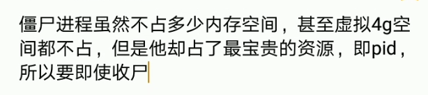
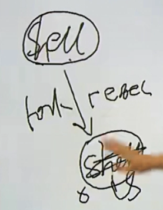
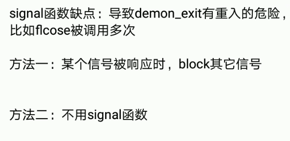

    linux_c入门_3.md
    
    :Author: kalipy
    :Email: kalipy@debian
    :Date: 2022-04-14 11:07

### 进程基本知识


man手册：

```
NAME
       fork - create a child process

SYNOPSIS
       #include <sys/types.h>
       #include <unistd.h>

       pid_t fork(void);

DESCRIPTION
       fork()  creates a new process by duplicating the calling process.  The new process is referred to as the
       child process.  The calling process is referred to as the parent process.

       The child process and the parent process run in separate memory spaces.  At the time of fork() both mem‐
       ory  spaces  have  the same content.  Memory writes, file mappings (mmap(2)), and unmappings (munmap(2))
       performed by one of the processes do not affect the other.

       The child process is an exact duplicate of the parent process except for the following points:

       *  The child has its own unique process ID, and this PID does not match the ID of any  existing  process
          group (setpgid(2)) or session.

       *  The child's parent process ID is the same as the parent's process ID.

       *  The child does not inherit its parent's memory locks (mlock(2), mlockall(2)).

       *  Process  resource  utilizations  (getrusage(2)) and CPU time counters (times(2)) are reset to zero in
          the child.

       *  The child's set of pending signals is initially empty (sigpending(2)).

       *  The child does not inherit semaphore adjustments from its parent (semop(2)).

       *  The child does not inherit process-associated record locks from its parent (fcntl(2)).  (On the other
          hand, it does inherit fcntl(2) open file description locks and flock(2) locks from its parent.)

       *  The child does not inherit timers from its parent (setitimer(2), alarm(2), timer_create(2)).

       *  The  child  does  not  inherit  outstanding asynchronous I/O operations from its parent (aio_read(3),
          aio_write(3)), nor does it inherit any asynchronous I/O contexts from its parent (see io_setup(2)).

       The process attributes in the preceding list are all specified in POSIX.1.  The parent  and  child  also
       differ with respect to the following Linux-specific process attributes:

       *  The child does not inherit directory change notifications (dnotify) from its parent (see the descrip‐
          tion of F_NOTIFY in fcntl(2)).

       *  The prctl(2) PR_SET_PDEATHSIG setting is reset so that the child does not receive a signal  when  its
          parent terminates.

       *  The  default timer slack value is set to the parent's current timer slack value.  See the description
          of PR_SET_TIMERSLACK in prctl(2).

       *  Memory mappings that have been marked with the madvise(2) MADV_DONTFORK flag are not inherited across
          a fork().

       *  Memory  in address ranges that have been marked with the madvise(2) MADV_WIPEONFORK flag is zeroed in
          the child after a fork().  (The MADV_WIPEONFORK setting remains in place for those address ranges  in
          the child.)

       *  The termination signal of the child is always SIGCHLD (see clone(2)).

       *  The  port access permission bits set by ioperm(2) are not inherited by the child; the child must turn
          on any bits that it requires using ioperm(2).

       Note the following further points:

       *  The child process is created with a single thread—the one that called fork().  The entire virtual ad‐
          dress  space  of  the  parent  is replicated in the child, including the states of mutexes, condition
          variables, and other pthreads objects; the use of pthread_atfork(3) may be helpful for  dealing  with
          problems that this can cause.

       *  After a fork() in a multithreaded program, the child can safely call only async-signal-safe functions
          (see signal-safety(7)) until such time as it calls execve(2).

       *  The child inherits copies of the parent's set of open file descriptors.  Each file descriptor in  the
          child  refers to the same open file description (see open(2)) as the corresponding file descriptor in
          the parent.  This means that the two file descriptors share open file status flags, file offset,  and
          signal-driven I/O attributes (see the description of F_SETOWN and F_SETSIG in fcntl(2)).

       *  The child inherits copies of the parent's set of open message queue descriptors (see mq_overview(7)).
          Each file descriptor in the child refers to the same open message queue  description  as  the  corre‐
          sponding  file  descriptor  in  the  parent.  This means that the two file descriptors share the same
          flags (mq_flags).

       *  The child inherits copies of the parent's set of open directory streams  (see  opendir(3)).   POSIX.1
          says  that the corresponding directory streams in the parent and child may share the directory stream
          positioning; on Linux/glibc they do not.

RETURN VALUE
       On success, the PID of the child process is returned in the parent, and 0 is returned in the child.   On
       failure, -1 is returned in the parent, no child process is created, and errno is set appropriately.

ERRORS
       EAGAIN A  system-imposed  limit  on the number of threads was encountered.  There are a number of limits
              that may trigger this error:

              *  the RLIMIT_NPROC soft resource limit (set via setrlimit(2)), which limits the number  of  pro‐
                 cesses and threads for a real user ID, was reached;

              *  the  kernel's  system-wide  limit  on  the  number  of  processes  and threads, /proc/sys/ker‐
                 nel/threads-max, was reached (see proc(5));

              *  the maximum number of PIDs, /proc/sys/kernel/pid_max, was reached (see proc(5)); or

              *  the PID limit (pids.max) imposed by the cgroup "process number" (PIDs) controller was reached.

       EAGAIN The caller is operating under the SCHED_DEADLINE scheduling policy and does not have  the  reset-
              on-fork flag set.  See sched(7).

       ENOMEM fork() failed to allocate the necessary kernel structures because memory is tight.

       ENOMEM An  attempt was made to create a child process in a PID namespace whose "init" process has termi‐
              nated.  See pid_namespaces(7).

       ENOSYS fork() is not supported on this platform  (for  example,  hardware  without  a  Memory-Management
              Unit).

       ERESTARTNOINTR (since Linux 2.6.17)
              System  call  was interrupted by a signal and will be restarted.  (This can be seen only during a
              trace.)

CONFORMING TO
       POSIX.1-2001, POSIX.1-2008, SVr4, 4.3BSD.

NOTES
       Under Linux, fork() is implemented using copy-on-write pages, so the only penalty that it incurs is  the
       time  and  memory  required to duplicate the parent's page tables, and to create a unique task structure
       for the child.

   C library/kernel differences
       Since version 2.3.3, rather than invoking the kernel's fork() system call, the glibc fork() wrapper that
       is  provided  as  part of the NPTL threading implementation invokes clone(2) with flags that provide the
       same effect as the traditional system call.  (A call to fork() is equivalent to a call to clone(2) spec‐
       ifying  flags  as just SIGCHLD.)  The glibc wrapper invokes any fork handlers that have been established
       using pthread_atfork(3).
```


fork后父子进程区别：

fork的返回值不一样，pid不一样，ppid不一样，未决信号和文件锁不继承，资源利用量清零

init进程：是所进程的祖先进程

eg1.

    kalipy@debian ~/g/linux_c入门> more main.c
    #include <stdio.h>
    #include <stdlib.h>
    #include <sys/types.h>
    #include <unistd.h>
    
    int main(int argc, char **argv)
    {
        pid_t pid;
    
        printf("[%d]Begin\n", getpid());
    
        pid = fork();
        if (pid < 0)
        {
            perror("fork()");
            exit(1);
        }
    
        if (pid == 0)   //child
        {
            printf("child is working\n", getpid());
        } else {    //parent
            printf("Parent is working\n", getpid());
        }
    
        printf("[%d]End\n", getpid());
    
        exit(0);
    }
    kalipy@debian ~/g/linux_c入门> gcc main.c
    kalipy@debian ~/g/linux_c入门> ./a.out
    [32453]Begin
    Parent is working
    [32453]End
    child is working
    [32454]End


eg2.

    kalipy@debian ~/g/linux_c入门> git diff
    diff --git a/main.c b/main.c
    index 89fdd7c..ff6add2 100644
    --- a/main.c
    +++ b/main.c
    @@ -25,5 +25,7 @@ int main(int argc, char **argv)
     
         printf("[%d]End\n", getpid());
     
    +    getchar();
    +
         exit(0);
     }
    kalipy@debian ~/g/linux_c入门> gcc main.c
    kalipy@debian ~/g/linux_c入门> ./a.out

kalipy@debian ~/g/linux_c入门> ps -axf

    18280 pts/4    Ss     0:00      \_ /bin/bash
    29739 pts/4    S      0:54      |   \_ fish
    18137 pts/4    Tl     0:44      |       \_ vim main.c
    18138 ?        Ssl    0:05      |       |   \_ /usr/bin/python3 /home/kalipy/.vim/bundle/YouCompleteMe/python/ycm/
      380 pts/4    S+     0:00      |       \_ ./a.out
      381 pts/4    S+     0:00      |           \_ ./a.out

eg3.

    kalipy@debian ~/g/linux_c入门> more main.c
    #include <stdio.h>
    #include <stdlib.h>
    #include <sys/types.h>
    #include <unistd.h>
    
    int main(int argc, char **argv)
    {
        pid_t pid;
    
        printf("[%d]Begin\n", getpid());
    
        pid = fork();
        if (pid < 0)
        {
            perror("fork()");
            exit(1);
        }
    
        if (pid == 0)   //child
        {
            printf("child is working\n", getpid());
        } else {    //parent
            printf("Parent is working\n", getpid());
        }
    
        printf("[%d]End\n", getpid());
    
        exit(0);
    }
    kalipy@debian ~/g/linux_c入门> gcc main.c
    kalipy@debian ~/g/linux_c入门> ./a.out > out
    kalipy@debian ~/g/linux_c入门> more out
    [1062]Begin
    Parent is working
    [1062]End
    [1062]Begin
    child is working
    [1063]End
    kalipy@debian ~/g/linux_c入门> ./a.out 
    [1147]Begin
    Parent is working
    [1147]End
    child is working
    [1155]End

eg4.

    kalipy@debian ~/g/linux_c入门> more main.c
    #include <stdio.h>
    #include <stdlib.h>
    #include <sys/types.h>
    #include <unistd.h>
    
    int main(int argc, char **argv)
    {
        pid_t pid;
    
        printf("[%d]Begin", getpid());
    
        pid = fork();
        if (pid < 0)
        {
            perror("fork()");
            exit(1);
        }
    
        if (pid == 0)   //child
        {
            printf("child is working\n", getpid());
        } else {    //parent
            printf("Parent is working\n", getpid());
        }
    
        printf("[%d]End\n", getpid());
    
        exit(0);
    }
    kalipy@debian ~/g/linux_c入门> gcc main.c
    kalipy@debian ~/g/linux_c入门> ./a.out
    [1925]BeginParent is working
    [1925]End
    [1925]Beginchild is working
    [1926]End
    kalipy@debian ~/g/linux_c入门> ./a.out > out
    kalipy@debian ~/g/linux_c入门> more out
    [2029]BeginParent is working
    [2029]End
    [2029]Beginchild is working
    [2030]End
    
eg5.

    kalipy@debian ~/g/linux_c入门> more main.c
    #include <stdio.h>
    #include <stdlib.h>
    #include <sys/types.h>
    #include <unistd.h>
    
    int main(int argc, char **argv)
    {
        pid_t pid;
    
        printf("[%d]Begin", getpid());
    
        fflush(NULL);
    
        pid = fork();
        if (pid < 0)
        {
            perror("fork()");
            exit(1);
        }
    
        if (pid == 0)   //child
        {
            printf("child is working\n", getpid());
        } else {    //parent
            printf("Parent is working\n", getpid());
        }
    
        printf("[%d]End\n", getpid());
    
        exit(0);
    }
    kalipy@debian ~/g/linux_c入门> gcc main.c
    kalipy@debian ~/g/linux_c入门> ./a.out > out
    kalipy@debian ~/g/linux_c入门> ./a.out 
    [2788]BeginParent is working
    [2788]End
    child is working
    [2789]End
    kalipy@debian ~/g/linux_c入门> more out
    [2758]BeginParent is working
    [2758]End
    child is working
    [2759]End

eg3和eg4和eg5的解释;


### ..

eg1.

    kalipy@debian ~/g/linux_c入门> more main.c
    #include <stdio.h>
    #include <stdlib.h>
    #include <sys/types.h>
    #include <unistd.h>
    
    #define LEFT  30000000
    #define RIGHT 30000200
    
    int main(int argc, char **argv)
    {
        int i, j, mark;
    
        //判断范围内是否是素数
        for (i = LEFT; i <= RIGHT; i++) {
    
            mark = 1;
            for (j = 2; j < i / 2; j++) {
                if (i % j == 0)
                {
                    mark = 0;
                    break;
                }
            }
    
            if (mark)
                printf("%d is a primer\n", i);
        }
    
        exit(0);
    }
    kalipy@debian ~/g/linux_c入门> gcc main.c
    kalipy@debian ~/g/linux_c入门> ./a.out | wc -l
    18
    kalipy@debian ~/g/linux_c入门> ./a.out
    30000001 is a primer
    30000023 is a primer
    30000037 is a primer
    30000041 is a primer
    30000049 is a primer
    30000059 is a primer
    30000071 is a primer
    30000079 is a primer
    30000083 is a primer
    30000109 is a primer
    30000133 is a primer
    30000137 is a primer
    30000149 is a primer
    30000163 is a primer
    30000167 is a primer
    30000169 is a primer
    30000193 is a primer
    30000199 is a primer
    
kalipy@debian:~/gg/linux_c入门$ time ./a.out > /dev/null

    real    0m1.160s
    user    0m1.159s
    sys     0m0.000s

eg2(多进程显著加快了eg1的速度).

    kalipy@debian ~/g/linux_c入门> more main.c
    #include <stdio.h>
    #include <stdlib.h>
    #include <sys/types.h>
    #include <unistd.h>
    
    #define LEFT  30000000
    #define RIGHT 30000200
    
    int main(int argc, char **argv)
    {
        int i, j, mark;
        pid_t pid;
    
        //判断范围内是否是素数
        for (i = LEFT; i <= RIGHT; i++) {
    
            pid = fork();
            if (pid < 0)
            {
                perror("fork()");
                exit(1);
            }
    
            if (pid == 0)
            {
                mark = 1;
                for (j = 2; j < i / 2; j++) {
                    if (i % j == 0)
                    {
                        mark = 0;
                        break;
                    }
                }
    
                if (mark)
                    printf("%d is a primer\n", i);
    
                exit(0);//紫禁城完成任务后应立刻退出，这句话必不可少，不然父进程fork后，紫禁城还会执行for循环，然后for
    k爆炸
            }
        }
    
        exit(0);
    }
    kalipy@debian ~/g/linux_c入门> gcc main.c
    kalipy@debian ~/g/linux_c入门> ./a.out
    kalipy@debian ~/g/linux_c入门> 30000023 is a primer
    30000149 is a primer
    30000071 is a primer
    30000163 is a primer
    30000049 is a primer
    30000169 is a primer
    30000083 is a primer
    30000167 is a primer
    30000079 is a primer
    30000137 is a primer
    30000059 is a primer
    30000001 is a primer
    30000041 is a primer
    30000109 is a primer
    30000037 is a primer
    30000193 is a primer
    30000133 is a primer
    30000199 is a primer
    
    kalipy@debian ~/g/linux_c入门> ./a.out | wc -l
    18
    
    kalipy@debian:~/gg/linux_c入门$ time ./a.out > /dev/null
    
    real    0m0.048s
    user    0m0.005s
    sys     0m0.013s
    kalipy@debian:~/gg/linux_c入门$ time ./a.out > /dev/null
    
    real    0m0.022s
    user    0m0.000s
    sys     0m0.014s

eg3(父进程比子进程先exit了).

    kalipy@debian ~/g/linux_c入门> git diff
    diff --git a/main.c b/main.c
    index 1452ff5..c80ead1 100644
    --- a/main.c
    +++ b/main.c
    @@ -35,6 +35,8 @@ int main(int argc, char **argv)
                 if (mark)
                     printf("%d is a primer\n", i);
     
    +            sleep(1000);
    +
                 exit(0);//紫禁城完成任务后应立刻退出，这句话必不可少，不然父进程fork后，紫禁城还会执行for循环，然后fork爆炸
             }
         }

kalipy@debian ~/g/linux_c入门> ps -axf

    9433 pts/4    S      0:00 ./a.out
    9434 pts/4    S      0:00 ./a.out
    9435 pts/4    S      0:00 ./a.out
    9436 pts/4    S      0:00 ./a.out
    9437 pts/4    S      0:00 ./a.out
    9438 pts/4    S      0:00 ./a.out
    9439 pts/4    S      0:00 ./a.out
    9440 pts/4    S      0:00 ./a.out
    9441 pts/4    S      0:00 ./a.out
    9442 pts/4    S      0:00 ./a.out

man ps:

```
PROCESS STATE CODES
       Here are the different values that the s, stat and state output specifiers (header "STAT" or "S") will
       display to describe the state of a process:

               D    uninterruptible sleep (usually IO)
               I    Idle kernel thread
               R    running or runnable (on run queue)
               S    interruptible sleep (waiting for an event to complete)
               T    stopped by job control signal
               t    stopped by debugger during the tracing
               W    paging (not valid since the 2.6.xx kernel)
               X    dead (should never be seen)
               Z    defunct ("zombie") process, terminated but not reaped by its parent

       For BSD formats and when the stat keyword is used, additional characters may be displayed:

               <    high-priority (not nice to other users)
               N    low-priority (nice to other users)
               L    has pages locked into memory (for real-time and custom IO)
               s    is a session leader
               l    is multi-threaded (using CLONE_THREAD, like NPTL pthreads do)
               +    is in the foreground process group
```

重点看这句：

    S    interruptible sleep (waiting for an event to complete)

eg4(紫禁城比父进程先exit了).

    kalipy@debian ~/g/linux_c入门> git diff
    diff --git a/main.c b/main.c
    index 1452ff5..b21d674 100644
    --- a/main.c
    +++ b/main.c
    @@ -35,9 +35,12 @@ int main(int argc, char **argv)
                 if (mark)
                     printf("%d is a primer\n", i);
     
    -            exit(1);//紫禁城完成任务后应立刻退出，这句话必不可少，不然父进程fork后，紫禁城还会执行for循环，然后fork爆炸
    +            //sleep(1000);
    +
    +            exit(0);//紫禁城完成任务后应立刻退出，这句话必不可少，不然父进程fork后，紫禁城还会执行for循环，然后fork爆炸
             }
         }
     
    +    sleep(1000);
         exit(0);
     }
    kalipy@debian ~/g/linux_c入门> gcc main.c
    kalipy@debian ~/g/linux_c入门> ./a.out
    30000109 is a primer
    30000037 is a primer
    30000041 is a primer
    30000001 is a primer
    30000167 is a primer
    30000079 is a primer
    30000071 is a primer
    30000133 is a primer
    30000193 is a primer
    30000163 is a primer
    30000199 is a primer
    30000059 is a primer
    30000149 is a primer
    30000023 is a primer
    30000169 is a primer
    30000049 is a primer
    30000137 is a primer
    30000083 is a primer
    ^C⏎ 

kalipy@debian ~/g/linux_c入门> ps -axf

    18280 pts/4    Ss     0:00      \_ /bin/bash
    29739 pts/4    S      0:56      |   \_ fish
    18137 pts/4    Tl     1:08      |       \_ vim main.c
    18138 ?        Ssl    0:09      |       |   \_ /usr/bin/python3 /home/kalipy/.vim/bundle/YouCompleteMe/python/ycm/
    14175 pts/4    S+     0:00      |       \_ ./a.out
    14176 pts/4    Z+     0:00      |           \_ [a.out] <defunct>
    14177 pts/4    Z+     0:00      |           \_ [a.out] <defunct>
    14178 pts/4    Z+     0:00      |           \_ [a.out] <defunct>
    14179 pts/4    Z+     0:00      |           \_ [a.out] <defunct>
    14180 pts/4    Z+     0:00      |           \_ [a.out] <defunct>
    14181 pts/4    Z+     0:00      |           \_ [a.out] <defunct>
    14182 pts/4    Z+     0:00      |           \_ [a.out] <defunct>
    14183 pts/4    Z+     0:00      |           \_ [a.out] <defunct>
    14184 pts/4    Z+     0:00      |           \_ [a.out] <defunct>

问题所在：




### vfork(现在不推荐使用了)

man手册：

```
NAME
       vfork - create a child process and block parent

SYNOPSIS
       #include <sys/types.h>
       #include <unistd.h>

       pid_t vfork(void);

   Feature Test Macro Requirements for glibc (see feature_test_macros(7)):

       vfork():
           Since glibc 2.12:
               (_XOPEN_SOURCE >= 500) && ! (_POSIX_C_SOURCE >= 200809L)
                   || /* Since glibc 2.19: */ _DEFAULT_SOURCE
                   || /* Glibc versions <= 2.19: */ _BSD_SOURCE
           Before glibc 2.12:
               _BSD_SOURCE || _XOPEN_SOURCE >= 500

DESCRIPTION
   Standard description
       (From  POSIX.1)  The  vfork() function has the same effect as fork(2), except that the behavior is unde-
       fined if the process created by vfork() either modifies any data other than a  variable  of  type  pid_t
       used  to  store the return value from vfork(), or returns from the function in which vfork() was called,
       or calls any other function before successfully calling _exit(2) or one of the exec(3) family  of  func-
       tions.

   Linux description
       vfork(),  just  like  fork(2),  creates  a child process of the calling process.  For details and return
       value and errors, see fork(2).

       vfork() is a special case of clone(2).  It is used to create new processes without copying the page  ta-
       bles  of  the  parent  process.  It may be useful in performance-sensitive applications where a child is
       created which then immediately issues an execve(2).

       vfork() differs from fork(2) in that the calling thread is suspended until the child terminates  (either
       normally,  by  calling _exit(2), or abnormally, after delivery of a fatal signal), or it makes a call to
       execve(2).  Until that point, the child shares all memory with its parent,  including  the  stack.   The
       child  must not return from the current function or call exit(3) (which would have the effect of calling
       exit handlers established by the parent process and flushing the parent's  stdio(3)  buffers),  but  may
       call _exit(2).

       As with fork(2), the child process created by vfork() inherits copies of various of the caller's process
       attributes (e.g., file descriptors, signal dispositions, and current  working  directory);  the  vfork()
       call differs only in the treatment of the virtual address space, as described above.

       Signals  sent  to  the parent arrive after the child releases the parent's memory (i.e., after the child
       terminates or calls execve(2)).

   Historic description
       Under Linux, fork(2) is implemented using copy-on-write pages, so the only penalty incurred  by  fork(2)
       is  the  time  and  memory  required  to duplicate the parent's page tables, and to create a unique task
       structure for the child.  However, in the bad old days a fork(2) would require making a complete copy of
       the  caller's  data  space,  often  needlessly,  since usually immediately afterward an exec(3) is done.
       Thus, for greater efficiency, BSD introduced the vfork() system call, which did not fully copy  the  ad-
       dress  space  of the parent process, but borrowed the parent's memory and thread of control until a call
       to execve(2) or an exit occurred.  The parent process was suspended while the child was  using  its  re-
       sources.   The use of vfork() was tricky: for example, not modifying data in the parent process depended
       on knowing which variables were held in a register.

CONFORMING TO
       4.3BSD; POSIX.1-2001 (but marked OBSOLETE).  POSIX.1-2008 removes the specification of vfork().

       The requirements put on vfork() by the standards are weaker than those put on fork(2), so an implementa-
       tion where the two are synonymous is compliant.  In particular, the programmer cannot rely on the parent
       remaining blocked until the child either terminates or calls execve(2), and cannot rely on any  specific
       behavior with respect to shared memory.

NOTES
       Some  consider  the semantics of vfork() to be an architectural blemish, and the 4.2BSD man page stated:
       "This system call will be eliminated when proper  system  sharing  mechanisms  are  implemented.   Users
       should  not  depend on the memory sharing semantics of vfork() as it will, in that case, be made synony-
       mous to fork(2)."  However, even though modern memory management hardware has decreased the  performance
       difference  between  fork(2) and vfork(), there are various reasons why Linux and other systems have re-
       tained vfork():

       *  Some performance-critical applications require the small performance advantage conferred by vfork().

       *  vfork() can be implemented on systems that lack a memory-management unit (MMU), but fork(2) can't  be
          implemented  on  such  systems.  (POSIX.1-2008 removed vfork() from the standard; the POSIX rationale
          for the posix_spawn(3) function notes that that function, which provides functionality equivalent  to
          fork(2)+exec(3), is designed to be implementable on systems that lack an MMU.)

       *  On systems where memory is constrained, vfork() avoids the need to temporarily commit memory (see the
          description of /proc/sys/vm/overcommit_memory in proc(5)) in order to execute a new  program.   (This
          can be especially beneficial where a large parent process wishes to execute a small helper program in
          a child process.)  By contrast, using fork(2) in this scenario requires either committing  an  amount
          of  memory equal to the size of the parent process (if strict overcommitting is in force) or overcom-
          mitting memory with the risk that a process is terminated by the out-of-memory (OOM) killer.

   Caveats
       The child process should take care not to modify the memory in unintended ways, since such changes  will
       be  seen  by  the parent process once the child terminates or executes another program.  In this regard,
       signal handlers can be especially problematic: if a signal handler that  is  invoked  in  the  child  of
       vfork()  changes  memory, those changes may result in an inconsistent process state from the perspective
       of the parent process (e.g., memory changes would be visible in the parent, but changes to the state  of
       open file descriptors would not be visible).

       When  vfork() is called in a multithreaded process, only the calling thread is suspended until the child
       terminates or executes a new program.  This means that the child is sharing an address space with  other
       running  code.  This can be dangerous if another thread in the parent process changes credentials (using
       setuid(2) or similar), since there are now two processes with different privilege levels running in  the
       same  address space.  As an example of the dangers, suppose that a multithreaded program running as root
       creates a child using vfork().  After the vfork(), a thread in the parent process drops the  process  to
       an  unprivileged  user  in  order  to  run  some  untrusted  code (e.g., perhaps via plug-in opened with
       dlopen(3)).  In this case, attacks are possible where the parent process uses mmap(2)  to  map  in  code
       that will be executed by the privileged child process.

   Linux notes
       Fork  handlers established using pthread_atfork(3) are not called when a multithreaded program employing
       the NPTL threading library calls vfork().  Fork handlers are called in this case in a program using  the
       LinuxThreads threading library.  (See pthreads(7) for a description of Linux threading libraries.)

       A call to vfork() is equivalent to calling clone(2) with flags specified as:

            CLONE_VM | CLONE_VFORK | SIGCHLD

   History
       The  vfork() system call appeared in 3.0BSD.  In 4.4BSD it was made synonymous to fork(2) but NetBSD in-
       troduced it again; see <http://www.netbsd.org/Documentation/kernel/vfork.html>.  In Linux, it  has  been
       equivalent to fork(2) until 2.2.0-pre6 or so.  Since 2.2.0-pre9 (on i386, somewhat later on other archi-
       tectures) it is an independent system call.  Support was added in glibc 2.0.112.

BUGS
       Details of the signal handling are obscure and differ between systems.  The BSD  man  page  states:  "To
       avoid  a  possible  deadlock situation, processes that are children in the middle of a vfork() are never
       sent SIGTTOU or SIGTTIN signals; rather, output or ioctls are allowed and input attempts  result  in  an
       end-of-file indication."
```


### 进程 wait和waitpid

进程的消亡和释放资源:

wait();
waitpid();
waitid();
wait3();
wait4();

man手册：

```
NAME
       wait, waitpid, waitid - wait for process to change state

SYNOPSIS
       #include <sys/types.h>
       #include <sys/wait.h>

       pid_t wait(int *wstatus);

       pid_t waitpid(pid_t pid, int *wstatus, int options);

       int waitid(idtype_t idtype, id_t id, siginfo_t *infop, int options);
                       /* This is the glibc and POSIX interface; see
                          NOTES for information on the raw system call. */

   Feature Test Macro Requirements for glibc (see feature_test_macros(7)):

       waitid():
           Since glibc 2.26: _XOPEN_SOURCE >= 500 ||
               _POSIX_C_SOURCE >= 200809L
           Glibc 2.25 and earlier:
               _XOPEN_SOURCE
                   || /* Since glibc 2.12: */ _POSIX_C_SOURCE >= 200809L
                   || /* Glibc versions <= 2.19: */ _BSD_SOURCE

DESCRIPTION
       All  of these system calls are used to wait for state changes in a child of the calling process, and ob-
       tain information about the child whose state has changed.  A state change is considered to be: the child
       terminated;  the  child was stopped by a signal; or the child was resumed by a signal.  In the case of a
       terminated child, performing a wait allows the system to  release  the  resources  associated  with  the
       child;  if a wait is not performed, then the terminated child remains in a "zombie" state (see NOTES be-
       low).

       If a child has already changed state, then these calls return immediately.  Otherwise, they block  until
       either a child changes state or a signal handler interrupts the call (assuming that system calls are not
       automatically restarted using the SA_RESTART flag of sigaction(2)).  In the remainder of  this  page,  a
       child  whose  state  has  changed and which has not yet been waited upon by one of these system calls is
       termed waitable.

   wait() and waitpid()
       The wait() system call suspends execution of the calling thread until one of  its  children  terminates.
       The call wait(&wstatus) is equivalent to:

           waitpid(-1, &wstatus, 0);

       The  waitpid() system call suspends execution of the calling thread until a child specified by pid argu-
       ment has changed state.  By default, waitpid() waits only for terminated children, but this behavior  is
       modifiable via the options argument, as described below.

       The value of pid can be:

       < -1   meaning wait for any child process whose process group ID is equal to the absolute value of pid.

       -1     meaning wait for any child process.

       0      meaning  wait  for  any  child  process  whose  process  group ID is equal to that of the calling
              process.

       > 0    meaning wait for the child whose process ID is equal to the value of pid.

       The value of options is an OR of zero or more of the following constants:

       WNOHANG     return immediately if no child has exited.

       WUNTRACED   also return if a child has stopped (but not traced via ptrace(2)).  Status for traced  chil-
                   dren which have stopped is provided even if this option is not specified.

       WCONTINUED (since Linux 2.6.10)
                   also return if a stopped child has been resumed by delivery of SIGCONT.

       (For Linux-only options, see below.)

       If  wstatus  is  not  NULL, wait() and waitpid() store status information in the int to which it points.
       This integer can be inspected with the following macros (which take the integer itself as  an  argument,
       not a pointer to it, as is done in wait() and waitpid()!):

       WIFEXITED(wstatus)
              returns true if the child terminated normally, that is, by calling exit(3) or _exit(2), or by re-
              turning from main().

       WEXITSTATUS(wstatus)
              returns the exit status of the child.  This consists of the least significant 8 bits of the  sta-
              tus  argument  that the child specified in a call to exit(3) or _exit(2) or as the argument for a
              return statement in main().  This macro should be employed only if WIFEXITED returned true.

       WIFSIGNALED(wstatus)
              returns true if the child process was terminated by a signal.

       WTERMSIG(wstatus)
              returns the number of the signal that caused the child process to terminate.  This  macro  should
              be employed only if WIFSIGNALED returned true.

       WCOREDUMP(wstatus)
              returns  true  if  the child produced a core dump.  This macro should be employed only if WIFSIG-
              NALED returned true.

              This macro is not specified in POSIX.1-2001 and is not available  on  some  UNIX  implementations
              (e.g., AIX, SunOS).  Therefore, enclose its use inside #ifdef WCOREDUMP ... #endif.

       WIFSTOPPED(wstatus)
              returns  true  if the child process was stopped by delivery of a signal; this is possible only if
              the call was done using WUNTRACED or when the child is being traced (see ptrace(2)).

       WSTOPSIG(wstatus)
              returns the number of the signal which caused the child to stop.  This macro should  be  employed
              only if WIFSTOPPED returned true.

       WIFCONTINUED(wstatus)
              (since Linux 2.6.10) returns true if the child process was resumed by delivery of SIGCONT.

   waitid()
       The  waitid()  system  call (available since Linux 2.6.9) provides more precise control over which child
       state changes to wait for.

       The idtype and id arguments select the child(ren) to wait for, as follows:

       idtype == P_PID
              Wait for the child whose process ID matches id.

       idtype == P_PGID
              Wait for any child whose process group ID matches id.

       idtype == P_ALL
              Wait for any child; id is ignored.

       The child state changes to wait for are specified by ORing one or more of the  following  flags  in  op-
       tions:

       WEXITED     Wait for children that have terminated.

       WSTOPPED    Wait for children that have been stopped by delivery of a signal.

       WCONTINUED  Wait for (previously stopped) children that have been resumed by delivery of SIGCONT.

       The following flags may additionally be ORed in options:

       WNOHANG     As for waitpid().

       WNOWAIT     Leave  the  child  in  a waitable state; a later wait call can be used to again retrieve the
                   child status information.

       Upon successful return, waitid() fills in the following fields of the siginfo_t structure pointed to  by
       infop:

       si_pid      The process ID of the child.

       si_uid      The real user ID of the child.  (This field is not set on most other implementations.)

       si_signo    Always set to SIGCHLD.

       si_status   Either  the  exit status of the child, as given to _exit(2) (or exit(3)), or the signal that
                   caused the child to terminate, stop, or continue.  The si_code field can be used  to  deter-
                   mine how to interpret this field.

       si_code     Set  to  one  of:  CLD_EXITED  (child called _exit(2)); CLD_KILLED (child killed by signal);
                   CLD_DUMPED (child killed by signal, and dumped core); CLD_STOPPED (child stopped by signal);
                   CLD_TRAPPED (traced child has trapped); or CLD_CONTINUED (child continued by SIGCONT).

       If  WNOHANG  was  specified in options and there were no children in a waitable state, then waitid() re-
       turns 0 immediately and the state of the siginfo_t structure pointed to by infop depends on  the  imple-
       mentation.   To  (portably)  distinguish this case from that where a child was in a waitable state, zero
       out the si_pid field before the call and check for a nonzero value in this field after the call returns.

       POSIX.1-2008 Technical Corrigendum 1 (2013) adds the requirement that when WNOHANG is specified  in  op-
       tions  and  there  were  no  children  in a waitable state, then waitid() should zero out the si_pid and
       si_signo fields of the structure.  On Linux and other implementations that adhere to  this  requirement,
       it  is not necessary to zero out the si_pid field before calling waitid().  However, not all implementa-
       tions follow the POSIX.1 specification on this point.

RETURN VALUE
       wait(): on success, returns the process ID of the terminated child; on error, -1 is returned.

       waitpid(): on success, returns the process ID of the child whose state has changed; if WNOHANG was spec-
       ified  and  one or more child(ren) specified by pid exist, but have not yet changed state, then 0 is re-
       turned.  On error, -1 is returned.

       waitid(): returns 0 on success or if WNOHANG was specified and no child(ren) specified  by  id  has  yet
       changed state; on error, -1 is returned.

       Each of these calls sets errno to an appropriate value in the case of an error.
```

eg1.

    kalipy@debian ~/g/linux_c入门> more main.c
    #include <stdio.h>
    #include <stdlib.h>
    #include <sys/types.h>
    #include <sys/wait.h>
    #include <unistd.h>
    
    #define LEFT  30000000
    #define RIGHT 30000200
    
    int main(int argc, char **argv)
    {
        int i, j, mark;
        pid_t pid;
    
        //判断范围内是否是素数
        for (i = LEFT; i <= RIGHT; i++) {
    
            pid = fork();
            if (pid < 0)
            {
                perror("fork()");
                exit(1);
            }
    
            if (pid == 0)
            {
                mark = 1;
                for (j = 2; j < i / 2; j++) {
                    if (i % j == 0)
                    {
                        mark = 0;
                        break;
                    }
                }
    
                if (mark)
                    printf("%d is a primer\n", i);
    
                exit(0);
            }
        }
    
        for (i = LEFT; i <= RIGHT; i++)
        {
            wait(NULL);
        }
    
        sleep(1000*10);
    
        exit(0);
    }
    kalipy@debian ~/g/linux_c入门> gcc main.c
    kalipy@debian ~/g/linux_c入门> ./a.out
    30000041 is a primer
    30000049 is a primer
    30000199 is a primer
    30000001 is a primer
    30000133 is a primer
    30000167 is a primer
    30000193 is a primer
    30000037 is a primer
    30000071 is a primer
    30000059 is a primer
    30000079 is a primer
    30000149 is a primer
    30000137 is a primer
    30000023 is a primer
    30000083 is a primer
    30000169 is a primer
    30000109 is a primer
    30000163 is a primer


说明：

现在就不会有僵尸进程了

### 进程分配之交叉分配法实现


eg1.

    kalipy@debian ~/g/linux_c入门> more main.c
    #include <stdio.h>
    #include <stdlib.h>
    #include <sys/types.h>
    #include <sys/wait.h>
    #include <unistd.h>
    
    #define LEFT  30000000
    #define RIGHT 30000200
    #define N     3
    
    int main(int argc, char **argv)
    {
        int i, j, n, mark;
        pid_t pid;
    
        for (n = 0; n < N; n++) {
            pid = fork();
            if (pid < 0)
            {
                perror("fork()");
                exit(1);
            }
    
            if (pid == 0)
            {
                //判断范围内是否是素数
                for (i = LEFT + n; i <= RIGHT; i += N) {
                    mark = 1;
                    for (j = 2; j < i / 2; j++) {
                        if (i % j == 0)
                        {
                            mark = 0;
                            break;
                        }
                    }
    
                    if (mark)
                        printf("[%d]%d is a primer\n", n, i);
                }
    
                exit(0);
            }
        }
    
        for (n = 0; n < N; n++)
        {
            wait(NULL);
        }
    
        exit(0);
    }
    kalipy@debian ~/g/linux_c入门> gcc main.c
    kalipy@debian ~/g/linux_c入门> ./a.out
    [2]30000023 is a primer
    [1]30000001 is a primer
    [1]30000037 is a primer
    [2]30000041 is a primer
    [1]30000049 is a primer
    [2]30000059 is a primer
    [1]30000079 is a primer
    [2]30000071 is a primer
    [2]30000083 is a primer
    [1]30000109 is a primer
    [1]30000133 is a primer
    [2]30000137 is a primer
    [2]30000149 is a primer
    [1]30000163 is a primer
    [2]30000167 is a primer
    [1]30000169 is a primer
    [1]30000193 is a primer
    [1]30000199 is a primer


### exec函数族

    bash
        ./primer2
            ./perimer2
            ..


man手册：

```
EXEC(3)                                    Linux Programmer's Manual                                    EXEC(3)

NAME
       execl, execlp, execle, execv, execvp, execvpe - execute a file

SYNOPSIS
       #include <unistd.h>

       extern char **environ;

       int execl(const char *path, const char *arg, ...
                       /* (char  *) NULL */);
       int execlp(const char *file, const char *arg, ...
                       /* (char  *) NULL */);
       int execle(const char *path, const char *arg, ...
                       /*, (char *) NULL, char * const envp[] */);
       int execv(const char *path, char *const argv[]);
       int execvp(const char *file, char *const argv[]);
       int execvpe(const char *file, char *const argv[],
                       char *const envp[]);

   Feature Test Macro Requirements for glibc (see feature_test_macros(7)):

       execvpe(): _GNU_SOURCE

DESCRIPTION
       The  exec()  family of functions replaces the current process image with a new process image.  The func-
       tions described in this manual page are front-ends for execve(2).  (See the manual  page  for  execve(2)
       for further details about the replacement of the current process image.)

       The initial argument for these functions is the name of a file that is to be executed.

       The  const  char *arg  and  subsequent  ellipses in the execl(), execlp(), and execle() functions can be
       thought of as arg0, arg1, ..., argn.  Together they describe a list of one or more pointers to null-ter-
       minated strings that represent the argument list available to the executed program.  The first argument,
       by convention, should point to the filename associated with the file being executed.  The list of  argu-
       ments  must  be terminated by a null pointer, and, since these are variadic functions, this pointer must
       be cast (char *) NULL.

       The execv(), execvp(), and execvpe() functions provide an array of pointers to  null-terminated  strings
       that  represent  the  argument  list  available  to the new program.  The first argument, by convention,
       should point to the filename associated with the file being executed.  The array  of  pointers  must  be
       terminated by a null pointer.

       The execle() and execvpe() functions allow the caller to specify the environment of the executed program
       via the argument envp.  The envp argument is an array of pointers to null-terminated strings and must be
       terminated  by  a null pointer.  The other functions take the environment for the new process image from
       the external variable environ in the calling process.

   Special semantics for execlp() and execvp()
       The execlp(), execvp(), and execvpe() functions duplicate the actions of the shell in searching  for  an
       executable file if the specified filename does not contain a slash (/) character.  The file is sought in
       the colon-separated list of directory pathnames specified in the PATH  environment  variable.   If  this
       variable isn't defined, the path list defaults to a list that includes the directories returned by conf-
       str(_CS_PATH) (which typically returns the value "/bin:/usr/bin") and possibly also the current  working
       directory; see NOTES for further details.

       If  the  specified filename includes a slash character, then PATH is ignored, and the file at the speci-
       fied pathname is executed.

       In addition, certain errors are treated specially.

       If permission is denied for a file (the attempted execve(2) failed with the error EACCES),  these  func-
       tions  will  continue  searching  the rest of the search path.  If no other file is found, however, they
       will return with errno set to EACCES.

       If the header of a file isn't recognized (the attempted execve(2) failed with the error ENOEXEC),  these
       functions  will  execute  the shell (/bin/sh) with the path of the file as its first argument.  (If this
       attempt fails, no further searching is done.)

RETURN VALUE
       The exec() functions return only if an error has occurred.  The return value is -1, and errno is set  to
       indicate the error.

ERRORS
       All of these functions may fail and set errno for any of the errors specified for execve(2).

VERSIONS
       The execvpe() function first appeared in glibc 2.11.

ATTRIBUTES
       For an explanation of the terms used in this section, see attributes(7).

       +------------------------------+---------------+-------------+
       |Interface                     | Attribute     | Value       |
       +------------------------------+---------------+-------------+
       |execl(), execle(), execv()    | Thread safety | MT-Safe     |
       +------------------------------+---------------+-------------+
       |execlp(), execvp(), execvpe() | Thread safety | MT-Safe env |
       +------------------------------+---------------+-------------+
CONFORMING TO
       POSIX.1-2001, POSIX.1-2008.

       The execvpe() function is a GNU extension.

NOTES
       The default search path (used when the environment does not contain the variable PATH) shows some varia-
       tion across systems.  It generally includes /bin and /usr/bin (in that order) and may also  include  the
       current  working  directory.   On  some  other  systems,  the current working is included after /bin and
       /usr/bin, as an anti-Trojan-horse measure.  The glibc implementation long followed the  traditional  de-
       fault  where  the  current working directory is included at the start of the search path.  However, some
       code refactoring during the development of glibc 2.24 caused the current working directory to be dropped
       altogether  from  the default search path.  This accidental behavior change is considered mildly benefi-
       cial, and won't be reverted.

       The behavior of execlp() and execvp() when errors occur while attempting to execute the file is historic
       practice,  but  has  not  traditionally been documented and is not specified by the POSIX standard.  BSD
       (and possibly other systems) do an automatic sleep and retry if ETXTBSY is encountered.  Linux treats it
       as a hard error and returns immediately.

       Traditionally,  the  functions  execlp()  and  execvp() ignored all errors except for the ones described
       above and ENOMEM and E2BIG, upon which they returned.  They now return if any error other than the  ones
       described above occurs.

BUGS
       Before  glibc 2.24, execl() and execle() employed realloc(3) internally and were consequently not async-
       signal-safe, in violation of the requirements of POSIX.1.  This was fixed in glibc 2.24.
```

eg1.

    kalipy@debian ~/g/linux_c入门> date
    2022年 04月 14日 星期四 11:12:10 CST
    kalipy@debian ~/g/linux_c入门> date +%s
    1649905935
    kalipy@debian ~/g/linux_c入门> which date
    /usr/bin/date

kalipy@debian ~/g/linux_c入门> more main.c

    #include <stdio.h>
    #include <stdlib.h>
    #include <sys/types.h>
    #include <sys/wait.h>
    #include <unistd.h>
    
    #if 0
    
    date +%s
    
    #endif
    
    int main(int argc, char **argv)
    {
        puts("Begin");
        
        execl("/usr/bin/date", "date", "+%s", NULL);
        perror("execl()");
        exit(1);
    
        puts("End");
    
        exit(0);
    }
    kalipy@debian ~/g/linux_c入门> gcc main.c
    kalipy@debian ~/g/linux_c入门> ./a.out
    Begin
    1649906101


eg2.

eg1的问题：

    kalipy@debian ~/g/linux_c入门> ./a.out
    Begin
    1649906101
    kalipy@debian ~/g/linux_c入门> ./a.out > out
    kalipy@debian ~/g/linux_c入门> more out
    1649906116

解决：

    kalipy@debian ~/g/linux_c入门> more main.c
    #include <stdio.h>
    #include <stdlib.h>
    #include <sys/types.h>
    #include <sys/wait.h>
    #include <unistd.h>
    
    #if 0
    
    date +%s
    
    #endif
    
    int main(int argc, char **argv)
    {
        puts("Begin");
        
        fflush(NULL);
    
        execl("/usr/bin/date", "date", "+%s", NULL);
        perror("execl()");
        exit(1);
    
        puts("End");
    
        exit(0);
    }
    kalipy@debian ~/g/linux_c入门> gcc main.c
    kalipy@debian ~/g/linux_c入门> ./a.out > out
    kalipy@debian ~/g/linux_c入门> more out
    Begin
    1649906225
    kalipy@debian ~/g/linux_c入门> ./a.out
    Begin
    1649906234

解释(stdout是行缓冲)：

    puts() writes the string s and a trailing newline to stdout.


eg3(推荐exec的用法，即用紫禁城来完成working).

    kalipy@debian ~/g/linux_c入门> more main.c
    #include <stdio.h>
    #include <stdlib.h>
    #include <sys/types.h>
    #include <sys/wait.h>
    #include <unistd.h>
    
    #if 0
    
    date +%s
    
    #endif
    
    int main(int argc, char **argv)
    {
        pid_t pid;
    
        puts("Begin");
        
        fflush(NULL);
    
        pid = fork();
        if (pid < 0)
        {
            perror("fork()");
            exit(1);
        }
    
        if (pid == 0)
        {
            execl("/usr/bin/date", "date", "+%s", NULL);
            perror("execl()");
            exit(1);
        }
    
        wait(NULL);
    
        puts("End");
    
        exit(0);
    }
    kalipy@debian ~/g/linux_c入门> gcc main.c
    kalipy@debian ~/g/linux_c入门> ./a.out
    Begin
    1649906588
    End

### 进程 命令实现




eg1.

    kalipy@debian ~/g/linux_c入门> more main.c
    #include <stdio.h>
    #include <stdlib.h>
    #include <sys/types.h>
    #include <sys/wait.h>
    #include <unistd.h>
    
    int main(int argc, char **argv)
    {
        pid_t pid;
    
        puts("Begin");
        
        fflush(NULL);
    
        pid = fork();
        if (pid < 0)
        {
            perror("fork()");
            exit(1);
        }
    
        if (pid == 0)
        {
            execl("/usr/bin/sleep", "sleep", "100", NULL);
            perror("execl()");
            exit(1);
        }
    
        wait(NULL);
    
        puts("End");
    
        exit(0);
    }
    kalipy@debian ~/g/linux_c入门> gcc main.c
    kalipy@debian ~/g/linux_c入门> ./a.out
    Begin

ps -auf

    18280 pts/4    Ss     0:00      \_ /bin/bash
    29739 pts/4    S      0:58      |   \_ fish
    18137 pts/4    Tl     1:49      |       \_ vim main.c
    18138 ?        Ssl    0:15      |       |   \_ /usr/bin/python3 /home/kalipy/.vim/bundle/YouCompleteMe/python/ycm/
     1524 pts/4    S+     0:00      |       \_ ./a.out
     1525 pts/4    S+     0:00      |           \_ sleep 100

eg2.

    kalipy@debian ~/g/linux_c入门> git diff
    diff --git a/main.c b/main.c
    index 498a733..cc6a877 100644
    --- a/main.c
    +++ b/main.c
    @@ -21,7 +21,7 @@ int main(int argc, char **argv)
     
         if (pid == 0)
         {
    -        execl("/usr/bin/sleep", "sleep", "100", NULL);
    +        execl("/usr/bin/sleep", "abcd", "100", NULL);
             perror("execl()");
             exit(1);
         }
    kalipy@debian ~/g/linux_c入门> ./a.out
    Begin
    ^C⏎     

ps -auf

    18280 pts/4    Ss     0:00      \_ /bin/bash
    29739 pts/4    S      0:58      |   \_ fish
    18137 pts/4    Tl     1:49      |       \_ vim main.c
    18138 ?        Ssl    0:15      |       |   \_ /usr/bin/python3 /home/kalipy/.vim/bundle/YouCompleteMe/python/ycm/
     2366 pts/4    S+     0:00      |       \_ ./a.out
     2367 pts/4    S+     0:00      |           \_ abcd 100

eg3.

man手册：

```
STRTOK(3)                                  Linux Programmer's Manual                                  STRTOK(3)

NAME
       strtok, strtok_r - extract tokens from strings

SYNOPSIS
       #include <string.h>

       char *strtok(char *str, const char *delim);

       char *strtok_r(char *str, const char *delim, char **saveptr);

   Feature Test Macro Requirements for glibc (see feature_test_macros(7)):

       strtok_r(): _POSIX_C_SOURCE
           || /* Glibc versions <= 2.19: */ _BSD_SOURCE || _SVID_SOURCE

DESCRIPTION
       The  strtok()  function  breaks  a string into a sequence of zero or more nonempty tokens.  On the first
       call to strtok(), the string to be parsed should be specified in str.   In  each  subsequent  call  that
       should parse the same string, str must be NULL.

       The  delim  argument  specifies a set of bytes that delimit the tokens in the parsed string.  The caller
       may specify different strings in delim in successive calls that parse the same string.

       Each call to strtok() returns a pointer to a null-terminated string containing  the  next  token.   This
       string does not include the delimiting byte.  If no more tokens are found, strtok() returns NULL.

       A  sequence of calls to strtok() that operate on the same string maintains a pointer that determines the
       point from which to start searching for the next token.  The first call to strtok() sets this pointer to
       point  to  the  first byte of the string.  The start of the next token is determined by scanning forward
       for the next nondelimiter byte in str.  If such a byte is found, it is taken as the start  of  the  next
       token.   If  no such byte is found, then there are no more tokens, and strtok() returns NULL.  (A string
       that is empty or that contains only delimiters will thus cause strtok() to  return  NULL  on  the  first
       call.)

       The  end of each token is found by scanning forward until either the next delimiter byte is found or un-
       til the terminating null byte ('\0') is encountered.  If a delimiter byte is found,  it  is  overwritten
       with  a  null  byte  to terminate the current token, and strtok() saves a pointer to the following byte;
       that pointer will be used as the starting point when searching for the next token.  In this  case,  str-
       tok() returns a pointer to the start of the found token.

       From  the above description, it follows that a sequence of two or more contiguous delimiter bytes in the
       parsed string is considered to be a single delimiter, and that delimiter bytes at the start  or  end  of
       the  string  are ignored.  Put another way: the tokens returned by strtok() are always nonempty strings.
       Thus, for example, given the string "aaa;;bbb,", successive calls to strtok() that specify the delimiter
       string ";," would return the strings "aaa" and "bbb", and then a null pointer.

       The  strtok_r() function is a reentrant version strtok().  The saveptr argument is a pointer to a char *
       variable that is used internally by strtok_r() in order to maintain  context  between  successive  calls
       that parse the same string.

       On  the  first call to strtok_r(), str should point to the string to be parsed, and the value of saveptr
       is ignored.  In subsequent calls, str should be NULL, and saveptr should be unchanged since the previous
       call.

       Different strings may be parsed concurrently using sequences of calls to strtok_r() that specify differ-
       ent saveptr arguments.

RETURN VALUE
       The strtok() and strtok_r() functions return a pointer to the next token, or NULL if there are  no  more
       tokens.
```

man手册：

```
STRSEP(3)                                  Linux Programmer's Manual                                  STRSEP(3)

NAME
       strsep - extract token from string

SYNOPSIS
       #include <string.h>

       char *strsep(char **stringp, const char *delim);

   Feature Test Macro Requirements for glibc (see feature_test_macros(7)):

       strsep():
           Since glibc 2.19:
               _DEFAULT_SOURCE
           Glibc 2.19 and earlier:
               _BSD_SOURCE

DESCRIPTION
       If *stringp is NULL, the strsep() function returns NULL and does nothing else.  Otherwise, this function
       finds the first token in the string *stringp, that is delimited by one of the bytes in the string delim.
       This  token  is terminated by overwriting the delimiter with a null byte ('\0'), and *stringp is updated
       to point past the token.  In case no delimiter was found, the token is taken to  be  the  entire  string
       *stringp, and *stringp is made NULL.

RETURN VALUE
       The  strsep()  function  returns  a  pointer  to  the  token,  that is, it returns the original value of
       *stringp.
```

步骤一：

    kalipy@debian ~/g/linux_c入门> more main.c
    #include <stdio.h>
    #include <stdlib.h>
    #include <sys/types.h>
    #include <sys/wait.h>
    #include <unistd.h>
    
    int main(int argc, char **argv)
    {
        while (1)
        {
            prompt();
    
            getline();
    
            parse();
    
            if (0)   // 是内部命令
            {
    
            } else { // 是外部命令
                fork();
                if (pid < 0)
                {
    
                }
    
                if (pid == 0)   //child
                {
                    execXX();
                    perror();
                    exit(1);
                } else {    //parent
                    wait();
                }
            }
        }
    
        exit(0);
    }

步骤二：

```
       GLOB_NOCHECK
              If  no  pattern matches, return the original pattern.  By default, glob() returns GLOB_NOMATCH if
              there are no matches.

       GLOB_APPEND
              Append the results of this call to the vector of results returned by a previous call  to  glob().
              Do not set this flag on the first invocation of glob().
```

    kalipy@debian ~/g/linux_c入门> more main.c
    #include <stdio.h>
    #include <stdlib.h>
    #include <sys/types.h>
    #include <sys/wait.h>
    #include <unistd.h>
    #include <string.h>
    #include <glob.h>
    
    #define DELIMS " \t\n"
    
    struct cmd_st
    {
        glob_t globres;
    };
    
    static void prompt(void)
    {
        printf("mysh-0.1$ ");
    }
    
    //ls -a -l /etc /aaa/bbb/c/  adasf
    static void parse(char *line, struct cmd_st *res)
    {
        char *tok;
        int i = 0;//bool
    
        while (1)
        {
            tok = strsep(&line, DELIMS);
            if (tok == NULL)
                break;
            if (tok[0] == '\0')
                continue;
    
            //glob(tok, GLOB_NOCHECK | GLOB_APPEND, NULL, &globres);//存在问题，因为第一次不能是追加，第一次之后才追加
            glob(tok, GLOB_NOCHECK | GLOB_APPEND * i, NULL, &res->globres);//这样解决
            i = 1;
        }
    }
    
    int main(int argc, char **argv)
    {
        char *linebuf = NULL;
        size_t linebuf_size = 0;
        struct cmd_st cmd;
        pid_t pid;
    
        while (1)
        {
            prompt();
    
            if (getline(&linebuf, &linebuf_size, stdin) < 0)
                break;
    
            parse(linebuf, &cmd);
    
            if (0)   // 是内部命令
            {
    
            } else { // 是外部命令
                pid = fork();
                if (pid < 0)
                {
                    perror("fork()");
                    exit(1);
                }
    
                if (pid == 0)   //child
                {
                    execvp(cmd.globres.gl_pathv[0], cmd.globres.gl_pathv);
                    perror("execvp()");
                    exit(1);
                } else {    //parent
                    wait(NULL);
                }
            }
        }
    
        exit(0);
    }
    kalipy@debian ~/g/linux_c入门> gcc main.c
    kalipy@debian ~/g/linux_c入门> ./a.out
    mysh-0.1$ ls
    a.out  main.c  makefile  out  tmp
    mysh-0.1$ whoami
    kalipy
    mysh-0.1$ cd ..
    execvp(): No such file or directory
    mysh-0.1$ cd
    execvp(): No such file or directory
    mysh-0.1$ 

eg2.


### 进程 10.用户权限和组权限实现原理

    kalipy@debian ~/g/linux_c入门> passwd
    Changing password for kalipy.
    Current password: 
    passwd: Authentication token manipulation error
    passwd: password unchanged
    kalipy@debian ~/g/linux_c入门> more /etc/shadow
    more: cannot open /etc/shadow: Permission denied

问题1：


用户权限和组权限

    u+s
    g+s
    
    //uid和gid都分别存储了三个值，r表示真实的，e表示有效的，s可以没有
    uid：r e s
    gid: r e s
    
    鉴定权限的时候，看的是e


    kalipy@debian ~/g/linux_c入门> which passwd
    /usr/bin/passwd
    kalipy@debian ~/g/linux_c入门> ls -l /usr/bin/passwd
    -rwsr-xr-x 1 root root 63736 Jul 27  2018 /usr/bin/passwd*


exec程序来鉴定r e s权限


问题2：

那shell是从哪获取的r e s的呢？


man手册：

```
GETUID(2)                                  Linux Programmer's Manual                                  GETUID(2)

NAME
       getuid, geteuid - get user identity

SYNOPSIS
       #include <unistd.h>
       #include <sys/types.h>

       uid_t getuid(void);
       uid_t geteuid(void);

DESCRIPTION
       getuid() returns the real user ID of the calling process.

       geteuid() returns the effective user ID of the calling process.

ERRORS
       These functions are always successful.

CONFORMING TO
       POSIX.1-2001, POSIX.1-2008, 4.3BSD.

NOTES
   History
       In UNIX V6 the getuid() call returned (euid << 8) + uid.  UNIX V7 introduced separate calls getuid() and
       geteuid().

       The original Linux getuid() and geteuid() system calls supported only 16-bit  user  IDs.   Subsequently,
       Linux  2.4  added  getuid32()  and geteuid32(), supporting 32-bit IDs.  The glibc getuid() and geteuid()
       wrapper functions transparently deal with the variations across kernel versions.
```

man手册：

```
SETUID(2)                                  Linux Programmer's Manual                                  SETUID(2)

NAME
       setuid - set user identity

SYNOPSIS
       #include <sys/types.h>
       #include <unistd.h>

       int setuid(uid_t uid);

DESCRIPTION
       setuid()  sets the effective user ID of the calling process.  If the calling process is privileged (more
       precisely: if the process has the CAP_SETUID capability in its user namespace), the real UID  and  saved
       set-user-ID are also set.

       Under Linux, setuid() is implemented like the POSIX version with the _POSIX_SAVED_IDS feature.  This al-
       lows a set-user-ID (other than root) program to drop all of its user privileges, do  some  un-privileged
       work, and then reengage the original effective user ID in a secure manner.

       If  the user is root or the program is set-user-ID-root, special care must be taken: setuid() checks the
       effective user ID of the caller and if it is the superuser, all process-related user  ID's  are  set  to
       uid.  After this has occurred, it is impossible for the program to regain root privileges.

       Thus,  a set-user-ID-root program wishing to temporarily drop root privileges, assume the identity of an
       unprivileged user, and then regain root privileges afterward cannot use setuid().   You  can  accomplish
       this with seteuid(2).

RETURN VALUE
       On success, zero is returned.  On error, -1 is returned, and errno is set appropriately.

       Note:  there are cases where setuid() can fail even when the caller is UID 0; it is a grave security er-
       ror to omit checking for a failure return from setuid().

```

man手册(r和e的原子性互换)：

```
SETREUID(2)                                Linux Programmer's Manual                                SETREUID(2)

NAME
       setreuid, setregid - set real and/or effective user or group ID

SYNOPSIS
       #include <sys/types.h>
       #include <unistd.h>

       int setreuid(uid_t ruid, uid_t euid);
       int setregid(gid_t rgid, gid_t egid);

   Feature Test Macro Requirements for glibc (see feature_test_macros(7)):

       setreuid(), setregid():
           _XOPEN_SOURCE >= 500
               || /* Since glibc 2.19: */ _DEFAULT_SOURCE
               || /* Glibc versions <= 2.19: */ _BSD_SOURCE

DESCRIPTION
       setreuid() sets real and effective user IDs of the calling process.

       Supplying  a value of -1 for either the real or effective user ID forces the system to leave that ID un-
       changed.

       Unprivileged processes may only set the effective user ID to the real user ID, the effective user ID, or
       the saved set-user-ID.

       Unprivileged users may only set the real user ID to the real user ID or the effective user ID.

       If  the  real user ID is set (i.e., ruid is not -1) or the effective user ID is set to a value not equal
       to the previous real user ID, the saved set-user-ID will be set to the new effective user ID.

       Completely analogously, setregid() sets real and effective group ID's of the calling process, and all of
       the above holds with "group" instead of "user".

RETURN VALUE
       On success, zero is returned.  On error, -1 is returned, and errno is set appropriately.

       Note:  there  are  cases where setreuid() can fail even when the caller is UID 0; it is a grave security
       error to omit checking for a failure return from setreuid().
```

eg1.

    kalipy@debian ~/g/linux_c入门> more main.c
    #include <stdio.h>
    #include <stdlib.h>
    #include <sys/types.h>
    #include <sys/wait.h>
    #include <unistd.h>
    
    //mysu实现 eg. ./mysu 0 cat /etc/shadow
    
    int main(int argc, char **argv)
    {
        pid_t pid;
    
        if (argc < 3)
        {
            fprintf(stderr, "Usage..\n");
            exit(1);
        }
    
        pid = fork();
        if (pid < 0)
        {
            perror("fork()");
            exit(1);
        }
    
        if (pid == 0)
        {
            setuid(atoi(argv[1]));
            execvp(argv[2], argv + 2);
            perror("execvp()");
            exit(1);
        }
    
        wait(NULL);
    
        exit(0);
    }
    kalipy@debian ~/g/linux_c入门> gcc main.c
    kalipy@debian ~/g/linux_c入门> ./a.out 0 cat /etc/shadow
    cat: /etc/shadow: 权限不够
    kalipy@debian ~/g/linux_c入门> ls -l ./a.out 
    -rwxr-xr-x 1 kalipy kalipy 17008 4月  14 13:15 ./a.out*
    kalipy@debian ~/g/linux_c入门> sudo chown root a.out 
    [sudo] kalipy 的密码：
    kalipy@debian ~/g/linux_c入门> ls -l ./a.out
    -rwxr-xr-x 1 root kalipy 17008 4月  14 13:15 ./a.out*
    kalipy@debian ~/g/linux_c入门> sudo chmod u+s a.out
    kalipy@debian ~/g/linux_c入门> ls -l ./a.out
    -rwsr-xr-x 1 root kalipy 17008 4月  14 13:15 ./a.out*

kalipy@debian ~/g/linux_c入门> ./a.out 0 cat /etc/shadow

    root:$6$BVRRfT2Evp1.TEgg$EL/5FyEGTsKyxkn/F8Jklt7oE4jb3GVK44qmjHKO7QoYH/dtElUIYPkgjoVs7SK.ov4xmFJVxQ3LpvXIeN.k7D0:18500:0:99999:7:::
    daemon:*:18500:0:99999:7:::
    bin:*:18500:0:99999:7:::
    sys:*:18500:0:99999:7:::
    sync:*:18500:0:99999:7:::
    games:*:18500:0:99999:7:::
    man:*:18500:0:99999:7:::
    lp:*:18500:0:99999:7:::
    mail:*:18500:0:99999:7:::
    news:*:18500:0:99999:7:::
    uucp:*:18500:0:99999:7:::
    ...

### 观摩课 解释器文件

用户权限及组权限(u+s, g+s)

getuid()
geteuid()
getgid()
getegid()
setuid()
setgid()
setreuid()
setregid()
seteuid()
setegid()

eg1.

    kalipy@debian ~/g/linux_c入门> more t.exec 
    #! /bin/bash
    
    ls
    whoami
    cat /etc/shadow
    ps
    
    kalipy@debian ~/g/linux_c入门> ls -l t.exec 
    -rw-r--r-- 1 kalipy kalipy 44 4月  14 13:26 t.exec
    kalipy@debian ~/g/linux_c入门> chmod u+x t.exec 
    kalipy@debian ~/g/linux_c入门> ls -l t.exec
    -rwxr--r-- 1 kalipy kalipy 44 4月  14 13:26 t.exec*
    kalipy@debian ~/g/linux_c入门> ./t.exec 
    a.out  main.c  makefile  out  t.exec  tmp
    kalipy
    cat: /etc/shadow: 权限不够
      PID TTY          TIME CMD
    18137 pts/4    00:03:19 vim
    18280 pts/4    00:00:00 bash
    29184 pts/4    00:00:01 vim
    29739 pts/4    00:01:01 fish
    29915 pts/4    00:00:00 t.exec
    29919 pts/4    00:00:00 ps

说明：

解释器文件就是脚本文件

脚本文件不必以为sh后缀，随便说明后缀都行


eg2.

    kalipy@debian ~/g/linux_c入门> more t.exec
    #! /bin/cat
    
    ls
    whoami
    cat /etc/shadow
    ps
    
    kalipy@debian ~/g/linux_c入门> ./t.exec
    #! /bin/cat
    
    ls
    whoami
    cat /etc/shadow
    ps
    
eg3.


说明：

-S表示安全模式


### 进程 system 进程会计 进程时间

man手册：

```
SYSTEM(3)                                  Linux Programmer's Manual                                  SYSTEM(3)

NAME
       system - execute a shell command

SYNOPSIS
       #include <stdlib.h>

       int system(const char *command);

DESCRIPTION
       The  system()  library  function  uses fork(2) to create a child process that executes the shell command
       specified in command using execl(3) as follows:

           execl("/bin/sh", "sh", "-c", command, (char *) 0);

       system() returns after the command has been completed.

       During execution of the command, SIGCHLD will be blocked, and SIGINT and SIGQUIT will be ignored, in the
       process  that calls system() (these signals will be handled according to their defaults inside the child
       process that executes command).

       If command is NULL, then system() returns a status indicating whether a shell is available on  the  sys-
       tem.

RETURN VALUE
       The return value of system() is one of the following:

       *  If command is NULL, then a nonzero value if a shell is available, or 0 if no shell is available.

       *  If  a  child  process could not be created, or its status could not be retrieved, the return value is
          -1.

       *  If a shell could not be executed in the child process, then the return value is as though  the  child
          shell terminated by calling _exit(2) with the status 127.

       *  If  all system calls succeed, then the return value is the termination status of the child shell used
          to execute command.  (The termination status of a shell is the termination status of the last command
          it executes.)

       In  the  last  two  cases, the return value is a "wait status" that can be examined using the macros de-
       scribed in waitpid(2).  (i.e., WIFEXITED(), WEXITSTATUS(), and so on).

       system() does not affect the wait status of any other children.
```

一句话：

system相当于fork+exec+wait的封装

eg1.

    kalipy@debian ~/g/linux_c入门> more main.c
    #include <stdio.h>
    #include <stdlib.h>
    #include <sys/types.h>
    #include <sys/wait.h>
    #include <unistd.h>
    
    int main(int argc, char **argv)
    {
        system("date +%s > out");
    
        exit(0);
    }
    kalipy@debian ~/g/linux_c入门> gcc main.c
    kalipy@debian ~/g/linux_c入门> ./a.out
    kalipy@debian ~/g/linux_c入门> more out
    1649914538

eg2.

    kalipy@debian ~/g/linux_c入门> more main.c
    #include <stdio.h>
    #include <stdlib.h>
    #include <sys/types.h>
    #include <sys/wait.h>
    #include <unistd.h>
    
    #if 0
    
    date +%s
    
    #endif
    
    int main(int argc, char **argv)
    {
        pid_t pid;
    
        pid = fork();
        if (pid < 0)
        {
            perror("fork()");
            exit(1);
        }
    
        if (pid == 0)
        {
            execl("/usr/bin/sh", "sh", "-c", "date +%s", NULL);
            perror("execl()");
            exit(1);
        }
    
        wait(NULL);
    
        exit(0);
    }
    kalipy@debian ~/g/linux_c入门> gcc main.c
    kalipy@debian ~/g/linux_c入门> ./a.out
    1649914860

man手册：

```
ACCT(2)                                    Linux Programmer's Manual                                    ACCT(2)

NAME
       acct - switch process accounting on or off

SYNOPSIS
       #include <unistd.h>

       int acct(const char *filename);

   Feature Test Macro Requirements for glibc (see feature_test_macros(7)):

       acct():
           Since glibc 2.21:
               _DEFAULT_SOURCE
           In glibc 2.19 and 2.20:
               _DEFAULT_SOURCE || (_XOPEN_SOURCE && _XOPEN_SOURCE < 500)
           Up to and including glibc 2.19:
               _BSD_SOURCE || (_XOPEN_SOURCE && _XOPEN_SOURCE < 500)

DESCRIPTION
       The  acct()  system call enables or disables process accounting.  If called with the name of an existing
       file as its argument, accounting is turned on, and records for each terminating process are appended  to
       filename as it terminates.  An argument of NULL causes accounting to be turned off.

RETURN VALUE
       On success, zero is returned.  On error, -1 is returned, and errno is set appropriately.
```

man手册：

```
kalipy@debian ~/g/linux_c入门> man 5 acct |more
man: can't set the locale; make sure $LC_* and $LANG are correct
ACCT(5)                                    Linux Programmer's Manual                                    ACCT(5)

NAME
       acct - process accounting file

SYNOPSIS
       #include <sys/acct.h>

DESCRIPTION
       If  the kernel is built with the process accounting option enabled (CONFIG_BSD_PROCESS_ACCT), then call-
       ing acct(2) starts process accounting, for example:

           acct("/var/log/pacct");

       When process accounting is enabled, the kernel writes a record to the accounting file as each process on
       the system terminates.  This record contains information about the terminated process, and is defined in
       <sys/acct.h> as follows:

           #define ACCT_COMM 16

           typedef u_int16_t comp_t;

           struct acct {
               char ac_flag;           /* Accounting flags */
               u_int16_t ac_uid;       /* Accounting user ID */
               u_int16_t ac_gid;       /* Accounting group ID */
               u_int16_t ac_tty;       /* Controlling terminal */
               u_int32_t ac_btime;     /* Process creation time
                                          (seconds since the Epoch) */
               comp_t    ac_utime;     /* User CPU time */
               comp_t    ac_stime;     /* System CPU time */
               comp_t    ac_etime;     /* Elapsed time */
               comp_t    ac_mem;       /* Average memory usage (kB) */
               comp_t    ac_io;        /* Characters transferred (unused) */
               comp_t    ac_rw;        /* Blocks read or written (unused) */
               comp_t    ac_minflt;    /* Minor page faults */
               comp_t    ac_majflt;    /* Major page faults */
               comp_t    ac_swaps;     /* Number of swaps (unused) */
               u_int32_t ac_exitcode;  /* Process termination status
                                          (see wait(2)) */
               char      ac_comm[ACCT_COMM+1];
                                       /* Command name (basename of last
                                          executed command; null-terminated) */
               char      ac_pad[X];    /* padding bytes */
           };

           enum {          /* Bits that may be set in ac_flag field */
               AFORK = 0x01,           /* Has executed fork, but no exec */
               ASU   = 0x02,           /* Used superuser privileges */
               ACORE = 0x08,           /* Dumped core */
               AXSIG = 0x10            /* Killed by a signal */
           };

       The comp_t data type is a floating-point value consisting of a 3-bit, base-8 exponent, and a 13-bit man-
       tissa.  A value, c, of this type can be converted to a (long) integer as follows:

           v = (c & 0x1fff) << (((c >> 13) & 0x7) * 3);

       The  ac_utime,  ac_stime,  and  ac_etime  fields  measure  time in "clock ticks"; divide these values by
       sysconf(_SC_CLK_TCK) to convert them to seconds.

   Version 3 accounting file format
       Since kernel 2.6.8, an optional alternative version of the accounting file can be produced if  the  CON-
       FIG_BSD_PROCESS_ACCT_V3  option  is  set when building the kernel.  With this option is set, the records
       written to the accounting file contain additional fields, and the width of c_uid and  ac_gid  fields  is
       widened  from  16  to  32 bits (in line with the increased size of UID and GIDs in Linux 2.4 and later).
       The records are defined as follows:

           struct acct_v3 {
               char      ac_flag;      /* Flags */
               char      ac_version;   /* Always set to ACCT_VERSION (3) */
               u_int16_t ac_tty;       /* Controlling terminal */
               u_int32_t ac_exitcode;  /* Process termination status */
               u_int32_t ac_uid;       /* Real user ID */
               u_int32_t ac_gid;       /* Real group ID */
               u_int32_t ac_pid;       /* Process ID */
               u_int32_t ac_ppid;      /* Parent process ID */
               u_int32_t ac_btime;     /* Process creation time */
               float     ac_etime;     /* Elapsed time */
               comp_t    ac_utime;     /* User CPU time */
               comp_t    ac_stime;     /* System time */
               comp_t    ac_mem;       /* Average memory usage (kB) */
               comp_t    ac_io;        /* Characters transferred (unused) */
               comp_t    ac_rw;        /* Blocks read or written
                                          (unused) */
               comp_t    ac_minflt;    /* Minor page faults */
               comp_t    ac_majflt;    /* Major page faults */
               comp_t    ac_swaps;     /* Number of swaps (unused) */
               char      ac_comm[ACCT_COMM]; /* Command name */
           };

VERSIONS
       The acct_v3 structure is defined in glibc since version 2.6.

CONFORMING TO
       Process accounting originated on BSD.  Although it is present on most systems, it is  not  standardized,
       and the details vary somewhat between systems.

NOTES
       Records in the accounting file are ordered by termination time of the process.

       In  kernels  up  to and including 2.6.9, a separate accounting record is written for each thread created
       using the NPTL threading library; since Linux 2.6.10, a single accounting record is written for the  en-
       tire process on termination of the last thread in the process.

       The  /proc/sys/kernel/acct  file,  described  in  proc(5), defines settings that control the behavior of
       process accounting when disk space runs low.
```

进程会计:

acct()

进程时间:

times()

man手册：

```
TIMES(2)                                   Linux Programmer's Manual                                   TIMES(2)

NAME
       times - get process times

SYNOPSIS
       #include <sys/times.h>

       clock_t times(struct tms *buf);

DESCRIPTION
       times() stores the current process times in the struct tms that buf points to.  The struct tms is as de-
       fined in <sys/times.h>:

           struct tms {
               clock_t tms_utime;  /* user time */
               clock_t tms_stime;  /* system time */
               clock_t tms_cutime; /* user time of children */
               clock_t tms_cstime; /* system time of children */
           };

       The tms_utime field contains the CPU time spent executing instructions  of  the  calling  process.   The
       tms_stime field contains the CPU time spent executing inside the kernel while performing tasks on behalf
       of the calling process.

       The tms_cutime field contains the sum of the tms_utime and tms_cutime values for all  waited-for  termi-
       nated  children.   The  tms_cstime field contains the sum of the tms_stime and tms_cstime values for all
       waited-for terminated children.

       Times for terminated children (and their descendants) are added in at the moment wait(2)  or  waitpid(2)
       returns  their process ID.  In particular, times of grandchildren that the children did not wait for are
       never seen.

       All times reported are in clock ticks.

RETURN VALUE
       times() returns the number of clock ticks that have elapsed since an arbitrary point in the  past.   The
       return  value  may overflow the possible range of type clock_t.  On error, (clock_t) -1 is returned, and
       errno is set appropriately.

ERRORS
       EFAULT tms points outside the process's address space.

NOTES
       The number of clock ticks per second can be obtained using:

           sysconf(_SC_CLK_TCK);
```


### 守护进程

会话session, 标识sid
终端
setsid()
getpgrp()
getpgid()
setpgid()

man手册：

```
SETSID(2)                                  Linux Programmer's Manual                                  SETSID(2)

NAME
       setsid - creates a session and sets the process group ID

SYNOPSIS
       #include <sys/types.h>
       #include <unistd.h>

       pid_t setsid(void);

DESCRIPTION
       setsid()  creates  a  new  session  if  the  calling process is not a process group leader.  The calling
       process is the leader of the new session (i.e., its session ID is made the same as its process ID).  The
       calling  process  also becomes the process group leader of a new process group in the session (i.e., its
       process group ID is made the same as its process ID).

       The calling process will be the only process in the new process group and in the new session.

       Initially, the new session has no controlling terminal.  For details of how a session  acquires  a  con-
       trolling terminal, see credentials(7).

RETURN VALUE
       On  success, the (new) session ID of the calling process is returned.  On error, (pid_t) -1 is returned,
       and errno is set to indicate the error.

ERRORS
       EPERM  The process group ID of any process equals the PID of the calling process.  Thus, in  particular,
              setsid() fails if the calling process is already a process group leader.

CONFORMING TO
       POSIX.1-2001, POSIX.1-2008, SVr4.

NOTES
       A child created via fork(2) inherits its parent's session ID.  The session ID is preserved across an ex-
       ecve(2).

       A process group leader is a process whose process group ID equals its PID.  Disallowing a process  group
       leader from calling setsid() prevents the possibility that a process group leader places itself in a new
       session while other processes in the process group remain in the original session; such a scenario would
       break  the strict two-level hierarchy of sessions and process groups.  In order to be sure that setsid()
       will succeed, call fork(2) and have the parent _exit(2), while the child (which by definition can't be a
       process group leader) calls setsid().

       If  a session has a controlling terminal, and the CLOCAL flag for that terminal is not set, and a termi-
       nal hangup occurs, then the session leader is sent a SIGHUP signal.

       If a process that is a session leader terminates, then a SIGHUP signal is sent to each  process  in  the
       foreground process group of the controlling terminal.
```

kalipy@debian ~/g/linux_c入门> ps axj

 PPID   PID  PGID   SID TTY      TPGID STAT   UID   TIME COMMAND
    0     1     1     1 ?           -1 Ss       0   8:13 /sbin/init
    0     2     0     0 ?           -1 S        0   0:00 [kthreadd]
    1   804   804   804 ?           -1 Ss       0   0:00 /usr/sbin/sshd -D
    ..

man手册：

```
SETPGID(2)                                 Linux Programmer's Manual                                 SETPGID(2)

NAME
       setpgid, getpgid, setpgrp, getpgrp - set/get process group

SYNOPSIS
       #include <sys/types.h>
       #include <unistd.h>

       int setpgid(pid_t pid, pid_t pgid);
       pid_t getpgid(pid_t pid);

       pid_t getpgrp(void);                 /* POSIX.1 version */
       pid_t getpgrp(pid_t pid);            /* BSD version */

       int setpgrp(void);                   /* System V version */
       int setpgrp(pid_t pid, pid_t pgid);  /* BSD version */

   Feature Test Macro Requirements for glibc (see feature_test_macros(7)):

       getpgid():
           _XOPEN_SOURCE >= 500
               || /* Since glibc 2.12: */ _POSIX_C_SOURCE >= 200809L

       setpgrp() (POSIX.1):
           _XOPEN_SOURCE >= 500
               || /* Since glibc 2.19: */ _DEFAULT_SOURCE
               || /* Glibc versions <= 2.19: */ _SVID_SOURCE

       setpgrp() (BSD), getpgrp() (BSD):
           [These are available only before glibc 2.19]
           _BSD_SOURCE &&
               ! (_POSIX_SOURCE || _POSIX_C_SOURCE || _XOPEN_SOURCE ||
                   _GNU_SOURCE || _SVID_SOURCE)

DESCRIPTION
       All  of  these interfaces are available on Linux, and are used for getting and setting the process group
       ID (PGID) of a process.  The preferred, POSIX.1-specified ways of doing this are: getpgrp(void), for re-
       trieving the calling process's PGID; and setpgid(), for setting a process's PGID.

       setpgid() sets the PGID of the process specified by pid to pgid.  If pid is zero, then the process ID of
       the calling process is used.  If pgid is zero, then the PGID of the process specified by pid is made the
       same as its process ID.  If setpgid() is used to move a process from one process group to another (as is
       done by some shells when creating pipelines), both process groups must be part of the same session  (see
       setsid(2)  and credentials(7)).  In this case, the pgid specifies an existing process group to be joined
       and the session ID of that group must match the session ID of the joining process.

       The POSIX.1 version of getpgrp(), which takes no arguments, returns the PGID of the calling process.

       getpgid() returns the PGID of the process specified by pid.  If pid is zero, the process ID of the call-
       ing  process  is used.  (Retrieving the PGID of a process other than the caller is rarely necessary, and
       the POSIX.1 getpgrp() is preferred for that task.)

       The System V-style setpgrp(), which takes no arguments, is equivalent to setpgid(0, 0).

       The BSD-specific setpgrp() call, which takes arguments pid and pgid, is a wrapper function that calls

           setpgid(pid, pgid)

       Since glibc 2.19, the BSD-specific setpgrp() function is no longer exposed by <unistd.h>;  calls  should
       be replaced with the setpgid() call shown above.

       The BSD-specific getpgrp() call, which takes a single pid argument, is a wrapper function that calls

           getpgid(pid)

       Since  glibc  2.19, the BSD-specific getpgrp() function is no longer exposed by <unistd.h>; calls should
       be replaced with calls to the POSIX.1 getpgrp() which takes no arguments (if the intent is to obtain the
       caller's PGID), or with the getpgid() call shown above.

RETURN VALUE
       On  success,  setpgid() and setpgrp() return zero.  On error, -1 is returned, and errno is set appropri-
       ately.

       The POSIX.1 getpgrp() always returns the PGID of the caller.

       getpgid(), and the BSD-specific getpgrp() return a process group on success.  On error, -1 is  returned,
       and errno is set appropriately.

ERRORS
       EACCES An  attempt was made to change the process group ID of one of the children of the calling process
              and the child had already performed an execve(2) (setpgid(), setpgrp()).

       EINVAL pgid is less than 0 (setpgid(), setpgrp()).

       EPERM  An attempt was made to move a process into a process group in a different session, or  to  change
              the process group ID of one of the children of the calling process and the child was in a differ-
              ent session, or to change the process group ID of a session leader (setpgid(), setpgrp()).

       ESRCH  For getpgid(): pid does not match any process.  For setpgid(): pid is not the calling process and
              not a child of the calling process.

CONFORMING TO
       setpgid() and the version of getpgrp() with no arguments conform to POSIX.1-2001.

       POSIX.1-2001   also  specifies  getpgid()  and  the  version  of  setpgrp()  that  takes  no  arguments.
       (POSIX.1-2008 marks this setpgrp() specification as obsolete.)

       The version of getpgrp() with one argument and the version of setpgrp() that takes two arguments  derive
       from 4.2BSD, and are not specified by POSIX.1.

NOTES
       A child created via fork(2) inherits its parent's process group ID.  The PGID is preserved across an ex-
       ecve(2).

       Each process group is a member of a session and each process is a member of the  session  of  which  its
       process group is a member.  (See credentials(7).)

       A session can have a controlling terminal.  At any time, one (and only one) of the process groups in the
       session can be the foreground process group for the terminal; the remaining process groups  are  in  the
       background.  If a signal is generated from the terminal (e.g., typing the interrupt key to generate SIG-
       INT), that signal is sent to the foreground process group.  (See termios(3) for  a  description  of  the
       characters  that generate signals.)  Only the foreground process group may read(2) from the terminal; if
       a background process group tries to read(2) from the terminal, then the group is sent a SIGTTIN  signal,
       which  suspends  it.   The  tcgetpgrp(3)  and  tcsetpgrp(3) functions are used to get/set the foreground
       process group of the controlling terminal.

       The setpgid() and getpgrp() calls are used by programs such as bash(1) to create process groups in order
       to implement shell job control.

       If  the  termination  of  a  process causes a process group to become orphaned, and if any member of the
       newly orphaned process group is stopped, then a SIGHUP signal followed by a SIGCONT signal will be  sent
       to each process in the newly orphaned process group.  An orphaned process group is one in which the par-
       ent of every member of process group is either itself also a member of the process group or is a  member
       of a process group in a different session (see also credentials(7)).
```

### 进程 守护进程实例

eg1.

    kalipy@debian ~/g/linux_c入门> more main.c
    #include <stdio.h>
    #include <stdlib.h>
    #include <sys/types.h>
    #include <sys/wait.h>
    #include <unistd.h>
    #include <sys/types.h>
    #include <sys/stat.h>
    #include <fcntl.h>
    
    #define FNAME "out"
    
    static int daemonize(void)
    {
        int fd;
        pid_t pid;
    
        pid = fork();
        if (pid < 0)
        {
            perror("fork()");
            return -1;
        }
    
        if (pid > 0)    //parent
            exit(0);//没父进程说明事了，父进程在这里退出
    
        fd = open("/dev/null", O_RDWR);
        if (fd < 0)
        {
            perror("open()");
            return -1;
        }
    
        dup2(fd, 0);
        dup2(fd, 1);
        dup2(fd, 2);
        if (fd > 2)
            close(fd);
    
        setsid();
    
        //chdir("/");//kalipy: 我这里是真机，就不用/目录了
        chdir("./");
        
        return 0;
    }
    
    int main(int argc, char **argv)
    {
        FILE *fp;
    
        if (daemonize())
            exit(1);
    
        //只有紫禁城才能走到这里
        fp = fopen(FNAME, "w");
        if (fp == NULL)
        {
            perror("fopen()");
            exit(1);
        }
    
        for (int i = 0; ; i++)
        {
            fprintf(fp, "%d\n", i);
            fflush(fp);
            sleep(1);
        }
    
        exit(0);
    }
    kalipy@debian ~/g/linux_c入门> gcc main.c
    kalipy@debian ~/g/linux_c入门> ./a.out
    kalipy@debian ~/g/linux_c入门>

kalipy@debian ~/g/linux_c入门> tail -f out

    16
    17
    18
    19
    20
    21
    22
    23
    24
    25
    26
    27
    28
    ^C⏎ 

kalipy@debian ~/g/linux_c入门> ps axj
    PPID   PID  PGID   SID TTY      TPGID STAT   UID   TIME COMMAND
       1  7607  7607  7607 ?           -1 Ss    1000   0:00 ./a.out

问题：


### 进程 系统日志

系统日志：

syslogd服务
openlog()
syslog()
closelog()

    kalipy@debian ~/g/linux_c入门> ls /var/log
    Xorg.0.log              apache2/         debug.1         firebird/       nginx/              ufw.log.4.gz
    Xorg.0.log.old          apt/             debug.2.gz      fontconfig.log  openvpn/            unattended-upgrades/
    Xorg.1.log              aptitude         debug.3.gz      installer/      private/            user.log
    Xorg.1.log.old          aptitude.1.gz    debug.4.gz      kern.log        samba/              user.log.1
    Xorg.5.log              auth.log         dpkg.log        kern.log.1      sddm.log            user.log.2.gz
    alternatives.log        auth.log.1       dpkg.log.1      kern.log.2.gz   speech-dispatcher/  user.log.3.gz
    alternatives.log.1      auth.log.2.gz    dpkg.log.10.gz  kern.log.3.gz   syslog              user.log.4.gz
    alternatives.log.10.gz  auth.log.3.gz    dpkg.log.11.gz  kern.log.4.gz   syslog.1            vbox-setup.log
    alternatives.log.11.gz  auth.log.4.gz    dpkg.log.12.gz  lastlog         syslog.2.gz         vbox-setup.log.1
    alternatives.log.12.gz  boot.log         dpkg.log.2.gz   libvirt/        syslog.3.gz         vbox-setup.log.2
    alternatives.log.2.gz   btmp             dpkg.log.3.gz   lightdm/        syslog.4.gz         vbox-setup.log.3
    alternatives.log.3.gz   btmp.1           dpkg.log.4.gz   messages        syslog.5.gz         vbox-setup.log.4
    alternatives.log.4.gz   daemon.log       dpkg.log.5.gz   messages.1      syslog.6.gz         wicd/
    alternatives.log.5.gz   daemon.log.1     dpkg.log.6.gz   messages.2.gz   syslog.7.gz         wpslog/
    alternatives.log.6.gz   daemon.log.2.gz  dpkg.log.7.gz   messages.3.gz   ufw.log             wtmp
    alternatives.log.7.gz   daemon.log.3.gz  dpkg.log.8.gz   messages.4.gz   ufw.log.1           wtmp.1
    alternatives.log.8.gz   daemon.log.4.gz  dpkg.log.9.gz   mldonkey/       ufw.log.2.gz
    alternatives.log.9.gz   debug            faillog         mysql/          ufw.log.3.gz
    kalipy@debian ~/g/linux_c入门> ps -axj |grep "syslogd"
        1   708   708   708 ?           -1 Ssl      0   1:23 /usr/sbin/rsyslogd -n -iNONE
    19155 10786 10785 19125 pts/6    10785 S+    1000   0:00 grep --color=auto syslogd


man手册：

```
SYSLOG(3)                                  Linux Programmer's Manual                                  SYSLOG(3)

NAME
       closelog, openlog, syslog, vsyslog - send messages to the system logger

SYNOPSIS
       #include <syslog.h>

       void openlog(const char *ident, int option, int facility);
       void syslog(int priority, const char *format, ...);
       void closelog(void);

       void vsyslog(int priority, const char *format, va_list ap);

   Feature Test Macro Requirements for glibc (see feature_test_macros(7)):

       vsyslog():
           Since glibc 2.19:
               _DEFAULT_SOURCE
           Glibc 2.19 and earlier:
               _BSD_SOURCE

DESCRIPTION
   openlog()
       openlog() opens a connection to the system logger for a program.

       The  string pointed to by ident is prepended to every message, and is typically set to the program name.
       If ident is NULL, the program name is used.  (POSIX.1-2008 does not specify the behavior when  ident  is
       NULL.)

       The  option  argument  specifies  flags which control the operation of openlog() and subsequent calls to
       syslog().  The facility argument establishes a default to be used if none  is  specified  in  subsequent
       calls to syslog().  The values that may be specified for option and facility are described below.

       The  use  of  openlog()  is optional; it will automatically be called by syslog() if necessary, in which
       case ident will default to NULL.

   syslog() and vsyslog()
       syslog() generates a log message, which will be distributed by syslogd(8).

       The priority argument is formed by ORing together a facility value and a level value (described  below).
       If  no  facility  value  is  ORed into priority, then the default value set by openlog() is used, or, if
       there was no preceding openlog() call, a default of LOG_USER is employed.

       The remaining arguments are a format, as in printf(3), and any arguments required by the format,  except
       that  the  two-character  sequence %m will be replaced by the error message string strerror(errno).  The
       format string need not include a terminating newline character.

       The function vsyslog() performs the same task as syslog() with the difference that it takes a set of ar-
       guments which have been obtained using the stdarg(3) variable argument list macros.

   closelog()
       closelog()  closes  the file descriptor being used to write to the system logger.  The use of closelog()
       is optional.

   Values for option
       The option argument to openlog() is a bit mask constructed by ORing together any of the  following  val-
       ues:

       LOG_CONS       Write  directly  to  the  system console if there is an error while sending to the system
                      logger.

       LOG_NDELAY     Open the connection immediately (normally, the connection is opened when the  first  mes-
                      sage  is  logged).  This may be useful, for example, if a subsequent chroot(2) would make
                      the pathname used internally by the logging facility unreachable.

       LOG_NOWAIT     Don't wait for child processes that may have been  created  while  logging  the  message.
                      (The  GNU  C  library  does  not  create a child process, so this option has no effect on
                      Linux.)

       LOG_ODELAY     The converse of LOG_NDELAY; opening of  the  connection  is  delayed  until  syslog()  is
                      called.  (This is the default, and need not be specified.)

       LOG_PERROR     (Not in POSIX.1-2001 or POSIX.1-2008.)  Also log the message to stderr.

       LOG_PID        Include the caller's PID with each message.

   Values for facility
       The  facility  argument  is  used to specify what type of program is logging the message.  This lets the
       configuration file specify that messages from different facilities will be handled differently.

       LOG_AUTH       security/authorization messages

       LOG_AUTHPRIV   security/authorization messages (private)

       LOG_CRON       clock daemon (cron and at)

       LOG_DAEMON     system daemons without separate facility value

       LOG_FTP        ftp daemon

       LOG_KERN       kernel messages (these can't be generated from user processes)

       LOG_LOCAL0 through LOG_LOCAL7
                      reserved for local use

       LOG_LPR        line printer subsystem

       LOG_MAIL       mail subsystem

       LOG_NEWS       USENET news subsystem

       LOG_SYSLOG     messages generated internally by syslogd(8)

       LOG_USER (default)
                      generic user-level messages

       LOG_UUCP       UUCP subsystem

   Values for level
       This determines the importance of the message.  The levels are, in order of decreasing importance:

       LOG_EMERG      system is unusable

       LOG_ALERT      action must be taken immediately

       LOG_CRIT       critical conditions

       LOG_ERR        error conditions

       LOG_WARNING    warning conditions

       LOG_NOTICE     normal, but significant, condition

       LOG_INFO       informational message

       LOG_DEBUG      debug-level message

       The function setlogmask(3) can be used to restrict logging to specified levels only.

ATTRIBUTES
       For an explanation of the terms used in this section, see attributes(7).

       +----------------------+---------------+--------------------+
       |Interface             | Attribute     | Value              |
       +----------------------+---------------+--------------------+
       |openlog(), closelog() | Thread safety | MT-Safe            |
       +----------------------+---------------+--------------------+
       |syslog(), vsyslog()   | Thread safety | MT-Safe env locale |
       +----------------------+---------------+--------------------+
CONFORMING TO
       The functions  openlog(),  closelog(),  and  syslog()  (but  not  vsyslog())  are  specified  in  SUSv2,
       POSIX.1-2001, and POSIX.1-2008.

       POSIX.1-2001  specifies  only the LOG_USER and LOG_LOCAL* values for facility.  However, with the excep-
       tion of LOG_AUTHPRIV and LOG_FTP, the other facility values appear on most UNIX systems.

       The LOG_PERROR value for option is not specified by POSIX.1-2001 or POSIX.1-2008, but  is  available  in
       most versions of UNIX.

NOTES
       The  argument ident in the call of openlog() is probably stored as-is.  Thus, if the string it points to
       is changed, syslog() may start prepending the changed string, and if the string it points to  ceases  to
       exist, the results are undefined.  Most portable is to use a string constant.

       Never pass a string with user-supplied data as a format, use the following instead:

           syslog(priority, "%s", string);
```

eg1.

    kalipy@debian ~/g/linux_c入门> more main.c
    #include <stdio.h>
    #include <stdlib.h>
    #include <sys/types.h>
    #include <sys/wait.h>
    #include <unistd.h>
    #include <sys/types.h>
    #include <sys/stat.h>
    #include <fcntl.h>
    #include <syslog.h>
    #include <errno.h>
    #include <string.h>
    
    #define FNAME "out"
    
    static int daemonize(void)
    {
        int fd;
        pid_t pid;
    
        pid = fork();
        if (pid < 0)
        {
            perror("fork()");
            return -1;
        }
    
        if (pid > 0)    //parent
            exit(0);
    
        fd = open("/dev/null", O_RDWR);
        if (fd < 0)
        {
            return -1;
        }
    
        dup2(fd, 0);
        dup2(fd, 1);
        dup2(fd, 2);
        if (fd > 2)
            close(fd);
    
        setsid();
    
        //chdir("/");//kalipy: 我这里是真机，就不用/目录了
        chdir("./");
        
        return 0;
    }
    
    int main(int argc, char **argv)
    {
        FILE *fp;
    
        openlog("mydaemon", LOG_PID, LOG_DAEMON);
    
        if (daemonize())
        {
            syslog(LOG_ERR, "daemonize() failed!");
            exit(1);
        } else {
            syslog(LOG_INFO, "daemonize() successded!");
        }
    
        fp = fopen(FNAME, "w");
        if (fp == NULL)
        {
            syslog(LOG_ERR, "fopen():%s", strerror(errno));
            exit(1);
        }
    
        syslog(LOG_INFO, "%s was opened", FNAME);
    
        for (int i = 0; ; i++)
        {
            fprintf(fp, "%d\n", i);
            fflush(fp);
            syslog(LOG_DEBUG, "%d is printed", i);
            sleep(1);
        }
    
        fclose(fp);
        closelog();
    
        exit(0);
    }
    kalipy@debian ~/g/linux_c入门> gcc main.c
    kalipy@debian ~/g/linux_c入门> ./a.out

kalipy@debian /v/log> sudo rg "mydaemon"

    [sudo] kalipy 的密码：
    syslog
    123822:Apr 14 14:24:28 debian mydaemon[13172]: daemonize() successded!
    123823:Apr 14 14:24:28 debian mydaemon[13172]: out was opened
    123824:Apr 14 14:24:28 debian mydaemon[13172]: 0 is printed
    
    debug
    72828:Apr 14 14:24:28 debian mydaemon[13172]: 0 is printed
    72831:Apr 14 14:24:29 debian mydaemon[13172]: 1 is printed
    
    daemon.log
    960537:Apr 14 14:24:28 debian mydaemon[13172]: daemonize() successded!
    960538:Apr 14 14:24:28 debian mydaemon[13172]: out was opened
    960539:Apr 14 14:24:28 debian mydaemon[13172]: 0 is printed
    960567:Apr 14 14:24:29 debian mydaemon[13172]: 1 is printed

eg2.

单实例守护进程：

锁文件

    kalipy@debian /v/run> pwd
    /var/run
    kalipy@debian /v/run> cat sshd.pid
    804
    kalipy@debian /v/run> ll sshd.pid 
    -rw-r--r-- 1 root root 4 4月  10 18:57 sshd.pid

启动脚本文件：

    /etc/rc*..

### 并发 异步事件处理的两种方法

同步
异步

异步事件的处理：查询法、通知法

一、信号

1.信号的概念

信号是软件中断(信号的响应依赖于中断)

2.signal()

    信号会打断阻塞的系统调用(请看eg5的例子)

3.信号的不可靠


4.可重入函数
5.信号的响应过程
6.常用函数

   kill()
   raise()
   alarm()
   pause()

7.信号集
8.信号屏蔽字、pending集的处理
9.扩展

    sigsuspend()
    sigaction()
    setitimer()

二、线程

eg1.

    kalipy@debian:~/gg/linux_c入门$ kill -l
     1) SIGHUP       2) SIGINT       3) SIGQUIT      4) SIGILL       5) SIGTRAP
     6) SIGABRT      7) SIGBUS       8) SIGFPE       9) SIGKILL     10) SIGUSR1
    11) SIGSEGV     12) SIGUSR2     13) SIGPIPE     14) SIGALRM     15) SIGTERM
    16) SIGSTKFLT   17) SIGCHLD     18) SIGCONT     19) SIGSTOP     20) SIGTSTP
    21) SIGTTIN     22) SIGTTOU     23) SIGURG      24) SIGXCPU     25) SIGXFSZ
    26) SIGVTALRM   27) SIGPROF     28) SIGWINCH    29) SIGIO       30) SIGPWR
    31) SIGSYS      34) SIGRTMIN    35) SIGRTMIN+1  36) SIGRTMIN+2  37) SIGRTMIN+3
    38) SIGRTMIN+4  39) SIGRTMIN+5  40) SIGRTMIN+6  41) SIGRTMIN+7  42) SIGRTMIN+8
    43) SIGRTMIN+9  44) SIGRTMIN+10 45) SIGRTMIN+11 46) SIGRTMIN+12 47) SIGRTMIN+13
    48) SIGRTMIN+14 49) SIGRTMIN+15 50) SIGRTMAX-14 51) SIGRTMAX-13 52) SIGRTMAX-12
    53) SIGRTMAX-11 54) SIGRTMAX-10 55) SIGRTMAX-9  56) SIGRTMAX-8  57) SIGRTMAX-7
    58) SIGRTMAX-6  59) SIGRTMAX-5  60) SIGRTMAX-4  61) SIGRTMAX-3  62) SIGRTMAX-2
    63) SIGRTMAX-1  64) SIGRTMAX


eg2.

    kalipy@debian ~/g/linux_c入门> ulimit -a
    Maximum size of core files created                           (kB, -c) 0
    Maximum size of a process’s data segment                     (kB, -d) unlimited
    Maximum size of files created by the shell                   (kB, -f) unlimited
    Maximum size that may be locked into memory                  (kB, -l) 65536
    Maximum resident set size                                    (kB, -m) unlimited
    Maximum number of open file descriptors                          (-n) 1024
    Maximum stack size                                           (kB, -s) 8192
    Maximum amount of cpu time in seconds                   (seconds, -t) unlimited
    Maximum number of processes available to a single user           (-u) 47478
    Maximum amount of virtual memory available to the shell      (kB, -v) unlimited
    kalipy@debian ~/g/linux_c入门> ulimit -c 10240
    kalipy@debian ~/g/linux_c入门> ulimit -a
    Maximum size of core files created                           (kB, -c) 10240
    Maximum size of a process’s data segment                     (kB, -d) unlimited
    Maximum size of files created by the shell                   (kB, -f) unlimited
    Maximum size that may be locked into memory                  (kB, -l) 65536
    Maximum resident set size                                    (kB, -m) unlimited
    Maximum number of open file descriptors                          (-n) 1024
    Maximum stack size                                           (kB, -s) 8192
    Maximum amount of cpu time in seconds                   (seconds, -t) unlimited
    Maximum number of processes available to a single user           (-u) 47478
    Maximum amount of virtual memory available to the shell      (kB, -v) unlimited

    kalipy@debian ~/g/linux_c入门> gcc main.c
    kalipy@debian ~/g/linux_c入门> ./a.out
    fish: Job 2, './a.out' terminated by signal SIGSEGV (Address boundary error)
    kalipy@debian ~/g/linux_c入门> gdb core
    
man手册：

```
SIGNAL(2)                                  Linux Programmer's Manual                                  SIGNAL(2)

NAME
       signal - ANSI C signal handling

SYNOPSIS
       #include <signal.h>

       typedef void (*sighandler_t)(int);

       sighandler_t signal(int signum, sighandler_t handler);

DESCRIPTION
       The  behavior of signal() varies across UNIX versions, and has also varied historically across different
       versions of Linux.  Avoid its use: use sigaction(2) instead.  See Portability below.

       signal() sets the disposition of the signal signum to handler, which is either SIG_IGN, SIG_DFL, or  the
       address of a programmer-defined function (a "signal handler").

       If the signal signum is delivered to the process, then one of the following happens:

       *  If the disposition is set to SIG_IGN, then the signal is ignored.

       *  If  the  disposition  is set to SIG_DFL, then the default action associated with the signal (see sig-
          nal(7)) occurs.

       *  If the disposition is set to a function, then first either the disposition is reset  to  SIG_DFL,  or
          the  signal  is blocked (see Portability below), and then handler is called with argument signum.  If
          invocation of the handler caused the signal to be blocked, then the signal is unblocked  upon  return
          from the handler.

       The signals SIGKILL and SIGSTOP cannot be caught or ignored.

RETURN VALUE
       signal()  returns the previous value of the signal handler, or SIG_ERR on error.  In the event of an er-
       ror, errno is set to indicate the cause.

ERRORS
       EINVAL signum is invalid.

CONFORMING TO
       POSIX.1-2001, POSIX.1-2008, C89, C99.

NOTES
       The effects of signal() in a multithreaded process are unspecified.

       According to POSIX, the behavior of a process is undefined after it ignores a SIGFPE, SIGILL, or SIGSEGV
       signal  that  was  not generated by kill(2) or raise(3).  Integer division by zero has undefined result.
       On some architectures it will generate a SIGFPE signal.  (Also dividing the most negative integer by  -1
       may generate SIGFPE.)  Ignoring this signal might lead to an endless loop.

       See sigaction(2) for details on what happens when the disposition SIGCHLD is set to SIG_IGN.

       See signal-safety(7) for a list of the async-signal-safe functions that can be safely called from inside
       a signal handler.

       The use of sighandler_t is a GNU extension, exposed if _GNU_SOURCE is defined; glibc also  defines  (the
       BSD-derived)  sig_t if _BSD_SOURCE (glibc 2.19 and earlier) or _DEFAULT_SOURCE (glibc 2.19 and later) is
       defined.  Without use of such a type, the declaration of signal() is the somewhat harder to read:

           void ( *signal(int signum, void (*handler)(int)) ) (int);

   Portability
       The only portable use of signal() is to set a signal's disposition to SIG_DFL or SIG_IGN.  The semantics
       when  using  signal()  to establish a signal handler vary across systems (and POSIX.1 explicitly permits
       this variation); do not use it for this purpose.

       POSIX.1 solved the portability mess by specifying sigaction(2), which provides explicit control  of  the
       semantics when a signal handler is invoked; use that interface instead of signal().

       In  the original UNIX systems, when a handler that was established using signal() was invoked by the de-
       livery of a signal, the disposition of the signal would be reset to SIG_DFL,  and  the  system  did  not
       block  delivery of further instances of the signal.  This is equivalent to calling sigaction(2) with the
       following flags:

           sa.sa_flags = SA_RESETHAND | SA_NODEFER;

       System V also provides these semantics for signal().  This was bad because the signal might be delivered
       again  before the handler had a chance to reestablish itself.  Furthermore, rapid deliveries of the same
       signal could result in recursive invocations of the handler.

       BSD improved on this situation, but unfortunately also changed the semantics of  the  existing  signal()
       interface  while  doing so.  On BSD, when a signal handler is invoked, the signal disposition is not re-
       set, and further instances of the signal are blocked from being delivered while the handler  is  execut-
       ing.   Furthermore, certain blocking system calls are automatically restarted if interrupted by a signal
       handler (see signal(7)).  The BSD semantics are equivalent to calling sigaction(2)  with  the  following
       flags:

           sa.sa_flags = SA_RESTART;

       The situation on Linux is as follows:

       * The kernel's signal() system call provides System V semantics.

       * By  default,  in  glibc  2  and later, the signal() wrapper function does not invoke the kernel system
         call.  Instead, it calls sigaction(2) using flags that supply BSD semantics.  This default behavior is
         provided as long as a suitable feature test macro is defined: _BSD_SOURCE on glibc 2.19 and earlier or
         _DEFAULT_SOURCE  in  glibc  2.19  and  later.   (By  default,  these  macros  are  defined;  see  fea-
         ture_test_macros(7) for details.)  If such a feature test macro is not defined, then signal() provides
         System V semantics.
```

说明：

    typedef void (*sighandler_t)(int);
    sighandler_t signal(int signum, sighandler_t handler);

    //展开后(kalipy存疑)
    void (*signal(int signum, void (*func)(int)))(int);

eg2.

    kalipy@debian ~/g/linux_c入门> more main.c
    #include <stdio.h>
    #include <stdlib.h>
    #include <signal.h>
    #include <unistd.h>
    
    int main(int argc, char **argv)
    {
        for (int i = 0; i < 10; i++) {
            write(1, "*", 1);
            sleep(1);
        }
    
        exit(0);
    }
    kalipy@debian ~/g/linux_c入门> gcc main.c
    kalipy@debian ~/g/linux_c入门> ./a.out
    **********⏎ 

eg3.

    kalipy@debian:~/gg/linux_c入门$ kill -l
     1) SIGHUP       2) SIGINT

说明：

    ctral+c相当于sigint(interrupt)

eg4.

```
DESCRIPTION
       The  behavior of signal() varies across UNIX versions, and has also varied historically across different
       versions of Linux.  Avoid its use: use sigaction(2) instead.  See Portability below.

       signal() sets the disposition of the signal signum to handler, which is either SIG_IGN, SIG_DFL, or  the
       address of a programmer-defined function (a "signal handler").

       If the signal signum is delivered to the process, then one of the following happens:

       *  If the disposition is set to SIG_IGN, then the signal is ignored.

       *  If  the  disposition  is set to SIG_DFL, then the default action associated with the signal (see sig-
          nal(7)) occurs.

       *  If the disposition is set to a function, then first either the disposition is reset  to  SIG_DFL,  or
          the  signal  is blocked (see Portability below), and then handler is called with argument signum.  If
          invocation of the handler caused the signal to be blocked, then the signal is unblocked  upon  return
          from the handler.

       The signals SIGKILL and SIGSTOP cannot be caught or ignored.
```

    kalipy@debian ~/g/linux_c入门> more main.c
    #include <stdio.h>
    #include <stdlib.h>
    #include <signal.h>
    #include <unistd.h>
    
    int main(int argc, char **argv)
    {
        signal(SIGINT, SIG_IGN);
    
        for (int i = 0; i < 10; i++) {
            write(1, "*", 1);
            sleep(1);
        }
    
        exit(0);
    }
    kalipy@debian ~/g/linux_c入门> gcc main.c
    kalipy@debian ~/g/linux_c入门> ./a.out
    **^C*^C*******⏎ 

说明：

现在把该信号忽略后，发现ctral+c无法打断程序了

eg5.

    kalipy@debian ~/g/linux_c入门> more main.c
    #include <stdio.h>
    #include <stdlib.h>
    #include <signal.h>
    #include <unistd.h>
    
    static void int_handler(int s)
    {
        write(1, "!", 1);
    }
    
    int main(int argc, char **argv)
    {
        //signal(SIGINT, SIG_IGN);
        signal(SIGINT, int_handler);
    
        for (int i = 0; i < 10; i++) {
            write(1, "*", 1);
            sleep(1);
        }
    
        exit(0);
    }
    kalipy@debian ~/g/linux_c入门> gcc main.c
    kalipy@debian ~/g/linux_c入门> ./a.out
    **^C!********⏎                                                                                                    kalipy@debian ~/g/linux_c入门> ./a.out
    *^C!*^C!*^C!*^C!*^C!*^C!*^C!*^C!*^C!*^C!⏎    


说明：

信号会打断阻塞的系统调用

eg6.

man 2 open:

```
ERRORS
       open(), openat(), and creat() can fail with the following errors:

       EINTR  While blocked waiting to complete an open of a slow device (e.g., a FIFO; see fifo(7)), the  call
              was interrupted by a signal handler; see signal(7).
```


### 信号的响应过程1


比如：

rand_r中的`r`就表示可重入

```
RAND(3)                                    Linux Programmer's Manual                                    RAND(3)

NAME
       rand, rand_r, srand - pseudo-random number generator

SYNOPSIS
       #include <stdlib.h>

       int rand(void);

       int rand_r(unsigned int *seedp);

       void srand(unsigned int seed);
```

```
char *asctime(const struct tm *tm);
char *asctime_r(const struct tm *tm, char *buf);

char *ctime(const time_t *timep);
char *ctime_r(const time_t *timep, char *buf);

struct tm *gmtime(const time_t *timep);
struct tm *gmtime_r(const time_t *timep, struct tm *result);

struct tm *localtime(const time_t *timep);
struct tm *localtime_r(const time_t *timep, struct tm *result);

```


### 信号响应过程2


问题：


### 信号 kill rase pause

man手册：

```
KILL(2)                                    Linux Programmer's Manual                                    KILL(2)

NAME
       kill - send signal to a process

SYNOPSIS
       #include <sys/types.h>
       #include <signal.h>

       int kill(pid_t pid, int sig);

   Feature Test Macro Requirements for glibc (see feature_test_macros(7)):

       kill(): _POSIX_C_SOURCE

DESCRIPTION
       The kill() system call can be used to send any signal to any process group or process.

       If pid is positive, then signal sig is sent to the process with the ID specified by pid.

       If pid equals 0, then sig is sent to every process in the process group of the calling process.

       If pid equals -1, then sig is sent to every process for which the calling process has permission to send
       signals, except for process 1 (init), but see below.

       If pid is less than -1, then sig is sent to every process in the process group whose ID is -pid.

       If sig is 0, then no signal is sent, but existence and permission checks are still performed;  this  can
       be  used  to check for the existence of a process ID or process group ID that the caller is permitted to
       signal.

       For a process to have permission to send a signal, it must either be privileged (under Linux:  have  the
       CAP_KILL  capability  in  the user namespace of the target process), or the real or effective user ID of
       the sending process must equal the real or saved set-user-ID of the target process.  In the case of SIG-
       CONT,  it  suffices when the sending and receiving processes belong to the same session.  (Historically,
       the rules were different; see NOTES.)

RETURN VALUE
       On success (at least one signal was sent), zero is returned.  On error, -1 is returned, and errno is set
       appropriately.

ERRORS
       EINVAL An invalid signal was specified.

       EPERM  The process does not have permission to send the signal to any of the target processes.

       ESRCH  The  process or process group does not exist.  Note that an existing process might be a zombie, a
              process that has terminated execution, but has not yet been wait(2)ed for.

CONFORMING TO
       POSIX.1-2001, POSIX.1-2008, SVr4, 4.3BSD.

NOTES
       The only signals that can be sent to process ID 1, the init process, are those for which  init  has  ex-
       plicitly installed signal handlers.  This is done to assure the system is not brought down accidentally.

       POSIX.1  requires  that kill(-1,sig) send sig to all processes that the calling process may send signals
       to, except possibly for some implementation-defined system processes.  Linux allows a process to  signal
       itself, but on Linux the call kill(-1,sig) does not signal the calling process.

       POSIX.1  requires  that  if a process sends a signal to itself, and the sending thread does not have the
       signal blocked, and no other thread has it unblocked or is waiting for it in sigwait(3),  at  least  one
       unblocked signal must be delivered to the sending thread before the kill() returns.

   Linux notes
       Across different kernel versions, Linux has enforced different rules for the permissions required for an
       unprivileged process to send a signal to another process.  In kernels 1.0 to 1.2.2, a  signal  could  be
       sent if the effective user ID of the sender matched effective user ID of the target, or the real user ID
       of the sender matched the real user ID of the target.  From kernel 1.2.3 until 1.3.77, a signal could be
       sent  if the effective user ID of the sender matched either the real or effective user ID of the target.
       The current rules, which conform to POSIX.1, were adopted in kernel 1.3.78.

BUGS
       In 2.6 kernels up to and including 2.6.7, there was a bug that meant that  when  sending  signals  to  a
       process group, kill() failed with the error EPERM if the caller did not have permission to send the sig-
       nal to any (rather than all) of the members of the process group.  Notwithstanding  this  error  return,
       the signal was still delivered to all of the processes for which the caller had permission to signal.
```

man手册：

```
RAISE(3)                                   Linux Programmer's Manual                                   RAISE(3)

NAME
       raise - send a signal to the caller

SYNOPSIS
       #include <signal.h>

       int raise(int sig);

DESCRIPTION
       The  raise()  function sends a signal to the calling process or thread.  In a single-threaded program it
       is equivalent to

           kill(getpid(), sig);

       In a multithreaded program it is equivalent to

           pthread_kill(pthread_self(), sig);

       If the signal causes a handler to be called, raise() will return only after the signal handler  has  re-
       turned.

RETURN VALUE
       raise() returns 0 on success, and nonzero for failure.

ATTRIBUTES
       For an explanation of the terms used in this section, see attributes(7).

       +----------+---------------+---------+
       |Interface | Attribute     | Value   |
       +----------+---------------+---------+
       |raise()   | Thread safety | MT-Safe |
       +----------+---------------+---------+
CONFORMING TO
       POSIX.1-2001, POSIX.1-2008, C89, C99.

NOTES
       Since  version  2.3.3, glibc implements raise() by calling tgkill(2), if the kernel supports that system
       call.  Older glibc versions implemented raise() using kill(2).
```

man手册：

```
ALARM(2)                                   Linux Programmer's Manual                                   ALARM(2)

NAME
       alarm - set an alarm clock for delivery of a signal

SYNOPSIS
       #include <unistd.h>

       unsigned int alarm(unsigned int seconds);

DESCRIPTION
       alarm() arranges for a SIGALRM signal to be delivered to the calling process in seconds seconds.

       If seconds is zero, any pending alarm is canceled.

       In any event any previously set alarm() is canceled.

RETURN VALUE
       alarm()  returns  the number of seconds remaining until any previously scheduled alarm was due to be de-
       livered, or zero if there was no previously scheduled alarm.

CONFORMING TO
       POSIX.1-2001, POSIX.1-2008, SVr4, 4.3BSD.

NOTES
       alarm() and setitimer(2) share the same timer; calls to one will interfere with use of the other.

       Alarms created by alarm() are preserved across execve(2) and are not inherited by children  created  via
       fork(2).

       sleep(3) may be implemented using SIGALRM; mixing calls to alarm() and sleep(3) is a bad idea.

       Scheduling  delays can, as ever, cause the execution of the process to be delayed by an arbitrary amount
       of time.
```

说明：

alarm信号默认是kill进程

eg1.

    kalipy@debian ~/g/linux_c入门> more main.c
    #include <stdio.h>
    #include <stdlib.h>
    #include <signal.h>
    #include <unistd.h>
    
    int main(int argc, char **argv)
    {
        alarm(5);
    
        while(1);
    
        exit(0);
    }
    kalipy@debian ~/g/linux_c入门> gcc main.c

fish下：

    kalipy@debian ~/g/linux_c入门> ./a.out
    fish: Job 2, './a.out' terminated by signal SIGALRM (Timer expired)
    
bash下：

    kalipy@debian:~/gg/linux_c入门$ ./a.out
    闹钟

说明：

都是5s后进程终止

eg2.

    kalipy@debian ~/g/linux_c入门> more main.c
    #include <stdio.h>
    #include <stdlib.h>
    #include <signal.h>
    #include <unistd.h>
    
    int main(int argc, char **argv)
    {
        alarm(10);
        alarm(1);
        alarm(3);
    
        while(1);
    
        exit(0);
    }
    kalipy@debian ~/g/linux_c入门> gcc main.c
    kalipy@debian ~/g/linux_c入门> ./a.out
    fish: './a.out' terminated by signal SIGALRM (Timer expired)

说明：

多个alarm，以最后一个为准

man手册：

```
PAUSE(2)                                   Linux Programmer's Manual                                   PAUSE(2)

NAME
       pause - wait for signal

SYNOPSIS
       #include <unistd.h>

       int pause(void);

DESCRIPTION
       pause()  causes  the calling process (or thread) to sleep until a signal is delivered that either termi-
       nates the process or causes the invocation of a signal-catching function.

RETURN VALUE
       pause() returns only when a signal was caught and the signal-catching function returned.  In this  case,
       pause() returns -1, and errno is set to EINTR.

ERRORS
       EINTR  a signal was caught and the signal-catching function returned.
```

eg3.

    kalipy@debian ~/g/linux_c入门> more main.c
    #include <stdio.h>
    #include <stdlib.h>
    #include <signal.h>
    #include <unistd.h>
    
    int main(int argc, char **argv)
    {
        alarm(10);
        alarm(1);
        alarm(3);
    
        while(1);
            pause();
    
        exit(0);
    }
    kalipy@debian ~/g/linux_c入门> gcc main.c
    kalipy@debian ~/g/linux_c入门> ./a.out
    fish: Job 2, './a.out' terminated by signal SIGALRM (Timer expired)

说明：

pause()不是忙等，不会占用大量cpu


### 信号 alarm实例

eg1(time的时间非常不准确).

    kalipy@debian ~/g/linux_c入门> more main.c
    #include <stdio.h>
    #include <stdlib.h>
    #include <signal.h>
    #include <unistd.h>
    #include <time.h>
    
    int main(int argc, char **argv)
    {
        time_t end;
        int64_t cnt = 0;
    
        end = time(NULL) + 5;
    
        while (time(NULL) <= end)
            cnt++;
    
        printf("%lld\n", cnt);
    
        exit(0);
    }
    kalipy@debian ~/g/linux_c入门> gcc main.c
    
    kalipy@debian:~/gg/linux_c入门$ ./a.out 
    1516114076
    kalipy@debian:~/gg/linux_c入门$ time ./a.out > out
    
    real    0m5.597s
    user    0m5.574s
    sys     0m0.004s
    kalipy@debian:~/gg/linux_c入门$ time ./a.out > out
    
    real    0m5.902s
    user    0m5.894s
    sys     0m0.004s
    
eg2(推荐alarm，时间准确).

    kalipy@debian ~/g/linux_c入门> more main.c
    #include <stdio.h>
    #include <stdlib.h>
    #include <signal.h>
    #include <unistd.h>
    #include <time.h>
    
    static int loop = 1;//bool
    
    static void alrm_handler(int s)
    {
        loop = 0;
    
    }
    
    int main(int argc, char **argv)
    {
        int64_t cnt = 0;
    
        alarm(5);
        signal(SIGALRM, alrm_handler);
    
        while (loop)
            cnt++;
    
        printf("%lld\n", cnt);
    
        exit(0);
    }
    kalipy@debian ~/g/linux_c入门> gcc main.c
    kalipy@debian ~/g/linux_c入门> ./a.out
    1952698933
    kalipy@debian:~/gg/linux_c入门$ time ./a.out > out
    
    real    0m5.002s
    user    0m4.987s
    sys     0m0.012s
    kalipy@debian:~/gg/linux_c入门$ time ./a.out > out
    
    real    0m5.003s
    user    0m4.992s
    sys     0m0.008s

eg3.

kalipy@debian:~/gg/linux_c入门$ gcc main.c -O1
kalipy@debian:~/gg/linux_c入门$ time ./a.out > out
^C

说明：

gcc的优化导致了死循环

没优化时：

    kalipy@debian ~/g/linux_c入门> gcc -S main.c 
    kalipy@debian ~/g/linux_c入门> ls
    a.out*  main.c  main.s  makefile  out  tmp
    kalipy@debian ~/g/linux_c入门> more main.s 
    ...
    main:
    ...
    .L4:
            addq    $1, -8(%rbp)
    .L3:
            movl    loop(%rip), %eax
            testl   %eax, %eax
            jne     .L4
    ...

开启优化时：

    kalipy@debian ~/g/linux_c入门> gcc -S main.c -O1
    kalipy@debian ~/g/linux_c入门> more main.s
    ...
    .L4:
            jmp     .L4
    ..

eg4(解决优化导致的死循环).

    kalipy@debian ~/g/linux_c入门> gcc -S main.c -O1
    kalipy@debian ~/g/linux_c入门> more main.s
    .L4:
            addq    $1, %rsi
            movl    loop(%rip), %eax
            testl   %eax, %eax
            jne     .L4

    kalipy@debian:~/gg/linux_c入门$ gcc main.c -O1
    kalipy@debian:~/gg/linux_c入门$ time ./a.out > out
    
    real    0m5.003s
    user    0m4.984s
    sys     0m0.001s

eg5.

    kalipy@debian ~/g/linux_c入门> more main.c
    #include <stdio.h>
    #include <stdlib.h>
    #include <errno.h> 
    #include <unistd.h> 
    #include <sys/types.h>
    #include <sys/stat.h>
    #include <fcntl.h>
    
    #define BUFSIZE 1024
    
    int main(int argc, char **argv)
    {
        int sfd, dfd = 1;
        int ret, len, pos;
        char buf[BUFSIZE];
    
        if (argc < 2)
        {
            fprintf(stderr, "Usage...");
            exit(1);
        }
    
        do
        {
            sfd = open(argv[1], O_RDONLY);
            if (sfd < 0)
            {
                if (errno != EINTR)
                {
                    perror("open()");
                    exit(1);
                }
            }
        } while (sfd < 0);
    
        while (1)
        {
            len = read(sfd, buf, BUFSIZE);
            if (len < 0)
            {
                if (errno == EINTR)
                    continue;
    
                perror("read()");
                break;
            }
            if (len == 0)
                break;
    
            pos = 0;
            while (len > 0)
            {
                ret = write(dfd, buf + pos, len);
                if (ret < 0)
                {
                    if (errno == EINTR)
                        continue;
    
                    perror("write()");
                    exit(1);
                }
                pos += ret;
                len -= ret;
            }
        }
    
        //close(dfd);
        close(sfd);
    
        exit(0);
    }
    kalipy@debian ~/g/linux_c入门> gcc  main.c
    kalipy@debian ~/g/linux_c入门> ./a.out tmp
    123
    
    abc

eg6(eg5打印太快，我想进程流量控制，比如每隔1s打印xx字节呢).

方法一(sleep移植性不好，不推荐)：

    kalipy@debian ~/g/linux_c入门> git diff
    diff --git a/main.c b/main.c
    index f2c22a1..2bf18ae 100644
    --- a/main.c
    +++ b/main.c
    @@ -6,7 +6,8 @@
     #include <sys/stat.h>
     #include <fcntl.h>
     
    -#define BUFSIZE 1024
    +#define CPS     10
    +#define BUFSIZE CPS
     
     int main(int argc, char **argv)
     {
    @@ -62,6 +63,7 @@ int main(int argc, char **argv)
                 pos += ret;
                 len -= ret;
             }
    +        sleep(1);
         }
     
         //close(dfd);
    kalipy@debian ~/g/linux_c入门> gcc  main.c
    kalipy@debian ~/g/linux_c入门> ./a.out tmp
    123
    
    abc
    kalipy@debian ~/g/linux_c入门> ./a.out /etc/services 
    # Network services, Internet style
    #
    # Note that i^C⏎ 

### 信号 漏桶实现

eg1.

    kalipy@debian ~/g/linux_c入门> git diff
    diff --git a/main.c b/main.c
    index 2bf18ae..30fea2f 100644
    --- a/main.c
    +++ b/main.c
    @@ -5,10 +5,19 @@
     #include <sys/types.h>
     #include <sys/stat.h>
     #include <fcntl.h>
    +#include <signal.h>
     
     #define CPS     10
     #define BUFSIZE CPS
     
    +static volatile int loop = 0;//bool
    +
    +static void alrm_handler(int s)
    +{
    +    alarm(1);
    +    loop = 1;
    +}
    +
     int main(int argc, char **argv)
     {
         int sfd, dfd = 1;
    @@ -21,6 +30,9 @@ int main(int argc, char **argv)
             exit(1);
         }
     
    +    signal(SIGALRM, alrm_handler);
    +    alarm(1);
    +
         do
         {
             sfd = open(argv[1], O_RDONLY);
    @@ -36,6 +48,10 @@ int main(int argc, char **argv)
     
         while (1)
         {
    +        while (!loop)
    +            ;
    +        loop = 0;
    +
             len = read(sfd, buf, BUFSIZE);
             if (len < 0)
             {
    @@ -63,7 +79,6 @@ int main(int argc, char **argv)
                 pos += ret;
                 len -= ret;
             }
    -        sleep(1);
         }
     
         //close(dfd);
    kalipy@debian ~/g/linux_c入门> more main.c
    #include <stdio.h>
    #include <stdlib.h>
    #include <errno.h> 
    #include <unistd.h> 
    #include <sys/types.h>
    #include <sys/stat.h>
    #include <fcntl.h>
    #include <signal.h>
    
    #define CPS     10
    #define BUFSIZE CPS
    
    static volatile int loop = 0;//bool
    
    static void alrm_handler(int s)
    {
        alarm(1);
        loop = 1;
    }
    
    int main(int argc, char **argv)
    {
        int sfd, dfd = 1;
        int ret, len, pos;
        char buf[BUFSIZE];
    
        if (argc < 2)
        {
            fprintf(stderr, "Usage...");
            exit(1);
        }
    
        signal(SIGALRM, alrm_handler);
        alarm(1);
    
        do
        {
            sfd = open(argv[1], O_RDONLY);
            if (sfd < 0)
            {
                if (errno != EINTR)
                {
                    perror("open()");
                    exit(1);
                }
            }
        } while (sfd < 0);
    
        while (1)
        {
            while (!loop)
                ;
            loop = 0;
    
            len = read(sfd, buf, BUFSIZE);
            if (len < 0)
            {
                if (errno == EINTR)
                    continue;
    
                perror("read()");
                break;
            }
            if (len == 0)
                break;
    
            pos = 0;
            while (len > 0)
            {
                ret = write(dfd, buf + pos, len);
                if (ret < 0)
                {
                    if (errno == EINTR)
                        continue;
    
                    perror("write()");
                    exit(1);
                }
                pos += ret;
                len -= ret;
            }
        }
    
        //close(dfd);
        close(sfd);
    
        exit(0);
    }
    kalipy@debian ~/g/linux_c入门> gcc  main.c
    kalipy@debian ~/g/linux_c入门> ./a.out /etc/services
    # Network services, Internet style
    #
    # Note that i^C⏎          
    
eg2(eg1的不足在于while死等占用cpu).

    kalipy@debian ~/g/linux_c入门> git diff
    diff --git a/main.c b/main.c
    index 30fea2f..39b9a83 100644
    --- a/main.c
    +++ b/main.c
    @@ -49,11 +49,10 @@ int main(int argc, char **argv)
         while (1)
         {
             while (!loop)
    -            ;
    +            pause();
             loop = 0;
     
    -        len = read(sfd, buf, BUFSIZE);
    -        if (len < 0)
    +        while ((len = read(sfd, buf, BUFSIZE)) < 0)
             {
                 if (errno == EINTR)
                     continue;
    kalipy@debian ~/g/linux_c入门> more main.c
    #include <stdio.h>
    #include <stdlib.h>
    #include <errno.h> 
    #include <unistd.h> 
    #include <sys/types.h>
    #include <sys/stat.h>
    #include <fcntl.h>
    #include <signal.h>
    
    #define CPS     10
    #define BUFSIZE CPS
    
    static volatile int loop = 0;//bool
    
    static void alrm_handler(int s)
    {
        alarm(1);
        loop = 1;
    }
    
    int main(int argc, char **argv)
    {
        int sfd, dfd = 1;
        int ret, len, pos;
        char buf[BUFSIZE];
    
        if (argc < 2)
        {
            fprintf(stderr, "Usage...");
            exit(1);
        }
    
        signal(SIGALRM, alrm_handler);
        alarm(1);
    
        do
        {
            sfd = open(argv[1], O_RDONLY);
            if (sfd < 0)
            {
                if (errno != EINTR)
                {
                    perror("open()");
                    exit(1);
                }
            }
        } while (sfd < 0);
    
        while (1)
        {
            while (!loop)
                pause();
            loop = 0;
    
            while ((len = read(sfd, buf, BUFSIZE)) < 0)
            {
                if (errno == EINTR)
                    continue;
    
                perror("read()");
                break;
            }
            if (len == 0)
                break;
    
            pos = 0;
            while (len > 0)
            {
                ret = write(dfd, buf + pos, len);
                if (ret < 0)
                {
                    if (errno == EINTR)
                        continue;
    
                    perror("write()");
                    exit(1);
                }
                pos += ret;
                len -= ret;
            }
        }
    
        //close(dfd);
        close(sfd);
    
        exit(0);
    }
    kalipy@debian ~/g/linux_c入门> gcc  main.c
    kalipy@debian ~/g/linux_c入门> ./a.out /etc/services
    # Network services, Internet style
    #
    # Note that it is prese^C⏎
    
### 信号 令牌桶实例

eg1.

    kalipy@debian ~/g/linux_c入门> git diff
    diff --git a/main.c b/main.c
    index 30fea2f..31ed48f 100644
    --- a/main.c
    +++ b/main.c
    @@ -9,13 +9,16 @@
     
     #define CPS     10
     #define BUFSIZE CPS
    +#define BURST   100
     
    -static volatile int loop = 0;//bool
    +static volatile int token = 0;
     
     static void alrm_handler(int s)
     {
         alarm(1);
    -    loop = 1;
    +    token++;
    +    if (token > BURST)
    +        token = BURST;
     }
     
     int main(int argc, char **argv)
    @@ -48,12 +51,11 @@ int main(int argc, char **argv)
     
         while (1)
         {
    -        while (!loop)
    -            ;
    -        loop = 0;
    +        while (token <= 0)
    +            pause();
    +        token--;
     
    -        len = read(sfd, buf, BUFSIZE);
    -        if (len < 0)
    +        while ((len = read(sfd, buf, BUFSIZE)) < 0)
             {
                 if (errno == EINTR)
                     continue;
    kalipy@debian ~/g/linux_c入门> more slowcat2.c
    #include <stdio.h>
    #include <stdlib.h>
    #include <errno.h> 
    #include <unistd.h> 
    #include <sys/types.h>
    #include <sys/stat.h>
    #include <fcntl.h>
    #include <signal.h>
    
    #define CPS     10
    #define BUFSIZE CPS
    #define BURST   100
    
    static volatile int token = 0;
    
    static void alrm_handler(int s)
    {
        alarm(1);
        token++;
        if (token > BURST)
            token = BURST;
    }
    
    int main(int argc, char **argv)
    {
        int sfd, dfd = 1;
        int ret, len, pos;
        char buf[BUFSIZE];
    
        if (argc < 2)
        {
            fprintf(stderr, "Usage...");
            exit(1);
        }
    
        signal(SIGALRM, alrm_handler);
        alarm(1);
    
        do
        {
            sfd = open(argv[1], O_RDONLY);
            if (sfd < 0)
            {
                if (errno != EINTR)
                {
                    perror("open()");
                    exit(1);
                }
            }
        } while (sfd < 0);
    
        while (1)
        {
            while (token <= 0)
                pause();
            token--;
    
            while ((len = read(sfd, buf, BUFSIZE)) < 0)
            {
                if (errno == EINTR)
                    continue;
    
                perror("read()");
                break;
            }
            if (len == 0)
                break;
    
            pos = 0;
            while (len > 0)
            {
                ret = write(dfd, buf + pos, len);
                if (ret < 0)
                {
                    if (errno == EINTR)
                        continue;
    
                    perror("write()");
                    exit(1);
                }
                pos += ret;
                len -= ret;
            }
        }
    
        //close(dfd);
        close(sfd);
    
        exit(0);
    }
    kalipy@debian ~/g/linux_c入门> gcc slowcat2.c
    kalipy@debian ~/g/linux_c入门> ./a.out /etc/services
    # Network services, ^C⏎ 
    
问题：

为什么要流量控制原因二：音视频是必须的


### 信号 令牌桶封装成库实例1


eg1.

kalipy@debian ~/g/l/mytbf> ls

    main.c  makefile  mytbf.c  mytbf.h

kalipy@debian ~/g/l/mytbf> more mytbf.h

    #ifndef MYTBF_H
    #define MYTBF_H
    
    #define MYTBF_MAX   1024
    
    //struct mytbf_st *mytbf_init(int cps, int burst);//这样写有问题，因为.h文件不认识我们隐藏起来的数据结构，况且你这
    样把我们的数据结构真正的名字让用户知道，也不好
    
    //所以我们这样写，骗用户
    typedef void mytbf_t;
    mytbf_t *mytbf_init(int cps, int burst);
    
    int mytbf_fetchtoken(mytbf_t *, int);
    
    int mytbf_returntoken(mytbf_t *, int);
    
    int mytbf_destroy(mytbf_t *);
    
    #endif /* !MYTBF_H */

kalipy@debian ~/g/l/mytbf> more mytbf.c

    #include <stdio.h>
    #include <stdlib.h>
    #include <signal.h>
    #include <errno.h>
    #include <unistd.h>
    
    #include "mytbf.h"
    
    typedef void (*sighandler_t)(int);
    
    static struct mytbf_st* job[MYTBF_MAX];
    static int inited = 0;//bool
    static sighandler_t alrm_handler_save;
    
    //数据结构写在.c文件进行隐藏，因为.h文件将来要给用户
    struct mytbf_st
    {
        int cps;
        int burst;
        int token;
        int pos;
    };
    
    static void alrm_handler(int s)
    {
        alarm(1);
        for (int i = 0; i < MYTBF_MAX; i++) {
            if (job[i] != NULL)
            {
                job[i]->token += job[i]->cps;
                if (job[i]->token > job[i]->burst)
                    job[i]->token = job[i]->burst;
            }
        }
    }
    
    static void module_unload(void)
    {
        signal(SIGALRM, alrm_handler_save);
        alarm(0);
        for (int i = 0; i < MYTBF_MAX; i++) {
            free(job[i]);
        }
    }
    
    static void module_load(void)
    {
        alrm_handler_save = signal(SIGALRM, alrm_handler);
        alarm(1);
    
        atexit(module_unload);
    }
    
    static int get_free_pos(void)
    {
        for (int i = 0; i < MYTBF_MAX; i++) {
            if (job[i] == NULL)
                return i;
        }
        return -1;
    }
    
    mytbf_t *mytbf_init(int cps, int burst)
    {
        struct mytbf_st *me;
        int pos;
    
        if (!inited)
        {
            module_load();
           inited = 1;
        }
    
        pos = get_free_pos();
        if (pos < 0)
            return NULL;
    
        me = malloc(sizeof(*me));
        if (me == NULL)
            return NULL;
    
        me->token = 0;
        me->cps = cps;
        me->burst = burst;
        me->pos = pos;
    
        job[pos] = me;
    
        return me;
    }
    
    int mytbf_destroy(mytbf_t *ptr)
    {
        struct mytbf_st *me = ptr;
    
        job[me->pos] = NULL;
        free(ptr);
    
        return 0;
    }
    
    static int min(int a, int b)
    {
        return a < b ? a : b;
    }
    
    int mytbf_fetchtoken(mytbf_t *ptr, int size)
    {
        struct mytbf_st *me = ptr;
        int n;
    
        if (size <= 0)
            return -EINVAL;
    
        while (me->token <= 0)
            pause();
    
        n = min(me->token, size);
    
        me->token -= n;
        return n;
    }
    
    int mytbf_returntoken(mytbf_t *ptr, int size)
    {
        struct mytbf_st *me = ptr;
    
        if (size <= 0)
            return -EINVAL;
    
        me->token += size;
        if (me->token > me->burst)
            me->token = me->burst;
    
        return size;
    }
    
kalipy@debian ~/g/l/mytbf> more main.c

    #include <stdio.h>
    #include <stdlib.h>
    #include <errno.h> 
    #include <unistd.h> 
    #include <sys/types.h>
    #include <sys/stat.h>
    #include <fcntl.h>
    #include <signal.h>
    #include <string.h>
    #include "mytbf.h"
    
    #define CPS     10
    #define BUFSIZE 1024
    #define BURST   100
    
    static volatile int token = 0;
    
    static void alrm_handler(int s)
    {
        alarm(1);
        token++;
        if (token > BURST)
            token = BURST;
    }
    
    int main(int argc, char **argv)
    {
        int sfd, dfd = 1;
        int ret, len, pos;
        char buf[BUFSIZE];
        mytbf_t *tbf;
        int size;
    
        if (argc < 2)
        {
            fprintf(stderr, "Usage...");
            exit(1);
        }
    
        tbf = mytbf_init(CPS, BURST);
        if (tbf == NULL)
        {
            fprintf(stderr, "mytbf_init() failed!\n");
            exit(1);
        }
    
        do
        {
            sfd = open(argv[1], O_RDONLY);
            if (sfd < 0)
            {
                if (errno != EINTR)
                {
                    perror("open()");
                    exit(1);
                }
            }
        } while (sfd < 0);
    
        while (1)
        {
            size = mytbf_fetchtoken(tbf, BUFSIZE);
            if (size < 0)
            {
                fprintf(stderr, "mytbf_fetchtoken():%s\n", strerror(-size));
                exit(1);
            }
    
            while ((len = read(sfd, buf, size)) < 0)
            {
                if (errno == EINTR)
                    continue;
    
                perror("read()");
                break;
            }
            if (len == 0)
                break;
    
            if (size - len > 0)
                mytbf_returntoken(tbf, size - len);//比如读到最后一行数据，只有3字节内容，但是刚才fech到了10个toen，那
    么就要归还10-3个token
    
            pos = 0;
            while (len > 0)
            {
                ret = write(dfd, buf + pos, len);
                if (ret < 0)
                {
                    if (errno == EINTR)
                        continue;
    
                    perror("write()");
                    exit(1);
                }
                pos += ret;
                len -= ret;
            }
        }
    
        //close(dfd);
        close(sfd);
        mytbf_destroy(tbf);
    
        exit(0);
    }

效果：

    kalipy@debian ~/g/l/mytbf> make
    cc    -c -o main.o main.c
    cc    -c -o mytbf.o mytbf.c
    gcc main.o mytbf.o -o mytbf
    kalipy@debian ~/g/l/mytbf> ls
    main.c  main.o  makefile  mytbf*  mytbf.c  mytbf.h  mytbf.o
    kalipy@debian ~/g/l/mytbf> ./mytbf /etc/services 
    # Network services, Internet style
    #
    # Note that it is presently the policy of I^C⏎ 

### 信号 多任务计时器anytime实现1

例：使用单一计时器，构造一组函数，实现任意数量的计时器

pause()
abort()
system()
sleep()

我现在想实现5s调用一次f1，2s调用f2..

    kalipy@debian ~/g/l/anytimer> more main.c
    #include <stdio.h>
    #include <stdlib.h>
    #include <unistd.h>
    
    static void f2(void *p)
    {
        printf("f2():%s\n", p);
    }
    
    static void f1(void *p)
    {
        printf("f1():%s\n", p);
    }
    
    int main(void)
    {
        //BeginEnd..bbb...aaa..ccc............
        puts("Begin");
        5, f1, "aaa";
        2, f2, "bbb";
        7, f1, "ccc";
        puts("End");
    
        while (1)
        {
            write(1, ".", 1);
            sleep(1);
        }
    
        exit(0);
    }


kalipy@debian ~/g/linux_c入门> ls /usr/include/asm-generic/

    auxvec.h          hugetlb_encode.h  kvm_para.h     posix_types.h  siginfo.h      statfs.h    unistd.h
    bitsperlong.h     int-l64.h         mman-common.h  resource.h     signal-defs.h  swab.h
    bpf_perf_event.h  int-ll64.h        mman.h         sembuf.h       signal.h       termbits.h
    errno-base.h      ioctl.h           msgbuf.h       setup.h        socket.h       termios.h
    errno.h           ioctls.h          param.h        shmbuf.h       sockios.h      types.h
    fcntl.h           ipcbuf.h          poll.h         shmparam.h     stat.h         ucontext.h

kalipy@debian ~/g/linux_c入门> more /usr/include/asm-generic/errno-base.h

    /* SPDX-License-Identifier: GPL-2.0 WITH Linux-syscall-note */
    #ifndef _ASM_GENERIC_ERRNO_BASE_H
    #define _ASM_GENERIC_ERRNO_BASE_H
    
    #define EPERM            1      /* Operation not permitted */
    #define ENOENT           2      /* No such file or directory */
    #define ESRCH            3      /* No such process */
    #define EINTR            4      /* Interrupted system call */
    #define EIO              5      /* I/O error */
    #define ENXIO            6      /* No such device or address */
    #define E2BIG            7      /* Argument list too long */
    #define ENOEXEC          8      /* Exec format error */
    #define EBADF            9      /* Bad file number */
    #define ECHILD          10      /* No child processes */
    #define EAGAIN          11      /* Try again */
    #define ENOMEM          12      /* Out of memory */
    #define EACCES          13      /* Permission denied */
    #define EFAULT          14      /* Bad address */
    #define ENOTBLK         15      /* Block device required */
    #define EBUSY           16      /* Device or resource busy */
    #define EEXIST          17      /* File exists */
    #define EXDEV           18      /* Cross-device link */
    #define ENODEV          19      /* No such device */
    #define ENOTDIR         20      /* Not a directory */
    #define EISDIR          21      /* Is a directory */
    #define EINVAL          22      /* Invalid argument */
    #define ENFILE          23      /* File table overflow */
    #define EMFILE          24      /* Too many open files */
    #define ENOTTY          25      /* Not a typewriter */
    #define ETXTBSY         26      /* Text file busy */
    #define EFBIG           27      /* File too large */
    #define ENOSPC          28      /* No space left on device */
    #define ESPIPE          29      /* Illegal seek */
    #define EROFS           30      /* Read-only file system */
    #define EMLINK          31      /* Too many links */
    #define EPIPE           32      /* Broken pipe */
    #define EDOM            33      /* Math argument out of domain of func */
    #define ERANGE          34      /* Math result not representable */
    
    #endif


eg1(请自行补充程序).

    kalipy@debian ~/g/l/anytimer> ls
    anytimer.c  anytimer.h  main.c  makefile
    kalipy@debian ~/g/l/anytimer> more makefile 
    all:mytbf
    
    mytbf: main.o anytimer.o
            gcc $^ -o $@
    
    clean:
            rm *.o anytimer -rf
    kalipy@debian ~/g/l/anytimer> more main.c 
    #include <stdio.h>
    #include <stdlib.h>
    #include <unistd.h>
    #include <string.h>
    #include "anytimer.h" 
    
    static void f2(void *p)
    {
        printf("f2():%s\n", p);
    }
    
    static void f1(void *p)
    {
        printf("f1():%s\n", p);
    }
    
    int main(void)
    {
        //BeginEnd..bbb...aaa..ccc............
        int job1, job2, job3;
        
        puts("Begin");
        job1 = at_addjob(5, f1, "aaa");
        if (job1 < 0)
        {
            fprintf(stderr, "at_addjob():%s\n", strerror(-job1));
            exit(1);
        }
    
        at_addjob(2, f2, "bbb");
        at_addjob(7, f1, "ccc");
        puts("End");
    
        while (1)
        {
            write(1, ".", 1);
            sleep(1);
        }
    
        exit(0);
    }
    kalipy@debian ~/g/l/anytimer> more anytimer.h 
    #ifndef ANYTIMER_H
    #define ANYTIMER_H
    
    #define JOB_MAX    1024
    typedef void at_jobfunc_t(void*);
    
    /*
     *  return >= 0         成功，返回任务id
     *         == -EINVAL   失败，参数非法
     *         == -ENOSPC   失败，数组满
     *         == -ENOMEM   失败，内存不足
     */
    int at_addjob(int sec, at_jobfunc_t *jobp, void *arg);
    
    /*
     *  return == 0             成功，指定的任务已取消
     *         == -EINVAL       失败，参数非法
     *         == -EBUSY        失败，指定任务已完成
     *         == -ECANCELED    失败，指定任务重复取消
     */
    int at_canceljob(int id);
    
    /*
     *  return == 0         成功，指定任务成功释放
     *         == -EINVAL   失败，参数非法
     */
    int at_waitjob(int id);
    
    #endif /* !ANYTIMER_H */
    kalipy@debian ~/g/l/anytimer> more anytimer.c
    #include "anytimer.h"

eg2(修正一个原子性bug).


### setitime及相关函数

常用函数：

alarm()
setitimer()//这个的时间更加精确，推荐

man手册：

```
GETITIMER(2)                               Linux Programmer's Manual                               GETITIMER(2)

NAME
       getitimer, setitimer - get or set value of an interval timer

SYNOPSIS
       #include <sys/time.h>

       int getitimer(int which, struct itimerval *curr_value);
       int setitimer(int which, const struct itimerval *new_value,
                     struct itimerval *old_value);

DESCRIPTION
       These  system  calls  provide  access  to interval timers, that is, timers that initially expire at some
       point in the future, and (optionally) at regular intervals after that.  When a timer expires,  a  signal
       is  generated for the calling process, and the timer is reset to the specified interval (if the interval
       is nonzero).

       Three types of timers--specified via the which argument--are provided, each of which  counts  against  a
       different clock and generates a different signal on timer expiration:

       ITIMER_REAL    This  timer  counts  down in real (i.e., wall clock) time.  At each expiration, a SIGALRM
                      signal is generated.

       ITIMER_VIRTUAL This timer counts down against the user-mode CPU time consumed by the process.  (The mea-
                      surement  includes CPU time consumed by all threads in the process.)  At each expiration,
                      a SIGVTALRM signal is generated.

       ITIMER_PROF    This timer counts down against the total (i.e., both user and system) CPU  time  consumed
                      by  the  process.   (The  measurement  includes  CPU  time consumed by all threads in the
                      process.)  At each expiration, a SIGPROF signal is generated.

                      In conjunction with ITIMER_VIRTUAL, this timer can be used to profile user and system CPU
                      time consumed by the process.

       A process has only one of each of the three types of timers.

       Timer values are defined by the following structures:

           struct itimerval {
               struct timeval it_interval; /* Interval for periodic timer */
               struct timeval it_value;    /* Time until next expiration */
           };

           struct timeval {
               time_t      tv_sec;         /* seconds */
               suseconds_t tv_usec;        /* microseconds */
           };

   getitimer()
       The  function getitimer() places the current value of the timer specified by which in the buffer pointed
       to by curr_value.

       The it_value substructure is populated with the amount of time remaining until the  next  expiration  of
       the specified timer.  This value changes as the timer counts down, and will be reset to it_interval when
       the timer expires.  If both fields of it_value are zero, then this timer is  currently  disarmed  (inac-
       tive).

       The  it_interval  substructure  is populated with the timer interval.  If both fields of it_interval are
       zero, then this is a single-shot timer (i.e., it expires just once).

   setitimer()
       The function setitimer() arms or disarms the timer specified by which, by setting the timer to the value
       specified  by new_value.  If old_value is non-NULL, the buffer it points to is used to return the previ-
       ous value of the timer (i.e., the same information that is returned by getitimer()).

       If either field in new_value.it_value is nonzero, then the timer is armed to  initially  expire  at  the
       specified time.  If both fields in new_value.it_value are zero, then the timer is disarmed.

       The  new_value.it_interval  field specifies the new interval for the timer; if both of its subfields are
       zero, the timer is single-shot.

RETURN VALUE
       On success, zero is returned.  On error, -1 is returned, and errno is set appropriately.

ERRORS
       EFAULT new_value, old_value, or curr_value is not valid a pointer.

       EINVAL which is not one of ITIMER_REAL, ITIMER_VIRTUAL, or ITIMER_PROF; or (since Linux 2.6.22)  one  of
              the  tv_usec fields in the structure pointed to by new_value contains a value outside the range 0
              to 999999.

CONFORMING TO
       POSIX.1-2001, SVr4, 4.4BSD (this call first appeared in 4.2BSD).   POSIX.1-2008  marks  getitimer()  and
       setitimer()  obsolete, recommending the use of the POSIX timers API (timer_gettime(2), timer_settime(2),
       etc.) instead.

NOTES
       Timers will never expire before the requested time, but may expire some (short)  time  afterward,  which
       depends  on  the system timer resolution and on the system load; see time(7).  (But see BUGS below.)  If
       the timer expires while the process is active (always true for ITIMER_VIRTUAL), the signal will  be  de-
       livered immediately when generated.

       A  child  created  via  fork(2) does not inherit its parent's interval timers.  Interval timers are pre-
       served across an execve(2).

       POSIX.1 leaves the interaction between setitimer() and the  three  interfaces  alarm(2),  sleep(3),  and
       usleep(3) unspecified.

       The standards are silent on the meaning of the call:

           setitimer(which, NULL, &old_value);

       Many systems (Solaris, the BSDs, and perhaps others) treat this as equivalent to:

           getitimer(which, &old_value);

       In Linux, this is treated as being equivalent to a call in which the new_value fields are zero; that is,
       the timer is disabled.  Don't use this Linux misfeature: it is nonportable and unnecessary.

BUGS
       The generation and delivery of a signal are distinct, and only one  instance  of  each  of  the  signals
       listed  above  may  be pending for a process.  Under very heavy loading, an ITIMER_REAL timer may expire
       before the signal from a previous expiration has been delivered.  The second signal  in  such  an  event
       will be lost.

       On  Linux  kernels  before  2.6.16, timer values are represented in jiffies.  If a request is made set a
       timer  with  a  value  whose  jiffies  representation  exceeds  MAX_SEC_IN_JIFFIES   (defined   in   in-
       clude/linux/jiffies.h),  then  the  timer  is  silently  truncated to this ceiling value.  On Linux/i386
       (where, since Linux 2.6.13, the default jiffy is 0.004 seconds), this means that the ceiling value for a
       timer is approximately 99.42 days.  Since Linux 2.6.16, the kernel uses a different internal representa-
       tion for times, and this ceiling is removed.

       On certain systems (including i386), Linux kernels before version 2.6.12 have a bug which  will  produce
       premature  timer  expirations  of up to one jiffy under some circumstances.  This bug is fixed in kernel
       2.6.12.

       POSIX.1-2001 says that setitimer() should fail if a tv_usec value is specified that is  outside  of  the
       range  0  to  999999.  However, in kernels up to and including 2.6.21, Linux does not give an error, but
       instead silently adjusts the corresponding seconds value for the timer.  From kernel 2.6.22 onward, this
       nonconformance has been repaired: an improper tv_usec value results in an EINVAL error.

```

eg1.


我们现在把之前alarm程序的实现替换成settimer的实现:

    kalipy@debian ~/g/linux_c入门> git diff
    diff --git a/main.c b/main.c
    index 31ed48f..f17569f 100644
    --- a/main.c
    +++ b/main.c
    @@ -6,6 +6,7 @@
     #include <sys/stat.h>
     #include <fcntl.h>
     #include <signal.h>
    +#include <sys/time.h>
     
     #define CPS     10
     #define BUFSIZE CPS
    @@ -15,7 +16,7 @@ static volatile int token = 0;
     
     static void alrm_handler(int s)
     {
    -    alarm(1);
    +    //alarm(1);
         token++;
         if (token > BURST)
             token = BURST;
    @@ -26,6 +27,7 @@ int main(int argc, char **argv)
         int sfd, dfd = 1;
         int ret, len, pos;
         char buf[BUFSIZE];
    +    struct itimerval itv;
     
         if (argc < 2)
         {
    @@ -34,7 +36,19 @@ int main(int argc, char **argv)
         }
     
         signal(SIGALRM, alrm_handler);
    -    alarm(1);
    +    //alarm(1);
    +
    +    itv.it_interval.tv_sec = 1;
    +    itv.it_interval.tv_usec = 0;
    +    itv.it_value.tv_sec = 1;
    +    itv.it_value.tv_usec = 0;
    +
    +    //ITIMER_REAL    This  timer  counts  down in real (i.e., wall clock) time.  At each expiration, a SIGALRM signal is generated.
    +    if (setitimer(ITIMER_REAL, &itv, NULL) < 0)
    +    {
    +        perror("setitimer()");
    +        exit(1);
    +    }
     
         do
         {
    kalipy@debian ~/g/linux_c入门> more main.c
    #include <stdio.h>
    #include <stdlib.h>
    #include <errno.h> 
    #include <unistd.h> 
    #include <sys/types.h>
    #include <sys/stat.h>
    #include <fcntl.h>
    #include <signal.h>
    #include <sys/time.h>
    
    #define CPS     10
    #define BUFSIZE CPS
    #define BURST   100
    
    static volatile int token = 0;
    
    static void alrm_handler(int s)
    {
        //alarm(1);
        token++;
        if (token > BURST)
            token = BURST;
    }
    
    int main(int argc, char **argv)
    {
        int sfd, dfd = 1;
        int ret, len, pos;
        char buf[BUFSIZE];
        struct itimerval itv;
    
        if (argc < 2)
        {
            fprintf(stderr, "Usage...");
            exit(1);
        }
    
        signal(SIGALRM, alrm_handler);
        //alarm(1);
    
        itv.it_interval.tv_sec = 1;
        itv.it_interval.tv_usec = 0;
        itv.it_value.tv_sec = 1;
        itv.it_value.tv_usec = 0;
    
        //ITIMER_REAL    This  timer  counts  down in real (i.e., wall clock) time.  At each expiration, a SIGALRM sig
    nal is generated.
        if (setitimer(ITIMER_REAL, &itv, NULL) < 0)
        {
            perror("setitimer()");
            exit(1);
        }
    
        do
        {
            sfd = open(argv[1], O_RDONLY);
            if (sfd < 0)
            {
                if (errno != EINTR)
                {
                    perror("open()");
                    exit(1);
                }
            }
        } while (sfd < 0);
    
        while (1)
        {
            while (token <= 0)
                pause();
            token--;
    
            while ((len = read(sfd, buf, BUFSIZE)) < 0)
            {
                if (errno == EINTR)
                    continue;
    
                perror("read()");
                break;
            }
            if (len == 0)
                break;
    
            pos = 0;
            while (len > 0)
            {
                ret = write(dfd, buf + pos, len);
                if (ret < 0)
                {
                    if (errno == EINTR)
                        continue;
    
                    perror("write()");
                    exit(1);
                }
                pos += ret;
                len -= ret;
            }
        }
    
        //close(dfd);
        close(sfd);
    
        exit(0);
    }
    kalipy@debian ~/g/linux_c入门> gcc  main.c
    kalipy@debian ~/g/linux_c入门> ./a.out /etc/services
    # Network services, ^C⏎ 

### ..

man手册：

```
ABORT(3)                                   Linux Programmer's Manual                                   ABORT(3)

NAME
       abort - cause abnormal process termination

SYNOPSIS
       #include <stdlib.h>

       void abort(void);

DESCRIPTION
       The  abort()  first unblocks the SIGABRT signal, and then raises that signal for the calling process (as
       though raise(3) was called).  This results in the abnormal termination of the process unless the SIGABRT
       signal is caught and the signal handler does not return (see longjmp(3)).

       If  the  SIGABRT signal is ignored, or caught by a handler that returns, the abort() function will still
       terminate the process.  It does this by restoring the default disposition for SIGABRT and  then  raising
       the signal for a second time.

RETURN VALUE
       The abort() function never returns.

ATTRIBUTES
       For an explanation of the terms used in this section, see attributes(7).

       +----------+---------------+---------+
       |Interface | Attribute     | Value   |
       +----------+---------------+---------+
       |abort()   | Thread safety | MT-Safe |
       +----------+---------------+---------+
NOTES
       Up  until  glibc  2.26, if the abort() function caused process termination, all open streams were closed
       and flushed (as with fclose(3)).  However, in some cases this could result in deadlocks and data corrup-
       tion.   Therefore,  starting  with  glibc 2.27, abort() terminates the process without flushing streams.
       POSIX.1 permits either possible behavior, saying that abort() "may include an attempt to effect fclose()
       on all open streams".
```

man手册：

```
SYSTEM(3)                                  Linux Programmer's Manual                                  SYSTEM(3)

NAME
       system - execute a shell command

SYNOPSIS
       #include <stdlib.h>

       int system(const char *command);

DESCRIPTION
       The  system()  library  function  uses fork(2) to create a child process that executes the shell command
       specified in command using execl(3) as follows:

           execl("/bin/sh", "sh", "-c", command, (char *) 0);

       system() returns after the command has been completed.

       During execution of the command, SIGCHLD will be blocked, and SIGINT and SIGQUIT will be ignored, in the
       process  that calls system() (these signals will be handled according to their defaults inside the child
       process that executes command).

       If command is NULL, then system() returns a status indicating whether a shell is available on  the  sys-
       tem.

RETURN VALUE
       The return value of system() is one of the following:

       *  If command is NULL, then a nonzero value if a shell is available, or 0 if no shell is available.

       *  If  a  child  process could not be created, or its status could not be retrieved, the return value is
          -1.

       *  If a shell could not be executed in the child process, then the return value is as though  the  child
          shell terminated by calling _exit(2) with the status 127.

       *  If  all system calls succeed, then the return value is the termination status of the child shell used
          to execute command.  (The termination status of a shell is the termination status of the last command
          it executes.)

       In  the  last  two  cases, the return value is a "wait status" that can be examined using the macros de-
       scribed in waitpid(2).  (i.e., WIFEXITED(), WEXITSTATUS(), and so on).

       system() does not affect the wait status of any other children.
```


### 信号集

sigemptyset()
sigfillset()
sigaddset()
sigdelset()
sigismember()

man手册：

```
SIGPROCMASK(2)                             Linux Programmer's Manual                             SIGPROCMASK(2)

NAME
       sigprocmask, rt_sigprocmask - examine and change blocked signals

SYNOPSIS
       #include <signal.h>

       /* Prototype for the glibc wrapper function */
       int sigprocmask(int how, const sigset_t *set, sigset_t *oldset);

       /* Prototype for the underlying system call */
       int rt_sigprocmask(int how, const kernel_sigset_t *set,
                          kernel_sigset_t *oldset, size_t sigsetsize);

       /* Prototype for the legacy system call (deprecated) */
       int sigprocmask(int how, const old_kernel_sigset_t *set,
                       old_kernel_sigset_t *oldset);

   Feature Test Macro Requirements for glibc (see feature_test_macros(7)):

       sigprocmask(): _POSIX_C_SOURCE

DESCRIPTION
       sigprocmask()  is used to fetch and/or change the signal mask of the calling thread.  The signal mask is
       the set of signals whose delivery is currently blocked for the caller (see also signal(7) for  more  de-
       tails).

       The behavior of the call is dependent on the value of how, as follows.

       SIG_BLOCK
              The set of blocked signals is the union of the current set and the set argument.

       SIG_UNBLOCK
              The signals in set are removed from the current set of blocked signals.  It is permissible to at-
              tempt to unblock a signal which is not blocked.

       SIG_SETMASK
              The set of blocked signals is set to the argument set.

       If oldset is non-NULL, the previous value of the signal mask is stored in oldset.

       If set is NULL, then the signal mask is unchanged (i.e., how is ignored), but the current value  of  the
       signal mask is nevertheless returned in oldset (if it is not NULL).

       A  set of functions for modifying and inspecting variables of type sigset_t ("signal sets") is described
       in sigsetops(3).

       The use of sigprocmask() is unspecified in a multithreaded process; see pthread_sigmask(3).

RETURN VALUE
       sigprocmask() returns 0 on success and -1 on error.  In the event of an error, errno is set to  indicate
       the cause.

ERRORS
       EFAULT The set or oldset argument points outside the process's allocated address space.

       EINVAL Either  the  value specified in how was invalid or the kernel does not support the size passed in
              sigsetsize.

CONFORMING TO
       POSIX.1-2001, POSIX.1-2008.

NOTES
       It is not possible to block SIGKILL or SIGSTOP.  Attempts to do so are silently ignored.

       Each of the threads in a process has its own signal mask.

       A child created via fork(2) inherits a copy of its parent's signal mask; the signal  mask  is  preserved
       across execve(2).

       If SIGBUS, SIGFPE, SIGILL, or SIGSEGV are generated while they are blocked, the result is undefined, un-
       less the signal was generated by kill(2), sigqueue(3), or raise(3).

       See sigsetops(3) for details on manipulating signal sets.

       Note that it is permissible (although not very useful) to specify both set and oldset as NULL.

   C library/kernel differences
       The kernel's definition of sigset_t differs in size from that used by the C  library.   In  this  manual
       page,  the  former  is  referred  to as kernel_sigset_t (it is nevertheless named sigset_t in the kernel
       sources).

       The glibc wrapper function for sigprocmask() silently ignores attempts to block the two  real-time  sig-
       nals that are used internally by the NPTL threading implementation.  See nptl(7) for details.

       The original Linux system call was named sigprocmask().  However, with the addition of real-time signals
       in Linux 2.2, the fixed-size, 32-bit sigset_t (referred to as old_kernel_sigset_t in this  manual  page)
       type  supported  by  that  system  call was no longer fit for purpose.  Consequently, a new system call,
       rt_sigprocmask(), was added to support an enlarged sigset_t type (referred to as kernel_sigset_t in this
       manual  page).  The new system call takes a fourth argument, size_t sigsetsize, which specifies the size
       in bytes of the signal sets in set and oldset.  This argument is currently required to have a fixed  ar-
       chitecture specific value (equal to sizeof(kernel_sigset_t)).

       The  glibc sigprocmask() wrapper function hides these details from us, transparently calling rt_sigproc-
       mask() when the kernel provides it.
```

eg1.

    SIG_BLOCK
        The set of blocked signals is the union of the current set and the set argument.

    kalipy@debian ~/g/linux_c入门> more main.c
    #include <stdio.h>
    #include <stdlib.h>
    #include <errno.h> 
    #include <unistd.h> 
    #include <sys/types.h>
    #include <sys/stat.h>
    #include <fcntl.h>
    #include <signal.h>
    
    static void int_handler(int s)
    {
        write(1, "!", 1);
    }
    
    int main(void)
    {
        sigset_t set;
    
        signal(SIGINT, int_handler);
        sigemptyset(&set);
        sigaddset(&set, SIGINT);
    
        for (int i = 0; i < 1000; i++)
        {
            sigprocmask(SIG_BLOCK, &set, NULL);//sig_block相当于把mask对应位设置为0，即不响应该信号
            for (int j = 0; j < 5; j++)
            {
                write(1, "*", 1);
                sleep(1);
            }
            write(1, "\n", 1);
            sigprocmask(SIG_UNBLOCK, &set, NULL);
        }
    
        exit(0);
    }
    kalipy@debian ~/g/linux_c入门> gcc  main.c -o block
    kalipy@debian ~/g/linux_c入门> ./block 
    **^C**^C*
    !*****
    *****
    **^C^C^C^C^C^C^C^C^C^C*^C^C^C^C^C^C^C^C^C**
    !****^\fish: Job 2, './block' terminated by signal SIGQUIT (Quit request from job control with core dump (^\))

说明：

ctral+c也不会在5个*之间打印!号了

ctral+c也不会影响sleep(1)了

ctral+\终止程序

eg2.

```
       SIG_BLOCK
              The set of blocked signals is the union of the current set and the set argument.

       SIG_UNBLOCK
              The signals in set are removed from the current set of blocked signals.  It is permissible to at-
              tempt to unblock a signal which is not blocked.

       SIG_SETMASK
              The set of blocked signals is set to the argument set.

       If oldset is non-NULL, the previous value of the signal mask is stored in oldset.

       If set is NULL, then the signal mask is unchanged (i.e., how is ignored), but the current value  of  the
       signal mask is nevertheless returned in oldset (if it is not NULL).
    
```

    kalipy@debian ~/g/linux_c入门> git diff
    diff --git a/main.c b/main.c
    index c6c6a38..9987027 100644
    --- a/main.c
    +++ b/main.c
    @@ -14,7 +14,7 @@ static void int_handler(int s)
     
     int main(void)
     {
    -    sigset_t set;
    +    sigset_t set, oset;
     
         signal(SIGINT, int_handler);
         sigemptyset(&set);
    @@ -22,14 +22,14 @@ int main(void)
     
         for (int i = 0; i < 1000; i++)
         {
    -        sigprocmask(SIG_BLOCK, &set, NULL);//sig_block相当于把mask对应位设置为0，即不响应该信号
    +        sigprocmask(SIG_BLOCK, &set, &oset);//sig_block相当于把mask对应位设置为0，即不响应该信号
             for (int j = 0; j < 5; j++)
             {
                 write(1, "*", 1);
                 sleep(1);
             }
             write(1, "\n", 1);
    -        sigprocmask(SIG_UNBLOCK, &set, NULL);
    +        sigprocmask(SIG_SETMASK, &oset, NULL);
         }
     
         exit(0);
    kalipy@debian ~/g/linux_c入门> gcc  main.c -o block
    kalipy@debian ~/g/linux_c入门> ./block
    *****
    **^C***
    !*^C*^C***
    !*****
    ***^\fish: Job 2, './block' terminated by signal SIGQUIT (Quit request from job control with core dump (^\))


eg3(之前的eg1有问题，我们要时刻把main函数当做模块来写，不能改变到别人的状态).

    kalipy@debian ~/g/linux_c入门> more main.c
    #include <stdio.h>
    #include <stdlib.h>
    #include <errno.h> 
    #include <unistd.h> 
    #include <sys/types.h>
    #include <sys/stat.h>
    #include <fcntl.h>
    #include <signal.h>
    
    static void int_handler(int s)
    {
        write(1, "!", 1);
    }
    
    int main(void)
    {
        sigset_t set, saveset;
    
        signal(SIGINT, int_handler);
        sigemptyset(&set);
        sigaddset(&set, SIGINT);
        sigprocmask(SIG_UNBLOCK, &set, &saveset);//line4
    
        for (int i = 0; i < 1000; i++)
        {
            sigprocmask(SIG_BLOCK, &set, NULL);//line7 sig_block相当于把mask对应位设置为0，即不响应该信号
            for (int j = 0; j < 5; j++)
            {
                write(1, "*", 1);
                sleep(1);
            }
            write(1, "\n", 1);
            sigprocmask(SIG_UNBLOCK, &set, NULL);
        }
        sigprocmask(SIG_SETMASK, &saveset, NULL);
    
        exit(0);
    }
    kalipy@debian ~/g/linux_c入门> gcc  main.c -o block
    kalipy@debian ~/g/linux_c入门> ./block
    **^C*^C**
    !*****

说明：

为什么line4是un_block，因为要保证line7可以成功

eg4(方法二).

    kalipy@debian ~/g/linux_c入门> git diff
    diff --git a/main.c b/main.c
    index c55112b..cbbc506 100644
    --- a/main.c
    +++ b/main.c
    @@ -14,7 +14,7 @@ static void int_handler(int s)
     
     int main(void)
     {
    -    sigset_t set, saveset;
    +    sigset_t set, saveset, oset;
     
         signal(SIGINT, int_handler);
         sigemptyset(&set);
    @@ -23,14 +23,14 @@ int main(void)
     
         for (int i = 0; i < 1000; i++)
         {
    -        sigprocmask(SIG_BLOCK, &set, NULL);//line7 sig_block相当于把mask对应位设置为0，即不响应该信号
    +        sigprocmask(SIG_BLOCK, &set, &oset);//line7 sig_block相当于把mask对应位设置为0，即不响应该信号
             for (int j = 0; j < 5; j++)
             {
                 write(1, "*", 1);
                 sleep(1);
             }
             write(1, "\n", 1);
    -        sigprocmask(SIG_UNBLOCK, &set, NULL);
    +        sigprocmask(SIG_SETMASK, &oset, NULL);
         }
         sigprocmask(SIG_SETMASK, &saveset, NULL);
     
    kalipy@debian ~/g/linux_c入门> gcc  main.c -o block
    kalipy@debian ~/g/linux_c入门> ./block
    *^C^C****
    !****^\fish: Job 2, './block' terminated by signal SIGQUIT (Quit request from job control with core dump (^\))

### ..

man手册：

```
SIGPENDING(2)                              Linux Programmer's Manual                              SIGPENDING(2)

NAME
       sigpending, rt_sigpending - examine pending signals

SYNOPSIS
       #include <signal.h>

       int sigpending(sigset_t *set);

   Feature Test Macro Requirements for glibc (see feature_test_macros(7)):

       sigpending(): _POSIX_C_SOURCE

DESCRIPTION
       sigpending()  returns  the set of signals that are pending for delivery to the calling thread (i.e., the
       signals which have been raised while blocked).  The mask of pending signals is returned in set.

RETURN VALUE
       sigpending() returns 0 on success and -1 on error.  In the event of an error, errno is set  to  indicate
       the cause.

ERRORS
       EFAULT set points to memory which is not a valid part of the process address space.

CONFORMING TO
       POSIX.1-2001, POSIX.1-2008.

NOTES
       See sigsetops(3) for details on manipulating signal sets.

       If  a  signal is both blocked and has a disposition of "ignored", it is not added to the mask of pending
       signals when generated.

       The set of signals that is pending for a thread is the union of the set of signals that is  pending  for
       that thread and the set of signals that is pending for the process as a whole; see signal(7).

       A  child  created  via fork(2) initially has an empty pending signal set; the pending signal set is pre-
       served across an execve(2).

   C library/kernel differences
       The original Linux system call was named sigpending().  However, with the addition of real-time  signals
       in  Linux  2.2, the fixed-size, 32-bit sigset_t argument supported by that system call was no longer fit
       for purpose.  Consequently, a new system  call,  rt_sigpending(),  was  added  to  support  an  enlarged
       sigset_t type.  The new system call takes a second argument, size_t sigsetsize, which specifies the size
       in bytes of the signal set in set.  The glibc sigpending() wrapper function hides these details from us,
       transparently calling rt_sigpending() when the kernel provides it.

BUGS
       In  versions of glibc up to and including 2.2.1, there is a bug in the wrapper function for sigpending()
       which means that information about pending real-time signals is not correctly returned.
```


man手册：

```
SETJMP(3)                                  Linux Programmer's Manual                                  SETJMP(3)

NAME
       setjmp, sigsetjmp, longjmp, siglongjmp  - performing a nonlocal goto

SYNOPSIS
       #include <setjmp.h>

       int setjmp(jmp_buf env);
       int sigsetjmp(sigjmp_buf env, int savesigs);

       void longjmp(jmp_buf env, int val);
       void siglongjmp(sigjmp_buf env, int val);

   Feature Test Macro Requirements for glibc (see feature_test_macros(7)):

       setjmp(): see NOTES.

       sigsetjmp(): _POSIX_C_SOURCE

DESCRIPTION
       The  functions  described  on this page are used for performing "nonlocal gotos": transferring execution
       from one function to a predetermined location in another function.  The  setjmp()  function  dynamically
       establishes  the  target to which control will later be transferred, and longjmp() performs the transfer
       of execution.

       The setjmp() function saves various information about the  calling  environment  (typically,  the  stack
       pointer,  the  instruction  pointer,  possibly the values of other registers and the signal mask) in the
       buffer env for later use by longjmp().  In this case, setjmp() returns 0.

       The longjmp() function uses the information saved in env to transfer control back  to  the  point  where
       setjmp()  was  called and to restore ("rewind") the stack to its state at the time of the setjmp() call.
       In addition, and depending on the implementation (see NOTES), the values of some other registers and the
       process signal mask may be restored to their state at the time of the setjmp() call.

       Following  a  successful  longjmp(),  execution continues as if setjmp() had returned for a second time.
       This "fake" return can be distinguished from a true setjmp() call because the "fake" return returns  the
       value  provided  in val.  If the programmer mistakenly passes the value 0 in val, the "fake" return will
       instead return 1.

   sigsetjmp() and siglongjmp()
       sigsetjmp() and siglongjmp() also perform nonlocal  gotos,  but  provide  predictable  handling  of  the
       process signal mask.

       If,  and only if, the savesigs argument provided to sigsetjmp() is nonzero, the process's current signal
       mask is saved in env and will be restored if a siglongjmp() is later performed with this env.

RETURN VALUE
       setjmp() and sigsetjmp() return 0 when called directly; on the "fake" return that occurs after longjmp()
       or siglongjmp(), the nonzero value specified in val is returned.

       The longjmp() or siglongjmp() functions do not return.

```

### 信号 sigsuspend

扩展：

sigsuspend()
sigaction()

man手册：

```
SIGSUSPEND(2)                              Linux Programmer's Manual                              SIGSUSPEND(2)

NAME
       sigsuspend, rt_sigsuspend - wait for a signal

SYNOPSIS
       #include <signal.h>

       int sigsuspend(const sigset_t *mask);

   Feature Test Macro Requirements for glibc (see feature_test_macros(7)):

       sigsuspend(): _POSIX_C_SOURCE

DESCRIPTION
       sigsuspend() temporarily replaces the signal mask of the calling process with the mask given by mask and
       then suspends the process until delivery of a signal whose action is to invoke a signal  handler  or  to
       terminate a process.

       If  the signal terminates the process, then sigsuspend() does not return.  If the signal is caught, then
       sigsuspend() returns after the signal handler returns, and the signal mask is restored to the state  be-
       fore the call to sigsuspend().

       It  is  not possible to block SIGKILL or SIGSTOP; specifying these signals in mask, has no effect on the
       process's signal mask.

RETURN VALUE
       sigsuspend() always returns -1, with errno set to indicate the error (normally, EINTR).

ERRORS
       EFAULT mask points to memory which is not a valid part of the process address space.

       EINTR  The call was interrupted by a signal; signal(7).

CONFORMING TO
       POSIX.1-2001, POSIX.1-2008.

NOTES
       Normally, sigsuspend() is used in conjunction with sigprocmask(2) in order to prevent delivery of a sig-
       nal  during the execution of a critical code section.  The caller first blocks the signals with sigproc-
       mask(2).  When the critical code has completed, the caller then waits for the signals by calling sigsus-
       pend() with the signal mask that was returned by sigprocmask(2) (in the oldset argument).

       See sigsetops(3) for details on manipulating signal sets.

   C library/kernel differences
       The  original Linux system call was named sigsuspend().  However, with the addition of real-time signals
       in Linux 2.2, the fixed-size, 32-bit sigset_t type supported by that system call was no longer  fit  for
       purpose.   Consequently,  a  new system call, rt_sigsuspend(), was added to support an enlarged sigset_t
       type.  The new system call takes a second argument, size_t sigsetsize, which specifies the size in bytes
       of  the  signal set in mask.  This argument is currently required to have the value sizeof(sigset_t) (or
       the error EINVAL results).  The glibc sigsuspend() wrapper function hides these details from us,  trans-
       parently calling rt_sigsuspend() when the kernel provides it.
```

eg1.

    kalipy@debian ~/g/linux_c入门> more main.c
    #include <stdio.h>
    #include <stdlib.h>
    #include <errno.h> 
    #include <unistd.h> 
    #include <sys/types.h>
    #include <sys/stat.h>
    #include <fcntl.h>
    #include <signal.h>
    
    static void int_handler(int s)
    {
        write(1, "!", 1);
    }
    
    int main(void)
    {
        sigset_t set, saveset, oset;
    
        signal(SIGINT, int_handler);
        sigemptyset(&set);
        sigaddset(&set, SIGINT);
        //sigprocmask(SIG_UNBLOCK, &set, &saveset);//line4
    
        for (int i = 0; i < 1000; i++)
        {
            //sigprocmask(SIG_BLOCK, &set, &oset);//line7 sig_block相当于把mask对应位设置为0，即不响应该信号
            for (int j = 0; j < 5; j++)
            {
                write(1, "*", 1);
                sleep(1);
            }
            write(1, "\n", 1);
            pause();
            //sigprocmask(SIG_SETMASK, &oset, NULL);
        }
        //sigprocmask(SIG_SETMASK, &saveset, NULL);
    
        exit(0);
    }

问题：

kalipy@debian ~/g/linux_c入门> gcc  main.c -o susp
kalipy@debian ~/g/linux_c入门> ./susp 
*****

上面打印5个*就不动了

然后我们发个信号，比如按ctral+c，那么pause()被打断，发现又开始打印了，但是打印后又不动了..
^C!*****

说明：

这就是信号驱动程序

eg2.

    kalipy@debian ~/g/linux_c入门> git diff
    diff --git a/main.c b/main.c
    index 91b4233..92da9ab 100644
    --- a/main.c
    +++ b/main.c
    @@ -19,21 +19,21 @@ int main(void)
         signal(SIGINT, int_handler);
         sigemptyset(&set);
         sigaddset(&set, SIGINT);
    -    //sigprocmask(SIG_UNBLOCK, &set, &saveset);//line4
    +    sigprocmask(SIG_UNBLOCK, &set, &saveset);//line4
     
         for (int i = 0; i < 1000; i++)
         {
    -        //sigprocmask(SIG_BLOCK, &set, &oset);//line7 sig_block相当于把mask对应位设置为0，即不响应该信号
    +        sigprocmask(SIG_BLOCK, &set, &oset);//line7 sig_block相当于把mask对应位设置为0，即不响应该信号
             for (int j = 0; j < 5; j++)
             {
                 write(1, "*", 1);
                 sleep(1);
             }
             write(1, "\n", 1);
    +        sigprocmask(SIG_SETMASK, &oset, NULL);
             pause();
    -        //sigprocmask(SIG_SETMASK, &oset, NULL);
         }
    -    //sigprocmask(SIG_SETMASK, &saveset, NULL);
    +    sigprocmask(SIG_SETMASK, &saveset, NULL);
     
         exit(0);
     }
    kalipy@debian ~/g/linux_c入门> more main.c
    #include <stdio.h>
    #include <stdlib.h>
    #include <errno.h> 
    #include <unistd.h> 
    #include <sys/types.h>
    #include <sys/stat.h>
    #include <fcntl.h>
    #include <signal.h>
    
    static void int_handler(int s)
    {
        write(1, "!", 1);
    }
    
    int main(void)
    {
        sigset_t set, saveset, oset;
    
        signal(SIGINT, int_handler);
        sigemptyset(&set);
        sigaddset(&set, SIGINT);
        sigprocmask(SIG_UNBLOCK, &set, &saveset);//line4
    
        for (int i = 0; i < 1000; i++)
        {
            sigprocmask(SIG_BLOCK, &set, &oset);//line7 sig_block相当于把mask对应位设置为0，即不响应该信号
            for (int j = 0; j < 5; j++)
            {
                write(1, "*", 1);
                sleep(1);
            }
            write(1, "\n", 1);
            sigprocmask(SIG_SETMASK, &oset, NULL);
            pause();
        }
        sigprocmask(SIG_SETMASK, &saveset, NULL);
    
        exit(0);
    }
    kalipy@debian ~/g/linux_c入门> gcc  main.c -o susp
    kalipy@debian ~/g/linux_c入门> ./susp
    *****
    ^C!*****
    ^C!*^C****
    !


eg3.


    kalipy@debian ~/g/linux_c入门> more main.c
    #include <stdio.h>
    #include <stdlib.h>
    #include <errno.h> 
    #include <unistd.h> 
    #include <sys/types.h>
    #include <sys/stat.h>
    #include <fcntl.h>
    #include <signal.h>
    
    static void int_handler(int s)
    {
        write(1, "!", 1);
    }
    
    int main(void)
    {
        sigset_t set, saveset, oset;
    
        signal(SIGINT, int_handler);
        sigemptyset(&set);
        sigaddset(&set, SIGINT);
        sigprocmask(SIG_UNBLOCK, &set, &saveset);//line4
        sigprocmask(SIG_BLOCK, &set, &oset);//line7 sig_block相当于把mask对应位设置为0，即不响应该信号
    
        for (int i = 0; i < 1000; i++)
        {
            for (int j = 0; j < 5; j++)
            {
                write(1, "*", 1);
                sleep(1);
            }
            write(1, "\n", 1);
    #if 0
            sigset_t tmpset;
            sigprocmask(SIG_SETMASK, &oset, &tmpset);
            pause();
            sigprocmask(SIG_SETMASK, &tmpset, NULL);
    #endif
            sigsuspend(&oset);
        }
        sigprocmask(SIG_SETMASK, &saveset, NULL);
    
        exit(0);
    }
    kalipy@debian ~/g/linux_c入门> gcc  main.c -o susp
    kalipy@debian ~/g/linux_c入门> ./susp
    **^C***
    !*****
    ^C!*****
    ^C!*^C****
    !*****

### 信号 sigaction

eg1.

    kalipy@debian ~/g/linux_c入门> more main.c
    #include <stdio.h>
    #include <stdlib.h>
    #include <sys/types.h>
    #include <sys/wait.h>
    #include <unistd.h>
    #include <sys/types.h>
    #include <sys/stat.h>
    #include <fcntl.h>
    #include <syslog.h>
    #include <errno.h>
    #include <string.h>
    
    #define FNAME "out"
    
    static int daemonize(void)
    {
        int fd;
        pid_t pid;
    
        pid = fork();
        if (pid < 0)
        {
            perror("fork()");
            return -1;
        }
    
        if (pid > 0)    //parent
            exit(0);
    
        fd = open("/dev/null", O_RDWR);
        if (fd < 0)
        {
            return -1;
        }
    
        dup2(fd, 0);
        dup2(fd, 1);
        dup2(fd, 2);
        if (fd > 2)
            close(fd);
    
        setsid();
    
        //chdir("/");//kalipy: 我这里是真机，就不用/目录了
        chdir("./");
    
        return 0;
    }
    
    int main(int argc, char **argv)
    {
        FILE *fp;
    
        openlog("mydaemon", LOG_PID, LOG_DAEMON);
    
        if (daemonize())
        {
            syslog(LOG_ERR, "daemonize() failed!");
            exit(1);
        } else {
            syslog(LOG_INFO, "daemonize() successded!");
        }
    
        fp = fopen(FNAME, "w");
        if (fp == NULL)
        {
            syslog(LOG_ERR, "fopen():%s", strerror(errno));
            exit(1);
        }
    
        syslog(LOG_INFO, "%s was opened", FNAME);
    
        for (int i = 0; ; i++)
        {
            fprintf(fp, "%d\n", i);
            fflush(fp);
            syslog(LOG_DEBUG, "%d is printed", i);
            sleep(1);
        }
    
        fclose(fp);
        closelog();
    
        exit(0);
    }
    
问题：

之前这个程序是有问题的，fclose和closelog其实是永远得不到执行的，因为守护进程是脱离终端控制的，一定是被异常终止的，比如kill

eg2(尝试解决eg1的问题，不推荐).

    kalipy@debian ~/g/linux_c入门> git diff
    diff --git a/main.c b/main.c
    index 460a532..c793548 100644
    --- a/main.c
    +++ b/main.c
    @@ -47,10 +47,20 @@ static int daemonize(void)
         return 0;
     }
     
    +static void daemon_exit(int s)
    +{
    +    fclose(fp);
    +    closelog();
    +}
    +
     int main(int argc, char **argv)
     {
         FILE *fp;
     
    +    signal(SIGINT, daemon_exit);
    +    signal(SIGQUIT, daemon_exit);
    +    signal(SIGTERM, daemon_exit);
    +
         openlog("mydaemon", LOG_PID, LOG_DAEMON);
     
         if (daemonize())
    @@ -78,8 +88,5 @@ int main(int argc, char **argv)
             sleep(1);
         }
     
    -    fclose(fp);
    -    closelog();
    -
         exit(0);
     }
    


eg3(推荐).

man手册：

```
SIGACTION(2)                               Linux Programmer's Manual                               SIGACTION(2)

NAME
       sigaction, rt_sigaction - examine and change a signal action

SYNOPSIS
       #include <signal.h>

       int sigaction(int signum, const struct sigaction *act,
                     struct sigaction *oldact);

   Feature Test Macro Requirements for glibc (see feature_test_macros(7)):

       sigaction(): _POSIX_C_SOURCE

       siginfo_t: _POSIX_C_SOURCE >= 199309L

DESCRIPTION
       The  sigaction()  system  call  is used to change the action taken by a process on receipt of a specific
       signal.  (See signal(7) for an overview of signals.)

       signum specifies the signal and can be any valid signal except SIGKILL and SIGSTOP.

       If act is non-NULL, the new action for signal signum is installed from act.  If oldact is non-NULL,  the
       previous action is saved in oldact.

       The sigaction structure is defined as something like:

           struct sigaction {
               void     (*sa_handler)(int);
               void     (*sa_sigaction)(int, siginfo_t *, void *);
               sigset_t   sa_mask;
               int        sa_flags;
               void     (*sa_restorer)(void);
           };

       On some architectures a union is involved: do not assign to both sa_handler and sa_sigaction.

       The  sa_restorer  field  is  not  intended  for  application use.  (POSIX does not specify a sa_restorer
       field.)  Some further details of the purpose of this field can be found in sigreturn(2).

       sa_handler specifies the action to be associated with signum and may be SIG_DFL for the default  action,
       SIG_IGN  to  ignore this signal, or a pointer to a signal handling function.  This function receives the
       signal number as its only argument.

       If SA_SIGINFO is specified in sa_flags, then sa_sigaction (instead of sa_handler) specifies the  signal-
       handling function for signum.  This function receives three arguments, as described below.

       sa_mask  specifies  a  mask  of  signals  which should be blocked (i.e., added to the signal mask of the
       thread in which the signal handler is invoked) during execution of the signal handler.  In addition, the
       signal which triggered the handler will be blocked, unless the SA_NODEFER flag is used.

       sa_flags  specifies a set of flags which modify the behavior of the signal.  It is formed by the bitwise
       OR of zero or more of the following:

           SA_NOCLDSTOP
                  If signum is SIGCHLD, do not receive notification when child processes stop (i.e., when  they
                  receive  one of SIGSTOP, SIGTSTP, SIGTTIN, or SIGTTOU) or resume (i.e., they receive SIGCONT)
                  (see wait(2)).  This flag is meaningful only when establishing a handler for SIGCHLD.

           SA_NOCLDWAIT (since Linux 2.6)
                  If signum is SIGCHLD, do not transform children into zombies when they terminate.   See  also
                  waitpid(2).   This  flag  is meaningful only when establishing a handler for SIGCHLD, or when
                  setting that signal's disposition to SIG_DFL.

                  If the SA_NOCLDWAIT flag is set when establishing a handler for SIGCHLD,  POSIX.1  leaves  it
                  unspecified whether a SIGCHLD signal is generated when a child process terminates.  On Linux,
                  a SIGCHLD signal is generated in this case; on some other implementations, it is not.

           SA_NODEFER
                  Do not prevent the signal from being received from within its own signal handler.  This  flag
                  is meaningful only when establishing a signal handler.  SA_NOMASK is an obsolete, nonstandard
                  synonym for this flag.

           SA_ONSTACK
                  Call the signal handler on an alternate signal stack provided by sigaltstack(2).  If  an  al-
                  ternate stack is not available, the default stack will be used.  This flag is meaningful only
                  when establishing a signal handler.

           SA_RESETHAND
                  Restore the signal action to the default upon entry to the  signal  handler.   This  flag  is
                  meaningful  only  when establishing a signal handler.  SA_ONESHOT is an obsolete, nonstandard
                  synonym for this flag.

           SA_RESTART
                  Provide behavior compatible  with  BSD  signal  semantics  by  making  certain  system  calls
                  restartable across signals.  This flag is meaningful only when establishing a signal handler.
                  See signal(7) for a discussion of system call restarting.

           SA_RESTORER
                  Not intended for application use.  This flag is used by C  libraries  to  indicate  that  the
                  sa_restorer  field  contains the address of a "signal trampoline".  See sigreturn(2) for more
                  details.

           SA_SIGINFO (since Linux 2.2)
                  The signal handler takes three arguments, not one.  In this case, sa_sigaction should be  set
                  instead of sa_handler.  This flag is meaningful only when establishing a signal handler.

   The siginfo_t argument to a SA_SIGINFO handler
       When  the  SA_SIGINFO  flag  is  specified in act.sa_flags, the signal handler address is passed via the
       act.sa_sigaction field.  This handler takes three arguments, as follows:

           void
           handler(int sig, siginfo_t *info, void *ucontext)
           {
               ...
           }

       These three arguments are as follows

       sig    The number of the signal that caused invocation of the handler.

       info   A pointer to a siginfo_t, which is a structure containing further information about  the  signal,
              as described below.

       ucontext
              This  is  a  pointer to a ucontext_t structure, cast to void *.  The structure pointed to by this
              field contains signal context information that was saved on the user-space stack by  the  kernel;
              for  details,  see sigreturn(2).  Further information about the ucontext_t structure can be found
              in getcontext(3).  Commonly, the handler function doesn't make any use of the third argument.

       The siginfo_t data type is a structure with the following fields:

           siginfo_t {
               int      si_signo;     /* Signal number */
               int      si_errno;     /* An errno value */
               int      si_code;      /* Signal code */
               int      si_trapno;    /* Trap number that caused
                                         hardware-generated signal
                                         (unused on most architectures) */
               pid_t    si_pid;       /* Sending process ID */
               uid_t    si_uid;       /* Real user ID of sending process */
               int      si_status;    /* Exit value or signal */
               clock_t  si_utime;     /* User time consumed */
               clock_t  si_stime;     /* System time consumed */
               sigval_t si_value;     /* Signal value */
               int      si_int;       /* POSIX.1b signal */
               void    *si_ptr;       /* POSIX.1b signal */
               int      si_overrun;   /* Timer overrun count;
                                         POSIX.1b timers */
               int      si_timerid;   /* Timer ID; POSIX.1b timers */
               void    *si_addr;      /* Memory location which caused fault */
               long     si_band;      /* Band event (was int in
                                         glibc 2.3.2 and earlier) */
               int      si_fd;        /* File descriptor */
               short    si_addr_lsb;  /* Least significant bit of address
                                         (since Linux 2.6.32) */
               void    *si_lower;     /* Lower bound when address violation
                                         occurred (since Linux 3.19) */
               void    *si_upper;     /* Upper bound when address violation
                                         occurred (since Linux 3.19) */
               int      si_pkey;      /* Protection key on PTE that caused
                                         fault (since Linux 4.6) */
               void    *si_call_addr; /* Address of system call instruction
                                         (since Linux 3.5) */
               int      si_syscall;   /* Number of attempted system call
                                         (since Linux 3.5) */
               unsigned int si_arch;  /* Architecture of attempted system call
                                         (since Linux 3.5) */
           }

       si_signo, si_errno and si_code are defined for all signals.  (si_errno is generally  unused  on  Linux.)
       The  rest  of the struct may be a union, so that one should read only the fields that are meaningful for
       the given signal:

       * Signals sent with kill(2) and sigqueue(3) fill in si_pid and si_uid.  In addition, signals  sent  with
         sigqueue(3)  fill  in  si_int  and  si_ptr  with the values specified by the sender of the signal; see
         sigqueue(3) for more details.

       * Signals sent by POSIX.1b timers (since Linux 2.6) fill in si_overrun and si_timerid.   The  si_timerid
         field  is  an internal ID used by the kernel to identify the timer; it is not the same as the timer ID
         returned by timer_create(2).  The si_overrun field is the timer overrun count; this is the same infor-
         mation  as  is  obtained  by a call to timer_getoverrun(2).  These fields are nonstandard Linux exten-
         sions.

       * Signals sent for message queue notification (see the description of SIGEV_SIGNAL in mq_notify(3)) fill
         in  si_int/si_ptr,  with  the sigev_value supplied to mq_notify(3); si_pid, with the process ID of the
         message sender; and si_uid, with the real user ID of the message sender.

       * SIGCHLD fills in si_pid, si_uid, si_status, si_utime, and si_stime, providing  information  about  the
         child.   The  si_pid  field  is  the process ID of the child; si_uid is the child's real user ID.  The
         si_status field contains the exit status of the child (if si_code is CLD_EXITED), or the signal number
         that  caused  the  process to change state.  The si_utime and si_stime contain the user and system CPU
         time used by the child process; these fields do not include the times used by waited-for children (un-
         like getrusage(2) and times(2)).  In kernels up to 2.6, and since 2.6.27, these fields report CPU time
         in units of sysconf(_SC_CLK_TCK).  In 2.6 kernels before 2.6.27, a bug meant  that  these  fields  re-
         ported time in units of the (configurable) system jiffy (see time(7)).

       * SIGILL,  SIGFPE,  SIGSEGV, SIGBUS, and SIGTRAP fill in si_addr with the address of the fault.  On some
         architectures, these signals also fill in the si_trapno field.

         Some suberrors of SIGBUS, in particular BUS_MCEERR_AO and BUS_MCEERR_AR,  also  fill  in  si_addr_lsb.
         This field indicates the least significant bit of the reported address and therefore the extent of the
         corruption.  For example, if a full page was corrupted,  si_addr_lsb  contains  log2(sysconf(_SC_PAGE-
         SIZE)).  When SIGTRAP is delivered in response to a ptrace(2) event (PTRACE_EVENT_foo), si_addr is not
         populated, but si_pid and si_uid are populated with the respective process ID and user ID  responsible
         for delivering the trap.  In the case of seccomp(2), the tracee will be shown as delivering the event.
         BUS_MCEERR_* and si_addr_lsb are Linux-specific extensions.

         The SEGV_BNDERR suberror of SIGSEGV populates si_lower and si_upper.

         The SEGV_PKUERR suberror of SIGSEGV populates si_pkey.

       * SIGIO/SIGPOLL (the two names are synonyms on Linux) fills in si_band and si_fd.  The si_band event  is
         a  bit mask containing the same values as are filled in the revents field by poll(2).  The si_fd field
         indicates the file descriptor for which the I/O event occurred; for further details, see the  descrip-
         tion of F_SETSIG in fcntl(2).

       * SIGSYS,  generated  (since  Linux  3.5)  when  a  seccomp  filter  returns  SECCOMP_RET_TRAP, fills in
         si_call_addr, si_syscall, si_arch, si_errno, and other fields as described in seccomp(2).

   The si_code field
       The si_code field inside the siginfo_t argument that is passed to a SA_SIGINFO signal handler is a value
       (not  a bit mask) indicating why this signal was sent.  For a ptrace(2) event, si_code will contain SIG-
       TRAP and have the ptrace event in the high byte:

           (SIGTRAP | PTRACE_EVENT_foo << 8).

       For a non-ptrace(2) event, the values that can appear in si_code are described in the remainder of  this
       section.   Since  glibc  2.20,  the definitions of most of these symbols are obtained from <signal.h> by
       defining feature test macros (before including any header file) as follows:

       *  _XOPEN_SOURCE with the value 500 or greater;

       *  _XOPEN_SOURCE and _XOPEN_SOURCE_EXTENDED; or

       *  _POSIX_C_SOURCE with the value 200809L or greater.

       For the TRAP_* constants, the symbol definitions are provided only in the first two cases.  Before glibc
       2.20, no feature test macros were required to obtain these symbols.

       For a regular signal, the following list shows the values which can be placed in si_code for any signal,
       along with the reason that the signal was generated.

           SI_USER
                  kill(2).

           SI_KERNEL
                  Sent by the kernel.

           SI_QUEUE
                  sigqueue(3).

           SI_TIMER
                  POSIX timer expired.

           SI_MESGQ (since Linux 2.6.6)
                  POSIX message queue state changed; see mq_notify(3).

           SI_ASYNCIO
                  AIO completed.

           SI_SIGIO
                  Queued SIGIO (only in kernels up to Linux 2.2; from Linux 2.4 onward SIGIO/SIGPOLL  fills  in
                  si_code as described below).

           SI_TKILL (since Linux 2.4.19)
                  tkill(2) or tgkill(2).

       The following values can be placed in si_code for a SIGILL signal:

           ILL_ILLOPC
                  Illegal opcode.

           ILL_ILLOPN
                  Illegal operand.

           ILL_ILLADR
                  Illegal addressing mode.

           ILL_ILLTRP
                  Illegal trap.

           ILL_PRVOPC
                  Privileged opcode.

           ILL_PRVREG
                  Privileged register.

           ILL_COPROC
                  Coprocessor error.

           ILL_BADSTK
                  Internal stack error.

       The following values can be placed in si_code for a SIGFPE signal:

           FPE_INTDIV
                  Integer divide by zero.

           FPE_INTOVF
                  Integer overflow.

           FPE_FLTDIV
                  Floating-point divide by zero.

           FPE_FLTOVF
                  Floating-point overflow.

           FPE_FLTUND
                  Floating-point underflow.

           FPE_FLTRES
                  Floating-point inexact result.

           FPE_FLTINV
                  Floating-point invalid operation.

           FPE_FLTSUB
                  Subscript out of range.

       The following values can be placed in si_code for a SIGSEGV signal:

           SEGV_MAPERR
                  Address not mapped to object.

           SEGV_ACCERR
                  Invalid permissions for mapped object.

           SEGV_BNDERR (since Linux 3.19)
                  Failed address bound checks.

           SEGV_PKUERR (since Linux 4.6)
                  Access was denied by memory protection keys.  See pkeys(7).  The protection key which applied
                  to this access is available via si_pkey.

       The following values can be placed in si_code for a SIGBUS signal:

           BUS_ADRALN
                  Invalid address alignment.

           BUS_ADRERR
                  Nonexistent physical address.

           BUS_OBJERR
                  Object-specific hardware error.

           BUS_MCEERR_AR (since Linux 2.6.32)
                  Hardware memory error consumed on a machine check; action required.

           BUS_MCEERR_AO (since Linux 2.6.32)
                  Hardware memory error detected in process but not consumed; action optional.

       The following values can be placed in si_code for a SIGTRAP signal:

           TRAP_BRKPT
                  Process breakpoint.

           TRAP_TRACE
                  Process trace trap.

           TRAP_BRANCH (since Linux 2.4, IA64 only))
                  Process taken branch trap.

           TRAP_HWBKPT (since Linux 2.4, IA64 only))
                  Hardware breakpoint/watchpoint.

       The following values can be placed in si_code for a SIGCHLD signal:

           CLD_EXITED
                  Child has exited.

           CLD_KILLED
                  Child was killed.

           CLD_DUMPED
                  Child terminated abnormally.

           CLD_TRAPPED
                  Traced child has trapped.

           CLD_STOPPED
                  Child has stopped.

           CLD_CONTINUED (since Linux 2.6.9)
                  Stopped child has continued.

       The following values can be placed in si_code for a SIGIO/SIGPOLL signal:

           POLL_IN
                  Data input available.

           POLL_OUT
                  Output buffers available.

           POLL_MSG
                  Input message available.

           POLL_ERR
                  I/O error.

           POLL_PRI
                  High priority input available.

           POLL_HUP
                  Device disconnected.

       The following value can be placed in si_code for a SIGSYS signal:

           SYS_SECCOMP (since Linux 3.5)
                  Triggered by a seccomp(2) filter rule.

RETURN VALUE
       sigaction() returns 0 on success; on error, -1 is returned, and errno is set to indicate the error.

ERRORS
       EFAULT act or oldact points to memory which is not a valid part of the process address space.

       EINVAL An invalid signal was specified.  This will also be generated if an attempt is made to change the
              action for SIGKILL or SIGSTOP, which cannot be caught or ignored.
```

eg3.

    kalipy@debian ~/g/linux_c入门> git diff
    diff --git a/main.c b/main.c
    index 460a532..25560d9 100644
    --- a/main.c
    +++ b/main.c
    @@ -9,9 +9,12 @@
     #include <syslog.h>
     #include <errno.h>
     #include <string.h>
    +#include <signal.h>
     
     #define FNAME "out"
     
    +static FILE *fp;
    +
     static int daemonize(void)
     {
         int fd;
    @@ -47,9 +50,32 @@ static int daemonize(void)
         return 0;
     }
     
    +static void daemon_exit(int s)
    +{
    +    fclose(fp);
    +    closelog();
    +}
    +
     int main(int argc, char **argv)
     {
    -    FILE *fp;
    +    struct sigaction sa;
    +
    +    sa.sa_handler = daemon_exit;
    +    sigemptyset(&sa.sa_mask);
    +    sigaddset(&sa.sa_mask, SIGQUIT);
    +    sigaddset(&sa.sa_mask, SIGTERM);
    +    sigaddset(&sa.sa_mask, SIGINT);
    +    sa.sa_flags = 0;
    +
    +    sigaction(SIGINT, &sa, NULL);
    +    sigaction(SIGQUIT, &sa, NULL);
    +    sigaction(SIGTERM, &sa, NULL);
    +    
    +#if 0
    +    signal(SIGINT, daemon_exit);
    +    signal(SIGQUIT, daemon_exit);
    +    signal(SIGTERM, daemon_exit);
    +#endif
     
         openlog("mydaemon", LOG_PID, LOG_DAEMON);
     
    @@ -78,8 +104,5 @@ int main(int argc, char **argv)
             sleep(1);
         }
     
    -    fclose(fp);
    -    closelog();
    -
         exit(0);
     }
    kalipy@debian ~/g/linux_c入门> more main.c
    #include <stdio.h>
    #include <stdlib.h>
    #include <sys/types.h>
    #include <sys/wait.h>
    #include <unistd.h>
    #include <sys/types.h>
    #include <sys/stat.h>
    #include <fcntl.h>
    #include <syslog.h>
    #include <errno.h>
    #include <string.h>
    #include <signal.h>
    
    #define FNAME "out"
    
    static FILE *fp;
    
    static int daemonize(void)
    {
        int fd;
        pid_t pid;
    
        pid = fork();
        if (pid < 0)
        {
            perror("fork()");
            return -1;
        }
    
        if (pid > 0)    //parent
            exit(0);
    
        fd = open("/dev/null", O_RDWR);
        if (fd < 0)
        {
            return -1;
        }
    
        dup2(fd, 0);
        dup2(fd, 1);
        dup2(fd, 2);
        if (fd > 2)
            close(fd);
    
        setsid();
    
        //chdir("/");//kalipy: 我这里是真机，就不用/目录了
        chdir("./");
    
        return 0;
    }
    
    static void daemon_exit(int s)
    {
        fclose(fp);
        closelog();
    }
    
    int main(int argc, char **argv)
    {
        struct sigaction sa;
    
        sa.sa_handler = daemon_exit;
        sigemptyset(&sa.sa_mask);
        sigaddset(&sa.sa_mask, SIGQUIT);
        sigaddset(&sa.sa_mask, SIGTERM);
        sigaddset(&sa.sa_mask, SIGINT);
        sa.sa_flags = 0;
    
        sigaction(SIGINT, &sa, NULL);
        sigaction(SIGQUIT, &sa, NULL);
        sigaction(SIGTERM, &sa, NULL);
        
    #if 0
        signal(SIGINT, daemon_exit);
        signal(SIGQUIT, daemon_exit);
        signal(SIGTERM, daemon_exit);
    #endif
    
        openlog("mydaemon", LOG_PID, LOG_DAEMON);
    
        if (daemonize())
        {
            syslog(LOG_ERR, "daemonize() failed!");
            exit(1);
        } else {
            syslog(LOG_INFO, "daemonize() successded!");
        }
    
        fp = fopen(FNAME, "w");
        if (fp == NULL)
        {
            syslog(LOG_ERR, "fopen():%s", strerror(errno));
            exit(1);
        }
    
        syslog(LOG_INFO, "%s was opened", FNAME);
    
        for (int i = 0; ; i++)
        {
            fprintf(fp, "%d\n", i);
            fflush(fp);
            syslog(LOG_DEBUG, "%d is printed", i);
            sleep(1);
        }
    
        exit(0);
    }
    kalipy@debian ~/g/linux_c入门> gcc  main.c -o daemon
    kalipy@debian ~/g/linux_c入门> ./daemon

### ..

问题：


eg1(改进之前的程序).

    kalipy@debian ~/g/l/mytbf> pwd
    /home/kalipy/gg/linux_c入门/mytbf
    kalipy@debian ~/g/l/mytbf> ls
    main.c  makefile  mytbf.c  mytbf.h


    kalipy@debian ~/g/l/mytbf> git diff
    diff --git a/mytbf.c b/mytbf.c
    index a979010..ef2ae6d 100644
    --- a/mytbf.c
    +++ b/mytbf.c
    @@ -3,6 +3,8 @@
     #include <signal.h>
     #include <errno.h>
     #include <unistd.h>
    +#include <unistd.h>
    +#include <sys/time.h>
     
     #include "mytbf.h"
     
    @@ -10,7 +12,8 @@ typedef void (*sighandler_t)(int);
     
     static struct mytbf_st* job[MYTBF_MAX];
     static int inited = 0;//bool
    -static sighandler_t alrm_handler_save;
    +//static sighandler_t alrm_handler_save;
    +static struct sigaction alrm_sa_save;
     
     //数据结构写在.c文件进行隐藏，因为.h文件将来要给用户
     struct mytbf_st
    @@ -21,9 +24,13 @@ struct mytbf_st
         int pos;
     };
     
    -static void alrm_handler(int s)
    +static void alrm_action(int s, siginfo_t *infop, void *unused)
     {
    -    alarm(1);
    +    //alarm(1);
    +    
    +    if (infop->si_code != SI_KERNEL)
    +        return;
    +    
         for (int i = 0; i < MYTBF_MAX; i++) {
             if (job[i] != NULL)
             {
    @@ -36,8 +43,20 @@ static void alrm_handler(int s)
     
     static void module_unload(void)
     {
    -    signal(SIGALRM, alrm_handler_save);
    -    alarm(0);
    +    //signal(SIGALRM, alrm_handler_save);
    +    //alarm(0);
    +    
    +    struct itimerval itv;
    +
    +    sigaction(SIGALRM, &alrm_sa_save, NULL);
    +    
    +    itv.it_interval.tv_sec = 0;
    +    itv.it_interval.tv_usec = 0;
    +    itv.it_value.tv_sec = 0;
    +    itv.it_value.tv_usec = 0;
    +    setitimer(ITIMER_REAL, &itv, NULL);
    +    //if error
    +
         for (int i = 0; i < MYTBF_MAX; i++) {
             free(job[i]);
         }
    @@ -45,8 +64,24 @@ static void module_unload(void)
     
     static void module_load(void)
     {
    -    alrm_handler_save = signal(SIGALRM, alrm_handler);
    -    alarm(1);
    +    //alrm_handler_save = signal(SIGALRM, alrm_handler);
    +    //alarm(1);
    +    
    +    struct sigaction sa;
    +    struct itimerval itv;
    +
    +    sa.sa_sigaction = alrm_action;
    +    sigemptyset(&sa.sa_mask);
    +    sa.sa_flags = SA_SIGINFO;
    +    sigaction(SIGALRM, &sa, &alrm_sa_save);
    +    //if error
    +    
    +    itv.it_interval.tv_sec = 1;
    +    itv.it_interval.tv_usec = 0;
    +    itv.it_value.tv_sec = 1;
    +    itv.it_value.tv_usec = 0;
    +    setitimer(ITIMER_REAL, &itv, NULL);
    +    //if error
     
         atexit(module_unload);
     }
    kalipy@debian ~/g/l/mytbf> more main.c
    #include <stdio.h>
    #include <stdlib.h>
    #include <errno.h> 
    #include <unistd.h> 
    #include <sys/types.h>
    #include <sys/stat.h>
    #include <fcntl.h>
    #include <signal.h>
    #include <string.h>
    #include "mytbf.h"
    
    #define CPS     10
    #define BUFSIZE 1024
    #define BURST   100
    
    static volatile int token = 0;
    
    static void alrm_handler(int s)
    {
        alarm(1);
        token++;
        if (token > BURST)
            token = BURST;
    }
    
    int main(int argc, char **argv)
    {
        int sfd, dfd = 1;
        int ret, len, pos;
        char buf[BUFSIZE];
        mytbf_t *tbf;
        int size;
    
        if (argc < 2)
        {
            fprintf(stderr, "Usage...");
            exit(1);
        }
    
        tbf = mytbf_init(CPS, BURST);
        if (tbf == NULL)
        {
            fprintf(stderr, "mytbf_init() failed!\n");
            exit(1);
        }
    
        do
        {
            sfd = open(argv[1], O_RDONLY);
            if (sfd < 0)
            {
                if (errno != EINTR)
                {
                    perror("open()");
                    exit(1);
                }
            }
        } while (sfd < 0);
    
        while (1)
        {
            size = mytbf_fetchtoken(tbf, BUFSIZE);
            if (size < 0)
            {
                fprintf(stderr, "mytbf_fetchtoken():%s\n", strerror(-size));
                exit(1);
            }
    
            while ((len = read(sfd, buf, size)) < 0)
            {
                if (errno == EINTR)
                    continue;
    
                perror("read()");
                break;
            }
            if (len == 0)
                break;
    
            if (size - len > 0)
                mytbf_returntoken(tbf, size - len);//比如读到最后一行数据，只有3字节内容，但是刚才fech到了10个toen，那
    么就要归还10-3个token
    
            pos = 0;
            while (len > 0)
            {
                ret = write(dfd, buf + pos, len);
                if (ret < 0)
                {
                    if (errno == EINTR)
                        continue;
    
                    perror("write()");
                    exit(1);
                }
                pos += ret;
                len -= ret;
            }
        }
    
        //close(dfd);
        close(sfd);
        mytbf_destroy(tbf);
    
        exit(0);
    }
    kalipy@debian ~/g/l/mytbf> make
    cc    -c -o mytbf.o mytbf.c
    gcc main.o mytbf.o -o mytbf

kalipy@debian ~/g/linux_c入门> ps -axf

    32259 pts/4    S+     0:00      |       \_ ./mytbf /etc/services
    kalipy@debian:~/gg/linux_c入门/mytbf$ while true ; do kill -ALRM 32259 ; done

kalipy@debian ~/g/l/mytbf> ./mytbf /etc/services

    # Network services, Internet style
    #

说明：

现在外部用户不可随便打断我们的程序了

### ..

man手册：

```
GETCONTEXT(3)                              Linux Programmer's Manual                              GETCONTEXT(3)

NAME
       getcontext, setcontext - get or set the user context

SYNOPSIS
       #include <ucontext.h>

       int getcontext(ucontext_t *ucp);
       int setcontext(const ucontext_t *ucp);

DESCRIPTION
       In  a System V-like environment, one has the two types mcontext_t and ucontext_t defined in <ucontext.h>
       and the four functions getcontext(), setcontext(), makecontext(3), and swapcontext(3) that  allow  user-
       level context switching between multiple threads of control within a process.

       The  mcontext_t  type  is  machine-dependent and opaque.  The ucontext_t type is a structure that has at
       least the following fields:

           typedef struct ucontext_t {
               struct ucontext_t *uc_link;
               sigset_t          uc_sigmask;
               stack_t           uc_stack;
               mcontext_t        uc_mcontext;
               ...
           } ucontext_t;

       with sigset_t and stack_t defined in <signal.h>.  Here uc_link points to the context that  will  be  re-
       sumed  when  the  current  context  terminates  (in  case the current context was created using makecon-
       text(3)), uc_sigmask is the set of signals blocked in this context (see sigprocmask(2)), uc_stack is the
       stack  used by this context (see sigaltstack(2)), and uc_mcontext is the machine-specific representation
       of the saved context, that includes the calling thread's machine registers.

       The function getcontext() initializes the structure pointed at by ucp to the currently active context.

       The function setcontext() restores the user context pointed at by ucp.  A successful call does  not  re-
       turn.   The context should have been obtained by a call of getcontext(), or makecontext(3), or passed as
       third argument to a signal handler.

       If the context was obtained by a call of getcontext(), program execution continues as if this call  just
       returned.

       If  the  context  was obtained by a call of makecontext(3), program execution continues by a call to the
       function func specified as the second argument of that call to makecontext(3).  When the  function  func
       returns,  we  continue  with  the uc_link member of the structure ucp specified as the first argument of
       that call to makecontext(3).  When this member is NULL, the thread exits.

       If the context was obtained by a call to a signal handler, then old standard text says that "program ex-
       ecution  continues  with  the  program instruction following the instruction interrupted by the signal".
       However, this sentence was removed in SUSv2, and the present verdict is "the result is unspecified".

RETURN VALUE
       When successful, getcontext() returns 0 and setcontext() does not return.  On error, both return -1  and
       set errno appropriately.

ERRORS
       None defined.

ATTRIBUTES
       For an explanation of the terms used in this section, see attributes(7).

       +---------------------------+---------------+------------------+
       |Interface                  | Attribute     | Value            |
       +---------------------------+---------------+------------------+
       |getcontext(), setcontext() | Thread safety | MT-Safe race:ucp |
       +---------------------------+---------------+------------------+
CONFORMING TO
       SUSv2, POSIX.1-2001.  POSIX.1-2008 removes the specification of getcontext(), citing portability issues,
       and recommending that applications be rewritten to use POSIX threads instead.

NOTES
       The earliest incarnation of this mechanism was the setjmp(3)/longjmp(3) mechanism.  Since that does  not
       define  the handling of the signal context, the next stage was the sigsetjmp(3)/siglongjmp(3) pair.  The
       present mechanism gives much more control.  On the other hand, there is no easy way to detect whether  a
       return from getcontext() is from the first call, or via a setcontext() call.  The user has to invent her
       own bookkeeping device, and a register variable won't do since registers are restored.

       When a signal occurs, the current user context is saved and a new context is created by the  kernel  for
       the  signal  handler.  Do not leave the handler using longjmp(3): it is undefined what would happen with
       contexts.  Use siglongjmp(3) or setcontext() instead.
```


### 实时信号处理和信号总结

    kalipy@debian:~/gg/linux_c入门/mytbf$ kill -l
     1) SIGHUP       2) SIGINT       3) SIGQUIT      4) SIGILL       5) SIGTRAP
     6) SIGABRT      7) SIGBUS       8) SIGFPE       9) SIGKILL     10) SIGUSR1
    11) SIGSEGV     12) SIGUSR2     13) SIGPIPE     14) SIGALRM     15) SIGTERM
    16) SIGSTKFLT   17) SIGCHLD     18) SIGCONT     19) SIGSTOP     20) SIGTSTP
    21) SIGTTIN     22) SIGTTOU     23) SIGURG      24) SIGXCPU     25) SIGXFSZ
    26) SIGVTALRM   27) SIGPROF     28) SIGWINCH    29) SIGIO       30) SIGPWR
    31) SIGSYS      34) SIGRTMIN    35) SIGRTMIN+1  36) SIGRTMIN+2  37) SIGRTMIN+3
    38) SIGRTMIN+4  39) SIGRTMIN+5  40) SIGRTMIN+6  41) SIGRTMIN+7  42) SIGRTMIN+8
    43) SIGRTMIN+9  44) SIGRTMIN+10 45) SIGRTMIN+11 46) SIGRTMIN+12 47) SIGRTMIN+13
    48) SIGRTMIN+14 49) SIGRTMIN+15 50) SIGRTMAX-14 51) SIGRTMAX-13 52) SIGRTMAX-12
    53) SIGRTMAX-11 54) SIGRTMAX-10 55) SIGRTMAX-9  56) SIGRTMAX-8  57) SIGRTMAX-7
    58) SIGRTMAX-6  59) SIGRTMAX-5  60) SIGRTMAX-4  61) SIGRTMAX-3  62) SIGRTMAX-2
    63) SIGRTMAX-1  64) SIGRTMAX

说明：

带`+num`的为实时信号

    kalipy@debian ~/g/linux_c入门> more /usr/include/bits/signum.h 
    /* Signal number definitions.  Linux version.
       Copyright (C) 1995-2018 Free Software Foundation, Inc.
       This file is part of the GNU C Library.
    
       The GNU C Library is free software; you can redistribute it and/or
       modify it under the terms of the GNU Lesser General Public
       License as published by the Free Software Foundation; either
       version 2.1 of the License, or (at your option) any later version.
    
       The GNU C Library is distributed in the hope that it will be useful,
       but WITHOUT ANY WARRANTY; without even the implied warranty of
       MERCHANTABILITY or FITNESS FOR A PARTICULAR PURPOSE.  See the GNU
       Lesser General Public License for more details.
    
       You should have received a copy of the GNU Lesser General Public
       License along with the GNU C Library; if not, see
       <http://www.gnu.org/licenses/>.  */
    
    #ifndef _BITS_SIGNUM_H
    #define _BITS_SIGNUM_H 1
    
    #ifndef _SIGNAL_H
    #error "Never include <bits/signum.h> directly; use <signal.h> instead."
    #endif
    
    #include <bits/signum-generic.h>
    
    /* Adjustments and additions to the signal number constants for
       most Linux systems.  */
    
    #define SIGSTKFLT       16      /* Stack fault (obsolete).  */
    #define SIGPWR          30      /* Power failure imminent.  */
    
    #undef  SIGBUS
    #define SIGBUS           7
    #undef  SIGUSR1
    #define SIGUSR1         10
    #undef  SIGUSR2
    #define SIGUSR2         12
    #undef  SIGCHLD
    #define SIGCHLD         17
    #undef  SIGCONT
    #define SIGCONT         18
    #undef  SIGSTOP
    #define SIGSTOP         19
    #undef  SIGTSTP
    #define SIGTSTP         20
    #undef  SIGURG
    #define SIGURG          23
    #undef  SIGPOLL
    #define SIGPOLL         29
    #undef  SIGSYS
    #define SIGSYS          31
    
    #undef  __SIGRTMAX
    #define __SIGRTMAX      64
    
    #endif  /* <signal.h> included.  */

eg1.

    kalipy@debian ~/g/linux_c入门> more main.c
    #include <stdio.h>
    #include <stdlib.h>
    #include <errno.h> 
    #include <unistd.h> 
    #include <sys/types.h>
    #include <sys/stat.h>
    #include <fcntl.h>
    #include <signal.h>
    
    #define MYRTSIG     (SIGRTMIN+6)
    
    static void mysig_handler(int s)
    {
        write(1, "!", 1);
    }
    
    int main(void)
    {
        sigset_t set, saveset, oset;
    
        signal(MYRTSIG, mysig_handler);
        sigemptyset(&set);
        sigaddset(&set, MYRTSIG);
        sigprocmask(SIG_UNBLOCK, &set, &saveset);//line4
        sigprocmask(SIG_BLOCK, &set, &oset);//line7 sig_block相当于把mask对应位设置为0，即不响应该信号
    
        for (int i = 0; i < 1000; i++)
        {
            for (int j = 0; j < 5; j++)
            {
                write(1, "*", 1);
                sleep(1);
            }
            write(1, "\n", 1);
    #if 0
            sigset_t tmpset;
            sigprocmask(SIG_SETMASK, &oset, &tmpset);
            pause();
            sigprocmask(SIG_SETMASK, &tmpset, NULL);
    #endif
            sigsuspend(&oset);
        }
        sigprocmask(SIG_SETMASK, &saveset, NULL);
    
        exit(0);
    }
    kalipy@debian ~/g/linux_c入门> gcc  main.c
    kalipy@debian ~/g/linux_c入门> ./a.out
    *****
    !*****
    !*****
    !*****
    !*****

我们飞快的执行kill -40 10129四次，发现实时信号不丢失：

    10129 pts/4    S+     0:00      |       \_ ./a.out
    kalipy@debian ~/g/linux_c入门> kill -40 10129
    kalipy@debian ~/g/linux_c入门> kill -40 10129
    kalipy@debian ~/g/linux_c入门> kill -40 10129
    kalipy@debian ~/g/linux_c入门> kill -40 10129


### 线程


kalipy@debian ~/g/linux_c入门> ps axm
28772 pts/0    -     24:38 scrcpy
    - -        SLl+   6:29 -
    - -        SLl+   0:00 -
    - -        SLl+   0:44 -
    - -        SLl+   0:00 -
    - -        SLl+   0:00 -
    - -        SLl+   0:00 -
    - -        SLl+   0:00 -
    - -        SLl+   0:00 -
    - -        SLl+   0:00 -
    - -        RLl+  17:23 -
    - -        SLl+   0:00 -
    - -        SLl+   0:00 -
    - -        SLl+   0:00 -
28776 pts/0    -      0:00 adb shell CLASSPATH=/data/local/tmp/scrcpy-server.jar app_process / com.genymobile.scrc
    - -        Sl+    0:00 -
    - -        Sl+    0:00 -
29176 ?        -      0:02 [kworker/u16:5-i915]
    - -        I      0:02 -
29739 pts/4    -      1:20 fish
    - -        S      0:33 -
32536 pts/5    -      0:00 /bin/bash
    - -        Ss     0:00 -

说明：

每个`-`表示一个线程

### 线程创建


man手册：

```
PTHREAD_EQUAL(3)                           Linux Programmer's Manual                           PTHREAD_EQUAL(3)

NAME
       pthread_equal - compare thread IDs

SYNOPSIS
       #include <pthread.h>

       int pthread_equal(pthread_t t1, pthread_t t2);

       Compile and link with -pthread.

DESCRIPTION
       The pthread_equal() function compares two thread identifiers.

RETURN VALUE
       If the two thread IDs are equal, pthread_equal() returns a nonzero value; otherwise, it returns 0.

ERRORS
       This function always succeeds.

ATTRIBUTES
       For an explanation of the terms used in this section, see attributes(7).

       +----------------+---------------+---------+
       |Interface       | Attribute     | Value   |
       +----------------+---------------+---------+
       |pthread_equal() | Thread safety | MT-Safe |
       +----------------+---------------+---------+
CONFORMING TO
       POSIX.1-2001, POSIX.1-2008.

NOTES
       The  pthread_equal()  function  is necessary because thread IDs should be considered opaque: there is no
       portable way for applications to directly compare two pthread_t values.

SEE ALSO
       pthread_create(3), pthread_self(3), pthreads(7)
```

man手册：

```
PTHREAD_SELF(3)                            Linux Programmer's Manual                            PTHREAD_SELF(3)

NAME
       pthread_self - obtain ID of the calling thread

SYNOPSIS
       #include <pthread.h>

       pthread_t pthread_self(void);

       Compile and link with -pthread.

DESCRIPTION
       The  pthread_self()  function  returns the ID of the calling thread.  This is the same value that is re-
       turned in *thread in the pthread_create(3) call that created this thread.

RETURN VALUE
       This function always succeeds, returning the calling thread's ID.

ERRORS
       This function always succeeds.

ATTRIBUTES
       For an explanation of the terms used in this section, see attributes(7).

       +---------------+---------------+---------+
       |Interface      | Attribute     | Value   |
       +---------------+---------------+---------+
       |pthread_self() | Thread safety | MT-Safe |
       +---------------+---------------+---------+
CONFORMING TO
       POSIX.1-2001, POSIX.1-2008.

NOTES
       POSIX.1 allows an implementation wide freedom in choosing the type used to represent a  thread  ID;  for
       example,  representation  using either an arithmetic type or a structure is permitted.  Therefore, vari-
       ables  of  type  pthread_t  can't  portably  be  compared  using  the  C  equality  operator  (==);  use
       pthread_equal(3) instead.

       Thread  identifiers  should  be considered opaque: any attempt to use a thread ID other than in pthreads
       calls is nonportable and can lead to unspecified results.

       Thread IDs are guaranteed to be unique only within a process.  A thread ID may be reused after a  termi-
       nated thread has been joined, or a detached thread has terminated.

       The  thread  ID  returned  by pthread_self() is not the same thing as the kernel thread ID returned by a
       call to gettid(2).
```

man手册：

```
PTHREAD_CREATE(3)                          Linux Programmer's Manual                          PTHREAD_CREATE(3)

NAME
       pthread_create - create a new thread

SYNOPSIS
       #include <pthread.h>

       int pthread_create(pthread_t *thread, const pthread_attr_t *attr,
                          void *(*start_routine) (void *), void *arg);

       Compile and link with -pthread.

DESCRIPTION
       The  pthread_create() function starts a new thread in the calling process.  The new thread starts execu-
       tion by invoking start_routine(); arg is passed as the sole argument of start_routine().

       The new thread terminates in one of the following ways:

       * It calls pthread_exit(3), specifying an exit status value that is available to another thread  in  the
         same process that calls pthread_join(3).

       * It  returns  from  start_routine().  This is equivalent to calling pthread_exit(3) with the value sup-
         plied in the return statement.

       * It is canceled (see pthread_cancel(3)).

       * Any of the threads in the process calls exit(3), or the main thread performs  a  return  from  main().
         This causes the termination of all threads in the process.

       The  attr  argument points to a pthread_attr_t structure whose contents are used at thread creation time
       to determine attributes for the new thread; this structure is initialized using pthread_attr_init(3) and
       related functions.  If attr is NULL, then the thread is created with default attributes.

       Before  returning,  a  successful call to pthread_create() stores the ID of the new thread in the buffer
       pointed to by thread; this identifier is used to refer to  the  thread  in  subsequent  calls  to  other
       pthreads functions.

       The  new  thread  inherits a copy of the creating thread's signal mask (pthread_sigmask(3)).  The set of
       pending signals for the new thread is empty (sigpending(2)).  The new thread does not inherit the creat-
       ing thread's alternate signal stack (sigaltstack(2)).

       The new thread inherits the calling thread's floating-point environment (fenv(3)).

       The initial value of the new thread's CPU-time clock is 0 (see pthread_getcpuclockid(3)).

   Linux-specific details
       The  new  thread  inherits  copies of the calling thread's capability sets (see capabilities(7)) and CPU
       affinity mask (see sched_setaffinity(2)).

RETURN VALUE
       On success, pthread_create() returns 0; on error, it returns  an  error  number,  and  the  contents  of
       *thread are undefined.

ERRORS
       EAGAIN Insufficient resources to create another thread.

       EAGAIN A  system-imposed  limit  on the number of threads was encountered.  There are a number of limits
              that may trigger this error: the RLIMIT_NPROC soft resource limit (set via  setrlimit(2)),  which
              limits  the number of processes and threads for a real user ID, was reached; the kernel's system-
              wide limit on the number of processes and threads, /proc/sys/kernel/threads-max, was reached (see
              proc(5)); or the maximum number of PIDs, /proc/sys/kernel/pid_max, was reached (see proc(5)).

       EINVAL Invalid settings in attr.

       EPERM  No permission to set the scheduling policy and parameters specified in attr.

ATTRIBUTES
       For an explanation of the terms used in this section, see attributes(7).

       +-----------------+---------------+---------+
       |Interface        | Attribute     | Value   |
       +-----------------+---------------+---------+
       |pthread_create() | Thread safety | MT-Safe |
       +-----------------+---------------+---------+

CONFORMING TO
       POSIX.1-2001, POSIX.1-2008.

NOTES
       See  pthread_self(3)  for  further information on the thread ID returned in *thread by pthread_create().
       Unless real-time scheduling policies are being employed, after a call to pthread_create(), it  is  inde-
       terminate which thread--the caller or the new thread--will next execute.

       A  thread  may  either  be  joinable or detached.  If a thread is joinable, then another thread can call
       pthread_join(3) to wait for the thread to terminate and fetch its exit status.  Only when  a  terminated
       joinable  thread  has been joined are the last of its resources released back to the system.  When a de-
       tached thread terminates, its resources are automatically released back to the system: it is not  possi-
       ble  to join with the thread in order to obtain its exit status.  Making a thread detached is useful for
       some types of daemon threads whose exit status the application does not need to care about.  By default,
       a  new  thread  is  created  in a joinable state, unless attr was set to create the thread in a detached
       state (using pthread_attr_setdetachstate(3)).

       Under the NPTL threading implementation, if the RLIMIT_STACK soft resource limit at the time the program
       started  has any value other than "unlimited", then it determines the default stack size of new threads.
       Using pthread_attr_setstacksize(3), the stack size attribute can be explicitly set in the attr  argument
       used  to  create  a thread, in order to obtain a stack size other than the default.  If the RLIMIT_STACK
       resource limit is set to "unlimited", a per-architecture value is used for the stack size.  Here is  the
       value for a few architectures:

              +-------------+--------------------+
              |Architecture | Default stack size |
              +-------------+--------------------+
              |i386         |               2 MB |
              +-------------+--------------------+
              |IA-64        |              32 MB |
              +-------------+--------------------+
              |PowerPC      |               4 MB |
              +-------------+--------------------+
              |S/390        |               2 MB |
              +-------------+--------------------+
              |Sparc-32     |               2 MB |
              +-------------+--------------------+
              |Sparc-64     |               4 MB |
              +-------------+--------------------+
              |x86_64       |               2 MB |
              +-------------+--------------------+
BUGS
       In  the  obsolete  LinuxThreads implementation, each of the threads in a process has a different process
       ID.  This is in violation of the POSIX threads specification, and is the source of many other nonconfor-
       mances to the standard; see pthreads(7)
```

eg1.

    kalipy@debian ~/g/l/thread> more makefile
    CFLAGS+=-pthread
    LDFLAGS+=-pthread
    
    kalipy@debian ~/g/l/thread> vim main.c
    kalipy@debian ~/g/l/thread> more main.c
    #include <stdio.h>
    #include <stdlib.h>
    #include <pthread.h>
    #include <string.h>
    
    static void *func(void *p)
    {
        puts("Thread is working!");
        return NULL;
    }
    
    int main(void)
    {
        pthread_t tid;
        int err;
    
        puts("Begin!");
    
        err = pthread_create(&tid, NULL, func, NULL);
        if (err)
        {
            fprintf(stderr, "pthread_create():%s\n", strerror(err));
            exit(1);
        }
    
        puts("End!");
    
        exit(0);
    }
    
    kalipy@debian ~/g/l/thread> make main
    cc -pthread  -pthread  main.c   -o main
    kalipy@debian ~/g/l/thread> ls
    main*  main.c  makefile
    kalipy@debian ~/g/l/thread> ./main 
    Begin!
    End!

说明：

线程还没来得及被调度，进程就exit(0)了

### 线程退出


man手册：

```
PTHREAD_EXIT(3)                            Linux Programmer's Manual                            PTHREAD_EXIT(3)

NAME
       pthread_exit - terminate calling thread

SYNOPSIS
       #include <pthread.h>

       void pthread_exit(void *retval);

       Compile and link with -pthread.

DESCRIPTION
       The  pthread_exit()  function  terminates the calling thread and returns a value via retval that (if the
       thread is joinable) is available to another thread in the same process that calls pthread_join(3).

       Any clean-up handlers established by pthread_cleanup_push(3) that have not yet been popped,  are  popped
       (in the reverse of the order in which they were pushed) and executed.  If the thread has any thread-spe-
       cific data, then, after the clean-up handlers have been executed, the corresponding destructor functions
       are called, in an unspecified order.

       When  a thread terminates, process-shared resources (e.g., mutexes, condition variables, semaphores, and
       file descriptors) are not released, and functions registered using atexit(3) are not called.

       After the last thread in a process terminates, the process terminates as by calling exit(3) with an exit
       status of zero; thus, process-shared resources are released and functions registered using atexit(3) are
       called.

RETURN VALUE
       This function does not return to the caller.

ERRORS
       This function always succeeds.

ATTRIBUTES
       For an explanation of the terms used in this section, see attributes(7).

       +---------------+---------------+---------+
       |Interface      | Attribute     | Value   |
       +---------------+---------------+---------+
       |pthread_exit() | Thread safety | MT-Safe |
       +---------------+---------------+---------+
CONFORMING TO
       POSIX.1-2001, POSIX.1-2008.

NOTES
       Performing a return from the start function of any thread other than the main thread results in  an  im-
       plicit call to pthread_exit(), using the function's return value as the thread's exit status.

       To allow other threads to continue execution, the main thread should terminate by calling pthread_exit()
       rather than exit(3).

       The value pointed to by retval should not be located on the calling thread's stack, since  the  contents
       of that stack are undefined after the thread terminates.

BUGS
       Currently,  there  are limitations in the kernel implementation logic for wait(2)ing on a stopped thread
       group with a dead thread group leader.  This can manifest in problems such as a  locked  terminal  if  a
       stop signal is sent to a foreground process whose thread group leader has already called pthread_exit().

```

eg1.

    kalipy@debian ~/g/l/thread> git diff
    diff --git a/main.c b/main.c
    index 0f8aa8e..eaf171c 100644
    --- a/main.c
    +++ b/main.c
    @@ -6,7 +6,8 @@
     static void *func(void *p)
     {
         puts("Thread is working!");
    -    return NULL;
    +    pthread_exit(NULL);
    +    //return NULL;
     }
     
     int main(void)
    kalipy@debian ~/g/l/thread> make main
    cc -pthread  -pthread  main.c   -o main
    kalipy@debian ~/g/l/thread> ./main
    Begin!
    End!

类似功能(join相当于wait收尸)：

pthread_join() --> wait()

man手册：

```
PTHREAD_JOIN(3)                            Linux Programmer's Manual                            PTHREAD_JOIN(3)

NAME
       pthread_join - join with a terminated thread

SYNOPSIS
       #include <pthread.h>

       int pthread_join(pthread_t thread, void **retval);

       Compile and link with -pthread.

DESCRIPTION
       The  pthread_join()  function waits for the thread specified by thread to terminate.  If that thread has
       already terminated, then pthread_join() returns immediately.  The thread specified  by  thread  must  be
       joinable.

       If  retval is not NULL, then pthread_join() copies the exit status of the target thread (i.e., the value
       that the target thread supplied to pthread_exit(3)) into the location pointed to by retval.  If the tar-
       get thread was canceled, then PTHREAD_CANCELED is placed in the location pointed to by retval.

       If  multiple threads simultaneously try to join with the same thread, the results are undefined.  If the
       thread calling pthread_join() is canceled, then the target thread will remain joinable  (i.e.,  it  will
       not be detached).

RETURN VALUE
       On success, pthread_join() returns 0; on error, it returns an error number.

ERRORS
       EDEADLK
              A  deadlock  was  detected (e.g., two threads tried to join with each other); or thread specifies
              the calling thread.

       EINVAL thread is not a joinable thread.

       EINVAL Another thread is already waiting to join with this thread.

       ESRCH  No thread with the ID thread could be found.

ATTRIBUTES
       For an explanation of the terms used in this section, see attributes(7).

       +---------------+---------------+---------+
       |Interface      | Attribute     | Value   |
       +---------------+---------------+---------+
       |pthread_join() | Thread safety | MT-Safe |
       +---------------+---------------+---------+

CONFORMING TO
       POSIX.1-2001, POSIX.1-2008.

NOTES
       After a successful call to pthread_join(), the caller is guaranteed that the target  thread  has  termi-
       nated.   The  caller may then choose to do any clean-up that is required after termination of the thread
       (e.g., freeing memory or other resources that were allocated to the target thread).

       Joining with a thread that has previously been joined results in undefined behavior.

       Failure to join with a thread that is joinable (i.e., one that is  not  detached),  produces  a  "zombie
       thread".   Avoid  doing  this,  since each zombie thread consumes some system resources, and when enough
       zombie threads have accumulated, it will no longer be possible to create new threads (or processes).

       There is no pthreads analog of waitpid(-1, &status, 0), that is, "join with any terminated thread".   If
       you believe you need this functionality, you probably need to rethink your application design.

       All of the threads in a process are peers: any thread can join with any other thread in the process.
```

eg2.

    kalipy@debian ~/g/l/thread> more main.c
    #include <stdio.h>
    #include <stdlib.h>
    #include <pthread.h>
    #include <string.h>
    
    static void *func(void *p)
    {
        puts("Thread is working!");
        pthread_exit(NULL);
        //return NULL;
    }
    
    int main(void)
    {
        pthread_t tid;
        int err;
    
        puts("Begin!");
    
        err = pthread_create(&tid, NULL, func, NULL);
        if (err)
        {
            fprintf(stderr, "pthread_create():%s\n", strerror(err));
            exit(1);
        }
    
        pthread_join(tid, NULL);
        puts("End!");
    
        exit(0);
    }
    
    kalipy@debian ~/g/l/thread> make main
    cc -pthread  -pthread  main.c   -o main
    kalipy@debian ~/g/l/thread> ./main
    Begin!
    Thread is working!
    End!

### 线程终止和栈清理

栈的清理(相当于钩子函数)：

pthread_cleanup_push()
pthread_cleanup_pop()

man手册：

```
PTHREAD_CLEANUP_PUSH(3)                    Linux Programmer's Manual                    PTHREAD_CLEANUP_PUSH(3)

NAME
       pthread_cleanup_push, pthread_cleanup_pop - push and pop thread cancellation clean-up handlers

SYNOPSIS
       #include <pthread.h>

       void pthread_cleanup_push(void (*routine)(void *),
                                 void *arg);
       void pthread_cleanup_pop(int execute);

       Compile and link with -pthread.

DESCRIPTION
       These  functions  manipulate  the  calling  thread's  stack of thread-cancellation clean-up handlers.  A
       clean-up handler is a function that is automatically executed when a thread is canceled (or  in  various
       other circumstances described below); it might, for example, unlock a mutex so that it becomes available
       to other threads in the process.

       The pthread_cleanup_push() function pushes routine onto the top of the stack of clean-up handlers.  When
       routine is later invoked, it will be given arg as its argument.

       The pthread_cleanup_pop() function removes the routine at the top of the stack of clean-up handlers, and
       optionally executes it if execute is nonzero.

       A cancellation clean-up handler is popped from the stack and executed in the following circumstances:

       1. When a thread is canceled, all of the stacked clean-up handlers are popped and executed  in  the  re-
          verse of the order in which they were pushed onto the stack.

       2. When  a thread terminates by calling pthread_exit(3), all clean-up handlers are executed as described
          in the preceding point.  (Clean-up handlers are not called if the thread terminates by  performing  a
          return from the thread start function.)

       3. When a thread calls pthread_cleanup_pop() with a nonzero execute argument, the top-most clean-up han-
          dler is popped and executed.

       POSIX.1 permits pthread_cleanup_push() and pthread_cleanup_pop() to be implemented as macros that expand
       to  text  containing  '{'  and '}', respectively.  For this reason, the caller must ensure that calls to
       these functions are paired within the same function, and at the same lexical nesting level.   (In  other
       words, a clean-up handler is established only during the execution of a specified section of code.)

       Calling   longjmp(3)   (siglongjmp(3))  produces  undefined  results  if  any  call  has  been  made  to
       pthread_cleanup_push() or pthread_cleanup_pop() without the matching call of the  pair  since  the  jump
       buffer was filled by setjmp(3) (sigsetjmp(3)).  Likewise, calling longjmp(3) (siglongjmp(3)) from inside
       a clean-up handler produces undefined results unless the  jump  buffer  was  also  filled  by  setjmp(3)
       (sigsetjmp(3)) inside the handler.

RETURN VALUE
       These functions do not return a value.

ERRORS
       There are no errors.

ATTRIBUTES
       For an explanation of the terms used in this section, see attributes(7).

       +------------------------+---------------+---------+
       |Interface               | Attribute     | Value   |
       +------------------------+---------------+---------+
       |pthread_cleanup_push(), | Thread safety | MT-Safe |
       |pthread_cleanup_pop()   |               |         |
       +------------------------+---------------+---------+

CONFORMING TO
       POSIX.1-2001, POSIX.1-2008.

NOTES
       On Linux, the pthread_cleanup_push() and pthread_cleanup_pop() functions are implemented as macros  that
       expand  to  text  containing  '{'  and '}', respectively.  This means that variables declared within the
       scope of paired calls to these functions will be visible within only that scope.

       POSIX.1 says that the effect of using return, break, continue, or goto  to  prematurely  leave  a  block
       bracketed  pthread_cleanup_push()  and pthread_cleanup_pop() is undefined.  Portable applications should
       avoid doing this.

```

eg1.

    kalipy@debian ~/g/l/thread> more main.c
    #include <stdio.h>
    #include <stdlib.h>
    #include <pthread.h>
    #include <string.h>
    
    static void cleanup_func(void *p)
    {
        puts(p);
    }
    
    static void *func(void *p)
    {
        puts("Thread is working!");
    
        pthread_cleanup_push(cleanup_func, "cleanup:1");
        pthread_cleanup_push(cleanup_func, "cleanup:2");
        pthread_cleanup_push(cleanup_func, "cleanup:3");
    
        puts("push over!");
    
        pthread_exit(NULL);
        //return NULL;
    }
    
    int main(void)
    {
        pthread_t tid;
        int err;
    
        puts("Begin!");
    
        err = pthread_create(&tid, NULL, func, NULL);
        if (err)
        {
            fprintf(stderr, "pthread_create():%s\n", strerror(err));
            exit(1);
        }
    
        pthread_join(tid, NULL);
        puts("End!");
    
        exit(0);
    }
    
    kalipy@debian ~/g/l/thread> gcc  main.c
    main.c: In function ‘func’:
    main.c:25:1: error: expected ‘while’ before ‘int’
     int main(void)
     ^~~
    main.c:43:1: error: expected declaration or statement at end of input
     }
     ^
    main.c:43:1: error: expected declaration or statement at end of input
    main.c:43:1: error: expected declaration or statement at end of input
    main.c:43:1: error: expected declaration or statement at end of input
    main.c:43:1: error: expected declaration or statement at end of input
    main.c:43:1: error: expected declaration or statement at end of input

问题：

kalipy@debian ~/g/l/thread> gcc  main.c -E

因为push是用宏实现的，展开后，三个{少了右边的}，即push少了pop

总之：push和pop必须成对出现

eg2.

    kalipy@debian ~/g/l/thread> more main.c
    #include <stdio.h>
    #include <stdlib.h>
    #include <pthread.h>
    #include <string.h>
    
    static void cleanup_func(void *p)
    {
        puts(p);
    }
    
    static void *func(void *p)
    {
        puts("Thread is working!");
    
        pthread_cleanup_push(cleanup_func, "cleanup:1");
        pthread_cleanup_push(cleanup_func, "cleanup:2");
        pthread_cleanup_push(cleanup_func, "cleanup:3");
    
        puts("push over!");
    
        pthread_cleanup_pop(1);//1表示调用，0表示不调用
        pthread_cleanup_pop(1);
        pthread_cleanup_pop(1);
    
        pthread_exit(NULL);
        //return NULL;
    }
    
    int main(void)
    {
        pthread_t tid;
        int err;
    
        puts("Begin!");
    
        err = pthread_create(&tid, NULL, func, NULL);
        if (err)
        {
            fprintf(stderr, "pthread_create():%s\n", strerror(err));
            exit(1);
        }
    
        pthread_join(tid, NULL);
        puts("End!");
    
        exit(0);
    }
    
    kalipy@debian ~/g/l/thread> make main
    cc -pthread  -pthread  main.c   -o main
    kalipy@debian ~/g/l/thread> ./main
    Begin!
    Thread is working!
    push over!
    cleanup:3
    cleanup:2
    cleanup:1
    End!

eg3.

    kalipy@debian ~/g/l/thread> git diff
    diff --git a/main.c b/main.c
    index 00939d4..772f9c1 100644
    --- a/main.c
    +++ b/main.c
    @@ -19,8 +19,8 @@ static void *func(void *p)
         puts("push over!");
     
         pthread_cleanup_pop(1);//1表示调用，0表示不调用
    -    pthread_cleanup_pop(1);
    -    pthread_cleanup_pop(1);
    +    pthread_cleanup_pop(0);
    +    pthread_cleanup_pop(0);
     
         pthread_exit(NULL);
         //return NULL;
    kalipy@debian ~/g/l/thread> make main
    cc -pthread  -pthread  main.c   -o main
    kalipy@debian ~/g/l/thread> ./main
    Begin!
    Thread is working!
    push over!
    cleanup:3
    End!

eg4.

    kalipy@debian ~/g/l/thread> git diff
    diff --git a/main.c b/main.c
    index 772f9c1..29e47f6 100644
    --- a/main.c
    +++ b/main.c
    @@ -18,11 +18,12 @@ static void *func(void *p)
     
         puts("push over!");
     
    +    pthread_exit(NULL);
    +    
         pthread_cleanup_pop(1);//1表示调用，0表示不调用
         pthread_cleanup_pop(0);
         pthread_cleanup_pop(0);
     
    -    pthread_exit(NULL);
         //return NULL;
     }
     
    kalipy@debian ~/g/l/thread> make main
    cc -pthread  -pthread  main.c   -o main
    kalipy@debian ~/g/l/thread> ./main
    Begin!
    Thread is working!
    push over!
    cleanup:3
    cleanup:2
    cleanup:1
    End!

说明：

pop放在exit后面，那么就默认全为pop(1)

### ..


man手册：

```
PTHREAD_CANCEL(3)                          Linux Programmer's Manual                          PTHREAD_CANCEL(3)

NAME
       pthread_cancel - send a cancellation request to a thread

SYNOPSIS
       #include <pthread.h>

       int pthread_cancel(pthread_t thread);

       Compile and link with -pthread.

DESCRIPTION
       The  pthread_cancel()  function sends a cancellation request to the thread thread.  Whether and when the
       target thread reacts to the cancellation request depends on two attributes that are under the control of
       that thread: its cancelability state and type.

       A thread's cancelability state, determined by pthread_setcancelstate(3), can be enabled (the default for
       new threads) or disabled.  If a thread has disabled cancellation, then a  cancellation  request  remains
       queued  until  the thread enables cancellation.  If a thread has enabled cancellation, then its cancela-
       bility type determines when cancellation occurs.

       A thread's cancellation type, determined by pthread_setcanceltype(3), may be either asynchronous or  de-
       ferred  (the default for new threads).  Asynchronous cancelability means that the thread can be canceled
       at any time (usually immediately, but the system does not guarantee this).  Deferred cancelability means
       that  cancellation  will be delayed until the thread next calls a function that is a cancellation point.
       A list of functions that are or may be cancellation points is provided in pthreads(7).

       When a cancellation requested is acted on, the following steps occur for thread (in this order):

       1. Cancellation clean-up handlers are popped (in the reverse of the order in which they were pushed) and
          called.  (See pthread_cleanup_push(3).)

       2. Thread-specific data destructors are called, in an unspecified order.  (See pthread_key_create(3).)

       3. The thread is terminated.  (See pthread_exit(3).)

       The  above  steps  happen asynchronously with respect to the pthread_cancel() call; the return status of
       pthread_cancel() merely informs the caller whether the cancellation request was successfully queued.

       After a canceled  thread  has  terminated,  a  join  with  that  thread  using  pthread_join(3)  obtains
       PTHREAD_CANCELED  as the thread's exit status.  (Joining with a thread is the only way to know that can-
       cellation has completed.)

RETURN VALUE
       On success, pthread_cancel() returns 0; on error, it returns a nonzero error number.

ERRORS
       ESRCH  No thread with the ID thread could be found.
```

问题：


pthread_setcancelstate()：设置是否允许取消

pthread_setcanceltype()：设置取消方式

pthread_testcancel()：本函数什么都不做，就是一个取消点

man手册：

```
PTHREAD_TESTCANCEL(3)                      Linux Programmer's Manual                      PTHREAD_TESTCANCEL(3)

NAME
       pthread_testcancel - request delivery of any pending cancellation request

SYNOPSIS
       #include <pthread.h>

       void pthread_testcancel(void);

       Compile and link with -pthread.

DESCRIPTION
       Calling  pthread_testcancel()  creates  a cancellation point within the calling thread, so that a thread
       that is otherwise executing code that contains no cancellation points will respond to a cancellation re-
       quest.

       If  cancelability  is disabled (using pthread_setcancelstate(3)), or no cancellation request is pending,
       then a call to pthread_testcancel() has no effect.

RETURN VALUE
       This function does not return a value.  If the calling thread is canceled as a consequence of a call  to
       this function, then the function does not return.

ERRORS
       This function always succeeds.

ATTRIBUTES
       For an explanation of the terms used in this section, see attributes(7).

       +---------------------+---------------+---------+
       |Interface            | Attribute     | Value   |
       +---------------------+---------------+---------+
       |pthread_testcancel() | Thread safety | MT-Safe |
       +---------------------+---------------+---------+
CONFORMING TO
       POSIX.1-2001, POSIX.1-2008.
```

man手册：

```
PTHREAD_DETACH(3)                          Linux Programmer's Manual                          PTHREAD_DETACH(3)

NAME
       pthread_detach - detach a thread

SYNOPSIS
       #include <pthread.h>

       int pthread_detach(pthread_t thread);

       Compile and link with -pthread.

DESCRIPTION
       The pthread_detach() function marks the thread identified by thread as detached.  When a detached thread
       terminates, its resources are automatically released back to the system without  the  need  for  another
       thread to join with the terminated thread.

       Attempting to detach an already detached thread results in unspecified behavior.

RETURN VALUE
       On success, pthread_detach() returns 0; on error, it returns an error number.

ERRORS
       EINVAL thread is not a joinable thread.

       ESRCH  No thread with the ID thread could be found.

ATTRIBUTES
       For an explanation of the terms used in this section, see attributes(7).

       +-----------------+---------------+---------+
       |Interface        | Attribute     | Value   |
       +-----------------+---------------+---------+
       |pthread_detach() | Thread safety | MT-Safe |
       +-----------------+---------------+---------+

CONFORMING TO
       POSIX.1-2001, POSIX.1-2008.

NOTES
       Once a thread has been detached, it can't be joined with pthread_join(3) or be made joinable again.

       A new thread can be created in a detached state using pthread_attr_setdetachstate(3) to set the detached
       attribute of the attr argument of pthread_create(3).

       The detached attribute merely determines the behavior of the system when the thread terminates; it  does
       not  prevent  the thread from being terminated if the process terminates using exit(3) (or equivalently,
       if the main thread returns).

       Either pthread_join(3) or pthread_detach() should be called for each thread that an application creates,
       so  that  system  resources for the thread can be released.  (But note that the resources of any threads
       for which one of these actions has not been done will be freed when the process terminates.)
```

线程分离：

pthread_detach()


### ..

eg1(有问题的写法).

    kalipy@debian ~/g/l/thread> more main.c
    #include <stdio.h>
    #include <stdlib.h>
    #include <sys/types.h>
    #include <unistd.h>
    #include <pthread.h>
    #include <string.h>
    
    #define LEFT  30000000
    #define RIGHT 30000200
    
    #define THRNUM  (RIGHT - LEFT + 1)
    
    //判断范围内是否是素数
    static void *thr_prime(void *p)
    {
        int i, j, mark;
    
        i = *(int *)p;
    
        mark = 1;
        for (j = 2; j < i / 2; j++)
        {
            if (i % j == 0)
            {
                mark = 0;
                break;
            }
        }
    
        if (mark)
            printf("%d is a primer\n", i);
    
        pthread_exit(NULL);
        //exit(0);
    }
    
    int main(int argc, char **argv)
    {
        int i, j, mark, err;
        pthread_t tid[THRNUM];
    
        for (i = LEFT; i <= RIGHT; i++)
        {
            err = pthread_create(tid + (i - LEFT), NULL, thr_prime, &i);
            if (err)
            {
                fprintf(stderr, "pthread_create():%s\n", strerror(err));
                exit(1);
            }
        }
    
        for (i = LEFT; i <= RIGHT; i++)
        {
            pthread_join(tid[i - LEFT], NULL);
        }
    
        exit(0);
    }
    kalipy@debian ~/g/l/thread> make main
    cc -pthread  -pthread  main.c   -o main
    kalipy@debian ~/g/l/thread> ./main
    30000071 is a primer
    30000023 is a primer
    30000041 is a primer


eg2(修正eg1).

    kalipy@debian ~/g/l/thread> git diff
    diff --git a/main.c b/main.c
    index 61f5034..c4f99f1 100644
    --- a/main.c
    +++ b/main.c
    @@ -15,7 +15,7 @@ static void *thr_prime(void *p)
     {
         int i, j, mark;
     
    -    i = *(int *)p;
    +    i = (int)p;
     
         mark = 1;
         for (j = 2; j < i / 2; j++)
    @@ -41,7 +41,7 @@ int main(int argc, char **argv)
     
         for (i = LEFT; i <= RIGHT; i++)
         {
    -        err = pthread_create(tid + (i - LEFT), NULL, thr_prime, &i);
    +        err = pthread_create(tid + (i - LEFT), NULL, thr_prime, (void *)i);
             if (err)
             {
                 fprintf(stderr, "pthread_create():%s\n", strerror(err));
    kalipy@debian ~/g/l/thread> make main
    cc -pthread  -pthread  main.c   -o main
    main.c: In function ‘thr_prime’:
    main.c:18:9: warning: cast from pointer to integer of different size [-Wpointer-to-int-cast]
         i = (int)p;
             ^
    main.c: In function ‘main’:
    main.c:44:65: warning: cast to pointer from integer of different size [-Wint-to-pointer-cast]
             err = pthread_create(tid + (i - LEFT), NULL, thr_prime, (void *)i);
                                                                     ^
    kalipy@debian ~/g/l/thread> ./main
    30000023 is a primer
    30000163 is a primer
    30000041 is a primer
    30000109 is a primer
    30000049 is a primer
    30000059 is a primer
    30000169 is a primer
    30000167 is a primer
    30000199 is a primer
    30000149 is a primer
    30000001 is a primer
    30000071 is a primer
    30000037 is a primer
    30000083 is a primer
    30000079 is a primer
    30000133 is a primer
    30000137 is a primer
    30000193 is a primer
    kalipy@debian ~/g/l/thread> ./main | wc -l
    18

eg3(参数传递推荐做法).

    kalipy@debian ~/g/l/thread> git diff
    diff --git a/main.c b/main.c
    index c4f99f1..13a3098 100644
    --- a/main.c
    +++ b/main.c
    @@ -10,12 +10,18 @@
     
     #define THRNUM  (RIGHT - LEFT + 1)
     
    +struct thr_arg_st
    +{
    +    int n;
    +};
    +
     //判断范围内是否是素数
     static void *thr_prime(void *p)
     {
         int i, j, mark;
     
    -    i = (int)p;
    +    i = ((struct thr_arg_st *)p)->n;
    +    free(p);
     
         mark = 1;
         for (j = 2; j < i / 2; j++)
    @@ -38,10 +44,19 @@ int main(int argc, char **argv)
     {
         int i, j, mark, err;
         pthread_t tid[THRNUM];
    +    struct thr_arg_st *p;
     
         for (i = LEFT; i <= RIGHT; i++)
         {
    -        err = pthread_create(tid + (i - LEFT), NULL, thr_prime, (void *)i);
    +        p = malloc(sizeof(*p));
    +        if (p == NULL)
    +        {
    +            perror("malloc()");
    +            exit(1);
    +        }
    +        p->n = i;
    +
    +        err = pthread_create(tid + (i - LEFT), NULL, thr_prime, p);
             if (err)
             {
                 fprintf(stderr, "pthread_create():%s\n", strerror(err));
    kalipy@debian ~/g/l/thread> make main
    cc -pthread  -pthread  main.c   -o main
    kalipy@debian ~/g/l/thread> ./main | wc -l
    18

eg4(eg3存在问题，应该是谁malloc谁free).

    kalipy@debian ~/g/l/thread> git diff
    diff --git a/main.c b/main.c
    index 13a3098..478039e 100644
    --- a/main.c
    +++ b/main.c
    @@ -21,7 +21,7 @@ static void *thr_prime(void *p)
         int i, j, mark;
     
         i = ((struct thr_arg_st *)p)->n;
    -    free(p);
    +    //free(p);
     
         mark = 1;
         for (j = 2; j < i / 2; j++)
    @@ -36,7 +36,7 @@ static void *thr_prime(void *p)
         if (mark)
             printf("%d is a primer\n", i);
     
    -    pthread_exit(NULL);
    +    pthread_exit(p);
         //exit(0);
     }
     
    @@ -45,6 +45,7 @@ int main(int argc, char **argv)
         int i, j, mark, err;
         pthread_t tid[THRNUM];
         struct thr_arg_st *p;
    +    void *ptr;
     
         for (i = LEFT; i <= RIGHT; i++)
         {
    @@ -66,7 +67,8 @@ int main(int argc, char **argv)
     
         for (i = LEFT; i <= RIGHT; i++)
         {
    -        pthread_join(tid[i - LEFT], NULL);
    +        pthread_join(tid[i - LEFT], &ptr);
    +        free(ptr);
         }
     
         exit(0);
    kalipy@debian ~/g/l/thread> more main.c
    #include <stdio.h>
    #include <stdlib.h>
    #include <sys/types.h>
    #include <unistd.h>
    #include <pthread.h>
    #include <string.h>
    
    #define LEFT  30000000
    #define RIGHT 30000200
    
    #define THRNUM  (RIGHT - LEFT + 1)
    
    struct thr_arg_st
    {
        int n;
    };
    
    //判断范围内是否是素数
    static void *thr_prime(void *p)
    {
        int i, j, mark;
    
        i = ((struct thr_arg_st *)p)->n;
        //free(p);
    
        mark = 1;
        for (j = 2; j < i / 2; j++)
        {
            if (i % j == 0)
            {
                mark = 0;
                break;
            }
        }
    
        if (mark)
            printf("%d is a primer\n", i);
    
        pthread_exit(p);
        //exit(0);
    }
    
    int main(int argc, char **argv)
    {
        int i, j, mark, err;
        pthread_t tid[THRNUM];
        struct thr_arg_st *p;
        void *ptr;
    
        for (i = LEFT; i <= RIGHT; i++)
        {
            p = malloc(sizeof(*p));
            if (p == NULL)
            {
                perror("malloc()");
                exit(1);
            }
            p->n = i;
    
            err = pthread_create(tid + (i - LEFT), NULL, thr_prime, p);
            if (err)
            {
                fprintf(stderr, "pthread_create():%s\n", strerror(err));
                exit(1);
            }
        }
    
        for (i = LEFT; i <= RIGHT; i++)
        {
            pthread_join(tid[i - LEFT], &ptr);
            free(ptr);
        }
    
        exit(0);
    }
    kalipy@debian ~/g/l/thread> make main
    cc -pthread  -pthread  main.c   -o main
    kalipy@debian ~/g/l/thread> ./main | wc -l
    18

### 线程 竞争故障

eg1(存在竞争问题).

    kalipy@debian ~/g/l/thread> more main.c
    #include <stdio.h>
    #include <stdlib.h>
    #include <sys/types.h>
    #include <unistd.h>
    #include <pthread.h>
    #include <string.h>
    
    #define THRNUM      20
    #define FNAME       "out"
    #define LINESIZE    1024
    
    static void *thr_add(void *p)
    {
        FILE *fp;
        char linebuf[LINESIZE];
    
        fp = fopen(FNAME, "r+");
        if (fp == NULL)
        {
            perror("fopen()");
            exit(1);
        }
    
        fgets(linebuf, LINESIZE, fp);
        fseek(fp, 0, SEEK_SET);
        fprintf(fp, "%d\n", atoi(linebuf) + 1);
        fclose(fp);
    
        pthread_exit(NULL);
    }
    
    int main(void)
    {
        pthread_t tid[THRNUM];
        int err;
    
        for (int i = 0; i < THRNUM; i++) {
            err = pthread_create(tid + i, NULL, thr_add, NULL);
            if (err)
            {
                fprintf(stderr, "pthread_create():%d\n", strerror(err));
                exit(1);
            }
        }
    
        for (int i = 0; i < THRNUM; i++) {
            pthread_join(tid[i], NULL); 
        }
    
        exit(0);
    }
    kalipy@debian ~/g/l/thread> more out
    1
    kalipy@debian ~/g/l/thread> make main
    make: “main”已是最新。
    kalipy@debian ~/g/l/thread> ./main
    kalipy@debian ~/g/l/thread> more out
    20
    kalipy@debian ~/g/l/thread> ./main
    kalipy@debian ~/g/l/thread> more out
    38
    kalipy@debian ~/g/l/thread> ./main
    kalipy@debian ~/g/l/thread> more out
    53

eg2(我们用sleep把eg1中的竞争放大).

    kalipy@debian ~/g/l/thread> git diff
    diff --git a/main.c b/main.c
    index 20c3a63..e422a7c 100644
    --- a/main.c
    +++ b/main.c
    @@ -23,6 +23,7 @@ static void *thr_add(void *p)
     
         fgets(linebuf, LINESIZE, fp);
         fseek(fp, 0, SEEK_SET);
    +    sleep(1);
         fprintf(fp, "%d\n", atoi(linebuf) + 1);
         fclose(fp);
     
    kalipy@debian ~/g/l/thread> more out
    1
    kalipy@debian ~/g/l/thread> make main
    cc -pthread  -pthread  main.c   -o main
    kalipy@debian ~/g/l/thread> ./main
    kalipy@debian ~/g/l/thread> more out
    2
    kalipy@debian ~/g/l/thread> ./main
    kalipy@debian ~/g/l/thread> more out
    3

### ..

线程同步

互斥量：

pthread_mutex_init()
pthread_mutex_destroy()
pthread_mutex_lock()
pthread_mutex_trlock()
pthread_mutex_unlock()

问题：

    kalipy@debian:~/gg/linux_c入门/mytbf$ man pthread_mutex_detroy
没有 pthread_mutex_detroy 的手册页条目

    sudo apt-get install manpages-posix-dev

man手册：

```
PTHREAD_MUTEX_INIT(3POSIX)                 POSIX Programmer's Manual                 PTHREAD_MUTEX_INIT(3POSIX)

PROLOG
       This  manual  page is part of the POSIX Programmer's Manual.  The Linux implementation of this interface
       may differ (consult the corresponding Linux manual page for details of Linux behavior), or the interface
       may not be implemented on Linux.

NAME
       pthread_mutex_init -- destroy and initialize a mutex

SYNOPSIS
       #include <pthread.h>

       int pthread_mutex_init(pthread_mutex_t *restrict mutex,
           const pthread_mutexattr_t *restrict attr);
       pthread_mutex_t mutex = PTHREAD_MUTEX_INITIALIZER;

DESCRIPTION
       Refer to pthread_mutex_destroy().

```

man手册：

```
PTHREAD_MUTEX_DESTROY(3POSIX)              POSIX Programmer's Manual              PTHREAD_MUTEX_DESTROY(3POSIX)

PROLOG
       This  manual  page is part of the POSIX Programmer's Manual.  The Linux implementation of this interface
       may differ (consult the corresponding Linux manual page for details of Linux behavior), or the interface
       may not be implemented on Linux.

NAME
       pthread_mutex_destroy, pthread_mutex_init -- destroy and initialize a mutex

SYNOPSIS
       #include <pthread.h>

       int pthread_mutex_destroy(pthread_mutex_t *mutex);
       int pthread_mutex_init(pthread_mutex_t *restrict mutex,
           const pthread_mutexattr_t *restrict attr);
       pthread_mutex_t mutex = PTHREAD_MUTEX_INITIALIZER;

DESCRIPTION
       The  pthread_mutex_destroy()  function shall destroy the mutex object referenced by mutex; the mutex ob-
       ject becomes, in effect, uninitialized. An implementation may cause pthread_mutex_destroy() to  set  the
       object referenced by mutex to an invalid value.

       A  destroyed mutex object can be reinitialized using pthread_mutex_init(); the results of otherwise ref-
       erencing the object after it has been destroyed are undefined.

       It shall be safe to destroy an initialized mutex that is unlocked.  Attempting to destroy a locked mutex
       or  a  mutex  that  is  referenced  (for  example,  while  being  used  in a pthread_cond_timedwait() or
       pthread_cond_wait()) by another thread results in undefined behavior.

       The pthread_mutex_init() function shall initialize the mutex referenced by mutex with attributes  speci-
       fied  by  attr.  If attr is NULL, the default mutex attributes are used; the effect shall be the same as
       passing the address of a default mutex attributes object. Upon successful initialization, the  state  of
       the mutex becomes initialized and unlocked.

       Only mutex itself may be used for performing synchronization. The result of referring to copies of mutex
       in calls to pthread_mutex_lock(), pthread_mutex_trylock(), pthread_mutex_unlock(), and pthread_mutex_de-
       stroy() is undefined.

       Attempting to initialize an already initialized mutex results in undefined behavior.

       In cases where default mutex attributes are appropriate, the macro PTHREAD_MUTEX_INITIALIZER can be used
       to initialize mutexes. The effect shall be equivalent to dynamic initialization by a call to pthread_mu-
       tex_init() with parameter attr specified as NULL, except that no error checks are performed.

       The  behavior  is undefined if the value specified by the mutex argument to pthread_mutex_destroy() does
       not refer to an initialized mutex.

       The behavior is undefined if the value specified by the attr argument to pthread_mutex_init()  does  not
       refer to an initialized mutex attributes object.

RETURN VALUE
       If  successful, the pthread_mutex_destroy() and pthread_mutex_init() functions shall return zero; other-
       wise, an error number shall be returned to indicate the error.
```

man手册：

```
PTHREAD_MUTEX_LOCK(3POSIX)                 POSIX Programmer's Manual                 PTHREAD_MUTEX_LOCK(3POSIX)

PROLOG
       This  manual  page is part of the POSIX Programmer's Manual.  The Linux implementation of this interface
       may differ (consult the corresponding Linux manual page for details of Linux behavior), or the interface
       may not be implemented on Linux.

NAME
       pthread_mutex_lock, pthread_mutex_trylock, pthread_mutex_unlock -- lock and unlock a mutex

SYNOPSIS
       #include <pthread.h>

       int pthread_mutex_lock(pthread_mutex_t *mutex);
       int pthread_mutex_trylock(pthread_mutex_t *mutex);
       int pthread_mutex_unlock(pthread_mutex_t *mutex);

DESCRIPTION
       The mutex object referenced by mutex shall be locked by a call to pthread_mutex_lock() that returns zero
       or [EOWNERDEAD].  If the mutex is already locked by another thread, the calling thread shall block until
       the  mutex  becomes  available. This operation shall return with the mutex object referenced by mutex in
       the locked state with the calling thread as its owner. If a thread attempts to relock a  mutex  that  it
       has already locked, pthread_mutex_lock() shall behave as described in the Relock column of the following
       table. If a thread attempts to unlock a mutex that it has not locked  or  a  mutex  which  is  unlocked,
       pthread_mutex_unlock()  shall  behave  as described in the Unlock When Not Owner column of the following
       table.

                          +-----------+------------+----------------+-----------------------+
                          |Mutex Type | Robustness |     Relock     | Unlock When Not Owner |
                          +-----------+------------+----------------+-----------------------+
                          |NORMAL     | non-robust | deadlock       | undefined behavior    |
                          +-----------+------------+----------------+-----------------------+
                          |NORMAL     | robust     | deadlock       | error returned        |
                          +-----------+------------+----------------+-----------------------+
                          |ERRORCHECK | either     | error returned | error returned        |
                          +-----------+------------+----------------+-----------------------+
                          |RECURSIVE  | either     | recursive      | error returned        |
                          |           |            | (see below)    |                       |
                          +-----------+------------+----------------+-----------------------+
                          |DEFAULT    | non-robust | undefined      | undefined behavior<*> |
                          |           |            | behavior<*>    |                       |
                          +-----------+------------+----------------+-----------------------+
                          |DEFAULT    | robust     | undefined      | error returned        |
                          |           |            | behavior<*>    |                       |
                          +-----------+------------+----------------+-----------------------+
       <*>   If the mutex type is PTHREAD_MUTEX_DEFAULT, the behavior of pthread_mutex_lock() may correspond to
             one of the three other standard mutex types as described in the table above. If it does not corre-
             spond to one of those three, the behavior is undefined for the cases marked <*>.

       Where the table indicates recursive behavior, the mutex shall maintain the concept of a lock count. When
       a  thread  successfully  acquires  a mutex for the first time, the lock count shall be set to one. Every
       time a thread relocks this mutex, the lock count shall be incremented by one. Each time the  thread  un-
       locks the mutex, the lock count shall be decremented by one. When the lock count reaches zero, the mutex
       shall become available for other threads to acquire.

       The pthread_mutex_trylock() function shall be equivalent to pthread_mutex_lock(), except that if the mu-
       tex  object  referenced  by mutex is currently locked (by any thread, including the current thread), the
       call shall return immediately. If the mutex type is PTHREAD_MUTEX_RECURSIVE and the mutex  is  currently
       owned by the calling thread, the mutex lock count shall be incremented by one and the pthread_mutex_try-
       lock() function shall immediately return success.

       The pthread_mutex_unlock() function shall release the mutex object referenced by mutex.  The  manner  in
       which  a mutex is released is dependent upon the mutex's type attribute. If there are threads blocked on
       the mutex object referenced by mutex when pthread_mutex_unlock() is called, resulting in the  mutex  be-
       coming available, the scheduling policy shall determine which thread shall acquire the mutex.

       (In the case of PTHREAD_MUTEX_RECURSIVE mutexes, the mutex shall become available when the count reaches
       zero and the calling thread no longer has any locks on this mutex.)

       If a signal is delivered to a thread waiting for a mutex, upon return from the signal handler the thread
       shall resume waiting for the mutex as if it was not interrupted.

       If mutex is a robust mutex and the process containing the owning thread terminated while holding the mu-
       tex lock, a call to pthread_mutex_lock() shall return the error value [EOWNERDEAD].  If mutex is  a  ro-
       bust mutex and the owning thread terminated while holding the mutex lock, a call to pthread_mutex_lock()
       may return the error value [EOWNERDEAD] even if the process in which the owning thread resides  has  not
       terminated. In these cases, the mutex is locked by the thread but the state it protects is marked as in-
       consistent. The application should ensure that the state is made consistent for reuse and when  that  is
       complete  call pthread_mutex_consistent().  If the application is unable to recover the state, it should
       unlock the mutex without a prior call to pthread_mutex_consistent(), after which  the  mutex  is  marked
       permanently unusable.

       If  mutex  does  not  refer  to  an  initialized  mutex  object,  the  behavior of pthread_mutex_lock(),
       pthread_mutex_trylock(), and pthread_mutex_unlock() is undefined.

RETURN VALUE
       If successful, the pthread_mutex_lock(), pthread_mutex_trylock(), and  pthread_mutex_unlock()  functions
       shall return zero; otherwise, an error number shall be returned to indicate the error.

```

eg1.

    kalipy@debian ~/g/l/thread> git diff
    diff --git a/main.c b/main.c
    index e422a7c..0faf02f 100644
    --- a/main.c
    +++ b/main.c
    @@ -9,6 +9,8 @@
     #define FNAME       "out"
     #define LINESIZE    1024
     
    +static pthread_mutex_t mut = PTHREAD_MUTEX_INITIALIZER;//pthread_mutex_initializer
    +
     static void *thr_add(void *p)
     {
         FILE *fp;
    @@ -21,11 +23,13 @@ static void *thr_add(void *p)
             exit(1);
         }
     
    +    pthread_mutex_lock(&mut);
         fgets(linebuf, LINESIZE, fp);
         fseek(fp, 0, SEEK_SET);
    -    sleep(1);
    +    //sleep(1);
         fprintf(fp, "%d\n", atoi(linebuf) + 1);
         fclose(fp);
    +    pthread_mutex_unlock(&mut);
     
         pthread_exit(NULL);
     }
    @@ -48,5 +52,7 @@ int main(void)
             pthread_join(tid[i], NULL); 
         }
     
    +    pthread_mutex_destroy(&mut);
    +
         exit(0);
     }
    kalipy@debian ~/g/l/thread> more main.c
    #include <stdio.h>
    #include <stdlib.h>
    #include <sys/types.h>
    #include <unistd.h>
    #include <pthread.h>
    #include <string.h>
    
    #define THRNUM      20
    #define FNAME       "out"
    #define LINESIZE    1024
    
    static pthread_mutex_t mut = PTHREAD_MUTEX_INITIALIZER;//pthread_mutex_initializer
    
    static void *thr_add(void *p)
    {
        FILE *fp;
        char linebuf[LINESIZE];
    
        fp = fopen(FNAME, "r+");
        if (fp == NULL)
        {
            perror("fopen()");
            exit(1);
        }
    
        pthread_mutex_lock(&mut);
        fgets(linebuf, LINESIZE, fp);
        fseek(fp, 0, SEEK_SET);
        //sleep(1);
        fprintf(fp, "%d\n", atoi(linebuf) + 1);
        fclose(fp);
        pthread_mutex_unlock(&mut);
    
        pthread_exit(NULL);
    }
    
    int main(void)
    {
        pthread_t tid[THRNUM];
        int err;
    
        for (int i = 0; i < THRNUM; i++) {
            err = pthread_create(tid + i, NULL, thr_add, NULL);
            if (err)
            {
                fprintf(stderr, "pthread_create():%d\n", strerror(err));
                exit(1);
            }
        }
    
        for (int i = 0; i < THRNUM; i++) {
            pthread_join(tid[i], NULL); 
        }
    
        pthread_mutex_destroy(&mut);
    
        exit(0);
    }
    kalipy@debian ~/g/l/thread> make main
    cc -pthread  -pthread  main.c   -o main
    kalipy@debian ~/g/l/thread> more out
    1
    kalipy@debian ~/g/l/thread> ./main
    kalipy@debian ~/g/l/thread> more out
    21
    kalipy@debian ~/g/l/thread> ./main
    kalipy@debian ~/g/l/thread> more out
    41

说明：

现在不会有竞争问题了

eg2(abcd打印问题).

    kalipy@debian ~/g/l/thread> more abcd.c 
    #include <stdio.h>
    #include <stdlib.h>
    #include <sys/types.h>
    #include <unistd.h>
    #include <pthread.h>
    #include <string.h>
    
    #define THRNUM      4
    
    static void *thr_func(void *p)
    {
        int c = 'a' + (int)p;
    
        while (1)
            write(1, &c, 1);
    
        pthread_exit(NULL);
    }
    
    int main(void)
    {
        pthread_t tid[THRNUM];
        int err;
    
        for (int i = 0; i < THRNUM; i++) {
            err = pthread_create(tid + i, NULL, thr_func, (void *)i);
            if (err)
            {
                fprintf(stderr, "pthread_create():%s\n", strerror(err));
                exit(1);
            }
        }
    
        alarm(3);//因为while (1)永远不会退出，所以我用alarm信号来退出
    
        for (int i = 0; i < THRNUM; i++) {
            pthread_join(tid[i], NULL); 
        }
    
        exit(0);
    }
    kalipy@debian ~/g/l/thread> make abcd
    cc -pthread  -pthread  abcd.c   -o abcd
    abcd.c: In function ‘thr_func’:
    abcd.c:12:19: warning: cast from pointer to integer of different size [-Wpointer-to-int-cast]
         int c = 'a' + (int)p;
                       ^
    abcd.c: In function ‘main’:
    abcd.c:26:55: warning: cast to pointer from integer of different size [-Wint-to-pointer-cast]
             err = pthread_create(tid + i, NULL, thr_func, (void *)i);
                                                           ^
    kalipy@debian ~/g/l/thread> ./abcd
    ..cacacacacacacacacacacacacacacacacacacacacacacacacacacacacacacacacacacacacacacacacacacacacacacacacacacacacacacacacacacacacacacacacacacacacacacacacacacacacacacacacacacacacfish: Job 2, './abcd' terminated by signal SIGALRM (Timer expired)


eg3(abcd交叉打印，ok).

    kalipy@debian ~/g/l/thread> git diff
    diff --git a/abcd.c b/abcd.c
    index a7cbada..1a6c1e6 100644
    --- a/abcd.c
    +++ b/abcd.c
    @@ -6,13 +6,26 @@
     #include <string.h>
     
     #define THRNUM      4
    +static pthread_mutex_t mut[THRNUM];
    +
    +static int next(int n)
    +{
    +    if (n + 1 == THRNUM)
    +        return 0;
    +    return n + 1;
    +}
     
     static void *thr_func(void *p)
     {
    -    int c = 'a' + (int)p;
    +    int n = (int)p;
    +    int c = 'a' + n;
     
         while (1)
    +    {
    +        pthread_mutex_lock(mut + n);
             write(1, &c, 1);
    +        pthread_mutex_unlock(mut + next(n));
    +    }
     
         pthread_exit(NULL);
     }
    @@ -23,6 +36,9 @@ int main(void)
         int err;
     
         for (int i = 0; i < THRNUM; i++) {
    +        pthread_mutex_init(mut + i, NULL);
    +        pthread_mutex_lock(mut + i);
    +
             err = pthread_create(tid + i, NULL, thr_func, (void *)i);
             if (err)
             {
    @@ -31,6 +47,8 @@ int main(void)
             }
         }
     
    +    pthread_mutex_unlock(mut + 0);
    +
         alarm(3);//因为while (1)永远不会退出，所以我用alarm信号来退出
     
         for (int i = 0; i < THRNUM; i++) {
    kalipy@debian ~/g/l/thread> more abcd.c
    #include <stdio.h>
    #include <stdlib.h>
    #include <sys/types.h>
    #include <unistd.h>
    #include <pthread.h>
    #include <string.h>
    
    #define THRNUM      4
    static pthread_mutex_t mut[THRNUM];
    
    static int next(int n)
    {
        if (n + 1 == THRNUM)
            return 0;
        return n + 1;
    }
    
    static void *thr_func(void *p)
    {
        int n = (int)p;
        int c = 'a' + n;
    
        while (1)
        {
            pthread_mutex_lock(mut + n);
            write(1, &c, 1);
            pthread_mutex_unlock(mut + next(n));
        }
    
        pthread_exit(NULL);
    }
    
    int main(void)
    {
        pthread_t tid[THRNUM];
        int err;
    
        for (int i = 0; i < THRNUM; i++) {
            pthread_mutex_init(mut + i, NULL);
            pthread_mutex_lock(mut + i);
    
            err = pthread_create(tid + i, NULL, thr_func, (void *)i);
            if (err)
            {
                fprintf(stderr, "pthread_create():%s\n", strerror(err));
                exit(1);
            }
        }
    
        pthread_mutex_unlock(mut + 0);
    
        alarm(3);//因为while (1)永远不会退出，所以我用alarm信号来退出
    
        for (int i = 0; i < THRNUM; i++) {
            pthread_join(tid[i], NULL); 
        }
    
        exit(0);
    }
    kalipy@debian ~/g/l/thread> make abcd
    cc -pthread  -pthread  abcd.c   -o abcd
    abcd.c: In function ‘thr_func’:
    abcd.c:20:13: warning: cast from pointer to integer of different size [-Wpointer-to-int-cast]
         int n = (int)p;
                 ^
    abcd.c: In function ‘main’:
    abcd.c:42:55: warning: cast to pointer from integer of different size [-Wint-to-pointer-cast]
             err = pthread_create(tid + i, NULL, thr_func, (void *)i);
                                                           ^
    kalipy@debian ~/g/l/thread> ./abcd
    abcdabcdabcdabcdabcdabcdabcdabcdabcdabcdabcdabcdabcdabcdabcdabcdabcdabcdabcdabcdabcdabcdabcdabcdabcdabcdabcdabcd..
    ..


