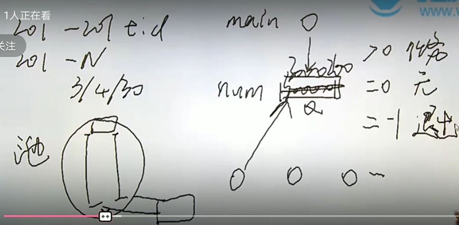
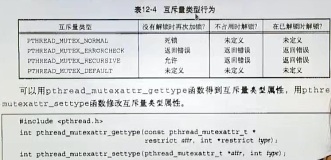
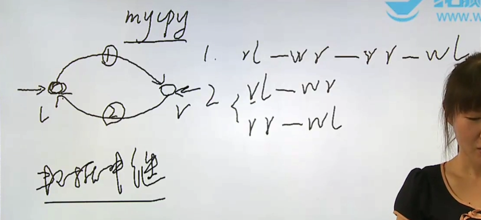
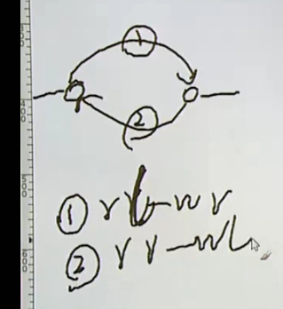
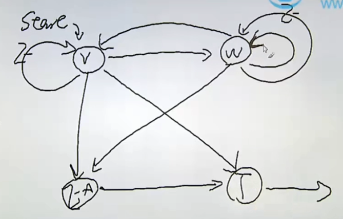
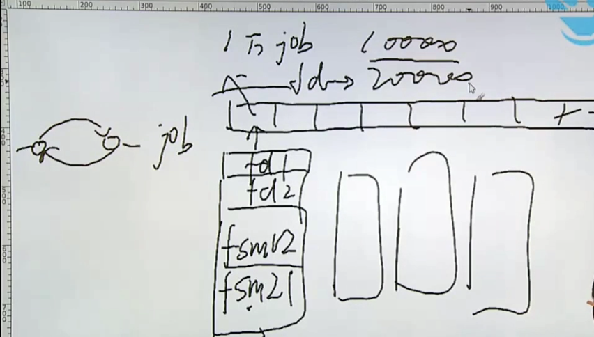
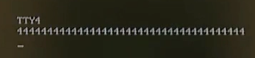
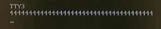

    linux_c入门_4.md
    
    :Author: kalipy
    :Email: kalipy@debian
    :Date: 2022-04-15 16:44

### 线程池实现

eg1(请认真思考这个程序，你可以看懂).

    kalipy@debian ~/g/l/thread> more main.c
    #include <stdio.h>
    #include <stdlib.h>
    #include <sys/types.h>
    #include <unistd.h>
    #include <pthread.h>
    #include <string.h>
    
    #define LEFT  30000000
    #define RIGHT 30000200
    
    #define THRNUM  4
    
    static int num = 0;
    static pthread_mutex_t mut_num = PTHREAD_MUTEX_INITIALIZER;
    
    //判断范围内是否是素数
    static void *thr_prime(void *p)
    {
        int i, j, mark;
    
        while (1)
        {
            pthread_mutex_lock(&mut_num);
            while (num == 0)
            {
                pthread_mutex_unlock(&mut_num);
                sched_yield();
                pthread_mutex_lock(&mut_num);
            }
            if (num == -1)
            {
                pthread_mutex_unlock(&mut_num);
                break;
            }
            i = num;
            num = 0;
            pthread_mutex_unlock(&mut_num);
    
            mark = 1;
            for (j = 2; j < i / 2; j++)
            {
                if (i % j == 0)
                {
                    mark = 0;
                    break;
                }
            }
    
            if (mark)
                printf("[%d]%d is a primer\n", (int)p, i);
        }
    
        pthread_exit(NULL);
        //exit(0);
    }
    
    int main(int argc, char **argv)
    {
        int i, err;
        pthread_t tid[THRNUM];
    
        for (i = 0; i <= THRNUM; i++)
        {
            err = pthread_create(tid + i, NULL, thr_prime, (void *)i);
            if (err)
            {
                fprintf(stderr, "pthread_create():%s\n", strerror(err));
                exit(1);
            }
        }
    
        for (i = LEFT; i<= RIGHT; i++)
        {
            pthread_mutex_lock(&mut_num);
    
            while (num != 0)
            {
                pthread_mutex_unlock(&mut_num);
                //sleep(1);
                sched_yield();
                pthread_mutex_lock(&mut_num);
            }
            num = i;
            pthread_mutex_unlock(&mut_num);
        }
    
        pthread_mutex_lock(&mut_num);
        while (num != 0)
        {
            pthread_mutex_unlock(&mut_num);
            sched_yield();
            pthread_mutex_lock(&mut_num);
        }
        num = -1;
        pthread_mutex_unlock(&mut_num);
    
        for (i = 0; i <= THRNUM; i++)
        {
            pthread_join(tid[i], NULL);
        }
    
        pthread_mutex_destroy(&mut_num);
    
        exit(0);
    }
    kalipy@debian ~/g/l/thread> make main
    cc -pthread  -pthread  main.c   -o main
    main.c: In function ‘thr_prime’:
    main.c:50:44: warning: cast from pointer to integer of different size [-Wpointer-to-int-cast]
                 printf("[%d]%d is a primer\n", (int)p, i);
                                                ^
    main.c: In function ‘main’:
    main.c:64:56: warning: cast to pointer from integer of different size [-Wint-to-pointer-cast]
             err = pthread_create(tid + i, NULL, thr_prime, (void *)i);
                                                            ^
    kalipy@debian ~/g/l/thread> ./main
    [2]30000023 is a primer
    [4]30000049 is a primer
    [0]30000037 is a primer
    [1]30000001 is a primer
    [3]30000041 is a primer
    [4]30000071 is a primer
    [2]30000059 is a primer
    [3]30000109 is a primer
    [0]30000079 is a primer
    [4]30000133 is a primer
    [1]30000083 is a primer
    [2]30000137 is a primer
    [4]30000163 is a primer
    [0]30000167 is a primer
    [3]30000149 is a primer
    [1]30000169 is a primer
    [2]30000193 is a primer
    [4]30000199 is a primer
    kalipy@debian ~/g/l/thread> ./main | wc -l
    18
    kalipy@debian ~/g/l/thread> ./main | wc -l
    18
    kalipy@debian ~/g/l/thread> ./main | wc -l
    18
    kalipy@debian ~/g/l/thread> ./primer0_pool_busy
    [4]30000041 is a primer
    [2]30000037 is a primer
    [0]30000023 is a primer
    [1]30000001 is a primer
    [3]30000049 is a primer
    [3]30000109 is a primer
    [2]30000059 is a primer
    [4]30000071 is a primer
    [1]30000083 is a primer
    [0]30000079 is a primer
    [4]30000149 is a primer
    [2]30000137 is a primer
    [3]30000133 is a primer
    [0]30000167 is a primer
    [1]30000163 is a primer
    [4]30000169 is a primer
    [2]30000193 is a primer
    [3]30000199 is a primer

### 改写我们之前的程序

由信号版的令牌桶改为多线程版的令牌桶

eg1.

临界区优化前：

    mytbf_t *mytbf_init(int cps, int burst)
    {
        struct mytbf_st *me;
        int pos;
    
        if (!inited)
        {
            module_load();
            inited = 1;
        }
    
        pthread_mutex_lock(&mut_job);
        pos = get_free_pos();
        if (pos < 0)
            return NULL;
    
        me = malloc(sizeof(*me));
        if (me == NULL)
            return NULL;
    
        me->token = 0;
        me->cps = cps;
        me->burst = burst;
        me->pos = pos;
    
        job[pos] = me;
        pthread_mutex_unlock(&mut_job);
    
        return me;
    }

临界区优化后：

    mytbf_t *mytbf_init(int cps, int burst)
    {
        struct mytbf_st *me;
        int pos;
    
        if (!inited)
        {
            module_load();
            inited = 1;
        }
    
        me = malloc(sizeof(*me));//因为这些内容和job数组没关系(只有job数组才是要加锁的)，就不要放在临界区里面了
        if (me == NULL)
            return NULL;
    
        me->token = 0;
        me->cps = cps;
        me->burst = burst;

        pthread_mutex_lock(&mut_job);
        pos = get_free_pos();
        if (pos < 0)
            return NULL;
    
        me->pos = pos;
    
        job[pos] = me;
        pthread_mutex_unlock(&mut_job);
    
        return me;
    }

eg2.

    kalipy@debian ~/g/l/mytbf> git diff 
    diff --git a/main.c b/main.c
    index af9bf98..42a38e7 100644
    --- a/main.c
    +++ b/main.c
    @@ -78,8 +78,7 @@ int main(int argc, char **argv)
                 break;
     
             if (size - len > 0)
    -            mytbf_returntoken(tbf, size - len);//比如读到最后一行数据，只有3字节内容，但是刚才fech到了10个toen，
    那
    -        么就要归还10-3个token
    +            mytbf_returntoken(tbf, size - len);//比如读到最后一行数据，只有3字节内容，但是刚才fech到了10个toen，
    那么就要归还10-3个token
     
                 pos = 0;
             while (len > 0)
    diff --git a/makefile b/makefile
    index 6b0d8a1..9924380 100644
    --- a/makefile
    +++ b/makefile
    @@ -1,5 +1,5 @@
     CFLAGS+=-pthread
    -LDFLAGS+=pthread
    +LDFLAGS+=-pthread
     
     all:mytbf
     
    diff --git a/mytbf.c b/mytbf.c
    index dffa366..cd7acae 100644
    --- a/mytbf.c
    +++ b/mytbf.c
    @@ -1,16 +1,21 @@
     #include <stdio.h>
     #include <stdlib.h>
    -#include <signal.h>
     #include <errno.h>
     #include <unistd.h>
    +#include <string.h>
    +#include <pthread.h>
     
     #include "mytbf.h"
     
    -typedef void (*sighandler_t)(int);
    +//typedef void (*sighandler_t)(int);
     
     static struct mytbf_st* job[MYTBF_MAX];
    +static pthread_mutex_t mut_job = PTHREAD_MUTEX_INITIALIZER;//保护job数组
    +static pthread_t tid_alrm;
    +static pthread_once_t init_once = PTHREAD_ONCE_INIT;
    +
     static int inited = 0;//bool
    -static sighandler_t alrm_handler_save;
    +//static sighandler_t alrm_handler_save;
     
     //数据结构写在.c文件进行隐藏，因为.h文件将来要给用户
     struct mytbf_st
    @@ -19,39 +24,64 @@ struct mytbf_st
         int burst;
         int token;
         int pos;
    +    pthread_mutex_t mut;
     };
     
    -static void alrm_handler(int s)
    +static void *thr_alrm(void *p)
     {
    -    alarm(1);
    -    for (int i = 0; i < MYTBF_MAX; i++) {
    -        if (job[i] != NULL)
    -        {
    -            job[i]->token += job[i]->cps;
    -            if (job[i]->token > job[i]->burst)
    -                job[i]->token = job[i]->burst;
    +    //alarm(1);
    +    while (1)
    +    {
    +        pthread_mutex_lock(&mut_job);
    +        for (int i = 0; i < MYTBF_MAX; i++) {
    +            if (job[i] != NULL)
    +            {
    +                pthread_mutex_lock(&job[i]->mut);
    +                job[i]->token += job[i]->cps;
    +                if (job[i]->token > job[i]->burst)
    +                    job[i]->token = job[i]->burst;
    +                pthread_mutex_unlock(&job[i]->mut);
    +            }
             }
    +        pthread_mutex_unlock(&mut_job);
    +        sleep(1);
         }
     }
     
     static void module_unload(void)
     {
    -    signal(SIGALRM, alrm_handler_save);
    -    alarm(0);
    +    //signal(SIGALRM, alrm_handler_save);
    +    //alarm(0);
    +
    +    pthread_cancel(tid_alrm);//while(1)方法体的线程用join等不到，所以要先cancel
    +    pthread_join(tid_alrm, NULL);
    +
         for (int i = 0; i < MYTBF_MAX; i++) {
    -        free(job[i]);
    +        if (job[i] != NULL) {//这里没必要给job加锁，因为module_unload只能被调用一次
    +            mytbf_destroy(job[i]);
    +        }
         }
    +
    +    pthread_mutex_destroy(&mut_job);
     }
     
     static void module_load(void)
     {
    -    alrm_handler_save = signal(SIGALRM, alrm_handler);
    -    alarm(1);
    +    //alrm_handler_save = signal(SIGALRM, alrm_handler);
    +    //alarm(1);
    +
    +    int err;
    +
    +    err = pthread_create(&tid_alrm, NULL, thr_alrm, NULL);
    +    if (err) {
    +        fprintf(stderr, "pthread_create():%s\n", strerror(err));
    +        exit(1);
    +    }
     
         atexit(module_unload);
     }
     
    -static int get_free_pos(void)
    +static int get_free_pos_unlocked(void)
     {
         for (int i = 0; i < MYTBF_MAX; i++) {
             if (job[i] == NULL)
    @@ -65,15 +95,17 @@ mytbf_t *mytbf_init(int cps, int burst)
         struct mytbf_st *me;
         int pos;
     
    +#if 0
    +    lock();
         if (!inited)
         {
             module_load();
             inited = 1;
         }
    +    unlock();
    +#endif
     
    -    pos = get_free_pos();
    -    if (pos < 0)
    -        return NULL;
    +    pthread_once(&init_once, module_load);
     
         me = malloc(sizeof(*me));
         if (me == NULL)
    @@ -82,9 +114,22 @@ mytbf_t *mytbf_init(int cps, int burst)
         me->token = 0;
         me->cps = cps;
         me->burst = burst;
    +    pthread_mutex_init(&me->mut, NULL);
    +
    +    pthread_mutex_lock(&mut_job);
    +    pos = get_free_pos_unlocked();
    +    if (pos < 0)
    +    {
    +        pthread_mutex_unlock(&mut_job);
    +        free(me);
    +
    +        return NULL;
    +    }
    +
         me->pos = pos;
     
         job[pos] = me;
    +    pthread_mutex_unlock(&mut_job);
     
         return me;
     }
    @@ -93,7 +138,11 @@ int mytbf_destroy(mytbf_t *ptr)
     {
         struct mytbf_st *me = ptr;
     
    +    pthread_mutex_lock(&mut_job);
         job[me->pos] = NULL;
    +    pthread_mutex_unlock(&mut_job);
    +
    +    pthread_mutex_destroy(&me->mut);
         free(ptr);
     
         return 0;
    @@ -112,12 +161,19 @@ int mytbf_fetchtoken(mytbf_t *ptr, int size)
         if (size <= 0)
             return -EINVAL;
     
    +    pthread_mutex_lock(&me->mut);
         while (me->token <= 0)
    -        pause();
    +    {
    +        pthread_mutex_unlock(&me->mut);
    +        sched_yield();
    +        pthread_mutex_lock(&me->mut);
    +    }
     
         n = min(me->token, size);
     
         me->token -= n;
    +    pthread_mutex_unlock(&me->mut);
    +
         return n;
     }
     
    @@ -128,9 +184,11 @@ int mytbf_returntoken(mytbf_t *ptr, int size)
         if (size <= 0)
             return -EINVAL;
     
    +    pthread_mutex_lock(&me->mut);
         me->token += size;
         if (me->token > me->burst)
             me->token = me->burst;
    +    pthread_mutex_unlock(&me->mut);
     
         return size;
     }
    diff --git a/mytbf.h b/mytbf.h
    index c1186fc..17b1bfe 100644
    --- a/mytbf.h
    +++ b/mytbf.h
    @@ -3,8 +3,7 @@
     
     #define MYTBF_MAX   1024
     
    -//struct mytbf_st *mytbf_init(int cps, int burst);//这样写有问题，因为.h文件不认识我们隐藏起来的数据结构，况且你
    这
    -样把我们的数据结构真正的名字让用户知道，也不好
    +//struct mytbf_st *mytbf_init(int cps, int burst);//这样写有问题，因为.h文件不认识我们隐藏起来的数据结构，况且你
    这样把我们的数据结构真正的名字让用户知道，也不好
     
     //所以我们这样写，骗用户
     typedef void mytbf_t;
    kalipy@debian ~/g/l/mytbf> more main.c 
    #include <stdio.h>
    #include <stdlib.h>
    #include <errno.h> 
    #include <unistd.h> 
    #include <sys/types.h>
    #include <sys/stat.h>
    #include <fcntl.h>
    #include <signal.h>
    #include <string.h>
    #include "mytbf.h"
    
    #define CPS     10
    #define BUFSIZE 1024
    #define BURST   100
    
    static volatile int token = 0;
    
    static void alrm_handler(int s)
    {
        alarm(1);
        token++;
        if (token > BURST)
            token = BURST;
    }
    
    int main(int argc, char **argv)
    {
        int sfd, dfd = 1;
        int ret, len, pos;
        char buf[BUFSIZE];
        mytbf_t *tbf;
        int size;
    
        if (argc < 2)
        {
            fprintf(stderr, "Usage...");
            exit(1);
        }
    
        tbf = mytbf_init(CPS, BURST);
        if (tbf == NULL)
        {
            fprintf(stderr, "mytbf_init() failed!\n");
            exit(1);
        }
    
        do
        {
            sfd = open(argv[1], O_RDONLY);
            if (sfd < 0)
            {
                if (errno != EINTR)
                {
                    perror("open()");
                    exit(1);
                }
            }
        } while (sfd < 0);
    
        while (1)
        {
            size = mytbf_fetchtoken(tbf, BUFSIZE);
            if (size < 0)
            {
                fprintf(stderr, "mytbf_fetchtoken():%s\n", strerror(-size));
                exit(1);
            }
    
            while ((len = read(sfd, buf, size)) < 0)
            {
                if (errno == EINTR)
                    continue;
    
                perror("read()");
                break;
            }
            if (len == 0)
                break;
    
            if (size - len > 0)
                mytbf_returntoken(tbf, size - len);//比如读到最后一行数据，只有3字节内容，但是刚才fech到了10个toen，那
    么就要归还10-3个token
    
                pos = 0;
            while (len > 0)
            {
                ret = write(dfd, buf + pos, len);
                if (ret < 0)
                {
                    if (errno == EINTR)
                        continue;
    
                    perror("write()");
                    exit(1);
                }
                pos += ret;
                len -= ret;
            }
        }
    
        //close(dfd);
        close(sfd);
        mytbf_destroy(tbf);
    
        exit(0);
    }
    kalipy@debian ~/g/l/mytbf> more makefile 
    CFLAGS+=-pthread
    LDFLAGS+=-pthread
    
    all:mytbf
    
    mytbf: main.o mytbf.o
            gcc $^ -o $@ $(CFLAGS) $(LDFLAGS)
    
    clean:
            rm *.o mytbf -rf
    kalipy@debian ~/g/l/mytbf> more mytbf.h 
    #ifndef MYTBF_H
    #define MYTBF_H
    
    #define MYTBF_MAX   1024
    
    //struct mytbf_st *mytbf_init(int cps, int burst);//这样写有问题，因为.h文件不认识我们隐藏起来的数据结构，况且你这
    样把我们的数据结构真正的名字让用户知道，也不好
    
    //所以我们这样写，骗用户
    typedef void mytbf_t;
    mytbf_t *mytbf_init(int cps, int burst);
    
    int mytbf_fetchtoken(mytbf_t *, int);
    
    int mytbf_returntoken(mytbf_t *, int);
    
    int mytbf_destroy(mytbf_t *);
    
    #endif /* !MYTBF_H */
    
    kalipy@debian ~/g/l/mytbf> more mytbf.c 
    #include <stdio.h>
    #include <stdlib.h>
    #include <errno.h>
    #include <unistd.h>
    #include <string.h>
    #include <pthread.h>
    
    #include "mytbf.h"
    
    //typedef void (*sighandler_t)(int);
    
    static struct mytbf_st* job[MYTBF_MAX];
    static pthread_mutex_t mut_job = PTHREAD_MUTEX_INITIALIZER;//保护job数组
    static pthread_t tid_alrm;
    static pthread_once_t init_once = PTHREAD_ONCE_INIT;
    
    static int inited = 0;//bool
    //static sighandler_t alrm_handler_save;
    
    //数据结构写在.c文件进行隐藏，因为.h文件将来要给用户
    struct mytbf_st
    {
        int cps;
        int burst;
        int token;
        int pos;
        pthread_mutex_t mut;
    };
    
    static void *thr_alrm(void *p)
    {
        //alarm(1);
        while (1)
        {
            pthread_mutex_lock(&mut_job);
            for (int i = 0; i < MYTBF_MAX; i++) {
                if (job[i] != NULL)
                {
                    pthread_mutex_lock(&job[i]->mut);
                    job[i]->token += job[i]->cps;
                    if (job[i]->token > job[i]->burst)
                        job[i]->token = job[i]->burst;
                    pthread_mutex_unlock(&job[i]->mut);
                }
            }
            pthread_mutex_unlock(&mut_job);
            sleep(1);
        }
    }
    
    static void module_unload(void)
    {
        //signal(SIGALRM, alrm_handler_save);
        //alarm(0);
    
        pthread_cancel(tid_alrm);//while(1)方法体的线程用join等不到，所以要先cancel
        pthread_join(tid_alrm, NULL);
    
        for (int i = 0; i < MYTBF_MAX; i++) {
            if (job[i] != NULL) {//这里没必要给job加锁，因为module_unload只能被调用一次
                mytbf_destroy(job[i]);
            }
        }
    
        pthread_mutex_destroy(&mut_job);
    }
    
    static void module_load(void)
    {
        //alrm_handler_save = signal(SIGALRM, alrm_handler);
        //alarm(1);
    
        int err;
    
        err = pthread_create(&tid_alrm, NULL, thr_alrm, NULL);
        if (err) {
            fprintf(stderr, "pthread_create():%s\n", strerror(err));
            exit(1);
        }
    
        atexit(module_unload);
    }
    
    static int get_free_pos_unlocked(void)
    {
        for (int i = 0; i < MYTBF_MAX; i++) {
            if (job[i] == NULL)
                return i;
        }
        return -1;
    }
    
    mytbf_t *mytbf_init(int cps, int burst)
    {
        struct mytbf_st *me;
        int pos;
    
    #if 0
        lock();
        if (!inited)
        {
            module_load();
            inited = 1;
        }
        unlock();
    #endif
    
        pthread_once(&init_once, module_load);
    
        me = malloc(sizeof(*me));
        if (me == NULL)
            return NULL;
    
        me->token = 0;
        me->cps = cps;
        me->burst = burst;
        pthread_mutex_init(&me->mut, NULL);
    
        pthread_mutex_lock(&mut_job);
        pos = get_free_pos_unlocked();
        if (pos < 0)
        {
            pthread_mutex_unlock(&mut_job);
            free(me);
    
            return NULL;
        }
    
        me->pos = pos;
    
        job[pos] = me;
        pthread_mutex_unlock(&mut_job);
    
        return me;
    }
    
    int mytbf_destroy(mytbf_t *ptr)
    {
        struct mytbf_st *me = ptr;
    
        pthread_mutex_lock(&mut_job);
        job[me->pos] = NULL;
        pthread_mutex_unlock(&mut_job);
    
        pthread_mutex_destroy(&me->mut);
        free(ptr);
    
        return 0;
    }
    
    static int min(int a, int b)
    {
        return a < b ? a : b;
    }
    
    int mytbf_fetchtoken(mytbf_t *ptr, int size)
    {
        struct mytbf_st *me = ptr;
        int n;
    
        if (size <= 0)
            return -EINVAL;
    
        pthread_mutex_lock(&me->mut);
        while (me->token <= 0)
        {
            pthread_mutex_unlock(&me->mut);
            sched_yield();
            pthread_mutex_lock(&me->mut);
        }
    
        n = min(me->token, size);
    
        me->token -= n;
        pthread_mutex_unlock(&me->mut);
    
        return n;
    }
    
    int mytbf_returntoken(mytbf_t *ptr, int size)
    {
        struct mytbf_st *me = ptr;
    
        if (size <= 0)
            return -EINVAL;
    
        pthread_mutex_lock(&me->mut);
        me->token += size;
        if (me->token > me->burst)
            me->token = me->burst;
        pthread_mutex_unlock(&me->mut);
    
        return size;
    }

### 线程 条件变量

pthread_cond_t
pthread_cond_init
pthread_cond_destroy
pthread_cond_broadcast
pthread_cond_signal

eg1(改进刚才的程序，避免yeld那部分while的忙等).

    kalipy@debian ~/g/l/mytbf> git diff
    diff --git a/mytbf.c b/mytbf.c
    index cd7acae..001deb0 100644
    --- a/mytbf.c
    +++ b/mytbf.c
    @@ -25,6 +25,7 @@ struct mytbf_st
         int token;
         int pos;
         pthread_mutex_t mut;
    +    pthread_cond_t cond;
     };
     
     static void *thr_alrm(void *p)
    @@ -40,6 +41,7 @@ static void *thr_alrm(void *p)
                     job[i]->token += job[i]->cps;
                     if (job[i]->token > job[i]->burst)
                         job[i]->token = job[i]->burst;
    +                pthread_cond_broadcast(&job[i]->cond);
                     pthread_mutex_unlock(&job[i]->mut);
                 }
             }
    @@ -115,6 +117,7 @@ mytbf_t *mytbf_init(int cps, int burst)
         me->cps = cps;
         me->burst = burst;
         pthread_mutex_init(&me->mut, NULL);
    +    pthread_cond_init(&me->cond, NULL);
     
         pthread_mutex_lock(&mut_job);
         pos = get_free_pos_unlocked();
    @@ -143,6 +146,7 @@ int mytbf_destroy(mytbf_t *ptr)
         pthread_mutex_unlock(&mut_job);
     
         pthread_mutex_destroy(&me->mut);
    +    pthread_cond_destroy(&me->cond);
         free(ptr);
     
         return 0;
    @@ -164,9 +168,13 @@ int mytbf_fetchtoken(mytbf_t *ptr, int size)
         pthread_mutex_lock(&me->mut);
         while (me->token <= 0)
         {
    +#if 0
             pthread_mutex_unlock(&me->mut);
             sched_yield();
             pthread_mutex_lock(&me->mut);
    +#endif
    +
    +        pthread_cond_wait(&me->cond, &me->mut);//cond_wait语义相当于上面三句话(但不是原子性的)，只是等待不是yield，而是等待别人的通知
         }
     
         n = min(me->token, size);
    @@ -188,6 +196,7 @@ int mytbf_returntoken(mytbf_t *ptr, int size)
         me->token += size;
         if (me->token > me->burst)
             me->token = me->burst;
    +    pthread_cond_broadcast(&me->cond);
         pthread_mutex_unlock(&me->mut);
     
         return size;

### 线程 条件变量实例

eg1(把我们之前筛素数的程序改为非忙等).

    kalipy@debian ~/g/l/thread> git diff
    diff --git a/main.c b/main.c
    index 1af606c..6e376cf 100644
    --- a/main.c
    +++ b/main.c
    @@ -12,6 +12,7 @@
     
     static int num = 0;
     static pthread_mutex_t mut_num = PTHREAD_MUTEX_INITIALIZER;
    +static pthread_cond_t cond_num = PTHREAD_COND_INITIALIZER;
     
     //判断范围内是否是素数
     static void *thr_prime(void *p)
    @@ -23,9 +24,12 @@ static void *thr_prime(void *p)
             pthread_mutex_lock(&mut_num);
             while (num == 0)
             {
    +#if 0
                 pthread_mutex_unlock(&mut_num);
                 sched_yield();
                 pthread_mutex_lock(&mut_num);
    +#endif
    +            pthread_cond_wait(&cond_num, &mut_num);
             }
             if (num == -1)
             {
    @@ -34,6 +38,7 @@ static void *thr_prime(void *p)
             }
             i = num;
             num = 0;
    +        pthread_cond_broadcast(&cond_num);
             pthread_mutex_unlock(&mut_num);
     
             mark = 1;
    @@ -75,12 +80,16 @@ int main(int argc, char **argv)
     
             while (num != 0)
             {
    +#if 0
                 pthread_mutex_unlock(&mut_num);
                 //sleep(1);
                 sched_yield();
                 pthread_mutex_lock(&mut_num);
    +#endif
    +            pthread_cond_wait(&cond_num, &mut_num);
             }
             num = i;
    +        pthread_cond_signal(&cond_num);
             pthread_mutex_unlock(&mut_num);
         }
     
    @@ -92,6 +101,7 @@ int main(int argc, char **argv)
             pthread_mutex_lock(&mut_num);
         }
         num = -1;
    +    pthread_cond_broadcast(&cond_num);
         pthread_mutex_unlock(&mut_num);
     
         for (i = 0; i <= THRNUM; i++)
    @@ -100,6 +110,7 @@ int main(int argc, char **argv)
         }
     
         pthread_mutex_destroy(&mut_num);
    +    pthread_cond_destroy(&cond_num);
     
         exit(0);
     }
    kalipy@debian ~/g/l/thread> more main.c 
    #include <stdio.h>
    #include <stdlib.h>
    #include <sys/types.h>
    #include <unistd.h>
    #include <pthread.h>
    #include <string.h>
    
    #define LEFT  30000000
    #define RIGHT 30000200
    
    #define THRNUM  4
    
    static int num = 0;
    static pthread_mutex_t mut_num = PTHREAD_MUTEX_INITIALIZER;
    static pthread_cond_t cond_num = PTHREAD_COND_INITIALIZER;
    
    //判断范围内是否是素数
    static void *thr_prime(void *p)
    {
        int i, j, mark;
    
        while (1)
        {
            pthread_mutex_lock(&mut_num);
            while (num == 0)
            {
    #if 0
                pthread_mutex_unlock(&mut_num);
                sched_yield();
                pthread_mutex_lock(&mut_num);
    #endif
                pthread_cond_wait(&cond_num, &mut_num);
            }
            if (num == -1)
            {
                pthread_mutex_unlock(&mut_num);
                break;
            }
            i = num;
            num = 0;
            pthread_cond_broadcast(&cond_num);
            pthread_mutex_unlock(&mut_num);
    
            mark = 1;
            for (j = 2; j < i / 2; j++)
            {
                if (i % j == 0)
                {
                    mark = 0;
                    break;
                }
            }
    
            if (mark)
                printf("[%d]%d is a primer\n", (int)p, i);
        }
    
        pthread_exit(NULL);
        //exit(0);
    }
    
    int main(int argc, char **argv)
    {
        int i, err;
        pthread_t tid[THRNUM];
    
        for (i = 0; i <= THRNUM; i++)
        {
            err = pthread_create(tid + i, NULL, thr_prime, (void *)i);
            if (err)
            {
                fprintf(stderr, "pthread_create():%s\n", strerror(err));
                exit(1);
            }
        }
    
        for (i = LEFT; i<= RIGHT; i++)
        {
            pthread_mutex_lock(&mut_num);
    
            while (num != 0)
            {
    #if 0
                pthread_mutex_unlock(&mut_num);
                //sleep(1);
                sched_yield();
                pthread_mutex_lock(&mut_num);
    #endif
                pthread_cond_wait(&cond_num, &mut_num);
            }
            num = i;
            pthread_cond_signal(&cond_num);
            pthread_mutex_unlock(&mut_num);
        }
    
        pthread_mutex_lock(&mut_num);
        while (num != 0)
        {
            pthread_mutex_unlock(&mut_num);
            sched_yield();
            pthread_mutex_lock(&mut_num);
        }
        num = -1;
        pthread_cond_broadcast(&cond_num);
        pthread_mutex_unlock(&mut_num);
    
        for (i = 0; i <= THRNUM; i++)
        {
            pthread_join(tid[i], NULL);
        }
    
        pthread_mutex_destroy(&mut_num);
        pthread_cond_destroy(&cond_num);
    
        exit(0);
    }

eg2(之前abcd打印的改为通知法).

    kalipy@debian ~/g/l/thread> git diff
    diff --git a/abcd.c b/abcd.c
    index 1a6c1e6..59b04ce 100644
    --- a/abcd.c
    +++ b/abcd.c
    @@ -6,7 +6,10 @@
     #include <string.h>
     
     #define THRNUM      4
    -static pthread_mutex_t mut[THRNUM];
    +
    +static int num = 0;
    +static pthread_mutex_t mut = PTHREAD_MUTEX_INITIALIZER;
    +static pthread_cond_t cond = PTHREAD_COND_INITIALIZER;
     
     static int next(int n)
     {
    @@ -22,9 +25,13 @@ static void *thr_func(void *p)
     
         while (1)
         {
    -        pthread_mutex_lock(mut + n);
    +        pthread_mutex_lock(&mut);
    +        while (num != n)
    +            pthread_cond_wait(&cond, &mut);
             write(1, &c, 1);
    -        pthread_mutex_unlock(mut + next(n));
    +        num = next(num);
    +        pthread_cond_broadcast(&cond);
    +        pthread_mutex_unlock(&mut);
         }
     
         pthread_exit(NULL);
    @@ -36,8 +43,6 @@ int main(void)
         int err;
     
         for (int i = 0; i < THRNUM; i++) {
    -        pthread_mutex_init(mut + i, NULL);
    -        pthread_mutex_lock(mut + i);
     
             err = pthread_create(tid + i, NULL, thr_func, (void *)i);
             if (err)
    @@ -47,13 +52,14 @@ int main(void)
             }
         }
     
    -    pthread_mutex_unlock(mut + 0);
    -
         alarm(3);//因为while (1)永远不会退出，所以我用alarm信号来退出
     
         for (int i = 0; i < THRNUM; i++) {
             pthread_join(tid[i], NULL); 
         }
     
    +    pthread_mutex_destroy(&mut);
    +    pthread_cond_destroy(&cond);
    +
         exit(0);
     }
    kalipy@debian ~/g/l/thread> more abcd.c
    #include <stdio.h>
    #include <stdlib.h>
    #include <sys/types.h>
    #include <unistd.h>
    #include <pthread.h>
    #include <string.h>
    
    #define THRNUM      4
    
    static int num = 0;
    static pthread_mutex_t mut = PTHREAD_MUTEX_INITIALIZER;
    static pthread_cond_t cond = PTHREAD_COND_INITIALIZER;
    
    static int next(int n)
    {
        if (n + 1 == THRNUM)
            return 0;
        return n + 1;
    }
    
    static void *thr_func(void *p)
    {
        int n = (int)p;
        int c = 'a' + n;
    
        while (1)
        {
            pthread_mutex_lock(&mut);
            while (num != n)
                pthread_cond_wait(&cond, &mut);
            write(1, &c, 1);
            num = next(num);
            pthread_cond_broadcast(&cond);
            pthread_mutex_unlock(&mut);
        }
    
        pthread_exit(NULL);
    }
    
    int main(void)
    {
        pthread_t tid[THRNUM];
        int err;
    
        for (int i = 0; i < THRNUM; i++) {
    
            err = pthread_create(tid + i, NULL, thr_func, (void *)i);
            if (err)
            {
                fprintf(stderr, "pthread_create():%s\n", strerror(err));
                exit(1);
            }
        }
    
        alarm(3);//因为while (1)永远不会退出，所以我用alarm信号来退出
    
        for (int i = 0; i < THRNUM; i++) {
            pthread_join(tid[i], NULL); 
        }
    
        pthread_mutex_destroy(&mut);
        pthread_cond_destroy(&cond);
    
        exit(0);
    }

### 线程 信号量

eg1.

    kalipy@debian ~/g/l/mysem> git diff
    diff --git a/main.c b/main.c
    index 7292e27..29a53b2 100644
    --- a/main.c
    +++ b/main.c
    @@ -5,11 +5,15 @@
     #include <pthread.h>
     #include <string.h>
     
    +#include "mysem.h"
    +
     #define LEFT  30000000
     #define RIGHT 30000200
     
     #define THRNUM  (RIGHT - LEFT + 1)
    -#define N 4
    +#define N 4//同一时刻，最多只能有四个线程存在
    +
    +static mysem_t *sem;
     
     //判断范围内是否是素数
     static void *thr_prime(void *p)
    @@ -31,6 +35,9 @@ static void *thr_prime(void *p)
         if (mark)
             printf("%d is a primer\n", i);
     
    +    sleep(5);//放大竞争
    +
    +    mysem_add(sem, 1);
         pthread_exit(NULL);
         //exit(0);
     }
    @@ -40,8 +47,15 @@ int main(int argc, char **argv)
         int i, j, mark, err;
         pthread_t tid[THRNUM];
     
    +    sem = mysem_init(N);
    +    if (sem == NULL) {
    +        fprintf(stderr, "mysem_init() failed!\n");
    +        exit(1);
    +    }
    +
         for (i = LEFT; i <= RIGHT; i++)
         {
    +        mysem_sub(sem, 1);
             err = pthread_create(tid + (i - LEFT), NULL, thr_prime, &i);
             if (err)
             {
    @@ -55,5 +69,7 @@ int main(int argc, char **argv)
             pthread_join(tid[i - LEFT], NULL);
         }
     
    +    mysem_destroy(sem);
    +
         exit(0);
     }
    diff --git a/mysem.c b/mysem.c
    index 18dedb2..2e64a6d 100644
    --- a/mysem.c
    +++ b/mysem.c
    @@ -1,4 +1,65 @@
    +#include <stdio.h>
    +#include <stdlib.h>
    +#include <pthread.h>
    +
     #include "mysem.h"
     
    +struct mysem_st
    +{
    +    int value;
    +    pthread_mutex_t mut;
    +    pthread_cond_t cond;
    +};
    +
    +mysem_t *mysem_init(int initval)
    +{
    +    struct mysem_st *me;
    +
    +    me = malloc(sizeof(*me));
    +    if (me == NULL)
    +        return NULL;
    +
    +    me->value = initval;
    +    pthread_mutex_init(&me->mut, NULL);
    +    pthread_cond_init(&me->cond, NULL);
    +
    +    return me;
    +}
    +
    +int mysem_add(mysem_t *ptr, int n)
    +{
    +    struct mysem_st *me = ptr;
    +
    +    pthread_mutex_lock(&me->mut);
    +    me->value += n;
    +    pthread_cond_broadcast(&me->cond);
    +    pthread_mutex_unlock(&me->mut);
    +
    +    return n;
    +}
    +
    +int mysem_sub(mysem_t *ptr, int n)
    +{
    +    struct mysem_st *me = ptr;
    +
    +    pthread_mutex_lock(&me->mut);
    +
    +    while (me->value < n)
    +        pthread_cond_wait(&me->cond, &me->mut);
    +
    +    me->value -= n;
    +    pthread_mutex_unlock(&me->mut);
    +
    +    return n;
    +}
    +
    +int mysem_destroy(mysem_t *ptr)
    +{
    +    struct mysem_st *me = ptr;
     
    +    pthread_mutex_destroy(&me->mut);
    +    pthread_cond_destroy(&me->cond);
    +    free(me);
     
    +    return 0;
    +}
    diff --git a/mysem.h b/mysem.h
    index 209bc0a..947c8cd 100644
    --- a/mysem.h
    +++ b/mysem.h
    @@ -1,6 +1,14 @@
     #ifndef MYSEM_H
     #define MYSEM_H
     
    +typedef void mysem_t;//隐藏真正的结构体
     
    +mysem_t *mysem_init(int initval);
    +
    +int mysem_add(mysem_t *, int);
    +
    +int mysem_sub(mysem_t *, int);
    +
    +int mysem_destroy(mysem_t *);
     
     #endif /* !MYSEM_H */
    kalipy@debian ~/g/l/mysem> 
    kalipy@debian ~/g/l/mysem> more main.c 
    #include <stdio.h>
    #include <stdlib.h>
    #include <sys/types.h>
    #include <unistd.h>
    #include <pthread.h>
    #include <string.h>
    
    #include "mysem.h"
    
    #define LEFT  30000000
    #define RIGHT 30000200
    
    #define THRNUM  (RIGHT - LEFT + 1)
    #define N 4//同一时刻，最多只能有四个线程存在
    
    static mysem_t *sem;
    
    //判断范围内是否是素数
    static void *thr_prime(void *p)
    {
        int i, j, mark;
    
        i = *(int *)p;
    
        mark = 1;
        for (j = 2; j < i / 2; j++)
        {
            if (i % j == 0)
            {
                mark = 0;
                break;
            }
        }
    
        if (mark)
            printf("%d is a primer\n", i);
    
        sleep(5);//放大竞争
    
        mysem_add(sem, 1);
        pthread_exit(NULL);
        //exit(0);
    }
    
    int main(int argc, char **argv)
    {
        int i, j, mark, err;
        pthread_t tid[THRNUM];
    
        sem = mysem_init(N);
        if (sem == NULL) {
            fprintf(stderr, "mysem_init() failed!\n");
            exit(1);
        }
    
        for (i = LEFT; i <= RIGHT; i++)
        {
            mysem_sub(sem, 1);
            err = pthread_create(tid + (i - LEFT), NULL, thr_prime, &i);
            if (err)
            {
                fprintf(stderr, "pthread_create():%s\n", strerror(err));
                exit(1);
            }
        }
    
        for (i = LEFT; i <= RIGHT; i++)
        {
            pthread_join(tid[i - LEFT], NULL);
        }
    
        mysem_destroy(sem);
    
        exit(0);
    }
    kalipy@debian ~/g/l/mysem> more makefile 
    CFLAGS+=-pthread
    LDFLAGS+=-pthread
    
    all:mysem
    
    mysem: main.o mysem.o
            gcc $^ -o $@ $(CFLAGS) $(LDFLAGS)
    
    clean:
            rm *.o mysem -rf
    kalipy@debian ~/g/l/mysem> more mysem.c 
    #include <stdio.h>
    #include <stdlib.h>
    #include <pthread.h>
    
    #include "mysem.h"
    
    struct mysem_st
    {
        int value;
        pthread_mutex_t mut;
        pthread_cond_t cond;
    };
    
    mysem_t *mysem_init(int initval)
    {
        struct mysem_st *me;
    
        me = malloc(sizeof(*me));
        if (me == NULL)
            return NULL;
    
        me->value = initval;
        pthread_mutex_init(&me->mut, NULL);
        pthread_cond_init(&me->cond, NULL);
    
        return me;
    }
    
    int mysem_add(mysem_t *ptr, int n)
    {
        struct mysem_st *me = ptr;
    
        pthread_mutex_lock(&me->mut);
        me->value += n;
        pthread_cond_broadcast(&me->cond);
        pthread_mutex_unlock(&me->mut);
    
        return n;
    }
    
    int mysem_sub(mysem_t *ptr, int n)
    {
        struct mysem_st *me = ptr;
    
        pthread_mutex_lock(&me->mut);
    
        while (me->value < n)
            pthread_cond_wait(&me->cond, &me->mut);
    
        me->value -= n;
        pthread_mutex_unlock(&me->mut);
    
        return n;
    }
    
    int mysem_destroy(mysem_t *ptr)
    {
        struct mysem_st *me = ptr;
    
        pthread_mutex_destroy(&me->mut);
        pthread_cond_destroy(&me->cond);
        free(me);
    
        return 0;
    }
    kalipy@debian ~/g/l/mysem> more mysem.h 
    #ifndef MYSEM_H
    #define MYSEM_H
    
    typedef void mysem_t;//隐藏真正的结构体
    
    mysem_t *mysem_init(int initval);
    
    int mysem_add(mysem_t *, int);
    
    int mysem_sub(mysem_t *, int);
    
    int mysem_destroy(mysem_t *);
    
    #endif /* !MYSEM_H */

效果：

    ps ax -L
    26185 26185 pts/3    Sl+    0:00 ./mysem
    26185 26507 pts/3    Sl+    0:00 ./mysem
    26185 26508 pts/3    Sl+    0:00 ./mysem
    26185 26509 pts/3    Sl+    0:00 ./mysem
    26185 26510 pts/3    Sl+    0:00 ./mysem

### 线程属性

pthread_attr_init()

eg1.

    kalipy@debian ~/g/linux_c入门> more main2.c      
    #include <stdio.h>
    #include <stdlib.h>
    #include <pthread.h>
    #include <string.h>
    
    static void *func(void *p)
    {
        while (1)
            pause();
    
        pthread_exit(NULL);
    }
    
    int main(void)
    {
        int i;
        pthread_t tid;
    
        for (i = 0; ; i++)
        {
            int err = pthread_create(&tid, NULL, func, NULL);
            if (err)
            {
                fprintf(stderr, "pthread_create():%s\n", strerror(err));
                break;
            }
        }
    
        printf("%d\n", i);
    
        exit(0);
    }
    
    kalipy@debian ~/g/linux_c入门> gcc main2.c -pthread
    main2.c: In function ‘func’:
    main2.c:9:9: warning: implicit declaration of function ‘pause’ [-Wimplicit-function-declaration]
             pause();
             ^~~~~
    kalipy@debian ~/g/linux_c入门> ./a.out
    pthread_create():Resource temporarily unavailable
    10255

### 线程 互斥量属性 条件变量属性

eg1.

    kalipy@debian ~/g/linux_c入门> more main2.c
    #include <stdio.h>
    #include <stdlib.h>
    #include <pthread.h>
    #include <string.h>
    
    static void *func(void *p)
    {
        while (1)
            pause();
    
        pthread_exit(NULL);
    }
    
    int main(void)
    {
        int i;
        pthread_t tid;
        pthread_attr_t attr;
    
        pthread_attr_init(&attr);
        pthread_attr_setstacksize(&attr, 1024*1024);
    
        for (i = 0; ; i++)
        {
            int err = pthread_create(&tid, &attr, func, NULL);
            if (err)
            {
                fprintf(stderr, "pthread_create():%s\n", strerror(err));
                break;
            }
        }
    
        printf("%d\n", i);
    
        pthread_attr_destroy(&attr);
    
        exit(0);
    }

线程同步的属性

互斥量属性：

pthread_mutexattr_init();
pthread_mutexattr_destroy();
pthread_mutexattr_getpshared();
pthread_mutexattr_setpshared();
clone()//进程和线程的大杂烩函数
pthread_mutexattr_gettype();
pthread_mutexattr_settype();

说明：

不占用时解锁：不占用指一把锁不是你加的，但是你却去解锁

条件变量属性：

pthread_condattr_init()
pthread_condattr_destroy()

### 线程 重入

线程与信号：

pthread_sigmask()
sigwait()
pthread_kill()

另外一种线程标准：

openmp --> www.OpenMP.org

标准的IO函数基本都是线程安全的，我要用线程不安全的加快速度怎么办？

答：请看man手册：

    UNLOCKED_STDIO(3)                          Linux Programmer's Manual                          UNLOCKED_STDIO(3)
    
    NAME
           getc_unlocked, getchar_unlocked, putc_unlocked, putchar_unlocked - nonlocking stdio functions
    
    SYNOPSIS
           #include <stdio.h>
    
           int getc_unlocked(FILE *stream);
           int getchar_unlocked(void);
           int putc_unlocked(int c, FILE *stream);
           int putchar_unlocked(int c);
    
           void clearerr_unlocked(FILE *stream);
           int feof_unlocked(FILE *stream);
           int ferror_unlocked(FILE *stream);
           int fileno_unlocked(FILE *stream);
           int fflush_unlocked(FILE *stream);
           int fgetc_unlocked(FILE *stream);
           int fputc_unlocked(int c, FILE *stream);
           size_t fread_unlocked(void *ptr, size_t size, size_t n,
                                 FILE *stream);
           size_t fwrite_unlocked(const void *ptr, size_t size, size_t n,
                                 FILE *stream);
    
           char *fgets_unlocked(char *s, int n, FILE *stream);
           int fputs_unlocked(const char *s, FILE *stream);
    
           #include <wchar.h>
    
           wint_t getwc_unlocked(FILE *stream);
           wint_t getwchar_unlocked(void);
           wint_t fgetwc_unlocked(FILE *stream);
           wint_t fputwc_unlocked(wchar_t wc, FILE *stream);
           wint_t putwc_unlocked(wchar_t wc, FILE *stream);
           wint_t putwchar_unlocked(wchar_t wc);
           wchar_t *fgetws_unlocked(wchar_t *ws, int n, FILE *stream);
           int fputws_unlocked(const wchar_t *ws, FILE *stream);

再讲信号原理：

说明：一个进程有多个线程，每个线程都有mask和padding位图

说明：但是，对进程来说，进程是只有padding，没有mask的

请考虑这样一个场景，现在我们的进程收到另一个进程的信号，padding相应标志位置位，然而操作系统调度的单位是线程，那么谁来相应进程的信号呢？

答：看由kernel回到用户态时调度的是哪个线程，由该线程用自己的mask和进程的padding做按位与操作(之后该线程再用自己的mask和自己的padding按位与)。

### 线程 openmp标准和线程模式

跨语言的一种并发实现

原理：编译器层面动手脚

eg1.

    kalipy@debian ~/g/linux_c入门> more main2.c
    #include <stdio.h>
    #include <stdlib.h>
    
    int main(void)
    {
    #pragma omp parallel
        {
            puts("hello");
            puts("world");
        }
    
        return 0;
    }
    
    kalipy@debian ~/g/linux_c入门> gcc main2.c
    kalipy@debian ~/g/linux_c入门> ./a.out
    hello
    world
    kalipy@debian ~/g/linux_c入门> gcc main2.c -Wall
    main2.c: In function ‘main’:
    main2.c:6: warning: ignoring #pragma omp parallel [-Wunknown-pragmas]
     #pragma omp parallel
     
    kalipy@debian ~/g/linux_c入门> gcc main2.c -Wall -fopenmp

kalipy@debian ~/g/linux_c入门> ./a.out

    hello
    world
    hello
    world
    hello
    world
    hello
    world

说明：它会自动检测你有几个cpu，有几个cpu就产生几个线程。

eg2.

    kalipy@debian ~/g/linux_c入门> more main2.c
    #include <stdio.h>
    #include <stdlib.h>
    #include <omp.h>
    
    int main(void)
    {
        #pragma omp parallel sections
        {
            #pragma omp section
            printf("[%d]hello\n", omp_get_thread_num());
            #pragma omp section
            printf("[%d]world\n", omp_get_thread_num());
        }
    
        return 0;
    }
    kalipy@debian ~/g/linux_c入门> gcc main2.c -Wall -fopenmp
    kalipy@debian ~/g/linux_c入门> ./a.out
    [1]hello
    [0]world
    kalipy@debian ~/g/linux_c入门> ./a.out
    [2]hello
    [1]world
    kalipy@debian ~/g/linux_c入门> ./a.out
    [0]world
    [3]hello
    kalipy@debian ~/g/linux_c入门> ./a.out
    [0]hello
    [2]world
    kalipy@debian ~/g/linux_c入门> ./a.out
    [2]world
    [1]hello

### 数据中继原理(12:00开始请看视频复习)

高级IO

非阻塞IO        阻塞IO
补充：有限状态机编程

1.非阻塞IO

简单流程：自然流程是结构化的
复杂流程：自然流程不是结构化的

2.IO多路转接

3.其它读写函数

4.存储映射IO

5.文件锁

### 有限状态机编程原理

说明：1和2共2个任务，1任务读左写右，2任务读右写左

eg1.

    kalipy@debian ~/g/l/g/nonblock> more main.c 
    #include <stdio.h>
    #include <stdlib.h>
    #include <sys/types.h>
    #include <sys/stat.h>
    #include <fcntl.h>
    #include <errno.h>
    #include <unistd.h>
    
    #define TTY1 "/dev/tty11"
    #define TTY2 "/dev/tty12"
    
    #define BUFSIZE 1024
    
    enum
    {
        STATE_R=1,
        STATE_W,
        STATE_Ex,//异常
        STATE_T//结束
    };
    
    struct fsm_st
    {
        int state;
        int sfd;
        int dfd;
        char buf[BUFSIZE];
        int len;
        int pos;
        char *errstr;
    };
    
    static void fsm_driver(struct fsm_st *fsm)
    {
        int ret;
    
        switch (fsm->state)
        {
            case STATE_R://把以该状态为起点的所有路径描述一遍即可
                fsm->len = read(fsm->sfd, fsm->buf, BUFSIZ);
    
                if (fsm->len == 0)
                    fsm->state = STATE_T;
                else if (fsm->len < 0) {
                    if (errno == EAGAIN)
                        fsm->state = STATE_R;
                    else {
                        fsm->errstr = "read()";
                        fsm->state = STATE_Ex;
                    }
                } else {
                    fsm->pos = 0;
                    fsm->state = STATE_W;
                }
                break;
    
            case STATE_W:
                ret = write(fsm->dfd, fsm->buf + fsm->pos, fsm->len);
                if (ret < 0)
                {
                    if (errno == EAGAIN)
                        fsm->state = STATE_W;
                    else {
                        fsm->errstr = "write()";
                        fsm->state = STATE_Ex;
                    }
                } else {
                    fsm->pos += ret;
                    fsm->len -= ret;
                    if (fsm->len == 0)
                        fsm->state = STATE_R;
                    else
                        fsm->state = STATE_W;
                }
                break;
    
            case STATE_Ex:
                perror(fsm->errstr);
                fsm->state = STATE_T;
                break;
    
            case STATE_T:
                //do sth..
                break;
    
            default:
                abort();
                break;
        }
    }
    
    static void relay(int fd1, int fd2)
    {
        int fd1_save, fd2_save;
        struct fsm_st fsm12, fsm21;//分别是读左写右和读右写左
    
        fd1_save = fcntl(fd1, F_GETFL);
        fcntl(fd1, F_SETFL, fd1_save | O_NONBLOCK);//设置为非阻塞
    
        fd2_save = fcntl(fd2, F_GETFL);
        fcntl(fd2, F_SETFL, fd2_save | O_NONBLOCK);
    
        fsm12.state = STATE_R;
        fsm12.sfd = fd1;
        fsm12.dfd = fd2;
    
        fsm21.state = STATE_R;
        fsm21.sfd = fd2;
        fsm21.dfd = fd1;
    
        while (fsm12.state != STATE_T || fsm21.state != STATE_T)
        {
            fsm_driver(&fsm12);
            fsm_driver(&fsm21);
        }
    
        //模块化编程，不要改变别人之前的环境
        fcntl(fd1, F_SETFL, fd1_save);
        fcntl(fd2, F_SETFL, fd2_save);
    }
    
    int main(void)
    {
        int fd1, fd2;
    
        fd1 = open(TTY1, O_RDWR);
        if (fd1 < 0)
        {
            perror("open()");
            exit(1);
        }
        write(fd1, "TTY1\n", 5);
    
        fd2 = open(TTY2, O_RDWR | O_NONBLOCK);
        if (fd2 < 0)
        {
            perror("open()");
            exit(1);
        }
        write(fd1, "TTY2\n", 5);
    
        relay(fd1, fd2);
    
        close(fd2);
        close(fd1);
    
        return 0;
    }

效果(快捷键ctral+alt+fn+f11/f12切换tty)：

说明：tty11发送消息给tty12

说明：tty12收到tty11的消息

画图软件推荐：dia(优点在于可以保存为文本，用git管理)

### 中继引擎实例实现

刚才的eg1只支持一个任务，现在我要支持10000个任务，怎么办?请看：

eg1.

    kalipy@debian ~/g/l/g/relayer> ls
    main.c  makefile  relayer.c  relayer.h
    kalipy@debian ~/g/l/g/relayer> more main.c 
    #include <stdio.h>
    #include <stdlib.h>
    #include <sys/types.h>
    #include <sys/stat.h>
    #include <fcntl.h>
    #include <errno.h>
    #include <unistd.h>
    #include <string.h>
    
    #include "relayer.h"
    
    #define TTY1 "/dev/tty11"
    #define TTY2 "/dev/tty12"
    
    #define TTY3 "/dev/tty10"
    #define TTY4 "/dev/tty9"
    
    int main(void)
    {
        int fd1, fd2, fd3, fd4;
        int job1, job2;
    
        fd1 = open(TTY1, O_RDWR);
        if (fd1 < 0)
        {
            perror("open()");
            exit(1);
        }
        write(fd1, "TTY1\n", 5);
    
        fd2 = open(TTY2, O_RDWR | O_NONBLOCK);
        if (fd2 < 0)
        {
            perror("open()");
            exit(1);
        }
        write(fd2, "TTY2\n", 5);
    
        job1 = rel_addjob(fd1, fd2);
        if (job1 < 0)
        {
            fprintf(stderr, "rel_addjob():%s\n", strerror(-job1));
            exit(1);
        }
    
        fd3 = open(TTY3, O_RDWR);
        if (fd3 < 0)
        {
            perror("open()");
            exit(1);
        }
        write(fd3, "TTY3\n", 5);
    
        fd4 = open(TTY4, O_RDWR);
        if (fd4 < 0)
        {
            perror("open()");
            exit(1);
        }
        write(fd4, "TTY4\n", 5);
    
        job2 = rel_addjob(fd3, fd4);
        if (job2 < 0)
        {
            fprintf(stderr, "rel_addjob():%s\n", strerror(-job2));
            exit(1);
        }
    
        while (1)
            pause();
    
        close(fd2);
        close(fd1);
        close(fd3);
        close(fd4);
    
        return 0;
    }
    
    
    kalipy@debian ~/g/l/g/relayer> more makefile 
    CFLAGS+=-pthread
    LDFLAGS+=-pthread
    
    all:relayer
    
    relayer: relayer.o main.o
            gcc $^ -o $@ $(CFLAGS) $(LDFLAGS)
    
    clean:
            rm -rf *.o relayer
    
    kalipy@debian ~/g/l/g/relayer> more relayer.h 
    #ifndef RELAYER_H
    #define RELAYER_H
    
    #define REL_JOBMAX 10000
    
    enum
    {
        STATE_RUNNING = 1,
        STATE_CANCELED,
        STATE_OVER
    };
    
    struct rel_stat_st//暴露一个假的结构体欺骗用户
    {
        int state;
        int fd1;
        int fd2;
        int64_t count12, count21;
        //struct timerval start, end;
    };
    
    /*
     * return >= 0          成功，返回当前任务id
     *        == -EINVAL    失败，参数非法
     *        == -ENOSPC    失败，任务数组满
     *        == -ENOMEM    失败，内存分配失败
     */
    int rel_addjob(int fd1, int fd2);
    
    /*
     * return == 0          成功，指定任务成功取消
     *        == -EINVAL    失败，参数非法
     *        == -EBUSY     失败，任务早已被取消
     */
    int rel_canceljob(int id);
    
    /*
     * return == 0          成功，指定任务已终止并返回状态
     *        == -EINVAL    失败，参数非法
     */
    int rel_waitjob(int id, struct rel_stat_st *);
    
    /*
     * return == 0          成功，指定任务状态已经返回
     *        == -EINVAL    失败，参数非法
     */
    int rel_statjob(int id, struct rel_stat_st *);
    
    #endif /* !RELAYER_H */
    kalipy@debian ~/g/l/g/relayer> more relayer.c 
    #include <stdio.h>
    #include <stdlib.h>
    #include <sys/types.h>
    #include <sys/stat.h>
    #include <fcntl.h>
    #include <errno.h>
    #include <unistd.h>
    #include <pthread.h>
    #include <string.h>
    
    #include "relayer.h"
    
    #define BUFSIZE 1024
    
    enum
    {
        STATE_R=1,
        STATE_W,
        STATE_Ex,//异常
        STATE_T//结束
    };
    
    struct rel_fsm_st
    {
        int state;
        int sfd;
        int dfd;
        char buf[BUFSIZE];
        int len;
        int pos;
        int64_t count;
        char *errstr;
    };
    
    struct rel_job_st
    {
        int job_state;
        int fd1;
        int fd2;
        struct rel_fsm_st fsm12, fsm21;
        int fd1_save, fd2_save;
        //struct timeval start, end;
    };
    
    static struct rel_job_st* rel_job[REL_JOBMAX];
    static pthread_mutex_t mut_rel_job = PTHREAD_MUTEX_INITIALIZER;
    static pthread_once_t init_once = PTHREAD_ONCE_INIT;
    
    static void fsm_driver(struct rel_fsm_st *fsm)
    {
        int ret;
    
        switch (fsm->state)
        {
            case STATE_R://把以该状态为起点的所有路径描述一遍即可
                fsm->len = read(fsm->sfd, fsm->buf, BUFSIZ);
    
                if (fsm->len == 0)
                    fsm->state = STATE_T;
                else if (fsm->len < 0) {
                    if (errno == EAGAIN)
                        fsm->state = STATE_R;
                    else {
                        fsm->errstr = "read()";
                        fsm->state = STATE_Ex;
                    }
                } else {
                    fsm->pos = 0;
                    fsm->state = STATE_W;
                }
                break;
    
            case STATE_W:
                ret = write(fsm->dfd, fsm->buf + fsm->pos, fsm->len);
                if (ret < 0)
                {
                    if (errno == EAGAIN)
                        fsm->state = STATE_W;
                    else {
                        fsm->errstr = "write()";
                        fsm->state = STATE_Ex;
                    }
                } else {
                    fsm->pos += ret;
                    fsm->len -= ret;
                    if (fsm->len == 0)
                        fsm->state = STATE_R;
                    else
                        fsm->state = STATE_W;
                }
                break;
    
            case STATE_Ex:
                perror(fsm->errstr);
                fsm->state = STATE_T;
                break;
    
            case STATE_T:
                //do sth..
                break;
    
            default:
                abort();
                break;
        }
    }
    
    static void *thr_relayer(void *p)
    {
        while (1)
        {
            pthread_mutex_lock(&mut_rel_job);
            for (int i = 0; i < REL_JOBMAX; i++) {
                if (rel_job[i] != NULL)
                {
                    if (rel_job[i]->job_state == STATE_RUNNING)
                    {
                        fsm_driver(&rel_job[i]->fsm12);
                        fsm_driver(&rel_job[i]->fsm21);
                        if (rel_job[i]->fsm12.state == STATE_T && rel_job[i]->fsm21.state == STATE_T)
                        {
                            rel_job[i]->job_state = STATE_OVER;
                        }
                    }
                }
    
            }
            pthread_mutex_unlock(&mut_rel_job);
        }
    }
    
    //module_unload()
    static void module_load(void)
    {
        pthread_t tid_relayer;
    
        int err = pthread_create(&tid_relayer, NULL, thr_relayer, NULL);
        if (err)
        {
            fprintf(stderr, "pthread_create():%s\n", strerror(err));
            exit(1);
        }
    }
    
    static int get_free_pos_unlocked()
    {
        for (int i = 0; i < REL_JOBMAX; i++)
        {
            if (rel_job[i] == NULL)
                return i;
        }
    
        return -1;
    }
    
    int rel_addjob(int fd1, int fd2)
    {
        struct rel_job_st *me;
    
        pthread_once(&init_once, module_load);
    
        me = malloc(sizeof(*me));
        if (me == NULL)
            return -ENOMEM;
    
        me->fd1 = fd1;
        me->fd2 = fd2;
        me->job_state = STATE_RUNNING;
    
        me->fd1_save = fcntl(me->fd1, F_GETFL);
        fcntl(me->fd1, F_SETFL, me->fd1_save | O_NONBLOCK);
        me->fd2_save = fcntl(me->fd2, F_GETFL);
        fcntl(me->fd2, F_SETFL, me->fd2_save | O_NONBLOCK);
    
        me->fsm12.sfd = me->fd1;
        me->fsm12.dfd = me->fd2;
        me->fsm12.state = STATE_R;
    
        me->fsm21.sfd = me->fd2;
        me->fsm21.dfd = me->fd1;
        me->fsm21.state = STATE_R;
    
        pthread_mutex_lock(&mut_rel_job);
        int pos = get_free_pos_unlocked();
        if (pos < 0)
        {
            pthread_mutex_unlock(&mut_rel_job);
            fcntl(me->fd1, F_SETFL, me->fd1_save);
            fcntl(me->fd2, F_SETFL, me->fd2_save);
            free(me);
            return -ENOSPC;
        }
    
        rel_job[pos] = me;
        pthread_mutex_unlock(&mut_rel_job);
    
        return pos;
    }
    
    #if 0
    int rel_canceljob(int id)
    {
    
    }
    
    int rel_waitjob(int id, struct rel_stat_st *)
    {
    
    }
    
    int rel_statjob(int id, struct rel_stat_st *)
    {
    
    }
    #endif

效果：

### 高级IO select

IO多路复用：

select：以事件为单位，组织文件描述符
poll：以文件描述符为单位，组织事件
epoll：方言

man手册：

    SELECT(2)                                  Linux Programmer's Manual                                  SELECT(2)
    
    NAME
           select, pselect, FD_CLR, FD_ISSET, FD_SET, FD_ZERO - synchronous I/O multiplexing
    
    SYNOPSIS
           /* According to POSIX.1-2001, POSIX.1-2008 */
           #include <sys/select.h>
    
           /* According to earlier standards */
           #include <sys/time.h>
           #include <sys/types.h>
           #include <unistd.h>
    
           int select(int nfds, fd_set *readfds, fd_set *writefds,
                      fd_set *exceptfds, struct timeval *timeout);
    
           void FD_CLR(int fd, fd_set *set);
           int  FD_ISSET(int fd, fd_set *set);
           void FD_SET(int fd, fd_set *set);
           void FD_ZERO(fd_set *set);
    
           #include <sys/select.h>
    
           int pselect(int nfds, fd_set *readfds, fd_set *writefds,
                       fd_set *exceptfds, const struct timespec *timeout,
                       const sigset_t *sigmask);
    
       Feature Test Macro Requirements for glibc (see feature_test_macros(7)):
    
           pselect(): _POSIX_C_SOURCE >= 200112L
    
    DESCRIPTION
           select()  and  pselect() allow a program to monitor multiple file descriptors, waiting until one or more
           of the file descriptors become "ready" for some class of I/O operation (e.g., input possible).   A  file
           descriptor is considered ready if it is possible to perform a corresponding I/O operation (e.g., read(2)
           without blocking, or a sufficiently small write(2)).
    
           select() can monitor only file descriptors numbers that are less than FD_SETSIZE; poll(2) does not  have
           this limitation.  See BUGS.
    
           The operation of select() and pselect() is identical, other than these three differences:
    
           (i)    select() uses a timeout that is a struct timeval (with seconds and microseconds), while pselect()
                  uses a struct timespec (with seconds and nanoseconds).
    
           (ii)   select() may update the timeout argument to indicate how much time was left.  pselect() does  not
                  change this argument.
    
           (iii)  select() has no sigmask argument, and behaves as pselect() called with NULL sigmask.
    
           Three  independent sets of file descriptors are watched.  The file descriptors listed in readfds will be
           watched to see if characters become available for reading (more precisely, to see if  a  read  will  not
           block; in particular, a file descriptor is also ready on end-of-file).  The file descriptors in writefds
           will be watched to see if space is available for write (though a large write may still block).  The file
           descriptors  in exceptfds will be watched for exceptional conditions.  (For examples of some exceptional
           conditions, see the discussion of POLLPRI in poll(2).)
    
           On exit, each of the file descriptor sets is modified in place to indicate which file descriptors  actu-
           ally changed status.  (Thus, if using select() within a loop, the sets must be reinitialized before each
           call.)
    
           Each of the three file descriptor sets may be specified as NULL if no file descriptors are to be watched
           for the corresponding class of events.
    
           Four macros are provided to manipulate the sets.  FD_ZERO() clears a set.  FD_SET() and FD_CLR() respec-
           tively add and remove a given file descriptor from a set.  FD_ISSET() tests to see if a file  descriptor
           is part of the set; this is useful after select() returns.
    
           nfds  should be set to the highest-numbered file descriptor in any of the three sets, plus 1.  The indi-
           cated file descriptors in each set are checked, up to this limit (but see BUGS).
    
           The timeout argument specifies the interval that select() should block waiting for a file descriptor  to
           become ready.  The call will block until either:
    
           *  a file descriptor becomes ready;
    
           *  the call is interrupted by a signal handler; or
    
           *  the timeout expires.
    
           Note that the timeout interval will be rounded up to the system clock granularity, and kernel scheduling
           delays mean that the blocking interval may overrun by a small amount.  If both  fields  of  the  timeval
           structure  are  zero,  then  select() returns immediately.  (This is useful for polling.)  If timeout is
           NULL (no timeout), select() can block indefinitely.
    
           sigmask is a pointer to a signal mask (see sigprocmask(2)); if it is not NULL, then pselect() first  re-
           places  the  current  signal mask by the one pointed to by sigmask, then does the "select" function, and
           then restores the original signal mask.
    
           Other than the difference in the precision of the timeout argument, the following pselect() call:
    
               ready = pselect(nfds, &readfds, &writefds, &exceptfds,
                               timeout, &sigmask);
    
           is equivalent to atomically executing the following calls:
    
               sigset_t origmask;
    
               pthread_sigmask(SIG_SETMASK, &sigmask, &origmask);
               ready = select(nfds, &readfds, &writefds, &exceptfds, timeout);
               pthread_sigmask(SIG_SETMASK, &origmask, NULL);
    
           The reason that pselect() is needed is that if one wants to wait for either a signal or for a  file  de-
           scriptor to become ready, then an atomic test is needed to prevent race conditions.  (Suppose the signal
           handler sets a global flag and returns.  Then a test of this global flag followed by a call of  select()
           could  hang  indefinitely  if  the signal arrived just after the test but just before the call.  By con-
           trast, pselect() allows one to first block signals, handle the signals that have come in, then call pse-
           lect() with the desired sigmask, avoiding the race.)
    
       The timeout
           The time structures involved are defined in <sys/time.h> and look like
    
               struct timeval {
                   long    tv_sec;         /* seconds */
                   long    tv_usec;        /* microseconds */
               };
    
           and
    
               struct timespec {
                   long    tv_sec;         /* seconds */
                   long    tv_nsec;        /* nanoseconds */
               };
    
           (However, see below on the POSIX.1 versions.)
    
           Some code calls select() with all three sets empty, nfds zero, and a non-NULL timeout as a fairly porta-
           ble way to sleep with subsecond precision.
    
           On Linux, select() modifies timeout to reflect the amount of time not slept; most other  implementations
           do  not  do  this.   (POSIX.1 permits either behavior.)  This causes problems both when Linux code which
           reads timeout is ported to other operating systems, and when code is  ported  to  Linux  that  reuses  a
           struct timeval for multiple select()s in a loop without reinitializing it.  Consider timeout to be unde-
           fined after select() returns.
    
    RETURN VALUE
           On success, select() and pselect() return the number of file descriptors contained in the three returned
           descriptor  sets  (that is, the total number of bits that are set in readfds, writefds, exceptfds) which
           may be zero if the timeout expires before anything interesting happens.  On error, -1 is  returned,  and
           errno  is  set to indicate the error; the file descriptor sets are unmodified, and timeout becomes unde-
           fined.
    
    ERRORS
           EBADF  An invalid file descriptor was given in one of the sets.  (Perhaps a file descriptor that was al-
                  ready closed, or one on which an error has occurred.)  However, see BUGS.
    
           EINTR  A signal was caught; see signal(7).
    
           EINVAL nfds is negative or exceeds the RLIMIT_NOFILE resource limit (see getrlimit(2)).
    
           EINVAL The value contained within timeout is invalid.
    
           ENOMEM Unable to allocate memory for internal tables.
    
    VERSIONS
           pselect()  was added to Linux in kernel 2.6.16.  Prior to this, pselect() was emulated in glibc (but see
           BUGS).
    
    CONFORMING TO
           select() conforms to POSIX.1-2001, POSIX.1-2008, and 4.4BSD (select() first appeared in 4.2BSD).  Gener-
           ally  portable  to/from  non-BSD  systems  supporting clones of the BSD socket layer (including System V
           variants).  However, note that the System V variant typically sets the timeout variable before exit, but
           the BSD variant does not.
    
           pselect() is defined in POSIX.1g, and in POSIX.1-2001 and POSIX.1-2008.
    
    NOTES
           An fd_set is a fixed size buffer.  Executing FD_CLR() or FD_SET() with a value of fd that is negative or
           is equal to or larger than FD_SETSIZE will result in undefined behavior.  Moreover, POSIX requires fd to
           be a valid file descriptor.
    
           On some other UNIX systems, select() can fail with the error EAGAIN if the system fails to allocate ker-
           nel-internal resources, rather than ENOMEM as Linux does.  POSIX specifies this error for  poll(2),  but
           not for select().  Portable programs may wish to check for EAGAIN and loop, just as with EINTR.
    
           On  systems  that lack pselect(), reliable (and more portable) signal trapping can be achieved using the
           self-pipe trick.  In this technique, a signal handler writes a byte to a pipe whose other end  is  moni-
           tored  by  select() in the main program.  (To avoid possibly blocking when writing to a pipe that may be
           full or reading from a pipe that may be empty, nonblocking I/O is used when reading from and writing  to
           the pipe.)
    
           Concerning the types involved, the classical situation is that the two fields of a timeval structure are
           typed as long (as shown above), and the structure is defined in <sys/time.h>.  The POSIX.1 situation is
    
               struct timeval {
                   time_t         tv_sec;     /* seconds */
                   suseconds_t    tv_usec;    /* microseconds */
               };
    
           where the structure is defined in <sys/select.h> and the data types time_t and suseconds_t  are  defined
           in <sys/types.h>.
    
           Concerning  prototypes,  the  classical situation is that one should include <time.h> for select().  The
           POSIX.1 situation is that one should include <sys/select.h> for select() and pselect().
    
           Under glibc 2.0, <sys/select.h> gives the wrong prototype for pselect().  Under glibc 2.1 to  2.2.1,  it
           gives  pselect()  when  _GNU_SOURCE is defined.  Since glibc 2.2.2, the requirements are as shown in the
           SYNOPSIS.
    
       Correspondence between select() and poll() notifications
           Within the Linux kernel source, we find the following definitions which show the correspondence  between
           the  readable, writable, and exceptional condition notifications of select() and the event notifications
           provided by poll(2) (and epoll(7)):
    
               #define POLLIN_SET (POLLRDNORM | POLLRDBAND | POLLIN | POLLHUP |
                                   POLLERR)
                                  /* Ready for reading */
               #define POLLOUT_SET (POLLWRBAND | POLLWRNORM | POLLOUT | POLLERR)
                                  /* Ready for writing */
               #define POLLEX_SET (POLLPRI)
                                  /* Exceptional condition */
    
       Multithreaded applications
           If a file descriptor being monitored by select() is closed in another thread, the result is unspecified.
           On  some  UNIX  systems,  select()  unblocks and returns, with an indication that the file descriptor is
           ready (a subsequent I/O operation will likely fail with an error, unless another the file descriptor re-
           opened  between  the  time  select() returned and the I/O operations was performed).  On Linux (and some
           other systems), closing the file descriptor in another thread has no effect on  select().   In  summary,
           any application that relies on a particular behavior in this scenario must be considered buggy.
    
       C library/kernel differences
           The Linux kernel allows file descriptor sets of arbitrary size, determining the length of the sets to be
           checked from the value of nfds.  However, in the glibc implementation, the fd_set type is fixed in size.
           See also BUGS.
    
           The  pselect()  interface  described  in this page is implemented by glibc.  The underlying Linux system
           call is named pselect6().  This system call has somewhat different behavior from the glibc wrapper func-
           tion.
    
           The  Linux  pselect6()  system  call modifies its timeout argument.  However, the glibc wrapper function
           hides this behavior by using a local variable for the timeout argument that  is  passed  to  the  system
           call.  Thus, the glibc pselect() function does not modify its timeout argument; this is the behavior re-
           quired by POSIX.1-2001.
    
           The final argument of the pselect6() system call is not a sigset_t * pointer, but is instead a structure
           of the form:
    
               struct {
                   const kernel_sigset_t *ss;   /* Pointer to signal set */
                   size_t ss_len;               /* Size (in bytes) of object
                                                   pointed to by 'ss' */
               };
    
           This  allows the system call to obtain both a pointer to the signal set and its size, while allowing for
           the fact that most architectures support a maximum of 6 arguments to a system call.  See  sigprocmask(2)
           for a discussion of the difference between the kernel and libc notion of the signal set.
    
    BUGS
           POSIX  allows an implementation to define an upper limit, advertised via the constant FD_SETSIZE, on the
           range of file descriptors that can be specified in a file descriptor set.  The Linux kernel  imposes  no
           fixed  limit,  but  the  glibc implementation makes fd_set a fixed-size type, with FD_SETSIZE defined as
           1024, and the FD_*() macros operating according to that limit.  To monitor file descriptors greater than
           1023, use poll(2) instead.
    
           According  to  POSIX,  select() should check all specified file descriptors in the three file descriptor
           sets, up to the limit nfds-1.  However, the current implementation ignores any file descriptor in  these
           sets  that  is greater than the maximum file descriptor number that the process currently has open.  Ac-
           cording to POSIX, any such file descriptor that is specified in one of the sets should result in the er-
           ror EBADF.
    
           Glibc 2.0 provided a version of pselect() that did not take a sigmask argument.
    
           Starting  with version 2.1, glibc provided an emulation of pselect() that was implemented using sigproc-
           mask(2) and select().  This implementation remained vulnerable to the very race condition that pselect()
           was  designed to prevent.  Modern versions of glibc use the (race-free) pselect() system call on kernels
           where it is provided.
    
           Under Linux, select() may report a socket file descriptor as "ready for reading", while  nevertheless  a
           subsequent  read  blocks.   This could for example happen when data has arrived but upon examination has
           wrong checksum and is discarded.  There may be other circumstances in which a file descriptor is  spuri-
           ously reported as ready.  Thus it may be safer to use O_NONBLOCK on sockets that should not block.
    
           On Linux, select() also modifies timeout if the call is interrupted by a signal handler (i.e., the EINTR
           error return).  This is not permitted by POSIX.1.  The Linux pselect() system call has the  same  behav-
           ior, but the glibc wrapper hides this behavior by internally copying the timeout to a local variable and
           passing that variable to the system call.

说明：

nfds:最大的要监听的fd的值+1

set都没有用const修饰，这意味着有副作用

    int select(int nfds, fd_set *readfds, fd_set *writefds, fd_set *exceptfds, struct timeval *timeout);

eg1.

    kalipy@debian ~/g/l/g/nonblock> git diff
    diff --git a/main.c b/main.c
    index 1fe97a2..4eeaed0 100644
    --- a/main.c
    +++ b/main.c
    @@ -93,6 +93,7 @@ static void relay(int fd1, int fd2)
     {
         int fd1_save, fd2_save;
         struct fsm_st fsm12, fsm21;//分别是读左写右和读右写左
    +    fd_set rset, wset;
     
         fd1_save = fcntl(fd1, F_GETFL);
         fcntl(fd1, F_SETFL, fd1_save | O_NONBLOCK);//设置为非阻塞
    @@ -110,8 +111,34 @@ static void relay(int fd1, int fd2)
     
         while (fsm12.state != STATE_T || fsm21.state != STATE_T)
         {
    -        fsm_driver(&fsm12);
    -        fsm_driver(&fsm21);
    +        //布置监视任务
    +        FD_ZERO(&rset);
    +        FD_ZERO(&wset);
    +
    +        if (fsm12.state == STATE_R)
    +            FD_SET(fsm12.sfd, &rset);
    +        if (fsm12.state == STATE_W)
    +            FD_SET(fsm12.dfd, &wset);
    +        if (fsm21.state == STATE_R)
    +            FD_SET(fsm21.sfd, &rset);
    +        if (fsm21.state == STATE_W)
    +            FD_SET(fsm21.dfd, &wset);
    +        
    +        //监听
    +        //while (select(max(fd1, fd2) + 1, &rset, &wset, NULL, NULL) < 0)//这里不能用while，因为在调用select后，
    之前我们设置的内容已经被select改变了
    +        if (select(max(fd1, fd2) + 1, &rset, &wset, NULL, NULL) < 0)
    +        {
    +            if (errno == EINTR)
    +                continue;
    +            perror("select()");
    +            exit(1);
    +        }
    +
    +        //查看监视结果
    +        if (FD_ISSET(fd1, &rset) || FD_ISSET(fd2, &wset))
    +            fsm_driver(&fsm12);
    +        if (FD_ISSET(fd2, &rset) || FD_ISSET(fd1, &wset))
    +            fsm_driver(&fsm21);
         }
     
         //模块化编程，不要改变别人之前的环境
    kalipy@debian ~/g/l/g/nonblock> more main.c 
    #include <stdio.h>
    #include <stdlib.h>
    #include <sys/types.h>
    #include <sys/stat.h>
    #include <fcntl.h>
    #include <errno.h>
    #include <unistd.h>
    
    #define TTY1 "/dev/tty11"
    #define TTY2 "/dev/tty12"
    
    #define BUFSIZE 1024
    
    enum
    {
        STATE_R=1,
        STATE_W,
        STATE_Ex,//异常
        STATE_T//结束
    };
    
    struct fsm_st
    {
        int state;
        int sfd;
        int dfd;
        char buf[BUFSIZE];
        int len;
        int pos;
        char *errstr;
    };
    
    static void fsm_driver(struct fsm_st *fsm)
    {
        int ret;
    
        switch (fsm->state)
        {
            case STATE_R://把以该状态为起点的所有路径描述一遍即可
                fsm->len = read(fsm->sfd, fsm->buf, BUFSIZ);
    
                if (fsm->len == 0)
                    fsm->state = STATE_T;
                else if (fsm->len < 0) {
                    if (errno == EAGAIN)
                        fsm->state = STATE_R;
                    else {
                        fsm->errstr = "read()";
                        fsm->state = STATE_Ex;
                    }
                } else {
                    fsm->pos = 0;
                    fsm->state = STATE_W;
                }
                break;
    
            case STATE_W:
                ret = write(fsm->dfd, fsm->buf + fsm->pos, fsm->len);
                if (ret < 0)
                {
                    if (errno == EAGAIN)
                        fsm->state = STATE_W;
                    else {
                        fsm->errstr = "write()";
                        fsm->state = STATE_Ex;
                    }
                } else {
                    fsm->pos += ret;
                    fsm->len -= ret;
                    if (fsm->len == 0)
                        fsm->state = STATE_R;
                    else
                        fsm->state = STATE_W;
                }
                break;
    
            case STATE_Ex:
                perror(fsm->errstr);
                fsm->state = STATE_T;
                break;
    
            case STATE_T:
                //do sth..
                break;
    
            default:
                abort();
                break;
        }
    }
    
    static void relay(int fd1, int fd2)
    {
        int fd1_save, fd2_save;
        struct fsm_st fsm12, fsm21;//分别是读左写右和读右写左
        fd_set rset, wset;
    
        fd1_save = fcntl(fd1, F_GETFL);
        fcntl(fd1, F_SETFL, fd1_save | O_NONBLOCK);//设置为非阻塞
    
        fd2_save = fcntl(fd2, F_GETFL);
        fcntl(fd2, F_SETFL, fd2_save | O_NONBLOCK);
    
        fsm12.state = STATE_R;
        fsm12.sfd = fd1;
        fsm12.dfd = fd2;
    
        fsm21.state = STATE_R;
        fsm21.sfd = fd2;
        fsm21.dfd = fd1;
    
        while (fsm12.state != STATE_T || fsm21.state != STATE_T)
        {
            //布置监视任务
            FD_ZERO(&rset);
            FD_ZERO(&wset);
    
            if (fsm12.state == STATE_R)
                FD_SET(fsm12.sfd, &rset);
            if (fsm12.state == STATE_W)
                FD_SET(fsm12.dfd, &wset);
            if (fsm21.state == STATE_R)
                FD_SET(fsm21.sfd, &rset);
            if (fsm21.state == STATE_W)
                FD_SET(fsm21.dfd, &wset);
            
            //监听
            //while (select(max(fd1, fd2) + 1, &rset, &wset, NULL, NULL) < 0)//这里不能用while，因为在调用select后，之
    前我们设置的内容已经被select改变了
            if (select(max(fd1, fd2) + 1, &rset, &wset, NULL, NULL) < 0)
            {
                if (errno == EINTR)
                    continue;
                perror("select()");
                exit(1);
            }
    
            //查看监视结果
            if (FD_ISSET(fd1, &rset) || FD_ISSET(fd2, &wset))
                fsm_driver(&fsm12);
            if (FD_ISSET(fd2, &rset) || FD_ISSET(fd1, &wset))
                fsm_driver(&fsm21);
        }
    
        //模块化编程，不要改变别人之前的环境
        fcntl(fd1, F_SETFL, fd1_save);
        fcntl(fd2, F_SETFL, fd2_save);
    }
    
    int main(void)
    {
        int fd1, fd2;
    
        fd1 = open(TTY1, O_RDWR);
        if (fd1 < 0)
        {
            perror("open()");
            exit(1);
        }
        write(fd1, "TTY1\n", 5);
    
        fd2 = open(TTY2, O_RDWR | O_NONBLOCK);
        if (fd2 < 0)
        {
            perror("open()");
            exit(1);
        }
        write(fd2, "TTY2\n", 5);
    
        relay(fd1, fd2);
    
        close(fd2);
        close(fd1);
    
        return 0;
    }

效果：

现在cpu不是100%占用了

eg2(刚才的eg1有问题，即只会在监听到r或w事件时，才会推状态机，但是我们的STATE_Ex和STATE_T应该每次都推动，但是却没有推动).

    kalipy@debian ~/g/l/g/nonblock> git commit -m "select 01"
    [master 765ad30] select 01
     1 file changed, 34 insertions(+), 2 deletions(-)
    kalipy@debian ~/g/l/g/nonblock> vim main.c
    kalipy@debian ~/g/l/g/nonblock> git diff
    diff --git a/main.c b/main.c
    index 3effb12..6f4798a 100644
    --- a/main.c
    +++ b/main.c
    @@ -15,6 +15,7 @@ enum
     {
         STATE_R=1,
         STATE_W,
    +    STATE_AUTO,
         STATE_Ex,//异常
         STATE_T//结束
     };
    @@ -130,19 +131,21 @@ static void relay(int fd1, int fd2)
                 FD_SET(fsm21.dfd, &wset);
             
             //监听
    -        //while (select(max(fd1, fd2) + 1, &rset, &wset, NULL, NULL) < 0)//这里不能用while，因为在调用select后，
    之前我们设置的内容已经被select改变了
    -        if (select(max(fd1, fd2) + 1, &rset, &wset, NULL, NULL) < 0)
    +        if (fsm12.state < STATE_AUTO || fsm21.state < STATE_AUTO)
             {
    -            if (errno == EINTR)
    -                continue;
    -            perror("select()");
    -            exit(1);
    +            if (select(max(fd1, fd2) + 1, &rset, &wset, NULL, NULL) < 0)
    +            {
    +                if (errno == EINTR)
    +                    continue;
    +                perror("select()");
    +                exit(1);
    +            }
             }
     
             //查看监视结果
    -        if (FD_ISSET(fd1, &rset) || FD_ISSET(fd2, &wset))
    +        if (FD_ISSET(fd1, &rset) || FD_ISSET(fd2, &wset) || fsm12.state > STATE_AUTO)
                 fsm_driver(&fsm12);
    -        if (FD_ISSET(fd2, &rset) || FD_ISSET(fd1, &wset))
    +        if (FD_ISSET(fd2, &rset) || FD_ISSET(fd1, &wset) || fsm21.state > STATE_AUTO)
                 fsm_driver(&fsm21);
         }

### poll

man手册：

    POLL(2)                                    Linux Programmer's Manual                                    POLL(2)
    
    NAME
           poll, ppoll - wait for some event on a file descriptor
    
    SYNOPSIS
           #include <poll.h>
    
           int poll(struct pollfd *fds, nfds_t nfds, int timeout);
    
           #define _GNU_SOURCE         /* See feature_test_macros(7) */
           #include <signal.h>
           #include <poll.h>
    
           int ppoll(struct pollfd *fds, nfds_t nfds,
                   const struct timespec *tmo_p, const sigset_t *sigmask);
    
    DESCRIPTION
           poll()  performs  a  similar  task to select(2): it waits for one of a set of file descriptors to become
           ready to perform I/O.
    
           The set of file descriptors to be monitored is specified in the fds  argument,  which  is  an  array  of
           structures of the following form:
    
               struct pollfd {
                   int   fd;         /* file descriptor */
                   short events;     /* requested events */
                   short revents;    /* returned events */
               };
    
           The caller should specify the number of items in the fds array in nfds.
    
           The  field  fd  contains a file descriptor for an open file.  If this field is negative, then the corre-
           sponding events field is ignored and the revents field returns zero.  (This provides an easy way of  ig-
           noring a file descriptor for a single poll() call: simply negate the fd field.  Note, however, that this
           technique can't be used to ignore file descriptor 0.)
    
           The field events is an input parameter, a bit mask specifying the events the application  is  interested
           in  for the file descriptor fd.  This field may be specified as zero, in which case the only events that
           can be returned in revents are POLLHUP, POLLERR, and POLLNVAL (see below).
    
           The field revents is an output parameter, filled by the kernel with the events that  actually  occurred.
           The bits returned in revents can include any of those specified in events, or one of the values POLLERR,
           POLLHUP, or POLLNVAL.  (These three bits are meaningless in the events field, and will  be  set  in  the
           revents field whenever the corresponding condition is true.)
    
           If none of the events requested (and no error) has occurred for any of the file descriptors, then poll()
           blocks until one of the events occurs.
    
           The timeout argument specifies the number of milliseconds that poll() should block waiting  for  a  file
           descriptor to become ready.  The call will block until either:
    
           *  a file descriptor becomes ready;
    
           *  the call is interrupted by a signal handler; or
    
           *  the timeout expires.
    
           Note that the timeout interval will be rounded up to the system clock granularity, and kernel scheduling
           delays mean that the blocking interval may overrun by a small amount.  Specifying a  negative  value  in
           timeout  means  an  infinite timeout.  Specifying a timeout of zero causes poll() to return immediately,
           even if no file descriptors are ready.
    
           The bits that may be set/returned in events and revents are defined in <poll.h>:
    
           POLLIN There is data to read.
    
           POLLPRI
                  There is some exceptional condition on the file descriptor.  Possibilities include:
    
                  *  There is out-of-band data on a TCP socket (see tcp(7)).
    
                  *  A  pseudoterminal  master  in  packet  mode  has  seen  a  state  change  on  the  slave  (see
                     ioctl_tty(2)).
    
                  *  A cgroup.events file has been modified (see cgroups(7)).
    
           POLLOUT
                  Writing  is now possible, though a write larger that the available space in a socket or pipe will
                  still block (unless O_NONBLOCK is set).
    
           POLLRDHUP (since Linux 2.6.17)
                  Stream socket peer closed connection, or shut down writing half of connection.   The  _GNU_SOURCE
                  feature  test  macro  must be defined (before including any header files) in order to obtain this
                  definition.
    
           POLLERR
                  Error condition (only returned in revents; ignored in events).  This bit is also set for  a  file
                  descriptor referring to the write end of a pipe when the read end has been closed.
    
           POLLHUP
                  Hang  up  (only  returned  in revents; ignored in events).  Note that when reading from a channel
                  such as a pipe or a stream socket, this event merely indicates that the peer closed  its  end  of
                  the  channel.   Subsequent reads from the channel will return 0 (end of file) only after all out-
                  standing data in the channel has been consumed.
    
           POLLNVAL
                  Invalid request: fd not open (only returned in revents; ignored in events).
    
           When compiling with _XOPEN_SOURCE defined, one also has the following, which convey no further  informa-
           tion beyond the bits listed above:
    
           POLLRDNORM
                  Equivalent to POLLIN.
    
           POLLRDBAND
                  Priority band data can be read (generally unused on Linux).
    
           POLLWRNORM
                  Equivalent to POLLOUT.
    
           POLLWRBAND
                  Priority data may be written.
    
           Linux also knows about, but does not use POLLMSG.
    
       ppoll()
           The  relationship between poll() and ppoll() is analogous to the relationship between select(2) and pse-
           lect(2): like pselect(2), ppoll() allows an application to safely wait until either  a  file  descriptor
           becomes ready or until a signal is caught.
    
           Other than the difference in the precision of the timeout argument, the following ppoll() call:
    
               ready = ppoll(&fds, nfds, tmo_p, &sigmask);
    
           is equivalent to atomically executing the following calls:
    
               sigset_t origmask;
               int timeout;
    
               timeout = (tmo_p == NULL) ? -1 :
                         (tmo_p->tv_sec * 1000 + tmo_p->tv_nsec / 1000000);
               pthread_sigmask(SIG_SETMASK, &sigmask, &origmask);
               ready = poll(&fds, nfds, timeout);
               pthread_sigmask(SIG_SETMASK, &origmask, NULL);
    
           See the description of pselect(2) for an explanation of why ppoll() is necessary.
    
           If  the  sigmask  argument is specified as NULL, then no signal mask manipulation is performed (and thus
           ppoll() differs from poll() only in the precision of the timeout argument).
    
           The tmo_p argument specifies an upper limit on the amount of time that ppoll() will block.   This  argu-
           ment is a pointer to a structure of the following form:
    
               struct timespec {
                   long    tv_sec;         /* seconds */
                   long    tv_nsec;        /* nanoseconds */
               };
    
           If tmo_p is specified as NULL, then ppoll() can block indefinitely.
    
    RETURN VALUE
           On  success,  a positive number is returned; this is the number of structures which have nonzero revents
           fields (in other words, those descriptors with events or errors reported).  A value of 0 indicates  that
           the  call  timed out and no file descriptors were ready.  On error, -1 is returned, and errno is set ap-
           propriately.
    
    ERRORS
           EFAULT The array given as argument was not contained in the calling program's address space.
    
           EINTR  A signal occurred before any requested event; see signal(7).
    
           EINVAL The nfds value exceeds the RLIMIT_NOFILE value.
    
           ENOMEM There was no space to allocate file descriptor tables.
    
    VERSIONS
           The poll() system call was introduced in Linux 2.1.23.  On older kernels that lack this system call, the
           glibc (and the old Linux libc) poll() wrapper function provides emulation using select(2).
    
           The  ppoll()  system  call  was  added to Linux in kernel 2.6.16.  The ppoll() library call was added in
           glibc 2.4.
    
    CONFORMING TO
           poll() conforms to POSIX.1-2001 and POSIX.1-2008.  ppoll() is Linux-specific.
    
    NOTES
           On some other UNIX systems, poll() can fail with the error EAGAIN if the system fails to  allocate  ker-
           nel-internal  resources,  rather than ENOMEM as Linux does.  POSIX permits this behavior.  Portable pro-
           grams may wish to check for EAGAIN and loop, just as with EINTR.
    
           Some implementations define the nonstandard constant INFTIM with the value -1 for use as a  timeout  for
           poll().  This constant is not provided in glibc.
    
           For  a discussion of what may happen if a file descriptor being monitored by poll() is closed in another
           thread, see select(2).
    
       C library/kernel differences
           The Linux ppoll() system call modifies its tmo_p argument.  However, the glibc  wrapper  function  hides
           this  behavior  by  using  a  local variable for the timeout argument that is passed to the system call.
           Thus, the glibc ppoll() function does not modify its tmo_p argument.
    
           The raw ppoll() system call has a fifth argument, size_t sigsetsize, which specifies the size  in  bytes
           of  the  sigmask  argument.  The glibc ppoll() wrapper function specifies this argument as a fixed value
           (equal to sizeof(kernel_sigset_t)).  See sigprocmask(2) for a discussion on the differences between  the
           kernel and the libc notion of the sigset.
    
    BUGS
           See the discussion of spurious readiness notifications under the BUGS section of select(2).

eg1.

    kalipy@debian ~/g/l/g/nonblock> git diff
    diff --git a/main.c b/main.c
    index 3effb12..21168aa 100644
    --- a/main.c
    +++ b/main.c
    @@ -5,6 +5,7 @@
     #include <fcntl.h>
     #include <errno.h>
     #include <unistd.h>
    +#include <poll.h>
     
     #define TTY1 "/dev/tty11"
     #define TTY2 "/dev/tty12"
    @@ -15,6 +16,7 @@ enum
     {
         STATE_R=1,
         STATE_W,
    +    STATE_AUTO,
         STATE_Ex,//异常
         STATE_T//结束
     };
    @@ -98,7 +100,7 @@ static void relay(int fd1, int fd2)
     {
         int fd1_save, fd2_save;
         struct fsm_st fsm12, fsm21;//分别是读左写右和读右写左
    -    fd_set rset, wset;
    +    struct pollfd pfd[2];
     
         fd1_save = fcntl(fd1, F_GETFL);
         fcntl(fd1, F_SETFL, fd1_save | O_NONBLOCK);//设置为非阻塞
    @@ -114,35 +116,42 @@ static void relay(int fd1, int fd2)
         fsm21.sfd = fd2;
         fsm21.dfd = fd1;
     
    +    pfd[0].fd = fd1;
    +    pfd[1].fd = fd2;
    +
         while (fsm12.state != STATE_T || fsm21.state != STATE_T)
         {
             //布置监视任务
    -        FD_ZERO(&rset);
    -        FD_ZERO(&wset);
    -
    +        pfd[0].events = 0;
             if (fsm12.state == STATE_R)
    -            FD_SET(fsm12.sfd, &rset);
    +            pfd[0].events |= POLLIN;
    +        if (fsm21.state == STATE_W)
    +            pfd[0].events |= POLLOUT;
    +
    +        pfd[1].events = 0;
             if (fsm12.state == STATE_W)
    -            FD_SET(fsm12.dfd, &wset);
    +            pfd[1].events |= POLLOUT;
             if (fsm21.state == STATE_R)
    -            FD_SET(fsm21.sfd, &rset);
    -        if (fsm21.state == STATE_W)
    -            FD_SET(fsm21.dfd, &wset);
    +            pfd[1].events |= POLLIN;
             
             //监听
    -        //while (select(max(fd1, fd2) + 1, &rset, &wset, NULL, NULL) < 0)//这里不能用while，因为在调用select后，
    之前我们设置的内容已经被select改变了
    -        if (select(max(fd1, fd2) + 1, &rset, &wset, NULL, NULL) < 0)
    +        if (fsm12.state < STATE_AUTO || fsm21.state < STATE_AUTO)
             {
    -            if (errno == EINTR)
    -                continue;
    -            perror("select()");
    -            exit(1);
    +            while (poll(pfd, 2, -1) < 0)
    +            {
    +                if (errno == EINTR)
    +                    continue;
    +                perror("select()");
    +                exit(1);
    +            }
             }
     
             //查看监视结果
    -        if (FD_ISSET(fd1, &rset) || FD_ISSET(fd2, &wset))
    +        if (pfd[0].revents & POLLIN || pfd[1].revents & POLLOUT \
    +                || fsm12.state > STATE_AUTO)
                 fsm_driver(&fsm12);
    -        if (FD_ISSET(fd2, &rset) || FD_ISSET(fd1, &wset))
    +        if (pfd[1].revents & POLLIN || pfd[0].revents & POLLOUT \
    +                || fsm21.state > STATE_AUTO)
                 fsm_driver(&fsm21);
         }
     
    kalipy@debian ~/g/l/g/nonblock> more main.c
    #include <stdio.h>
    #include <stdlib.h>
    #include <sys/types.h>
    #include <sys/stat.h>
    #include <fcntl.h>
    #include <errno.h>
    #include <unistd.h>
    #include <poll.h>
    
    #define TTY1 "/dev/tty11"
    #define TTY2 "/dev/tty12"
    
    #define BUFSIZE 1024
    
    enum
    {
        STATE_R=1,
        STATE_W,
        STATE_AUTO,
        STATE_Ex,//异常
        STATE_T//结束
    };
    
    struct fsm_st
    {
        int state;
        int sfd;
        int dfd;
        char buf[BUFSIZE];
        int len;
        int pos;
        char *errstr;
    };
    
    static int max(int a, int b)
    {
        return a > b ? a : b;
    }
    
    static void fsm_driver(struct fsm_st *fsm)
    {
        int ret;
    
        switch (fsm->state)
        {
            case STATE_R://把以该状态为起点的所有路径描述一遍即可
                fsm->len = read(fsm->sfd, fsm->buf, BUFSIZ);
    
                if (fsm->len == 0)
                    fsm->state = STATE_T;
                else if (fsm->len < 0) {
                    if (errno == EAGAIN)
                        fsm->state = STATE_R;
                    else {
                        fsm->errstr = "read()";
                        fsm->state = STATE_Ex;
                    }
                } else {
                    fsm->pos = 0;
                    fsm->state = STATE_W;
                }
                break;
    
            case STATE_W:
                ret = write(fsm->dfd, fsm->buf + fsm->pos, fsm->len);
                if (ret < 0)
                {
                    if (errno == EAGAIN)
                        fsm->state = STATE_W;
                    else {
                        fsm->errstr = "write()";
                        fsm->state = STATE_Ex;
                    }
                } else {
                    fsm->pos += ret;
                    fsm->len -= ret;
                    if (fsm->len == 0)
                        fsm->state = STATE_R;
                    else
                        fsm->state = STATE_W;
                }
                break;
    
            case STATE_Ex:
                perror(fsm->errstr);
                fsm->state = STATE_T;
                break;
    
            case STATE_T:
                //do sth..
                break;
    
            default:
                abort();
                break;
        }
    }
    
    static void relay(int fd1, int fd2)
    {
        int fd1_save, fd2_save;
        struct fsm_st fsm12, fsm21;//分别是读左写右和读右写左
        struct pollfd pfd[2];
    
        fd1_save = fcntl(fd1, F_GETFL);
        fcntl(fd1, F_SETFL, fd1_save | O_NONBLOCK);//设置为非阻塞
    
        fd2_save = fcntl(fd2, F_GETFL);
        fcntl(fd2, F_SETFL, fd2_save | O_NONBLOCK);
    
        fsm12.state = STATE_R;
        fsm12.sfd = fd1;
        fsm12.dfd = fd2;
    
        fsm21.state = STATE_R;
        fsm21.sfd = fd2;
        fsm21.dfd = fd1;
    
        pfd[0].fd = fd1;
        pfd[1].fd = fd2;
    
        while (fsm12.state != STATE_T || fsm21.state != STATE_T)
        {
            //布置监视任务
            pfd[0].events = 0;
            if (fsm12.state == STATE_R)
                pfd[0].events |= POLLIN;
            if (fsm21.state == STATE_W)
                pfd[0].events |= POLLOUT;
    
            pfd[1].events = 0;
            if (fsm12.state == STATE_W)
                pfd[1].events |= POLLOUT;
            if (fsm21.state == STATE_R)
                pfd[1].events |= POLLIN;
            
            //监听
            if (fsm12.state < STATE_AUTO || fsm21.state < STATE_AUTO)
            {
                while (poll(pfd, 2, -1) < 0)
                {
                    if (errno == EINTR)
                        continue;
                    perror("select()");
                    exit(1);
                }
            }
    
            //查看监视结果
            if (pfd[0].revents & POLLIN || pfd[1].revents & POLLOUT \
                    || fsm12.state > STATE_AUTO)
                fsm_driver(&fsm12);
            if (pfd[1].revents & POLLIN || pfd[0].revents & POLLOUT \
                    || fsm21.state > STATE_AUTO)
                fsm_driver(&fsm21);
        }
    
        //模块化编程，不要改变别人之前的环境
        fcntl(fd1, F_SETFL, fd1_save);
        fcntl(fd2, F_SETFL, fd2_save);
    }
    
    int main(void)
    {
        int fd1, fd2;
    
        fd1 = open(TTY1, O_RDWR);
        if (fd1 < 0)
        {
            perror("open()");
            exit(1);
        }
        write(fd1, "TTY1\n", 5);
    
        fd2 = open(TTY2, O_RDWR | O_NONBLOCK);
        if (fd2 < 0)
        {
            perror("open()");
            exit(1);
        }
        write(fd2, "TTY2\n", 5);
    
        relay(fd1, fd2);
    
        close(fd2);
        close(fd1);
    
        return 0;
    }

### epoll

man手册：

    EPOLL(7)                                   Linux Programmer's Manual                                   EPOLL(7)
    
    NAME
           epoll - I/O event notification facility
    
    SYNOPSIS
           #include <sys/epoll.h>
    
    DESCRIPTION
           The  epoll API performs a similar task to poll(2): monitoring multiple file descriptors to see if I/O is
           possible on any of them.  The epoll API can be used either as an edge-triggered or a level-triggered in-
           terface  and  scales  well to large numbers of watched file descriptors.  The following system calls are
           provided to create and manage an epoll instance:
    
           *  epoll_create(2) creates a new epoll instance and returns a file  descriptor  referring  to  that  in-
              stance.  (The more recent epoll_create1(2) extends the functionality of epoll_create(2).)
    
           *  Interest  in  particular  file  descriptors is then registered via epoll_ctl(2).  The set of file de-
              scriptors currently registered on an epoll instance is sometimes called an epoll set.
    
           *  epoll_wait(2) waits for I/O events, blocking the calling thread if no events are currently available.
    
       Level-triggered and edge-triggered
           The epoll event distribution interface is able to behave both as edge-triggered (ET) and as  level-trig-
           gered  (LT).   The difference between the two mechanisms can be described as follows.  Suppose that this
           scenario happens:
    
           1. The file descriptor that represents the read side of a pipe (rfd) is  registered  on  the  epoll  in-
              stance.
    
           2. A pipe writer writes 2 kB of data on the write side of the pipe.
    
           3. A call to epoll_wait(2) is done that will return rfd as a ready file descriptor.
    
           4. The pipe reader reads 1 kB of data from rfd.
    
           5. A call to epoll_wait(2) is done.
    
           If  the  rfd  file  descriptor  has been added to the epoll interface using the EPOLLET (edge-triggered)
           flag, the call to epoll_wait(2) done in step 5 will probably  hang  despite  the  available  data  still
           present  in  the file input buffer; meanwhile the remote peer might be expecting a response based on the
           data it already sent.  The reason for this is that edge-triggered mode delivers events only when changes
           occur  on  the  monitored  file descriptor.  So, in step 5 the caller might end up waiting for some data
           that is already present inside the input buffer.  In the above example, an event on rfd will  be  gener-
           ated  because of the write done in 2 and the event is consumed in 3.  Since the read operation done in 4
           does not consume the whole buffer data, the call to epoll_wait(2) done in step  5  might  block  indefi-
           nitely.
    
           An  application  that employs the EPOLLET flag should use nonblocking file descriptors to avoid having a
           blocking read or write starve a task that is handling multiple file descriptors.  The suggested  way  to
           use epoll as an edge-triggered (EPOLLET) interface is as follows:
    
                  i   with nonblocking file descriptors; and
    
                  ii  by waiting for an event only after read(2) or write(2) return EAGAIN.
    
           By  contrast,  when  used  as  a level-triggered interface (the default, when EPOLLET is not specified),
           epoll is simply a faster poll(2), and can be used wherever the latter is used since it shares  the  same
           semantics.
    
           Since  even  with edge-triggered epoll, multiple events can be generated upon receipt of multiple chunks
           of data, the caller has the option to specify the EPOLLONESHOT flag, to tell epoll to disable the  asso-
           ciated  file descriptor after the receipt of an event with epoll_wait(2).  When the EPOLLONESHOT flag is
           specified, it is the caller's responsibility to  rearm  the  file  descriptor  using  epoll_ctl(2)  with
           EPOLL_CTL_MOD.
    
       Interaction with autosleep
           If  the system is in autosleep mode via /sys/power/autosleep and an event happens which wakes the device
           from sleep, the device driver will keep the device awake only until that event is queued.  To  keep  the
           device  awake  until  the  event has been processed, it is necessary to use the epoll_ctl(2) EPOLLWAKEUP
           flag.
    
           When the EPOLLWAKEUP flag is set in the events field for a struct epoll_event, the system will  be  kept
           awake  from the moment the event is queued, through the epoll_wait(2) call which returns the event until
           the subsequent epoll_wait(2) call.  If the event should keep the system awake beyond that time,  then  a
           separate wake_lock should be taken before the second epoll_wait(2) call.
    
       /proc interfaces
           The following interfaces can be used to limit the amount of kernel memory consumed by epoll:
    
           /proc/sys/fs/epoll/max_user_watches (since Linux 2.6.28)
                  This  specifies  a  limit on the total number of file descriptors that a user can register across
                  all epoll instances on the system.  The limit is per real user ID.  Each registered file descrip-
                  tor  costs  roughly  90 bytes on a 32-bit kernel, and roughly 160 bytes on a 64-bit kernel.  Cur-
                  rently, the default value for max_user_watches is 1/25 (4%) of the available low memory,  divided
                  by the registration cost in bytes.
    
       Example for suggested usage
           While  the  usage  of epoll when employed as a level-triggered interface does have the same semantics as
           poll(2), the edge-triggered usage requires more clarification to avoid stalls in the  application  event
           loop.   In this example, listener is a nonblocking socket on which listen(2) has been called.  The func-
           tion do_use_fd() uses the new ready file descriptor until  EAGAIN  is  returned  by  either  read(2)  or
           write(2).   An  event-driven  state machine application should, after having received EAGAIN, record its
           current state so that at the next call to do_use_fd() it will continue to read(2) or write(2) from where
           it stopped before.
    
               #define MAX_EVENTS 10
               struct epoll_event ev, events[MAX_EVENTS];
               int listen_sock, conn_sock, nfds, epollfd;
    
               /* Code to set up listening socket, 'listen_sock',
                  (socket(), bind(), listen()) omitted */
    
               epollfd = epoll_create1(0);
               if (epollfd == -1) {
                   perror("epoll_create1");
                   exit(EXIT_FAILURE);
               }
    
               ev.events = EPOLLIN;
               ev.data.fd = listen_sock;
               if (epoll_ctl(epollfd, EPOLL_CTL_ADD, listen_sock, &ev) == -1) {
                   perror("epoll_ctl: listen_sock");
                   exit(EXIT_FAILURE);
               }
    
               for (;;) {
                   nfds = epoll_wait(epollfd, events, MAX_EVENTS, -1);
                   if (nfds == -1) {
                       perror("epoll_wait");
                       exit(EXIT_FAILURE);
                   }
    
                   for (n = 0; n < nfds; ++n) {
                       if (events[n].data.fd == listen_sock) {
                           conn_sock = accept(listen_sock,
                                              (struct sockaddr *) &addr, &addrlen);
                           if (conn_sock == -1) {
                               perror("accept");
                               exit(EXIT_FAILURE);
                           }
                           setnonblocking(conn_sock);
                           ev.events = EPOLLIN | EPOLLET;
                           ev.data.fd = conn_sock;
                           if (epoll_ctl(epollfd, EPOLL_CTL_ADD, conn_sock,
                                       &ev) == -1) {
                               perror("epoll_ctl: conn_sock");
                               exit(EXIT_FAILURE);
                           }
                       } else {
                           do_use_fd(events[n].data.fd);
                       }
                   }
               }
    
           When  used  as  an edge-triggered interface, for performance reasons, it is possible to add the file de-
           scriptor inside the epoll interface (EPOLL_CTL_ADD) once by specifying (EPOLLIN|EPOLLOUT).  This  allows
           you   to   avoid   continuously  switching  between  EPOLLIN  and  EPOLLOUT  calling  epoll_ctl(2)  with
           EPOLL_CTL_MOD.
    
       Questions and answers
           Q0  What is the key used to distinguish the file descriptors registered in an epoll set?
    
           A0  The key is the combination of the file descriptor number and the open file description  (also  known
               as an "open file handle", the kernel's internal representation of an open file).
    
           Q1  What happens if you register the same file descriptor on an epoll instance twice?
    
           A1  You will probably get EEXIST.  However, it is possible to add a duplicate (dup(2), dup2(2), fcntl(2)
               F_DUPFD) file descriptor to the same epoll instance.  This can be a useful technique  for  filtering
               events, if the duplicate file descriptors are registered with different events masks.
    
           Q2  Can two epoll instances wait for the same file descriptor?  If so, are events reported to both epoll
               file descriptors?
    
           A2  Yes, and events would be reported to both.  However, careful programming may be needed  to  do  this
               correctly.
    
           Q3  Is the epoll file descriptor itself poll/epoll/selectable?
    
           A3  Yes.  If an epoll file descriptor has events waiting, then it will indicate as being readable.
    
           Q4  What happens if one attempts to put an epoll file descriptor into its own file descriptor set?
    
           A4  The  epoll_ctl(2) call fails (EINVAL).  However, you can add an epoll file descriptor inside another
               epoll file descriptor set.
    
           Q5  Can I send an epoll file descriptor over a UNIX domain socket to another process?
    
           A5  Yes, but it does not make sense to do this, since the receiving process would not have copies of the
               file descriptors in the epoll set.
    
           Q6  Will closing a file descriptor cause it to be removed from all epoll sets automatically?
    
           A6  Yes, but be aware of the following point.  A file descriptor is a reference to an open file descrip-
               tion (see open(2)).  Whenever a file descriptor is duplicated via dup(2), dup2(2), fcntl(2) F_DUPFD,
               or  fork(2),  a new file descriptor referring to the same open file description is created.  An open
               file description continues to exist until all file descriptors referring to it have been closed.   A
               file  descriptor  is  removed from an epoll set only after all the file descriptors referring to the
               underlying open file description have been closed (or before if the file  descriptor  is  explicitly
               removed  using  epoll_ctl(2)  EPOLL_CTL_DEL).   This means that even after a file descriptor that is
               part of an epoll set has been closed, events may be reported for that file descriptor if other  file
               descriptors referring to the same underlying file description remain open.
    
           Q7  If more than one event occurs between epoll_wait(2) calls, are they combined or reported separately?
    
           A7  They will be combined.
    
           Q8  Does an operation on a file descriptor affect the already collected but not yet reported events?
    
           A8  You  can  do  two  operations  on an existing file descriptor.  Remove would be meaningless for this
               case.  Modify will reread available I/O.
    
           Q9  Do I need to continuously read/write a file descriptor until EAGAIN  when  using  the  EPOLLET  flag
               (edge-triggered behavior) ?
    
           A9  Receiving  an  event from epoll_wait(2) should suggest to you that such file descriptor is ready for
               the requested I/O operation.  You must consider it ready until  the  next  (nonblocking)  read/write
               yields EAGAIN.  When and how you will use the file descriptor is entirely up to you.
    
               For packet/token-oriented files (e.g., datagram socket, terminal in canonical mode), the only way to
               detect the end of the read/write I/O space is to continue to read/write until EAGAIN.
    
               For stream-oriented files (e.g., pipe, FIFO, stream socket), the condition that the  read/write  I/O
               space  is  exhausted  can also be detected by checking the amount of data read from / written to the
               target file descriptor.  For example, if you call read(2) by asking to read a certain amount of data
               and  read(2) returns a lower number of bytes, you can be sure of having exhausted the read I/O space
               for the file descriptor.  The same is true when writing using write(2).  (Avoid  this  latter  tech-
               nique  if you cannot guarantee that the monitored file descriptor always refers to a stream-oriented
               file.)
    
       Possible pitfalls and ways to avoid them
           o Starvation (edge-triggered)
    
           If there is a large amount of I/O space, it is possible that by trying to drain it the other files  will
           not get processed causing starvation.  (This problem is not specific to epoll.)
    
           The  solution  is  to maintain a ready list and mark the file descriptor as ready in its associated data
           structure, thereby allowing the application to remember which files need to be processed but still round
           robin  amongst  all the ready files.  This also supports ignoring subsequent events you receive for file
           descriptors that are already ready.
    
           o If using an event cache...
    
           If you use an event cache or store all the file descriptors returned from epoll_wait(2), then make  sure
           to  provide a way to mark its closure dynamically (i.e., caused by a previous event's processing).  Sup-
           pose you receive 100 events from epoll_wait(2), and in event #47 a condition  causes  event  #13  to  be
           closed.   If  you  remove  the structure and close(2) the file descriptor for event #13, then your event
           cache might still say there are events waiting for that file descriptor causing confusion.
    
           One solution for this is to call, during the processing of event 47, epoll_ctl(EPOLL_CTL_DEL) to  delete
           file  descriptor  13  and  close(2), then mark its associated data structure as removed and link it to a
           cleanup list.  If you find another event for file descriptor 13 in your batch processing, you will  dis-
           cover the file descriptor had been previously removed and there will be no confusion.
    
    VERSIONS
           The epoll API was introduced in Linux kernel 2.5.44.  Support was added to glibc in version 2.3.2.
    
    CONFORMING TO
           The  epoll  API  is Linux-specific.  Some other systems provide similar mechanisms, for example, FreeBSD
           has kqueue, and Solaris has /dev/poll.
    
    NOTES
           The set of file descriptors that is being monitored via an epoll file descriptor can be viewed  via  the
           entry for the epoll file descriptor in the process's /proc/[pid]/fdinfo directory.  See proc(5) for fur-
           ther details.
    
           The kcmp(2) KCMP_EPOLL_TFD operation can be used to test whether a file  descriptor  is  present  in  an
           epoll instance.

man手册：

    EPOLL_CREATE(2)                            Linux Programmer's Manual                            EPOLL_CREATE(2)
    
    NAME
           epoll_create, epoll_create1 - open an epoll file descriptor
    
    SYNOPSIS
           #include <sys/epoll.h>
    
           int epoll_create(int size);
           int epoll_create1(int flags);
    
    DESCRIPTION
           epoll_create()  creates  a  new epoll(7) instance.  Since Linux 2.6.8, the size argument is ignored, but
           must be greater than zero; see NOTES below.
    
           epoll_create() returns a file descriptor referring to the new epoll instance.  This file  descriptor  is
           used  for all the subsequent calls to the epoll interface.  When no longer required, the file descriptor
           returned by epoll_create() should be closed by using close(2).  When all file descriptors  referring  to
           an  epoll  instance  have  been closed, the kernel destroys the instance and releases the associated re-
           sources for reuse.
    
       epoll_create1()
           If flags is 0, then, other than the fact that the obsolete size argument is dropped, epoll_create1()  is
           the same as epoll_create().  The following value can be included in flags to obtain different behavior:
    
           EPOLL_CLOEXEC
                  Set  the  close-on-exec (FD_CLOEXEC) flag on the new file descriptor.  See the description of the
                  O_CLOEXEC flag in open(2) for reasons why this may be useful.
    
    RETURN VALUE
           On success, these system calls return a nonnegative file descriptor.  On error, -1 is returned, and  er-
           rno is set to indicate the error.
    
    ERRORS
           EINVAL size is not positive.
    
           EINVAL (epoll_create1()) Invalid value specified in flags.
    
           EMFILE The  per-user  limit  on the number of epoll instances imposed by /proc/sys/fs/epoll/max_user_in-
                  stances was encountered.  See epoll(7) for further details.
    
           EMFILE The per-process limit on the number of open file descriptors has been reached.
    
           ENFILE The system-wide limit on the total number of open files has been reached.
    
           ENOMEM There was insufficient memory to create the kernel object.
    
    VERSIONS
           epoll_create() was added to the kernel in version 2.6.  Library support is provided  in  glibc  starting
           with version 2.3.2.
    
           epoll_create1()  was added to the kernel in version 2.6.27.  Library support is provided in glibc start-
           ing with version 2.9.
    
    CONFORMING TO
           epoll_create() is Linux-specific.
    
    NOTES
           In the initial epoll_create() implementation, the size argument informed the kernel  of  the  number  of
           file  descriptors  that the caller expected to add to the epoll instance.  The kernel used this informa-
           tion as a hint for the amount of space to initially allocate  in  internal  data  structures  describing
           events.   (If  necessary,  the  kernel would allocate more space if the caller's usage exceeded the hint
           given in size.)  Nowadays, this hint is no longer required (the kernel dynamically  sizes  the  required
           data  structures without needing the hint), but size must still be greater than zero, in order to ensure
           backward compatibility when new epoll applications are run on older kernels.
    

poll和epoll区别：

说明：poll是在user态做事

说明：epoll是kernel来维护fd数组

man手册：

    EPOLL_CTL(2)                               Linux Programmer's Manual                               EPOLL_CTL(2)
    
    NAME
           epoll_ctl - control interface for an epoll file descriptor
    
    SYNOPSIS
           #include <sys/epoll.h>
    
           int epoll_ctl(int epfd, int op, int fd, struct epoll_event *event);
    
    DESCRIPTION
           This system call performs control operations on the epoll(7) instance referred to by the file descriptor
           epfd.  It requests that the operation op be performed for the target file descriptor, fd.
    
           Valid values for the op argument are:
    
           EPOLL_CTL_ADD
                  Register the target file descriptor fd on the epoll instance referred to by the  file  descriptor
                  epfd and associate the event event with the internal file linked to fd.
    
           EPOLL_CTL_MOD
                  Change the event event associated with the target file descriptor fd.
    
           EPOLL_CTL_DEL
                  Remove  (deregister)  the  target file descriptor fd from the epoll instance referred to by epfd.
                  The event is ignored and can be NULL (but see BUGS below).
    
           The event argument describes the object linked to the file descriptor fd.  The struct epoll_event is de-
           fined as:
    
               typedef union epoll_data {
                   void        *ptr;
                   int          fd;
                   uint32_t     u32;
                   uint64_t     u64;
               } epoll_data_t;
    
               struct epoll_event {
                   uint32_t     events;      /* Epoll events */
                   epoll_data_t data;        /* User data variable */
               };
    
           The events member is a bit mask composed by ORing together zero or more of the following available event
           types:
    
           EPOLLIN
                  The associated file is available for read(2) operations.
    
           EPOLLOUT
                  The associated file is available for write(2) operations.
    
           EPOLLRDHUP (since Linux 2.6.17)
                  Stream socket peer closed connection, or shut down writing half of connection.  (This flag is es-
                  pecially  useful  for writing simple code to detect peer shutdown when using Edge Triggered moni-
                  toring.)
    
           EPOLLPRI
                  There is an exceptional condition on the file descriptor.   See  the  discussion  of  POLLPRI  in
                  poll(2).
    
           EPOLLERR
                  Error  condition happened on the associated file descriptor.  This event is also reported for the
                  write end of a pipe when the read end has been closed.  epoll_wait(2) will always report for this
                  event; it is not necessary to set it in events.
    
           EPOLLHUP
                  Hang  up  happened  on  the  associated file descriptor.  epoll_wait(2) will always wait for this
                  event; it is not necessary to set it in events.
    
                  Note that when reading from a channel such as a pipe or a stream socket, this event merely  indi-
                  cates that the peer closed its end of the channel.  Subsequent reads from the channel will return
                  0 (end of file) only after all outstanding data in the channel has been consumed.
    
           EPOLLET
                  Sets the Edge Triggered behavior for the associated file descriptor.  The  default  behavior  for
                  epoll  is Level Triggered.  See epoll(7) for more detailed information about Edge and Level Trig-
                  gered event distribution architectures.
    
           EPOLLONESHOT (since Linux 2.6.2)
                  Sets the one-shot behavior for the associated file descriptor.  This means that after an event is
                  pulled  out with epoll_wait(2) the associated file descriptor is internally disabled and no other
                  events  will  be  reported  by  the  epoll  interface.   The  user  must  call  epoll_ctl()  with
                  EPOLL_CTL_MOD to rearm the file descriptor with a new event mask.
    
           EPOLLWAKEUP (since Linux 3.5)
                  If  EPOLLONESHOT  and EPOLLET are clear and the process has the CAP_BLOCK_SUSPEND capability, en-
                  sure that the system does not enter "suspend" or "hibernate" while this event is pending or being
                  processed.   The  event is considered as being "processed" from the time when it is returned by a
                  call to epoll_wait(2) until the next call to epoll_wait(2) on the same epoll(7) file  descriptor,
                  the closure of that file descriptor, the removal of the event file descriptor with EPOLL_CTL_DEL,
                  or the clearing of EPOLLWAKEUP for the event file descriptor with EPOLL_CTL_MOD.  See also BUGS.
    
           EPOLLEXCLUSIVE (since Linux 4.5)
                  Sets an exclusive wakeup mode for the epoll file descriptor that is being attached to the  target
                  file descriptor, fd.  When a wakeup event occurs and multiple epoll file descriptors are attached
                  to the same target file using EPOLLEXCLUSIVE, one or more of the epoll file descriptors will  re-
                  ceive an event with epoll_wait(2).  The default in this scenario (when EPOLLEXCLUSIVE is not set)
                  is for all epoll file descriptors to receive an event.  EPOLLEXCLUSIVE is thus useful for  avoid-
                  ing thundering herd problems in certain scenarios.
    
                  If  the  same  file descriptor is in multiple epoll instances, some with the EPOLLEXCLUSIVE flag,
                  and others without, then events will be provided to all epoll  instances  that  did  not  specify
                  EPOLLEXCLUSIVE, and at least one of the epoll instances that did specify EPOLLEXCLUSIVE.
    
                  The  following  values  may  be  specified in conjunction with EPOLLEXCLUSIVE: EPOLLIN, EPOLLOUT,
                  EPOLLWAKEUP, and EPOLLET.  EPOLLHUP and EPOLLERR can also be specified, but this is not required:
                  as  usual,  these events are always reported if they occur, regardless of whether they are speci-
                  fied in events.  Attempts to specify other values in events yield an error.   EPOLLEXCLUSIVE  may
                  be used only in an EPOLL_CTL_ADD operation; attempts to employ it with EPOLL_CTL_MOD yield an er-
                  ror.  If EPOLLEXCLUSIVE has been set using epoll_ctl(), then a subsequent  EPOLL_CTL_MOD  on  the
                  same  epfd, fd  pair  yields  an  error.   A call to epoll_ctl() that specifies EPOLLEXCLUSIVE in
                  events and specifies the target file descriptor fd as an epoll instance will likewise fail.   The
                  error in all of these cases is EINVAL.
    
    RETURN VALUE
           When  successful,  epoll_ctl()  returns zero.  When an error occurs, epoll_ctl() returns -1 and errno is
           set appropriately.
    
    ERRORS
           EBADF  epfd or fd is not a valid file descriptor.
    
           EEXIST op was EPOLL_CTL_ADD, and the supplied file descriptor fd is already registered with  this  epoll
                  instance.
    
           EINVAL epfd is not an epoll file descriptor, or fd is the same as epfd, or the requested operation op is
                  not supported by this interface.
    
           EINVAL An invalid event type was specified along with EPOLLEXCLUSIVE in events.
    
           EINVAL op was EPOLL_CTL_MOD and events included EPOLLEXCLUSIVE.
    
           EINVAL op was EPOLL_CTL_MOD and the EPOLLEXCLUSIVE flag has previously been  applied  to  this  epfd, fd
                  pair.
    
           EINVAL EPOLLEXCLUSIVE was specified in event and fd refers to an epoll instance.
    
           ELOOP  fd  refers  to an epoll instance and this EPOLL_CTL_ADD operation would result in a circular loop
                  of epoll instances monitoring one another.
    
           ENOENT op was EPOLL_CTL_MOD or EPOLL_CTL_DEL, and fd is not registered with this epoll instance.
    
           ENOMEM There was insufficient memory to handle the requested op control operation.
    
           ENOSPC The limit imposed by /proc/sys/fs/epoll/max_user_watches was encountered while trying to register
                  (EPOLL_CTL_ADD) a new file descriptor on an epoll instance.  See epoll(7) for further details.
    
           EPERM  The  target file fd does not support epoll.  This error can occur if fd refers to, for example, a
                  regular file or a directory.
    
    VERSIONS
           epoll_ctl() was added to the kernel in version 2.6.
    
    CONFORMING TO
           epoll_ctl() is Linux-specific.  Library support is provided in glibc starting with version 2.3.2.
    
    NOTES
           The epoll interface supports all file descriptors that support poll(2).
    
    BUGS
           In kernel versions before 2.6.9, the EPOLL_CTL_DEL operation required a non-null pointer in event,  even
           though  this  argument  is  ignored.   Since  Linux  2.6.9,  event  can  be specified as NULL when using
           EPOLL_CTL_DEL.  Applications that need to be portable to kernels before 2.6.9 should specify a  non-null
           pointer in event.
    
           If  EPOLLWAKEUP  is  specified  in flags, but the caller does not have the CAP_BLOCK_SUSPEND capability,
           then the EPOLLWAKEUP flag is silently ignored.  This unfortunate behavior is necessary because no valid-
           ity  checks were performed on the flags argument in the original implementation, and the addition of the
           EPOLLWAKEUP with a check that caused the call to fail if the caller did not have  the  CAP_BLOCK_SUSPEND
           capability  caused  a breakage in at least one existing user-space application that happened to randomly
           (and uselessly) specify this bit.  A robust application should therefore double check that  it  has  the
           CAP_BLOCK_SUSPEND capability if attempting to use the EPOLLWAKEUP flag.
    

man手册：

    EPOLL_WAIT(2)                              Linux Programmer's Manual                              EPOLL_WAIT(2)
    
    NAME
           epoll_wait, epoll_pwait - wait for an I/O event on an epoll file descriptor
    
    SYNOPSIS
           #include <sys/epoll.h>
    
           int epoll_wait(int epfd, struct epoll_event *events,
                          int maxevents, int timeout);
           int epoll_pwait(int epfd, struct epoll_event *events,
                          int maxevents, int timeout,
                          const sigset_t *sigmask);
    
    DESCRIPTION
           The  epoll_wait() system call waits for events on the epoll(7) instance referred to by the file descrip-
           tor epfd.  The memory area pointed to by events will contain the events that will be available  for  the
           caller.   Up  to  maxevents  are  returned by epoll_wait().  The maxevents argument must be greater than
           zero.
    
           The timeout argument specifies the number of milliseconds that epoll_wait() will block.   Time  is  mea-
           sured against the CLOCK_MONOTONIC clock.  The call will block until either:
    
           *  a file descriptor delivers an event;
    
           *  the call is interrupted by a signal handler; or
    
           *  the timeout expires.
    
           Note that the timeout interval will be rounded up to the system clock granularity, and kernel scheduling
           delays mean that the blocking interval may overrun by a small amount.  Specifying a timeout of -1 causes
           epoll_wait()  to  block indefinitely, while specifying a timeout equal to zero cause epoll_wait() to re-
           turn immediately, even if no events are available.
    
           The struct epoll_event is defined as:
    
               typedef union epoll_data {
                   void    *ptr;
                   int      fd;
                   uint32_t u32;
                   uint64_t u64;
               } epoll_data_t;
    
               struct epoll_event {
                   uint32_t     events;    /* Epoll events */
                   epoll_data_t data;      /* User data variable */
               };
    
           The data field of each returned structure contains the same data as was specified  in  the  most  recent
           call  to  epoll_ctl(2)  (EPOLL_CTL_ADD, EPOLL_CTL_MOD) for the corresponding open file description.  The
           events field contains the returned event bit field.
    
       epoll_pwait()
           The relationship between epoll_wait() and epoll_pwait() is analogous to  the  relationship  between  se-
           lect(2) and pselect(2): like pselect(2), epoll_pwait() allows an application to safely wait until either
           a file descriptor becomes ready or until a signal is caught.
    
           The following epoll_pwait() call:
    
               ready = epoll_pwait(epfd, &events, maxevents, timeout, &sigmask);
    
           is equivalent to atomically executing the following calls:
    
               sigset_t origmask;
    
               pthread_sigmask(SIG_SETMASK, &sigmask, &origmask);
               ready = epoll_wait(epfd, &events, maxevents, timeout);
               pthread_sigmask(SIG_SETMASK, &origmask, NULL);
    
           The sigmask  argument  may  be  specified  as  NULL,  in  which  case  epoll_pwait()  is  equivalent  to
           epoll_wait().
    
    RETURN VALUE
           When  successful,  epoll_wait()  returns  the number of file descriptors ready for the requested I/O, or
           zero if no file descriptor became ready during the requested timeout milliseconds.  When  an  error  oc-
           curs, epoll_wait() returns -1 and errno is set appropriately.
    
    ERRORS
           EBADF  epfd is not a valid file descriptor.
    
           EFAULT The memory area pointed to by events is not accessible with write permissions.
    
           EINTR  The  call  was  interrupted by a signal handler before either (1) any of the requested events oc-
                  curred or (2) the timeout expired; see signal(7).
    
           EINVAL epfd is not an epoll file descriptor, or maxevents is less than or equal to zero.
    
    VERSIONS
           epoll_wait() was added to the kernel in version 2.6.  Library support is provided in glibc starting with
           version 2.3.2.
    
           epoll_pwait()  was  added to Linux in kernel 2.6.19.  Library support is provided in glibc starting with
           version 2.6.
    
    CONFORMING TO
           epoll_wait() is Linux-specific.
    
    NOTES
           While one thread is blocked in a call to epoll_pwait(), it is possible for another thread to add a  file
           descriptor  to  the waited-upon epoll instance.  If the new file descriptor becomes ready, it will cause
           the epoll_wait() call to unblock.
    
           For a discussion of what may happen if a file  descriptor  in  an  epoll  instance  being  monitored  by
           epoll_wait() is closed in another thread, see select(2).
    
    BUGS
           In  kernels  before  2.6.37,  a  timeout  value  larger than approximately LONG_MAX / HZ milliseconds is
           treated as -1 (i.e., infinity).  Thus, for example, on a system where sizeof(long) is 4 and  the  kernel
           HZ value is 1000, this means that timeouts greater than 35.79 minutes are treated as infinity.
    
       C library/kernel differences
           The  raw  epoll_pwait() system call has a sixth argument, size_t sigsetsize, which specifies the size in
           bytes of the sigmask argument.  The glibc epoll_pwait() wrapper function specifies this  argument  as  a
           fixed value (equal to sizeof(sigset_t)).

eg1.

    kalipy@debian ~/g/l/g/nonblock> git diff
    diff --git a/main.c b/main.c
    index 21168aa..d98e124 100644
    --- a/main.c
    +++ b/main.c
    @@ -5,7 +5,7 @@
     #include <fcntl.h>
     #include <errno.h>
     #include <unistd.h>
    -#include <poll.h>
    +#include <sys/epoll.h>
     
     #define TTY1 "/dev/tty11"
     #define TTY2 "/dev/tty12"
    @@ -100,7 +100,8 @@ static void relay(int fd1, int fd2)
     {
         int fd1_save, fd2_save;
         struct fsm_st fsm12, fsm21;//分别是读左写右和读右写左
    -    struct pollfd pfd[2];
    +    struct epoll_event ev;
    +    int epfd;
     
         fd1_save = fcntl(fd1, F_GETFL);
         fcntl(fd1, F_SETFL, fd1_save | O_NONBLOCK);//设置为非阻塞
    @@ -116,41 +117,60 @@ static void relay(int fd1, int fd2)
         fsm21.sfd = fd2;
         fsm21.dfd = fd1;
     
    -    pfd[0].fd = fd1;
    -    pfd[1].fd = fd2;
    +    epfd = epoll_create(10);//size只是一个类似hash的东西，随便填
    +    if (epfd < 0)
    +    {
    +        perror("epoll_create()");
    +        exit(1);
    +    }
    +
    +    ev.events = 0;
    +    ev.data.fd = fd1;
    +    epoll_ctl(epfd, EPOLL_CTL_ADD, fd1, &ev);
    +    
    +    ev.events = 0;
    +    ev.data.fd = fd2;
    +    epoll_ctl(epfd, EPOLL_CTL_ADD, fd2, &ev);
     
         while (fsm12.state != STATE_T || fsm21.state != STATE_T)
         {
             //布置监视任务
    -        pfd[0].events = 0;
    +        ev.data.fd = fd1;
    +        ev.events = 0;
             if (fsm12.state == STATE_R)
    -            pfd[0].events |= POLLIN;
    +            ev.events |= EPOLLIN;
             if (fsm21.state == STATE_W)
    -            pfd[0].events |= POLLOUT;
    +            ev.events |= EPOLLOUT;
    +        epoll_ctl(epfd, EPOLL_CTL_MOD, fd1, &ev);
     
    -        pfd[1].events = 0;
    +        ev.data.fd = fd2;
    +        ev.events = 0;
             if (fsm12.state == STATE_W)
    -            pfd[1].events |= POLLOUT;
    +            ev.events |= EPOLLOUT;
             if (fsm21.state == STATE_R)
    -            pfd[1].events |= POLLIN;
    +            ev.events |= EPOLLIN;
    +        epoll_ctl(epfd, EPOLL_CTL_MOD, fd2, &ev);
    +
             
             //监听
             if (fsm12.state < STATE_AUTO || fsm21.state < STATE_AUTO)
             {
    -            while (poll(pfd, 2, -1) < 0)
    +            while (epoll_wait(epfd, &ev, 1, -1) < 0)
                 {
                     if (errno == EINTR)
                         continue;
    -                perror("select()");
    +                perror("epoll_wait()");
                     exit(1);
                 }
             }
     
             //查看监视结果
    -        if (pfd[0].revents & POLLIN || pfd[1].revents & POLLOUT \
    +        if (ev.data.fd == fd1 && ev.events & EPOLLIN \
    +                || ev.data.fd == fd2 && ev.events & EPOLLOUT \
                     || fsm12.state > STATE_AUTO)
                 fsm_driver(&fsm12);
    -        if (pfd[1].revents & POLLIN || pfd[0].revents & POLLOUT \
    +        if (ev.data.fd == fd2 && ev.events & EPOLLIN \
    +                || ev.data.fd == fd1 && ev.events & EPOLLOUT \
                     || fsm21.state > STATE_AUTO)
                 fsm_driver(&fsm21);
         }
    @@ -158,6 +178,8 @@ static void relay(int fd1, int fd2)
         //模块化编程，不要改变别人之前的环境
         fcntl(fd1, F_SETFL, fd1_save);
         fcntl(fd2, F_SETFL, fd2_save);
    +
    +    close(epfd);
     }
     
     int main(void)
    kalipy@debian ~/g/l/g/nonblock> 
    kalipy@debian ~/g/l/g/nonblock> more main.c
    #include <stdio.h>
    #include <stdlib.h>
    #include <sys/types.h>
    #include <sys/stat.h>
    #include <fcntl.h>
    #include <errno.h>
    #include <unistd.h>
    #include <sys/epoll.h>
    
    #define TTY1 "/dev/tty11"
    #define TTY2 "/dev/tty12"
    
    #define BUFSIZE 1024
    
    enum
    {
        STATE_R=1,
        STATE_W,
        STATE_AUTO,
        STATE_Ex,//异常
        STATE_T//结束
    };
    
    struct fsm_st
    {
        int state;
        int sfd;
        int dfd;
        char buf[BUFSIZE];
        int len;
        int pos;
        char *errstr;
    };
    
    static int max(int a, int b)
    {
        return a > b ? a : b;
    }
    
    static void fsm_driver(struct fsm_st *fsm)
    {
        int ret;
    
        switch (fsm->state)
        {
            case STATE_R://把以该状态为起点的所有路径描述一遍即可
                fsm->len = read(fsm->sfd, fsm->buf, BUFSIZ);
    
                if (fsm->len == 0)
                    fsm->state = STATE_T;
                else if (fsm->len < 0) {
                    if (errno == EAGAIN)
                        fsm->state = STATE_R;
                    else {
                        fsm->errstr = "read()";
                        fsm->state = STATE_Ex;
                    }
                } else {
                    fsm->pos = 0;
                    fsm->state = STATE_W;
                }
                break;
    
            case STATE_W:
                ret = write(fsm->dfd, fsm->buf + fsm->pos, fsm->len);
                if (ret < 0)
                {
                    if (errno == EAGAIN)
                        fsm->state = STATE_W;
                    else {
                        fsm->errstr = "write()";
                        fsm->state = STATE_Ex;
                    }
                } else {
                    fsm->pos += ret;
                    fsm->len -= ret;
                    if (fsm->len == 0)
                        fsm->state = STATE_R;
                    else
                        fsm->state = STATE_W;
                }
                break;
    
            case STATE_Ex:
                perror(fsm->errstr);
                fsm->state = STATE_T;
                break;
    
            case STATE_T:
                //do sth..
                break;
    
            default:
                abort();
                break;
        }
    }
    
    static void relay(int fd1, int fd2)
    {
        int fd1_save, fd2_save;
        struct fsm_st fsm12, fsm21;//分别是读左写右和读右写左
        struct epoll_event ev;
        int epfd;
    
        fd1_save = fcntl(fd1, F_GETFL);
        fcntl(fd1, F_SETFL, fd1_save | O_NONBLOCK);//设置为非阻塞
    
        fd2_save = fcntl(fd2, F_GETFL);
        fcntl(fd2, F_SETFL, fd2_save | O_NONBLOCK);
    
        fsm12.state = STATE_R;
        fsm12.sfd = fd1;
        fsm12.dfd = fd2;
    
        fsm21.state = STATE_R;
        fsm21.sfd = fd2;
        fsm21.dfd = fd1;
    
        epfd = epoll_create(10);//size只是一个类似hash的东西，随便填
        if (epfd < 0)
        {
            perror("epoll_create()");
            exit(1);
        }
    
        ev.events = 0;
        ev.data.fd = fd1;
        epoll_ctl(epfd, EPOLL_CTL_ADD, fd1, &ev);
        
        ev.events = 0;
        ev.data.fd = fd2;
        epoll_ctl(epfd, EPOLL_CTL_ADD, fd2, &ev);
    
        while (fsm12.state != STATE_T || fsm21.state != STATE_T)
        {
            //布置监视任务
            ev.data.fd = fd1;
            ev.events = 0;
            if (fsm12.state == STATE_R)
                ev.events |= EPOLLIN;
            if (fsm21.state == STATE_W)
                ev.events |= EPOLLOUT;
            epoll_ctl(epfd, EPOLL_CTL_MOD, fd1, &ev);
    
            ev.data.fd = fd2;
            ev.events = 0;
            if (fsm12.state == STATE_W)
                ev.events |= EPOLLOUT;
            if (fsm21.state == STATE_R)
                ev.events |= EPOLLIN;
            epoll_ctl(epfd, EPOLL_CTL_MOD, fd2, &ev);
    
            
            //监听
            if (fsm12.state < STATE_AUTO || fsm21.state < STATE_AUTO)
            {
                while (epoll_wait(epfd, &ev, 1, -1) < 0)
                {
                    if (errno == EINTR)
                        continue;
                    perror("epoll_wait()");
                    exit(1);
                }
            }
    
            //查看监视结果
            if (ev.data.fd == fd1 && ev.events & EPOLLIN \
                    || ev.data.fd == fd2 && ev.events & EPOLLOUT \
                    || fsm12.state > STATE_AUTO)
                fsm_driver(&fsm12);
            if (ev.data.fd == fd2 && ev.events & EPOLLIN \
                    || ev.data.fd == fd1 && ev.events & EPOLLOUT \
                    || fsm21.state > STATE_AUTO)
                fsm_driver(&fsm21);
        }
    
        //模块化编程，不要改变别人之前的环境
        fcntl(fd1, F_SETFL, fd1_save);
        fcntl(fd2, F_SETFL, fd2_save);
    
        close(epfd);
    }
    
    int main(void)
    {
        int fd1, fd2;
    
        fd1 = open(TTY1, O_RDWR);
        if (fd1 < 0)
        {
            perror("open()");
            exit(1);
        }
        write(fd1, "TTY1\n", 5);
    
        fd2 = open(TTY2, O_RDWR | O_NONBLOCK);
        if (fd2 < 0)
        {
            perror("open()");
            exit(1);
        }
        write(fd2, "TTY2\n", 5);
    
        relay(fd1, fd2);
    
        close(fd2);
        close(fd1);
    
        return 0;
    }
    

### 内存映射

readv()
writev()

man手册：

    READV(2)                                   Linux Programmer's Manual                                   READV(2)
    
    NAME
           readv, writev, preadv, pwritev, preadv2, pwritev2 - read or write data into multiple buffers
    
    SYNOPSIS
           #include <sys/uio.h>
    
           ssize_t readv(int fd, const struct iovec *iov, int iovcnt);
    
           ssize_t writev(int fd, const struct iovec *iov, int iovcnt);
    
           ssize_t preadv(int fd, const struct iovec *iov, int iovcnt,
                          off_t offset);
    
           ssize_t pwritev(int fd, const struct iovec *iov, int iovcnt,
                           off_t offset);
    
           ssize_t preadv2(int fd, const struct iovec *iov, int iovcnt,
                           off_t offset, int flags);
    
           ssize_t pwritev2(int fd, const struct iovec *iov, int iovcnt,
                            off_t offset, int flags);
    
       Feature Test Macro Requirements for glibc (see feature_test_macros(7)):
    
           preadv(), pwritev():
               Since glibc 2.19:
                   _DEFAULT_SOURCE
               Glibc 2.19 and earlier:
                   _BSD_SOURCE
    
    DESCRIPTION
           The  readv()  system call reads iovcnt buffers from the file associated with the file descriptor fd into
           the buffers described by iov ("scatter input").
    
           The writev() system call writes iovcnt buffers of data described by iov to the file associated with  the
           file descriptor fd ("gather output").
    
           The pointer iov points to an array of iovec structures, defined in <sys/uio.h> as:
    
               struct iovec {
                   void  *iov_base;    /* Starting address */
                   size_t iov_len;     /* Number of bytes to transfer */
               };
    
           The readv() system call works just like read(2) except that multiple buffers are filled.
    
           The writev() system call works just like write(2) except that multiple buffers are written out.
    
           Buffers are processed in array order.  This means that readv() completely fills iov[0] before proceeding
           to iov[1], and so on.  (If there is insufficient data, then not all buffers pointed to  by  iov  may  be
           filled.)   Similarly, writev() writes out the entire contents of iov[0] before proceeding to iov[1], and
           so on.
    
           The data transfers performed by readv() and writev() are atomic: the data written by writev() is written
           as  a  single block that is not intermingled with output from writes in other processes (but see pipe(7)
           for an exception); analogously, readv() is guaranteed to read a contiguous block of data from the  file,
           regardless  of read operations performed in other threads or processes that have file descriptors refer-
           ring to the same open file description (see open(2)).
    
       preadv() and pwritev()
           The preadv() system call combines the functionality of readv() and pread(2).  It performs the same  task
           as readv(), but adds a fourth argument, offset, which specifies the file offset at which the input oper-
           ation is to be performed.
    
           The pwritev() system call combines the functionality of writev() and pwrite(2).  It  performs  the  same
           task  as writev(), but adds a fourth argument, offset, which specifies the file offset at which the out-
           put operation is to be performed.
    
           The file offset is not changed by these system calls.  The file referred to by fd  must  be  capable  of
           seeking.
    
       preadv2() and pwritev2()
           These  system  calls are similar to preadv() and pwritev() calls, but add a fifth argument, flags, which
           modifies the behavior on a per-call basis.
    
           Unlike preadv() and pwritev(), if the offset argument is -1, then the current file offset  is  used  and
           updated.
    
           The flags argument contains a bitwise OR of zero or more of the following flags:
    
           RWF_DSYNC (since Linux 4.7)
                  Provide  a  per-write  equivalent  of the O_DSYNC open(2) flag.  This flag is meaningful only for
                  pwritev2(), and its effect applies only to the data range written by the system call.
    
           RWF_HIPRI (since Linux 4.6)
                  High priority read/write.  Allows block-based filesystems to use polling  of  the  device,  which
                  provides  lower  latency,  but  may use additional resources.  (Currently, this feature is usable
                  only on a file descriptor opened using the O_DIRECT flag.)
    
           RWF_SYNC (since Linux 4.7)
                  Provide a per-write equivalent of the O_SYNC open(2) flag.  This  flag  is  meaningful  only  for
                  pwritev2(), and its effect applies only to the data range written by the system call.
    
           RWF_NOWAIT (since Linux 4.14)
                  Do  not  wait  for  data  which  is  not  immediately  available.  If this flag is specified, the
                  preadv2() system call will return instantly if it would have to read data from the backing  stor-
                  age  or  wait for a lock.  If some data was successfully read, it will return the number of bytes
                  read.  If no bytes were read, it will return -1 and set errno to EAGAIN.  Currently, this flag is
                  meaningful only for preadv2().
    
           RWF_APPEND (since Linux 4.16)
                  Provide  a  per-write  equivalent of the O_APPEND open(2) flag.  This flag is meaningful only for
                  pwritev2(), and its effect applies only to the data range written by the system call.  The offset
                  argument does not affect the write operation; the data is always appended to the end of the file.
                  However, if the offset argument is -1, the current file offset is updated.
    
    RETURN VALUE
           On success, readv(), preadv() and preadv2() return the number of bytes  read;  writev(),  pwritev()  and
           pwritev2() return the number of bytes written.
    
           Note  that  it is not an error for a successful call to transfer fewer bytes than requested (see read(2)
           and write(2)).
    
           On error, -1 is returned, and errno is set appropriately.

存储映射IO：

mmap();

man手册：

    MMAP(2)                                    Linux Programmer's Manual                                    MMAP(2)
    
    NAME
           mmap, munmap - map or unmap files or devices into memory
    
    SYNOPSIS
           #include <sys/mman.h>
    
           void *mmap(void *addr, size_t length, int prot, int flags,
                      int fd, off_t offset);
           int munmap(void *addr, size_t length);
    
           See NOTES for information on feature test macro requirements.
    
    DESCRIPTION
           mmap()  creates a new mapping in the virtual address space of the calling process.  The starting address
           for the new mapping is specified in addr.  The length argument  specifies  the  length  of  the  mapping
           (which must be greater than 0).
    
           If addr is NULL, then the kernel chooses the (page-aligned) address at which to create the mapping; this
           is the most portable method of creating a new mapping.  If addr is not NULL, then the kernel takes it as
           a  hint  about where to place the mapping; on Linux, the mapping will be created at a nearby page bound-
           ary.  The address of the new mapping is returned as the result of the call.
    
           The contents of a file mapping (as opposed to an anonymous mapping; see MAP_ANONYMOUS below),  are  ini-
           tialized  using  length bytes starting at offset offset in the file (or other object) referred to by the
           file descriptor fd.  offset must be a multiple of the page size as returned by sysconf(_SC_PAGE_SIZE).
    
           The prot argument describes the desired memory protection of the mapping (and must not conflict with the
           open mode of the file).  It is either PROT_NONE or the bitwise OR of one or more of the following flags:
    
           PROT_EXEC  Pages may be executed.
    
           PROT_READ  Pages may be read.
    
           PROT_WRITE Pages may be written.
    
           PROT_NONE  Pages may not be accessed.
    
           The  flags argument determines whether updates to the mapping are visible to other processes mapping the
           same region, and whether updates are carried through to the underlying file.  This  behavior  is  deter-
           mined by including exactly one of the following values in flags:
    
           MAP_SHARED
                  Share  this  mapping.  Updates to the mapping are visible to other processes mapping the same re-
                  gion, and (in the case of file-backed mappings) are carried through to the underlying file.   (To
                  precisely  control  when  updates  are carried through to the underlying file requires the use of
                  msync(2).)
    
           MAP_SHARED_VALIDATE (since Linux 4.15)
                  This flag provides the same behavior as MAP_SHARED except that MAP_SHARED mappings ignore unknown
                  flags in flags.  By contrast, when creating a mapping using MAP_SHARED_VALIDATE, the kernel veri-
                  fies all passed flags are known and fails the mapping  with  the  error  EOPNOTSUPP  for  unknown
                  flags.  This mapping type is also required to be able to use some mapping flags (e.g., MAP_SYNC).
    
           MAP_PRIVATE
                  Create  a  private  copy-on-write  mapping.  Updates to the mapping are not visible to other pro-
                  cesses mapping the same file, and are not carried through to the underlying file.  It is unspeci-
                  fied whether changes made to the file after the mmap() call are visible in the mapped region.
    
           Both  MAP_SHARED and MAP_PRIVATE are described in POSIX.1-2001 and POSIX.1-2008.  MAP_SHARED_VALIDATE is
           a Linux extension.
    
           In addition, zero or more of the following values can be ORed in flags:
    
           MAP_32BIT (since Linux 2.4.20, 2.6)
                  Put the mapping into the first 2 Gigabytes of the process address space.  This flag is  supported
                  only  on  x86-64, for 64-bit programs.  It was added to allow thread stacks to be allocated some-
                  where in the first 2 GB of memory, so as to improve  context-switch  performance  on  some  early
                  64-bit  processors.   Modern x86-64 processors no longer have this performance problem, so use of
                  this flag is not required on those systems.  The MAP_32BIT flag is ignored when MAP_FIXED is set.
    
           MAP_ANON
                  Synonym for MAP_ANONYMOUS.  Deprecated.
    
           MAP_ANONYMOUS
                  The mapping is not backed by any file; its contents are initialized to zero.  The fd argument  is
                  ignored;  however,  some  implementations  require  fd to be -1 if MAP_ANONYMOUS (or MAP_ANON) is
                  specified, and portable applications should ensure this.  The offset  argument  should  be  zero.
                  The  use  of MAP_ANONYMOUS in conjunction with MAP_SHARED is supported on Linux only since kernel
                  2.4.
    
           MAP_DENYWRITE
                  This flag is ignored.  (Long ago--Linux 2.0 and earlier--it signaled that attempts  to  write  to
                  the  underlying  file  should fail with ETXTBUSY.  But this was a source of denial-of-service at-
                  tacks.)
    
           MAP_EXECUTABLE
                  This flag is ignored.
    
           MAP_FILE
                  Compatibility flag.  Ignored.
    
           MAP_FIXED
                  Don't interpret addr as a hint: place the mapping at exactly that address.  addr must be suitably
                  aligned:  for  most architectures a multiple of the page size is sufficient; however, some archi-
                  tectures may impose additional restrictions.  If the memory region  specified  by  addr  and  len
                  overlaps  pages  of  any existing mapping(s), then the overlapped part of the existing mapping(s)
                  will be discarded.  If the specified address cannot be used, mmap() will fail.
    
                  Software that aspires to be portable should use the MAP_FIXED flag with  care,  keeping  in  mind
                  that  the  exact layout of a process's memory mappings is allowed to change significantly between
                  kernel versions, C library versions, and operating system releases.  Carefully read  the  discus-
                  sion of this flag in NOTES!
    
           MAP_FIXED_NOREPLACE (since Linux 4.17)
                  This  flag  provides  behavior that is similar to MAP_FIXED with respect to the addr enforcement,
                  but differs in that MAP_FIXED_NOREPLACE never clobbers a preexisting mapped range.   If  the  re-
                  quested range would collide with an existing mapping, then this call fails with the error EEXIST.
                  This flag can therefore be used as a way to atomically (with respect to other threads) attempt to
                  map an address range: one thread will succeed; all others will report failure.
    
                  Note  that older kernels which do not recognize the MAP_FIXED_NOREPLACE flag will typically (upon
                  detecting a collision with a preexisting mapping) fall back to a "non-MAP_FIXED" type  of  behav-
                  ior:  they will return an address that is different from the requested address.  Therefore, back-
                  ward-compatible software should check the returned address against the requested address.
    
           MAP_GROWSDOWN
                  This flag is used for stacks.  It indicates to the kernel virtual memory system that the  mapping
                  should extend downward in memory.  The return address is one page lower than the memory area that
                  is actually created in the process's virtual address space.  Touching an address in  the  "guard"
                  page below the mapping will cause the mapping to grow by a page.  This growth can be repeated un-
                  til the mapping grows to within a page of the high end of the next lower mapping, at which  point
                  touching the "guard" page will result in a SIGSEGV signal.
    
           MAP_HUGETLB (since Linux 2.6.32)
                  Allocate  the  mapping  using  "huge  pages."   See  the  Linux  kernel  source  file  Documenta-
                  tion/vm/hugetlbpage.txt for further information, as well as NOTES, below.
    
           MAP_HUGE_2MB, MAP_HUGE_1GB (since Linux 3.8)
                  Used in conjunction with MAP_HUGETLB to select alternative hugetlb page sizes (respectively, 2 MB
                  and 1 GB) on systems that support multiple hugetlb page sizes.
    
                  More  generally, the desired huge page size can be configured by encoding the base-2 logarithm of
                  the desired page size in the six bits at the offset MAP_HUGE_SHIFT.  (A value of zero in this bit
                  field  provides  the default huge page size; the default huge page size can be discovered via the
                  Hugepagesize field exposed by /proc/meminfo.)  Thus, the above two constants are defined as:
    
                      #define MAP_HUGE_2MB    (21 << MAP_HUGE_SHIFT)
                      #define MAP_HUGE_1GB    (30 << MAP_HUGE_SHIFT)
    
                  The range of huge page sizes that are supported by the system can be discovered  by  listing  the
                  subdirectories in /sys/kernel/mm/hugepages.
    
           MAP_LOCKED (since Linux 2.5.37)
                  Mark the mapped region to be locked in the same way as mlock(2).  This implementation will try to
                  populate (prefault) the whole range but the mmap() call doesn't fail with ENOMEM if  this  fails.
                  Therefore major faults might happen later on.  So the semantic is not as strong as mlock(2).  One
                  should use mmap() plus mlock(2) when major faults are not acceptable after the initialization  of
                  the mapping.  The MAP_LOCKED flag is ignored in older kernels.
    
           MAP_NONBLOCK (since Linux 2.5.46)
                  This  flag is meaningful only in conjunction with MAP_POPULATE.  Don't perform read-ahead: create
                  page tables entries only for pages that are already present in RAM.   Since  Linux  2.6.23,  this
                  flag  causes  MAP_POPULATE  to do nothing.  One day, the combination of MAP_POPULATE and MAP_NON-
                  BLOCK may be reimplemented.
    
           MAP_NORESERVE
                  Do not reserve swap space for this mapping.  When swap space is reserved, one has  the  guarantee
                  that it is possible to modify the mapping.  When swap space is not reserved one might get SIGSEGV
                  upon a write if  no  physical  memory  is  available.   See  also  the  discussion  of  the  file
                  /proc/sys/vm/overcommit_memory  in proc(5).  In kernels before 2.6, this flag had effect only for
                  private writable mappings.
    
           MAP_POPULATE (since Linux 2.5.46)
                  Populate (prefault) page tables for a mapping.  For a file mapping, this causes read-ahead on the
                  file.   This  will  help  to reduce blocking on page faults later.  MAP_POPULATE is supported for
                  private mappings only since Linux 2.6.23.
    
           MAP_STACK (since Linux 2.6.27)
                  Allocate the mapping at an address suitable for a process or thread stack.   This  flag  is  cur-
                  rently  a  no-op, but is used in the glibc threading implementation so that if some architectures
                  require special treatment for stack allocations, support can later be  transparently  implemented
                  for glibc.
    
           MAP_SYNC (since Linux 4.15)
                  This  flag  is  available  only  with  the  MAP_SHARED_VALIDATE  mapping  type;  mappings of type
                  MAP_SHARED will silently ignore this flag.  This flag is supported only for files supporting  DAX
                  (direct  mapping  of  persistent memory).  For other files, creating a mapping with this flag re-
                  sults in an EOPNOTSUPP error.
    
                  Shared file mappings with this flag provide the guarantee that  while  some  memory  is  writably
                  mapped  in the address space of the process, it will be visible in the same file at the same off-
                  set even after the system crashes or is rebooted.  In conjunction with the use of appropriate CPU
                  instructions, this provides users of such mappings with a more efficient way of making data modi-
                  fications persistent.
    
           MAP_UNINITIALIZED (since Linux 2.6.33)
                  Don't clear anonymous pages.  This flag is intended to improve performance on  embedded  devices.
                  This  flag  is honored only if the kernel was configured with the CONFIG_MMAP_ALLOW_UNINITIALIZED
                  option.  Because of the security implications, that option is normally enabled only  on  embedded
                  devices (i.e., devices where one has complete control of the contents of user memory).
    
           Of the above flags, only MAP_FIXED is specified in POSIX.1-2001 and POSIX.1-2008.  However, most systems
           also support MAP_ANONYMOUS (or its synonym MAP_ANON).
    
           Memory mapped by mmap() is preserved across fork(2), with the same attributes.
    
           A file is mapped in multiples of the page size.  For a file that is not a multiple of the page size, the
           remaining  memory is zeroed when mapped, and writes to that region are not written out to the file.  The
           effect of changing the size of the underlying file of a mapping on the pages that correspond to added or
           removed regions of the file is unspecified.
    
       munmap()
           The munmap() system call deletes the mappings for the specified address range, and causes further refer-
           ences to addresses within the range to generate invalid memory references.  The region is also automati-
           cally  unmapped when the process is terminated.  On the other hand, closing the file descriptor does not
           unmap the region.
    
           The address addr must be a multiple of the page size (but length need not be).  All pages  containing  a
           part  of  the  indicated  range  are  unmapped,  and  subsequent references to these pages will generate
           SIGSEGV.  It is not an error if the indicated range does not contain any mapped pages.
    
    RETURN VALUE
           On success, mmap() returns a pointer to the mapped area.  On  error,  the  value  MAP_FAILED  (that  is,
           (void *) -1) is returned, and errno is set to indicate the cause of the error.
    
           On  success,  munmap()  returns 0.  On failure, it returns -1, and errno is set to indicate the cause of
           the error (probably to EINVAL).
    
    ERRORS
           EACCES A file descriptor refers to a non-regular file.  Or a file mapping was requested, but fd  is  not
                  open  for  reading.   Or  MAP_SHARED  was  requested and PROT_WRITE is set, but fd is not open in
                  read/write (O_RDWR) mode.  Or PROT_WRITE is set, but the file is append-only.
    
           EAGAIN The file has been locked, or too much memory has been locked (see setrlimit(2)).
    
           EBADF  fd is not a valid file descriptor (and MAP_ANONYMOUS was not set).
    
           EEXIST MAP_FIXED_NOREPLACE was specified in flags, and the range covered by addr and length  is  clashes
                  with an existing mapping.
    
           EINVAL We  don't like addr, length, or offset (e.g., they are too large, or not aligned on a page bound-
                  ary).
    
           EINVAL (since Linux 2.6.12) length was 0.
    
           EINVAL flags contained neither MAP_PRIVATE or MAP_SHARED, or contained both of these values.
    
           ENFILE The system-wide limit on the total number of open files has been reached.
    
           ENODEV The underlying filesystem of the specified file does not support memory mapping.
    
           ENOMEM No memory is available.
    
           ENOMEM The process's maximum number of mappings would have been exceeded.  This error can also occur for
                  munmap(), when unmapping a region in the middle of an existing mapping, since this results in two
                  smaller mappings on either side of the region being unmapped.
    
           ENOMEM (since Linux 4.7) The process's RLIMIT_DATA limit, described in getrlimit(2), would have been ex-
                  ceeded.
    
           EOVERFLOW
                  On  32-bit  architecture  together  with the large file extension (i.e., using 64-bit off_t): the
                  number of pages used for length plus number of pages used for offset would overflow unsigned long
                  (32 bits).
    
           EPERM  The  prot  argument asks for PROT_EXEC but the mapped area belongs to a file on a filesystem that
                  was mounted no-exec.
    
           EPERM  The operation was prevented by a file seal; see fcntl(2).
    
           ETXTBSY
                  MAP_DENYWRITE was set but the object specified by fd is open for writing.
    
           Use of a mapped region can result in these signals:
    
           SIGSEGV
                  Attempted write into a region mapped as read-only.
    
           SIGBUS Attempted access to a portion of the buffer that does not correspond to the  file  (for  example,
                  beyond the end of the file, including the case where another process has truncated the file).
    
