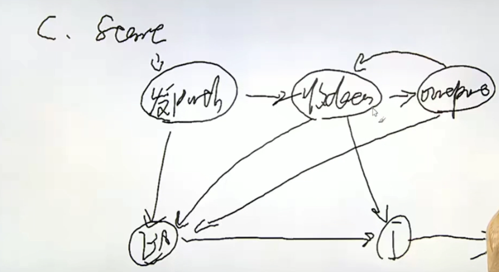
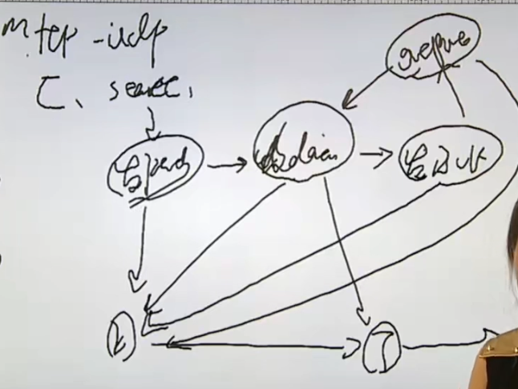

### 内存映射实例

eg1(统计a字符个数).

    kalipy@debian ~/g/l/mmap> more t.txt
    123
    adb
    fda
    a
       ad
    kalipy@debian ~/g/l/mmap> more main.c 
    #include <stdio.h>
    #include <stdlib.h>
    #include <sys/mman.h>
    #include <sys/types.h>
    #include <sys/stat.h>
    #include <fcntl.h>
    #include <unistd.h>
    
    int main(int argc, char *argv[])
    {
        int fd;
        struct stat statres;
        char *str;
        int count = 0;
    
        if (argc < 2)
        {
            fprintf(stderr, "Usage..\n");
            exit(1);
        }
    
        fd = open(argv[1], O_RDONLY);
        if (fd < 0)
        {
            perror("open()");
            exit(1);
        }
    
        if(fstat(fd, &statres) < 0)
        {
            perror("fstat()");
            exit(1);
        }
    
        str = mmap(NULL, statres.st_size, PROT_READ, MAP_SHARED, fd, 0);
        if (str == MAP_FAILED)
        {
            perror("mmap()");
            exit(1);
        }
    
        close(fd);
    
        for (int i = 0; i < statres.st_size; i++)
        {
            if (str[i] == 'a') 
                count++;
        }
    
        printf("%d\n", count);
    
        munmap(str, statres.st_size);
    
        exit(0);
    }
    kalipy@debian ~/g/l/mmap> gcc main.c
    kalipy@debian ~/g/l/mmap> ./a.out t.txt
    4

eg2(父子进程共享内存).

    kalipy@debian ~/g/l/mmap> more main.c
    #include <stdio.h>
    #include <stdlib.h>
    #include <sys/mman.h>
    #include <sys/types.h>
    #include <sys/wait.h>
    #include <sys/stat.h>
    #include <fcntl.h>
    #include <unistd.h>
    #include <string.h>
    
    #define MEMSIZE 1024
    
    int main(void)
    {
        char *ptr;
        pid_t pid;
    
        ptr = mmap(NULL, MEMSIZE, PROT_READ | PROT_WRITE, MAP_SHARED | MAP_ANONYMOUS, -1, 0);
        if (ptr == MAP_FAILED)
        {
            perror("mmap()");
            exit(1);
        }
    
        pid = fork();
        if (pid < 0)
        {
            perror("fork()");
            munmap(ptr, MEMSIZE);
            exit(1);
        }
    
        if (pid == 0)//child write
        {
            strcpy(ptr, "Hello!");
            munmap(ptr, MEMSIZE);//释放紫禁城的那一份
            exit(0);
        } else {//parent read
            wait(NULL);
            puts(ptr);
            munmap(ptr, MEMSIZE);
            exit(0);
        }
    
        exit(0);
    }
    kalipy@debian ~/g/l/mmap> gcc main.c
    kalipy@debian ~/g/l/mmap> ./a.out
    Hello!

### 文件锁实例

fcntl()
lockf()
flock()

说明：

当给一个fd加锁时，锁是加在inode上面的

说明：

这样就会有一个问题，当通过一个fd1给一个inode加锁后，其它的指向该inode的fd2如果去close(fd2)，会造成inode意外被解锁

man手册：

    LOCKF(3)                                   Linux Programmer's Manual                                   LOCKF(3)
    
    NAME
           lockf - apply, test or remove a POSIX lock on an open file
    
    SYNOPSIS
           #include <unistd.h>
    
           int lockf(int fd, int cmd, off_t len);
    
       Feature Test Macro Requirements for glibc (see feature_test_macros(7)):
    
           lockf():
               _XOPEN_SOURCE >= 500
                   || /* Glibc since 2.19: */ _DEFAULT_SOURCE
                   || /* Glibc versions <= 2.19: */ _BSD_SOURCE || _SVID_SOURCE
    
    DESCRIPTION
           Apply,  test  or  remove a POSIX lock on a section of an open file.  The file is specified by fd, a file
           descriptor  open  for  writing,  the  action  by  cmd,  and  the  section  consists  of  byte  positions
           pos..pos+len-1  if len is positive, and pos-len..pos-1 if len is negative, where pos is the current file
           position, and if len is zero, the section extends from the current file position to infinity, encompass-
           ing  the  present  and  future end-of-file positions.  In all cases, the section may extend past current
           end-of-file.
    
           On Linux, lockf() is just an interface on top of fcntl(2) locking.  Many other systems implement lockf()
           in  this  way, but note that POSIX.1 leaves the relationship between lockf() and fcntl(2) locks unspeci-
           fied.  A portable application should probably avoid mixing calls to these interfaces.
    
           Valid operations are given below:
    
           F_LOCK Set an exclusive lock on the specified section of the file.  If (part of) this section is already
                  locked, the call blocks until the previous lock is released.  If this section overlaps an earlier
                  locked section, both are merged.  File locks are released as soon  as  the  process  holding  the
                  locks closes some file descriptor for the file.  A child process does not inherit these locks.
    
           F_TLOCK
                  Same  as  F_LOCK  but  the  call never blocks and returns an error instead if the file is already
                  locked.
    
           F_ULOCK
                  Unlock the indicated section of the file.  This may cause a locked section to be split  into  two
                  locked sections.
    
           F_TEST Test  the  lock:  return 0 if the specified section is unlocked or locked by this process; return
                  -1, set errno to EAGAIN (EACCES on some other systems), if another process holds a lock.
    
    RETURN VALUE
           On success, zero is returned.  On error, -1 is returned, and errno is set appropriately.
    
    ERRORS
           EACCES or EAGAIN
                  The file is locked and F_TLOCK or F_TEST was specified, or the operation  is  prohibited  because
                  the file has been memory-mapped by another process.
    
           EBADF  fd  is not an open file descriptor; or cmd is F_LOCK or F_TLOCK and fd is not a writable file de-
                  scriptor.
    
           EDEADLK
                  The command was F_LOCK and this lock operation would cause a deadlock.
    
           EINVAL An invalid operation was specified in cmd.
    
           ENOLCK Too many segment locks open, lock table is full.

eg1.

    kalipy@debian ~/g/l/file_lock> echo 1 > out
    kalipy@debian ~/g/l/file_lock> ls
    a.out*  main.c  out
    kalipy@debian ~/g/l/file_lock> more out 
    1
    kalipy@debian ~/g/l/file_lock> more main.c 
    #include <stdio.h>
    #include <stdlib.h>
    #include <sys/types.h>
    #include <unistd.h>
    #include <string.h>
    #include <sys/types.h>
    #include <sys/wait.h>
    
    #define PROCNUM      20
    #define FNAME       "out"
    #define LINESIZE    1024
    
    static void func_add(void)
    {
        FILE *fp;
        int fd;
        char linebuf[LINESIZE];
    
        fp = fopen(FNAME, "r+");
        if (fp == NULL)
        {
            perror("fopen()");
            exit(1);
        }
    
        fd = fileno(fp);
        //if error
    
        lockf(fd, F_LOCK, 0);
        fgets(linebuf, LINESIZE, fp);
        fseek(fp, 0, SEEK_SET);
        sleep(1);
        fprintf(fp, "%d\n", atoi(linebuf) + 1);
        //fclose(fp);//意外close会导致文件锁意外解锁，所以这句话要放在lockf外面
        fflush(fp);
        lockf(fd, F_ULOCK, 0);
    
        fclose(fp);
    
        return;
    }
    
    int main(void)
    {
        int err;
        pid_t pid;
    
        for (int i = 0; i < PROCNUM; i++)
        {
            pid = fork();
            if (pid < 0)
            {
                perror("fork()");
                exit(1);
            }
    
            if (pid == 0)
            {
                func_add();
                exit(0);
            }
        }
    
        for (int i = 0; i < PROCNUM; i++)
        {
            wait(NULL);
        }
    
        exit(0);
    }
    kalipy@debian ~/g/l/file_lock> gcc main.c
    kalipy@debian ~/g/l/file_lock> ./a.out
    kalipy@debian ~/g/l/file_lock> more out 
    21

### 管道实例 池类算法

说明：

之前那个筛素数的程序效率抵在上游master进程在等下游work消费，work在等master生产

原因分析：

造成等待的原因是mm太小，即上游一次性只下发了一个任务，我们应该让它一次下发n个任务

eg1.

    kalipy@debian ~/g/l/mypipe> pwd
    /home/kalipy/gg/linux_c入门/mypipe
    kalipy@debian ~/g/l/mypipe> ls
    mypipe.c  mypipe.h
    kalipy@debian ~/g/l/mypipe> more mypipe.h 
    /*
     * mypipe.h
     * Copyright (C) 2022 kalipy <kalipy@debian>
     *
     * Distributed under terms of the MIT license.
     */
    
    #ifndef MYPIPE_H
    #define MYPIPE_H
    
    #define PIPESIZE        1024
    #define MYPIPE_READ     0x00000001UL
    #define MYPIPE_WRITE    0x00000002UL
    
    typedef void mypipe_t;
    
    mypipe_t *mypipe_init(void);
    
    int mypipe_register(mypipe_t *, int opmap);
    
    int mypipe_unregister(mypipe_t *, int opmap);
    
    int mypipe_read(mypipe_t *, void *buf, size_t count);
    
    int mypipe_write(mypipe_t *, const void *buf, size_t);
    
    int mypipe_destroy(mypipe_t *);
    
    #endif /* !MYPIPE_H */
    kalipy@debian ~/g/l/mypipe> more mypipe.c 
    #include <stdio.h>
    #include <stdlib.h>
    #include <pthread.h>
    
    #include "mypipe.h"
    
    struct mypipe_st
    {
        int head;
        int tail;
        char data[PIPESIZE];
        int datasize;
        int count_rd;//读者计数器，用于任务全部执行完毕后，退出while死循环，正常退出释放资源
        int count_wr;//写者计数器
        pthread_mutex_t mut;
        pthread_cond_t cond;//管道的特点应该有：当没有数据时，读操作将阻塞，知道有人通知我，写同理
    };
    
    mypipe_t *mypipe_init(void)
    {
        struct mypipe_st *me;
    
        me = malloc(sizeof(*me));
        if (me == NULL)
            return NULL;
    
        me->head = 0;
        me->tail = 0;
        me->datasize = 0;
        me->count_rd = 0;
        me->count_wr = 0;
        pthread_mutex_init(&me->mut, NULL);
        pthread_cond_init(&me->cond, NULL);
    
        return me;
    }
    
    int mypipe_register(mypipe_t *ptr, int opmap)
    {
        //if error
        
        pthread_mutex_lock(&me->mut);
        if (opmap & MYPIPE_READ)
            me->count_rd++;
        if (opmap & MYPIPE_WRITE)
            me->count_wr++;
        pthread_cond_broadcast(&me->cond);
    
        while (me->count_rd <= 0 || me->count_wr <= 0)
            pthread_cond_wait(&me->cond, &me->mut);
    
        pthread_mutex_unlock(&me->mut);
    
        return 0;
    }
    
    int mypipe_unregister(mypipe_t *ptr, int opmap)
    {
        pthread_mutex_lock(&me->mut);
        if (opmap & MYPIPE_READ)
            me->count_rd--;
        if (opmap & MYPIPE_WRITE)
            me->count_wr--;
    
        pthread_cond_broadcast(&me->cond);
        pthread_mutex_unlock(&me->mut);
    
        return 0;
    }
    
    static int mypipe_readbyte_unlocked(struct mypipe_st *me, char *datap)
    {
        if (me->datasize <= 0)
            return -1;
    
        *datap = me->data[me->head];
        me->head = next(me->head);
        me->datasize --;
    
        return 0;
    }
    
    int mypipe_read(mypipe_t *ptr, void *buf, size_t count)
    {
        int i;
        struct mypipe_st *me = ptr;
    
        pthread_mutex_lock(&me->mut);
        
        while (me->datasize <= 0 && me->count_wr > 0)//当管道空且有写者，才等待
            pthread_cond_wait(&me->cond, &me->mut);
    
        if (me->datasize <= 0 && me->count_wr <= 0)
        {
            pthread_mutex_unlock(&me->mut);
            return 0;
        }
    
        for (i = 0; i < count; i++)
        {
            if (mypipe_readbyte_unlocked(me, buf + i) != 0)
                break; 
        }
    
        pthread_cond_broadcast(&me->cond);
        pthread_mutex_unlock(&me->mut);
    
        return i;
    }
    
    int mypipe_write(mypipe_t *, const void *buf, size_t)
    {
        //当管道满且有读者，才等待
        
        //当管道满且没有读者，退出
    }
    
    int mypipe_destroy(mypipe_t *ptr)
    {
        struct mypipe_st *me = ptr;
    
        pthread_mutex_destroy(&me->mut);
        pthread_cond_destroy(&me->cond);
    
        free(ptr);
    
        return 0;
    }

### 进程间通信详解

1 管道

    内核提供，单工(读端和写端)，自同步机制(读写速度不匹配会阻塞)
    匿名管道：pipe(int pipefd[2])，其中pipefd[0]为read端，pipefd[1]为write端
    命名管道：mkfifo()

2 XSI   -->  SysV

3 socket

man手册：

    PIPE(2)                                    Linux Programmer's Manual                                    PIPE(2)
    
    NAME
           pipe, pipe2 - create pipe
    
    SYNOPSIS
           #include <unistd.h>
    
           int pipe(int pipefd[2]);
    
           #define _GNU_SOURCE             /* See feature_test_macros(7) */
           #include <fcntl.h>              /* Obtain O_* constant definitions */
           #include <unistd.h>
    
           int pipe2(int pipefd[2], int flags);
    
    DESCRIPTION
           pipe()  creates  a  pipe, a unidirectional data channel that can be used for interprocess communication.
           The array pipefd is used to return two file descriptors referring to the ends of  the  pipe.   pipefd[0]
           refers to the read end of the pipe.  pipefd[1] refers to the write end of the pipe.  Data written to the
           write end of the pipe is buffered by the kernel until it is read from the read end  of  the  pipe.   For
           further details, see pipe(7).
    
           If flags is 0, then pipe2() is the same as pipe().  The following values can be bitwise ORed in flags to
           obtain different behavior:
    
           O_CLOEXEC
                  Set the close-on-exec (FD_CLOEXEC) flag on the two new file descriptors.  See the description  of
                  the same flag in open(2) for reasons why this may be useful.
    
           O_DIRECT (since Linux 3.4)
                  Create  a  pipe that performs I/O in "packet" mode.  Each write(2) to the pipe is dealt with as a
                  separate packet, and read(2)s from the pipe will read one packet at a time.  Note  the  following
                  points:
    
                  *  Writes  of greater than PIPE_BUF bytes (see pipe(7)) will be split into multiple packets.  The
                     constant PIPE_BUF is defined in <limits.h>.
    
                  *  If a read(2) specifies a buffer size that is smaller than the next packet, then the  requested
                     number of bytes are read, and the excess bytes in the packet are discarded.  Specifying a buf-
                     fer size of PIPE_BUF will be sufficient to read the largest possible packets (see the previous
                     point).
    
                  *  Zero-length  packets  are not supported.  (A read(2) that specifies a buffer size of zero is a
                     no-op, and returns 0.)
    
                  Older kernels that do not support this flag will indicate this via an EINVAL error.
    
                  Since Linux 4.5, it is possible to change the O_DIRECT setting of a pipe  file  descriptor  using
                  fcntl(2).
    
           O_NONBLOCK
                  Set the O_NONBLOCK file status flag on the two new open file descriptions.  Using this flag saves
                  extra calls to fcntl(2) to achieve the same result.
    
    RETURN VALUE
           On success, zero is returned.  On error, -1 is returned, and errno is set appropriately.
    
           On Linux (and other systems), pipe() does not modify pipefd on  failure.   A  requirement  standardizing
           this  behavior was added in POSIX.1-2016.  The Linux-specific pipe2() system call likewise does not mod-
           ify pipefd on failure.
    
    ERRORS
           EFAULT pipefd is not valid.
    
           EINVAL (pipe2()) Invalid value in flags.
    
           EMFILE The per-process limit on the number of open file descriptors has been reached.
    
           ENFILE The system-wide limit on the total number of open files has been reached.
    
           ENFILE The user hard limit on memory that can be allocated for pipes has been reached and the caller  is
                  not privileged; see pipe(7).

说明：

怎么通信，比如约定好"父写子读"

### 进程间通信 管道实例

eg1.

    kalipy@debian ~/g/l/pipe> more pipe.c 
    #include <stdio.h>
    #include <stdlib.h>
    #include <unistd.h>
    #include <sys/types.h>
    #include <sys/wait.h>
    
    #define BUFSIZE 1024
    
    int main(void)
    {
        int pd[2];
        int len;
        pid_t pid;
        char buf[BUFSIZE];
    
        if (pipe(pd) < 0)
        {
            perror("pipe()");
            exit(1);
        }
    
        pid = fork();
        if (pid < 0)
        {
            perror("fork()");
            exit(1);
        }
    
        if (pid == 0)// child read
        {
            close(pd[1]);//我们只使用读的功能，子进程不需要写的功能，所以可以把pd[1]关掉
            len = read(pd[0], buf, BUFSIZE);
            write(1, buf, len);//1表示终端
            close(pd[0]);
            exit(0);
        } else {//parent write
            close(pd[0]);
            write(pd[1], "Hello!", 6);
            close(pd[1]);
            wait(NULL);
            exit(0);
        }
    
        return 0;
    }
    kalipy@debian ~/g/l/pipe> gcc pipe.c
    kalipy@debian ~/g/l/pipe> ./a.out
    Hello!⏎ 

mpg123介绍：

eg2(伪代码如下).

    kalipy@debian ~/g/l/pipe> more player.c 
    #include <stdio.h>
    #include <stdlib.h>
    #include <unistd.h>
    #include <sys/types.h>
    #include <sys/wait.h>
    
    #define BUFSIZE 1024
    
    int main(void)
    {
        int pd[2];
        int len;
        pid_t pid;
        char buf[BUFSIZE];
    
        if (pipe(pd) < 0)
        {
            perror("pipe()");
            exit(1);
        }
    
        pid = fork();
        if (pid < 0)
        {
            perror("fork()");
            exit(1);
        }
    
        if (pid == 0)// child read
        {
            close(pd[1]);//关闭写端
            dup2(pd[0], 0);
            close(pd[0]);
            fd = open("/dev/null", O_RDWR);
            dup2(fd, 1);
            dup2(fd, 2);
            execl("/usr/bin/mpg123", "mpg123", "-", NULL);
            perror("execl()");
            exit(1);
        } else {//parent write
            close(pd[0]);//关闭读端
            //父进程从网上收数据，往管道中写
            //..
            close(pd[1]);
            wait(NULL);
            exit(0);
        }
    
        return 0;
    }

eg3.

    kalipy@debian ~/g/l/pipe> ls
    a.out*  pipe.c  player.c
    kalipy@debian ~/g/l/pipe> mkfifo namedfifo
    kalipy@debian ~/g/l/pipe> ls
    a.out*  namedfifo|  pipe.c  player.c
    kalipy@debian ~/g/l/pipe> ll
    总用量 28K
    -rwxr-xr-x 1 kalipy kalipy 17K 5月   4 14:46 a.out*
    prw-r--r-- 1 kalipy kalipy   0 5月   4 15:06 namedfifo|
    -rw-r--r-- 1 kalipy kalipy 819 5月   4 14:46 pipe.c
    -rw-r--r-- 1 kalipy kalipy 894 5月   4 15:01 player.c
    kalipy@debian ~/g/l/pipe> date > namedfifo 

上面向命名管道写数据，我们发现被阻塞了

直到从管道中读取了数据后，上面被阻塞的程序才会继续执行：

    kalipy@debian ~/g/l/pipe> cat namedfifo 
    2022年 05月 04日 星期三 15:09:09 CST

### 进程间通信 消息队列详解

XSI --> SysV

    IPC --> Inter-Process Communication
    主动端：先发包的一方
    被动端：先收包的一方(先运行)

    key：ftok(const char *pathname, int proj_id)//pathname相当于hash，proj_id相当于盐杂质

    Message Queues
    msgget()
    msgop()
    msgctl()

    Semaphore Arrays

    Shared Memory

eg1.

    kalipy@debian ~/g/l/pipe> ipcs
    
    ------ Message Queues --------
    key        msqid      owner      perms      used-bytes   messages    
    
    ------ Shared Memory Segments --------
    key        shmid      owner      perms      bytes      nattch     status      
    0x00000000 1245184    kalipy     600        393216     2          dest         
    0x00000000 63537153   kalipy     600        524288     2          dest         
    0x510330f2 2981890    kalipy     600        1          2                       
    0x00000000 2293763    kalipy     700        107420     2          dest         
    0x51030146 63569924   kalipy     600        3208       1                       
    0x00000000 23199751   kalipy     700        448200     2          dest         
    0x00000000 57868306   kalipy     600        2097152    2          dest         
    
    ------ Semaphore Arrays --------
    key        semid      owner      perms      nsems     
    0x510330cd 32768      kalipy     600        1         
    0x510300c9 65537      kalipy     600        1         
    0x510300f4 131074     kalipy     600        1

man手册：

    FTOK(3)                                    Linux Programmer's Manual                                    FTOK(3)
    
    NAME
           ftok - convert a pathname and a project identifier to a System V IPC key
    
    SYNOPSIS
           #include <sys/types.h>
           #include <sys/ipc.h>
    
           key_t ftok(const char *pathname, int proj_id);
    
    DESCRIPTION
           The  ftok()  function  uses the identity of the file named by the given pathname (which must refer to an
           existing, accessible file) and the least significant 8 bits of proj_id (which must be nonzero) to gener-
           ate a key_t type System V IPC key, suitable for use with msgget(2), semget(2), or shmget(2).
    
           The  resulting  value  is  the  same  for  all pathnames that name the same file, when the same value of
           proj_id is used.  The value returned should be different when the (simultaneously existing) files or the
           project IDs differ.
    
    RETURN VALUE
           On success, the generated key_t value is returned.  On failure -1 is returned, with errno indicating the
           error as for the stat(2) system call.
    
    ATTRIBUTES
           For an explanation of the terms used in this section, see attributes(7).
    
           +----------+---------------+---------+
           |Interface | Attribute     | Value   |
           +----------+---------------+---------+
           |ftok()    | Thread safety | MT-Safe |
           +----------+---------------+---------+
    CONFORMING TO
           POSIX.1-2001, POSIX.1-2008.
    
    NOTES
           On some ancient systems, the prototype was:
    
               key_t ftok(char *pathname, char proj_id);
    
           Today, proj_id is an int, but still only 8 bits are used.  Typical usage has an ASCII character proj_id,
           that is why the behavior is said to be undefined when proj_id is zero.
    
           Of  course,  no guarantee can be given that the resulting key_t is unique.  Typically, a best-effort at-
           tempt combines the given proj_id byte, the lower 16 bits of the inode number, and the lower  8  bits  of
           the  device  number  into  a  32-bit result.  Collisions may easily happen, for example between files on
           /dev/hda1 and files on /dev/sda1.

### 进程间通信 消息队列实例

eg1.

    kalipy@debian ~/g/l/x/m/basic> more proto.h 
    #ifndef PROTO_H
    #define PROTO_H
    
    #define KEYPATH "/etc/services"
    #define KEYPROJ 'g'//随便写，比如我这里写了一个整型
    
    #define NAMESIZE 32
    
    struct msg_st
    {
        long mtype;//消息类型
        char name[NAMESIZE];
        int math;
        int chinese;
    };
    
    #endif /* !PROTO_H */
    kalipy@debian ~/g/l/x/m/basic> more rcver.c 
    #include <stdio.h>
    #include <stdlib.h>
    #include <sys/types.h>
    #include <sys/ipc.h>
    #include <sys/msg.h>
    
    #include "proto.h"
    
    int main(void)
    {
        key_t key;
        int msgid;
        struct msg_st rbuf;
    
        key = ftok(KEYPATH, KEYPROJ);
        if (key < 0)
        {
            perror("ftok()");
            exit(1);
        }
    
        msgid = msgget(key, IPC_CREAT | 0600);
        if (msgid < 0)
        {
            perror("msgget()");
            exit(1);
        }
    
        while (1)
        {
            if (msgrcv(msgid, &rbuf, sizeof(rbuf) - sizeof(long), 0, 0) < 0)//去掉mtype，只计算data的长度
            {
                perror("msgrcv()");
                exit(1);
            }
            printf("NAME = %s\n", rbuf.name);
            printf("MATH = %d\n", rbuf.math);
            printf("CHINESE = %d\n", rbuf.chinese);
        }
    
        msgctl(msgid, IPC_RMID, NULL);
    
        return 0;
    }
    
    kalipy@debian ~/g/l/x/m/basic> more snder.c 
    #include <stdio.h>
    #include <stdlib.h>
    #include <sys/types.h>
    #include <sys/ipc.h>
    #include <sys/msg.h>
    #include <string.h>
    
    #include "proto.h"
    
    int main(void)
    {
        key_t key;
        int msgid;
        struct msg_st sbuf;
    
        key = ftok(KEYPATH, KEYPROJ);
        if (key < 0)
        {
            perror("ftok()");
            exit(1);
        }
    
        msgid = msgget(key, 0);
        if (msgid < 0)
        {
            perror("msgget()");
            exit(1);
        }
    
        sbuf.mtype = 1;
        strcpy(sbuf.name, "hanser");
        sbuf.math = rand() % 100;
        sbuf.chinese = rand() % 100;
        if (msgsnd(msgid, &sbuf, sizeof(sbuf) - sizeof(long), 0) < 0)
        {
            perror("msgsnd()");
            exit(1);
        }
    
        puts("ok!");
    
        return 0;
    }

效果：

    kalipy@debian ~/g/l/x/m/basic> make rcver
    cc     rcver.c   -o rcver
    kalipy@debian ~/g/l/x/m/basic> make snder
    cc     snder.c   -o snder
    kalipy@debian ~/g/l/x/m/basic> ./rcver 
    
    kalipy@debian ~/g/l/x/m/basic> ./snder 
    ok!
    
    kalipy@debian ~/g/l/x/m/basic> ./rcver
    NAME = hanser
    MATH = 83
    CHINESE = 86
    ^C⏎   

注意：

就算snder先于rcver执行，snder发送的消息也不会丢失，因为有缓存

### 消息队列 ftp实例

c端状态机：

说明：

发path-->收data-->outputdata到终端

eg1(方法一).

    kalipy@debian ~/g/l/x/m/myftp> more proto1.h 
    #ifndef PROTO_H
    #define PROTO_H
    
    #define KEYPATH "/etc/services"
    #define KEYPROJ 'a'
    
    #define PATHMAX 1024
    #define DATAMAX 1024
    
    enum
    {
        MSG_PATH = 1,
        MSG_DATA,
        MSG_EOT
    };
    
    typedef struct msg_path_st
    {
        long mtype;//must be MSG_PATH
        char path[PATHMAX];//ascii，带'\0'的字符串
    } msg_path_t;
    
    typedef struct msg_data_st
    {
        long mtype;//must be MSG_DATA
        char data[DATAMAX];
        int datalen;
    } msg_data_t;
    
    typedef struct msg_eot_st//结束包
    {
        long mtype;//must be MSG_EOT
    } msg_eot_t;
    
    union msg_s2c_un
    {
        long mtype;
        msg_data_t datamsg;
        msg_eot_t eotmsg;
    };
    
    #endif /* !PROTO_H */

eg2(方法二).

    kalipy@debian ~/g/l/x/m/myftp> more proto2.h 
    #ifndef PROTO_H
    #define PROTO_H
    
    #define KEYPATH "/etc/services"
    #define KEYPROJ 'a'
    
    #define PATHMAX 1024
    #define DATAMAX 1024
    
    enum
    {
        MSG_PATH = 1,
        MSG_DATA,
        MSG_EOT
    };
    
    typedef struct msg_path_st
    {
        long mtype;//must be MSG_PATH
        char path[PATHMAX];//ascii，带'\0'的字符串
    } msg_path_t;
    
    typedef struct msg_s2c_st
    {
        long mtype;//must be MSG_PATH or MSG_EOT
        int datalen;
        /*
         * datalen > 0 : data
         *        == 0 : eot
         */
        char data[DATAMAX];
    } msg_data_t;
    
    #endif /* !PROTO_H */

### 消息队列 信号量详解及实例

..

### 进程间通信 共享内存项目实例

..

### 套接字 字节序问题

### socket函数

man手册：

    SOCKET(2)                                  Linux Programmer's Manual                                  SOCKET(2)
    
    NAME
           socket - create an endpoint for communication
    
    SYNOPSIS
           #include <sys/types.h>          /* See NOTES */
           #include <sys/socket.h>
    
           int socket(int domain, int type, int protocol);
    
    DESCRIPTION
           socket()  creates  an  endpoint for communication and returns a file descriptor that refers to that end-
           point.  The file descriptor returned by a successful call will be the  lowest-numbered  file  descriptor
           not currently open for the process.
    
           The  domain  argument  specifies  a communication domain; this selects the protocol family which will be
           used for communication.  These families are defined in <sys/socket.h>.  The currently understood formats
           include:
    
           Name                Purpose                          Man page
           AF_UNIX, AF_LOCAL   Local communication              unix(7)
           AF_INET             IPv4 Internet protocols          ip(7)
           AF_INET6            IPv6 Internet protocols          ipv6(7)
           AF_IPX              IPX - Novell protocols
           AF_NETLINK          Kernel user interface device     netlink(7)
           AF_X25              ITU-T X.25 / ISO-8208 protocol   x25(7)
           AF_AX25             Amateur radio AX.25 protocol
           AF_ATMPVC           Access to raw ATM PVCs
           AF_APPLETALK        AppleTalk                        ddp(7)
           AF_PACKET           Low level packet interface       packet(7)
           AF_ALG              Interface to kernel crypto API
    
           The socket has the indicated type, which specifies the communication semantics.  Currently defined types
           are:
    
           SOCK_STREAM     Provides sequenced, reliable, two-way, connection-based byte  streams.   An  out-of-band
                           data transmission mechanism may be supported.
    
           SOCK_DGRAM      Supports datagrams (connectionless, unreliable messages of a fixed maximum length).
    
           SOCK_SEQPACKET  Provides  a  sequenced,  reliable,  two-way  connection-based data transmission path for
                           datagrams of fixed maximum length; a consumer is required to read an entire packet  with
                           each input system call.
    
           SOCK_RAW        Provides raw network protocol access.
    
           SOCK_RDM        Provides a reliable datagram layer that does not guarantee ordering.
    
           SOCK_PACKET     Obsolete and should not be used in new programs; see packet(7).
    
           Some socket types may not be implemented by all protocol families.
    
           Since  Linux 2.6.27, the type argument serves a second purpose: in addition to specifying a socket type,
           it may include the bitwise OR of any of the following values, to modify the behavior of socket():
    
           SOCK_NONBLOCK   Set the O_NONBLOCK file status flag on the new open file description.  Using  this  flag
                           saves extra calls to fcntl(2) to achieve the same result.
    
           SOCK_CLOEXEC    Set the close-on-exec (FD_CLOEXEC) flag on the new file descriptor.  See the description
                           of the O_CLOEXEC flag in open(2) for reasons why this may be useful.
    
           The protocol specifies a particular protocol to be used with the socket.  Normally only a single  proto-
           col  exists  to  support a particular socket type within a given protocol family, in which case protocol
           can be specified as 0.  However, it is possible that many protocols may exist, in which case a  particu-
           lar  protocol must be specified in this manner.  The protocol number to use is specific to the "communi-
           cation domain" in which communication is to take place; see protocols(5).  See getprotoent(3) on how  to
           map protocol name strings to protocol numbers.
    
           Sockets  of  type  SOCK_STREAM are full-duplex byte streams.  They do not preserve record boundaries.  A
           stream socket must be in a connected state before any data may be sent or received on it.  A  connection
           to  another  socket  is  created  with a connect(2) call.  Once connected, data may be transferred using
           read(2) and write(2) calls or some variant of the send(2) and recv(2) calls.  When a  session  has  been
           completed a close(2) may be performed.  Out-of-band data may also be transmitted as described in send(2)
           and received as described in recv(2).
    
           The communications protocols which implement a SOCK_STREAM ensure that data is not lost  or  duplicated.
           If  a  piece  of  data  for  which the peer protocol has buffer space cannot be successfully transmitted
           within a reasonable length of time, then the connection is considered to be dead.  When SO_KEEPALIVE  is
           enabled on the socket the protocol checks in a protocol-specific manner if the other end is still alive.
           A SIGPIPE signal is raised if a process sends or receives on a broken stream;  this  causes  naive  pro-
           cesses, which do not handle the signal, to exit.  SOCK_SEQPACKET sockets employ the same system calls as
           SOCK_STREAM sockets.  The only difference is that read(2) calls will return only the amount of data  re-
           quested,  and  any data remaining in the arriving packet will be discarded.  Also all message boundaries
           in incoming datagrams are preserved.
    
           SOCK_DGRAM and SOCK_RAW sockets allow sending of datagrams to correspondents named in  sendto(2)  calls.
           Datagrams  are  generally  received with recvfrom(2), which returns the next datagram along with the ad-
           dress of its sender.
    
           SOCK_PACKET is an obsolete socket type to receive raw packets directly  from  the  device  driver.   Use
           packet(7) instead.
    
           An  fcntl(2)  F_SETOWN  operation  can be used to specify a process or process group to receive a SIGURG
           signal when the out-of-band data arrives or SIGPIPE signal when a SOCK_STREAM  connection  breaks  unex-
           pectedly.  This operation may also be used to set the process or process group that receives the I/O and
           asynchronous notification of I/O events via SIGIO.  Using F_SETOWN is equivalent  to  an  ioctl(2)  call
           with the FIOSETOWN or SIOCSPGRP argument.
    
           When  the network signals an error condition to the protocol module (e.g., using an ICMP message for IP)
           the pending error flag is set for the socket.  The next operation on this socket will return  the  error
           code  of the pending error.  For some protocols it is possible to enable a per-socket error queue to re-
           trieve detailed information about the error; see IP_RECVERR in ip(7).
    
           The operation of sockets  is  controlled  by  socket  level  options.   These  options  are  defined  in
           <sys/socket.h>.   The functions setsockopt(2) and getsockopt(2) are used to set and get options, respec-
           tively.
    
    RETURN VALUE
           On success, a file descriptor for the new socket is returned.  On error, -1 is returned,  and  errno  is
           set appropriately.
    
    ERRORS
           EACCES Permission to create a socket of the specified type and/or protocol is denied.
    
           EAFNOSUPPORT
                  The implementation does not support the specified address family.
    
           EINVAL Unknown protocol, or protocol family not available.
    
           EINVAL Invalid flags in type.
    
           EMFILE The per-process limit on the number of open file descriptors has been reached.
    
           ENFILE The system-wide limit on the total number of open files has been reached.
    
           ENOBUFS or ENOMEM
                  Insufficient  memory  is  available.  The socket cannot be created until sufficient resources are
                  freed.
    
           EPROTONOSUPPORT
                  The protocol type or the specified protocol is not supported within this domain.
    
           Other errors may be generated by the underlying protocol modules.
    
    CONFORMING TO
           POSIX.1-2001, POSIX.1-2008, 4.4BSD.
    
           The SOCK_NONBLOCK and SOCK_CLOEXEC flags are Linux-specific.
    
           socket() appeared in 4.2BSD.  It is generally portable to/from non-BSD systems supporting clones of  the
           BSD socket layer (including System V variants).
    
    NOTES
           POSIX.1  does not require the inclusion of <sys/types.h>, and this header file is not required on Linux.
           However, some historical (BSD) implementations required this header file, and portable applications  are
           probably wise to include it.
    
           The  manifest  constants used under 4.x BSD for protocol families are PF_UNIX, PF_INET, and so on, while
           AF_UNIX, AF_INET, and so on are used for address families.  However, already the BSD man page  promises:
           "The protocol family generally is the same as the address family", and subsequent standards use AF_* ev-
           erywhere.
    
           The AF_ALG protocol type was added in Linux 2.6.38.  More information on this interface is provided with
           the kernel HTML documentation at https://www.kernel.org/doc/htmldocs/crypto-API/User.html.

### 套接字 报式套接字相应过程

说明：

为什么要addrlen呢？直接sizeof(struct sockaddr)不行吗？

答：

还真的不行，因为struct sockaddr是一个假的数据结构(类似于我们的欺骗用户的行为)，请看：

### 套接字 报式套接字实例

eg1.

    kalipy@debian ~/g/l/s/basic> more proto.h 
    #ifndef PROTO_H
    #define PROTO_H
    
    #define RCVPORT "9999"
    #define NAMESIZE 11
    
    struct msg_st
    {
        uint8_t name[NAMESIZE];
        uint32_t math;
        uint32_t chinese;
    } __attribute__((packed));
    
    #endif /* !PROTO_H */
    kalipy@debian ~/g/l/s/basic> more rcver.c
    #include <stdio.h>
    #include <stdlib.h>
    #include <sys/types.h>
    #include <sys/socket.h>
    #include <arpa/inet.h>
    #include <unistd.h>
    
    #include "proto.h"
    
    #define IPSTRSIZE 32
    
    int main(void)
    {
        int sd;
        struct sockaddr_in laddr, raddr;
        struct msg_st rbuf;
        socklen_t raddr_len;
        char ipstr[IPSTRSIZE];
    
        sd = socket(AF_INET, SOCK_DGRAM, 0/*IPPROTO_UDP*/);//0表示用AF_INET和SOCK_DGRAM匹配一个默认的
        if (sd < 0)
        {
            perror("socket()");
            exit(1);
        }
    
        laddr.sin_family = AF_INET;
        laddr.sin_port = htons(atoi(RCVPORT));
        inet_pton(AF_INET, "0.0.0.0", &laddr.sin_addr);
    
        if (bind(sd, (void *)&laddr, sizeof(laddr)) < 0)
        {
            perror("bind()");
            exit(1);
        }
    
        //!!!!!
        raddr_len = sizeof(raddr);
    
        while (1)
        {
            recvfrom(sd, &rbuf, sizeof(rbuf), 0, (void *)&raddr, &raddr_len);
    
            inet_ntop(AF_INET, &raddr.sin_addr, ipstr, IPSTRSIZE);
            printf("--MESSAGE FROM %s:%d--\n", ipstr, ntohs(raddr.sin_port));
            printf("name = %s\n", rbuf.name);
            printf("math = %d\n", ntohl(rbuf.math));
            printf("chinese = %d\n", ntohl(rbuf.chinese));
        }
    
        close(sd);
    
        return 0;
    }
    kalipy@debian ~/g/l/s/basic> more snder.c
    #include <stdio.h>
    #include <stdlib.h>
    #include <sys/types.h>
    #include <sys/socket.h>
    #include <arpa/inet.h>
    #include <unistd.h>
    #include <string.h>
    
    #include "proto.h"
    
    int main(int argc, char *argv[])
    {
        int sd;
        struct msg_st sbuf;
        struct sockaddr_in raddr;
    
        if (argc < 2)
        {
            fprintf(stderr, "Usage..\n");
            exit(1);
        }
    
        sd = socket(AF_INET, SOCK_DGRAM, 0);
        if (sd < 0)
        {
            perror("socket()");
            exit(1);
        }
    
        //bind()
        
        strcpy(sbuf.name, "yousa");
        sbuf.math = htonl(rand() % 100);
        sbuf.chinese = htonl(rand() % 100);
    
        raddr.sin_family = AF_INET;
        raddr.sin_port = htons(atoi(RCVPORT));
        inet_pton(AF_INET, argv[1], &raddr.sin_addr);
    
        if (sendto(sd, &sbuf, sizeof(sbuf), 0, (void *)&raddr, sizeof(raddr)) < 0)
        {
            perror("sendto()");
            exit(1);
        }
    
        puts("ok!");
    
        close(sd);
    
        return 0;
    }
    
效果：

    kalipy@debian ~/g/l/s/basic> ./rcver
    --MESSAGE FROM 127.0.0.1:58414--
    name = yousa
    math = 83
    chinese = 86
    --MESSAGE FROM 127.0.0.1:57754--
    name = yousa
    math = 83
    chinese = 86
    ^C⏎  
    
    kalipy@debian ~/g/l/s/basic> ./snder 
    Usage..
    kalipy@debian ~/g/l/s/basic> ./snder 127.0.0.1
    ok!
    kalipy@debian ~/g/l/s/basic> ./snder 127.0.0.1
    ok!
    kalipy@debian ~/g/l/s/basic> netstat -anu
    Active Internet connections (servers and established)
    Proto Recv-Q Send-Q Local Address           Foreign Address         State      
    udp        0      0 0.0.0.0:9999            0.0.0.0:* 

### 大小动态变化数据包

eg1的问题：

eg2(解决eg1的问题).

    kalipy@debian ~/g/l/s/basic> git diff
    diff --git a/proto.h b/proto.h
    index a4742e4..28cbd40 100644
    --- a/proto.h
    +++ b/proto.h
    @@ -2,13 +2,14 @@
     #define PROTO_H
     
     #define RCVPORT "9999"
    -#define NAMESIZE 11
    +#define NAMEMAX (512-8-8)//第一个8是udp的包头，第二个8是：math+chinese的长度
     
     struct msg_st
     {
    -    uint8_t name[NAMESIZE];
    +    //uint8_t name[NAMESIZE];//char *name是肯定不行的，你一个网络传一个地址到远程，远程用该地址能访问到你机器？
         uint32_t math;
         uint32_t chinese;
    +    uint8_t name[1];
     } __attribute__((packed));
     
     #endif /* !PROTO_H */
    diff --git a/rcver.c b/rcver.c
    index 50e38b7..3581b9b 100644
    --- a/rcver.c
    +++ b/rcver.c
    @@ -12,11 +12,20 @@
     int main(void)
     {
         int sd;
    +    int size;
         struct sockaddr_in laddr, raddr;
    -    struct msg_st rbuf;
    +    struct msg_st *rbufp;
         socklen_t raddr_len;
         char ipstr[IPSTRSIZE];
     
    +    size = sizeof(struct msg_st) + NAMEMAX - 1;//1是name[1]所占用的大小
    +    rbufp = malloc(size);
    +    if (rbufp == NULL)
    +    {
    +        perror("malloc()");
    +        exit(1);
    +    }
    +
         sd = socket(AF_INET, SOCK_DGRAM, 0/*IPPROTO_UDP*/);//0表示用AF_INET和SOCK_DGRAM匹配一个默认的
         if (sd < 0)
         {
    @@ -39,13 +48,13 @@ int main(void)
     
         while (1)
         {
    -        recvfrom(sd, &rbuf, sizeof(rbuf), 0, (void *)&raddr, &raddr_len);
    +        recvfrom(sd, rbufp, size, 0, (void *)&raddr, &raddr_len);
     
             inet_ntop(AF_INET, &raddr.sin_addr, ipstr, IPSTRSIZE);
             printf("--MESSAGE FROM %s:%d--\n", ipstr, ntohs(raddr.sin_port));
    -        printf("name = %s\n", rbuf.name);
    -        printf("math = %d\n", ntohl(rbuf.math));
    -        printf("chinese = %d\n", ntohl(rbuf.chinese));
    +        printf("name = %s\n", rbufp->name);
    +        printf("math = %d\n", ntohl(rbufp->math));
    +        printf("chinese = %d\n", ntohl(rbufp->chinese));
         }
     
         close(sd);
    diff --git a/snder.c b/snder.c
    index 5ca7935..f178bda 100644
    --- a/snder.c
    +++ b/snder.c
    @@ -11,15 +11,30 @@
     int main(int argc, char *argv[])
     {
         int sd;
    -    struct msg_st sbuf;
    +    int size;
    +    struct msg_st *sbufp;
         struct sockaddr_in raddr;
     
    -    if (argc < 2)
    +    if (argc < 3)
         {
             fprintf(stderr, "Usage..\n");
             exit(1);
         }
     
    +    if (strlen(argv[2]) > NAMEMAX)
    +    {
    +        fprintf(stderr, "name is too long!\n");
    +        exit(1);
    +    }
    +
    +    size = sizeof(struct msg_st) + strlen(argv[2]);
    +    sbufp = malloc(size);
    +    if (sbufp == NULL)
    +    {
    +        perror("malloc()");
    +        exit(1);
    +    }
    +
         sd = socket(AF_INET, SOCK_DGRAM, 0);
         if (sd < 0)
         {
    @@ -29,15 +44,15 @@ int main(int argc, char *argv[])
     
         //bind()
         
    -    strcpy(sbuf.name, "yousa");
    -    sbuf.math = htonl(rand() % 100);
    -    sbuf.chinese = htonl(rand() % 100);
    +    strcpy(sbufp->name, argv[2]);
    +    sbufp->math = htonl(rand() % 100);
    +    sbufp->chinese = htonl(rand() % 100);
     
         raddr.sin_family = AF_INET;
         raddr.sin_port = htons(atoi(RCVPORT));
         inet_pton(AF_INET, argv[1], &raddr.sin_addr);
     
    -    if (sendto(sd, &sbuf, sizeof(sbuf), 0, (void *)&raddr, sizeof(raddr)) < 0)
    +    if (sendto(sd, sbufp, size, 0, (void *)&raddr, sizeof(raddr)) < 0)
         {
             perror("sendto()");
             exit(1);
    kalipy@debian ~/g/l/s/basic> more rcver.c
    #include <stdio.h>
    #include <stdlib.h>
    #include <sys/types.h>
    #include <sys/socket.h>
    #include <arpa/inet.h>
    #include <unistd.h>
    
    #include "proto.h"
    
    #define IPSTRSIZE 32
    
    int main(void)
    {
        int sd;
        int size;
        struct sockaddr_in laddr, raddr;
        struct msg_st *rbufp;
        socklen_t raddr_len;
        char ipstr[IPSTRSIZE];
    
        size = sizeof(struct msg_st) + NAMEMAX - 1;//1是name[1]所占用的大小
        rbufp = malloc(size);
        if (rbufp == NULL)
        {
            perror("malloc()");
            exit(1);
        }
    
        sd = socket(AF_INET, SOCK_DGRAM, 0/*IPPROTO_UDP*/);//0表示用AF_INET和SOCK_DGRAM匹配一个默认的
        if (sd < 0)
        {
            perror("socket()");
            exit(1);
        }
    
        laddr.sin_family = AF_INET;
        laddr.sin_port = htons(atoi(RCVPORT));
        inet_pton(AF_INET, "0.0.0.0", &laddr.sin_addr);
    
        if (bind(sd, (void *)&laddr, sizeof(laddr)) < 0)
        {
            perror("bind()");
            exit(1);
        }
    
        //!!!!!
        raddr_len = sizeof(raddr);
    
        while (1)
        {
            recvfrom(sd, rbufp, size, 0, (void *)&raddr, &raddr_len);
    
            inet_ntop(AF_INET, &raddr.sin_addr, ipstr, IPSTRSIZE);
            printf("--MESSAGE FROM %s:%d--\n", ipstr, ntohs(raddr.sin_port));
            printf("name = %s\n", rbufp->name);
            printf("math = %d\n", ntohl(rbufp->math));
            printf("chinese = %d\n", ntohl(rbufp->chinese));
        }
    
        close(sd);
    
        return 0;
    }
    kalipy@debian ~/g/l/s/basic> more snder.c 
    #include <stdio.h>
    #include <stdlib.h>
    #include <sys/types.h>
    #include <sys/socket.h>
    #include <arpa/inet.h>
    #include <unistd.h>
    #include <string.h>
    
    #include "proto.h"
    
    int main(int argc, char *argv[])
    {
        int sd;
        int size;
        struct msg_st *sbufp;
        struct sockaddr_in raddr;
    
        if (argc < 3)
        {
            fprintf(stderr, "Usage..\n");
            exit(1);
        }
    
        if (strlen(argv[2]) > NAMEMAX)
        {
            fprintf(stderr, "name is too long!\n");
            exit(1);
        }
    
        size = sizeof(struct msg_st) + strlen(argv[2]);
        sbufp = malloc(size);
        if (sbufp == NULL)
        {
            perror("malloc()");
            exit(1);
        }
    
        sd = socket(AF_INET, SOCK_DGRAM, 0);
        if (sd < 0)
        {
            perror("socket()");
            exit(1);
        }
    
        //bind()
        
        strcpy(sbufp->name, argv[2]);
        sbufp->math = htonl(rand() % 100);
        sbufp->chinese = htonl(rand() % 100);
    
        raddr.sin_family = AF_INET;
        raddr.sin_port = htons(atoi(RCVPORT));
        inet_pton(AF_INET, argv[1], &raddr.sin_addr);
    
        if (sendto(sd, sbufp, size, 0, (void *)&raddr, sizeof(raddr)) < 0)
        {
            perror("sendto()");
            exit(1);
        }
    
        puts("ok!");
    
        close(sd);
    
        return 0;
    }
    kalipy@debian ~/g/l/s/basic> more proto.h 
    #ifndef PROTO_H
    #define PROTO_H
    
    #define RCVPORT "9999"
    #define NAMEMAX (512-8-8)//第一个8是udp的包头，第二个8是：math+chinese的长度
    
    struct msg_st
    {
        //uint8_t name[NAMESIZE];//char *name是肯定不行的，你一个网络传一个地址到远程，远程用该地址能访问到你机器？
        uint32_t math;
        uint32_t chinese;
        uint8_t name[1];//The  strcpy()  function copies the string pointed to by src, including the terminating null byte ('\0')
    } __attribute__((packed));
    
    #endif /* !PROTO_H */

效果：

    kalipy@debian ~/g/l/s/basic> make rcver
    cc     rcver.c   -o rcver
    kalipy@debian ~/g/l/s/basic> ./rcver
    --MESSAGE FROM 127.0.0.1:49415--
    name = yousa
    math = 83
    chinese = 86
    --MESSAGE FROM 127.0.0.1:34423--
    name = merry
    math = 83
    chinese = 86
    ^C⏎  
    
    kalipy@debian ~/g/l/s/basic> make snder
    cc     snder.c   -o snder
    kalipy@debian ~/g/l/s/basic> ./snder 127.0.0.1 yousa
    ok!
    kalipy@debian ~/g/l/s/basic> ./snder 127.0.0.1 merry
    ok!

### 套接字 多播实例

多播包含了广播，多播比广播更灵活，所以这里只讲多播

多播当中有一个特殊的地址：224.0.0.1，所有支持多播的节点，都默认在这个多播组中，且无法退组

man手册：

请man 7 socket和man 7 udp和man 7 ip

eg1.

    kalipy@debian ~/g/l/s/bcast> git diff
    diff --git a/snder.c b/snder.c
    index 5ca7935..7518bc3 100644
    --- a/snder.c
    +++ b/snder.c
    @@ -14,12 +14,6 @@ int main(int argc, char *argv[])
         struct msg_st sbuf;
         struct sockaddr_in raddr;
     
    -    if (argc < 2)
    -    {
    -        fprintf(stderr, "Usage..\n");
    -        exit(1);
    -    }
    -
         sd = socket(AF_INET, SOCK_DGRAM, 0);
         if (sd < 0)
         {
    @@ -27,15 +21,21 @@ int main(int argc, char *argv[])
             exit(1);
         }
     
    -    //bind()
    +    int val = 1;//true
    +    if (setsockopt(sd, SOL_SOCKET, SO_BROADCAST, &val, sizeof(val)) < 0)
    +    {
    +        perror("setsockopt()");
    +        exit(1);
    +    }
         
    +    memset(&sbuf, '\0', sizeof(sbuf));
         strcpy(sbuf.name, "yousa");
         sbuf.math = htonl(rand() % 100);
         sbuf.chinese = htonl(rand() % 100);
     
         raddr.sin_family = AF_INET;
         raddr.sin_port = htons(atoi(RCVPORT));
    -    inet_pton(AF_INET, argv[1], &raddr.sin_addr);
    +    inet_pton(AF_INET, "255.255.255.255", &raddr.sin_addr);
 
     if (sendto(sd, &sbuf, sizeof(sbuf), 0, (void *)&raddr, sizeof(raddr)) < 0)
     {

    kalipy@debian ~/g/l/s/bcast> more snder.c
    #include <stdio.h>
    #include <stdlib.h>
    #include <sys/types.h>
    #include <sys/socket.h>
    #include <arpa/inet.h>
    #include <unistd.h>
    #include <string.h>
    
    #include "proto.h"
    
    int main(int argc, char *argv[])
    {
        int sd;
        struct msg_st sbuf;
        struct sockaddr_in raddr;
    
        sd = socket(AF_INET, SOCK_DGRAM, 0);
        if (sd < 0)
        {
            perror("socket()");
            exit(1);
        }
    
        int val = 1;//true
        if (setsockopt(sd, SOL_SOCKET, SO_BROADCAST, &val, sizeof(val)) < 0)
        {
            perror("setsockopt()");
            exit(1);
        }
        
        memset(&sbuf, '\0', sizeof(sbuf));
        strcpy(sbuf.name, "yousa");
        sbuf.math = htonl(rand() % 100);
        sbuf.chinese = htonl(rand() % 100);
    
        raddr.sin_family = AF_INET;
        raddr.sin_port = htons(atoi(RCVPORT));
        inet_pton(AF_INET, "255.255.255.255", &raddr.sin_addr);
    
        if (sendto(sd, &sbuf, sizeof(sbuf), 0, (void *)&raddr, sizeof(raddr)) < 0)
        {
            perror("sendto()");
            exit(1);
        }
    
        puts("ok!");
    
        close(sd);
    
        return 0;
    }

    kalipy@debian ~/g/l/s/bcast> more rcver.c 
    #include <stdio.h>
    #include <stdlib.h>
    #include <sys/types.h>
    #include <sys/socket.h>
    #include <arpa/inet.h>
    #include <unistd.h>
    
    #include "proto.h"
    
    #define IPSTRSIZE 32
    
    int main(void)
    {
        int sd;
        struct sockaddr_in laddr, raddr;
        struct msg_st rbuf;
        socklen_t raddr_len;
        char ipstr[IPSTRSIZE];
    
        sd = socket(AF_INET, SOCK_DGRAM, 0/*IPPROTO_UDP*/);//0表示用AF_INET和SOCK_DGRAM匹配一个默认的
        if (sd < 0)
        {
            perror("socket()");
            exit(1);
        }
    
        laddr.sin_family = AF_INET;
        laddr.sin_port = htons(atoi(RCVPORT));
        inet_pton(AF_INET, "0.0.0.0", &laddr.sin_addr);
    
        if (bind(sd, (void *)&laddr, sizeof(laddr)) < 0)
        {
            perror("bind()");
            exit(1);
        }
    
        //!!!!!
        raddr_len = sizeof(raddr);
    
        while (1)
        {
            recvfrom(sd, &rbuf, sizeof(rbuf), 0, (void *)&raddr, &raddr_len);
    
            inet_ntop(AF_INET, &raddr.sin_addr, ipstr, IPSTRSIZE);
            printf("--MESSAGE FROM %s:%d--\n", ipstr, ntohs(raddr.sin_port));
            printf("name = %s\n", rbuf.name);
            printf("math = %d\n", ntohl(rbuf.math));
            printf("chinese = %d\n", ntohl(rbuf.chinese));
        }
    
        close(sd);
    
        return 0;
    }
    kalipy@debian ~/g/l/s/bcast> more proto.h 
    #ifndef PROTO_H
    #define PROTO_H
    
    #define RCVPORT "9999"
    #define NAMESIZE 11
    
    struct msg_st
    {
        uint8_t name[NAMESIZE];
        uint32_t math;
        uint32_t chinese;
    } __attribute__((packed));
    
    #endif /* !PROTO_H */

效果：

    kalipy@debian ~/g/l/s/bcast> make rcver
    cc     rcver.c   -o rcver
    kalipy@debian ~/g/l/s/bcast> make snder
    cc     snder.c   -o snder
    kalipy@debian ~/g/l/s/bcast> ./rcver
    
    kalipy@debian ~/g/l/s/bcast> ./snder
    ok!

说明：

我们发现rcver并没有接收到我们snder发送的消息，这是为什么？

答：请修改rever.c代码为：

    kalipy@debian ~/g/l/s/bcast> git diff
    diff --git a/rcver.c b/rcver.c
    index 50e38b7..2986f0b 100644
    --- a/rcver.c
    +++ b/rcver.c
    @@ -24,6 +24,13 @@ int main(void)
             exit(1);
         }
     
    +    int val = 1;//true
    +    if (setsockopt(sd, SOL_SOCKET, SO_BROADCAST, &val, sizeof(val)) < 0)
    +    {
    +        perror("setsockopt()");
    +        exit(1);
    +    }
    +
         laddr.sin_family = AF_INET;
         laddr.sin_port = htons(atoi(RCVPORT));
         inet_pton(AF_INET, "0.0.0.0", &laddr.sin_addr);

问题：还是收不到消息？

答：请关闭防火墙！！

eg2(多播).

    kalipy@debian ~/g/l/s/bcast> git diff
    diff --git a/proto.h b/proto.h
    index a4742e4..eca9fc9 100644
    --- a/proto.h
    +++ b/proto.h
    @@ -1,6 +1,7 @@
     #ifndef PROTO_H
     #define PROTO_H
     
    +#define MTGROUP "224.2.2.2"//多播组组号
     #define RCVPORT "9999"
     #define NAMESIZE 11
     
    diff --git a/rcver.c b/rcver.c
    index 50e38b7..b53bf1e 100644
    --- a/rcver.c
    +++ b/rcver.c
    @@ -24,6 +24,17 @@ int main(void)
             exit(1);
         }
     
    +    struct ip_mreqn mreq;
    +    inet_pton(AF_INET, MTGROUP, &mreq.imr_multiaddr);
    +    inet_pton(AF_INET, "0.0.0.0", &mreq.imr_address);
    +    mreq.imr_ifindex = if_nametoindex("wlp8s0");
    +
    +    if (setsockopt(sd, IPPROTO_IP, IP_ADD_MEMBERSHIP, &mreq, sizeof(mreq)) < 0)
    +    {
    +        perror("setsockopt()");
    +        exit(1);
    +    }
    +
         laddr.sin_family = AF_INET;
         laddr.sin_port = htons(atoi(RCVPORT));
         inet_pton(AF_INET, "0.0.0.0", &laddr.sin_addr);
    diff --git a/snder.c b/snder.c
    index 7518bc3..268f46d 100644
    --- a/snder.c
    +++ b/snder.c
    @@ -5,6 +5,7 @@
     #include <arpa/inet.h>
     #include <unistd.h>
     #include <string.h>
    +#include <net/if.h>
     
     #include "proto.h"
     
    @@ -21,8 +22,12 @@ int main(int argc, char *argv[])
             exit(1);
         }
     
    -    int val = 1;//true
    -    if (setsockopt(sd, SOL_SOCKET, SO_BROADCAST, &val, sizeof(val)) < 0)
    +    struct ip_mreqn mreq;
    +    inet_pton(AF_INET, MTGROUP, &mreq.imr_multiaddr);
    +    inet_pton(AF_INET, "0.0.0.0", &mreq.imr_address);
    +    mreq.imr_ifindex = if_nametoindex("wlp8s0");
    +
    +    if (setsockopt(sd, IPPROTO_IP, IP_MULTICAST_IF, &mreq, sizeof(mreq)) < 0)
         {
             perror("setsockopt()");
             exit(1);
    @@ -35,7 +40,7 @@ int main(int argc, char *argv[])
     
         raddr.sin_family = AF_INET;
         raddr.sin_port = htons(atoi(RCVPORT));
    -    inet_pton(AF_INET, "255.255.255.255", &raddr.sin_addr);
    +    inet_pton(AF_INET, MTGROUP, &raddr.sin_addr);
     
         if (sendto(sd, &sbuf, sizeof(sbuf), 0, (void *)&raddr, sizeof(raddr)) < 0)
         {

### wireshark的使用

    struct msg_st
    {
        uint8_t name[NAMESIZE];
        uint32_t math;
        uint32_t chinese;
    } __attribute__((packed));

说明：

我现在传了11个字节的name，4个字节的math，4个字节的chinese

其中的`41 6c 61 6e`就是我发送的名字`Alan`，但是我们发现后面居然有`10 0a 40`这些栈上的数据，这肯定是不安全的

eg1(改进之前的程序，防止数据泄漏).

改为：

### udp传输分析

说明：

因为阻塞(拥堵)的存在，所以需要流量控制，但是我们之前那种令牌桶流控，是开环流控

而我们的udp需要的是闭环流控，比如停等式流控

### 停等式流控解析

ack机制：

发一个包，等待着收一个ack包

问：你觉得我有把丢包率降下来不？

答：没有，反而增加了丢包率，ack也会丢啊

---

问：发data后，data丢失了怎么办？server要一直等client的ack吗？或者data没丢，但是ack回往server的途中ack丢了怎么半？

答：不能，所以在server那有个rtt等待时间

---

问：data没丢，ack只是延迟了，但是并没有丢，server端会再次发送data包，那么client怎么区分server发的包是重复的包还是本来就是一样的包呢？

答：所以data包加上seq号，用seq序列号来区分

---

问：data包要加seq号，那ack包要不要加seq号呢？

答：需要，请看：

说明：

ack只是超时了，其实还在途中，但是server以为ack丢了，所以重复发送了d1数据包

然后client根据data包的seq，判断出来此数据包是重复的，所以client把此d1包丢弃，然后client回复一个ack包

---

好的，现在server接着发送d2数据包：

说明：此d2数据包是由于网络问题真正的丢失了

---

ok，现在server收到了最开始d1数据包的延迟的ack包：

---

问题来了，现在server收到那个延迟的ack包后，接着就会发送d3数据包：

说明：

即server端会误以为那个延迟的ack包是对d2数据包的确认，所以，d2数据包在有了ack机制后，却还是丢了

因此：我们在ack包中也要有seq序列号，防止数据包丢失

---

回到ftp程序的例子，之前的ftp会有丢包现象，所以我们设计ack机制来避免，状态图如下：

说明：

发path-->收data-->发ack-->output显示-->收data

### tcp协议分析

刚才的udp的ftp程序实现，server端发送数据包不是并发的，所以等待时间较长，浪费了性能，我们其实可以让server并发的发送data数据包和并发的接收ack包，这样等待时间就可以减少：

---

说明：

三次握手，目的是约定syn和ack的起始编号

---

说明：

在半连接状态建立后，会在server端生成的半连接池(存放client端的信息，比如ip,port)

当clinet发起第三次握手时，server端就会在半连接池中找client的信息，如果找到了信息，那么server端就会接受client的第三次握手，建立连接。

---

泛洪攻击：

即client只发第一次握手，永远不发起第三次握手，那么server端的半连接池迟早会被恶意占满

防护办法：

server端不要半连接池了，client端第一次握手时，server端用`hash(c_ip + c_port + s_ip + s_port + proto) | salt`计算出一个hash值，这个hash值我们把它叫做cookie，server把cookie放到第二次握手的ack包中，发给client。之后client发起第三次握手时，就要带上这个cookie，server再用hash | salt的方法计算一遍hash得到cookie，如果cookie一样，那么通过校验，三次握手成功。

salt盐由内核产生，1s变化一次

### 流式套接字详解和实例

eg1.

    kalipy@debian ~/g/l/s/s/basic> more server.c 
    #include <stdio.h>
    #include <stdlib.h>
    #include <sys/types.h>
    #include <sys/socket.h>
    #include <arpa/inet.h>
    #include <unistd.h>
    #include <string.h>
    #include <time.h>
    
    #include "proto.h"
    
    #define IPSTRSIZE 40
    #define BUFSIZE 1024
    
    static void server_job(int sd)
    {
        char buf[BUFSIZE];
    
        int len = sprintf(buf, FMT_STAMP, (long long)time(NULL));
        if (send(sd, buf, len, 0) < 0)
        {
            perror("send()");
            exit(1);
        }
    }
    
    int main(void)
    {
        int sd, newsd;
        struct sockaddr_in laddr, raddr;
        socklen_t raddr_len;
        char ipstr[IPSTRSIZE];
    
        sd = socket(AF_INET, SOCK_STREAM, 0);
        if (sd < 0)
        {
            perror("socket()");
            exit(1);
        }
    
        laddr.sin_family = AF_INET;
        laddr.sin_port = htons(atoi(SERVERPORT));
        inet_pton(AF_INET, "0.0.0.0", &laddr.sin_addr);
    
        if (bind(sd, (void *)&laddr, sizeof(laddr)) < 0)
        {
            perror("bind()");
            exit(1);
        }
    
        if (listen(sd, 200))//第二个参数指的是能够接收的client最大连接数
        {
            perror("listen()");
            exit(1);
        }
    
        raddr_len = sizeof(raddr);
        while (1)
        {
            newsd = accept(sd, (void *)&raddr, &raddr_len);
            if (newsd < 0)
            {
                perror("accept()");
                exit(1);
            }
    
            inet_ntop(AF_INET, &raddr.sin_addr, ipstr, IPSTRSIZE);
            printf("Client:%s:%d\n", ipstr, ntohs(raddr.sin_port));
    
            server_job(newsd);
            close(newsd);
        }
    
        close(sd);
    
        return 0;
    }
    kalipy@debian ~/g/l/s/s/basic> 
    kalipy@debian ~/g/l/s/s/basic> more proto.h 
    #ifndef PROTO_H
    #define PROTO_H
    
    #define SERVERPORT "9999"
    
    #define FMT_STAMP "%lld\n"//时间戳
    
    #endif /* !PROTO_H */

    kalipy@debian ~/g/l/s/s/basic> make server
    cc     server.c   -o server
    kalipy@debian ~/g/l/s/s/basic> ./server

kalipy@debian ~> netstat -ant

    Active Internet connections (servers and established)
    Proto Recv-Q Send-Q Local Address           Foreign Address         State      
    tcp        0      0 0.0.0.0:9999            0.0.0.0:*               LISTEN 

client工具测试：

    kalipy@debian ~> nc 127.0.0.1 9999
    1651983907

    kalipy@debian ~> telnet 127.0.0.1 9999
    Trying 127.0.0.1...
    Connected to 127.0.0.1.
    Escape character is '^]'.
    1651983952
    Connection closed by foreign host.

    kalipy@debian ~/g/l/s/s/basic> ./server
    Client:127.0.0.1:35082
    Client:127.0.0.1:35084

问题：

    kalipy@debian ~> nc 127.0.0.1 9999
    1651984124
    kalipy@debian ~/g/l/s/s/basic> ./server
    Client:127.0.0.1:35086
    ^C⏎   
    kalipy@debian ~/g/l/s/s/basic> ./server
    bind(): Address already in use
    kalipy@debian ~/g/l/s/s/basic> netstat -ant
    Active Internet connections (servers and established)
    Proto Recv-Q Send-Q Local Address           Foreign Address         State      
    tcp        0      0 127.0.0.1:9999          127.0.0.1:35086         FIN_WAIT2  

    kalipy@debian ~/g/l/s/s/basic> netstat -ant
    Active Internet connections (servers and established)
    Proto Recv-Q Send-Q Local Address           Foreign Address         State      
    tcp        0      0 127.0.0.1:35100         127.0.0.1:9999          CLOSE_WAIT

解决：

eg2.

    kalipy@debian ~/g/l/s/s/basic> more client.c 
    #include <stdio.h>
    #include <stdlib.h>
    #include <sys/types.h>
    #include <sys/socket.h>
    #include <arpa/inet.h>
    #include <unistd.h>
    #include <string.h>
    #include <time.h>
    
    #include "proto.h"
    
    int main(int argc, char *argv[])
    {
        int sd;
        struct sockaddr_in raddr;
        long long stamp;
        FILE *fp;
    
        if (argc < 2)
        {
            fprintf(stderr, "Usage..\n");
            exit(1);
        }
    
        sd = socket(AF_INET, SOCK_STREAM, 0);
        if (sd < 0)
        {
            perror("socket()");
            exit(1);
        }
    
        //bind()
        
        raddr.sin_family = AF_INET;
        raddr.sin_port = htons(atoi(SERVERPORT));
        inet_pton(AF_INET, argv[1], &raddr.sin_addr);
        
        if (connect(sd, (void*)&raddr, sizeof(raddr)) < 0)
        {
            perror("connect()");
            exit(1);
        }
    
        fp = fdopen(sd, "r+");//把sd转换为fp
        if (fp == NULL)
        {
            perror("fdopen()");
            exit(1);
        }
    
        if (fscanf(fp, FMT_STAMP, &stamp) < 1)
            fprintf(stderr, "bad format\n");
        else
            fprintf(stdout, "stamp = %lld\n", stamp);
    
        fclose(fp);
    
        //recv();
        //close();
    
        return 0;
    }

### 流式套接字并发实例

eg1.

    kalipy@debian ~/g/l/s/s/par> git diff
    diff --git a/server.c b/server.c
    index df52c43..628a895 100644
    --- a/server.c
    +++ b/server.c
    @@ -26,6 +26,7 @@ static void server_job(int sd)
     
     int main(void)
     {
    +    pid_t pid;
         int sd, newsd;
         struct sockaddr_in laddr, raddr;
         socklen_t raddr_len;
    @@ -71,11 +72,22 @@ int main(void)
                 exit(1);
             }
     
    -        inet_ntop(AF_INET, &raddr.sin_addr, ipstr, IPSTRSIZE);
    -        printf("Client:%s:%d\n", ipstr, ntohs(raddr.sin_port));
    +        pid = fork();
    +        if (pid < 0)
    +        {
    +            perror("fork()");
    +            exit(1);
    +        }
     
    -        server_job(newsd);
    -        close(newsd);
    +        if (pid == 0) 
    +        {
    +            inet_ntop(AF_INET, &raddr.sin_addr, ipstr, IPSTRSIZE);
    +            printf("Client:%s:%d\n", ipstr, ntohs(raddr.sin_port));
    +
    +            server_job(newsd);
    +            close(newsd);
    +            exit(0);
    +        }
         }
     
         close(sd);

    kalipy@debian ~/g/l/s/s/par> more server.c 
    #include <stdio.h>
    #include <stdlib.h>
    #include <sys/types.h>
    #include <sys/socket.h>
    #include <arpa/inet.h>
    #include <unistd.h>
    #include <string.h>
    #include <time.h>
    
    #include "proto.h"
    
    #define IPSTRSIZE 40
    #define BUFSIZE 1024
    
    static void server_job(int sd)
    {
        char buf[BUFSIZE];
    
        int len = sprintf(buf, FMT_STAMP, (long long)time(NULL));
        if (send(sd, buf, len, 0) < 0)
        {
            perror("send()");
            exit(1);
        }
    }
    
    int main(void)
    {
        pid_t pid;
        int sd, newsd;
        struct sockaddr_in laddr, raddr;
        socklen_t raddr_len;
        char ipstr[IPSTRSIZE];
    
        sd = socket(AF_INET, SOCK_STREAM, 0);
        if (sd < 0)
        {
            perror("socket()");
            exit(1);
        }
    
        int val = 1;
        if (setsockopt(sd, SOL_SOCKET, SO_REUSEADDR, &val, sizeof(val)) < 0)
        {
            perror("setsockopt()");
            exit(1);
        }
    
        laddr.sin_family = AF_INET;
        laddr.sin_port = htons(atoi(SERVERPORT));
        inet_pton(AF_INET, "0.0.0.0", &laddr.sin_addr);
    
        if (bind(sd, (void *)&laddr, sizeof(laddr)) < 0)
        {
            perror("bind()");
            exit(1);
        }
    
        if (listen(sd, 200))//第二个参数指的是能够接收的client最大连接数
        {
            perror("listen()");
            exit(1);
        }
    
        raddr_len = sizeof(raddr);
        while (1)
        {
            newsd = accept(sd, (void *)&raddr, &raddr_len);
            if (newsd < 0)
            {
                perror("accept()");
                exit(1);
            }
    
            pid = fork();
            if (pid < 0)
            {
                perror("fork()");
                exit(1);
            }
    
            if (pid == 0) 
            {
                inet_ntop(AF_INET, &raddr.sin_addr, ipstr, IPSTRSIZE);
                printf("Client:%s:%d\n", ipstr, ntohs(raddr.sin_port));
    
                server_job(newsd);
                close(newsd);
                exit(0);
            }
        }
    
        close(sd);
    
        return 0;
    }

效果：

    kalipy@debian ~/g/l/s/s/par> ./server
    kalipy@debian ~/g/l/s/s/par> ./client 127.0.0.1

说明：

我们发现client被阻塞住，没反应了

然后我们把server ctral-c中断，发现client才把内容打印出来:

    kalipy@debian ~/g/l/s/s/par> ./server
    Client:127.0.0.1:35156
    ^C⏎        
    kalipy@debian ~/g/l/s/s/par> ./client 127.0.0.1
    stamp = 1651987572

解决：

eg2.

    kalipy@debian ~/g/l/s/s/par> git diff
    diff --git a/server.c b/server.c
    index 628a895..e18e6b4 100644
    --- a/server.c
    +++ b/server.c
    @@ -81,6 +81,7 @@ int main(void)
     
             if (pid == 0) 
             {
    +            close(sd);//父子进程sd和newsd都各有一份，我们要关闭该进程用不到的"fd"，这里紫禁城只需要newsd，不需要sd，所以把sd关闭掉
                 inet_ntop(AF_INET, &raddr.sin_addr, ipstr, IPSTRSIZE);
                 printf("Client:%s:%d\n", ipstr, ntohs(raddr.sin_port));
     
    @@ -88,6 +89,7 @@ int main(void)
                 close(newsd);
                 exit(0);
             }
    +        close(newsd);//同理，父进程不需要newsd，把它关闭掉
         }
     
         close(sd);
    kalipy@debian ~/g/l/s/s/par> more server.c
    #include <stdio.h>
    #include <stdlib.h>
    #include <sys/types.h>
    #include <sys/socket.h>
    #include <arpa/inet.h>
    #include <unistd.h>
    #include <string.h>
    #include <time.h>
    
    #include "proto.h"
    
    #define IPSTRSIZE 40
    #define BUFSIZE 1024
    
    static void server_job(int sd)
    {
        char buf[BUFSIZE];
    
        int len = sprintf(buf, FMT_STAMP, (long long)time(NULL));
        if (send(sd, buf, len, 0) < 0)
        {
            perror("send()");
            exit(1);
        }
    }
    
    int main(void)
    {
        pid_t pid;
        int sd, newsd;
        struct sockaddr_in laddr, raddr;
        socklen_t raddr_len;
        char ipstr[IPSTRSIZE];
    
        sd = socket(AF_INET, SOCK_STREAM, 0);
        if (sd < 0)
        {
            perror("socket()");
            exit(1);
        }
    
        int val = 1;
        if (setsockopt(sd, SOL_SOCKET, SO_REUSEADDR, &val, sizeof(val)) < 0)
        {
            perror("setsockopt()");
            exit(1);
        }
    
        laddr.sin_family = AF_INET;
        laddr.sin_port = htons(atoi(SERVERPORT));
        inet_pton(AF_INET, "0.0.0.0", &laddr.sin_addr);
    
        if (bind(sd, (void *)&laddr, sizeof(laddr)) < 0)
        {
            perror("bind()");
            exit(1);
        }
    
        if (listen(sd, 200))//第二个参数指的是能够接收的client最大连接数
        {
            perror("listen()");
            exit(1);
        }
    
        raddr_len = sizeof(raddr);
        while (1)
        {
            newsd = accept(sd, (void *)&raddr, &raddr_len);
            if (newsd < 0)
            {
                perror("accept()");
                exit(1);
            }
    
            pid = fork();
            if (pid < 0)
            {
                perror("fork()");
                exit(1);
            }
    
            if (pid == 0) 
            {
                close(sd);//父子进程sd和newsd都各有一份，我们要关闭该进程用不到的"fd"，这里紫禁城只需要newsd，不需要sd
    ，所以把sd关闭掉
                inet_ntop(AF_INET, &raddr.sin_addr, ipstr, IPSTRSIZE);
                printf("Client:%s:%d\n", ipstr, ntohs(raddr.sin_port));
    
                server_job(newsd);
                close(newsd);
                exit(0);
            }
            close(newsd);//同理，父进程不需要newsd，把它关闭掉
        }
    
        close(sd);
    
        return 0;
    }

### 流式套接字实现图片页面抓包

    kalipy@debian ~/g/l/s/s/par> sudo mv 2.jpg /var/www/html/.
    kalipy@debian ~/g/l/s/s/par> curl 127.0.0.1:80
    
    <!DOCTYPE html PUBLIC "-//W3C//DTD XHTML 1.0 Transitional//EN" "http://www.w3.org/TR/xhtml1/DTD/xhtml1-transitional.dtd">
    <html xmlns="http://www.w3.org/1999/xhtml">
      <head>
        <meta http-equiv="Content-Type" content="text/html; charset=UTF-8" />
        <title>Apache2 Debian Default Page: It works</title>
      </head>
      <body>
        

          

            
            
              Apache2 Debian Default Page
            
              

                    this site is working properly. You should <b>replace this file</b> (located at
                    <tt>/var/www/html/index.html</tt>) before continuing to operate your HTTP server.
              

    
    /etc/apache2/
    |-- apache2.conf
    |       `--  ports.conf
    |-- mods-enabled
    |       |-- *.load
    |       `-- *.conf
    |-- conf-enabled
    |       `-- *.conf
    |-- sites-enabled
      </body>
    </html>
    
    kalipy@debian ~/g/l/s/s/par> mv 2.jpg /var/www/html/.
    kalipy@debian ~/g/l/s/s/par> w3m http://127.0.0.1:80
    kalipy@debian ~/g/l/s/s/par> wget 127.0.0.1:80/2.jpg
    kalipy@debian ~/g/l/s/s/par> w3m http://127.0.0.1:80/2.jpg

    --2022-05-08 13:48:10--  http://127.0.0.1/2.jpg
    正在连接 127.0.0.1:80... 已连接。
    已发出 HTTP 请求，正在等待回应... 200 OK
    长度：449618 (439K) [image/jpeg]
    正在保存至: “2.jpg”
    
    2.jpg                        100%[============================================>] 439.08K  --.-KB/s  用时 0.001s  
    
    2022-05-08 13:48:10 (339 MB/s) - 已保存 “2.jpg” [449618/449618])
    
    kalipy@debian ~/g/l/s/s/par> sudo service --status-all
     [ + ]  apache2

### 流式套接字http的使用

eg1.

    kalipy@debian ~/g/l/s/stream> more webdl.c
    #include <stdio.h>
    #include <stdlib.h>
    #include <sys/types.h>
    #include <sys/socket.h>
    #include <arpa/inet.h>
    #include <unistd.h>
    #include <string.h>
    
    #define BUFSIZE 1024
    
    int main(int argc, char *argv[])
    {
        int sd;
        struct sockaddr_in raddr;
        FILE *fp;
        char rbuf[BUFSIZE];
        int len;
    
        if (argc < 2)
        {
            fprintf(stderr, "Usage..\n");
            exit(1);
        }
    
        sd = socket(AF_INET, SOCK_STREAM, 0);
        if (sd < 0)
        {
            perror("socket()");
            exit(1);
        }
    
        raddr.sin_family = AF_INET;
        raddr.sin_port = htons(80);
        inet_pton(AF_INET, argv[1], &raddr.sin_addr);
        
        if (connect(sd, (void*)&raddr, sizeof(raddr)) < 0)
        {
            perror("connect()");
            exit(1);
        }
    
        fp = fdopen(sd, "r+");
        if (fp == NULL)
        {
            perror("fdopen()");
            exit(1);
        }
    
        fprintf(fp, "GET /2.jpg\r\n\r\n");
        fflush(fp);
    
        while (1)
        {
            len = fread(rbuf, 1, BUFSIZE, fp);
            if (len <= 0)
                break;
            fwrite(rbuf, 1, len, stdout);
        }
    
        fclose(fp);
        return 0;
    }
    kalipy@debian ~/g/l/s/stream> make webdl
    cc     webdl.c   -o webdl
    kalipy@debian ~/g/l/s/stream> ./webdl 127.0.0.1 > out.jpg
    kalipy@debian ~/g/l/s/stream> ll
    -rw-r--r-- 1 kalipy kalipy 440K 5月   8 14:04 out.jpg

### 静态进程池套接字实现

我们之前的多进程socket程序有什么问题？

答：没对最大进程数做限制，试想一下，现在有10亿个client同时发来连接请求，你server端是不是会马上挂掉

eg1.

    kalipy@debian ~/g/l/s/stream> cp basic pool_static -rf

    kalipy@debian ~/g/l/s/s/pool_static> more server.c 
    #include <stdio.h>
    #include <stdlib.h>
    #include <sys/types.h>
    #include <sys/socket.h>
    #include <arpa/inet.h>
    #include <sys/wait.h>
    #include <unistd.h>
    #include <string.h>
    #include <time.h>
    
    #include "proto.h"
    
    #define IPSTRSIZE 40
    #define BUFSIZE 1024
    #define PROCNUM 4//最大进程数
    
    static void server_job(int sd)
    {
        char buf[BUFSIZE];
    
        int len = sprintf(buf, FMT_STAMP, (long long)time(NULL));
        if (send(sd, buf, len, 0) < 0)
        {
            perror("send()");
            exit(1);
        }
    }
    
    static void server_loop(int sd);
    
    int main(void)
    {
        int sd;
        pid_t pid;
        struct sockaddr_in laddr;
    
        sd = socket(AF_INET, SOCK_STREAM, 0);
        if (sd < 0)
        {
            perror("socket()");
            exit(1);
        }
    
        int val = 1;
        if (setsockopt(sd, SOL_SOCKET, SO_REUSEADDR, &val, sizeof(val)) < 0)
        {
            perror("setsockopt()");
            exit(1);
        }
    
        laddr.sin_family = AF_INET;
        laddr.sin_port = htons(atoi(SERVERPORT));
        inet_pton(AF_INET, "0.0.0.0", &laddr.sin_addr);
    
        if (bind(sd, (void *)&laddr, sizeof(laddr)) < 0)
        {
            perror("bind()");
            exit(1);
        }
    
        if (listen(sd, 200))//第二个参数指的是能够接收的client最大连接数
        {
            perror("listen()");
            exit(1);
        }
    
        for (int i = 0; i < PROCNUM; i++)
        {
            pid = fork();
            if (pid < 0)
            {
                perror("fork()");
                exit(1);
            }
    
            if (pid == 0)
            {
                server_loop(sd);
                exit(0);
            }
        }
    
        for (int i = 0; i < PROCNUM; i++)
            wait(NULL);
    
        close(sd);
        exit(1);
    }
    
    static void server_loop(int sd)
    {
        struct sockaddr_in raddr;
        socklen_t raddr_len;
        int newsd;
        char ipstr[IPSTRSIZE];
    
        raddr_len = sizeof(raddr);
    
        while (1)
        {
            newsd = accept(sd, (void *)&raddr, &raddr_len);//accept本身就是互斥的，比如有10亿个client的连接请求到达这
    里，那么accept每次只会让一个client连接成功，其它的client将继续阻塞在这里
            if (newsd < 0)
            {
                perror("accept()");
                exit(1);
            }
    
            inet_ntop(AF_INET, &raddr.sin_addr, ipstr, IPSTRSIZE);
            printf("[%d]Client:%s:%d\n", getpid(), ipstr, ntohs(raddr.sin_port));
    
            server_job(newsd);
            close(newsd);
        }
    }
    kalipy@debian ~/g/l/s/s/pool_static> more proto.h 
    #ifndef PROTO_H
    #define PROTO_H
    
    #define SERVERPORT "9999"
    
    #define FMT_STAMP "%lld\n"//时间戳
    
    #endif /* !PROTO_H */
    kalipy@debian ~/g/l/s/s/pool_static> more client.c 
    #include <stdio.h>
    #include <stdlib.h>
    #include <sys/types.h>
    #include <sys/socket.h>
    #include <arpa/inet.h>
    #include <unistd.h>
    #include <string.h>
    #include <time.h>
    
    #include "proto.h"
    
    int main(int argc, char *argv[])
    {
        int sd;
        struct sockaddr_in raddr;
        long long stamp;
        FILE *fp;
    
        if (argc < 2)
        {
            fprintf(stderr, "Usage..\n");
            exit(1);
        }
    
        sd = socket(AF_INET, SOCK_STREAM, 0);
        if (sd < 0)
        {
            perror("socket()");
            exit(1);
        }
    
        //bind()
        
        raddr.sin_family = AF_INET;
        raddr.sin_port = htons(atoi(SERVERPORT));
        inet_pton(AF_INET, argv[1], &raddr.sin_addr);
        
        if (connect(sd, (void*)&raddr, sizeof(raddr)) < 0)
        {
            perror("connect()");
            exit(1);
        }
    
        fp = fdopen(sd, "r+");
        if (fp == NULL)
        {
            perror("fdopen()");
            exit(1);
        }
    
        if (fscanf(fp, FMT_STAMP, &stamp) < 1)
            fprintf(stderr, "bad format\n");
        else
            fprintf(stdout, "stamp = %lld\n", stamp);
    
        fclose(fp);
    
        //recv();
        //close();
    
        return 0;
    }

### 动态进程池实现

eg1.

    kalipy@debian ~/g/l/s/s/pool_static> more server.c 
    #include <stdio.h>
    #include <stdlib.h>
    #include <sys/types.h>
    #include <sys/socket.h>
    #include <arpa/inet.h>
    #include <sys/wait.h>
    #include <sys/mman.h>
    #include <unistd.h>
    #include <string.h>
    #include <signal.h>
    #include <time.h>
    #include <errno.h>
    
    #include "proto.h"
    
    #define MINSPACESERVER 5//最小空闲进程数
    #define MAXSPACESERVER 10//最大空闲进程数
    #define MAXCLIENT 20//最多同时支持20个连接，空闲的+working的不能同时超过20个
    
    #define SIG_NOTIFY SIGUSR2//信号机制中预留给我们自定义的信号
    #define IPSTRSIZE 40
    #define LINEBUFSIZE 80
    
    enum
    {
        STATE_IDLE = 0,
        STATE_BUSY
    };
    
    struct server_st
    {
        pid_t pid;
        int state;
        //int reuse;
    };
    
    static struct server_st *serverpool;
    static int idle_count = 0, busy_count = 0;
    static int sd;
    
    static void usr2_handler(int s)
    {
    
    }
    
    static void server_job(int pos)
    {
        int ppid;
        struct sockaddr_in raddr;
        socklen_t raddr_len;
        int client_sd;
        char ipstr[IPSTRSIZE];
        char linebuf[LINEBUFSIZE];
        time_t stamp;
        int len;
    
        ppid = getppid();
    
        while (1)
        {
            serverpool[pos].state = STATE_IDLE;
            kill(ppid, SIG_NOTIFY);
    
            client_sd = accept(sd, (void *)&raddr, &raddr_len);
            if (client_sd < 0)
            {
                if (errno != EINTR || errno != EAGAIN)
                {
                    perror("accept()");
                    exit(1);
                }
            }
    
            serverpool[pos].state = STATE_BUSY;
            kill(ppid, SIG_NOTIFY);//通知
            inet_ntop(AF_INET, &raddr.sin_addr, ipstr, IPSTRSIZE);
            //printf("[%d]client:%s:%d\n", getpid(), ipstr, ntohs(raddr.sin_port));
            stamp = time(NULL);
    
            len = snprintf(linebuf, LINEBUFSIZE, FMT_STAMP, stamp);
            send(client_sd, linebuf, len, 0);
            //if error
            sleep(5);
            close(client_sd);
        }
    }
    
    static int add_1_server(void)
    {
        int slot;
        pid_t pid;
    
        if (idle_count + busy_count >= MAXCLIENT)
            return -1;
    
        for (slot = 0; slot < MAXCLIENT; slot++)
        {
            if (serverpool[slot].pid == -1)
                break;
        }
    
        serverpool[slot].state = STATE_IDLE;
        pid = fork();
        if (pid < 0)
        {
            perror("fork()");
            exit(1);
        }
    
        if (pid == 0)//child
        {
            server_job(slot);
            exit(0);
        } else {//parent
            serverpool[slot].pid = pid;
            idle_count++;
        }
    
        return 0;
    }
    
    static int del_1_server(void)
    {
        if (idle_count == 0)
            return -1;
    
        for (int i = 0; i < MAXCLIENT; i++)
        {
            if (serverpool[i].pid != -1 && serverpool[i].state == STATE_IDLE)    
            {
                kill(serverpool[i].pid, SIGTERM);
                serverpool[i].pid = -1;
                idle_count--;
                break;
            }
        }
    
        return 0;
    }
    
    static int scan_pool(void)
    {
        int busy = 0, idle = 0;
    
        for (int i = 0; i < MAXCLIENT; i++)
        {
            if (serverpool[i].pid == -1)
                continue;
            if (kill(serverpool[i].pid, 0))//检测进程是否存在
            {
                serverpool[i].pid = -1;
                continue;
            }
            if (serverpool[i].state == STATE_IDLE)
                idle++;
            else if (serverpool[i].state = STATE_BUSY){
                busy++;
            } else {
                fprintf(stderr, "Unknown state.\n");
                //_exit(1);
                abort();
            }
        }
    
        idle_count = idle;
        busy_count = busy;
    
        return 0;
    }
    
    int main(void)
    {
        struct sigaction sa, osa;
        struct sockaddr_in laddr;
        sigset_t set, oset;
        
        //这里的作用就是让紫禁城自己收尸，而不用父进程收尸了
        sa.sa_handler = SIG_IGN;
        sigemptyset(&sa.sa_mask);
        sa.sa_flags = SA_NOCLDWAIT;//阻止紫禁城变成僵尸状态
        sigaction(SIGCHLD, &sa, &osa);
    
        sa.sa_handler = usr2_handler;
        sigemptyset(&sa.sa_mask);
        sa.sa_flags = 0;
        sigaction(SIG_NOTIFY, &sa, &osa);
    
        sigemptyset(&set);
        sigaddset(&set, SIG_NOTIFY);
        sigprocmask(SIG_BLOCK, &set, &oset);
    
        //malloc
        serverpool = mmap(NULL, sizeof(struct server_st) * MAXCLIENT, PROT_READ | PROT_WRITE, MAP_SHARED | MAP_ANONYMO
    US, -1, 0);
        if (serverpool == MAP_FAILED)
        {
            perror("mmap()");
            exit(1);
        }
    
        for (int i = 0; i < MAXCLIENT; i++)
        {
            serverpool[i].pid = -1;    
        }
    
        sd = socket(AF_INET, SOCK_STREAM, 0);
        if (sd < 0)
        {
            perror("socket()");
            exit(1);
        }
    
        int val = 1;
        if (setsockopt(sd, SOL_SOCKET, SO_REUSEADDR, &val, sizeof(val)) < 0)
        {
            perror("setsockopt()");
            exit(1);
        }
    
        laddr.sin_family = AF_INET;
        laddr.sin_port = htons(atoi(SERVERPORT));
        inet_pton(AF_INET, "0.0.0.0", &laddr.sin_addr);
        if (bind(sd, (void *)&laddr, sizeof(laddr)) < 0)
        {
            perror("bind()");
            exit(1);
        }
    
        if (listen(sd, 100) < 0)
        {
            perror("listen()");
            exit(1);
        }
    
        for (int i = 0; i < MINSPACESERVER; i++)
        {
            add_1_server();
    
        }
    
        while (1)
        {
            sigsuspend(&oset);
    
            //遍历
            scan_pool();
    
            //contrl the pool
            if (idle_count > MAXSPACESERVER)
            {
                for (int i = 0; i < (idle_count - MAXSPACESERVER); i++)
                    del_1_server();
            } else if (idle_count < MINSPACESERVER) {
                for (int i = 0; i < (MINSPACESERVER - idle_count); i++)
                    add_1_server();
            }
    
            //printf the pool
            for (int i = 0; i < MAXCLIENT; i++)
            {
                if (serverpool[i].pid == -1)
                    putchar(' ');
                else if (serverpool[i].state == STATE_IDLE)
                    putchar('.');
                else
                    putchar('x');
            }
            putchar('\n');
        }
    
        sigprocmask(SIG_SETMASK, &oset, NULL);
    
        exit(0);
    }

效果：

    kalipy@debian ~/g/l/s/s/pool_static> ./server
    .....               
    .....               
    x.....              
    x.....              
    xx.....             
    xx.....             
    xxx.....            
    xxx.....            
    xxxx.....           
    xxxx.....           
    xxxxx.....          
    ....xxxxx.          
    .....xxxxx          
    ......xxxx          
    x.....xxxx          
    x......xxx          
    xx.....xxx          
    xx......xx          
    xxx.....xx          
    xxx......x          
    xxxx.....x          
    xxxx......          
    xxxxx.....          
    .xxxx.....          
    .xxxxx....          
    ..xxxx....          
    ..xxxxx...          
    ...xxxx...          
    ...xxxxx..          
    ....xxxx..          
    ....xxxxx.          
    .....xxxx.          
    .....xxxxx          
    ......xxxx          
    x.....xxxx          
    x......xxx          
    xx.....xxx          
    xx......xx          
    xx.......x          
    xx........          
    .x........          
    ..........   
    
    kalipy@debian:~/gg/linux_c入门/socket/stream/pool_static$ while true; do (./client 127.0.0.1 &); sleep 1; done
    stamp = 1652000876
    stamp = 1652000877
    stamp = 1652000878
    stamp = 1652000879
    stamp = 1652000880
    stamp = 1652000881
    stamp = 1652000882
    stamp = 1652000883
    stamp = 1652000884
    stamp = 1652000885
    stamp = 1652000886
    stamp = 1652000887
    stamp = 1652000888
    stamp = 1652000889
    stamp = 1652000890
    stamp = 1652000891
    stamp = 1652000892
    stamp = 1652000893
    stamp = 1652000894
    stamp = 1652000895
    stamp = 1652000896
    stamp = 1652000897
    stamp = 1652000898
    stamp = 1652000899
    stamp = 1652000900
    stamp = 1652000901
    stamp = 1652000902
    stamp = 1652000903
    stamp = 1652000904
    stamp = 1652000905
    stamp = 1652000906
    ^C

