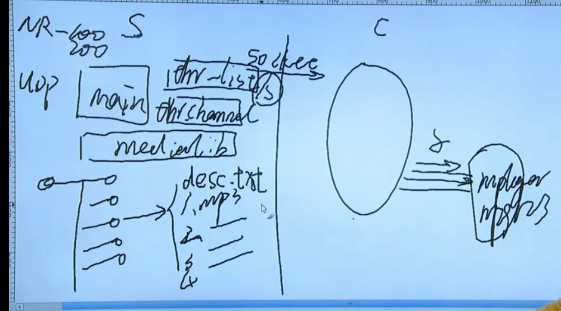

### 流媒体广播项目环境讲解

    kalipy@debian ~/g/l/netradio> tree
    .
    ├── doc
    │   ├── admin
    │   ├── devel
    │   └── user
    ├── INSTALL
    ├── LISENCE
    ├── Makefile
    ├── README
    └── src
        ├── client
        │   ├── client.c
        │   ├── client.h
        │   └── Makefile
        ├── include
        │   └── proto.h
        └── server
            ├── Makefile
            ├── server.c
            ├── server_conf.h
            ├── thr_channel.c
            ├── thr_channel.h
            ├── thr_list.c
            ├── thr_list.h
            ├── thr_medialib.c
            └── thr_medialib.h
    
    8 directories, 17 files

### 实现

参见:

    https://github.com/kalipy3/net-radio
