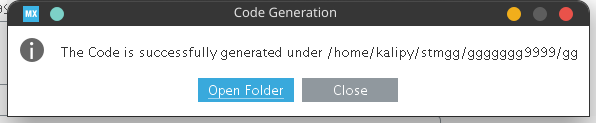

    ln软连接给硬盘扩容或者说修改软件缓存数据的默认位置.md
    
    :Author: kalipy
    :Email: kalipy@debian
    :Date: 2021-06-02 12:41

### 问题

最近电脑`/`目录要满了，请看:

    kalipy@debian ~/> df -h
    文件系统        容量  已用  可用 已用% 挂载点
    udev            1.9G     0  1.9G    0% /dev
    tmpfs           387M   42M  345M   11% /run
    /dev/sda3        99G   83G   3.3G   89% /
    tmpfs           1.9G  7.8M  1.9G    1% /dev/shm
    tmpfs           5.0M  4.0K  5.0M    1% /run/lock
    tmpfs           1.9G     0  1.9G    0% /sys/fs/cgroup
    tmpfs           387M   40K  387M    1% /run/user/1000
    /dev/sda6       172G  159G  45G   76% /media/kalipy/kalipy_data

本来如果是其它目录满了还好，直接删除多余文件或者移动大文件到其它分区即可，但是这次是`/`目录，里面的内容可不能随便删除，况且没用的文件我已经删得删无可删，应该大部分都是各种软件的依赖和软件运行时的缓存文件了，这些东西不小心删错了，可能破坏依赖关系导致只能重装系统。

所以，此次轮到`ln`上场了

### 问题

这里我以`STM32CUbeMX`这个软件为例。

首先，可以看到这个软件本身不大，才`500MB`左右:

    kalipy@debian ~/STM32CubeMX> ls
    db/    olddb/    STM32CubeMX*            Uninstaller/
    help/  plugins/  third_parties_plugins/  utilities/
    kalipy@debian ~/STM32CubeMX> du -sh
    496M    .

然而，它的运行时缓存文件却非常大,占用了我们`/`目录的宝贵空间:

    kalipy@debian ~/STM32Cube> ls
    Repository/
    kalipy@debian ~/STM32Cube> du -sh
    
    7.5G    .

在以前，通常我们想到的方法是更改`STM32CubeMX`这个软件的缓存数据的存储路径(而这个路径通常是不好找的，找到了改了之后还很有可能会出现bug,比如python3的pip3安装的库的保存位置的修改和apt-get软件包路径的修改)

由于上述方法缺点比较明显，现在，我们使用`ln`来优雅的解决

### 解决

首先，找到一个容量比较大的地方，比如我这里是`/media/kalipy/kalipy_data`目录:

    kalipy@debian ~/STM32Cube> df -h
    文件系统        容量  已用  可用 已用% 挂载点
    /dev/sda6       172G  159G  45G   76% /media/kalipy/kalipy_data

依次执行:
    
    cp STM32Cube /media/kalipy/kalipy_data/STM32Cube_lib_ln -rf
    
    rm STM32Cube -rf
    
    ln -s /media/kalipy/kalipy_data/STM32Cube_lib_ln /home/kalipy/STM32Cube

现在，`/home/kalipy/STM32CubeMX`的缓存数据(`/home/kalipy/STM32Cube`目录下的数据)已经保存在`/media/kalipy/kalipy_data/STM32Cube_lib_ln`目录下了,在`/home/kalipy/`家目录下的`STM32Cube`只是一个软连接了:

    lrwxrwxrwx  1 kalipy kalipy   42 6月   2 12:31  STM32Cube -> /media/kalipy/kalipy_data/STM32Cube_lib_ln/

现在`/`占用为:

    kalipy@debian ~/STM32CubeMX> df -h
    文件系统        容量  已用  可用 已用% 挂载点
    /dev/sda3        99G   83G   11G   89% /

### 测试

    kalipy@debian ~/STM32CubeMX> ls
    db/    olddb/    STM32CubeMX*            Uninstaller/
    help/  plugins/  third_parties_plugins/  utilities/
    kalipy@debian ~/STM32CubeMX> ./STM32CubeMX

我们启动`STM32CubeMX`,发现里面的缓存数据依然还在:

我们点击`ok`后，也没有再次下载缓存文件(`STM32Cube FW_F1 Vxx`)，说明非常成功:

