    readme.md
    mysql高级周阳
    
    :Author: kalipy
    :Email: kalipy@debian
    :Date: 2021-04-02 12:21

### 课程简介

* mysql结构介绍
* 索引优化
* 查询截取
* 主从复制
* mysql锁机制

### 逻辑架构

#### 插件式的存储引擎架构

* 连接层

    * socket通信
    * 连接池
    * 连接处理和授权认证等

* 服务层

    * sql接口
    * 缓存查询
    * sql的分析和优化

* 引擎层

    * 数据的存储和提取

* 存储层

    * 把数据存储到文件系统

### 存储引擎简介

#### 查看mysql现在已提供的存储引擎

    kalipy@debian ~/b/mysql_gaoji_zouyang> mysql -u root -pAbcd1234
    
    MariaDB [(none)]> show engines;
    +--------------------+---------+----------------------------------------------------------------------------------+--------------+------+------------+
    | Engine             | Support | Comment                                                                          | Transactions | XA   | Savepoints |
    +--------------------+---------+----------------------------------------------------------------------------------+--------------+------+------------+
    | MRG_MyISAM         | YES     | Collection of identical MyISAM tables                                            | NO           | NO   | NO         |
    | CSV                | YES     | Stores tables as CSV files                                                       | NO           | NO   | NO         |
    | MEMORY             | YES     | Hash based, stored in memory, useful for temporary tables                        | NO           | NO   | NO         |
    | MyISAM             | YES     | Non-transactional engine with good performance and small data footprint          | NO           | NO   | NO         |
    | Aria               | YES     | Crash-safe tables with MyISAM heritage                                           | NO           | NO   | NO         |
    | InnoDB             | DEFAULT | Supports transactions, row-level locking, foreign keys and encryption for tables | YES          | YES  | YES        |
    | PERFORMANCE_SCHEMA | YES     | Performance Schema                                                               | NO           | NO   | NO         |
    | SEQUENCE           | YES     | Generated tables filled with sequential values                                   | YES          | NO   | YES        |
    +--------------------+---------+----------------------------------------------------------------------------------+--------------+------+------------+
    8 rows in set (0.014 sec)

#### 查看当前默认的存储引擎

    MariaDB [(none)]> show variables like '%storage_engine%';
    +----------------------------+--------+
    | Variable_name              | Value  |
    +----------------------------+--------+
    | default_storage_engine     | InnoDB |
    | default_tmp_storage_engine |        |
    | enforce_storage_engine     |        |
    | storage_engine             | InnoDB |
    +----------------------------+--------+
    4 rows in set (0.002 sec)

#### MyISAM和InnoDB区别

| 对比项   | MyISAM                                     | InnoDB                                                   |
|----------|--------------------------------------------|----------------------------------------------------------|
| 主外键   | 不支持                                     | 支持                                                     |
| 事务     | 不支持                                     | 支持                                                     |
| 行表锁   | 表锁，操作一条记录会锁整个表，不适合高并发 | 行锁,操作时只锁某一行,适合高并发                         |
| 缓存     | 只缓存索引，不缓存真实数据                 | 两者都缓存，对内存要求较高，且内存大小对性能有决定性影响 |
| 表空间   | 小                                         | 大                                                       |
| 关注点   | 性能                                       | 事务                                                     |
| 默认安装 | 是                                         | 是                                                       |
### mysql性能下降原因

* 查询语句写得不好
* 索引失效
* 关联查询太多join
* 服务器调优和各个参数设置(缓存 线程数等)

### 常见通用的join查询

#### sql执行顺序

手写的顺序

mysql读取解析的顺序

sql解析

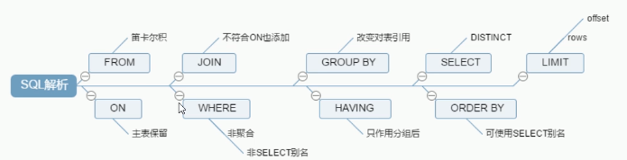

#### 7种join理论

内连接

左连接(ab的共有加上a的全有)

右连接(ab的共有加上b的全有)

xx连接(a的独有)

xx连接(b的独有)

全连接

xx连接(ab各自的独有)

#### 7种join的sql编写

##### 环境准备

建表

表内容

##### 内连接

##### 左连接(ab的共有加上a的独有)

##### 右连接(ab的共有加上b的独有)

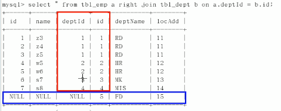

##### xx连接(a的独有)

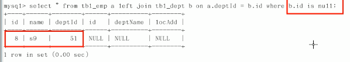

##### xx连接(b的独有)

##### 全连接(a的独有+ab的共有+b的独有)

* mysql语法不支持
* union: 合并并且去除重复的记录

##### xx连接(ab各自的独有)

### 索引简介

* 是什么
* 优缺点
* mysql索引分类
* mysql索引结构
* 哪些情况需要创建索引
* 哪些情况不需要创建索引

#### 为什么需要索引

因为要提高排序和查找效率

    http://blog.itpub.net/31559358/viewspace-2284192/

#### 索引是什么

* 索引是一种数据结构(简单理解为排好序的快速查找的数据结构)
* 索引本身也很大，不可能全部存储在内存，往往以索引文件的形式存储在磁盘
* 一般指B类树(多路搜索树，不一定是二叉)结构组织的索引。其中聚集索引，覆盖索引，复合索引，前缀索引，唯一索引默认都是B+树索引，统称索引。

#### 索引优缺点

优点

* 类似于图书馆提高数据检索的效率，降低数据库IO成本
* 提高索引对数据进行排序，降低数据排序成本，降低cpu的消耗

缺点

* 索引也是表，该表保存了主键和索引字段，并指向实体表的记录，所以索引也占用了磁盘空间
* 会降低更新表(insert update delete)的速度，因为更新表时，mysql不仅要保存数据，还要保存索引文件每次更新添加了索引列的字段，调整索引信息需要时间
* 如果mysql有大数据量的表，就需要花费时间研究建立最优秀的索引，或优化查询

#### 索引分类

* 单值索引: 即一个索引只包含单个列，一个表可以有多个单列索引
* 唯一索引: 索引列的值必须唯一，但允许有空值
* 复合索引: 一个索引包含多个列

#### 基本语法

    //创建
    create [unique] index indexName on mytable(columnName(length));
    alter mytable add [unique] index [indexName] on (columnName(length));

    //删除
    drop index [indexName] on mytable;

    //查看
    show index from table_name\G

四种添加索引的方式

#### mysql索引结构

* BTree索引
* Hash索引
* full-text全文索引
* R-Tree索引

##### BTree索引

一颗b+树，浅蓝色的为磁盘块，每个磁盘块包含几个数据项(深蓝色)和指针(黄色)，如磁盘块1包含数据项17和35，包含指针p1,p2,p3。p1表示小于17的磁盘块，p2表示在17和35之间的磁盘块，p3表示大于35的磁盘块。

真实的数据存储在叶子节点即3,5,9,10,13,15,28,29,36,60,75,79,90,99

非叶子节点不存储真实的数据，只存储指向搜索方向的数据项，如17,35并不真实存在与数据库表中

#### 哪些情况需要创建索引

* 主键自动建立唯一索引
* 频繁作为查询条件的字段应该创建索引
* 查询中与其他表关联的字段，外键关系建立索引
* 频繁更新的字段不适合创建索引
* where条件里用不到的字段不创建索引
* 单键/组合索引的选择问题，who?(在高并发下倾向创建组合索引)
* 查询中排序的字段，排序字段若通过索引去访问将大大提高速度
* 查询中统计或分组字段

#### 哪些情况需不要创建索引

* 表记录太少
* 经常增删改的表(why? 因为会降低更新表的速度,更新表时，保存索引文件需要时间)
* 某个数据列包含许多重复的内容，为它创建索引将没有太大实际效果
* 数据重复且分布平均的表字段
* 应该只为最经常查询和最经常排序的数据列建立索引

### 性能分析前提知识

#### mysql query optimizer

mysql中有专门负责优化select语句的优化器模块

主要功能: 通过计算分析系统中收集到的统计信息，为客户端请求的query提供它认为最优的执行计划(它认为最优的数据检索方式，但不见得DBA认为是最优的，这部分最耗时间)

优化: 处理掉一些常量表达式的预算，直接换算成常量值。对query的查询条件进行简化和转换，如去掉一些无用或显而易见的条件，结构调整等。然后分析query中的Hint信息(如果有)

#### mysql常见瓶颈

* cpu: cpu在饱和的时候一般发生在数据装入内存或从磁盘上读取数据时
* io: 磁盘i/o瓶颈发生在装入数据远大于内存容量时
* 服务器硬件的性能：top,free,iostat和vmstat来查看系统的性能状态

### explain使用简介

#### explain是什么(是查询执行计划)

使用explain关键字可以模拟优化器执行sql查询语句，从而知道mysql是如何处理sql语句的。分析查询语句或表结构的性能瓶颈

#### explain可以做什么

* 表的读取顺序
* 数据读取操作的操作类型
* 哪些索引可以使用
* 哪些索引被实际使用
* 表之间的引用
* 每张表有多少行被优化器查询

#### 怎么玩

explain + sql语句

执行计划包含的信息(id type key rows extra最重要)

| id | select_type | table | type | possible_keys | key | key_len | ref | rows | extra |
|----|-------------|-------|------|---------------|-----|---------|-----|------|-------|

### explain之id

select查询的序列号，包含一组数字，表示查询中执行select子句或操作表的顺序

#### 三种情况

id相同，执行顺序由上到下

id不同，如果是子查询，id的序号会递增，id值越大优先级越高，越先被执行

id相同和不同同时存在(先按id值越大优先级越高，然后相同的从上到下)

### explain之select_type和table

#### select_type有哪些

| id | select_type  |
|----|--------------|
| 1  | SIMPLE       |
| 2  | PRIMARY      |
| 3  | SUBQUERY     |
| 4  | DERIVER      |
| 5  | UNION        |
| 6  | UNION RESULT |

#### 功能: 主要是用于区别普通查询，联合查询，子查询等复杂查询

#### table

显示这一行的数据是关于哪张表的

### explain之type(暂停)

type显示的是访问类型，是一个较为重要的指标

一般来说，得保证查询至少达到range级别，最好能达到ref

### explain之possible_keys

查询涉及到的字段上若存在索引，则该索引将被列出，**但不一定被查询实际使用**

### explain之key

实际使用的索引。如果为null,则没有使用索引

查询中若使用了覆盖索引(后面讲)，则该索引仅出现在key列表中

### explain之key_len

表示索引中使用的字节数，可通过该列计算查询中使用的索引的长度。在不损失精确度下，长度越短越好

key_len显示的值为索引字段的最大可能长度，并非实际使用长度。即key_len是根据表定义计算得来，不是通过表内检索出来的

### explain之ref

显示索引的哪一列被使用了，可能是一个常数。哪些列或常数被用于查找索引列上的值

由key_len可知t1表的idx_col1_col2被充分使用，col1匹配t2表的col1,col2匹配了一个常量，即'ac'

### explain之rows(每张表有多少行被优化器查询)

根据表统计信息及索引选用情况，大致估算出找到所需的记录所需要读取的行数

没建索引时:

需要查询640+1行记录

建立了索引后:

需要查询142+1行记录

### explain之Extra(filesort temporary index是重点)

一些重要的额外信息

#### using filesort(九死一生)

说明mysql会对数据使用一个外部的索引排序(另起炉灶，重新产生了一次排序)，而不是按照表内的索引顺序进行读取。mysql中无法利用索引完成的排序操作称为`文件排序`

第一条查询语句中`where col1 = 'ac' order by col3`,只有`col1`和`col3`,`col2`没有，那么无法利用索引完成排序操作

第二条查询语句中`where col1 = 'ac' order by col2, col3`,`col1`和`col2`和`col3`都有，满足索引`idx_col1_col2_col3`,可以成功利用索引完成排序操作

#### using temporary(十死无生)

使用了临时表保存中间结果，mysql在对查询结果排序时创建了临时表。常见于`order by`和分组查询`group by`

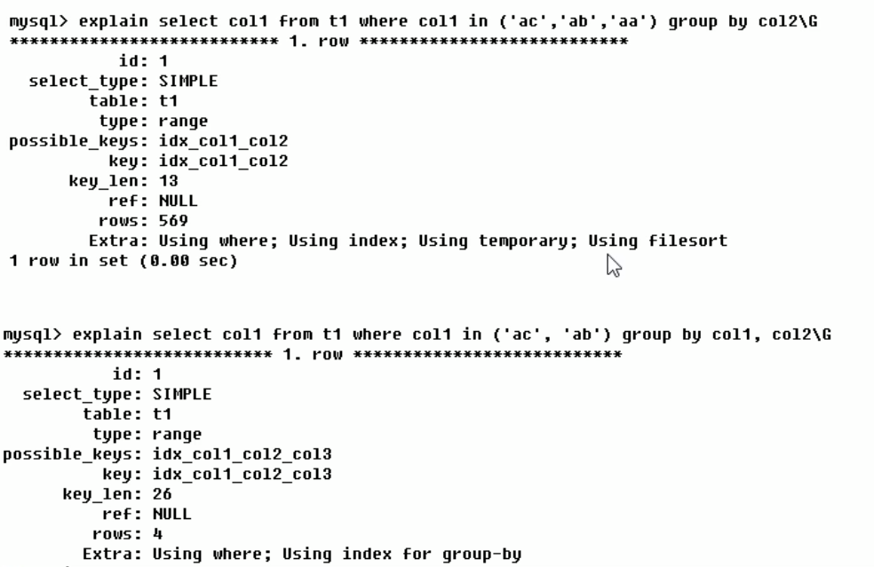

#### using index(发了好事)

* 表示相应的select操作中使用了覆盖索引(`covering index`),避免了访问表的数据行，效率不错
* 如果同时出现`using where`,表明索引被用来执行索引键值的查找
* 如果没有同时出现`using where`,表明索引用来读取数据而非执行查找动作

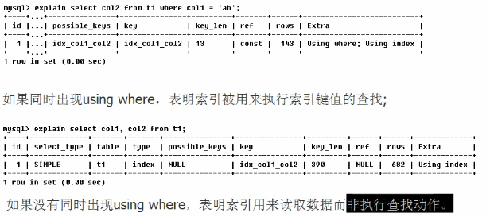

##### 覆盖索引

理解方式一(推荐): 就是select的数据列只用从索引中就能取得，不必读取数据行，mysql可以利用索引返回select列表中的字段，而不必根据索引再次读取数据文件，换句话说就是**查询列要被所建立的索引覆盖**

**注意:**

* 如果要使用覆盖索引，一定要注意select列表中只取出需要的列，不可`select *`
* 因为如果将所有字段一起做索引会导致索引文件过大，查询性能下降

#### using where

表明使用了`where`

#### using join buffer

表明使用了连接缓存

#### impossible where

where查询的值总是false,比如:`where name='hanser' and name='yousa'`

### explain之热身case

请分析如下sql各个语句的执行顺序

### 索引单表优化案例

#### 环境准备

问题:

查询category_id为1且comments大于1的情况下，views最多的article_id

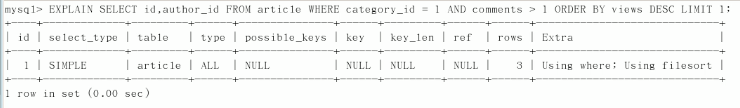

结论: 很显然，type是all,即最坏的情况。extra里还出现了`using filesort`,也是最坏的情况。优化是必须的

#### 创建索引尝试1

**注意**: 每次测试前请删除之前的索引

现在的结果:

结论:

* `type`由`ALL`变为`range`,即解决了全表扫描的问题，但是`using filesort`的问题还没解决，因为`where comments > 1`这个范围查询导致了索引失效
* 按照BTree索引的工作原理，先排序category_id,如果遇到相同的category_id,则再排序comments,如果遇到相同的comments,则再排序views。当comments字段在联合索引里处于中间位置时，因为comments>1条件是一个范围值(range),mysql无法利用索引再对后面的views部分进行检索，即range类型查询字段后面的索引无效

#### 创建索引尝试2

记得`drop`刚才创建的索引

    drop index idx_article_ccv on article;

结论:

可以看到type变成了ref,Extra中的`using filesort`也消失了，结果非常理想

### 索引两表优化案例

#### 环境准备

sql生成的表如下

#### 未优化时

结论:

type有all

#### 创建索引尝试1(左连接测试)

**注意**: 每次测试前请删除之前的索引

现在对换左右表的位置再次测试

结论:

* 在左连接时，索引加在左表和右表的效果是不一样的
* left join条件用于确定如何从右表搜索行，左边一定都有，所以右边是我们的关键，一定要建立索引
* 这里的左右是指`left join`中的左右，比如`class left join book`中,`class`表是左，`book`表是右

#### 创建索引尝试2(右连接测试)

直接上结论:

右连接索引建在左表

### 索引三表优化案例

#### 环境准备

#### 未优化时

#### 创建索引尝试1

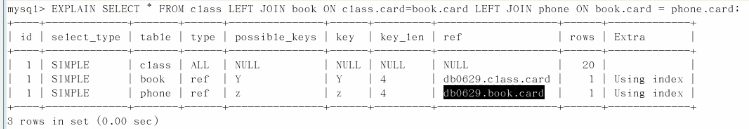

结论:

优化效果不错

### 总结

* **永远用小的结果集驱动大的结果集**
* **优先优化NestedLoop的内层循环**

解释:

比如上面的`class`这个书籍分类表和`book`这个书籍表，书籍和书籍分类相比，肯定是书籍比书籍类别多，所以`class`是小表，`book`是大表，所以要用`class`驱动`book`。

### 索引失效

* 全值匹配我最爱
* **最佳左前缀法则:** 如果索引了多列，要遵循最佳左前缀法则。指查询从索引的最左前列并且**不跳过索引中的列**
* 不在索引列上做任何操作(计算 函数 自动或手动类型装换)，因为会导致索引失效而转向全表扫描
* 存储引擎不能使用索引中范围条件右边的列(范围右边的索引列会失效)
* 尽量使用覆盖索引(只访问索引的查询,即索引列和查询列一致)，减少`select *`
* mysql在使用不等于(`!=`或`<>`)的时候无法使用索引会导致全表扫描
* `is null`和`is not null`也无法使用索引
* **like以通配符开头`'%abc..'`,mysql索引失效会变成全表扫描**
* 字符串不加单引号索引失效
* 少用`or`,用它来连接时索引会失效

### 索引优化

#### 环境准备

#### 全值匹配我最爱

索引未失效

    

    

索引失效(违背了最佳左前缀法则)

#### 不要在索引列上做任何操作

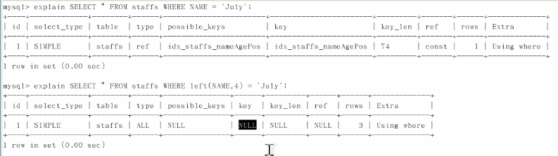

`left(name, 4)`导致索引失效

#### 存储引擎不能使用索引中范围条件右边的列(范围右边的索引列会失效)

索引部分失效

`age > 25 and pos = 'manager'`中的`pos`失效

#### 尽量使用覆盖索引

`select name,age,pos`相比于`select *`,`select name,age,pos`是覆盖索引，所以效果更好(Extra多了个using index)

再如:

这里的`type`是`ref`,相比于之前`select *`的`range`,显然是`ref`好

#### mysql在使用不等于(`!=`或`<>`)的时候无法使用索引会导致全表扫描

索引失效

#### `is null`和`is not null`也无法使用索引

索引失效

#### like以通配符开头`'%abc..'`,mysql索引失效会变成全表扫描

索引失效

索引未失效

结论:

`%`加在右边

##### 问题

解决`like '%字符串%'`时索引不被使用的方法?(答:使用覆盖索引)

环境准备

创建索引

test

索引未失效

索引失效

#### 字符串不加单引号索引失效(会导致自动类型转换)

表数据如下

索引失效

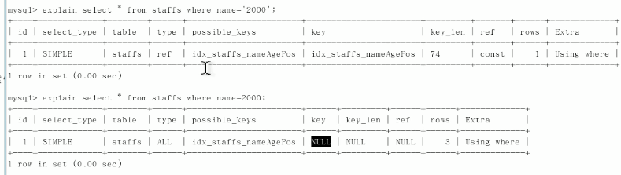

#### 少用`or`(用它来连接时索引会失效)

索引失效

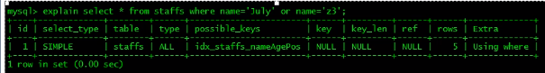

#### 小总结

解释:

最后一个like相当于和上一个`b>4`的一样，属于范围后的失效

### 索引面试分析

#### 环境准备

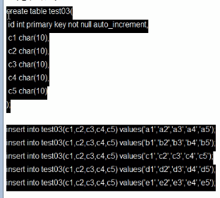

#### 问题

我们创建了复合索引idx_test03_c1234，根据以下sql分析索引的使用情况?

答: 用到了4个索引

答: 分别用到了3个 4个索引

答: 用到来2个索引(c1 c2),但是c3用于排序

答: 用到了2个索引(c1 c2),`filesort`说明数据库内部产生了一次排序，性能非常糟糕

答: 只用到了1个索引(c1),但是c2,c3用于排序，无filesort

答: 只用到了一个索引，但是c2 c3用于排序，无filesort

答: 只用到了一个索引，c2 c3用于排序，但是**有filesort**

答: 略

答: 用到了1个字段索引

答: 我tm直呼好家伙!!

### 索引优化答疑和总结

答: 分别用到了3个 1个 1个索引。

答：用到了3个索引

#### 总结

### 查询截取分析

* 查询优化
* 慢查询日志
* 批量数据脚本
* show profile
* 全局查询日志

#### 分析

* 观察,至少跑1天，看看生产的慢sql情况
* 开启慢查询日志，设置阈值，比如超过5秒的就是慢sql,并将它抓取下来
* explain+慢sql分析
* show profile
* 运维经理 or DBA,进行sql数据库的参数调优

#### 小表驱动大表

    //即外侧循环要比内层循环次数少
    for(int i = 5;..)
    {
        for(int j = 1000;..)
        {
    
        }
    }

#### order by优化

##### 环境搭建

##### test(请只关注order by会不会产生filesort,不要理会where,不要关注有没有使用索引)

答: 不会

答: 会

答: 请自己观察(最后一个是因为排序不一致，即既有升又有降)

##### 总结

order by满足两种情况，会使用index方式排序

* order by语句使用索引最左前列
* 使用where子句与order by子句条件列组合满足索引最左前列(这句不懂没关系，后面还会讲)

##### filesort的双路排序和单路排序

如果不在索引列上,filesort有两种算法:

* 双路排序

    * mysql4.1之前是使用的双路排序，字面意思就是两次扫描磁盘，最终得到数据，读取行指针和orderby列，对他们进行排序，然后扫描已经排好序的列表，安装列表中的值重新从列表里取数据

    * 从磁盘取排序字段，在buffer进行排序，再从磁盘去其它字段

* 单路排序: 从磁盘读取查询需要的所有列，安装order by列在buffer对他们进行排序，然后扫描排序后的列表进行输出，它的效率更快一些，避免了第二次读取数据。并且把随机IO变成了顺序IO,但是它会使用更多的空间，因为它把每一行都保存在内存中了。

##### 结论

* 单路总体好过双路
* 但是使用单路可能会有问题

    * 在sort_buffer中，方法B比方法A要多占用很多空间，因为方法B是把所有的字段都取出，所以有可能取出的数据的总大小超出了sort_buffer的容量，导致每次只能取sort_buffer容量大小的数据，进行排序(创建tmp文件，多路合并),排完再取sort_buffer容量大小，再排...从而导致非常多次的IO操作
    * 即本来想省一次io操作，结果反而导致了非常非常多次，得不偿失。

##### 优化策略

* 增大sort_buffer_size参数的设置
* 增大max_length_for_sort_data参数的设置
* 提高order by的速度

    * order by时select * 是一个大忌

##### 大总结(为排序使用索引)

* mysql能为排序和查询使用相同的索引

请分析下面语句中的order by带的所有字段是否都使用了索引?

答: 是

答: 否

##### group by关键字优化

* group by实质上先排序后分组，遵照索引建的最佳左前缀
* 当无法使用索引列时，增大max_length_for_sort_data 和sort_buffer_size
* where高于having,能写在where限定的条件就不要写在having中
* 其它的均和order by 一样

#### 慢查询日志

* 它用来记录在mysql中响应时间超过阈值的语句，具体指运行时间超过long_query_time值的sql语句，则会被记录到慢查询日志中。
* long_query_time的默认值为10,意思是运行10s以上的sql语句

##### 说明

默认情况下，mysql数据库是没有开启慢查询日志的，需要我们手动设置这个参数

当然，如果不是调优需要的话，一般不建议启动该参数(会影响性能)

##### 查看是否开启及如何开启

默认: `show variables like '%slow_query_log%';`

开启: `set global slow_query_log=1;`

临时生效(建议)

永久生效(不建议)

##### 什么情况的sql会记录到慢查询日志里?

##### 设置慢查询的阙值时间

`set global long_query_time=3;`

##### 慢sql测试

##### 日志分析工具mysqldumpslow

在生产环境中，如果要手工分析日志，查找，分析sql,显然是个体力活，mysql提供了日志分析工具mysqldumpslow

##### 查看mysqldumpslow的帮助信息

工作中常用参考

#### 批量插入数据脚本

##### 向表里插入1000w条数据

* 建表
* 设置参数log_bin_trust_function_creators (不然插入大量数据时会报错)
* 创建函数，保证每条数据都不同
* 创建存储过程
* 调用存储过程

##### 建表

设置参数`log_bin_trust_function_creators`

创建函数，保证每条数据都不同

**注意:** `DELIMITER $$`表示sql语句以`$$`号作为结束

* 编写随机产生字符串的函数(因为mysql没有提供内置函数,所以我们自己编写)

* 编写随机产生部门编号的函数

创建存储过程

* 创建往emp表中插入数据的存储过程

* 创建往dept表中插入数据的存储过程

调用存储过程

**注意:** `DELIMITER;`表示sql语句以`;`号作为结束

* dept

插入10条数据测试

* emp

插入50万条数据测试

#### 用show profile进行sql分析

##### 是什么?

* 是mysql提供的用来分析当前会话中语句执行的资源消耗情况工具
* 默认情况下，参数处于关闭状态，并保存最近15次的运行结果

##### 分析步骤

* 是否支持，查看当前mysql版本是否支持
* 开启show profile 功能
* 运行sql
* 查看结果, show profiles;
* 诊断sql, show profile cpu,block io for query id
* 日常开发需要注意的结论

开启`show profile`功能

运行sql

    select * from emp group by id%10 limit 150000;
    select * from emp group by id%20 order by 5;

查看结果

诊断sql, `show profile cpu,block io for query id`

日常开发需要注意的结论

#### 全局查询日志

**注意:** 永远不要在生产环境开启这个功能。

配置启用

编码启用

### 数据库锁理论概述

#### 锁的分类

从对数据操作的类型分

* 读锁(共享锁): 针对同一份数据，多个读操作可以同时进行而不会互相影响
* 写锁(排它锁): 当前写操作没有完成前，它会阻止其它写锁和读锁

从对数据操作的粒度分

* 表锁(偏读)
* 行锁(偏写)
* 页锁(介于表锁和行锁之间，了解即可)

### 读锁案例讲解1

#### 表锁

特点: 偏向`MyISAM`存储引擎，开销小，加锁快，无死锁。锁定粒度大，发生锁冲突的概率最高，并发度最低。

#### 案例分析

* 环境准备
* 加读锁
* 加写锁

环境及操作准备

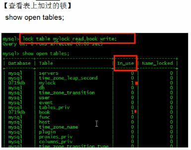

##### 我们为mylock表加read锁(读阻塞写例子)

### 写锁案例讲解

#### 我们为mylock表加write锁(MyISAM存储引擎的写阻塞写例子)

### 案例总结

**简而言之，就是读锁会阻塞写，但是不会阻塞读。而写锁则会把读和写都阻塞**

#### 表锁分析

