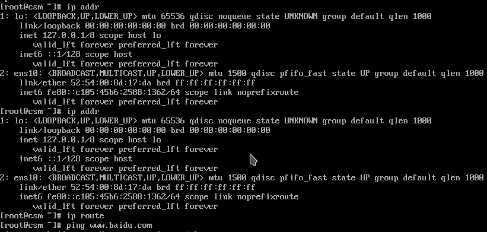
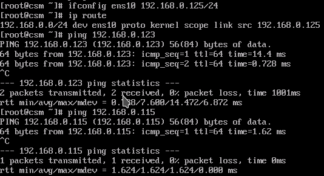
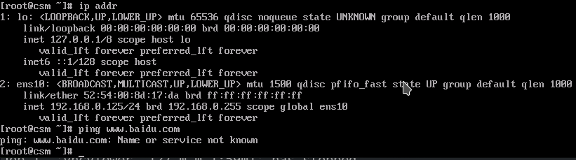
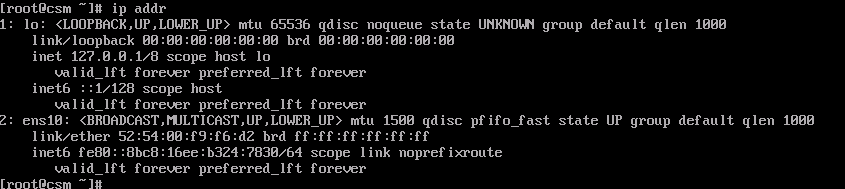
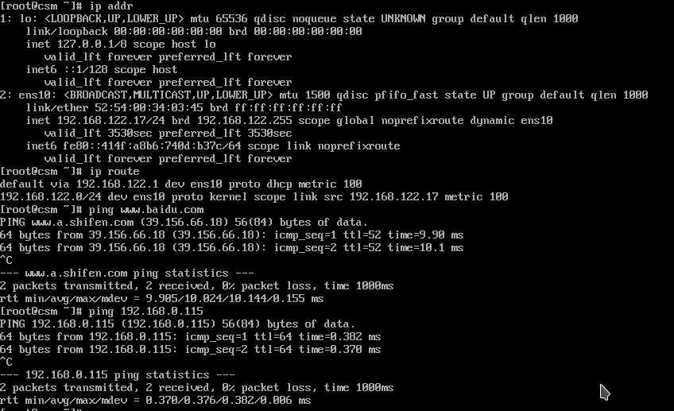

qemu_xml用不了笔记本无线网卡的br0解决.md

    :Author: kalipy
    :Email: kalipy@debian
    :Date: 2023-02-12 16:53

### 现象

配置netplan网络：

```
[I] kalipy@debian /m/k/k/xxx> sudo cat /etc/netplan/00-installer-config.yaml
network:
  version: 2
  renderer: networkd
  ethernets:
    enp9s0:
      dhcp4: yes
    wlp8s0:
      dhcp4: yes
  bridges:
    br0:
      interfaces:
        - wlp8s0
      addresses: [192.168.0.123/24]
      nameservers:
          addresses: [223.5.5.5, 114.114.114.114]
```

让netplan配置生效：

```
[I] kalipy@debian /m/k/k/xxx> sudo netplan apply
[I] kalipy@debian /m/k/k/xxx> ip addr
3: br0: <NO-CARRIER,BROADCAST,MULTICAST,UP> mtu 1500 qdisc noqueue state DOWN group default qlen 1000
    link/ether 20:1a:06:8b:65:41 brd ff:ff:ff:ff:ff:ff
    inet 192.168.0.123/24 brd 192.168.0.255 scope global br0
       valid_lft forever preferred_lft forever
    inet6 fe80::70b4:4ff:fea5:13d8/64 scope link 
       valid_lft forever preferred_lft forever
```

查看br0是否被加到`wlp8s0`这个interface下，发现居然没加上：

```
[I] kalipy@debian /m/k/k/xxx> sudo brctl show
bridge name     bridge id               STP enabled     interfaces
br0             8000.201a068b6541       no              
```

这是为什么呢？我们用命令手动加一下，发现操作不允许：

```
[I] kalipy@debian /m/k/k/xxx> sudo brctl addif br0 wlp8s0
can't add wlp8s0 to bridge br0: Operation not supporte
```

我百度网上说是无线网卡不支持混杂模式，而br必须要支持混杂，不过我感觉也是错的，因为：

```
[I] kalipy@debian /m/k/k/xxx> sudo ifconfig br0 promisc
[I] kalipy@debian /m/k/k/xxx> sudo brctl addif br0 wlp8s0
can't add wlp8s0 to bridge br0: Operation not supported
```

百度网上还说是无线网卡要关闭wifi的密码，然而我尝试了，还是一样不行。

---

br0没被成功加到interface上，我们启动xx.qcow2试下，xml网络配置如下：

```
    <interface type='bridge'>
      <source bridge='br0'/>
      <model type='e1000'/>
      <address type='pci' domain='0x0000' bus='0x00' slot='0x0a' function='0x0'/>
    </interface>
```

我们启动xx.qcow2，发现没有ip地址，宿主机和虚拟机之间网络完全ping不通:



查看宿主机br网络如下:

```
3: br0: <BROADCAST,MULTICAST,PROMISC,UP,LOWER_UP> mtu 1500 qdisc noqueue state UP group default qlen 1000
    link/ether 20:1a:06:8b:65:41 brd ff:ff:ff:ff:ff:ff
    inet 192.168.0.123/24 brd 192.168.0.255 scope global br0
       valid_lft forever preferred_lft forever
    inet6 fe80::70b4:4ff:fea5:13d8/64 scope link 
       valid_lft forever preferred_lft forever
4: wlp8s0: <BROADCAST,MULTICAST,PROMISC,UP,LOWER_UP> mtu 1500 qdisc noqueue state UP group default qlen 1000
    link/ether b8:ee:65:7b:b3:05 brd ff:ff:ff:ff:ff:ff
    inet 192.168.0.115/24 brd 192.168.0.255 scope global dynamic wlp8s0
       valid_lft 85609sec preferred_lft 85609sec
    inet6 fe80::baee:65ff:fe7b:b305/64 scope link 
       valid_lft forever preferred_lft forever
```

我们给虚拟机配置一个和宿主机br0相同网段的ip，发现现在虚拟机可以ping通宿主机了:



宿主机也可以ping同虚拟机了：

```
[I] kalipy@debian ~/bb> ping 192.168.0.125
PING 192.168.0.125 (192.168.0.125) 56(84) bytes of data.
64 bytes from 192.168.0.125: icmp_seq=1 ttl=64 time=30.0 ms
64 bytes from 192.168.0.125: icmp_seq=2 ttl=64 time=0.434 ms
```

然而虚拟机还是不能ping通`www.baidu.com`(改/etc/resovl.conf文件也没用)：



### 用docker0作为虚拟机网桥试试

xml配置如下：

```
    <interface type='bridge'>
      <source bridge='docker0'/>
      <model type='e1000'/>
      <address type='pci' domain='0x0000' bus='0x00' slot='0x0a' function='0x0'/>
    </interface>
```

宿主机网络如下：

```
[I] kalipy@debian /m/k/k/xxx> ip addr
91263: docker0: <BROADCAST,MULTICAST,PROMISC,UP,LOWER_UP> mtu 1500 qdisc noqueue state UP group default 
    link/ether 02:42:3e:04:46:22 brd ff:ff:ff:ff:ff:ff
    inet 172.17.0.1/16 brd 172.17.255.255 scope global docker0
       valid_lft forever preferred_lft forever
    inet6 fe80::42:3eff:fe04:4622/64 scope link 
       valid_lft forever preferred_lft forever
91278: tap0: <NO-CARRIER,BROADCAST,MULTICAST,UP> mtu 1500 qdisc pfifo_fast master docker0 state DOWN group default qlen 1000
    link/ether 4a:c9:b9:99:0b:4c brd ff:ff:ff:ff:ff:ff
[I] kalipy@debian /m/k/k/xxx> sudo brctl show
bridge name     bridge id               STP enabled     interfaces
docker0         8000.02423e044622       no              tap0
```

启动虚拟机进入，发现还是没ip，宿主机和虚拟机互相ping不通：



我们给虚拟机配置一个和宿主机docker0相同网段的ip，发现现在虚拟机可以ping通宿主机了

然而虚拟机还是不能ping通`www.baidu.com`(改/etc/resovl.conf文件也没用)

### 笔记本无线网卡到底怎么让qemu虚拟机可以使用br呢？

我们使用qemu自带的default网络来创建br，执行如下命令编辑配置文件:

```
[I] kalipy@debian /m/k/k/xxx> sudo virsh --connect qemu:///system net-edit default
```

修改为如下内容(host中的ip会被传递给虚拟机，xx.qcow2的ip届时就会是这个ip地址)：

```
<network>
  <name>default</name>
  <uuid>eaf744a1-080c-4b56-b4f6-3b94b3cc19bf</uuid>
  <forward mode='nat'/>
  <bridge name='virbr0' stp='on' delay='0'/>
  <mac address='52:54:00:9e:d7:0c'/>
  <ip address='192.168.122.1' netmask='255.255.255.0'>
    <dhcp>
      <range start='192.168.122.2' end='192.168.122.254'/>
      <host name='xx' ip='192.168.122.253'/>
    </dhcp>
  </ip>
</network>
```

启动刚才配置的br网络:

```
[I] kalipy@debian /m/k/k/xxx> sudo virsh --connect qemu:///system net-destroy default
[I] kalipy@debian /m/k/k/xxx> sudo virsh --connect qemu:///system net-start default
```

查看宿主机网络，发现多了一个virbr0和一个virbr0-nic:

```
I] kalipy@debian /m/k/k/xxx> ip addr
91944: virbr0: <NO-CARRIER,BROADCAST,MULTICAST,UP> mtu 1500 qdisc noqueue state DOWN group default qlen 1000
    link/ether 52:54:00:9e:d7:0c brd ff:ff:ff:ff:ff:ff
    inet 192.168.122.1/24 brd 192.168.122.255 scope global virbr0
       valid_lft forever preferred_lft forever
91945: virbr0-nic: <BROADCAST,MULTICAST> mtu 1500 qdisc pfifo_fast master virbr0 state DOWN group default qlen 1000
    link/ether 52:54:00:9e:d7:0c brd ff:ff:ff:ff:ff:ff
[I] kalipy@debian /m/k/k/xxx> sudo brctl show
bridge name     bridge id               STP enabled     interfaces
virbr0          8000.5254009ed70c       yes             virbr0-nic
```

xml配置如下：

```
    <interface type='bridge'>
      <source bridge='virbr0'/>
      <model type='e1000'/>
      <address type='pci' domain='0x0000' bus='0x00' slot='0x0a' function='0x0'/>
    </interface>
```

启动虚拟机：

```
I] kalipy@debian /m/k/k/xxx> sudo virsh undefine csm
Domain csm has been undefined

[I] kalipy@debian /m/k/k/xxx> sudo virsh define csm.xml
Domain csm defined from csm.xml

[I] kalipy@debian /m/k/k/xxx> sudo virsh start csm
Domain csm started
```

ok，现在虚拟机网络一切正常，可以ping通百度和宿主机：



宿主机也可以ping同虚拟机：

```
[I] kalipy@debian /m/k/k/xxx> ping 192.168.122.17
PING 192.168.122.17 (192.168.122.17) 56(84) bytes of data.
64 bytes from 192.168.122.17: icmp_seq=1 ttl=64 time=0.364 ms
64 bytes from 192.168.122.17: icmp_seq=2 ttl=64 time=0.280 ms
```

发现问题，为什么虚拟机的ip不是我们配置的`<host name='xx' ip='192.168.122.253'/>`：

答：我看了下xxx.qcow2的`/etc/sysconfig/network-scripts/ifcfg-eth0`中用的也是dhcp啊，按道理由qemu的virbr0分配ip，把`<host name='xx' ip='192.168.122.253'/>`改为`<host name='csm' ip='192.168.122.253'/>`，然后reboot csm也还是不行

解决：

```
sudo virsh net-destroy default
sudo virsh net-edit default
#这里host name一定要是csm
<host name='csm' ip='192.168.122.253'/>
#这里一定要destroy/start重启csm，不能在csm的vnc中reboot，不然csm ip也不生效
sudo virsh destroy csm
sudo virsh start csm
```

### 方法三

使用isc-dhcp-server，我在笔记本上用netplan的无线网卡的br0试了下，发现csm是可以正常从isc-dhcpserver获取到ip的，host和csm之间也可以互相Ping通，但是无线网卡不支持br，所有会导致host和csm都ping不通baidu这种外网。
