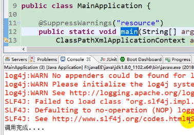

    雷锋阳dubbo入门.md
    
    :Author: kalipy
    :Email: kalipy@debian
    :Date: 2021-07-08 10:10

### 分布式系统概述

### 分布式系统发展演变

all in one:

vertical application:

distributed service:

elastic computing:

### RPC简介

#### 什么是RPC

#### RPC基本原理

eg1.

### dubbo简介

### dubbo设计架构

### 环境搭建之zookeeper注册中心

安装好即可..

### 环境搭建之监控中心控制台

下载:

mvn命令打包成jar包:

运行刚才生成的jar程序(注意先确保zookeeper已经启动):

访问控制台(账号密码都是root):

注意新版本监控控制台的变化:

### 环境搭建之创建提供者和消费者

#### 公共接口搭建(因为要RPC，所以消费者和提供者要实现同一个接口)

官方也是这样推荐的

项目结构:

    kalipy@debian ~/b/m/s/c/g/gmall-interface> tree
    .
    ├── pom.xml
    └── src
        ├── main
        │   ├── java
        │   │   └── com
        │   │       └── atguigu
        │   │           └── gmall
        │   │               ├── bean
        │   │               │   └── UserAddress.java
        │   │               └── service
        │   │                   ├── OrderService.java
        │   │                   └── UserService.java
        │   └── resources
        └── test
            ├── java
            └── resources

pom.xml

    <project xmlns="http://maven.apache.org/POM/4.0.0" xmlns:xsi="http://www.w3.org/2001/XMLSchema-instance" xsi:schemaLocation="http://maven.apache.org/POM/4.0.0 http://maven.apache.org/xsd/maven-4.0.0.xsd">
      <modelVersion>4.0.0</modelVersion>
      <groupId>com.atguigu.gmall</groupId>
      <artifactId>gmall-interface</artifactId>
      <version>0.0.1-SNAPSHOT</version>
    </project>

UserAddress.java

    package com.atguigu.gmall.bean;
    
    import java.io.Serializable;
    
    /**
     * 用户地址
     * @author lfy
     *
     */
    public class UserAddress implements Serializable {
    	
    	private Integer id;
        private String userAddress; //用户地址
        private String userId; //用户id
        private String consignee; //收货人
        private String phoneNum; //电话号码
        private String isDefault; //是否为默认地址    Y-是     N-否
        
        public UserAddress() {
    		super();
    		// TODO Auto-generated constructor stub
    	}
        
    	public UserAddress(Integer id, String userAddress, String userId, String consignee, String phoneNum,
    			String isDefault) {
    		super();
    		this.id = id;
    		this.userAddress = userAddress;
    		this.userId = userId;
    		this.consignee = consignee;
    		this.phoneNum = phoneNum;
    		this.isDefault = isDefault;
    	}
    	
    	public Integer getId() {
    		return id;
    	}
    	public void setId(Integer id) {
    		this.id = id;
    	}
    	public String getUserAddress() {
    		return userAddress;
    	}
    	public void setUserAddress(String userAddress) {
    		this.userAddress = userAddress;
    	}
    	public String getUserId() {
    		return userId;
    	}
    	public void setUserId(String userId) {
    		this.userId = userId;
    	}
    	public String getConsignee() {
    		return consignee;
    	}
    	public void setConsignee(String consignee) {
    		this.consignee = consignee;
    	}
    	public String getPhoneNum() {
    		return phoneNum;
    	}
    	public void setPhoneNum(String phoneNum) {
    		this.phoneNum = phoneNum;
    	}
    	public String getIsDefault() {
    		return isDefault;
    	}
    	public void setIsDefault(String isDefault) {
    		this.isDefault = isDefault;
    	}
    }

OrderService.java

    package com.atguigu.gmall.service;
    
    import java.util.List;
    
    import com.atguigu.gmall.bean.UserAddress;
    
    public interface OrderService {
    	
    	/**
    	 * 初始化订单
    	 * @param userId
    	 */
    	public List<UserAddress> initOrder(String userId);
    
    }

UserService.java

    package com.atguigu.gmall.service;
    
    import java.util.List;
    
    import com.atguigu.gmall.bean.UserAddress;
    
    /**
     * 用户服务
     * @author lfy
     *
     */
    public interface UserService {
    	
    	/**
    	 * 按照用户id返回所有的收货地址
    	 * @param userId
    	 * @return
    	 */
    	public List<UserAddress> getUserAddressList(String userId);
    
    }

#### 服务提供者搭建与测试

项目结构:

    kalipy@debian ~/b/m/s/c/g/user-service-provider> tree
    .
    ├── pom.xml
    ├── src
    │   ├── main
    │   │   ├── java
    │   │   │   └── com
    │   │   │       └── atguigu
    │   │   │           └── gmall
    │   │   │               ├── MainApplication.java
    │   │   │               └── service
    │   │   │                   └── impl
    │   │   │                       └── UserServiceImpl.java
    │   │   └── resources
    │   │       └── provider.xml
    │   └── test
    │       ├── java
    │       └── resources

pom.xml

    <project xmlns="http://maven.apache.org/POM/4.0.0" xmlns:xsi="http://www.w3.org/2001/XMLSchema-instance"
        xsi:schemaLocation="http://maven.apache.org/POM/4.0.0 http://maven.apache.org/xsd/maven-4.0.0.xsd">
        <modelVersion>4.0.0</modelVersion>
        <groupId>com.atguigu.gmall</groupId>
        <artifactId>user-service-provider</artifactId>
        <version>0.0.1-SNAPSHOT</version>
    
        <dependencies>
            <dependency>
                <groupId>com.atguigu.gmall</groupId>
                <artifactId>gmall-interface</artifactId>
                <version>0.0.1-SNAPSHOT</version>
            </dependency>
    
            <!-- 引入dubbo -->
            <!-- https://mvnrepository.com/artifact/com.alibaba/dubbo -->
            <dependency>
                <groupId>com.alibaba</groupId>
                <artifactId>dubbo</artifactId>
                <version>2.6.2</version>
            </dependency>
            <!-- 注册中心使用的是zookeeper，引入操作zookeeper的客户端端 -->
            <dependency>
                <groupId>org.apache.curator</groupId>
                <artifactId>curator-framework</artifactId>
                <version>2.12.0</version>
            </dependency>
    
        </dependencies>
    
        <build>  
            <plugins>  
    
                <plugin>  
                    <groupId>org.apache.maven.plugins</groupId>  
                    <artifactId>maven-jar-plugin</artifactId>  
                    <version>2.6</version>  
                    <configuration>  
                        <archive>  
                            <manifest>  
                                <addClasspath>true</addClasspath>  
                                <classpathPrefix>lib/</classpathPrefix>  
                                <mainClass>com.atguigu.gmall.MainApplication</mainClass>  
                            </manifest>  
                        </archive>  
                    </configuration>  
                </plugin>  
                <plugin>  
                    <groupId>org.apache.maven.plugins</groupId>  
                    <artifactId>maven-dependency-plugin</artifactId>  
                    <version>2.10</version>  
                    <executions>  
                        <execution>  
                            <id>copy-dependencies</id>  
                            <phase>package</phase>  
                            <goals>  
                                <goal>copy-dependencies</goal>  
                            </goals>  
                            <configuration>  
                                <outputDirectory>${project.build.directory}/lib</outputDirectory>  
                            </configuration>  
                        </execution>  
                    </executions>  
                </plugin>  
    
            </plugins>  
        </build>  
    
    </project>

注意:上面pom.xml文件build里的内容是为了解决java -jar xxx.jar运行程序时没有朱清单

UserServiceImpl.java

    package com.atguigu.gmall.service.impl;
    
    import java.util.Arrays;
    import java.util.List;
    
    import com.atguigu.gmall.bean.UserAddress;
    import com.atguigu.gmall.service.UserService;
    
    public class UserServiceImpl implements UserService {
    
    	@Override
    	public List<UserAddress> getUserAddressList(String userId) {
    		System.out.println("UserServiceImpl.....old...");
    		// TODO Auto-generated method stub
    		UserAddress address1 = new UserAddress(1, "北京市昌平区宏福科技园综合楼3层", "1", "李老师", "010-56253825", "Y");
    		UserAddress address2 = new UserAddress(2, "深圳市宝安区西部硅谷大厦B座3层（深圳分校）", "1", "王老师", "010-56253825", "N");
    		
            return Arrays.asList(address1,address2);
    	}
    
    }

MainApplication.java

    package com.atguigu.gmall;
    
    import java.io.IOException;
    
    import org.springframework.context.ApplicationContext;
    import org.springframework.context.support.ClassPathXmlApplicationContext;
    
    public class MainApplication {
    	
    	public static void main(String[] args) throws Exception {
    		ClassPathXmlApplicationContext ioc = new ClassPathXmlApplicationContext("provider.xml");
    		ioc.start();
    		
    		//System.in.read();//防止退出
            Thread.sleep(60*1000*10);
    	}
    
    }

provider.xml

    <?xml version="1.0" encoding="UTF-8"?>
    <beans xmlns="http://www.springframework.org/schema/beans"
    	xmlns:xsi="http://www.w3.org/2001/XMLSchema-instance"
    	xmlns:dubbo="http://code.alibabatech.com/schema/dubbo"
    	xsi:schemaLocation="http://www.springframework.org/schema/beans http://www.springframework.org/schema/beans/spring-beans.xsd
    		http://dubbo.apache.org/schema/dubbo http://dubbo.apache.org/schema/dubbo/dubbo.xsd
    		http://code.alibabatech.com/schema/dubbo http://code.alibabatech.com/schema/dubbo/dubbo.xsd">
    
    	<!-- 1、指定当前服务/应用的名字（同样的服务名字相同，不要和别的服务同名） -->
    	<dubbo:application name="user-service-provider"></dubbo:application>
    	
    	<!-- 2、指定注册中心的位置 2种方式都可以-->
    	<!-- <dubbo:registry address="zookeeper://127.0.0.1:2181"></dubbo:registry> -->
    	<dubbo:registry protocol="zookeeper" address="127.0.0.1:2181"></dubbo:registry>
    	
    	<!-- 3、指定通信规则（通信协议？通信端口）这个端口随便指定 -->
    	<dubbo:protocol name="dubbo" port="20880"></dubbo:protocol>
    	
    	<!-- 4、暴露服务   ref：指向服务的真正的实现对象 -->
    	<dubbo:service interface="com.atguigu.gmall.service.UserService" 
    		ref="userServiceImpl">
    	</dubbo:service>
    	
    	<!-- 服务的实现 -->
    	<bean id="userServiceImpl" class="com.atguigu.gmall.service.impl.UserServiceImpl"></bean>
    	
    </beans>

##### 测试

先运行zookeeper:

    kalipy@debian ~/b/m/s/software> tar -xzvf zookeeper-3.4.11.tar.gz
    
    kalipy@debian ~/b/m/s/s/zookeeper-3.4.11> cd conf/
    kalipy@debian ~/b/m/s/s/z/conf> cp zoo_sample.cfg zoo.cfg
    
    kalipy@debian ~/b/m/s/s/zookeeper-3.4.11> cd bin/
    kalipy@debian ~/b/m/s/s/z/bin> ./zkServer.sh start
    ZooKeeper JMX enabled by default
    Using config: /home/kalipy/bak2/my_study_notes/sanxuetan_dubbo/software/zookeeper-3.4.11/bin/../conf/zoo.cfg
    Starting zookeeper ... STARTED
    kalipy@debian ~/b/m/s/s/z/bin> ./zkServer.sh status
    ZooKeeper JMX enabled by default
    Using config: /home/kalipy/bak2/my_study_notes/sanxuetan_dubbo/software/zookeeper-3.4.11/bin/../conf/zoo.cfg
    Mode: standalone

再运行监控控制台:

    kalipy@debian ~/b/m/s/software> java -jar dubbo-admin-0.0.1-SNAPSHOT.jar

把gmall-interface公共接口做成jar包并安装到本地maven仓库(因为生产者和消费者都要导入这个依赖):

    kalipy@debian ~/b/m/s/c/g/gmall-interface> mvn clean install

把服务提供者构建为jar包(1. 因为mvn命令行没有像gradle run的功能，所以只能打成jar包，然后java -jar xx.jar来运行; 2. 上面的mvn install不能少，不然这里会找不到gmall-interace这个依赖):

    kalipy@debian ~/b/m/s/c/g/user-service-provider> mvn clean
    kalipy@debian ~/b/m/s/c/g/user-service-provider> mvn package

运行服务提供者:

    kalipy@debian ~/b/m/s/c/g/user-service-provider> java -jar target/user-service-provider-0.0.1-SNAPSHOT.jar

效果:

#### 服务消费者搭建

    kalipy@debian ~/b/m/sanxuetan_dubbo> tree code/order-service-consumer/
    code/order-service-consumer/
    ├── pom.xml
    ├── src
    │   ├── main
    │   │   ├── java
    │   │   │   └── com
    │   │   │       └── atguigu
    │   │   │           └── gmall
    │   │   │               ├── MainApplication.java
    │   │   │               └── service
    │   │   │                   └── impl
    │   │   │                       └── OrderServiceImpl.java
    │   │   └── resources
    │   │       └── consumer.xml
    │   └── test
    │       ├── java
    │       └── resources

pom.xml

    <project xmlns="http://maven.apache.org/POM/4.0.0" xmlns:xsi="http://www.w3.org/2001/XMLSchema-instance" xsi:schemaLocation="http://maven.apache.org/POM/4.0.0 http://maven.apache.org/xsd/maven-4.0.0.xsd">
        <modelVersion>4.0.0</modelVersion>
        <groupId>com.atguigu.gmall</groupId>
        <artifactId>order-service-consumer</artifactId>
        <version>0.0.1-SNAPSHOT</version>
    
        <dependencies>
            <dependency>
                <groupId>com.atguigu.gmall</groupId>
                <artifactId>gmall-interface</artifactId>
                <version>0.0.1-SNAPSHOT</version>
            </dependency>
    
            <!-- 引入dubbo -->
            <!-- https://mvnrepository.com/artifact/com.alibaba/dubbo -->
            <dependency>
                <groupId>com.alibaba</groupId>
                <artifactId>dubbo</artifactId>
                <version>2.6.2</version>
            </dependency>
            <!-- 注册中心使用的是zookeeper，引入操作zookeeper的客户端端 -->
            <dependency>
                <groupId>org.apache.curator</groupId>
                <artifactId>curator-framework</artifactId>
                <version>2.12.0</version>
            </dependency>
    
        </dependencies>
    
        <build>  
            <plugins>  
    
                <plugin>  
                    <groupId>org.apache.maven.plugins</groupId>  
                    <artifactId>maven-jar-plugin</artifactId>  
                    <version>2.6</version>  
                    <configuration>  
                        <archive>  
                            <manifest>  
                                <addClasspath>true</addClasspath>  
                                <classpathPrefix>lib/</classpathPrefix>  
                                <mainClass>com.atguigu.gmall.MainApplication</mainClass>  
                            </manifest>  
                        </archive>  
                    </configuration>  
                </plugin>  
                <plugin>  
                    <groupId>org.apache.maven.plugins</groupId>  
                    <artifactId>maven-dependency-plugin</artifactId>  
                    <version>2.10</version>  
                    <executions>  
                        <execution>  
                            <id>copy-dependencies</id>  
                            <phase>package</phase>  
                            <goals>  
                                <goal>copy-dependencies</goal>  
                            </goals>  
                            <configuration>  
                                <outputDirectory>${project.build.directory}/lib</outputDirectory>  
                            </configuration>  
                        </execution>  
                    </executions>  
                </plugin>  
    
            </plugins>  
        </build>  
    
    </project>

OrderServiceImpl.java

    package com.atguigu.gmall.service.impl;
    
    import java.util.List;
    
    import org.springframework.beans.factory.annotation.Autowired;
    import org.springframework.stereotype.Service;
    
    import com.atguigu.gmall.bean.UserAddress;
    import com.atguigu.gmall.service.OrderService;
    import com.atguigu.gmall.service.UserService;
    
    /**
     * 1、将服务提供者注册到注册中心（暴露服务）
     * 		1）、导入dubbo依赖（2.6.2）\操作zookeeper的客户端(curator)
     * 		2）、配置服务提供者
     * 
     * 2、让服务消费者去注册中心订阅服务提供者的服务地址
     * @author lfy
     *
     */
    @Service
    public class OrderServiceImpl implements OrderService {
    
    	@Autowired
    	UserService userService;
    	@Override
    	public List<UserAddress> initOrder(String userId) {
    		// TODO Auto-generated method stub
    		System.out.println("用户id："+userId);
    		//1、查询用户的收货地址
    		List<UserAddress> addressList = userService.getUserAddressList(userId);
    		for (UserAddress userAddress : addressList) {
    			System.out.println(userAddress.getUserAddress());
    		}
    		return addressList;
    	}
    }

MainApplication.java

    package com.atguigu.gmall;
    
    import java.io.IOException;
    
    import org.springframework.context.support.ClassPathXmlApplicationContext;
    
    import com.atguigu.gmall.service.OrderService;
    
    public class MainApplication {
    	
    	@SuppressWarnings("resource")
    	public static void main(String[] args) throws Exception {
    		ClassPathXmlApplicationContext applicationContext = new ClassPathXmlApplicationContext("consumer.xml");
    		
    		OrderService orderService = applicationContext.getBean(OrderService.class);
    		
    		orderService.initOrder("1");
    		System.out.println("调用完成....");
    		
            //System.in.read();//防止退出
            Thread.sleep(60*1000*10);
    	}
    
    }

consumer.xml

    <?xml version="1.0" encoding="UTF-8"?>
    <beans xmlns="http://www.springframework.org/schema/beans"
    	xmlns:xsi="http://www.w3.org/2001/XMLSchema-instance"
    	xmlns:dubbo="http://dubbo.apache.org/schema/dubbo"
    	xmlns:context="http://www.springframework.org/schema/context"
    	xsi:schemaLocation="http://www.springframework.org/schema/beans http://www.springframework.org/schema/beans/spring-beans.xsd
    		http://www.springframework.org/schema/context http://www.springframework.org/schema/context/spring-context-4.3.xsd
    		http://dubbo.apache.org/schema/dubbo http://dubbo.apache.org/schema/dubbo/dubbo.xsd
    		http://code.alibabatech.com/schema/dubbo http://code.alibabatech.com/schema/dubbo/dubbo.xsd">
    	<context:component-scan base-package="com.atguigu.gmall.service.impl"></context:component-scan>
    
    	<dubbo:application name="order-service-consumer"></dubbo:application>
    	
    	<dubbo:registry address="zookeeper://127.0.0.1:2181"></dubbo:registry>
    	
    	<!--声明需要调用的远程服务的接口；生成远程服务代理  -->
    	<dubbo:reference interface="com.atguigu.gmall.service.UserService"
    		id="userService">
    	</dubbo:reference>
    		
    </beans>

##### 测试

消费者的jar包构建和生产者的一样，这里我省略..

先启动生产者，再启动消费者，发现消费者可以RPC调用服务提供者的函数

效果:

    kalipy@debian ~/b/m/s/c/g/order-service-consumer> 
    java -jar target/order-service-consumer-0.0.1-SNAPSHOT.jar
    log4j:WARN No appenders could be found for logger (org.springframework.core.env.StandardEnvironment).
    log4j:WARN Please initialize the log4j system properly.
    log4j:WARN See http://logging.apache.org/log4j/1.2/faq.html#noconfig for more info.
    SLF4J: Failed to load class "org.slf4j.impl.StaticLoggerBinder".
    SLF4J: Defaulting to no-operation (NOP) logger implementation
    SLF4J: See http://www.slf4j.org/codes.html#StaticLoggerBinder for further details.
    用户id：1
    北京市昌平区宏福科技园综合楼3层
    深圳市宝安区西部硅谷大厦B座3层（深圳分校）
    调用完成....

### 监控中心Simple Monitor安装配置

同理，用mvn命令打包

打包后，我们要用的是.tar.gz文件:

解压后运行:

效果:

配置监控中心:

consumer.xml(2种方式都可):

    <dubbo:monitor protocol="registry"></dubbo:monitor>
    <!-- <dubbo:monitor address="127.0.0.1:7070"></dubbo:monitor> -->

provider.xml:

    <!-- 连接监控中心 -->
    <dubbo:monitor protocol="registry"></dubbo:monitor>

分别运行生产者和消费者,然后查看127.0.0.1:8080

### 与springboot整合

新建生产者项目:

新建消费者项目:

#### 生产者

项目结构:

    kalipy@debian ~/b/m/s/c/p/boot-user-service-provider> tree
    .
    ├── mvnw
    ├── mvnw.cmd
    ├── pom.xml
    └── src
        └── main
            ├── java
            │   └── com
            │       └── atguigu
            │           └── gmall
            │               ├── BootUserServiceProviderApplication.java
            │               └── service
            │                   └── impl
            │                       └── UserServiceImpl.java
            └── resources
                └── application.properties

pom.xml

    <?xml version="1.0" encoding="UTF-8"?>
    <project xmlns="http://maven.apache.org/POM/4.0.0" xmlns:xsi="http://www.w3.org/2001/XMLSchema-instance"
    	xsi:schemaLocation="http://maven.apache.org/POM/4.0.0 http://maven.apache.org/xsd/maven-4.0.0.xsd">
    	<modelVersion>4.0.0</modelVersion>
    
    	<groupId>com.atguigu</groupId>
    	<artifactId>boot-user-service-provider</artifactId>
    	<version>0.0.1-SNAPSHOT</version>
    	<packaging>jar</packaging>
    
    	<name>boot-user-service-provider</name>
    	<description>Demo project for Spring Boot</description>
    
    	<parent>
    		<groupId>org.springframework.boot</groupId>
    		<artifactId>spring-boot-starter-parent</artifactId>
    		<version>2.0.4.RELEASE</version>
    		<relativePath /> <!-- lookup parent from repository -->
    	</parent>
    
    	<properties>
    		<project.build.sourceEncoding>UTF-8</project.build.sourceEncoding>
    		<project.reporting.outputEncoding>UTF-8</project.reporting.outputEncoding>
    		<java.version>1.8</java.version>
    	</properties>
    
    	<dependencies>
    		<dependency>
    			<groupId>org.springframework.boot</groupId>
    			<artifactId>spring-boot-starter</artifactId>
    		</dependency>
    
    		<dependency>
    			<groupId>com.atguigu.gmall</groupId>
    			<artifactId>gmall-interface</artifactId>
    			<version>0.0.1-SNAPSHOT</version>
    		</dependency>
    		<dependency>
    			<groupId>com.alibaba.boot</groupId>
    			<artifactId>dubbo-spring-boot-starter</artifactId>
    			<version>0.2.0</version>
    		</dependency>
    		
    		<dependency>
    			<groupId>org.springframework.boot</groupId>
    			<artifactId>spring-boot-starter-test</artifactId>
    			<scope>test</scope>
    		</dependency>
    
    		<dependency>
    			<groupId>org.springframework.cloud</groupId>
    			<artifactId>
    				spring-cloud-starter-netflix-hystrix
    			</artifactId>
    		</dependency>
    	</dependencies>
    
    	<build>
    		<plugins>
    			<plugin>
    				<groupId>org.springframework.boot</groupId>
    				<artifactId>spring-boot-maven-plugin</artifactId>
    			</plugin>
    		</plugins>
    	</build>
    
    	<dependencyManagement>
    		<dependencies>
    			<dependency>
    				<groupId>org.springframework.cloud</groupId>
    				<artifactId>spring-cloud-dependencies</artifactId>
    				<version>Finchley.SR1</version>
    				<type>pom</type>
    				<scope>import</scope>
    			</dependency>
    		</dependencies>
    	</dependencyManagement>
    </project>

UserServiceImpl.java

    package com.atguigu.gmall.service.impl;
    
    import java.util.Arrays;
    import java.util.List;
    
    import org.springframework.stereotype.Component;
    
    import com.alibaba.dubbo.config.annotation.Reference;
    import com.alibaba.dubbo.config.annotation.Service;
    import com.atguigu.gmall.bean.UserAddress;
    import com.atguigu.gmall.service.UserService;
    import com.netflix.hystrix.contrib.javanica.annotation.HystrixCommand;
    
    @Service//暴露服务 
    @Component
    public class UserServiceImpl implements UserService {
    
    	@Override
    	public List<UserAddress> getUserAddressList(String userId) {
    		// TODO Auto-generated method stub
    		System.out.println("UserServiceImpl..3.....");
    		UserAddress address1 = new UserAddress(1, "北京市昌平区宏福科技园综合楼3层", "1", "李老师", "010-56253825", "Y");
    		UserAddress address2 = new UserAddress(2, "深圳市宝安区西部硅谷大厦B座3层（深圳分校）", "1", "王老师", "010-56253825", "N");
    		
            return Arrays.asList(address1,address2);
    	}
    }

application.properties

    dubbo.application.name=user-service-provider
    dubbo.registry.address=127.0.0.1:2181
    dubbo.registry.protocol=zookeeper
    
    dubbo.protocol.name=dubbo
    dubbo.protocol.port=20880
    
    dubbo.monitor.protocol=registry

BootUserServiceProviderApplication.java

    package com.atguigu.gmall;
    
    import org.springframework.boot.SpringApplication;
    import org.springframework.boot.autoconfigure.SpringBootApplication;
    import org.springframework.cloud.netflix.hystrix.EnableHystrix;
    import org.springframework.context.annotation.ImportResource;
    
    import com.alibaba.dubbo.config.spring.context.annotation.DubboComponentScan;
    import com.alibaba.dubbo.config.spring.context.annotation.EnableDubbo;
    
    /**
     * 1、导入依赖；
     * 		1）、导入dubbo-starter
     * 		2）、导入dubbo的其他依赖
     * @author lfy
     */
    @EnableDubbo //开启基于注解的dubbo功能
    @SpringBootApplication
    public class BootUserServiceProviderApplication {
    
    	public static void main(String[] args) {
    		SpringApplication.run(BootUserServiceProviderApplication.class, args);
    	}
    }

##### 测试

mvn命令行运行springboot项目:

    kalipy@debian ~/b/m/s/c/p/boot-user-service-provider> mvn spring-boot:run

效果:

#### 消费者

项目结构:

    kalipy@debian ~/b/m/s/c/p/boot-order-service-consumer> tree
    .
    ├── mvnw
    ├── mvnw.cmd
    ├── pom.xml
    └── src
        └── main
            ├── java
            │   └── com
            │       └── atguigu
            │           └── gmall
            │               ├── BootOrderServiceConsumerApplication.java
            │               ├── controller
            │               │   └── OrderController.java
            │               └── service
            │                   └── impl
            │                       └── OrderServiceImpl.java
            └── resources
                ├── application.properties
                ├── static
                └── templates

pom.xml

    <?xml version="1.0" encoding="UTF-8"?>
    <project xmlns="http://maven.apache.org/POM/4.0.0" xmlns:xsi="http://www.w3.org/2001/XMLSchema-instance"
    	xsi:schemaLocation="http://maven.apache.org/POM/4.0.0 http://maven.apache.org/xsd/maven-4.0.0.xsd">
    	<modelVersion>4.0.0</modelVersion>
    
    	<groupId>com.atguigu</groupId>
    	<artifactId>boot-order-service-consumer</artifactId>
    	<version>0.0.1-SNAPSHOT</version>
    	<packaging>jar</packaging>
    
    	<name>boot-order-service-consumer</name>
    	<description>Demo project for Spring Boot</description>
    
    	<parent>
    		<groupId>org.springframework.boot</groupId>
    		<artifactId>spring-boot-starter-parent</artifactId>
    		<version>2.0.4.RELEASE</version>
    		<relativePath /> <!-- lookup parent from repository -->
    	</parent>
    
    	<properties>
    		<project.build.sourceEncoding>UTF-8</project.build.sourceEncoding>
    		<project.reporting.outputEncoding>UTF-8</project.reporting.outputEncoding>
    		<java.version>1.8</java.version>
    	</properties>
    
    	<dependencies>
    		<dependency>
    			<groupId>org.springframework.boot</groupId>
    			<artifactId>spring-boot-starter-web</artifactId>
    		</dependency>
    
    		<dependency>
    			<groupId>com.alibaba.boot</groupId>
    			<artifactId>dubbo-spring-boot-starter</artifactId>
    			<version>0.2.0</version>
    		</dependency>
    
    		<dependency>
    			<groupId>com.atguigu.gmall</groupId>
    			<artifactId>gmall-interface</artifactId>
    			<version>0.0.1-SNAPSHOT</version>
    		</dependency>
    
    		<dependency>
    			<groupId>org.springframework.boot</groupId>
    			<artifactId>spring-boot-starter-test</artifactId>
    			<scope>test</scope>
    		</dependency>
    
    		<dependency>
    			<groupId>org.springframework.cloud</groupId>
    			<artifactId>
    				spring-cloud-starter-netflix-hystrix
    			</artifactId>
    		</dependency>
    	</dependencies>
    
    	<build>
    		<plugins>
    			<plugin>
    				<groupId>org.springframework.boot</groupId>
    				<artifactId>spring-boot-maven-plugin</artifactId>
    			</plugin>
    		</plugins>
    	</build>
       
    	<dependencyManagement>
    		<dependencies>
    			<dependency>
    				<groupId>org.springframework.cloud</groupId>
    				<artifactId>spring-cloud-dependencies</artifactId>
    				<version>Finchley.SR1</version>
    				<type>pom</type>
    				<scope>import</scope>
    			</dependency>
    		</dependencies>
    	</dependencyManagement>
    </project>

OrderController.java

    package com.atguigu.gmall.controller;
    
    import java.util.List;
    
    import org.springframework.beans.factory.annotation.Autowired;
    import org.springframework.stereotype.Controller;
    import org.springframework.web.bind.annotation.RequestMapping;
    import org.springframework.web.bind.annotation.RequestParam;
    import org.springframework.web.bind.annotation.ResponseBody;
    
    import com.atguigu.gmall.bean.UserAddress;
    import com.atguigu.gmall.service.OrderService;
    
    @Controller
    public class OrderController {
    	
    	@Autowired
    	OrderService orderService;
    	
    	@ResponseBody
    	@RequestMapping("/initOrder")
    	public List<UserAddress> initOrder(@RequestParam("uid")String userId) {
    		return orderService.initOrder(userId);
    	}
    }

OrderServiceImpl.java

    package com.atguigu.gmall.service.impl;
    
    import java.util.Arrays;
    import java.util.List;
    
    import org.springframework.beans.factory.annotation.Autowired;
    import org.springframework.stereotype.Service;
    
    import com.alibaba.dubbo.config.annotation.Reference;
    import com.atguigu.gmall.bean.UserAddress;
    import com.atguigu.gmall.service.OrderService;
    import com.atguigu.gmall.service.UserService;
    import com.netflix.hystrix.contrib.javanica.annotation.HystrixCommand;
    
    /**
     * 1、将服务提供者注册到注册中心（暴露服务）
     * 		1）、导入dubbo依赖（2.6.2）\操作zookeeper的客户端(curator)
     * 		2）、配置服务提供者
     * 
     * 2、让服务消费者去注册中心订阅服务提供者的服务地址
     * @author lfy
     *
     */
    @Service
    public class OrderServiceImpl implements OrderService {
    
    	//@Autowired
    	@Reference
    	UserService userService;
    	
    	@Override
    	public List<UserAddress> initOrder(String userId) {
    		// TODO Auto-generated method stub
    		System.out.println("用户id："+userId);
    		//1、查询用户的收货地址
    		List<UserAddress> addressList = userService.getUserAddressList(userId);
    		return addressList;
    	}
    	
    }

BootOrderServiceConsumerApplication.java

    package com.atguigu.gmall;
    
    import org.springframework.boot.SpringApplication;
    import org.springframework.boot.autoconfigure.SpringBootApplication;
    import org.springframework.cloud.netflix.hystrix.EnableHystrix;
    
    import com.alibaba.dubbo.config.spring.context.annotation.EnableDubbo;
    
    @EnableDubbo
    @SpringBootApplication
    public class BootOrderServiceConsumerApplication {
    
    	public static void main(String[] args) {
    		SpringApplication.run(BootOrderServiceConsumerApplication.class, args);
    	}
    }

application.properties

    server.port=8081
    
    dubbo.application.name=boot-order-service-consumer
    dubbo.registry.address=zookeeper://127.0.0.1:2181
    dubbo.monitor.protocol=registry

##### 测试

mvn命令行运行springboot项目(注意记得先运行生产者):

    kalipy@debian ~/b/m/s/c/p/boot-order-service-consumer> mvn spring-boot:run

效果:

### 配置dubbo.properties和属性加载顺序

下面这些配置信息到底可以写什么呢?

请看官网:

配置文件加载优先级

### 配置启动检查(代码在springboot整合章节的前一章节的基础上进行修改)

#### 测试(代码在springboot整合章节的前一章节的基础上进行修改)

注释掉消费者main函数的2行:

不运行生产者，只运行消费者,我们可以看到报错了(即默认是启用了服务启动检查):

现在我们关闭启动检查(修改消费者consumer.xml的这一行):

现在再次测试,可以看到不报错了:

刚才的配置只是对于UserService这一个接口关闭启动检查，当接口服务很多时，一个个配置很麻烦，所以有了下面22行的统一配置所有:

### 配置_超时和配置覆盖关系(代码在配置启动检查章节上进行修改)

#### 超时设置

超时是用来干嘛的:

服务消费者调用服务提供者的服务时，由于网络等种种原因，服务提供方执行一个方法，可能要花很长时间，如果很长时间都没有返回，大量线程在服务提供方这里阻塞，造成服务提供方性能下降，所以我们可以手动设置一个服务提供方的超时时间,只要这个方法在指定时间内没有返回，那我消费者就立即终止，不让服务提供方线程阻塞。

现在我们在消费者的consumer.xml加上超时(注意:在没有配置这个超时属性时，默认就是1s):

服务提供者代码修改(让它睡上4s):

##### 测试

消费者的这个注释打开:

然后分别启动生产者和消费者。

同理，reference只是设置单个接口的，consumer是设置所有的:

甚至，还可以配置一个接口下单个方法:

现在就有一个问题，那么在都配置了的情况下，是reference生效还是consumer生效呢?

#### 配置覆盖关系

优先级由上到下依次降低:

### 配置重试次数

指超时后，重试的重复次数,比如，在消费者的consumer.xml作如下配置:

超时后重试的效果:

而且，在有多个服务提供方的时候，其中一个服务提供方超时失败后，还会自动切换重试另一个服务提供方。

什么时候可以设置重试，什么时候不可以:

幂等操作:每次运行的效果都是一样的

### 配置多版本(代码在springboot整合章节的前一章节的基础上进行修改)

把UserServiceImpl.java复制为UserServiceImpl2.java(注意class的名字也要改为UserServiceImpl2),然后把println语句的old改为new:

    kalipy@debian ~/b/m/s/c/p/user-service-provider> 
    more src/main/java/com/atguigu/gmall/service/impl/UserServiceImpl2.java 
    package com.atguigu.gmall.service.impl;
    
    import java.util.Arrays;
    import java.util.List;
    
    import com.atguigu.gmall.bean.UserAddress;
    import com.atguigu.gmall.service.UserService;
    
    public class UserServiceImpl2 implements UserService {
    
            @Override
            public List<UserAddress> getUserAddressList(String userId) {
                    System.out.println("UserServiceImpl.....new...");
                    // TODO Auto-generated method stub
                    UserAddress address1 = new UserAddress(1, "北京市昌平区宏福科技园综合楼3层", 
    "1", "李老师", "010-56253825", "Y");
                    UserAddress address2 = new UserAddress(2, "深圳市宝安区西部硅谷大厦B座3层（深
    圳分校）", "1", "王老师", "010-56253825", "N");
    
            return Arrays.asList(address1,address2);
            }
    }

项目结构现在如下:

    kalipy@debian ~/b/m/s/c/p/user-service-provider> tree src/
    src/
    ├── main
    │   ├── java
    │   │   └── com
    │   │       └── atguigu
    │   │           └── gmall
    │   │               ├── MainApplication.java
    │   │               └── service
    │   │                   └── impl
    │   │                       ├── UserServiceImpl2.java
    │   │                       └── UserServiceImpl.java
    │   └── resources
    │       └── provider.xml
    └── test
        ├── java
        └── resources

生产者和消费者代码变化如下:

#### 测试

分别启动生产者和消费者和效果(可以看到调的远程函数是version="1.0.0"的UserServiceImpl...old..):

    kalipy@debian ~/g/p/user-service-provider> 
    java -jar target/user-service-provider-0.0.1-SNAPSHOT.jar
    log4j:WARN No appenders could be found for logger (org.springframework.core.env.StandardEnvironment).
    log4j:WARN Please initialize the log4j system properly.
    log4j:WARN See http://logging.apache.org/log4j/1.2/faq.html#noconfig for more info.
    SLF4J: Failed to load class "org.slf4j.impl.StaticLoggerBinder".
    SLF4J: Defaulting to no-operation (NOP) logger implementation
    SLF4J: See http://www.slf4j.org/codes.html#StaticLoggerBinder for further details.
    UserServiceImpl.....old...

    kalipy@debian ~/g/p/order-service-consumer> 
    java -jar target/order-service-consumer-0.0.1-SNAPSHOT.jar
    log4j:WARN No appenders could be found for logger (org.springframework.core.env.StandardEnvironment).
    log4j:WARN Please initialize the log4j system properly.
    log4j:WARN See http://logging.apache.org/log4j/1.2/faq.html#noconfig for more info.
    SLF4J: Failed to load class "org.slf4j.impl.StaticLoggerBinder".
    SLF4J: Defaulting to no-operation (NOP) logger implementation
    SLF4J: See http://www.slf4j.org/codes.html#StaticLoggerBinder for further details.
    用户id：1
    北京市昌平区宏福科技园综合楼3层
    深圳市宝安区西部硅谷大厦B座3层（深圳分校）
    调用完成....

#### 测试2

场景:比如等我们2.0.0版本稳定后，我们就可以直接把1.0.0版本的服务升级为2.0.0版本

消费者consumer.xml这里改为2.0.0:

	<!--声明需要调用的远程服务的接口；生成远程服务代理  -->
	<dubbo:reference interface="com.atguigu.gmall.service.UserService"
		id="userService" version="2.0.0">
	</dubbo:reference>

再分别运行生产者和消费者，效果:

    kalipy@debian ~/g/p/user-service-provider> 
    java -jar target/user-service-provider-0.0.1-SNAPSHOT.jar
    log4j:WARN No appenders could be found for logger (org.springframework.core.env.StandardEnvironment).
    log4j:WARN Please initialize the log4j system properly.
    log4j:WARN See http://logging.apache.org/log4j/1.2/faq.html#noconfig for more info.
    SLF4J: Failed to load class "org.slf4j.impl.StaticLoggerBinder".
    SLF4J: Defaulting to no-operation (NOP) logger implementation
    SLF4J: See http://www.slf4j.org/codes.html#StaticLoggerBinder for further details.
    UserServiceImpl.....new...

    kalipy@debian ~/g/p/order-service-consumer> 
    java -jar target/order-service-consumer-0.0.1-SNAPSHOT.jar
    log4j:WARN No appenders could be found for logger (org.springframework.core.env.StandardEnvironment).
    log4j:WARN Please initialize the log4j system properly.
    log4j:WARN See http://logging.apache.org/log4j/1.2/faq.html#noconfig for more info.
    SLF4J: Failed to load class "org.slf4j.impl.StaticLoggerBinder".
    SLF4J: Defaulting to no-operation (NOP) logger implementation
    SLF4J: See http://www.slf4j.org/codes.html#StaticLoggerBinder for further details.
    用户id：1
    北京市昌平区宏福科技园综合楼3层
    深圳市宝安区西部硅谷大厦B座3层（深圳分校）
    调用完成....

#### 测试3

比如我们现在想让版本1.0.0和版本2.0.0同时有效，随机被调用，就这样配置consumer.xml:

### 本地存根(代码在上一章节的基础上修改)

代码变化如下:

    kalipy@debian ~/g/p17> git status
    位于分支 master
    要提交的变更：
      （使用 "git reset HEAD <文件>..." 以取消暂存）
    
            修改：     gmall-interface/pom.xml
            新文件：   gmall-interface/src/main/java/com/atguigu/gmall/service/UserServiceStub.java                                                                                           
            修改：     order-service-consumer/src/main/resources/consumer.xml
    
    kalipy@debian ~/g/p17> git diff HEAD
    diff --git a/gmall-interface/pom.xml b/gmall-interface/pom.xml
    index c9c0902..98592ca 100644
    --- a/gmall-interface/pom.xml
    +++ b/gmall-interface/pom.xml
    @@ -3,4 +3,15 @@
       <groupId>com.atguigu.gmall</groupId>
       <artifactId>gmall-interface</artifactId>
       <version>0.0.1-SNAPSHOT</version>
    -</project>
    \ No newline at end of file
    +  ^M
    +  <dependencies>^M
    +      <!-- 引入dubbo -->^M
    +      <!-- https://mvnrepository.com/artifact/com.alibaba/dubbo -->^M
    +      <dependency>^M
    +          <groupId>com.alibaba</groupId>^M
    +          <artifactId>dubbo</artifactId>^M
    +          <version>2.6.2</version>^M
    +      </dependency>^M
    +  </dependencies>^M
    +^M
    +</project>^M
    diff --git a/gmall-interface/src/main/java/com/atguigu/gmall/service/UserServiceStub.java b/gmall-interface/src/main/java/com/atguigu/gmall/service/UserServiceStub.java
    new file mode 100644
    index 0000000..6c8b616
    --- /dev/null
    +++ b/gmall-interface/src/main/java/com/atguigu/gmall/service/UserServiceStub.java
    @@ -0,0 +1,38 @@
    +/*
    + * UserServiceStub.java
    + * Copyright (C) 2021 2021-07-09 19:40 kalipy <kalipy@debian>
    + *
    + * Distributed under terms of the MIT license.
    + */
    +
    +package com.atguigu.gmall.service.impl;
    +
    +import org.springframework.util.StringUtils;
    +
    +import java.util.List;
    +
    +import com.atguigu.gmall.bean.UserAddress;
    +import com.atguigu.gmall.service.UserService;
    +
    +public class UserServiceStub implements UserService
    +{
    +    private final UserService userService;
    +
    +    //传入的是userService远程的代理对象
    +    public UserServiceStub(UserService userService) {
    +        this.userService = userService;
    +    }
    +
    +    @Override
    +    public List<UserAddress> getUserAddressList(String userId) {
    +        System.out.println("UserServiceStub..");
    +        
    +        if (!StringUtils.isEmpty(userId)) {
    +            return userService.getUserAddressList(userId);
    +        }
    +
    +        return null;
    +    }
    +
    +}
    +
    diff --git a/order-service-consumer/src/main/resources/consumer.xml b/order-service-consumer/src/main/resources/consumer.xml
    index 6be9950..036b0c3 100644
    --- a/order-service-consumer/src/main/resources/consumer.xml
    +++ b/order-service-consumer/src/main/resources/consumer.xml
    @@ -16,7 +16,7 @@
            
            <!--声明需要调用的远程服务的接口；生成远程服务代理  -->
            <dubbo:reference interface="com.atguigu.gmall.service.UserService"
    -               id="userService" version="2.0.0">
    +               id="userService" version="2.0.0" stub="com.atguigu.gmall.service.impl.UserServiceStub">

注意: 记得gmall-interface项目重新clean和install,因为变更了这个项目的内容。还有，生产者和消费者都要重新clean。

### 与springboot整合的三种方法..

### 高可用_zookeeper宕机与Dubbo直连

