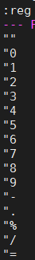

# 让vim支持系统剪切板功能
1. 查看vim是否支持clipboard功能  
`$ vim --version | grep clipboard`  
2. 如果有 +clipboard 则跳过这一步，如果显示的是 -clipboard 说明不支持, 需要安装vim-gtk  
`$ sudo apt install vim-gtk`

# 查看各个寄存器的内容
* vim命令模式输入:  
`:reg`  
显示结果:  
  

#使用vim系统剪切板功能的寄存器
通过下面命令可以查看所有寄存器中的内容，也可以只查看指定寄存器的内容（将寄存器名称作为参数）:reg [register_name] 有了上面的基础知识后，要实现题主"将 Vim 剪贴板里面的东西粘贴到 Vim 之外的地方？"就很明了，只需要将内容复制到剪切板寄存器(+)中即可，其他程序便可以访问到了。  

vim命令模式下：  
`"+yy`  // 复制当前行到剪切板  
`"+p`   // 将剪切板内容粘贴到光标后面  
`"ayy`  // 复制当前行到寄存器 a  
`"ap`   // 将寄存器 a 中的内容粘贴到光标后面  

---------------------------------- 2016-03-05 旧的回答 -------------------------------------------  

* Vim 有12个粘贴板依次编号为：0、1、2、...、9、a、"、+  , 其中 + 号为系统粘贴板，” 为临时粘贴板。  
* 系统剪切板中的内容可在其他程序中使用。上面的复制指令都可以配合剪切板进行操作。  
* "nyw 复制当前单词到 n 号剪切板（双引号开始）   
* "np 粘贴 n 号剪切板内容到当前位置后   
* "+Y 复制当前行到系统剪切板  
* "+nY 复制当前行往下 n 行到系统剪切板  
* "+p 粘贴系统剪切板内容到当前位置后

