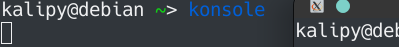

    vncserver和x11问题.md
    
    :Author: kalipy
    :Email: kalipy@debian
    :Date: 2021-06-02 16:15

### 使用tightvncserver开启远程桌面服务
    
    //安装
    sudo apt install tightvncserver

    //使用
    tightvncserver

### 使用x11vncserver开启远程桌面服务

    安装x11vnc
    sudo apt-get install x11vnc
    
    生成密码
    x11vnc -storepasswd

    //带密码开启x11vncserver,-forever是允许客户端多次连接，不然x11vncserver被连接一次后，客户端断开后服务端会立即停止x11vncserver
    //请一定要用-rfbauth指定密码，不然客户端无需密码即可连接到x11vncserver
    x11vnc -forever -rfbauth ~/.vnc/passwd

### 问题

以上都是属于`vncserver`,众所周知，`vncserver`比较慢，我们实际上用`x11转发`用得比较多。

### x11转发

    //服务端安装openssh-server,通常各在linux发行版下都是系统自带默认安装好了的
    sudo apt-get install openssh-server
    
    //客户端安装openssh-client
    sudo apt-get install openssh-client
    
    //更改配置文件,开启x11转发和运行远程访问x11(非常重要,`x11Forwarding`一定要`yes`,`X11UseLocalhost`一定要`no`,不然100%失败)
    sudo vim /etc/ssh/sshd_config
    
    //这是修改后的配置文件的内容
    X11Forwarding yes
    X11UseLocalhost no 
    
    //重启ssh-server
    sudo service ssh restart

### 使用

方法一:

    ssh -X username@host_ip

方法二:

使用mobaxterm进行连接

### 效果

我们发现，现在可以直接在ssh下成功启动gui程序：

