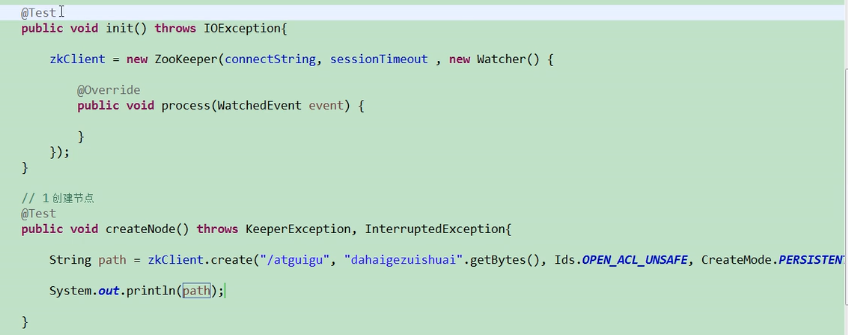
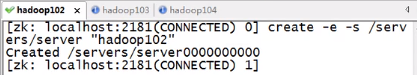
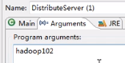

    sanguigu_zookeeper入门.md
    
    :Author: kalipy
    :Email: kalipy@debian
    :Date: 2021-06-12 15:40

### 特点

### 数据结构

### 应用场景

* 统一命名服务
* 统一配置管理
* 统一集群管理
* 服务器节点动态上下线
* 软负载均衡

#### 统一命名服务

####  统一配置管理

#### 统一集群管理

#### 服务器节点动态上下线

####  软负载均衡

### 下载

下载: https://zookeeper.apache.org/releases.html

使用：https://zookeeper.apache.org/doc/current/zookeeperStarted.html

### 初步使用

创建配置文件

    kalipy@debian ~/下载> tar -xzvf apache-zookeeper-3.6.3-bin.tar.gz
    
    kalipy@debian ~/下/a/conf> pwd
    /home/kalipy/下载/apache-zookeeper-3.6.3-bin/conf
    
    kalipy@debian ~/下/a/conf> ls
    configuration.xsl  log4j.properties  zoo_sample.cfg
    
    kalipy@debian ~/下/a/conf> mv zoo_sample.cfg zoo.cfg
    
    kalipy@debian ~/下/a/conf> more zoo.cfg 
    tickTime=2000
    dataDir=/tmp/zookeeper
    clientPort=2181

启动zookeeper服务

    kalipy@debian ~/下/a/bin> pwd
    /home/kalipy/下载/apache-zookeeper-3.6.3-bin/bin
    
    kalipy@debian ~/下/a/bin> ls
    README.txt*    zkEnv.cmd*               zkServer.sh*            zkTxnLogToolkit.sh*
    zkCleanup.sh*  zkEnv.sh*                zkSnapShotToolkit.cmd*
    zkCli.cmd*     zkServer.cmd*            zkSnapShotToolkit.sh*
    zkCli.sh*      zkServer-initialize.sh*  zkTxnLogToolkit.cmd*
    
    kalipy@debian ~/下/a/bin> ./zkServer.sh start

查看是否成功启动

    kalipy@debian ~/下/a/bin> ./zkServer.sh status
    ZooKeeper JMX enabled by default
    Using config: /home/kalipy/下载/apache-zookeeper-3.6.3-bin/bin/../conf/zoo.cfg
    Client port found: 2181. Client address: localhost. Client SSL: false.
    Mode: standalone

连接zookeeper服务

    kalipy@debian ~/下/a/bin> ./zkCli.sh -server 127.0.0.1:2181

### 配置参数的意思

### 选举机制(面试重点)

* 半数机制: 集群中一半以上机器存活，集群可用。所以zookeeper适合安装奇数台服务器

* zookeeper虽然在配置文件中并没有指定master和slave。但是，zookeeper工作时，是有一个节点作为leader，其它则为follower，leader是通过内部的选举机制临时产生的

三个核心选举原则：

* Zookeeper集群中只有超过半数以上的服务器启动，集群才能正常工作；

* 在集群正常工作之前，myid小的服务器给myid大的服务器投票，直到集群正常工作，选出Leader；

* 选出Leader之后，之前的服务器状态由Looking改变为Following，以后的服务器都是Follower。

下面以一个简单的例子来说明整个选举的过程：

假设有五台服务器组成的Zookeeper集群，它们的id从1-5，同时它们都是最新启动的，也就是没有历史数据，在存放数据量这一点上，都是一样的。

假设这些服务器从id1-5，依序启动：

因为一共5台服务器，只有超过半数以上，即最少启动3台服务器，集群才能正常工作。

1. 服务器1启动，发起一次选举。

        服务器1投自己一票。此时服务器1票数一票，不够半数以上（3票），选举无法完成；
        服务器1状态保持为LOOKING；

2. 服务器2启动，再发起一次选举。

        服务器1和2分别投自己一票，此时服务器1发现服务器2的id比自己大，更改选票投给服务器2；
        此时服务器1票数0票，服务器2票数2票，不够半数以上（3票），选举无法完成；
        服务器1，2状态保持LOOKING；

3. 服务器3启动，发起一次选举。

        与上面过程一样，服务器1和2先投自己一票，然后因为服务器3id最大，两者更改选票投给为服务器3；
        此次投票结果：服务器1为0票，服务器2为0票，服务器3为3票。此时服务器3的票数已经超过半数（3票），服务器3当选Leader。
        服务器1，2更改状态为FOLLOWING，服务器3更改状态为LEADING；

4. 服务器4启动，发起一次选举。

        此时服务器1，2，3已经不是LOOKING状态，不会更改选票信息。交换选票信息结果：服务器3为3票，服务器4为1票。
        此时服务器4服从多数，更改选票信息为服务器3；
        服务器4并更改状态为FOLLOWING；

5. 服务器5启动，同4一样投票给3，此时服务器3一共5票，服务器5为0票；
        服务器5并更改状态为FOLLOWING；

最终Leader是服务器3，状态为LEADING。其余服务器是Follower，状态为FOLLOWING。

### 节点类型

### 分布式安装(不推荐方法一和方法二)

#### 方法一(原生方法,没有三台机器的人用方法三,极其不推荐旧版本的方法二)

解压zookeeper压缩包

    kalipy@debian ~/下载> tar -xzvf apache-zookeeper-3.6.3-bin.tar.gz

创建zoo.cfg

    cp zoo_sample.cfg zoo.cfg

修改zoo.cfg为如下内容
    
    # 添加配置tmp目录，里面将配置myid，zookeeper运行过程中产生的数据，就存在这个目录下
    dataDir=/home/kalipy/下载/apache-zookeeper-3.6.3-bin/tmp
    ...省略
    # 配置三台的ip，广播端口（用于通讯）和选举端口
    # server.1=192.168.200.140:2888:3888
    # server.2=192.168.200.150:2888:3888
    # server.3=192.168.200.160:2888:3888

编辑myid

在zookeeper根目录下需要手动创建tmp目录，新建文件myid并编辑myid为上面server后的数字，三个节点分别为1，2，3。

    # hadoop01节点配置1，其他依次类推
    kalipy@debian ~/下/apache-zookeeper-3.6.3-bin> pwd
    /home/kalipy/下载/apache-zookeeper-3.6.3-bin
    kalipy@debian ~/下/apache-zookeeper-3.6.3-bin> mkdir tmp
    kalipy@debian ~/下/apache-zookeeper-3.6.3-bin> vim tmp/myid
    kalipy@debian ~/下/apache-zookeeper-3.6.3-bin> more tmp/myid 
    1

远程拷贝

将hadoop01节点上的zookeeper远程拷贝到hadoop02和hadoop03，记住分别修改后两个节点的myid为2和3

    # 远程拷贝到hadoop02
    kalipy@debian ~/下载> scp -r apache-zookeeper-3.6.3-bin root@hadoop02:$PWD
    # 远程拷贝到hadoop03
    kalipy@debian ~/下载> scp -r apache-zookeeper-3.6.3-bin root@hadoop03:$PWD

启动

进入zookeeper根目录下，进入bin下启动三台节点的zookeeper，并查看三台zookeeper的状态，如果为1主2从，就说明安装成功。

三台启动

    [root@hadoop01 /home/software/zookeeper-3.4.8/bin]# ./zkServer.sh start

查看状态，如果按照hadoop1、hadoop2和hadoop3顺序启动，则第一台是follower，第二台是leader，第三台是follower。这里用到了ZAB过半选举的规则，后续补充。

    # 第二台是leader
    [root@hadoop02 /home/software/zookeeper-3.4.8/bin]# ./zkServer.sh status
    ZooKeeper JMX enabled by default
    Using config: /home/software/zookeeper-3.4.8/bin/../conf/zoo.cfg
    Mode: leader

这样就完成了zookeeper完全分布式的安装部署。

#### 方法二(docker的形式安装,zk3.5版本之前的)

##### 使用docker需要注意知识点

--net=host参数的作用

    一句话总结,加了--net=host以后就不需要再做端口映射了.比如docker容器内在8080端口起了一个web server.不加的话需要把本机的某个port比如7979和docker内的8080做一个映射关系,访问的时候访问7979. 加了net=host则直接访问8080.
    
    另外,加了net=host后会使得创建的容器进入命令行好名称显示为主机的名称而不是一串id.　

--net=host参数会导致容器没有自己的ip地址

    即通过`sudo docker inspect 容器id`查看容器的ip地址显示是空的

docker实现多个端口映射,即通过多个`-p`来实现

    docker run --name definedName(自定义容器名称) -p 8080:8080(端口映射  本机端口: docker端口 ) -p 8081:8081 -p .... d imagesName(镜像名称)

拉取镜像

    #不指定版本默认拉取latest
    sudo docker pull zookeeper

创建容器

    #HOST1 # 分布式下请不要用--net=host,不然容器内有ip地址。只部署一个单机zookeeper时为了自动映射zookeeper的端口-p 2181:2181 -p 2888:2888 -p 3888:3888可以考虑使用--net=host
    #sudo docker run -d --name=zookeeper1 --net=host zookeeper
    sudo docker run -d --name=zookeeper1 zookeeper
    #HOST2
    #sudo docker run -d --name=zookeeper2 --net=host zookeeper
    sudo docker run -d --name=zookeeper2 zookeeper
    #HOST3
    #sudo docker run -d --name=zookeeper3 --net=host zookeeper
    sudo docker run -d --name=zookeeper3 zookeeper

修改配置文件

方式一: 直接进入容器内进行修改(缺点是容器内没有vim要`apt-get update && apt-get install vim`,server.x=ip的ip请执行`sudo docker inspect zookeeperx`来获取)

配置zoo.cfg

    #HOST1:
    $sudo docker exec -it zookeeper1 /bin/bash
    $vi /conf/zoo.cfg
    ##改成下面
    clientPort=2181
    dataDir=/data
    dataLogDir=/datalog
    tickTime=2000
    initLimit=5
    syncLimit=2
    server.1=172.17.0.2:2888:3888
    server.2=172.17.0.3:2888:3888
    server.3=172.17.0.4:2888:3888

配置myid

    #修改myid为1
    $vi /data/myid

HOST2和HOST3的zoo.cfg配置文件都一样,myid分别为2,3

方式二: 现在宿主机vim zoo.cfg,写入如下内容，然后把zoo.cfg拷贝到容器内

配置zoo.cfg

    kalipy@debian ~/下/a/conf> more zoo.cfg 
    clientPort=2181
    dataDir=/data
    dataLogDir=/datalog
    tickTime=2000
    initLimit=5
    syncLimit=2
    server.1=172.17.0.2:2888:3888
    server.2=172.17.0.3:2888:3888
    server.3=172.17.0.4:2888:3888
    
    kalipy@debian ~/下/a/conf> sudo docker cp zoo.cfg   zookeeper1:/apache-zookeeper-3.7.0-bin/conf/.
    kalipy@debian ~/下/a/conf> sudo docker cp zoo.cfg   zookeeper2:/apache-zookeeper-3.7.0-bin/conf/.
    kalipy@debian ~/下/a/conf> sudo docker cp zoo.cfg   zookeeper3:/apache-zookeeper-3.7.0-bin/conf/.

配置myid

    # 宿主机里分别修改myid为1 2 3,分别cp myid到容器内的/data/下
    kalipy@debian ~/下/a/conf> more myid
    1
    kalipy@debian ~/下/a/conf> sudo docker cp myid   zookeeper1:/data/
    kalipy@debian ~/下/a/conf> more myid
    2
    kalipy@debian ~/下/a/conf> sudo docker cp myid   zookeeper2:/data/
    kalipy@debian ~/下/a/conf> more myid
    3
    kalipy@debian ~/下/a/conf> sudo docker cp myid   zookeeper3:/data/

验证

进入服务器命令行
    
    docker exec -it qd-zookeeper2 /bin/bash
    #查看zkServer运行状态，Mode为follower或leader
    bin/zkServer.sh status

如果出现Mode为standalone则防火墙未关或配置文件有问题zookeeper

#### 方法三(docker的形式安装,zk3.5版本之后的)

官方教程: https://hub.docker.com/_/zookeeper

##### 需要注意的问题

docker-compose命令找不到:

    sudo: docker-compose：找不到命令

解决(下载docker-compose):

官网地址: https://github.com/docker/compose

    kalipy@debian ~/下/a/conf> sudo chmod +x docker-compose-Linux-x86_64
    kalipy@debian ~/下/a/conf> ls
    docker-compose-Linux-x86_64*

运行`sudo docker-compose -f stack.yml up`报错:

    Creating network "conf_default" with the default driver ERROR: could not find an available, non-over

解决:

关闭电脑的vpn即可成功

##### 正式搭建分布式环境

去官网https://hub.docker.com/_/zookeeper拷贝如下文件

    kalipy@debian ~/下/a/conf> more stack.yml 
    version: '3.7'
    
    services:
      zoo1:
        image: zookeeper
        restart: always
        hostname: zoo1
        ports:
          - 2181:2181
        environment:
          ZOO_MY_ID: 1
          ZOO_SERVERS: server.1=zoo1:2888:3888;2181 server.2=zoo2:2888:3888;2181 server.3
    =zoo3:2888:3888;2181
    
      zoo2:
        image: zookeeper
        restart: always
        hostname: zoo2
        ports:
          - 2182:2181
        environment:
          ZOO_MY_ID: 2
          ZOO_SERVERS: server.1=zoo1:2888:3888;2181 server.2=zoo2:2888:3888;2181 server.3
    =zoo3:2888:3888;2181
    
      zoo3:
        image: zookeeper
        restart: always
        hostname: zoo3
        ports:
          - 2183:2181
        environment:
          ZOO_MY_ID: 3
          ZOO_SERVERS: server.1=zoo1:2888:3888;2181 server.2=zoo2:2888:3888;2181 server.3
    =zoo3:2888:3888;2181

执行如下命令

    kalipy@debian ~/下/a/conf> sudo ./docker-compose-Linux-x86_64  -f stack.yml up

查看三个zookeeper容器是否启动成功

    kalipy@debian ~/b/m/docker> sudo docker ps
    CONTAINER ID   IMAGE       COMMAND                  CREATED          STATUS          PORTS                                                  NAMES
    c038eb8f0265   zookeeper   "/docker-entrypoint.…"   24 minutes ago   Up 33 seconds   2888/tcp, 3888/tcp, 8080/tcp, 0.0.0.0:2183->2181/tcp   conf_zoo3_1
    bd29ca07be51   zookeeper   "/docker-entrypoint.…"   24 minutes ago   Up 34 seconds   2888/tcp, 3888/tcp, 8080/tcp, 0.0.0.0:2182->2181/tcp   conf_zoo2_1
    f5424825d739   zookeeper   "/docker-entrypoint.…"   24 minutes ago   Up 34 seconds   2888/tcp, 3888/tcp, 0.0.0.0:2181->2181/tcp, 8080/tcp   conf_zoo1_1

我们可以看到`conf_zoo3_1`是`Leader`,其它的2个是`Fllower`:

    kalipy@debian ~/b/m/docker> sudo docker exec -it conf_zoo3_1 /bin/bash
    root@zoo3:/apache-zookeeper-3.7.0-bin# cd bin/
    root@zoo3:/apache-zookeeper-3.7.0-bin/bin# ./zkServer.sh status
    ZooKeeper JMX enabled by default
    Using config: /conf/zoo.cfg
    Client port found: 2181. Client address: localhost. Client SSL: false.
    Mode: leader
    root@zoo3:/apache-zookeeper-3.7.0-bin/bin# exit
    exit
    kalipy@debian ~/b/m/docker> sudo docker exec -it conf_zoo2_1 /bin/bash
    root@zoo2:/apache-zookeeper-3.7.0-bin# cd bin/
    root@zoo2:/apache-zookeeper-3.7.0-bin/bin# ./zkServer.sh status
    ZooKeeper JMX enabled by default
    Using config: /conf/zoo.cfg
    Client port found: 2181. Client address: localhost. Client SSL: false.
    Mode: follower
    root@zoo2:/apache-zookeeper-3.7.0-bin/bin# exit
    exit
    kalipy@debian ~/b/m/docker> sudo docker exec -it conf_zoo1_1 /bin/bash
    root@zoo1:/apache-zookeeper-3.7.0-bin# cd bin/
    root@zoo1:/apache-zookeeper-3.7.0-bin/bin# ./zkServer.sh status
    ZooKeeper JMX enabled by default
    Using config: /conf/zoo.cfg
    Client port found: 2181. Client address: localhost. Client SSL: false.
    Mode: follower
    root@zoo1:/apache-zookeeper-3.7.0-bin/bin# exit
    exit
    kalipy@debian ~/b/m/docker> 

至此，环境搭建成功

### 客户端常用命令

查看节点信息:

    [zk: 127.0.0.1:2181(CONNECTED) 5] ls /
    [zookeeper]

查看节点详细信息:

    [zk: 127.0.0.1:2181(CONNECTED) 4] ls -s /
    [zookeeper]
    cZxid = 0x0
    ctime = Thu Jan 01 08:00:00 CST 1970
    mZxid = 0x0
    mtime = Thu Jan 01 08:00:00 CST 1970
    pZxid = 0x0
    cversion = -1
    dataVersion = 0
    aclVersion = 0
    ephemeralOwner = 0x0
    dataLength = 0
    numChildren = 1

创建节点:

    [zk: 127.0.0.1:2181(CONNECTED) 12] ls /
    [zookeeper]
    [zk: 127.0.0.1:2181(CONNECTED) 13] create /sanguo
    Created /sanguo
    [zk: 127.0.0.1:2181(CONNECTED) 14] create /sanguo2 "jinlian"
    Created /sanguo2
    [zk: 127.0.0.1:2181(CONNECTED) 15] create /sanguo/sanguo3 "liubei"
    Created /sanguo/sanguo3
    [zk: 127.0.0.1:2181(CONNECTED) 16] ls /
    [sanguo, sanguo2, zookeeper]

获取节点:

    0.0.1:2181(CONNECTED) 17] get /sanguo
    sanguo    sanguo2
    [zk: 127.0.0.1:2181(CONNECTED) 17] get /sanguo2
    jinlian
    [zk: 127.0.0.1:2181(CONNECTED) 18] get /sanguo
    null
    [zk: 127.0.0.1:2181(CONNECTED) 19] get /sanguo/sanguo3 
    liubei

获取节点详细信息:

    zk: 127.0.0.1:2181(CONNECTED) 20] get /sanguo/sanguo3 -s
    liubei
    cZxid = 0xf
    ctime = Sun Jun 13 14:38:53 CST 2021
    mZxid = 0xf
    mtime = Sun Jun 13 14:38:53 CST 2021
    pZxid = 0xf
    cversion = 0
    dataVersion = 0
    aclVersion = 0
    ephemeralOwner = 0x0
    dataLength = 6
    numChildren = 0

注意: 节点值变化监听，新版本中是`get -w /xxx`

### stat结构体

### 监听器原理(面试重点)

### 写数据的流程

### 创建zookeeper客户端

#### 单元test

注意: hadoop102,hadoop103,hadoop104在hosts里已经手动和ip绑定了,请别疑惑。

#### 创建子节点

空指针异常:

原因: 单元测试2拿不到单元测试1中的zkClient

解决: 单元测试1的`@Test`改成`@Before`:

#### 获取子节点并监听数据变化

#### 判断节点是否存在

### 监听服务器节点动态上下线案例

服务注册java代码:

即将服务器注册到zookeeper集群里:

客户端监听zookeeper集群中服务器上下线的代码:

#### 测试

先运行客户端监听代码:

报错:

解决:

##### Test1

直接在zkClient.sh里面create手动注册一个节点:

我们可以看到DistributeClient.java成功监听到zookeeper集群中节点的变化:

##### Test2

我们现在再来测试服务注册的java代码:

设置运行参数(也可以命令行java -jar来传参数给DistributeServer.java):

hadoop102服务器节点注册成功:

DistributeClient.java也监听到了zookeeper集群中服务器的变化:

