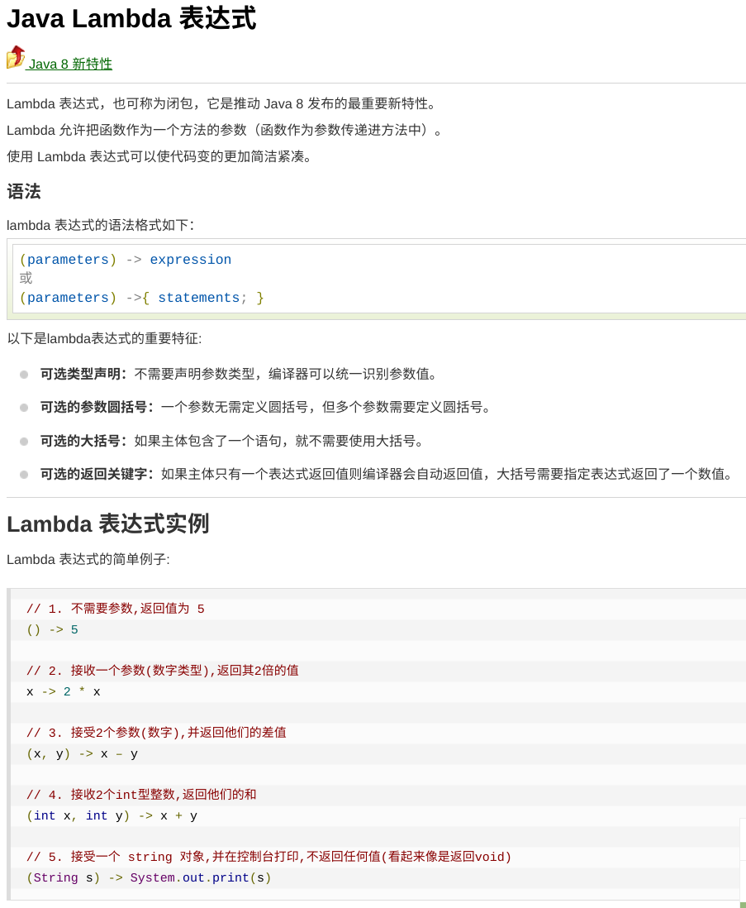
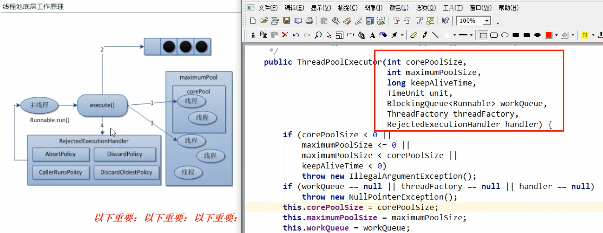
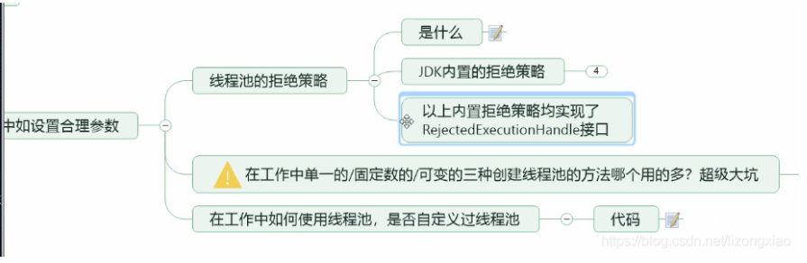

    周阳juc.md
    
    :Author: kalipy
    :Email: kalipy@debian

### 介绍

#### JUC是什么

#### 进程/线程是什么

### 买票复习

#### 老版写法

    kalipy@debian ~/g/temp_22_1_11> more SaleTicket.java 
    class Ticket{//资源类
        //票
        private int number = 30;
    
        public synchronized void saleTicket(){
            if (number > 0){
                System.out.println(Thread.currentThread().getName()+"\t卖出第："+(number--)+"\t还剩下："+number);
            }
        }
    }
    /**
     *题目：三个售票员   卖出   30张票
     * 多线程编程的企业级套路+模板
     * 1.在高内聚低耦合的前提下，线程    操作(对外暴露的调用方法)     资源类
     */
    public class SaleTicket {
        public static void main(String[] args) {
            Ticket ticket = new Ticket();
    
            new Thread(new Runnable() {
                @Override
                public void run() {
                    for (int i = 1; i <= 40; i++) {
                        ticket.saleTicket();
                    }
                }
            },"A").start();
    
            new Thread(new Runnable() {
                @Override
                public void run() {
                    for (int i = 1; i <= 40; i++) {
                        ticket.saleTicket();
                    }
                }
            },"B").start();
    
            new Thread(new Runnable() {
                @Override
                public void run() {
                    for (int i = 1; i <= 40; i++) {
                        ticket.saleTicket();
                    }
                }
            },"C").start();
        }
    }

效果：

    kalipy@debian ~/g/temp_22_1_11> javac SaleTicket.java
    kalipy@debian ~/g/temp_22_1_11> java SaleTicket
    A       卖出第：30      还剩下：29
    A       卖出第：29      还剩下：28
    A       卖出第：28      还剩下：27
    A       卖出第：27      还剩下：26
    A       卖出第：26      还剩下：25
    A       卖出第：25      还剩下：24
    A       卖出第：24      还剩下：23
    A       卖出第：23      还剩下：22
    A       卖出第：22      还剩下：21
    A       卖出第：21      还剩下：20
    A       卖出第：20      还剩下：19
    A       卖出第：19      还剩下：18
    A       卖出第：18      还剩下：17
    A       卖出第：17      还剩下：16
    A       卖出第：16      还剩下：15
    A       卖出第：15      还剩下：14
    A       卖出第：14      还剩下：13
    A       卖出第：13      还剩下：12
    A       卖出第：12      还剩下：11
    B       卖出第：11      还剩下：10
    B       卖出第：10      还剩下：9
    B       卖出第：9       还剩下：8
    B       卖出第：8       还剩下：7
    B       卖出第：7       还剩下：6
    B       卖出第：6       还剩下：5
    B       卖出第：5       还剩下：4
    B       卖出第：4       还剩下：3
    B       卖出第：3       还剩下：2
    B       卖出第：2       还剩下：1
    B       卖出第：1       还剩下：0

#### 新版写法

    kalipy@debian ~/g/temp_22_1_11> more SaleTicket.java
    import java.util.concurrent.locks.Lock;
    import java.util.concurrent.locks.ReentrantLock;
    
    //资源类 = 实例变量 + 实例方法
    class Ticket{
        //票
        private int number = 30;
        Lock lock  = new ReentrantLock();
    
        public void sale(){
            lock.lock();
            try {
                if (number > 0){
                    System.out.println(Thread.currentThread().getName()+"\t卖出第："+(number--)+"\t还剩下："+number);
                }
            }catch (Exception e){
                e.printStackTrace();
            }finally {
                lock.unlock();
            }
        }
    }
    
    /**
     *题目：三个售票员   卖出   30张票
     * 笔记：如何编写企业级的多线程
     * 固定的编程套路+模板
     * 1.在高内聚低耦合的前提下，线程    操作(对外暴露的调用方法)     资源类
     *  1.1先创建一个资源类
     */
    public class SaleTicket {
        //主线程，一切程序的入口
        public static void main(String[] args) {
            Ticket ticket = new Ticket();
    
            new Thread(()->{for (int i = 1; i <= 40; i++) ticket.sale();},"A").start();
            new Thread(()->{for (int i = 1; i <= 40; i++) ticket.sale();},"B").start();
            new Thread(()->{for (int i = 1; i <= 40; i++) ticket.sale();},"C").start();
        }
    }

效果：

    kalipy@debian ~/g/temp_22_1_11> javac SaleTicket.java
    kalipy@debian ~/g/temp_22_1_11> java SaleTicket
    A       卖出第：30      还剩下：29
    A       卖出第：29      还剩下：28
    A       卖出第：28      还剩下：27
    A       卖出第：27      还剩下：26
    A       卖出第：26      还剩下：25
    A       卖出第：25      还剩下：24
    A       卖出第：24      还剩下：23
    A       卖出第：23      还剩下：22
    C       卖出第：22      还剩下：21
    C       卖出第：21      还剩下：20
    C       卖出第：20      还剩下：19
    C       卖出第：19      还剩下：18
    C       卖出第：18      还剩下：17
    C       卖出第：17      还剩下：16
    C       卖出第：16      还剩下：15
    C       卖出第：15      还剩下：14
    C       卖出第：14      还剩下：13
    C       卖出第：13      还剩下：12
    C       卖出第：12      还剩下：11
    C       卖出第：11      还剩下：10
    C       卖出第：10      还剩下：9
    C       卖出第：9       还剩下：8
    C       卖出第：8       还剩下：7
    C       卖出第：7       还剩下：6
    C       卖出第：6       还剩下：5
    C       卖出第：5       还剩下：4
    C       卖出第：4       还剩下：3
    C       卖出第：3       还剩下：2
    C       卖出第：2       还剩下：1
    C       卖出第：1       还剩下：0

### LambdaExpress

eg1.

    kalipy@debian ~/g/temp_22_1_11> more LambdaExpressDemo.java 
    /*
     * LambdaExpressDemo.java
     * Copyright (C) 2022 2022-01-11 10:56 kalipy <kalipy@debian> 3069087972@qq.com
     *
     * Distributed under terms of the MIT license.
     */
    
    interface Foo {
        public void sayHello();
    }
    
    public class LambdaExpressDemo
    {
        public static void main(String args[]) {
            Foo foo = new Foo() {
                @Override
                public void sayHello() {
                    System.out.println("hello");
                }
            };
    
            foo.sayHello();
    
            //Lambda
            Foo foo2 = () -> {
                System.out.println("hello lambda");
            };
            foo2.sayHello();
    
        }
    }
 
效果：

    kalipy@debian ~/g/temp_22_1_11> javac LambdaExpressDemo.java
    kalipy@debian ~/g/temp_22_1_11> java LambdaExpressDemo
    hello
    hello lambda

eg2.

    kalipy@debian ~/g/temp_22_1_11> more LambdaExpressDemo.java
    /*
     * LambdaExpressDemo.java
     * Copyright (C) 2022 2022-01-11 10:56 kalipy <kalipy@debian> 3069087972@qq.com
     *
     * Distributed under terms of the MIT license.
     */
    
    interface Foo {
        public int add(int x, int y);
    }
    
    public class LambdaExpressDemo
    {
        public static void main(String args[]) {
    
            //Lambda
            Foo foo = (int x, int y) -> {
                System.out.println("add lambda");
                return x + y;
            };
    
            System.out.println(foo.add(1, 2));
        }
    }

效果：

    kalipy@debian ~/g/temp_22_1_11> javac LambdaExpressDemo.java
    kalipy@debian ~/g/temp_22_1_11> java LambdaExpressDemo
    add lambda
    3

eg3.

    kalipy@debian ~/g/temp_22_1_11> more LambdaExpressDemo.java
    /*
     * LambdaExpressDemo.java
     * Copyright (C) 2022 2022-01-11 10:56 kalipy <kalipy@debian> 3069087972@qq.com
     *
     * Distributed under terms of the MIT license.
     */
    
    //显示声明函数接口
    @FunctionalInterface
    interface Foo {
        public int add(int x, int y);
    
        public default int mull(int x, int y) {
            return x * y;
        }
    }
    
    public class LambdaExpressDemo
    {
        public static void main(String args[]) {
    
            //Lambda
            Foo foo = (int x, int y) -> {
                System.out.println("add lambda");
                return x + y;
            };
    
            System.out.println(foo.mull(1, 2));
        }
    }
 
效果：

    kalipy@debian ~/g/temp_22_1_11> javac LambdaExpressDemo.java
    kalipy@debian ~/g/temp_22_1_11> java LambdaExpressDemo
    2

eg4.

    kalipy@debian ~/g/temp_22_1_11> more LambdaExpressDemo.java
    /*
     * LambdaExpressDemo.java
     * Copyright (C) 2022 2022-01-11 10:56 kalipy <kalipy@debian> 3069087972@qq.com
     *
     * Distributed under terms of the MIT license.
     */
    
    //显示声明函数接口
    @FunctionalInterface
    interface Foo {
        public int add(int x, int y);
    
        public static int div(int x, int y) {
            return x / y;
        }
    }
    
    public class LambdaExpressDemo
    {
        public static void main(String args[]) {
    
            System.out.println(Foo.div(1, 2));
        }
    }

效果：

    kalipy@debian ~/g/temp_22_1_11> javac LambdaExpressDemo.java
    kalipy@debian ~/g/temp_22_1_11> java LambdaExpressDemo
    0

eg5.

把eg4中的`public int add(int x, int y);`去掉则报如下错误：

    kalipy@debian ~/g/temp_22_1_11> javac LambdaExpressDemo.java
    LambdaExpressDemo.java:9: 错误: 意外的 @FunctionalInterface 注释
    @FunctionalInterface
    ^
      Foo 不是函数接口
        在 接口 Foo 中找不到抽象方法
    1 个错误

eg5解决办法：

把`public int add(int x, int y);`和`@FunctionalInterface`都去掉即可

#### 参考文档

https://www.runoob.com/java/java8-lambda-expressions.html

eg.

    kalipy@debian ~/g/temp_22_1_11> more Java8Tester.java 
    public class Java8Tester {
        public static void main(String args[]){
            Java8Tester tester = new Java8Tester();
    
            // 类型声明
            MathOperation addition = (int a, int b) -> a + b;
    
            // 不用类型声明
            MathOperation subtraction = (a, b) -> a - b;
    
            // 大括号中的返回语句
            MathOperation multiplication = (int a, int b) -> { return a * b; };
    
            // 没有大括号及返回语句
            MathOperation division = (int a, int b) -> a / b;
    
            System.out.println("10 + 5 = " + tester.operate(10, 5, addition));
            System.out.println("10 - 5 = " + tester.operate(10, 5, subtraction));
            System.out.println("10 x 5 = " + tester.operate(10, 5, multiplication));
            System.out.println("10 / 5 = " + tester.operate(10, 5, division));
    
            // 不用括号
            GreetingService greetService1 = message ->
                System.out.println("Hello " + message);
    
            // 用括号
            GreetingService greetService2 = (message) ->
                System.out.println("Hello " + message);
    
            greetService1.sayMessage("Runoob");
            greetService2.sayMessage("Google");
        }
    
        interface MathOperation {
            int operation(int a, int b);
        }
    
        interface GreetingService {
            void sayMessage(String message);
        }
    
        private int operate(int a, int b, MathOperation mathOperation){
            return mathOperation.operation(a, b);
        }
    }

效果：

    kalipy@debian ~/g/temp_22_1_11> javac Java8Tester.java 
    kalipy@debian ~/g/temp_22_1_11> java Java8Tester
    10 + 5 = 15
    10 - 5 = 5
    10 x 5 = 50
    10 / 5 = 2
    Hello Runoob
    Hello Google

### 生产者消费者复习

    kalipy@debian ~/g/temp_22_1_11> more ProdConsumerDemo4.java 
    class Aircondition{
        private int number = 0;
    
        //老版写法
        public synchronized void increment() throws Exception{
            //1.判断
            while (number != 0){
                this.wait();
            }
            //2.干活
            number++;
            System.out.println(Thread.currentThread().getName()+"\t"+number);
            //3通知
            this.notifyAll();
        }
        public synchronized void decrement() throws Exception{
            //1.判断
            while (number == 0){
                this.wait();
            }
            //2.干活
            number--;
            System.out.println(Thread.currentThread().getName()+"\t"+number);
            //3通知
            this.notifyAll();
        }
    }
    
    /**
     * 题目：现在两个线程，可以操作初始值为零的一个变量，
     * 实现一个线程对该变量加1，一个线程对该变量-1，
     * 实现交替，来10轮，变量初始值为0.
     *      1.高内聚低耦合前提下，线程操作资源类
     *      2.判断/干活/通知
     *      3.防止虚假唤醒(判断只能用while，不能用if)
     * 知识小总结：多线程编程套路+while判断+新版写法
     */
    public class ProdConsumerDemo4 {
        public static void main(String[] args) {
            Aircondition aircondition = new Aircondition();
    
            new Thread(()->{
                for (int i = 1; i <= 10; i++) {
                    try {
                        aircondition.increment();
                    } catch (Exception e) {
                        e.printStackTrace();
                    }
                }
            },"A").start();
    
            new Thread(()->{
                for (int i = 1; i <= 10; i++) {
                    try {
                        aircondition.decrement();
                    } catch (Exception e) {
                        e.printStackTrace();
                    }
                }
            },"B").start();
    
            new Thread(()->{
                for (int i = 1; i <= 10; i++) {
                    try {
                        aircondition.increment();
                    } catch (Exception e) {
                        e.printStackTrace();
                    }
                }
            },"C").start();
    
            new Thread(()->{
                for (int i = 1; i <= 10; i++) {
                    try {
                        aircondition.decrement();
                    } catch (Exception e) {
                        e.printStackTrace();
                    }
                }
            },"D").start();
        }
    }
 
效果：

    kalipy@debian ~/g/temp_22_1_11> javac ProdConsumerDemo4.java
    kalipy@debian ~/g/temp_22_1_11> java ProdConsumerDemo4
    A       1
    B       0
    A       1
    B       0
    A       1
    B       0
    A       1
    B       0
    C       1
    B       0
    A       1
    B       0
    C       1
    D       0
    A       1
    B       0
    C       1
    D       0
    A       1
    B       0
    C       1
    D       0
    A       1
    B       0
    C       1
    D       0
    A       1
    B       0
    C       1
    D       0
    A       1
    D       0
    C       1
    D       0
    C       1
    D       0
    C       1
    D       0
    C       1
    D       0

#### kalipy补充前置知识

java锁之wait,notify(wait会释放锁，notify仅仅只是通知，不释放锁)

***wait是指在一个已经进入了同步锁的线程内，让自己暂时让出同步锁，以便其他正在等待此锁的线程可以得到同步锁并运行，只有其他线程调用了notify方法（notify并不释放锁，只是告诉调用过wait方法的线程可以去参与获得锁的竞争了，但不是马上得到锁，因为锁还在别人手里，别人还没释放），调用wait方法的一个或多个线程就会解除wait状态，重新参与竞争对象锁，程序如果可以再次得到锁，就可以继续向下运行。***

* wait()、notify()和notifyAll()方法是本地方法，并且为final方法，无法被重写。

* 当前线程必须拥有此对象的monitor（即锁），才能调用某个对象的wait()方法能让当前线程阻塞; ***（这种阻塞是通过提前释放synchronized锁，重新去请求锁导致的阻塞，这种请求必须有其他线程通过notify()或者notifyAll（）唤醒重新竞争获得锁）***

* 调用某个对象的notify()方法能够唤醒一个正在等待这个对象的monitor的线程，如果有多个线程都在等待这个对象的monitor，则只能唤醒其中一个线程；
***（notify()或者notifyAll()方法并不是真正释放锁)***

***切记1，wait会释放锁，不是说调用wait()后，锁就被释放了，而是说调用notifyAll后，wait()方法的那个线程会解除wait状态，重新参与竞争对象锁，程序如果可以再次得到锁，就可以继续向下运行，否则这就继续wait，请看eg1的代码证明(即变量i的值并没有被打印10次)***

eg1.

    kalipy@debian ~/g/temp_22_1_11> more ProdConsumerDemo4.java
    class Aircondition{
        private int number = 0;
        private int i = 0;
    
        public synchronized void increment() throws Exception{
            System.out.println(Thread.currentThread().getName()+ i++ + "\t");
            this.wait();
    
            number++;
            System.out.println(Thread.currentThread().getName()+"\t"+number);
        }
    
        public synchronized void myNotifyAll() {
            this.notifyAll();
        }
    }
    
    public class ProdConsumerDemo4 {
        public static void main(String[] args) throws Exception {
            Aircondition aircondition = new Aircondition();
    
            new Thread(()->{
                for (int i = 1; i <= 10; i++) {
                    try {
                        aircondition.increment();
                    } catch (Exception e) {
                        e.printStackTrace();
                    }
                }
            },"A").start();
    
            Thread.sleep(1000);
    
            aircondition.myNotifyAll();
            aircondition.myNotifyAll();
            aircondition.myNotifyAll();
    
        }
    }
    kalipy@debian ~/g/temp_22_1_11> javac ProdConsumerDemo4.java
    kalipy@debian ~/g/temp_22_1_11> java ProdConsumerDemo4
    A0
    A       1
    A1
    ^C⏎     

eg2.

    kalipy@debian ~/g/temp_22_1_11> more ProdConsumerDemo4.java
    class Aircondition{
        private int number = 0;
        private int i = 0;
    
        public synchronized void increment() throws Exception{
            System.out.println(Thread.currentThread().getName()+ i++ + "\t");
            this.wait();
    
            number++;
            System.out.println(Thread.currentThread().getName()+"\t"+number);
        }
    
        public synchronized void myNotifyAll() {
            this.notifyAll();
        }
    }
    
    public class ProdConsumerDemo4 {
        public static void main(String[] args) throws Exception {
            Aircondition aircondition = new Aircondition();
    
            new Thread(()->{
                for (int i = 1; i <= 10; i++) {
                    try {
                        aircondition.increment();
                    } catch (Exception e) {
                        e.printStackTrace();
                    }
                }
            },"A").start();
    
            Thread.sleep(1000);
    
            aircondition.myNotifyAll();
            Thread.sleep(1000);
            aircondition.myNotifyAll();
            Thread.sleep(1000);
            aircondition.myNotifyAll();
    
        }
    }
    kalipy@debian ~/g/temp_22_1_11> javac ProdConsumerDemo4.java
    kalipy@debian ~/g/temp_22_1_11> javac ProdConsumerDemo4.java
    kalipy@debian ~/g/temp_22_1_11> java ProdConsumerDemo4
    A0
    A       1
    A1
    A       2
    A2
    A       3
    A3
    ^C⏎    

#### 虚假唤醒

把两个`while`改成`if`后，效果如下:

    kalipy@debian ~/g/temp_22_1_11> java ProdConsumerDemo4
    A       1
    B       0
    C       1
    A       2
    ...
    ...

解释1(a为生产者，b为消费者)：

1. a1(number++ notifyall)   --a1线程执行完成
2. a2(wait)                 --a2线程阻塞在wait()
3. b1(number-- notifyall)   --b1线程执行完成
4. a2(a2被唤醒 wait释放锁，重新竞争锁 没竞争到(被由b1的notifyall唤醒的a3竞争到了)，继续wait) --a2线程继续阻塞在wait()
5. a3(a3原本阻塞在increment()的开始位置 a3执行synchronized方法体 此时number==0 number++ notifyall) --a3线程执行完成
6. a2(被a3唤醒 wait释放锁，重新竞争锁，竞争成功 a2执行synchronized方法体 number++)

甚至还会发生死锁:

    kalipy@debian ~/g/temp_22_1_11> java ProdConsumerDemo4
    A       1
    B       0
    A       1
    B       0
    A       1
    B       0
    A       1
    B       0
    A       1
    B       0
    C       1
    B       0
    A       1
    B       0
    C       1
    B       0
    A       1
    D       0
    B       -1
    B       -2
    C       -1
    D       -2
    D       -3
    D       -4
    D       -5
    D       -6
    D       -7
    D       -8
    D       -9
    D       -10
    A       -9
    C       -8
    A       -7
    C       -6
    A       -5
    C       -4
    
    
    ^C⏎ 

解释2:

网上查到的定义是说，线程在没有调用过notify()和notifyAll()的情况下醒来，是虚假唤醒。这是什么原因会导致的呢？

虚假唤醒（spurious wakeup）是一个表象，即在多处理器的系统下发出wait的程序有可能在没有notify唤醒的情形下苏醒继续执行。以运行在linux的hotspot虚拟机上的java程序为例，wait方法在jvm执行时实质是调用了底层pthread_cond_wait/pthread_cond_timedwait函数，挂起等待条件变量来达到线程间同步通信的效果，而底层wait函数在设计之初为了不减慢条件变量操作的效率并没有去保证每次唤醒都是由notify触发，而是把这个任务交由上层应用去实现，即使用者需要定义一个循环去判断是否条件真能满足程序继续运行的需求，当然这样的实现也可以避免因为设计缺陷导致程序异常唤醒的问题

### 新版生产者消费者写法

eg1.

    kalipy@debian ~/g/temp_22_1_11> more ProdConsumerDemo4.java
    import java.util.concurrent.locks.Condition;
    import java.util.concurrent.locks.Lock;
    import java.util.concurrent.locks.ReentrantLock;
    
    class Aircondition{
        private int number = 0;
        private Lock lock = new ReentrantLock();
        private Condition condition = lock.newCondition();
        private int i = 0;
    
        public void increment() throws Exception{
            lock.lock();
            try {
                System.out.println(Thread.currentThread().getName()+ i +"\t");
    
                condition.await();
    
                number++;
                System.out.println(Thread.currentThread().getName()+"\t"+number);
            } catch (Exception e) {
                e.printStackTrace();
            } finally {
                lock.unlock();
            }
        }
        public void decrement() throws Exception{
            try {
                condition.signalAll();
            } catch (Exception e) {
                e.printStackTrace();
            } finally {
            }
        }
    }
    public class ProdConsumerDemo4 {
        public static void main(String[] args) {
            Aircondition aircondition = new Aircondition();
    
            new Thread(()->{
                for (int i = 1; i <= 10; i++) {
                    try {
                        aircondition.increment();
                    } catch (Exception e) {
                        e.printStackTrace();
                    }
                }
            },"A").start();
    
        }
    }
    kalipy@debian ~/g/temp_22_1_11> javac ProdConsumerDemo4.java
    kalipy@debian ~/g/temp_22_1_11> java ProdConsumerDemo4
    A0
    ^C⏎    

eg2.

    kalipy@debian ~/g/temp_22_1_11> more ProdConsumerDemo4.java
    import java.util.concurrent.locks.Condition;
    import java.util.concurrent.locks.Lock;
    import java.util.concurrent.locks.ReentrantLock;
    
    class Aircondition{
        private int number = 0;
        private Lock lock = new ReentrantLock();
        private Condition condition = lock.newCondition();
        private int i = 0;
    
        public void increment() throws Exception{
            lock.lock();
            try {
                System.out.println(Thread.currentThread().getName()+ i++ +"\t");
    
                condition.await();
    
                number++;
                System.out.println(Thread.currentThread().getName()+"\t"+number);
            } catch (Exception e) {
                e.printStackTrace();
            } finally {
                lock.unlock();
            }
        }
        public void decrement() throws Exception{
            lock.lock();
            try {
                condition.signalAll();
            } catch (Exception e) {
                e.printStackTrace();
            } finally {
                lock.unlock();
            }
        }
    }
    public class ProdConsumerDemo4 {
        public static void main(String[] args) throws Exception {
            Aircondition aircondition = new Aircondition();
    
            new Thread(()->{
                for (int i = 1; i <= 10; i++) {
                    try {
                        aircondition.increment();
                    } catch (Exception e) {
                        e.printStackTrace();
                    }
                }
            },"A").start();
    
            Thread.sleep(1000);
            aircondition.decrement();
            Thread.sleep(1000);
            aircondition.decrement();
            Thread.sleep(1000);
            aircondition.decrement();
    
        }
    }
    kalipy@debian ~/g/temp_22_1_11> javac ProdConsumerDemo4.java
    kalipy@debian ~/g/temp_22_1_11> java ProdConsumerDemo4
    A0
    A       1
    A1
    A       2
    A2
    A       3
    A3
    ^C⏎ 

eg3.

    kalipy@debian ~/g/temp_22_1_11> more ProdConsumerDemo4.java
    import java.util.concurrent.locks.Condition;
    import java.util.concurrent.locks.Lock;
    import java.util.concurrent.locks.ReentrantLock;
    
    class Aircondition{
        private int number = 0;
        private Lock lock = new ReentrantLock();
        private Condition condition = lock.newCondition();
    
        //新版写法
        public void increment() throws Exception{
            lock.lock();
            try {
                //1.判断
                while (number != 0){
                    condition.await();
                }
                //2.干活
                number++;
                System.out.println(Thread.currentThread().getName()+"\t"+number);
                //3通知
                condition.signalAll();
            } catch (Exception e) {
                e.printStackTrace();
            } finally {
                lock.unlock();
            }
        }
        public void decrement() throws Exception{
            lock.lock();
            try {
                //1.判断
                while (number == 0){
                    condition.await();
                }
                //2.干活
                number--;
                System.out.println(Thread.currentThread().getName()+"\t"+number);
                //3通知
                condition.signalAll();
            } catch (Exception e) {
                e.printStackTrace();
            } finally {
                lock.unlock();
            }
        }
    }
    /**
     * 题目：现在两个线程，可以操作初始值为零的一个变量，
     * 实现一个线程对该变量加1，一个线程对该变量-1，
     * 实现交替，来10轮，变量初始值为0.
     *      1.高内聚低耦合前提下，线程操作资源类
     *      2.判断/干活/通知
     *      3.防止虚假唤醒(判断只能用while，不能用if)
     * 知识小总结：多线程编程套路+while判断+新版写法
     */
    public class ProdConsumerDemo4 {
        public static void main(String[] args) {
            Aircondition aircondition = new Aircondition();
    
            new Thread(()->{
                for (int i = 1; i <= 10; i++) {
                    try {
                        aircondition.increment();
                    } catch (Exception e) {
                        e.printStackTrace();
                    }
                }
            },"A").start();
    
            new Thread(()->{
                for (int i = 1; i <= 10; i++) {
                    try {
                        aircondition.decrement();
                    } catch (Exception e) {
                        e.printStackTrace();
                    }
                }
            },"B").start();
    
            new Thread(()->{
                for (int i = 1; i <= 10; i++) {
                    try {
                        aircondition.increment();
                    } catch (Exception e) {
                        e.printStackTrace();
                    }
                }
            },"C").start();
    
            new Thread(()->{
                for (int i = 1; i <= 10; i++) {
                    try {
                        aircondition.decrement();
                    } catch (Exception e) {
                        e.printStackTrace();
                    }
                }
            },"D").start();
        }
    }
    kalipy@debian ~/g/temp_22_1_11> javac ProdConsumerDemo4.java
    kalipy@debian ~/g/temp_22_1_11> java ProdConsumerDemo4
    A       1
    B       0
    C       1
    B       0
    C       1
    B       0
    C       1
    B       0
    C       1
    B       0
    C       1
    B       0
    C       1
    B       0
    C       1
    B       0
    C       1
    B       0
    C       1
    B       0
    C       1
    D       0
    A       1
    D       0
    A       1
    D       0
    A       1
    D       0
    A       1
    D       0
    A       1
    D       0
    A       1
    D       0
    A       1
    D       0
    A       1
    D       0
    A       1
    D       0

### 精确通知顺序访问

    kalipy@debian ~/g/temp_22_1_11> more ConditionDemo.java
    import java.util.concurrent.locks.Condition;
    import java.util.concurrent.locks.Lock;
    import java.util.concurrent.locks.ReentrantLock;
    
    class ShareData{
        private int number = 1;//A:1,B:2,C:3
        private Lock lock = new ReentrantLock();
        private Condition c1 = lock.newCondition();
        private Condition c2 = lock.newCondition();
        private Condition c3 = lock.newCondition();
    
        public void printc1(){
            lock.lock();
            try {
                //1.判断
                while (number != 1){
                    c1.await();
                }
                //2.干活
                for (int i = 1; i <= 5; i++) {
                    System.out.println(Thread.currentThread().getName()+"\t"+i);
                }
                //3.通知
                number = 2;
                //通知第2个
                c2.signal();
            } catch (Exception e) {
                e.printStackTrace();
            } finally {
                lock.unlock();
            }
        }
        public void printc2(){
            lock.lock();
            try {
                //1.判断
                while (number != 2){
                    c2.await();
                }
                //2.干活
                for (int i = 1; i <= 10; i++) {
                    System.out.println(Thread.currentThread().getName()+"\t"+i);
                }
                //3.通知
                number = 3;
                //如何通知第3个
                c3.signal();
            } catch (Exception e) {
                e.printStackTrace();
            } finally {
                lock.unlock();
            }
        }
        public void printc3(){
            lock.lock();
            try {
                //1.判断
                while (number != 3){
                    c3.await();
                }
                //2.干活
                for (int i = 1; i <= 15; i++) {
                    System.out.println(Thread.currentThread().getName()+"\t"+i);
                }
                //3.通知
                number = 1;
                //如何通知第1个
                c1.signal();
            } catch (Exception e) {
                e.printStackTrace();
            } finally {
                lock.unlock();
            }
        }
    }
    
    /**
     * 备注：多线程之间按顺序调用，实现A->B->C
     * 三个线程启动，要求如下：
     * AA打印5次，BB打印10次，CC打印15次
     * 接着
     * AA打印5次，BB打印10次，CC打印15次
     * 来10轮
     *      1.高内聚低耦合前提下，线程操作资源类
     *      2.判断/干活/通知
     *      3.多线程交互中，防止虚假唤醒(判断只能用while，不能用if)
     *      4.标志位
     */
    public class ConditionDemo {
        public static void main(String[] args) {
            ShareData shareData = new ShareData();
            new Thread(()->{
                for (int i = 1; i <= 10; i++) {
                    shareData.printc1();
                }
            },"A").start();
            new Thread(()->{
                for (int i = 1; i <= 10; i++) {
                    shareData.printc2();
                }
            },"B").start();
            new Thread(()->{
                for (int i = 1; i <= 10; i++) {
                    shareData.printc3();
                }
            },"C").start();
        }
    }
    
### 八锁理论

eg1.

    kalipy@debian ~/g/temp_22_1_11> more Lock8.java 
    /*
     * Lock8.java
     * Copyright (C) 2022 2022-01-11 16:01 kalipy <kalipy@debian> 3069087972@qq.com
     *
     * Distributed under terms of the MIT license.
     */
    
    class Phone {
        public synchronized void sendEmail() throws Exception {
            System.out.println("sendEmail");
        }
    
        public synchronized void sendSMS() throws Exception {
            System.out.println("sendSMS");
        }
    }
    
    /*
     * 题目：
     * 1. 标准访问，请问先打印邮件还是短信?
     */
    public class Lock8
    {
        public static void main(String args[]) throws Exception {
            Phone phone = new Phone();
    
            new Thread(() -> {
                try {
                    phone.sendEmail();
                } catch (Exception e) {
                    e.printStackTrace();
                }
            }, "A").start();
    
            Thread.sleep(1000);
    
            new Thread(() -> {
                try {
                    phone.sendSMS();
                } catch (Exception e) {
                    e.printStackTrace();
                }
            }, "B").start();
            
        }
    }
    
    kalipy@debian ~/g/temp_22_1_11> javac Lock8.java
    kalipy@debian ~/g/temp_22_1_11> java Lock8
    sendEmail
    sendSMS

eg2.

    kalipy@debian ~/g/temp_22_1_11> more Lock8.java
    import java.util.concurrent.TimeUnit;
    
    /*
     * Lock8.java
     * Copyright (C) 2022 2022-01-11 16:01 kalipy <kalipy@debian> 3069087972@qq.com
     *
     * Distributed under terms of the MIT license.
     */
    
    class Phone {
        public synchronized void sendEmail() throws Exception {
            //和Thread.sleep()一样，不释放锁
            try {
                TimeUnit.SECONDS.sleep(4);
            } catch (Exception e) {
                e.printStackTrace();
            }
    
            System.out.println("sendEmail");
        }
    
        public synchronized void sendSMS() throws Exception {
            System.out.println("sendSMS");
        }
    }
    
    /*
     * 题目：
     * 2. 邮件方法暂停4s，请问先打印邮件还是短信?
     */
    public class Lock8
    {
        public static void main(String args[]) throws Exception {
            Phone phone = new Phone();
    
            new Thread(() -> {
                try {
                    phone.sendEmail();
                } catch (Exception e) {
                    e.printStackTrace();
                }
            }, "A").start();
    
            Thread.sleep(1000);
    
            new Thread(() -> {
                try {
                    phone.sendSMS();
                } catch (Exception e) {
                    e.printStackTrace();
                }
            }, "B").start();
            
        }
    }
    
    kalipy@debian ~/g/temp_22_1_11> javac Lock8.java
    kalipy@debian ~/g/temp_22_1_11> java Lock8
    sendEmail
    sendSMS

eg3(git diff eg2).

eg4(git diff eg2).

eg5(git diff eg2).

eg6(git diff eg5).

eg7.

eg8.

### 八锁解释

#### kalipy的

类锁和对象锁互不影响

#### 别人的

    /**
     * 1.标准访问，先打印邮件
     * 2.邮件设置暂停4秒方法，先打印邮件
     *      对象锁
     *      一个对象里面如果有多个synchronized方法，某一个时刻内，只要一个线程去调用其中的一个synchronized方法了，
     *      其他的线程都只能等待，换句话说，某一个时刻内，只能有唯一一个线程去访问这些synchronized方法，
     *      锁的是当前对象this，被锁定后，其他的线程都不能进入到当前对象的其他的synchronized方法
     * 3.新增sayHello方法，先打印sayHello
     *      加个普通方法后发现和同步锁无关
     * 4.两部手机，先打印短信
     *      换成两个对象后，不是同一把锁了，情况立刻变化
     * 5.两个静态同步方法，同一部手机，先打印邮件
     * 6.两个静态同步方法，同两部手机，先打印邮件，锁的同一个字节码对象
     *      全局锁
     *      synchronized实现同步的基础：java中的每一个对象都可以作为锁。
     *      具体表现为一下3中形式。
     *      对于普通同步方法，锁是当前实例对象，锁的是当前对象this，
     *      对于同步方法块，锁的是synchronized括号里配置的对象。
     *      对于静态同步方法，锁是当前类的class对象
     * 7.一个静态同步方法，一个普通同步方法，同一部手机，先打印短信
     * 8.一个静态同步方法，一个普通同步方法，同二部手机，先打印短信
     *      当一个线程试图访问同步代码块时，它首先必须得到锁，退出或抛出异常时必须释放锁。
     *      也就是说如果一个实例对象的普通同步方法获取锁后，该实例对象的其他普通同步方法必须等待获取锁的方法释放锁后才
    能获取锁，
     *      可是别的实例对象的普通同步方法因为跟该实例对象的普通同步方法用的是不同的锁，
     *      所以无需等待该实例对象已获取锁的普通同步方法释放锁就可以获取他们自己的锁。
     *
     *      所有的静态同步方法用的也是同一把锁--类对象本身，
     *      这两把锁(this/class)是两个不同的对象，所以静态同步方法与非静态同步方法之间是不会有竞争条件的。
     *      但是一旦一个静态同步方法获取锁后，其他的静态同步方法都必须等待该方法释放锁后才能获取锁，
     *      而不管是同一个实例对象的静态同步方法之间，
     *      还是不同的实例对象的静态同步方法之间，只要它们同一个类的实例对象
     */

### list不安全1

eg1.

    kalipy@debian ~/g/temp_22_1_11> more NotSafeDemo.java 
    import java.util.ArrayList;
    import java.util.List;
    import java.util.UUID;
    
    //题目：请举例说明集合类不安全
    public class NotSafeDemo
    {
        public static void main(String args[]) throws Exception {
            List<String> list = new ArrayList<>();
    
            for (int i = 0; i < 10; i++) {
                new Thread(() -> {
                    list.add(UUID.randomUUID().toString().substring(0, 8));
                }).start();
            }
    
            Thread.sleep(1000);
    
            for (String str : list) {
                System.out.println(str);
            }
        }
    }
    
    kalipy@debian ~/g/temp_22_1_11> java NotSafeDemo
    8798df9c
    null
    7a371019
    c1bbb3d3
    a0a16c2a
    89deb733
    e69dc223
    5b0946fb
    52f85f87
    cdf886bb

eg2.

    //题目：请举例说明集合类不安全
    public class NotSafeDemo
    {
        public static void main(String args[]) throws Exception {
            List<String> list = new ArrayList<>();
    
            for (int i = 0; i < 10; i++) {
                new Thread(() -> {
                    list.add(UUID.randomUUID().toString().substring(0, 8));
                    System.out.println(list);
                }).start();
            }
    
        }
    }
    
    kalipy@debian ~/g/temp_22_1_11> java NotSafeDemo
    [null, 622972c1, e1b61217, 09905482]Exception in thread "Thread-0" 
    [null, 622972c1, e1b61217, 09905482, 20f2bc77]
    [null, 622972c1, e1b61217, 09905482, 20f2bc77]
    [null, 622972c1, e1b61217, 09905482, 20f2bc77]
    [null, 622972c1, e1b61217, 09905482, 20f2bc77]
    [null, 622972c1, e1b61217, 09905482, 20f2bc77, 80189425]
    [null, 622972c1, e1b61217, 09905482, 20f2bc77, 80189425, 06635670]
    java.util.ConcurrentModificationException
    [null, 622972c1, e1b61217, 09905482, 20f2bc77, 80189425, 06635670, a9a5954e]
    [null, 622972c1, e1b61217, 09905482, 20f2bc77, 80189425, 06635670, a9a5954e, 439f3709]
            at java.util.ArrayList$Itr.checkForComodification(ArrayList.java:909)
            at java.util.ArrayList$Itr.next(ArrayList.java:859)
            at java.util.AbstractCollection.toString(AbstractCollection.java:461)
            at java.lang.String.valueOf(String.java:2994)
            at java.io.PrintStream.println(PrintStream.java:821)
            at NotSafeDemo.lambda$main$0(NotSafeDemo.java:14)
            at java.lang.Thread.run(Thread.java:748)
    kalipy@debian ~/g/temp_22_1_11> more NotSafeDemo.java
    import java.util.ArrayList;
    import java.util.List;
    import java.util.UUID;
    
#### 解决线程不安全

方法一(用Vector,不推荐):

方法二：

方法三(jdkxx后又改成synchronized了)：

### set不安全

### 容器不安全解决

    /**
     * 1.故障现象
     * 并发修改异常
     * java.util.ConcurrentModificationException
     * 2.导致原因
     * 3.解决方法
     *      3.1 new Vector<>();
     *      3.2 Collections.synchronizedList(new ArrayList<String>());
     *      3.3 new CopyOnWriteArrayList(); //写时复制
     * 4.优化建议(同样的错误不犯第二次)
     *
     * 写时复制：
     *  CopyOnWrite容器即写时复制的容器。往一个容器添加元素的时候，不直接往当前容器Object[]添加，而是现将当前容器Object[]进行Copy，
     *  复制出一个新的容器Object[] newElements，然后新的容器Object[] newElements里添加元素，添加完元素之后，
     *  再将原容器的引用指向新的容器setArray(newElements);。这样做的好处是可以对CopyOnWrite容器进行并发的读，
     *  而不需要加锁，因为当前容器不会添加任何元素。所以CopyOnWrite容器也是一种读写分离的思想，读和写不同的容器
     */
    public class NotSafeDemo3 {
        public static void main(String[] args) {
            mapNotSafe();
        }
        public static void mapNotSafe() {
            Map<String,String> map = new ConcurrentHashMap<String, String>();
            for (int i = 1; i <= 30; i++) {
                new Thread(() -> {
                    map.put(Thread.currentThread().getName(),UUID.randomUUID().toString().substring(0,8));
                    System.out.println(map);
                },String.valueOf(i)).start();
            }
        }
    
        public static void setNotSafe() {
            Set<String> set = new CopyOnWriteArraySet<String>();
            for (int i = 1; i <= 30; i++) {
                new Thread(() -> {
                    set.add(UUID.randomUUID().toString().substring(0,8));
                    System.out.println(set);
                },String.valueOf(i)).start();
            }
        }
    
        public static void listNotSafe() {
            List<String> list = new CopyOnWriteArrayList();
            for (int i = 1; i <= 30; i++) {
                new Thread(() -> {
                    list.add(UUID.randomUUID().toString().substring(0,8));
                    System.out.println(list);
                },String.valueOf(i)).start();
            }
        }
    }

### Callable

eg1.

    kalipy@debian ~/g/temp_22_1_11> more CallableDemo7.java 
    import java.util.concurrent.Callable;
    import java.util.concurrent.ExecutionException;
    import java.util.concurrent.FutureTask;
    
    class MyThread implements Runnable{
        @Override
        public void run() {
    
        }
    }
    
    class MyThread2 implements Callable<Integer>{
    
        @Override
        public Integer call() throws Exception {
            System.out.println("******come in call method()");
            return 1080;
        }
    }
    
    /**
     * 多线程中，第3种获得多线程的方式
     */
    public class CallableDemo7 {
        public static void main(String[] args) throws ExecutionException, InterruptedException {
            FutureTask<Integer> futureTask = new FutureTask(new MyThread2());
    
            new Thread(futureTask,"A").start();
    
            Integer result = futureTask.get();
            System.out.println(result);
        }
    }
    kalipy@debian ~/g/temp_22_1_11> javac CallableDemo7.java
    注: CallableDemo7.java使用了未经检查或不安全的操作。
    注: 有关详细信息, 请使用 -Xlint:unchecked 重新编译。
    kalipy@debian ~/g/temp_22_1_11> java CallableDemo7
    ******come in call method()
    1080

### CountDownLatchDemo

    kalipy@debian ~/g/temp_22_1_11> more CountDownLatchDemo8.java 
    import java.util.concurrent.CountDownLatch;
    
    /**
     * CountDownLatch主要有两个方法，当一个或多个线程调用await方法时，这些线程会阻塞。
     * 其他线程调用countDown方法会将计数器减1(调用countDown方法的线程不会阻塞)，
     * 当计数器的值变为0时，因await方法阻塞的线程会被唤醒，继续执行
     */
    public class CountDownLatchDemo8 {
        public static void main(String[] args) throws InterruptedException {
            CountDownLatch countDownLatch = new CountDownLatch(6);
            for (int i = 1; i <= 6; i++) {
                new Thread(()->{
                    System.out.println(Thread.currentThread().getName()+"\t离开教室");
                    countDownLatch.countDown();
                },String.valueOf(i)).start();
            }
            countDownLatch.await();
            System.out.println(Thread.currentThread().getName()+"\t关门走人");
        }
    
    }
    kalipy@debian ~/g/temp_22_1_11> javac CountDownLatchDemo8.java 
    kalipy@debian ~/g/temp_22_1_11> java CountDownLatchDemo8
    1       离开教室
    2       离开教室
    3       离开教室
    4       离开教室
    5       离开教室
    6       离开教室
    main    关门走人

### CyclicBarrierDemo

    kalipy@debian ~/g/temp_22_1_11> more CyclicBarrierDemo.java
    import java.util.concurrent.CyclicBarrier;
    
    /*
     * CyclicBarrierDemo.java
     * Copyright (C) 2022 2022-01-11 18:06 kalipy <kalipy@debian> 3069087972@qq.com
     *
     * Distributed under terms of the MIT license.
     */
    
    public class CyclicBarrierDemo
    {
        public static void main(String args[]) {
            CyclicBarrier cyclicBarrier = new CyclicBarrier(7, () -> { System.out.println("召唤神龙");}); 
    
            for (int i = 0; i < 7; i++) {
                final int tempInt = i;
    
                new Thread(() -> {
                    System.out.println(Thread.currentThread().getName() + "\t收集到第：" + tempInt + "颗龙珠");
                    try {
                       cyclicBarrier.await(); 
                    } catch(Exception e) {
                        e.printStackTrace();
                    }
                }, String.valueOf(i)).start();
            }
        }
    }
    
    kalipy@debian ~/g/temp_22_1_11> javac CyclicBarrierDemo.java
    kalipy@debian ~/g/temp_22_1_11> java CyclicBarrierDemo
    0       收集到第：0颗龙珠
    1       收集到第：1颗龙珠
    2       收集到第：2颗龙珠
    3       收集到第：3颗龙珠
    4       收集到第：4颗龙珠
    5       收集到第：5颗龙珠
    6       收集到第：6颗龙珠
    召唤神龙

### SemaphoreDemo

### ReadWriteLockDemo

    kalipy@debian ~/g/temp_22_1_11> more ReadWriteLockDemo11.java 
    import java.util.HashMap;
    import java.util.Map;
    import java.util.concurrent.TimeUnit;
    import java.util.concurrent.locks.ReadWriteLock;
    import java.util.concurrent.locks.ReentrantReadWriteLock;
    
    class MyCache {
        //volatile:，保证可见性，不保证原子性，一个线程修改后，通知更新
        private volatile Map<String, Object> map = new HashMap<>();
        private ReadWriteLock readWriteLock = new ReentrantReadWriteLock();
    
        public void put(String key, Object value) {
            readWriteLock.writeLock().lock();
            try {
                System.out.println(Thread.currentThread().getName() + "\t--写入数据" + key);
                //暂停一会线程
                try {
                    TimeUnit.MICROSECONDS.sleep(300);
                } catch (Exception e) {
                    e.printStackTrace();
                }
                map.put(key, value);
                System.out.println(Thread.currentThread().getName() + "\t--写入完成");
    
            } catch (Exception e) {
                e.printStackTrace();
            } finally {
                readWriteLock.writeLock().unlock();
            }
        }
    
        public void get(String key) {
            readWriteLock.readLock().lock();
            try {
                System.out.println(Thread.currentThread().getName() + "\t读取数据");
                Object result = map.get(key);
                System.out.println(Thread.currentThread().getName() + "\t读取完成" + result);
            } catch (Exception e) {
                e.printStackTrace();
            } finally {
                readWriteLock.readLock().unlock();
            }
        }
    }
    /**
     * 多个线程同时读一个资源类没有任何问题，所以为了满足并发量，读取共享资源应该可以同时进行。
     * 但是，如果有一个线程想去写共享资源来，就不应该再有其他线程可以对改资源进行读或写
     * 小总结：
     *      读-读能共存
     *      读-写不能共存
     *      写-写不能共存
     */
    public class ReadWriteLockDemo11 {
        public static void main(String[] args) {
            MyCache myCache = new MyCache();
            for (int i = 1; i <= 5; i++) {
                final int tempInt = i;
                new Thread(()->{
                    myCache.put(tempInt+"",tempInt+"");
                },String.valueOf(i)).start();
            }
            for (int i = 1; i <= 5; i++) {
                final int tempInt = i;
                new Thread(()->{
                    myCache.get(tempInt+"");
                },String.valueOf(i)).start();
            }
        }
    }
    kalipy@debian ~/g/temp_22_1_11> javac  ReadWriteLockDemo11.java 
    kalipy@debian ~/g/temp_22_1_11> java ReadWriteLockDemo11
    1       --写入数据1
    1       --写入完成
    3       --写入数据3
    3       --写入完成
    4       --写入数据4
    4       --写入完成
    2       --写入数据2
    2       --写入完成
    5       --写入数据5
    5       --写入完成
    1       读取数据
    1       读取完成1
    2       读取数据
    4       读取数据
    3       读取数据
    3       读取完成3
    4       读取完成4
    5       读取数据
    2       读取完成2
    5       读取完成5

### BlockingQueue种类

### BlockingQueue种类api

eg1.

    kalipy@debian ~/g/temp_22_1_11> more BlockingQueueDemo.java 
    import java.util.concurrent.ArrayBlockingQueue;
    import java.util.concurrent.BlockingQueue;
    
    public class BlockingQueueDemo
    {
        public static void main(String args[]) {
            BlockingQueue<String> blockingQueue     = new ArrayBlockingQueue<>(3);
    
            System.out.println(blockingQueue.add("a"));
            System.out.println(blockingQueue.add("b"));
            System.out.println(blockingQueue.add("c"));
    
            System.out.println(blockingQueue.add("x"));
        }
    }
    
    kalipy@debian ~/g/temp_22_1_11> javac BlockingQueueDemo.java
    kalipy@debian ~/g/temp_22_1_11> java BlockingQueueDemo
    true
    true
    true
    Exception in thread "main" java.lang.IllegalStateException: Queue full
        at java.util.AbstractQueue.add(AbstractQueue.java:98)
        at java.util.concurrent.ArrayBlockingQueue.add(ArrayBlockingQueue.java:312)
        at BlockingQueueDemo.main(BlockingQueueDemo.java:13)

eg2.

    kalipy@debian ~/g/temp_22_1_11> more BlockingQueueDemo.java
    import java.util.concurrent.ArrayBlockingQueue;
    import java.util.concurrent.BlockingQueue;
    
    public class BlockingQueueDemo
    {
        public static void main(String args[]) {
            BlockingQueue<String> blockingQueue     = new ArrayBlockingQueue<>(3);
    
            System.out.println(blockingQueue.add("a"));
            System.out.println(blockingQueue.add("b"));
            System.out.println(blockingQueue.add("c"));
    
            System.out.println(blockingQueue.remove());
            System.out.println(blockingQueue.remove());
            System.out.println(blockingQueue.remove());
            System.out.println(blockingQueue.remove());
        }
    }
    
    kalipy@debian ~/g/temp_22_1_11> javac BlockingQueueDemo.java
    kalipy@debian ~/g/temp_22_1_11> java BlockingQueueDemo
    true
    true
    true
    a
    b
    c
    Exception in thread "main" java.util.NoSuchElementException
        at java.util.AbstractQueue.remove(AbstractQueue.java:117)
        at BlockingQueueDemo.main(BlockingQueueDemo.java:16)

eg3(put("x")将一直阻塞，直到队列有空闲位置).

    kalipy@debian ~/g/temp_22_1_11> more BlockingQueueDemo.java
    import java.util.concurrent.ArrayBlockingQueue;
    import java.util.concurrent.BlockingQueue;
    
    public class BlockingQueueDemo
    {
        public static void main(String args[]) throws Exception {
            BlockingQueue<String> blockingQueue     = new ArrayBlockingQueue<>(3);
    
            blockingQueue.put("a");
            blockingQueue.put("b");
            blockingQueue.put("c");
    
            blockingQueue.put("x");
        }
    }
    
    kalipy@debian ~/g/temp_22_1_11> javac BlockingQueueDemo.java
    kalipy@debian ~/g/temp_22_1_11> java BlockingQueueDemo
    ^C⏎      

eg4(offer("x")阻塞3s后返回).

    kalipy@debian ~/g/temp_22_1_11> more BlockingQueueDemo.java
    import java.util.concurrent.ArrayBlockingQueue;
    import java.util.concurrent.BlockingQueue;
    import java.util.concurrent.TimeUnit;
    
    public class BlockingQueueDemo
    {
        public static void main(String args[]) throws Exception {
            BlockingQueue<String> blockingQueue     = new ArrayBlockingQueue<>(3);
    
            System.out.println(blockingQueue.offer("a"));
            System.out.println(blockingQueue.offer("b"));
            System.out.println(blockingQueue.offer("c"));
    
            blockingQueue.offer("x", 3L, TimeUnit.SECONDS);
        }
    }
    
    kalipy@debian ~/g/temp_22_1_11> javac BlockingQueueDemo.java
    kalipy@debian ~/g/temp_22_1_11> java BlockingQueueDemo
    true
    true
    true

### 线程池的优势

### 线程池三大方法

#### newFixedThreadPool

eg1.

    kalipy@debian ~/g/temp_22_1_11> more MyThreadPoolDemo.java
    import java.util.concurrent.ExecutorService;
    import java.util.concurrent.Executors;
    
    public class MyThreadPoolDemo
    {
        public static void main(String args[]) {
            ExecutorService threadPool = Executors.newFixedThreadPool(5);//一池5个工作线程，类似一个银行5个受理窗口
            try {
                //模拟有10个顾客来银行办理业务，目前池子里有5个工作人员提供服务
                for (int i = 0; i < 10; i++) {
                    threadPool.execute(() -> {
                        System.out.println(Thread.currentThread().getName() + "\t办理业务");
                    });
                }
            } catch(Exception e) {
                e.printStackTrace();
            } finally {
                threadPool.shutdown();
            }
        }
    }
    
效果(一个池子 5个工作线程 服务了10个顾客)：

    kalipy@debian ~/g/temp_22_1_11> javac MyThreadPoolDemo.java
    kalipy@debian ~/g/temp_22_1_11> java MyThreadPoolDemo
    pool-1-thread-2 办理业务
    pool-1-thread-1 办理业务
    pool-1-thread-3 办理业务
    pool-1-thread-4 办理业务
    pool-1-thread-5 办理业务
    pool-1-thread-5 办理业务
    pool-1-thread-2 办理业务
    pool-1-thread-5 办理业务
    pool-1-thread-3 办理业务
    pool-1-thread-1 办理业务

#### newSingleThreadExecutor

eg1.

    kalipy@debian ~/g/temp_22_1_11> more MyThreadPoolDemo.java
    import java.util.concurrent.ExecutorService;
    import java.util.concurrent.Executors;
    
    public class MyThreadPoolDemo
    {
        public static void main(String args[]) {
            ExecutorService threadPool = Executors.newSingleThreadExecutor();//一池1个工作线程，类似一个银行1个受理窗
    口
            try {
                //模拟有10个顾客来银行办理业务，目前池子里有1个工作人员提供服务
                for (int i = 0; i < 10; i++) {
                    threadPool.execute(() -> {
                        System.out.println(Thread.currentThread().getName() + "\t办理业务");
                    });
                }
            } catch(Exception e) {
                e.printStackTrace();
            } finally {
                threadPool.shutdown();
            }
        }
    }
    
效果(一个池子 1个工作线程 服务了10个顾客):

    kalipy@debian ~/g/temp_22_1_11> javac MyThreadPoolDemo.java
    kalipy@debian ~/g/temp_22_1_11> java MyThreadPoolDemo
    pool-1-thread-1 办理业务
    pool-1-thread-1 办理业务
    pool-1-thread-1 办理业务
    pool-1-thread-1 办理业务
    pool-1-thread-1 办理业务
    pool-1-thread-1 办理业务
    pool-1-thread-1 办理业务
    pool-1-thread-1 办理业务
    pool-1-thread-1 办理业务
    pool-1-thread-1 办理业务

#### newCachedThreadPool

    kalipy@debian ~/g/temp_22_1_11> more MyThreadPoolDemo.java
    import java.util.concurrent.ExecutorService;
    import java.util.concurrent.Executors;
    
    public class MyThreadPoolDemo
    {
        public static void main(String args[]) {
            ExecutorService threadPool = Executors.newCachedThreadPool();//一池n个工作线程，类似一个银行n个受理窗口
            try {
                //模拟有10个顾客来银行办理业务，目前池子里有n个工作人员提供服务
                for (int i = 0; i < 10; i++) {
                    threadPool.execute(() -> {
                        System.out.println(Thread.currentThread().getName() + "\t办理业务");
                    });
                }
            } catch(Exception e) {
                e.printStackTrace();
            } finally {
                threadPool.shutdown();
            }
        }
    }
    
效果(一个池子 n个工作线程 服务了10个顾客):

    kalipy@debian ~/g/temp_22_1_11> java MyThreadPoolDemo
    pool-1-thread-2 办理业务
    pool-1-thread-4 办理业务
    pool-1-thread-3 办理业务
    pool-1-thread-5 办理业务
    pool-1-thread-1 办理业务
    pool-1-thread-6 办理业务
    pool-1-thread-1 办理业务
    pool-1-thread-3 办理业务
    pool-1-thread-7 办理业务
    pool-1-thread-5 办理业务

### ThreadPoolExecutor底层原理

### 线程池里7大参数

    public ThreadPoolExecutor(int corePoolSize,
                                 int maximumPoolSize,
                                 long keepAliveTime,
                                 TimeUnit unit,
                                 BlockingQueue<Runnable> workQueue,
                                 ThreadFactory threadFactory,
                                 RejectedExecutionHandler handler) {
           if (corePoolSize < 0 ||
               maximumPoolSize <= 0 ||
               maximumPoolSize < corePoolSize ||
               keepAliveTime < 0)
               throw new IllegalArgumentException();
           if (workQueue == null || threadFactory == null || handler == null)
               throw new NullPointerException();
           this.corePoolSize = corePoolSize;
           this.maximumPoolSize = maximumPoolSize;
           this.workQueue = workQueue;
           this.keepAliveTime = unit.toNanos(keepAliveTime);
           this.threadFactory = threadFactory;
           this.handler = handler;
       }

### 线程池底层工作原理

### 线程池底层工作原理2

### 线程池底层工作原理3

DiscardOldestPolicy抛弃最旧(最早加入的)的，DiscardPolicy抛弃最新(最后加入的)的

eg1(总处理的业务数为10).

eg2(总处理的业务数为8，丢弃了2个).

eg3(总处理的业务数为8，丢弃了2个).

### 四大函数式接口

eg1.

    kalipy@debian ~/g/temp_22_1_11> more StreamDemo.java 
    import java.util.function.Function;
    
    public class StreamDemo
    {
        public static void main(String args[]) {
            Function<String, Integer> function = s -> {return s.length();};
            System.out.println(function.apply("abc"));
        }
    }
    
    kalipy@debian ~/g/temp_22_1_11> javac StreamDemo.java 
    kalipy@debian ~/g/temp_22_1_11> java StreamDemo
    3

eg2.

    kalipy@debian ~/g/temp_22_1_11> more StreamDemo.java
    import java.util.function.Function;
    
    public class StreamDemo
    {
        public static void main(String args[]) {
            Function<String, Integer> function = new Function<String, Integer>() {
                @Override
                public Integer apply(String s) {
                    return s.length();
                }
            };
    
            System.out.println(function.apply("abc"));
        }
    }
    
    kalipy@debian ~/g/temp_22_1_11> javac StreamDemo.java
    kalipy@debian ~/g/temp_22_1_11> java StreamDemo
    3

eg3.

eg4.

eg5.

### Stream流式计算

### ForkJoinDemo

eg1.

    kalipy@debian ~/g/temp_22_1_11> more ForkJoinDemo15.java 
    import java.util.concurrent.ExecutionException;
    import java.util.concurrent.ForkJoinPool;
    import java.util.concurrent.ForkJoinTask;
    import java.util.concurrent.RecursiveTask;
    
    class MyTask extends RecursiveTask<Integer> {
    
        private static final Integer ADJUST_VALUE = 10;
        private int begin;
        private int end;
        private int result;
    
        public MyTask(int begin, int end) {
            this.begin = begin;
            this.end = end;
        }
    
        @Override
        protected Integer compute() {
            if ((end - begin) <= ADJUST_VALUE) {
                for (int i = begin; i <= end; i++) {
                    result = result + i;
                }
            } else {
                int middle = (end + begin) / 2;
                MyTask task01 = new MyTask(begin, middle);
                MyTask task02 = new MyTask(middle + 1, end);
                task01.fork();
                task02.fork();
                result = task01.join() + task02.join();
            }
            return result;
        }
    }
    
    /**
     * 分支合并框架
     * ForkJoinPool
     * ForkJoinTask
     * RecursiveTask
     */
    public class ForkJoinDemo15 {
        public static void main(String[] args) throws Exception {
            MyTask myTask = new MyTask(0, 100);
            ForkJoinPool threadPool = new ForkJoinPool();
            ForkJoinTask<Integer> forkJoinTask = threadPool.submit(myTask);
            System.out.println(forkJoinTask.get());
            threadPool.shutdown();
        }
    }

效果：

    kalipy@debian ~/g/temp_22_1_11> javac ForkJoinDemo15.java
    kalipy@debian ~/g/temp_22_1_11> java ForkJoinDemo15
    5050

### CompletableFutureDemo

