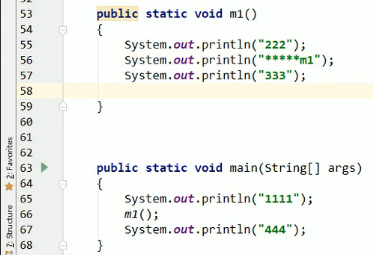
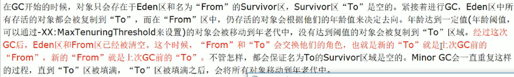

    周阳jvm.md
    
    :Author: kalipy
    :Email: kalipy@debian
    :Date: 2021-07-04 15:39

### jvm架构图(最重要的是heap堆和java stack栈)

tip: 下图灰色部分,内存占用很小，几乎不存在GC垃圾回收,线程私有(橘色部分，所有线程共享)

### 类加载器

注意: 方法区不是放方法的区域，而是放类模板(或者是类的描述信息)的区域

文件特定标识:

#### 类装载器

我们代码中的Object和String等工具类凭什么可以使用，因为jvm早就把其.class文件加载进内存了:

eg1. 如Object是由BootStrap加载器加载的,是由c++代码实现的，所以是null:

    kalipy@debian ~/b/m/zouyan_jvm> more T.java 
    public class T
    {
        public static void main(String args[]) {
            Object object = new Object();
            System.out.println(object.getClass().getClassLoader());
        }
    }
    
    kalipy@debian ~/b/m/zouyan_jvm> java T
    null

eg2. 再如，我们自己编写的T.class,这是由AppClassLoader来加载的:

    kalipy@debian ~/b/m/zouyan_jvm> more T.java
    public class T
    {
        public static void main(String args[]) {
            T object = new T();
            System.out.println(object.getClass().getClassLoader());
        }
    }
    
    kalipy@debian ~/b/m/zouyan_jvm> javac T.java
    kalipy@debian ~/b/m/zouyan_jvm> java T
    sun.misc.Launcher$AppClassLoader@659e0bfd

sun.misc.Launcher的.class文件在这里:

eg3. 再来:

    kalipy@debian ~/b/m/zouyan_jvm> more T.java
    public class T
    {
        public static void main(String args[]) {
            T object = new T();
            System.out.println(object.getClass().getClassLoader().getParent().getParent()
    );
            System.out.println(object.getClass().getClassLoader().getParent());
            System.out.println(object.getClass().getClassLoader());
        }
    }
    
    kalipy@debian ~/b/m/zouyan_jvm> javac T.java
    kalipy@debian ~/b/m/zouyan_jvm> java T
    null
    sun.misc.Launcher$ExtClassLoader@6d06d69c
    sun.misc.Launcher$AppClassLoader@659e0bfd

#### 类装载器2

双亲委派机制: 比如我要用一个xx类，先去根加载器BootstrapClassLoader里找，找得到，你就去用，找不到，你就降一级，去ExtClassLoader里找，以此类推。最后都没找到，就抛异常

为什么要用这个机制?(为了保证我写的代码不污染，恶意攻击java自带的代码)

请看，现在，我恶意写了个烂代码:

    kalipy@debian ~/b/m/zouyan_jvm> more String.java 
    package java.lang;
    
    public class String
    {
        public static void main(String args[]) {
        
        }
    }
    
    kalipy@debian ~/b/m/zouyan_jvm> javac String.java
    kalipy@debian ~/b/m/zouyan_jvm> java String
    错误: 找不到或无法加载主类 String

根据双亲委派机制，String.class文件早已在rt.jar中，被BootstrapClassLoader加载:

### 本地接口

tip: 我们通常说的栈是指:

eg1. java多线程的start()方法只能被调用一次:

    kalipy@debian ~/b/m/zouyan_jvm> more T.java
    public class T
    {
        public static void main(String args[]) {
            Thread t1 = new Thread();
            t1.start();
            t1.start();
        }
    }
    
    kalipy@debian ~/b/m/zouyan_jvm> javac T.java
    kalipy@debian ~/b/m/zouyan_jvm> java T
    Exception in thread "main" java.lang.IllegalThreadStateException
            at java.lang.Thread.start(Thread.java:708)
            at T.main(T.java:6)

为什么?

其实，java的多线程本质是调用的操作系统的线程，start0()这个方法是native层的代码,这里只有声明，没有实现(实现代码在c++层):

由于方法要放进栈里面，所以有了这个本地方法栈:

### PC计数器

### 方法区

### 栈

tip: 栈管运行，堆管内存

什么是方法调用的栈帧?

### 堆 栈 方法区关系

### heap堆结构简介

注意: 

* java8`永久区`换成了`元空间`
* 物理上，堆内存分为新生+养老;逻辑上，分为新生+养老+永久

### heap堆new对象的过程

### 插曲

请先搞懂下面程序:

    kalipy@debian ~/b/m/zouyan_jvm> more T.java
    public class T
    {
        String name;
    
        public void setName(String name) {
            this.name = name;
        }
    
        public String getName() {
            return this.name;
        }
        
        public void f(T t) {
           t.setName("ff"); 
        }
    
        public void S(String str) {
            str = "xxx";
        }
    
        public static void main(String args[]) {
            T t = new T();
            t.setName("gg");
            t.f(t);
            System.out.println(t.getName());
    
            String str1 = "111";
            t.S(str1);
            System.out.println(str1);
            
            String str2 = new String("222");
            t.S(str2);
            System.out.println(str2);
    
        }
    }
    
    kalipy@debian ~/b/m/zouyan_jvm> javac T.java
    kalipy@debian ~/b/m/zouyan_jvm> java T
    ff
    111
    222

解答: java函数参数传递的本质是`值传递`，引用(地址)类型传的也是引用(地址)的copy

### 对象生命周期和GC

接上上节:

### 永久代

### 堆参数调优

eg1. 

    kalipy@debian ~/b/m/zouyan_jvm> more T.java
    public class T
    {
        public static void main(String args[]) {
            long maxMemory = Runtime.getRuntime().maxMemory();
            long totalMemory = Runtime.getRuntime().totalMemory();
            System.out.println("-Xmx:MAX_MEMORY = " + maxMemory + "字节." + (maxMemory / (doub
    le)1024 / 1024) + "MB");
            System.out.println("-Xms:TOTAL_MEMORY = " + totalMemory + "字节." + (totalMemory /
     (double)1024 / 1024) + "MB");
        }
    }
    
    kalipy@debian ~/b/m/zouyan_jvm> javac T.java
    kalipy@debian ~/b/m/zouyan_jvm> java T
    MAX_MEMORY = 900726784字节.859.0MB
    TOTAL_MEMORY = 62390272字节.59.5MB

试着调整参数之后，再次执行`eg1`

java命令行加参数的方法(T必须写在命令最后):

eg2.

    kalipy@debian ~/b/m/zouyan_jvm> java -Xms8m -Xmx8m -XX:+PrintGCDetails T
    MAX_MEMORY = 7864320字节.7.5MB
    TOTAL_MEMORY = 7864320字节.7.5MB
    Heap
     PSYoungGen      total 2048K, used 500K [0x00000000ffd80000, 0x0000000100000000, 0x0000000100000000)
      eden space 1536K, 32% used [0x00000000ffd80000,0x00000000ffdfd248,0x00000000fff00000)
      from space 512K, 0% used [0x00000000fff80000,0x00000000fff80000,0x0000000100000000)
      to   space 512K, 0% used [0x00000000fff00000,0x00000000fff00000,0x00000000fff80000)
     ParOldGen       total 5632K, used 0K [0x00000000ff800000, 0x00000000ffd80000, 0x00000000ffd80000)
      object space 5632K, 0% used [0x00000000ff800000,0x00000000ff800000,0x00000000ffd80000)
     Metaspace       used 2664K, capacity 4486K, committed 4864K, reserved 1056768K
      class space    used 285K, capacity 386K, committed 512K, reserved 1048576K

eg3. Exception in thread "main" java.lang.OutOfMemoryError: Java heap space

    kalipy@debian ~/b/m/zouyan_jvm> more T.java
    public class T
    {
        public static void main(String args[]) {
            byte[] bytes = new byte[40 * 1024 * 1024];
        }
    }
    
    kalipy@debian ~/b/m/zouyan_jvm> javac T.java
    kalipy@debian ~/b/m/zouyan_jvm> java -Xms8m -Xmx8m -XX:+PrintGCDetails T
    [GC (Allocation Failure) [PSYoungGen: 407K->336K(2048K)] 407K->344K(7680K), 0.0020482 secs] [Times: user=0.00 sys=0.00, real=0.00 secs] 
    [GC (Allocation Failure) [PSYoungGen: 336K->288K(2048K)] 344K->296K(7680K), 0.0014024 secs] [Times: user=0.00 sys=0.00, real=0.01 secs] 
    [Full GC (Allocation Failure) [PSYoungGen: 288K->0K(2048K)] [ParOldGen: 8K->268K(5632K)] 296K->268K(7680K), [Metaspace: 2603K->2603K(1056768K)], 0.0150877 secs] [Times: user=0.02 sys=0.00, real=0.01 secs] 
    [GC (Allocation Failure) [PSYoungGen: 0K->0K(2048K)] 268K->268K(7680K), 0.0059401 secs] [Times: user=0.00 sys=0.00, real=0.01 secs] 
    [Full GC (Allocation Failure) [PSYoungGen: 0K->0K(2048K)] [ParOldGen: 268K->256K(5632K)] 268K->256K(7680K), [Metaspace: 2603K->2603K(1056768K)], 0.0175191 secs] [Times: user=0.01 sys=0.00, real=0.01 secs] 
    Exception in thread "main" java.lang.OutOfMemoryError: Java heap space
            at T.main(T.java:4)
    Heap

### GC日志收集

### 引用计数法

eg1.

    kalipy@debian ~/b/m/zouyan_jvm> more T.java
    public class T
    {
        byte[] bytes = new byte[2 * 1024 * 1024];
    
        Object instance = null;
    
        public static void main(String args[]) {
            T o1 = new T();
            T o2 = new T();
            o1.instance = o2;
            o2.instance = o1;
            o1 = null;
            o2 = null;
    
            System.gc();
        }
    }
    
    kalipy@debian ~/b/m/zouyan_jvm> javac T.java
    kalipy@debian ~/b/m/zouyan_jvm> java -XX:+PrintGCDetails T
    [GC (System.gc()) [PSYoungGen: 4730K->384K(18432K)] 4730K->392K(60928K), 0.0011902 secs] [Times: user=0.00 sys=0.00, real=0.01 secs] 
    [Full GC (System.gc()) [PSYoungGen: 384K->0K(18432K)] [ParOldGen: 8K->268K(42496K)] 392K->268K(60928K), [Metaspace: 2604K->2604K(1056768K)], 0.0173969 secs] [Times: user=0.01 sys=0.00, real=0.01 secs]

### 复制算法

原理:

解释:

缺点:

### 标记清除算法

原理:

缺点:

### 标记整理(压缩)算法

面试题:

