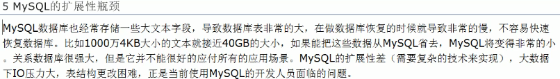
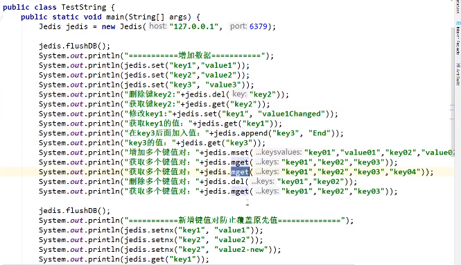

    readme.md
    
    :Author: kalipy
    :Email: kalipy@debian
    :Date: 2021-03-24 08:09

    致谢:感谢周阳和狂神说redis课程

### nosql入门与概述

#### 入门概述

为什么用nosql?

* 单机mysql的美好年代

    

* memcached(缓存)+mysql+垂直拆分

    

* mysql主从读写分离

    

* 分库分表+水平拆分+mysql集群

    

    

* mysql的扩展性瓶颈

    

* 今天是什么样子

    

* 为什么用nosql

    

是什么?

* Nosql(not only sql),不仅仅是sql

* 泛指非关系型数据库

* 为解决大规模数据集存储问题

* 数据存储无需固定的模式，不用多余的操作即可横向扩展

能做什么?

* 易扩展

    * 数据之间无关系

* 大数据量高性能

    * 高读写性能
    * mysql使用query cache,每次表的更新cache就失效，是大粒度的cache
    * nosql是记录级的cache,是细粒度的cache

* 多样灵活的数据类型

    * nosql无需事先为存储的数据建立字段，随时可以存储自定义的数据格式
    * 而在关系型数据库里，增删字段是一件要命的事

* 传统RDBMS vs NoSQL

    

去哪下?

* Redis
* Memcache
* mongdb

怎么玩?

* KV
* Cache
* Persistence
* ..

#### 3V+3高

大数据时代的3V

* 海量Volume
* 多样Variety
* 实时Velocity

互联网需求的3高

* 高并发
* 高性能/高可用
* 高扩展

#### Nosql数据库四大分类

对比

#### 在分布式数据库cap原理cap+base

##### 传统的acid分别是什么

* A(Atomicity)原子性
* C(Consistency)一致性
* I(Isolateion)独立性
* D(Durability)持久性

##### cap

* C:Consistency(强一致性)
* A:Availability(可用性)
* P:Partition tolerance(分区容错性)

##### 经典cap图

##### cap的3进2

* cap理论说在分布式系统里，最多只能实现上面的2点
* 而由于当前网络硬件肯定会出现延迟丢包等问题，**分区容忍性是我们必须实现的**
* 所以我们只能在`一致性`和`可用性`之间进行权衡

CA: 传统Oracle数据库

AP: 大多数网站的架构

CP: Redis Mongodb

**注意:**

分布式架构的时候必须做出取舍

##### base是什么

base是为了解决关系型数据库强一致性引起问题引发的可用性降低而提出来的解决方案

* 基本可用(Basically Availbable)
* 软状态(Soft state)
* 最终一致(Eventually consistent)

它的思想是通过让系统放松对某一时刻数据一致性的要求来换取系统整体伸缩性和性能

##### 分布式+集群简介

分布式

不同的多台服务器上面部署**不同**的服务模块,他们之间通过`rpc/rmi`之间通信和调用，对外提供服务和组内协作

集群

不同的多台服务器上面部署**相同**的服务模块,通过分布式调度软件进行统一的调度，对外提供服务和访问

### redis入门概述

#### 是什么

Redis（Remote Dictionary Server )，即远程字典服务，是一个开源的使用ANSI C语言编写、支持网络、基于**内存**亦可持久化的日志型、Key-Value数据库，并提供多种语言的API。从2010年3月15日起，Redis的开发工作由VMware主持。从2013年5月开始，Redis的开发由Pivotal赞助。

* 支持数据的持久化
* 不仅仅支持key-value类型数据，还支持list set zset hash等数据结构的存储
* 支持`master-slave`模式的数据备份

#### 能做什么

* 内存存储和持久化
* 模拟Session这种需要设置过期时间的功能
* 发布 订阅消息系统
* 定时器 计数器

#### 去哪下

    https://redis.io
    https://www.redis.cn

#### 安装

##### 编译

    make

    make install

    //在gcc10下编译报错,果断换gcc8,编译成功

##### 使用

    kalipy@debian ~/b/j/z/redis-6.0.6> redis-server -h
    Usage: ./redis-server [/path/to/redis.conf] [options]
           ./redis-server - (read config from stdin)
           ./redis-server -v or --version
           ./redis-server -h or --help
           ./redis-server --test-memory <megabytes>
    
    Examples:
           ./redis-server (run the server with default conf)
           ./redis-server /etc/redis/6379.conf
           ./redis-server --port 7777
           ./redis-server --port 7777 --replicaof 127.0.0.1 8888
           ./redis-server /etc/myredis.conf --loglevel verbose
    
    Sentinel mode:
           ./redis-server /etc/sentinel.conf --sentinel

##### hello测试

    kalipy@debian ~/b/j/z/redis-6.0.6> nohup redis-server ./redis.conf &
    kalipy@debian ~/b/j/z/redis-6.0.6> nohup: 忽略输入并把输出追加到'nohup.out'
    
    kalipy@debian ~/b/j/z/redis-6.0.6> ps -aux | grep redis
    kalipy   16241  0.1  2.2 695504 87320 ?        Sl   11:02   0:04 /usr/bin/dolphin --select /home/kalipy/下载/redis-6.0.6.tar.gz
    kalipy   29523  0.3  0.2  52252  8732 pts/4    Sl   11:48   0:00 redis-server 127.0.0.1:6379
    kalipy   29557  0.0  0.0   6296   888 pts/4    S+   11:48   0:00 grep --color=auto redis
    
    kalipy@debian ~/b/j/z/redis-6.0.6> redis-cli -p 6379
    127.0.0.1:6379> ping
    PONG
    127.0.0.1:6379> set k1 val1
    OK
    127.0.0.1:6379> get k1
    "val1"
    127.0.0.1:6379> 

##### 官方的安装教程(readme.md)

**Running Redis**

To run Redis with the default configuration just type:

    % cd src
    % ./redis-server

If you want to provide your redis.conf, you have to run it using an additional
parameter (the path of the configuration file):

    % cd src
    % ./redis-server /path/to/redis.conf

It is possible to alter the Redis configuration by passing parameters directly
as options using the command line. Examples:

    % ./redis-server --port 9999 --replicaof 127.0.0.1 6379
    % ./redis-server /etc/redis/6379.conf --loglevel debug

All the options in redis.conf are also supported as options using the command
line, with exactly the same name.

**Running Redis with TLS:**

Please consult the [TLS.md](TLS.md) file for more information on
how to use Redis with TLS.

**Playing with Redis**

You can use redis-cli to play with Redis. Start a redis-server instance,
then in another terminal try the following:

    % cd src
    % ./redis-cli
    redis> ping
    PONG
    redis> set foo bar
    OK
    redis> get foo
    "bar"
    redis> incr mycounter
    (integer) 1
    redis> incr mycounter
    (integer) 2
    redis>

You can find the list of all the available commands at http://redis.io/commands.

**Installing Redis**

In order to install Redis binaries into /usr/local/bin just use:

    % make install

You can use `make PREFIX=/some/other/directory install` if you wish to use a
different destination.

Make install will just install binaries in your system, but will not configure
init scripts and configuration files in the appropriate place. This is not
needed if you want just to play a bit with Redis, but if you are installing
it the proper way for a production system, we have a script doing this
for Ubuntu and Debian systems:

    % cd utils
    % ./install_server.sh

_Note_: `install_server.sh` will not work on Mac OSX; it is built for Linux only.

The script will ask you a few questions and will setup everything you need
to run Redis properly as a background daemon that will start again on
system reboots.

You'll be able to stop and start Redis using the script named
`/etc/init.d/redis_<portnumber>`, for instance `/etc/init.d/redis_6379`.

### redis杂项知识

### redis常用五大数据类型

* redis键(key)

* redis字符串(String)

    * string类型是二进制安全的,可以是图片或序列化对象
    * 字符串value最多可以是512M

* redis列表(List)
 
    * 它的底层是个链表
    * 可头插，可尾插

* redis集合(Set)
 
    * 通过HashTable实现

* redis哈希(Hash)

    * 类似于java的Map<String, Object>
    * 特别适合存储对象

* redis有序集合Zset(sorted set)

#### 哪里获得redis常见数据类型操作命令

    http://redisdoc.com

### 跟着文档学即可

#### key

    keys *//查看当前库有哪些key

    exists key//的名字，判断某个key是否存在

    move key db//剪切key到其它库(db是库的下标)

    expire key 秒钟//为key设置过期时间

    ttl key//查看还有多少秒过期时间,-1表示永不过期，-2表示已过期(过期后直接生命周期终结)

    type key//查看key的数据类型

#### String

    set/get/del/append/strlen

    incr/decr/incrby/decrby//一定要是数字才能进行加减

    getrange/setrange

    setex(set with expire)键秒值/setnx(set if not exist)

    mset/mget/msetnx

    getset(先get再set)

#### List

    lpush/rpush/lrange

    lpop/rpop

    lindex//按照索引下标获得元素(从上到下)

    llen

    lrem key//删n个value

    ltrim key 开始index 结束index//截取指定范围的值后再赋值给key

    rpoplpush 源列表 目的列表

    lset key index value

    linsert key before/after 值1 值2

#### Set

    sadd/smembers/sismember

    scard//获取集合里面的元素个数

    srem key value//删除集合中元素

    srandmember key//某个整数(随机出几个数)

    spop key//随机出栈

    smove key1 key2

    sdiff//差集

    sinter//交集

    sunion//并集

#### Hash

KV模式不变，但V是一个键值对

    hset/hget/hmget/hgetall/hdel

    hlen

    hexists key

    hkeys/hvals

    hincrby/hincrbyfloat

    hsetnx

#### Zset(sorted set)

在set基础上，加了一个`score`值,之前`set`是`k1 v1 v2 v3`,现在`zset`是`k1 score1 v1 score2 v2`

### redis配置文件

#### 网络

    bind 127.0.0.1  # 绑定的ip
    protected-mode yes  # 保护模式
    port 6379 # 端口设置

#### 通用GENERAL

    daemonize yes   # 以守护进程的方式运行，默认是no
    pidfile /var/run/redis_6379.pid # 如果以后台方式运行，需要指定一个pid文件

    # 日志
    loglevel notice
    logfile ""  # 日志文件的位置
    databases 16    # 数据库的数量，默认是16个数据库
    always-show-logo yes    # 是否总是显示logo

#### 快照

持久化，在规定的时间内，执行了多少次操作，则会持久化到文件.rdb.aof

redis是内存数据库，如果没有持久化，那么断电数据会丢失

    # 如果900s内，如果至少有一个key进行了修改，数据就被会持久化
    save 900 1
    # 如果300s内，如果至少有10个key进行了修改，数据就被会持久化
    save 300 10
    # 如果60s内，如果至少有10000个key进行了修改，数据就被会持久化
    save 60 10000

    stop-writes-on-bgsave-error yes #持久化如果出错，是否还需继续工作

    rdbcompression yes # 是否压缩rdb文件

    rdbchecksum yes # 保存rdb文件的时候，进行错误的检测校验

    dir ./ # rdb文件保存的目录

#### SECURITY安全

可以在这里设置redis的密码，默认无密码

#### 限制CLIENTS

    maxclients 10000 # 设置可以连上redis的最大客户端数量
    maxmemory <bytes> # redis配置最大内存容量
    maxmemory-policy noeviction # 内存到达上限后的处理策略

    volatile-lru: 只对设置了过期时间的key进行LRU(默认值)
    allkeys-lru: 删除lru算法的key
    volatile-random: 随机删除即将过去的key
    allkeys-random: 随机删除
    volatile-ttl: 删除即将过期的
    noeviction: 永不过期,返回错误

#### APPEND ONLY模式 aof配置

    appendonly no # 默认是不开启aof模式的，默认使用rdb方式持久化，在大部分所有的情况下,rdb完全够用

    # appendfsync always # 每次修改都会sync
    appendfsync everysec # 每秒执行一次sync,可能会丢失这1s的数据
    #appendfsync no # 不执行sync,这个时候os自己同步数据，速度最快

### 事务

redis事务的本质:一组命令的集合,一个事务中的所有命令都会被序列化，在事务执行过程中，会按照顺序一次性 顺序性 排他性 执行这些命令

    队列 set1 set2 set3 执行

**redis事务没有隔离级别的概念**

所有的命令在事务中并没有直接被执行，只有发起执行`exec`命令的时候才会被执行

**redis单条命令是保证原子性的,但是事务不保证原子性**

redis的事务:

    * 开启事务(multi)
    * 命令入队
    * 执行事务(exec)

#### 正常执行事务

##### 执行(exec)事务test

    kalipy@debian ~/b/j/z/redis-6.0.6> redis-cli -p 6379
    127.0.0.1:6379> multi
    OK
    127.0.0.1:6379> set k1 v1
    QUEUED
    127.0.0.1:6379> set k2 v2
    QUEUED
    127.0.0.1:6379> set k3 v3
    QUEUED
    127.0.0.1:6379> EXEC
    1) OK
    2) OK
    3) OK

##### 放弃(discard)事务test

    127.0.0.1:6379> MULTI
    OK
    127.0.0.1:6379> set k4 v4
    QUEUED
    127.0.0.1:6379> DISCARD
    OK
    127.0.0.1:6379> get k4
    (nil)

#### 异常执行事务

##### 编译型异常(代码语法错误)

事务里的所有命令都不会被执行

    127.0.0.1:6379> multi
    OK
    127.0.0.1:6379> set k1 v1
    QUEUED
    127.0.0.1:6379> set k2 v2
    QUEUED
    127.0.0.1:6379> fdsafd k3
    (error) ERR unknown command `fdsafd`, with args beginning with: `k3`, 
    127.0.0.1:6379> set k4 v4
    QUEUED
    127.0.0.1:6379> exec
    (error) EXECABORT Transaction discarded because of previous errors.
    127.0.0.1:6379> get k1
    (nil)

##### 运行时异常(逻辑错误)

错误命令执行失败，其它命令正常执行

    127.0.0.1:6379> set k1 "v1"
    OK
    127.0.0.1:6379> MULTI
    OK
    127.0.0.1:6379> incr k1
    QUEUED
    127.0.0.1:6379> set k2 v2
    QUEUED
    127.0.0.1:6379> get k2
    QUEUED
    127.0.0.1:6379> exec
    1) (error) ERR value is not an integer or out of range
    2) OK
    3) "v2"

### redis实现乐观锁(暂)

悲观锁:

* 很悲观，认为什么时候都会出问题，无论做什么都会加锁

乐观锁：

* 认为什么时候都不会出问题，所以不加锁，更新数据的时候判断一下，在此期间是否有人修改过这个数据
* 获取version
* 更新的时候比较version

### 通过Jedis操作redis

#### 什么是Jedis?

是Redis官方推荐的java连接开发工具

#### Jedis测试

创建hello工程

    kalipy@debian ~/b/j/z/jedis_demo> gradle init
    
    Select type of project to generate:
      1: basic
      2: application
      3: library
      4: Gradle plugin
    Enter selection (default: basic) [1..4] 2
    
    Select implementation language:
      1: C++
      2: Groovy
      3: Java
      4: Kotlin
      5: Swift
    Enter selection (default: Java) [1..5] 3
    
    Select build script DSL:
      1: Groovy
      2: Kotlin
    Enter selection (default: Groovy) [1..2] 1
    
    Select test framework:
      1: JUnit 4
      2: TestNG
      3: Spock
      4: JUnit Jupiter
    Enter selection (default: JUnit 4) [1..4] 1
    
    Project name (default: jedis_demo): 
    Source package (default: jedis_demo): com.ly

导包

    implementation 'redis.clients:jedis:3.2.0'
    implementation 'com.alibaba:fastjson:1.2.62'//不建议用fastjson,有严重安全漏洞

Test

    kalipy@debian ~/b/j/z/jedis_demo> more src/test/java/com/ly/AppTest.java
    /*
     * This Java source file was generated by the Gradle 'init' task.
     */
    package com.ly;
    
    import org.junit.Test;
    
    import redis.clients.jedis.Jedis;
    
    import static org.junit.Assert.*;
    
    public class AppTest {
        @Test public void TestPing() {
            Jedis jedis = new Jedis("127.0.0.1", 6379);
    
            System.out.println(jedis.ping());
        }
    }

单元测试的结果:

#### 常用api

Key

String

List

...

### 通过Jedis再次理解事务

正常事务测试

    kalipy@debian ~/b/j/z/jedis_demo> more src/test/java/com/ly/AppTest.java
    /*
     * This Java source file was generated by the Gradle 'init' task.
     */
    package com.ly;
    
    import com.alibaba.fastjson.JSONObject;
    
    import org.junit.Test;
    
    import redis.clients.jedis.Jedis;
    import redis.clients.jedis.Transaction;
    
    import static org.junit.Assert.*;
    
    public class AppTest {
        @Test public void TestPing() {
            Jedis jedis = new Jedis("127.0.0.1", 6379);
    
            jedis.flushDB();//清空数据
    
            JSONObject jsonObject = new JSONObject();
            jsonObject.put("hello", "world");
            jsonObject.put("name", "hanser");
    
            //开启事务
            Transaction multi = jedis.multi();
            String result = jsonObject.toJSONString();
    
            try {
                multi.set("user1", result);
                multi.set("user2", result);
    
                multi.exec();//执行事务
            } catch (Exception e) {
                multi.discard();//放弃事务
                e.printStackTrace();
            } finally {
                System.out.println(jedis.get("user1"));
                System.out.println(jedis.get("user2"));
                jedis.close();//关闭连接
            }
        }
    }

正常测试结果:

    Tests
    
      Test   Duration Result
    TestPing 0.525s   passed
    
    Standard output
    
    {"name":"hanser","hello":"world"}
    {"name":"hanser","hello":"world"}
    
    Wrap lines [ ]
    Generated by Gradle 6.5 at 2021-3-24 15:25:20

运行时异常事务测试

    /*
     * This Java source file was generated by the Gradle 'init' task.
     */
    package com.ly;
    
    import com.alibaba.fastjson.JSONObject;
    
    import org.junit.Test;
    
    import redis.clients.jedis.Jedis;
    import redis.clients.jedis.Transaction;
    
    import static org.junit.Assert.*;
    
    public class AppTest {
        @Test public void TestPing() {
            Jedis jedis = new Jedis("127.0.0.1", 6379);
    
            jedis.flushDB();//清空数据
    
            JSONObject jsonObject = new JSONObject();
            jsonObject.put("hello", "world");
            jsonObject.put("name", "hanser");
    
            //开启事务
            Transaction multi = jedis.multi();
            String result = jsonObject.toJSONString();
    
            try {
                multi.set("user1", result);
                multi.set("user2", result);
                int i = 1/0;//代码运行时异常，事务执行失败
    
                multi.exec();//执行事务
            } catch (Exception e) {
                multi.discard();//放弃事务
                e.printStackTrace();
            } finally {
                System.out.println(jedis.get("user1"));
                System.out.println(jedis.get("user2"));
                jedis.close();//关闭连接
            }
        }
    }

测试结果:

    Tests
    
      Test   Duration Result
    TestPing 0.169s   passed
    
    Standard output
    
    null
    null
    
    Standard error
    
    java.lang.ArithmeticException: / by zero
        at com.ly.AppTest.TestPing(AppTest.java:32)

### springboot整合redis

springboot操作数据: spring-data

**注意:**

在springboot2.x之后，原来的jedis被替换成了lettuce

jedis: 采用直连的方式,多个线程操作，是不安全的，如果想要避免不安全，使用jedis pool连接池 BIO

lettuce: 采用netty,实例可以在多个线程中进行共享，不存在线程不安全的情况

    kalipy@debian ~/b/j/z/springboot_redis_demo> gradle dependencies | grep lettuce
    |    \--- io.lettuce:lettuce-core:6.0.3.RELEASE
    |    \--- io.lettuce:lettuce-core:6.0.3.RELEASE
    |    \--- io.lettuce:lettuce-core:6.0.3.RELEASE
    |    \--- io.lettuce:lettuce-core:6.0.3.RELEASE
    |    \--- io.lettuce:lettuce-core:6.0.3.RELEASE

#### 新建springboot项目

依赖如下:

    plugins {
      id 'org.springframework.boot' version '2.4.4'
      id 'io.spring.dependency-management' version '1.0.11.RELEASE'
      id 'java'
    }
    group = 'com.example'
    version = '0.0.1-SNAPSHOT'
    sourceCompatibility = '1.8'
    
    repositories {
        maven { url 'https://maven.aliyun.com/repository/public' }
        maven { url 'https://maven.aliyun.com/repository/central'}
        maven { url 'https://maven.aliyun.com/repository/google'}
        maven { url 'https://maven.aliyun.com/repository/gradle-plugin'}
        maven { url 'https://maven.aliyun.com/repository/spring'}
        maven { url 'https://maven.aliyun.com/repository/spring-plugin'}
        maven { url 'https://maven.aliyun.com/repository/apache-snapshots'}

        mavenLocal()
        mavenCentral()
    }

    dependencies {
      implementation 'org.springframework.boot:spring-boot-starter-data-redis'
      implementation 'org.springframework.boot:spring-boot-starter-web'
      testImplementation 'org.springframework.boot:spring-boot-starter-test'
    }
    test {
      useJUnitPlatform()
    }

源码浅析:

#### 单元测试

编写redis配置文件

    more src/main/resources/application.properties 
    # springboot所有的配置类，都有一个自动配置类 RedisAutoConfiguration类
    # 自动配置类都会绑定一个properties配置文件 RedisProperties类
    
    spring.redis.host=127.0.0.1
    
    spring.redis.port=6379

编写单元测试

    more src/test/java/com/example/demo/DemoApplicationTests.java
    package com.example.demo;
    
    import org.junit.jupiter.api.Test;
    
    import org.springframework.beans.factory.annotation.Autowired;
    
    import org.springframework.boot.test.context.SpringBootTest;
    
    import org.springframework.data.redis.connection.RedisConnection;
    import org.springframework.data.redis.core.RedisTemplate;
    
    @SpringBootTest
    class DemoApplicationTests {
    
        @Autowired
        private RedisTemplate redisTemplate;
    
            @Test
            void contextLoads() {
            //redisTemplate 操作不同的数据类型，api和redis命令是一样的
            //opsForValue   操作字符串 类似String
            //opsForList
            //opsForSet
            //opsForHash
            //opsForZSet
            //opsForGeo
            //opsForHyperLog
            
            //获取redis连接对象
                //RedisConnection connection = redisTemplate.getConnectionFactory().getCo
    nnection();
            //connection.flushDb();
            
            redisTemplate.opsForValue().set("mykey", "yousa");
            System.out.println(redisTemplate.opsForValue().get("mykey"));
    
        }
    
    }

测试结果:

    yousa
    
    Wrap lines [ ]
    Generated by Gradle 6.5 at 2021-3-24 16:09:29

### 自定义RedisTemplate

#### 对象没有序列化导致对象不能存储的问题

##### User未实现序列化接口时

编写pojo:

    more src/main/java/com/example/demo/pojo/User.java 
    package com.example.demo.pojo;
    
    /*
     * User.java
     * Copyright (C) 2021 2021-03-27 12:10 kalipy <kalipy@debian>
     *
     * Distributed under terms of the MIT license.
     */
    
    public class User
    {
        private String name;
        private int age;
    
        public User() {
        }
    
        public User(String name, int age) {
            this.name = name;
            this.age = age;
        }
    
        public String getName() {
            return name;
        }
    
        public void setName(String name) {
            this.name = name;
        }
    
        public int getAge() {
            return age;
        }
    
        public void setAge(int age) {
            this.age = age;
        }
    
        @Override
        public String toString() {
            return "User{" +
                "name = " + getName() +
                ", age = " + getAge() +
                "}";
        }
    }

编写单元测试代码(当pojo中User没有实现序列化时):

    more src/test/java/com/example/demo/DemoApplicationTests.java 
    
    package com.example.demo;
    import com.fasterxml.jackson.core.JsonProcessingException;
    import com.fasterxml.jackson.databind.ObjectMapper;
    import org.junit.jupiter.api.Test;
    import org.springframework.beans.factory.annotation.Autowired;
    import org.springframework.boot.test.context.SpringBootTest;
    import org.springframework.data.redis.connection.RedisConnection;
    import org.springframework.data.redis.core.RedisTemplate;
    import com.example.demo.pojo.User;
    
    @SpringBootTest
    class DemoApplicationTests {
    
        @Autowired
        private RedisTemplate redisTemplate;
    
            @Test
            void test() throws JsonProcessingException {
            //真实的开发一般都使用json来传递对象
            User user = new User("hanser", 17);
            //String jsonUser =  new ObjectMapper().writeValueAsString(user);
            redisTemplate.opsForValue().set("user", user);
            System.out.println(redisTemplate.opsForValue().get("user"));
    
        }
    
    }

单元测试结果:

    Failed tests
    
    contextLoads()
    
    org.springframework.data.redis.serializer.SerializationException: Cannot serialize;

##### 现在User实现序列化接口后

    //在企业中，我们所有的pojo都会序列化
    public class User implements Serializable

单元测试结果:

    User{name = hanser, age = 17}
    
    Wrap lines [ ]
    Generated by Gradle 6.5 at 2021-3-27 12:28:13

redis中的结果:

    kalipy@debian ~/b/j/z/springboot_redis_demo> redis-cli -p 6379
    127.0.0.1:6379> keys *
    1) "\xac\xed\x00\x05t\x00\x04user"

##### 自定义redisTemplate序列化

上面我们使用的是jdk自带的序列化，现在我们不用jdk的，用自定义redisTemplate的

    more src/main/java/com/example/demo/config/RedisConfig.java
    package com.example.demo.config;
    
    import com.fasterxml.jackson.annotation.JsonAutoDetect;
    import com.fasterxml.jackson.annotation.PropertyAccessor;
    
    import com.fasterxml.jackson.databind.ObjectMapper;
    
    import java.net.UnknownHostException;
    
    import org.springframework.context.annotation.Bean;
    import org.springframework.context.annotation.Configuration;
    
    import org.springframework.data.redis.connection.RedisConnectionFactory;
    import org.springframework.data.redis.core.RedisTemplate;
    import org.springframework.data.redis.serializer.Jackson2JsonRedisSerializer;
    import org.springframework.data.redis.serializer.StringRedisSerializer;
    
    /*
     * RedisConfig.java
     * Copyright (C) 2021 2021-03-27 12:37 kalipy <kalipy@debian>
     *
     * Distributed under terms of the MIT license.
     */
    @Configuration
    public class RedisConfig
    {
        //编写我们自己的redisTemplate,这是一个固定的模板
        @Bean
        @SuppressWarnings("all")
        public RedisTemplate<String, Object> redisTemplate(RedisConnectionFactory factory
    ) {
            //一般用<String, Object>
            RedisTemplate<String, Object> template = new RedisTemplate<String, Object>();
            template.setConnectionFactory(factory);
            
            //配置具体的序列化方式
    
            Jackson2JsonRedisSerializer jackson2JsonRedisSerializer = new Jackson2JsonRed
    isSerializer(Object.class);
            ObjectMapper om = new ObjectMapper();
            om.setVisibility(PropertyAccessor.ALL, JsonAutoDetect.Visibility.ANY);
            om.enableDefaultTyping(ObjectMapper.DefaultTyping.NON_FINAL);
            jackson2JsonRedisSerializer.setObjectMapper(om);
            //String的序列化
            StringRedisSerializer stringRedisSerializer = new StringRedisSerializer();
    
            //key采用String的序列化方式
            template.setKeySerializer(stringRedisSerializer);
            //hash的key也采用String的序列化方式
            template.setHashKeySerializer(stringRedisSerializer);
            //value序列化方式采用jackson
            template.setValueSerializer(jackson2JsonRedisSerializer);
            //hash的value序列化方式用jackson
            template.setHashValueSerializer(jackson2JsonRedisSerializer);
            template.afterPropertiesSet(); 
    
            return template;
        }
    }

加上`@Qualifier`防止我们自定义的RedisTemplate和Redis内部的RdisTemplate二义性冲突:

    @Autowired
        @Qualifier("redisTemplate")
        private RedisTemplate redisTemplate;

测试结果:

    User{name = hanser, age = 17}
    
    Wrap lines [ ]
    Generated by Gradle 6.5 at 2021-3-27 13:17:09
    
    kalipy@debian ~/b/j/z/springboot_redis_demo> redis-cli -p 6379
    127.0.0.1:6379> keys *
    1) "user"

可以看到，序列化也成功了，而且没有乱码了

### 持久化之RDB

**面试和工作，持久化是重点**

redis是内存数据库，所以需要持久化功能

#### RDB(Redis DataBase)

什么是RDB?

在指定的时间间隔内将内存中的数据快照写入磁盘，它恢复时直接将快照文件读到内存

Redis会单独fork一个紫禁城来进行持久化，会先将数据写入到一个临时文件里，待持久化结束后，再用这个临时文件替换掉上次持久化好的文件。整个过程里，主进程不进行任何IO操作，这确保了极高的性能。如果需要进行大规模数据的恢复，且对应数据恢复的完整性要求不高，那RDB方式要比AOF方式更加高效，RDB的缺点是最后一次持久化后的数据可能会丢失.我们默认的就是RDB，一般情况下不需要修改这个配置

rdb默认保存的文件是`dump.rdb`
    
    kalipy@debian ~/b/j/z/redis-6.0.6> vim redis.conf
    # The filename where to dump the DB
    dbfilename dump.rdb

触发条件

* save的规则满足,会生成dump.rdb文件
* 执行flushall命令，会生成dump.rdb文件
* 退出redis,会生成dump.rdb文件

备份就是生成dump.rdb文件

##### 如何恢复rdb文件

将rdb文件放到redis启动的目录下，redis启动的时候会自动把dump.rdb中的数据恢复到内存

要把redis的rdb文件放在哪里?请看:

    kalipy@debian ~/b/j/z/redis-6.0.6> redis-cli -p 6379
    127.0.0.1:6379> CONFIG GET dir
    1) "dir"
    2) "/home/kalipy/bak2/j2ee_study/zouyan_redis/redis-6.0.6"

##### 优缺点

优点:

* 适合大规模的数据恢复
* 对数据的完整性要求不高

缺点:

* 需要一定的时间间隔来生成dump.rdb文件,如果redis意外宕机了，最后一次持久化后的写数据就会丢失
* fork紫禁城的时候，会占用一定的内存空间

### 持久化之AOF(Append Only File)

将我们的所有命令都记录下来，history,恢复的时候就把这个文件全部在执行一遍

#### 是什么?

以日志的形式记录每个写操作，将redis执行过的所有命令记录下来(读操作不记录)，只许追加文件但不可以修改文件，redis启动时会读取该文件重新构建数据，话句话说，redis重启时会根据日志文件的内容将写命令从前到后执行一次来完成数据的恢复

`AOF保存数据为appendonly.aof文件`

默认在配置文件中的设置是不开启的，将`appendonly`改为`yes`即可开启

重启,redis就可以生效了

如果这个aof文件被外界修改，这时候rdis将启动失败，我们需要修复这个aof文件

redis给我们提供的修复工具是`redis-check-aof --fix`

#### 优缺点

    appendonly no #默认是不开启aof模式的
    appendfilename "appendonly.aof" # 持久化的文件名

    # appendfsync always # 每次修改都会sync，消耗性能
    appendfsync everysec # 每秒执行一次sync,可能会丢失这一秒的数据
    #appendfsync no # 不执行sync, 这个时候由操作系统自动同步数据，速度最快

优点：

* 每次修改都会同步，文件的完整性更好
* 每秒同步一次，可能丢失一秒的数据
* 从不同步，效率最高

缺点:

* 相对于数据文件来说，aof远远大于rdb文件，修复速度也比rdb慢
* aof运算效率比rdb慢

### Redis发布订阅

Redis发布订阅(pub/sub)是一种消息通信模式，发送者(pub)发送消息，订阅者(sub)接收消息。

#### 命令

#### 测试

先订阅再发布

#### 原理

### Redis集群环境搭建

#### Redis主从复制

概念:

将一台Redis服务器的数据，复制到其它Redis服务器，数据复制是单向的，只能由主节点到从节点,Master以写为主，slave以读为主

默认情况下，每台redis服务器都是主节点，且一个主节点可以有多个从节点，但是一个从节点只能有一个主节点

主从复制的作用:

* 数据冗余: 主从复制实现了数据的热备份，是持久化之外的一种数据备份方式
* 故障恢复: 当主节点出现问题时，可以由从节点提供服务，实现快速恢复故障
* 负载均衡: 在主从复制的基础上，配合读写分离，可以由主节点提供写服务，由从节点提供读服务，分担服务器负载，尤其是在写少读多的场景下，可以大大提高并发
* 高可用: 主从复制还是哨兵和集群的基础

一般来说，在工程项目中，只使用一台redis是万万不能的

电商网站上的商品，一般都是一次上传，无数次浏览，即`读多写少`

#### 环境配置

只配置从库，不用配置主库

默认情况下，都是主机

    kalipy@debian ~/b/j/z/redis-6.0.6> redis-cli -p 6379
    127.0.0.1:6379> info replication
    # Replication
    role:master
    connected_slaves:0

复制三个配置文件，然后修改相应信息

配置文件里需要修改`logfile`和`port`和`fidfile`和`dbfilename`,不然各个redis会产生冲突

    kalipy@debian ~/b/j/z/redis-6.0.6> nohup redis-server ./redis6379.conf  &
    nohup: 忽略输入并把输出追加到'nohup.out'
    kalipy@debian ~/b/j/z/redis-6.0.6> nohup redis-server ./redis6380.conf  &
    nohup: 忽略输入并把输出追加到'nohup.out'
    kalipy@debian ~/b/j/z/redis-6.0.6> nohup redis-server ./redis6381.conf  &
    nohup: 忽略输入并把输出追加到'nohup.out'
    kalipy@debian ~/b/j/z/redis-6.0.6> ps -aux | grep redis
    kalipy   22022  0.2  0.1  52252  5128 pts/4    Sl   18:34   0:00 redis-server 127.0.0.1:6379
    kalipy   22042  0.2  0.1  52252  5164 pts/4    Sl   18:34   0:00 redis-server 127.0.0.1:6380
    kalipy   22069  0.2  0.1  52252  5004 pts/4    Sl   18:34   0:00 redis-server 127.0.0.1:6381

#### 一主二从

默认情况下，每台Redis服务器都是主节点，我们一般情况下只用配置从机即可

这里配置6379为主机，配置6380和6381为从机来演示

kalipy@debian ~/b/j/zouyan_redis> redis-cli -p 6380

    127.0.0.1:6380> SLAVEOF 127.0.0.1 6379
    OK
    127.0.0.1:6380> info replication
    # Replication
    role:slave
    master_host:127.0.0.1
    master_port:6379
    master_link_status:up
    master_last_io_seconds_ago:2
    master_sync_in_progress:0
    slave_repl_offset:14
    slave_priority:100
    slave_read_only:1
    connected_slaves:0
    master_replid:3e8d68d2234c910ccad48f9ead2646c94b9e7ea1
    master_replid2:0000000000000000000000000000000000000000
    master_repl_offset:14
    second_repl_offset:-1
    repl_backlog_active:1
    repl_backlog_size:1048576
    repl_backlog_first_byte_offset:1
    repl_backlog_histlen:14

kalipy@debian ~/b/j/zouyan_redis> redis-cli -p 6381

    127.0.0.1:6381> SLAVEOF 127.0.0.1 6379
    OK
    127.0.0.1:6381> info replication
    # Replication
    role:slave
    master_host:127.0.0.1
    master_port:6379

**上面是使用命令来配置的，服务器重启配置就失效了，我们应该在配置文件中配置**

#### 配置文件中配置

    ################################# REPLICATION #################################
    
    # Master-Replica replication. Use replicaof to make a Redis instance a copy of
    # another Redis server. A few things to understand ASAP about Redis replication.
    #
    #   +------------------+      +---------------+
    #   |      Master      | ---> |    Replica    |
    #   | (receive writes) |      |  (exact copy) |
    #   +------------------+      +---------------+
    #
    # 1) Redis replication is asynchronous, but you can configure a master to
    #    stop accepting writes if it appears to be not connected with at least
    #    a given number of replicas.
    # 2) Redis replicas are able to perform a partial resynchronization with the
    #    master if the replication link is lost for a relatively small amount of
    #    time. You may want to configure the replication backlog size (see the next
    #    sections of this file) with a sensible value depending on your needs.
    # 3) Replication is automatic and does not need user intervention. After a
    #    network partition replicas automatically try to reconnect to masters
    #    and resynchronize with them.
    #
    # replicaof <masterip> <masterport>
    
    # If the master is password protected (using the "requirepass" configuration
    # directive below) it is possible to tell the replica to authenticate before
    # starting the replication synchronization process, otherwise the master will
    # refuse the replica request.
    #
    # masterauth <master-password>

#### 细节

* 主机可以设置值，从机不可以写只能读,主机里所有的信息和数据，都会自动被同步到从机

主机写:

    kalipy@debian ~/b/j/zouyan_redis> redis-cli -p 6379
    127.0.0.1:6379> keys *
    (empty array)
    127.0.0.1:6379> set k1 v1
    OK

从机只能读数据:

    kalipy@debian ~/b/j/zouyan_redis> redis-cli -p 6380
    127.0.0.1:6380> keys *
    1) "k1"
    127.0.0.1:6380> get k1
    "v1"
    127.0.0.1:6380> set k2 v2
    (error) READONLY You can't write against a read only replica.

#### 测试

主机被kill了，从机依然连接到主机，但是没有进行写操作，这个时候，主机如果回来了，从机依然可以直接获取到主机写入的数据

如果是使用命令行来配置的主机和从机，在主机被kill后，这个时候如果有从机重启了，那么该从机就会变成主机

#### 复制原理

#### 方式二(谋权篡位)

可以手动配置

如果主机死了，我们可以手动连进从机后使用`slaveof no one`，让该从机变成主机,如果这时前面死了的主机又回来了，那就重新连接(由于被篡位而变为从机)

### 哨兵模式(自动选举master)

**刚才讲到的两种模式在工作中都不会使用,在工作中，我们使用哨兵模式**

#### 概述

#### 哨兵的作用

* 通过发送命令，让Redis服务器返回监控其运行状态，包括主服务器和从服务器
* 当哨兵监控下的master宕机了，会自动将slave切换为master,然后通过发布订阅模式通知其它的服务器，修改配置文件，让它们切换主机

然而一个哨兵进程对Redis服务器进行监控，也可能哨兵挂掉,所以又有下面的多哨兵模式

假设master宕机了，哨兵1先检测到这个结果，系统并不会马上进行failover过程，仅仅是哨兵1认为master不可用，这个现象称为`主观下线`，当后面的哨兵也检测到master不可用，并且数量达到一定值时，那么哨兵之间就会进行一次投票，投票的结果由一个哨兵发起，进行failover(故障转移)操作。切换成功后，就会通过发布订阅模式，让各个哨兵把自己监控的相应的slave切换为master，这个过程称为`客观下线`

#### 测试

配置哨兵配置文件`sentinel.conf`

    # sentinel monitor 任意名称 host port number
    sentinel momitor xxx 127.0.0.1 6379 1 # number是哨兵投票数至少满足几时开始选举master

启动哨兵

    kalipy@debian ~/b/j/z/redis-6.0.6> nohup redis-sentinel ./sentinel.conf &

kill掉master

等几秒后，发现有个slave在哨兵的监控下自动变成了master

然后如果刚刚被kill掉的master又活过来了，那么它回来后就会自动变为slave

#### 优缺点

### Redis缓存穿透和雪崩(面试高频 工作常用)

Redis缓存的使用，极大的提升了应用程序的性能和效率，特别是数据查询方面。但同时，他也带来了一些问题。其中，最要害的是数据的一致性问题，从严格意义来讲，这个问题无解。如果对数据的一致性要求很高，那么就不能使用缓存

另外的一些经典问题就是缓存穿透和缓存雪崩

#### 缓存穿透(查不到)

##### 概念

用户想要查询一个数据，发现redis内存数据库中没有，也就是缓存没命中，于是向持久层数据库查询。发现也没有该数据，于是本次查询失败。当用户很多时，缓存都没命中，于是都去请求持久层数据库，这就是缓存穿透

##### 解决方案

布隆过滤器

布隆过滤器是一种数据结构，对所有可能查询的参数以hash形式存储，在控制层先进行校验，不符合规则则丢弃，从而避免了对持久层数据库的查询压力

缓存空对象

当存储不命中后，即使返回空对象也将其缓存起来，同时设置一个过期时间，之后再访问这个数据将会从缓存里获取，保护持久层数据库

缓存空对象的缺点

* 浪费空间
* 即使对空值设置了过期时间，缓存数据和持久层数据会产生不一致的问题

#### 缓存击穿(量太大 缓存过期)

##### 概念

与缓存穿透的区别，缓存击穿，是指一个key非常热点，在不停的扛着大并发，大并发集中对这一个点进行访问，当这个key在失效的瞬间，持续的大并发就击穿缓存，直接请求持久层数据库

##### 解决方案

**设置热点数据永不过期**

从缓存层来看，没有设置过期时间，所以不会出现热点key过期瞬间产生的问题

**加互斥锁**

分布式锁: 使用分布式锁，保证对于每个key同时只有一个线程去查询后端服务，其它线程没有获得分布式锁的权限，因此只需要等待即可。

#### 缓存雪崩

##### 概念

指在某个时间段，缓存集中过期失效。或者服务器宕机

比如:马上就要到双十一零点，很快就会有一波抢购，这波商品的数据比较集中的放入了缓存，假设缓存一个小时。那么到了凌晨1点时，这批商品数据的缓存就都过期了。而对这批商品的访问查询，就都落到持久层数据库上。

##### 解决方案

* 停掉一些服务，给其它服务让路

* redis高可用,redis集群(异地多活)

* 限流降级(springcloud): 在缓存失效后，通过加锁或者队列来控制读数据库写缓存的线程数。比如对某个key只允许一个线程查询数据和写缓存，其它线程等待

* 数据预热: 在正式部署之前，把可能的数据预先访问一遍，这样部分可能大量访问的数据就会加载到缓存中。在即将发生大并发访问前手动触发加载缓存不同的key,设置不同的过期时间，让缓存失效的时间尽量均衡

