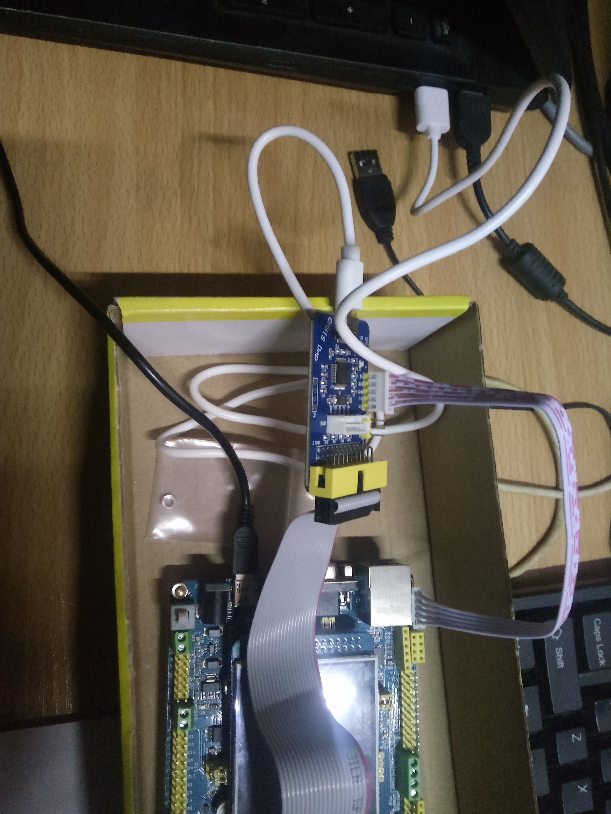
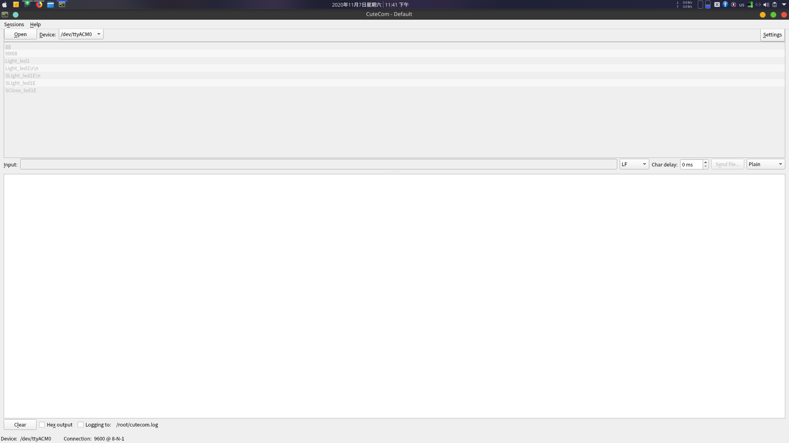
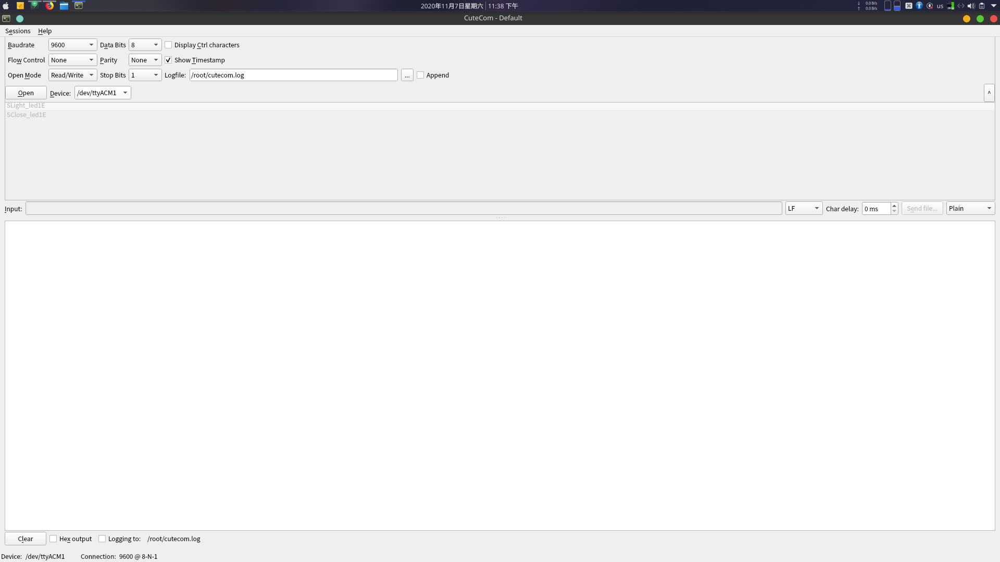
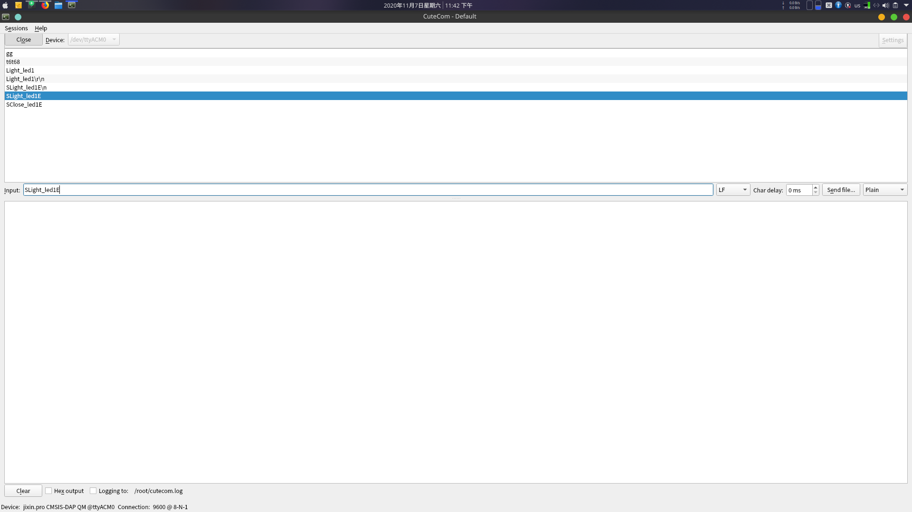
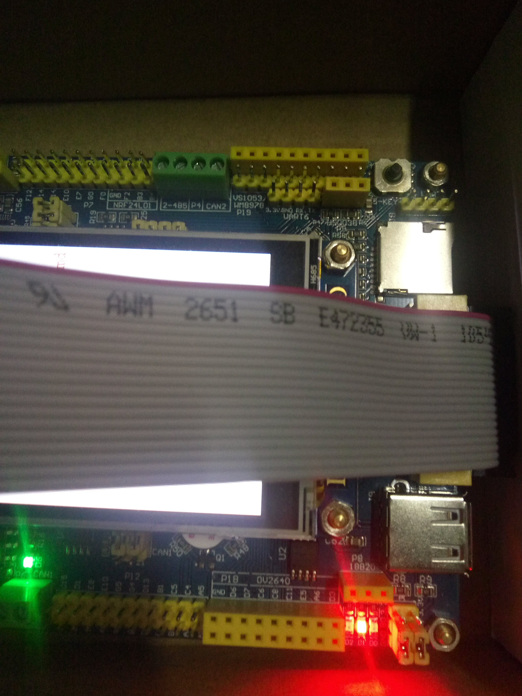

1. 安装:  
`sudo apt-get install cutecom`

2. 开发板连上电脑：

3. 打开cutecom:  
`sudo cutecom`

4. 点击setting,配置串口通信的参数(device一般就是它自动识别的,实在不行ls /dev/tty*,一般名字为ttyACMx)：

5. 点击open按钮：
串口连接成功：

6. 在input框输入要发送的内容，回车

7. 比如我这里发送数据`Slight_ledE`,灯亮：

