    qemu_uboot_linux_nfs嵌入式开发环境搭建.md
    
    :Author: kalipy
    :Email: kalipy@debian
    :Date: 2021-06-08 14:01

### 为什么用qemu学习嵌入式

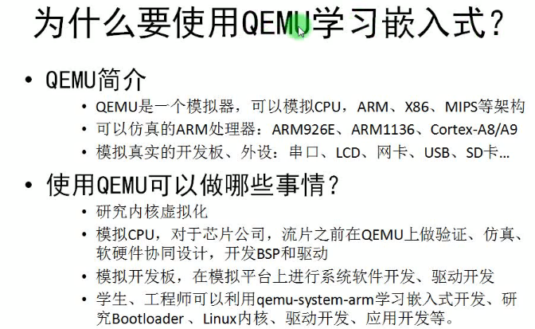

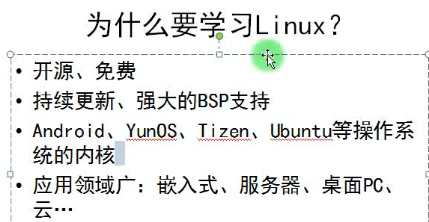

#### 什么是BSP

##### 说人话

Board Support Package顾名思义，就是板级支持包，说白了就是最底层底层的驱动+与某种操作系统的接口。学过单片机或arm的都知道驱动，如果这些驱动能够支持某种操作系统（如linux）运行在这个板子上，那么就说他是这个操作系统在这个板子上的bsp。比如你编译不同版本嵌入式linux操作系统时，低的版本可能只支持到2410,2440，高的支持到6410板子以上，通用的linux已经根据一定标准把流行的几种的硬件板子的bsp都做好了，所以不用开发bsp，但是特殊的板子或者特殊的需求（比如有的功能需要绕开操作系统做到最底层）都需要开发bsp，没有它操作系统运行不了。 

##### 百度百科的解释

板级支持包（BSP）（Board Support Package）是构建嵌入式操作系统所需的引导程序(Bootload)、内核(Kernel)、根文件系统(Rootfs)和工具链(Toolchain) 提供完整的软件资源包。

在嵌入式系统中，板级支持包（英语：board support package，简称BSP）用作初始化与运行操作系统并用于评估板(Evaluation Board)的简易代码。它通常包含了以基础支持代码来加载操作系统的引导程序（英语：bootloader），以及主板上所有设备的驱动程序。
一些供应商还会提供一套根文件系统、用于构建运行在该嵌入式系统上的程序的工具链（英语：toolchain，可以是架构支持包的一部分），以及（在运行过程中）配置设备的实用工具。

大约从1988年开始出现这个词。这词的来源最常被归于风河公司（Wind River Systems） 给它的VxWorks嵌入式操作系统，不过现在已经广泛的在业界使用。如QNX Software Systems也提供 BSPs。Microsoft也提供有Windows CE操作系统的 BSPs。
Windows CE 操作系统的 BSP 包含有：

    1.bootloader
    2.驱动
    3.OEM Adaptation Layer（OAL）
    4.配置文件

风河公司为 ARM Integrator 920T 开发板提供的 BSP 包含以下部分(还有其他部分未列出):

    一个 config.h 文件, 定义了一些常量例如 ROM_SIZE 和 RAM_HIGH_ADRS
    一个 Makefile, 定义了二进制版本的 VxWorks ROM 映像,这个映像是用来提供给对闪存进行编程的
    一个 bootrom 文件, 定义了这个板相关的启动参数等
    一个 target.ref 文件, 描述了板相关的信息,例如开关和跳线设置,中断等
    一个 VxWorks 映像
    C 代码，包含有：
        flashMem.c -- 开发板的闪存的驱动
        pciIomapShow.c -- 将 PCI 总线映射成文件
        primeCellSio.c -- TTY 驱动
        sysLib.c -- 开发板系统相关的例程
        romInit.s -- 开发板的 ROM 初始化模块,包含开发板从 ROM 运行程序的入口代码 

#### 什么是SOC(系统级芯片)

SoC的定义多种多样，由于其内涵丰富、应用范围广，很难给出准确定义。一般说来， SoC称为系统级芯片，也有称片上系统，意指它是一个产品，是一个有专用目标的集成电路，其中包含完整系统并有嵌入软件的全部内容。同时它又是一种技术，用以实现从确定系统功能开始，到软/硬件划分，并完成设计的整个过程。

System on Chip，简称SoC，也即片上系统。从狭义角度讲，它是信息系统核心的芯片集成，是将系统关键部件集成在一块芯片上;从广义角度讲， SoC是一个微小型系统，如果说中央处理器(CPU)是大脑，那么SoC就是包括大脑、心脏、眼睛和手的系统。国内外学术界一般倾向将SoC定义为将微处理器、模拟IP核、数字IP核和存储器(或片外存储控制接口)集成在单一芯片上，它通常是客户定制的，或是面向特定用途的标准产品。

SoC更多的是对处理器（包括CPU、DSP）、存储器、各种接口控制模块、各种互联总线的集成，其典型代表为手机芯片（参见术语“终端芯片”的介绍）。

### 搭建嵌入式开发环境

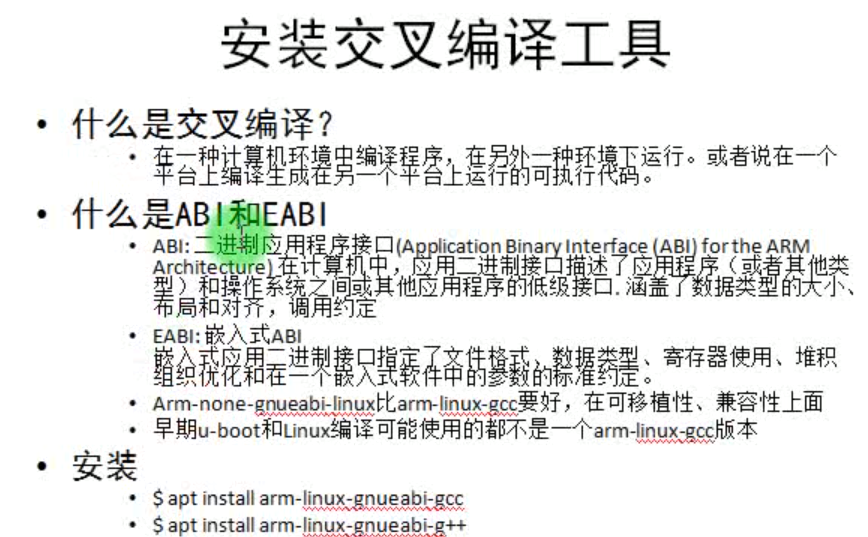

#### 安装(上图中的命令有误)

    apt install gcc-arm-linux-gnueabi

推荐源码编译安装(这里是我已经编译好的，编译请参考arm-gcc官方的readme.md文件)

    kalipy@debian ~/g/gcc-arm-none-eabi-9-2020-q2-update> ls
    arm-none-eabi/  bin/  lib/  share/
    kalipy@debian ~/g/gcc-arm-none-eabi-9-2020-q2-update> cd bin/
    kalipy@debian ~/g/g/bin> ls
    arm-linux-gnueabi-gcc*    arm-none-eabi-gcc-nm*            arm-none-eabi-nm*
    arm-none-eabi-addr2line*  arm-none-eabi-gcc-ranlib*        arm-none-eabi-objcopy*
    arm-none-eabi-ar*         arm-none-eabi-gcov*              arm-none-eabi-objdump*
    arm-none-eabi-as*         arm-none-eabi-gcov-dump*         arm-none-eabi-ranlib*
    arm-none-eabi-c++*        arm-none-eabi-gcov-tool*         arm-none-eabi-readelf*
    arm-none-eabi-c++filt*    arm-none-eabi-gdb*               arm-none-eabi-size*
    arm-none-eabi-cpp*        arm-none-eabi-gdb-add-index*     arm-none-eabi-strings*
    arm-none-eabi-elfedit*    arm-none-eabi-gdb-add-index-py*  arm-none-eabi-strip*
    arm-none-eabi-g++*        arm-none-eabi-gdb-py*            core
    arm-none-eabi-gcc*        arm-none-eabi-gprof*             read.txt
    arm-none-eabi-gcc-9.3.1*  arm-none-eabi-ld*
    arm-none-eabi-gcc-ar*     arm-none-eabi-ld.bfd*
    kalipy@debian ~/g/g/bin> more read.txt 
    read.txt
    
    :Author: kalipy
    :Email: kalipy@debian
    :Date: 2021-06-01 23:58
    
    注意:
    //arm-linux-gnueabi-gcc由arm-none-eabi-gcc改名而来
    cp arm-none-eabi-gcc arm-linux-gnueabi-gcc

### qemu安装及仿真开发板介绍

查看qemu支持模拟哪些开发版

    kalipy@debian ~> qemu-system-arm -M help
    Supported machines are:
    akita                Sharp SL-C1000 (Akita) PDA (PXA270)
    ast2500-evb          Aspeed AST2500 EVB (ARM1176)
    borzoi               Sharp SL-C3100 (Borzoi) PDA (PXA270)
    canon-a1100          Canon PowerShot A1100 IS
    cheetah              Palm Tungsten|E aka. Cheetah PDA (OMAP310)
    collie               Sharp SL-5500 (Collie) PDA (SA-1110)
    connex               Gumstix Connex (PXA255)
    cubieboard           cubietech cubieboard
    emcraft-sf2          SmartFusion2 SOM kit from Emcraft (M2S010)
    highbank             Calxeda Highbank (ECX-1000)
    imx25-pdk            ARM i.MX25 PDK board (ARM926)
    integratorcp         ARM Integrator/CP (ARM926EJ-S)
    kzm                  ARM KZM Emulation Baseboard (ARM1136)
    lm3s6965evb          Stellaris LM3S6965EVB
    lm3s811evb           Stellaris LM3S811EVB
    mainstone            Mainstone II (PXA27x)
    mcimx6ul-evk         Freescale i.MX6UL Evaluation Kit (Cortex A7)
    mcimx7d-sabre        Freescale i.MX7 DUAL SABRE (Cortex A7)
    microbit             BBC micro:bit
    midway               Calxeda Midway (ECX-2000)
    mps2-an385           ARM MPS2 with AN385 FPGA image for Cortex-M3
    mps2-an505           ARM MPS2 with AN505 FPGA image for Cortex-M33
    mps2-an511           ARM MPS2 with AN511 DesignStart FPGA image for Cortex-M3
    musicpal             Marvell 88w8618 / MusicPal (ARM926EJ-S)
    n800                 Nokia N800 tablet aka. RX-34 (OMAP2420)
    n810                 Nokia N810 tablet aka. RX-44 (OMAP2420)
    netduino2            Netduino 2 Machine
    none                 empty machine
    nuri                 Samsung NURI board (Exynos4210)
    palmetto-bmc         OpenPOWER Palmetto BMC (ARM926EJ-S)
    raspi2               Raspberry Pi 2
    realview-eb          ARM RealView Emulation Baseboard (ARM926EJ-S)
    realview-eb-mpcore   ARM RealView Emulation Baseboard (ARM11MPCore)
    realview-pb-a8       ARM RealView Platform Baseboard for Cortex-A8
    realview-pbx-a9      ARM RealView Platform Baseboard Explore for Cortex-A9
    romulus-bmc          OpenPOWER Romulus BMC (ARM1176)
    sabrelite            Freescale i.MX6 Quad SABRE Lite Board (Cortex A9)
    smdkc210             Samsung SMDKC210 board (Exynos4210)
    spitz                Sharp SL-C3000 (Spitz) PDA (PXA270)
    sx1                  Siemens SX1 (OMAP310) V2
    sx1-v1               Siemens SX1 (OMAP310) V1
    terrier              Sharp SL-C3200 (Terrier) PDA (PXA270)
    tosa                 Sharp SL-6000 (Tosa) PDA (PXA255)
    verdex               Gumstix Verdex (PXA270)
    versatileab          ARM Versatile/AB (ARM926EJ-S)
    versatilepb          ARM Versatile/PB (ARM926EJ-S)
    vexpress-a15         ARM Versatile Express for Cortex-A15
    vexpress-a9          ARM Versatile Express for Cortex-A9
    virt-2.10            QEMU 2.10 ARM Virtual Machine
    virt-2.11            QEMU 2.11 ARM Virtual Machine
    virt-2.12            QEMU 2.12 ARM Virtual Machine
    virt-2.6             QEMU 2.6 ARM Virtual Machine
    virt-2.7             QEMU 2.7 ARM Virtual Machine
    virt-2.8             QEMU 2.8 ARM Virtual Machine
    virt-2.9             QEMU 2.9 ARM Virtual Machine
    virt-3.0             QEMU 3.0 ARM Virtual Machine
    virt                 QEMU 3.1 ARM Virtual Machine (alias of virt-3.1)
    virt-3.1             QEMU 3.1 ARM Virtual Machine
    witherspoon-bmc      OpenPOWER Witherspoon BMC (ARM1176)
    xilinx-zynq-a9       Xilinx Zynq Platform Baseboard for Cortex-A9
    z2                   Zipit Z2 (PXA27x)

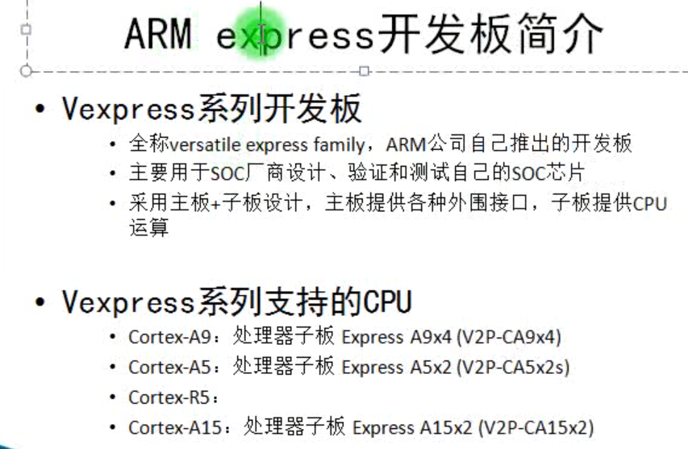

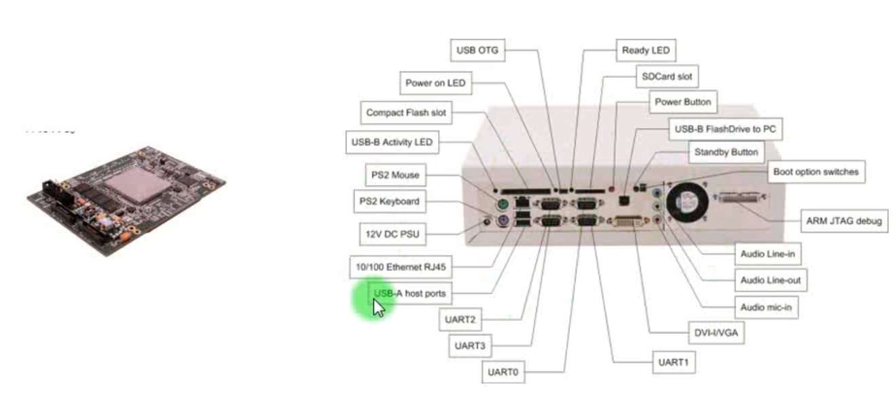

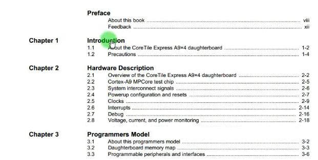

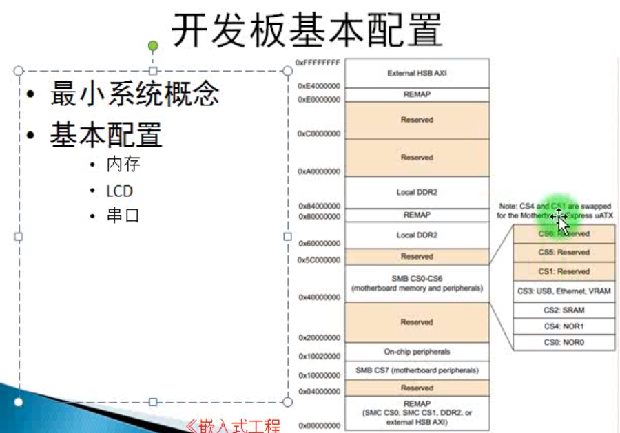

### 编译linux内核和dtb文件

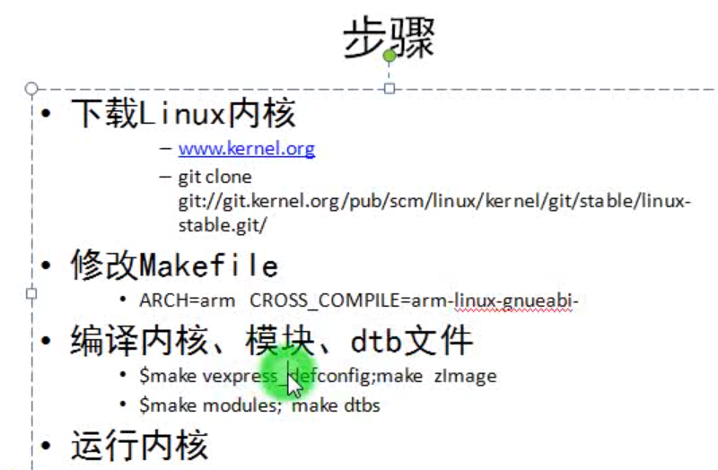

下载linux源码,官方地址www.kernel.org

    kalipy@debian ~/下载> cd linux-4.4.235/linux-4.4.235/
    kalipy@debian ~/下/l/linux-4.4.235> ls
    arch/    Documentation/  ipc/         Makefile         README          System.map
    block/   drivers/        Kbuild       mm/              REPORTING-BUGS  tools/
    certs/   firmware/       Kconfig      modules.builtin  samples/        usr/
    COPYING  fs/             kernel/      modules.order    scripts/        virt/
    CREDITS  include/        lib/         Module.symvers   security/       vmlinux*
    crypto/  init/           MAINTAINERS  net/             sound/          vmlinux.o

修改Makefile

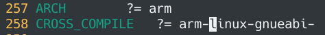

生成.config配置文件

    kalipy@debian ~/下/l/linux-4.4.235> make vexpress_defconfig
      HOSTCC  scripts/basic/fixdep
      HOSTCC  scripts/basic/bin2c
      HOSTCC  scripts/kconfig/conf.o
      HOSTCC  scripts/kconfig/zconf.tab.o
      HOSTLD  scripts/kconfig/conf
    #
    # configuration written to .config
    #

编译内核

    kalipy@debian ~/下/l/linux-4.4.235> make zImage -j4
      ...
      ...
      LD      vmlinux
      SORTEX  vmlinux
      SYSMAP  System.map
      OBJCOPY arch/arm/boot/Image
      Kernel: arch/arm/boot/Image is ready
      Kernel: arch/arm/boot/Image is ready
      ...
      ...
      LD      arch/arm/boot/compressed/vmlinux
      OBJCOPY arch/arm/boot/zImage
      Kernel: arch/arm/boot/zImage is ready

编译模块

    kalipy@debian ~/下/l/linux-4.4.235> make modules -j4

编译dtbs文件

    kalipy@debian ~/下/l/linux-4.4.235> make dtbs

    //编译dts后生成的dtb文件
    kalipy@debian ~/下/l/linux-4.4.235> ll arch/arm/boot/dts/vexpress-v2p-ca9*
    -rw-r--r-- 1 kalipy kalipy  15K 9月   6  2020 arch/arm/boot/dts/vexpress-v2p-ca9.dtb
    -rw-r--r-- 1 kalipy kalipy 7.9K 9月   3  2020 arch/arm/boot/dts/vexpress-v2p-ca9.dts

运行内核

    qemu-system-arm -M vexpress-a9 -m 512M -kernel arch/arm/boot/zImage -dtb arch/arm/boot/dts/vexpress-v2p-ca9.dtb -nographic -append "console=ttyAMA0"
    
    Kernel panic - not syncing: VFS: Unable to mount root fs on unknown-block(0,0)
    CPU: 0 PID: 1 Comm: swapper/0 Not tainted 4.4.235 #2
    Hardware name: ARM-Versatile Express
    [<80015ad4>] (unwind_backtrace) from [<80012654>] (show_stack+0x10/0x14)
    [<80012654>] (show_stack) from [<80248e98>] (dump_stack+0x90/0xa4)
    [<80248e98>] (dump_stack) from [<800a7ce4>] (panic+0x98/0x1f0)
    [<800a7ce4>] (panic) from [<806362d0>] (mount_block_root+0x1c0/0x250)
    [<806362d0>] (mount_block_root) from [<80636460>] (mount_root+0x100/0x108)
    [<80636460>] (mount_root) from [<806365bc>] (prepare_namespace+0x154/0x198)
    [<806365bc>] (prepare_namespace) from [<80635eb8>] (kernel_init_freeable+0x24c/0x25c)
    [<80635eb8>] (kernel_init_freeable) from [<804ad580>] (kernel_init+0x8/0xe4)
    [<804ad580>] (kernel_init) from [<8000f410>] (ret_from_fork+0x14/0x24)
    ---[ end Kernel panic - not syncing: VFS: Unable to mount root fs on unknown-block(0,0)

上面启动内核成功了，最后之所以报错是因为没有文件系统

### 使用busybox制作根文件系统

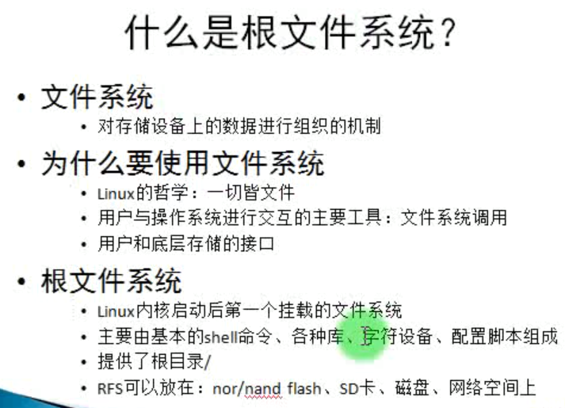

这是我源码编译并安装好的

    /home/kalipy/下载/busybox-1.32.0/busybox-1.32.0
    kalipy@debian ~/下/b/busybox-1.32.0> ls
    applets/                examples/                modutils/
    applets_sh/             findutils/               networking/
    arch/                   include/                 NOFORK_NOEXEC.lst
    archival/               init/                    NOFORK_NOEXEC.sh*
    AUTHORS                 _install/                printutils/
    busybox*                INSTALL                  procps/
    busybox.links           klibc-utils/             qemu_multiarch_testing/
    busybox_unstripped*     libbb/                   README
    busybox_unstripped.map  libpwdgrp/               runit/
    busybox_unstripped.out  LICENSE                  scripts/
    Config.in               loginutils/              selinux/
    configs/                mailutils/               shell/
    console-tools/          Makefile                 size_single_applets.sh*
    coreutils/              Makefile.custom          sysklogd/
    debianutils/            Makefile.flags           testsuite/
    docs/                   Makefile.help            TODO
    e2fsprogs/              make_single_applets.sh*  TODO_unicode
    editors/                miscutils/               util-linux/

配置

    kalipy@debian ~/下/b/busybox-1.32.0> make defconfig

    kalipy@debian ~/下/b/busybox-1.32.0> make menuconfig

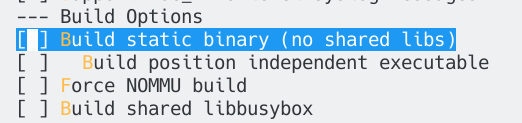

按下空格键，把static binary选上,我们把它编译成静态库

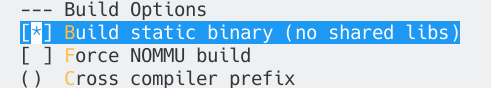

编译报错

    kalipy@debian ~/下/b/busybox-1.32.0> make
      CC      applets/applets.o
    In file included from include/libbb.h:13,
                     from include/busybox.h:8,
                     from applets/applets.c:9:
    include/platform.h:168:11: fatal error: byteswap.h: No such file or directory
      168 | # include <byteswap.h>
          |           ^~~~~~~~~~~~
    compilation terminated.

解决(即不要使用通过源码安装的arm-gcc,使用apt的)

    kalipy@debian ~/下/b/busybox-1.32.0> whereis arm-linux-gnueabi-gcc
    arm-linux-gnueabi-gcc: /home/kalipy/gcc-arm-none-eabi-9-2020-q2-update/gcc-arm-none-eabi-9-2020-q2-update/bin/arm-linux-gnueabi-gcc
    
    kalipy@debian ~/下/b/busybox-1.32.0> sudo apt install gcc-arm-linux-gnueabi

最后安装
    
    make install

make install后才会出现_install这个文件夹

    kalipy@debian ~/下/b/busybox-1.32.0> ll _install/
    总用量 12K
    drwxr-xr-x 2 kalipy kalipy 4.0K 6月   8 16:33 bin/
    lrwxrwxrwx 1 kalipy kalipy   11 6月   8 16:33 linuxrc -> bin/busybox*
    drwxr-xr-x 2 kalipy kalipy 4.0K 6月   8 16:33 sbin/
    drwxr-xr-x 4 kalipy kalipy 4.0K 6月   8 16:33 usr/

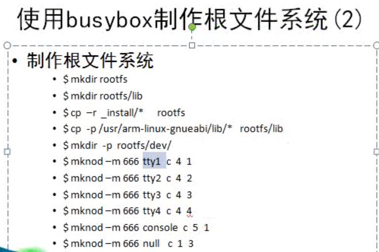

这是我根据上面的步骤创建好的rootfs

    kalipy@debian ~/下/busybox-1.32.0> ls
    boot.sh*  busybox-1.32.0/  read.txt  rootfs/  rootfs.ext3
    kalipy@debian ~/下/busybox-1.32.0> ll rootfs/
    总用量 20K
    drwxr-xr-x 2 kalipy kalipy 4.0K 9月   6  2020 bin/
    drwxr-xr-x 2 kalipy kalipy 4.0K 9月   6  2020 dev/
    drwxr-xr-x 2 kalipy kalipy 4.0K 9月   6  2020 lib/
    lrwxrwxrwx 1 kalipy kalipy   11 9月   6  2020 linuxrc -> bin/busybox*
    drwxr-xr-x 2 kalipy kalipy 4.0K 9月   6  2020 sbin/
    drwxr-xr-x 4 kalipy kalipy 4.0K 9月   6  2020 usr/

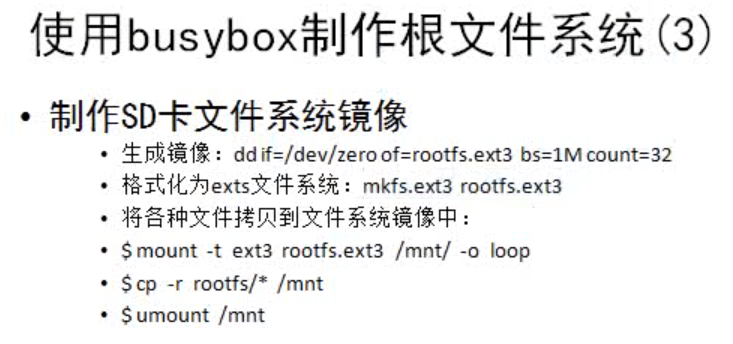

编写启动脚本

    kalipy@debian ~/下/busybox-1.32.0> more boot.sh 
    #! /bin/sh
    #
    # boot.sh
    # Copyright (C) 2020 kalipy <kalipy@debian>
    #
    # Distributed under terms of the MIT license.
    #
    
    qemu-system-arm \
        -M vexpress-a9 \
        -m 512M \
        -kernel ../linux-4.4.235/linux-4.4.235/arch/arm/boot/zImage \
        -dtb ../linux-4.4.235/linux-4.4.235/arch/arm/boot/dts/vexpress-v2p-ca9.dtb \
        -nographic \
        -append "root=/dev/mmcblk0 rw console=ttyAMA0" \
        -sd rootfs.ext3

启动内核带挂载rootfs

    kalipy@debian ~/下/busybox-1.32.0> ./boot.sh

启动成功

    Freeing unused kernel memory: 284K
    random: nonblocking pool is initialized
    --------------------------------------------
    welcome to A9 vexpress board
    --------------------------------------------
    
    Please press Enter to activate this console. 
    / # ls
    bin         etc         linuxrc     proc        sys
    dev         lib         lost+found  sbin        usr

### 使用uboot加载linux内核

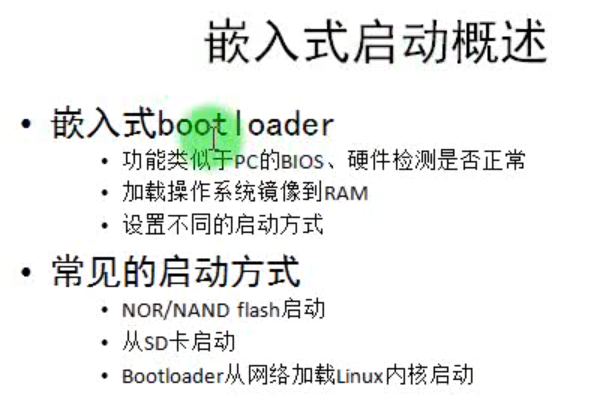

#### 编译uboot

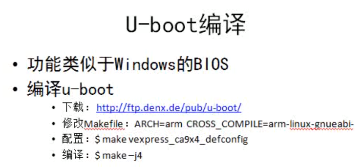

修改Makefile

    kalipy@debian ~/下/u/u-boot-2021.04> vim Makefile

    CROSS_COMPILE ?= arm-linux-gnueabi-

修改config.mk

    kalipy@debian ~/下/u/u-boot-2021.04> vim config.mk
    #ARCH := $(CONFIG_SYS_ARCH:"%"=%)
    ARCH := arm

编译

    kalipy@debian ~/下/u/u-boot-2021.04> make vexpress_ca9x4_defconfig
    #
    # configuration written to .config
    #
    kalipy@debian ~/下/u/u-boot-2021.04> make -j4

报错

    kalipy@debian ~/下/u/u-boot-2021.04> make
    scripts/kconfig/conf  --syncconfig Kconfig
    make[1]: *** arch/arm: 是一个目录。 停止。

报错解决(把`ARCH := arm `改为`ARCH := arm`,即arm后多了空格)

    kalipy@debian ~/下/u/u-boot-2021.04> vim config.mk
    ARCH := arm

再次编译，编译成功

    kalipy@debian ~/下/u/u-boot-2021.04> ls
    api/       disk/      include/     net/        u-boot*             u-boot.srec*
    arch/      doc/       Kbuild       post/       u-boot.bin*         u-boot.sym
    board/     drivers/   Kconfig      README      u-boot.cfg
    cmd/       dts/       lib/         scripts/    u-boot.cfg.configs
    common/    env/       Licenses/    System.map  u-boot.lds
    config.mk  examples/  MAINTAINERS  test/       u-boot.map
    configs/   fs/        Makefile     tools/      u-boot-nodtb.bin*

#### 内核配置编译

    kalipy@debian ~/下/l/linux-4.4.235> make LOADADDR=0x60003000 -j4

    kalipy@debian ~/下/l/linux-4.4.235> ll arch/arm/boot/
    总用量 14M
    drwxr-xr-x 2 kalipy kalipy 4.0K 9月   5  2020 bootp/
    drwxr-xr-x 2 kalipy kalipy 4.0K 6月   8 17:49 compressed/
    drwxr-xr-x 3 kalipy kalipy  60K 10月 24  2020 dts/
    -rwxr-xr-x 1 kalipy kalipy 6.7M 6月   8 17:49 Image*
    -rw-r--r-- 1 kalipy kalipy 1.7K 9月   3  2020 install.sh
    -rw-r--r-- 1 kalipy kalipy 3.1K 9月   3  2020 Makefile
    -rw-r--r-- 1 kalipy kalipy 3.4M 9月   6  2020 uImage
    -rwxr-xr-x 1 kalipy kalipy 3.4M 6月   8 17:49 zImage*

linux上一般默认安装了ftfp服务,我们可以查看它的配置文件，其中`TFTP_DIRECTORY`是我们要关心的

    kalipy@debian ~/下/busybox-1.32.0> more /etc/default/tftpd-hpa 
    # /etc/default/tftpd-hpa
    
    TFTP_USERNAME="tftp"
    TFTP_DIRECTORY="/home/kalipy/下载/busybox-1.32.0/tftpboot"
    TFTP_ADDRESS="0.0.0.0:69"
    TFTP_OPTIONS="-l -c -s"
   
创建tftpboot目录

    kalipy@debian ~/下/busybox-1.32.0> mkdir tftpboot
    kalipy@debian ~/下/busybox-1.32.0> sudo chmod 777 tftpboot 
    kalipy@debian ~/下/busybox-1.32.0> ls
    boot.sh*           busybox-1.32.0/  rootfs/      tftpboot/
    boot_with_lcd.sh*  read.txt         rootfs.ext3

然后启动tftp服务

    kalipy@debian ~/g/g/bin> sudo service tftpd-hpa start
    kalipy@debian ~/g/g/bin> sudo service tftpd-hpa status
    ● tftpd-hpa.service - LSB: HPA's tftp server
       Loaded: loaded (/etc/init.d/tftpd-hpa; generated)
       Active: active (running) since Tue 2021-06-08 18:15:21 CST; 2s ago

修改文件(加入如下内容)

kalipy@debian ~/下/u/u-boot-2021.04> vim include/configs/vexpress_common.h

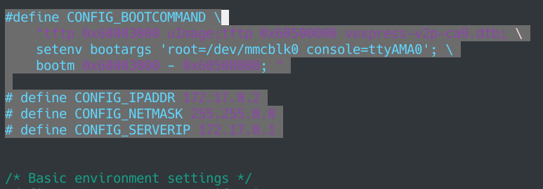

重新编译uboot

    kalipy@debian ~/下/u/u-boot-2021.04> make -j4

tftpboot目录下放入如下文件

    kalipy@debian ~/下/busybox-1.32.0> 
    cp ../u-boot-2021.04/u-boot-2021.04/u-boot tftpboot/.
    kalipy@debian ~/下/busybox-1.32.0> 
    cp ../linux-4.4.235/linux-4.4.235/arch/arm/boot/uImage tftpboot/.
    kalipy@debian ~/下/busybox-1.32.0> 
    cp ../linux-4.4.235/linux-4.4.235/arch/arm/boot/dts/vexpress-v2p-ca9.dtb tftpboot/.
    kalipy@debian ~/下/busybox-1.32.0> ll tftpboot/
    总用量 7.8M
    -rwxr-xr-x 1 kalipy kalipy 4.5M 6月   8 18:21 u-boot*
    -rw-r--r-- 1 kalipy kalipy 3.4M 6月   8 18:22 uImage
    -rw-r--r-- 1 kalipy kalipy  15K 6月   8 18:22 vexpress-v2p-ca9.dtb

配置qemu网络(这里借助了docker的网络功能,请参见我的debian10上用qemu运行alpine系统编译linux0.11源码.md，因为qemu自带的网络脚本我打死成功不了)

    //创建tap0
    sudo tunctl -t tap0
    sudo ifconfig tap0 up
    //将tap0挂到docker0上去
    sudo brctl addif docker0 tap0

通过uboot加载tftp服务器上的内核并启动成功

    kalipy@debian ~/下/b/tftpboot> sudo ./boot.sh
    [sudo] kalipy 的密码：
    WARNING: Image format was not specified for '/home/kalipy/下载/busybox-1.32.0/rootfs.ext3' and probing guessed raw.
             Automatically detecting the format is dangerous for raw images, write operations on block 0 will be restricted.
             Specify the 'raw' format explicitly to remove the restrictions.
    pulseaudio: set_sink_input_volume() failed
    pulseaudio: Reason: Invalid argument
    pulseaudio: set_sink_input_mute() failed
    pulseaudio: Reason: Invalid argument
    
    
    U-Boot 2021.04 (Jun 08 2021 - 19:02:27 +0800)
    
    DRAM:  512 MiB
    WARNING: Caches not enabled
    Flash: 128 MiB
    MMC:   MMC: 0
    *** Warning - bad CRC, using default environment
    
    In:    serial
    Out:   serial
    Err:   serial
    Net:   smc911x-0
    Hit any key to stop autoboot:  0 
    smc911x: MAC 52:54:00:12:34:56
    smc911x: detected LAN9118 controller
    smc911x: phy initialized
    smc911x: MAC 52:54:00:12:34:56
    Using smc911x-0 device
    TFTP from server 172.17.0.1; our IP address is 172.17.0.2
    Filename 'uImage'.
    Load address: 0x60003000
    Loading: #################################################################
             #################################################################
             #################################################################
             ############################################
             4 MiB/s
    done
    Bytes transferred = 3504120 (3577f8 hex)
    smc911x: MAC 52:54:00:12:34:56
    smc911x: MAC 52:54:00:12:34:56
    smc911x: detected LAN9118 controller
    smc911x: phy initialized
    smc911x: MAC 52:54:00:12:34:56
    Using smc911x-0 device
    TFTP from server 172.17.0.1; our IP address is 172.17.0.2
    Filename 'vexpress-v2p-ca9.dtb'.
    Load address: 0x60500000
    Loading: #
             437.5 KiB/s

