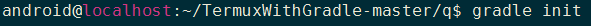

### gradle构建java项目

1. gradle init初始化  
  
回显：  


2. 如图所示，根据你的需求选择就好，我这里是这样选择的：  
  

3. 输入你的项目名字和包名,我这里项目名是test，包名是com/cn/sxt：  
  

4. gradle即自动帮我们构建好了一个java hello_world项目，项目目录结构如下：  
  

5. ok,构建完成，接下来尝试编译~

### gradle编译java项目

先运行`gradle tasks`看下当前项目可执行的task任务：  
  

```
Build tasks
-----------
assemble - 编译打包该工程内容
build - 编译打包并测试该工程
buildDependents - 编译打包并测试该工程和所有依赖它的工程
buildNeeded - 编译打包并测试该工程和它依赖的所有工程
classes - 编译打包主要的类文件
clean - 删除编译目录
jar - 编译打成jar包，这个jar包包含主要的类文件
testClasses - 编译打包测试类文件

```

1. 运行`gradle test`运行项目的单元测试(没有任何显示，是因为所有测试都通过了)：  
  

2. 运行`gradle build`build项目:  
 

3. 运行`gradle run`运行项目:  
  

4. 完~


