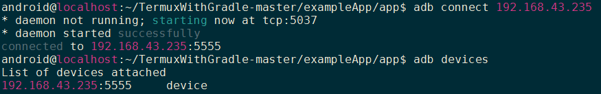
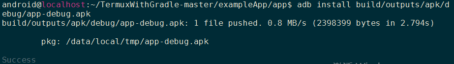
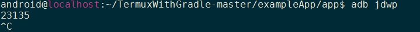
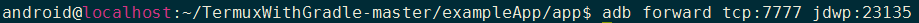
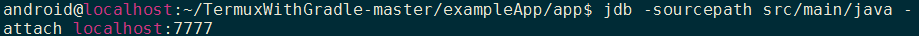
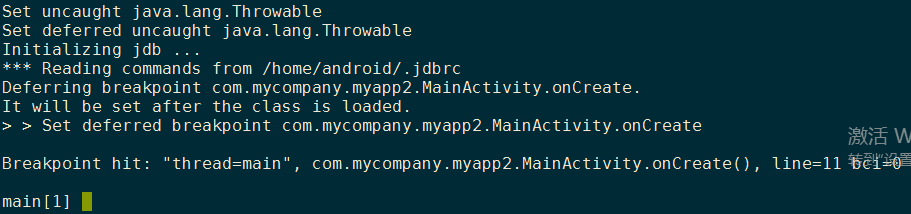
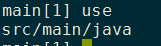
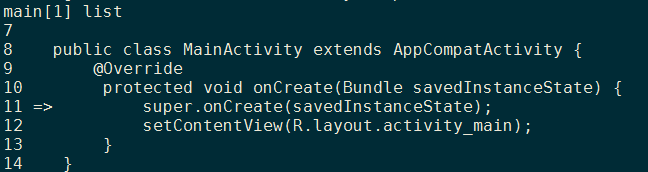
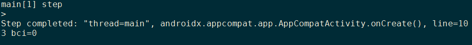

# jdb命令行带源码调试安卓app和系统源码  
***请先看"手机adb调试手机.md"和"jdb命令行调试java.md"***  
### 正题

jdb -sourcepath /home/android/TermuxWithGradle-master/exampleApp/app/src/main/java com.mycompany.myapp2.MainActivity.onCreate

1. adb连接到目标安卓设备：  
`adb connect 192.168.43.235`  
  

2. 给目标设备安装要被调试的软件：  
```
android@localhost:~/TermuxWithGradle-master/exampleApp/app$ adb install build/outputs/apk/debug/app-debug.apk
``` 
结果如图：  
  

3. 被调试手机打开开发者和usb调试模式，找到选项“选择调试的应用”，选上你需要被调试的应用

4. 打开需要被调试的应用，此时应用弹出对话框"waiting for debuger"  

5. 新建断点文件，加入你需要断点的代码，比如这里给onCreate方法下断点(stop in是下断点的一种方法)：
`vim ~/.jdbrc`  
`stop in com.mycompany.myapp2.MainActivity.onCreate`  
  

6. 运行如图命令,然后crl-c中断：  
  

7. 记住刚刚那个数字`23135`,然后运行如图命令：  
  
***说明：  
a)23135为被调试手机的要被调试的app开放的端口号(要进行步骤2和3才会出现，不然为空)  
b)tcp:7777为调试者的端口，adb会把被调试手机的23135端口和调试者的7777端口建立连接，进行信息的传送  
c)-sourcepath src的设置请看"jdb命令行调试java"篇***

8. 运行`jdb -sourcepath src/main/java -attach localhost:7777`开始调试app  
  
回显结果如下,显示已经在MainActivity的onCreate()方法中停下了，等待我们的调试命令，如`step`单步执行：  
  

9. 输入`use`查看我们刚刚设置的sourcepath：  


10. 输入`list`查看源码和当前app运行到哪行代码了：  
  
回显结果显示`11=>`,即当前准备运行11行代码  

11. 输入`step`单步执行：  


12. 完~
