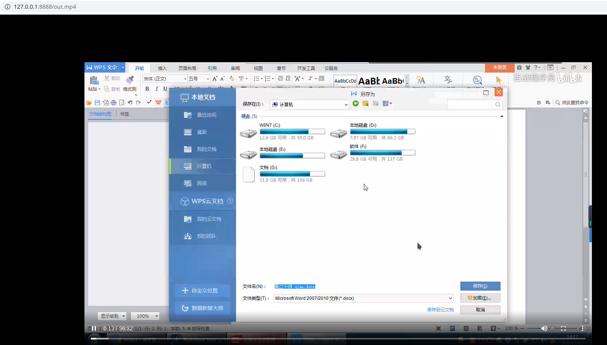

```
nginx视频点播与直播.md

:Author: kalipy
:Email: kalipy@debian
:Date: 2021-03-16 22:14
```

### 下载nginx的源码

1. 官网下载linux下的源码包

2. 建议用高版本的，低版本的编译可能会报大量错误，我这里1.19.8和1.18.0在gcc10下都成功了

### 下载nginx-http-flv-module的源码

1. `git clone https://github.com/winshining/nginx-http-flv-module.git`

2. `nginx-http-flv-module`包含了`nginx-rtmp-module`,所以请不要安装`nginx-rtmp-module`

3. `nginx-rtmp-module`已经很久没有更新不在维护了，所以`nginx-http-flv-module`是趋势

### 编译安装

注意：`--with-http_mp4_module`是`nginx`高版本中自带的视频点播模块,我觉得比较好用，就顺便也安装了,它可以让浏览器直接播放服务器上的mp4视频

```
1. cd nginx-1.19.8

2. kalipy@debian ~/n/nginx-1.19.8> ls
auto/  CHANGES  CHANGES.ru  conf/  configure*  contrib/  html/  LICENSE  Makefile  man/  objs/  README  src/

3. kalipy@debian ~/n/nginx-1.19.8> ./configure  --add-module=../nginx-http-flv-module --with-http_mp4_module

4. make

5. sudo make install

```

### 编辑nginx的配置文件

注意: 配置文件的位置编译nginx源码后控制台有打印提示，最好复制官网的配置,官网地址:`https://github.com/winshining/nginx-http-flv-module`

1. 编辑配置文件`sudo vim /usr/local/nginx/conf/nginx.conf`  
    ```
    worker_processes  1; #should be 1 for Windows, for it doesn't support Unix domain socket
    #worker_processes  auto; #from versions 1.3.8 and 1.2.5
    
    #worker_cpu_affinity  0001 0010 0100 1000; #only available on FreeBSD and Linux
    #worker_cpu_affinity  auto; #from version 1.9.10
    
    error_log logs/error.log error;
    
    #if the module is compiled as a dynamic module and features relevant
    #to RTMP are needed, the command below MUST be specified and MUST be
    #located before events directive, otherwise the module won't be loaded
    #or will be loaded unsuccessfully when NGINX is started
    
    #load_module modules/ngx_http_flv_live_module.so;
    
    events {
        worker_connections  4096;
    }
    
    http {
        include       mime.types;
        default_type  application/octet-stream;
    
        keepalive_timeout  65;
    
        server {
            listen       8888;
    
            location / {
                root   /var/www;
                index  index.html index.htm;
            }
    
            error_page   500 502 503 504  /50x.html;
            location = /50x.html {
                root   html;
            }
    
            location /live {
                flv_live on; #open flv live streaming (subscribe)
                chunked_transfer_encoding  on; #open 'Transfer-Encoding: chunked' response
    
                add_header 'Access-Control-Allow-Origin' '*'; #add additional HTTP header
                add_header 'Access-Control-Allow-Credentials' 'true'; #add additional HTTP header
            }
    
            location /hls {
                types {
                    application/vnd.apple.mpegurl m3u8;
                    video/mp2t ts;
                }
                #kalipy----------------
    		    alias /home/kalipy/vod/hls;   
    		    expires -1;
                
                #root /tmp;
                add_header 'Cache-Control' 'no-cache';
            }
    
            location /dash {
                root /tmp;
                add_header 'Cache-Control' 'no-cache';
            }
    
            #kalipy--------------
            location ~ \.mp4 {
                root /home/kalipy/vod;
                mp4;
            }
            
            location /stat {
                #configuration of streaming & recording statistics
    
                rtmp_stat all;
                rtmp_stat_stylesheet stat.xsl;
            }
    
            location /stat.xsl {
                #root /var/www/rtmp; #specify in where stat.xsl located
        	    #kalipy----------
    		    #root /home/kalipy/nginx_rtmp/nginx-rtmp-module/;
                root /home/kalipy/nginx_rtmp/nginx-http-flv-module;
            }
    
            #if JSON style stat needed, no need to specify
            #stat.xsl but a new directive rtmp_stat_format
    
            #location /stat {
            #    rtmp_stat all;
            #    rtmp_stat_format json;
            #}
    
            location /control {
                rtmp_control all; #configuration of control module of rtmp
            }
        }
    }
    
    rtmp_auto_push on;
    rtmp_auto_push_reconnect 1s;
    rtmp_socket_dir /tmp;
    
    rtmp {
        out_queue           4096;
        out_cork            8;
        max_streams         128;
        timeout             15s;
        drop_idle_publisher 15s;
    
        log_interval 5s; #interval used by log module to log in access.log, it is very useful for debug
        log_size     1m; #buffer size used by log module to log in access.log
    
        server {
            listen 1935;
            server_name www.test.*; #for suffix wildcard matching of virtual host name
    
            application myapp {
                live on;
                gop_cache on; #open GOP cache for reducing the wating time for the first picture of video
            }
    
            application hls {
                live on;
                hls on;
                #hls_path /tmp/hls;
    	        #kalipy----------
                hls_path /home/kalipy/vod/hls; #切片视频文件存放位置。
            }
    
            application dash {
                live on;
                dash on;
                dash_path /tmp/dash;
            }
    
            #kalipy----------------------------
        	application vod {
                play /home/kalipy/vod; #//视频文件存放位置。
        	}
    
        }
    
        server {
            listen 1935;
            server_name *.test.com; #for prefix wildcard matching of virtual host name
    
            application myapp {
                live on;
                gop_cache on; #open GOP cache for reducing the wating time for the first picture of video
            }
        }
    
        server {
            listen 1935;
            server_name www.test.com; #for completely matching of virtual host name
    
            application myapp {
                live on;
                gop_cache on; #open GOP cache for reducing the wating time for the first picture of video
            }
        }
    }
    ```

2. 重新加载配置文件`sudo /usr/local/nginx/sbin/nginx -s reload`或`sudo /usr/local/nginx/sbin/nginx -s stop && sudo /usr/local/nginx/sbin/nginx`重启`nginx`

3. 配置文件的含义如下请参考:`https://blog.csdn.net/kingroc/article/details/50839994?utm_medium=distribute.pc_relevant.none-task-blog-OPENSEARCH-3.control&dist_request_id=1328656.9859.16158667382482133&depth_1-utm_source=distribute.pc_relevant.none-task-blog-OPENSEARCH-3.control`和`https://github.com/winshining/nginx-http-flv-module`

4. 不报错则安装成功

### 使用视频点播

#### 方法一
1. http server下加入如下内容:  
    ```
    location ~ \.mp4 {
        root /home/kalipy/vod;#//视频文件存放位置
        mp4;
    }
    ```
2. 浏览器访问`127.0.0.1:8888/out.mp4`,`out.mp4`是在/home/kalipy/vod目录下的视频文件  
    注意: vod可以是任意目录，最好自己加权限为`777`
    

#### 方法二

1. rtmp server下加入如下内容:  
    ```
    application vod {
        play /home/kalipy/vod; #//视频文件存放位置。
    }
    ```

2. `smplayer`访问`rtmp://127.0.0.1:1935/vod/out.mp4`  

### 方法三(伪视频点播)

1. rtmp下:  
    ```
    application hls {
        live on;
        hls on;
        #hls_path /tmp/hls;
        hls_path /home/kalipy/vod/hls; #切片视频文件存放位置。
    }
    ```

2. obs录像设置为`rtmp://127.0.0.1:1935/hls/test`,浏览器访问`http://127.0.0.1:8888/hls/test.m3u8`  

3. `rtmp:127.0.0.1:1935/hls/test`中的`hls`是rtmp中配置的`application`的名字,`test`是随便任意取得

### 使用视频播

#### 方法一(上面的方法三)

#### 方法二

1. rtmp server下加入如下内容:  
    ```
    application myapp {
        live on;
        gop_cache on; #open GOP cache for reducing the wating time for the first picture of video
    }
    ```

3. obs推流设置为:  
    ```
    URL: rtmp://127.0.0.1:1935/myapp
    流名称: push
    ```
4. `rtmp`中的`myapp`是`rtmp server`下的`application`的名字

5. obs点击`开始推流`  

6. `smplayer`访问`http://127.0.0.1:8888/live?port=1935&app=myapp&stream=push`或者通过`bilibili`开源的`flv.js`通过浏览器直接访问(只有视频点播中的是存放视频的文件夹，视频直播中通过`rtmp://`访问的如`myapp`和`hls`等都是`application`的名字)

7. flv.js浏览器直接访问如下:  
    ```
    <script src="https://cdn.bootcdn.net/ajax/libs/flv.js/1.5.0/flv.js"></script>
    <video id="videoElement"></video>
    <script>
        if (flvjs.isSupported()) {
            var videoElement = document.getElementById('videoElement');
            var flvPlayer = flvjs.createPlayer({
                type: 'flv',
                isLive:true, // 如果是直播流需要设置这个值为 true
                url: 'http://127.0.0.1:8888/live?port=1935&app=myapp&stream=push'
            // ↑ 拉流示例地址，stream参数一定要和推流时所设置的流密钥一致
            });
            flvPlayer.attachMediaElement(videoElement);
            flvPlayer.load();
            flvPlayer.play();
        }
    </script>
    ```

#### 方法三

1. 直接命令行用ffmpeg推流为flv格式:  
    ```
    kalipy@debian ~/vod> tree
    .
    ├── 1.mp4
    ├── 22.mp4
    ├── 2.mp4
    ├── hls
    └── out.mp4
    
    1 directory, 4 files
    kalipy@debian ~/vod> ffmpeg -re -i out.mp4  -c copy -f flv rtmp://127.0.0.1:1935/myapp/push
    ```

2. `smplayer`访问`http://127.0.0.1:8888/live?port=1935&app=myapp&stream=push`或者通过bilibili开源的flv.js通过浏览器直接访问

