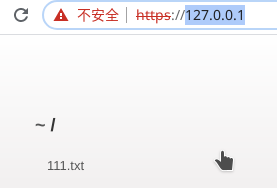
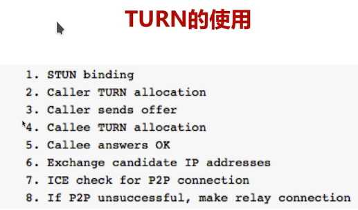

    webRTC学习.md
    
    :Author: kalipy
    :Email: kalipy@debian
    :Date: 2021-03-18 16:20

### webRTC源码目录结构

| 目录            | 功能                                                   |
|-----------------|--------------------------------------------------------|
| api             | webRTC接口层,浏览器都是通过该接口调用webRTC            |
| call            | 数据流的管理层，call代表同一个端点的所有数据的流入流出 |
| video           | 与视频相关的逻辑                                       |
| audio           | 与音频相关的逻辑                                       |
| common_audio    | 音频算法相关                                           |
| common_video    | 视频算法相关                                           |
| media           | 与多媒体相关的逻辑处理，如编解码的逻辑处理             |
| logging         | 日志                                                   |
| module          | 最重要的目录，子模块                                   |
| pc              | peer connection,连接功能相关                           |
| p2p             | 端对端相关，stun,turn                                  |
| rtc_base        | 基础代码，如线程，锁相关的统一接口代码                 |
| rtc_tool        | 音视频分析相关                                         |
| tool_webrtc     | webRTC测试相关，如网络模拟器                           |
| system_wrappers | 与具体操作系统相关代码，如cpu特性，原子操作            |
| stats           | 存放各种数据统计相关的类                               |
| sdk             | 存放android和ios层代码，如视频的采集,渲染等            |

#### webRTC modules目录

| 目录                     | 功能               |
|--------------------------|--------------------|
| audio_coding             | 音频编解码相关     |
| audio_device             | 音频采集与音频播放 |
| audio_mixer              | 混音               |
| audio_processing         | 音频前后处理       |
| bitrate_controller       | 码率控制           |
| congestion_controller    | 流控制             |
| desktop_capture          | 桌面采集           |
| pacing                   | 码率探测及平滑处理 |
| remote_bitrate_estimator | 远端码率估算       |
| rtp_rtcp                 | rtp/rtcp协议       |
| video_capure             | 视频采集           |
| video_coding             | 视频编解码         |
| video_processing         | 视频前后处理       |

### node搭建http和https服务器

为什么需要https服务器?

因为webRTC的有些功能需要用到https,如果只是http的话，有些东西访问没权限!

#### 怎么搭建https服务器?

生成https所需要的证书

    //生成rsa私钥
    openssl genrsa -des3 -out ssl.key 2048
    
    //删除密码
    openssl rsa -in ssl.key -out ssl.key
    
    //生成CSR（证书签名请求）
    openssl req -new -key ssl.key -out ssl.csr
    
    //生成自签名证书 3650是证书有效期(单位：天)
    openssl x509 -req -days 3650 -in ssl.csr -signkey ssl.key -out ssl.crt

编写server.js

    var http = require('http');
    var https = require('https');
    var fs = require("fs");
    
    var express = require('express');
    var serveIndex = require('serve-index');
    
    var app = express();
    app.use(serveIndex('./public'));//将public目录发布出去给浏览器直接访问
    app.use(express.static('./public'));//让我们的server.js可以像apache一样将服务器上的文件给浏览器直接访问到
    
    //http server
    var http_server = http.createServer(app);
    http_server.listen(80, '0.0.0.0');
    
    var options = {
        key : fs.readFileSync('./ssl.key'),
        cert : fs.readFileSync('./ssl.crt')
    }
    
    //https server
    var https_server = https.createServer(options, app);
    https_server.listen(443, '0.0.0.0');

新建public文件夹，里面随便放个文件如111.txt

安装依赖

    yarn add express serve-index

项目目录结构如下:

    kalipy@debian ~/b/webRTC_study> tree -L 1
    .
    ├── node_modules
    ├── package.json
    ├── public
    ├── server.js
    ├── ssl.crt
    ├── ssl.csr
    ├── ssl.key

#### 测试https服务器

    sudo node server.js

浏览器访问 `http://127.0.0.1`


浏览器访问 `https://127.0.0.1`



ok,都成功了~

### webRTC获取视频设备

* enumerateDevices

基本格式

    //enumerateDevices()会返回一个Promise,Promise保存了MediaDevicesInfo
    var ePromise = navigator.mediaDevices.enumerateDevices();

* MediaDevicesInfo

| 属性     | 说明                                     |
|----------|------------------------------------------|
| deviceID | 设备ID                                   |
| label    | 设备的名字                               |
| kind     | 设备的种类                               |
| groupID  | 两个设备groupID相同,说明是同一个物理设备 |

#### [实战]webRTC设备管理

##### 编写demo

编写client.js

    //判断浏览器是否支持webRTC
    if (!navigator.mediaDevices || !navigator.mediaDevices.enumerateDevices) {
        console.log("enumerateDevices is not supported!");
    } else {
        navigator.mediaDevices.enumerateDevices()
            .then(gotDevices)
            .catch(handleError);
    }
    
    //通过webRTC获取音视频设备的信息
    function gotDevices(deviceInfos) {
        deviceInfos.forEach(function(deviceInfo) {
            console.log(deviceInfo.kind + ": label = "
                + deviceInfo.label + ": id = "
                + deviceInfo.deviceId + ": groupId = "
                + deviceInfo.groupId);
        })
    }
    
    function handleError(err) {
        console.log(err.name + " : " + err.message);
    }

编写index.html

    <!DOCTYPE html>
    <html>
        <head>
            <meta charset="utf-8" />
            <title>webRTC get audio and video devices</title>
        </head>
        <body>
            <script src="./js/client.js"></script>
        </body>
    </html>

项目目录结构如下:

    public/
    ├── 111.txt
    └── device
        ├── index.html
        └── js
            └── client.js

##### 测试

浏览器访问`http://127.0.0.1/device/index.html`

浏览器的控制台打印如下：

    audioinput: label = : id = : groupId = 2fde8820dd3ca06a05528cb607a8d7e7ca0d2480498ddfa2d0e0bc73ed1e04c2
    client.js:19 videoinput: label = : id = : groupId = 9257c5eb6ca033c6b672bf19a485bcc47e047e497e7eb648185f93c5df13bf5e
    client.js:19 audiooutput: label = : id = : groupId = default

我们发现label和id并没有打印出来,这是因为http是不安全的，所以webRTC的有些信息并不会打印

我们用`https`,浏览器访问`https://127.0.0.1/device/index.html`

然而label和id还是没有打印出来，这是可能因为我们的https的证书是不安全的，所以浏览器依然不打印，解决办法是出钱去阿里云之类的买https证书

当然，我们学生肯定是想用免费的https证书，参考地址如下:

    https://github.com/letsencrypt/letsencrypt
    
    https://blog.csdn.net/u013378306/article/details/80030405


### webRTC音视频数据采集

#### 音视频采集api

基本格式

    var = promise = navigator.mediaDevices.getUserMedia(constraints);

MediaStreamConstraints

    dictionary MediaStreamConstraints {
        (boolean or MediaTrackConstaints) video = false;
        (boolean or MediaTrackConstaints) audio = false;
    }

#### [实战]webRTC采集音视频数据

编写index.html

    <!DOCTYPE html>
    <html>
        <head>
            <meta charset="utf-8" />
            <title>webRTC capture audio and video</title>
        </head>
        <body>
            <video autoplay playsinline id="player"></video>
    
            <script src="./js/client.js"></script>
        </body>
    </html>

编写client.js文件

    var videoplay = document.querySelector('video#player');
    
    function gotMediaStream(stream) {
        videoplay.srcObject = stream;
    }
    
    function handleError(err) {
        console.log('getUserMedia error:', err);
    }
    
    if (!navigator.mediaDevices || !navigator.mediaDevices.getUserMedia) {
        console.log("getUserMedia is not supported!");
    } else {
        var constraints = {
            video : true,
            audio : true
        }
    
        navigator.mediaDevices.getUserMedia(constraints)
            .then(gotMediaStream)
            .catch(handleError);
    }

目录结构如下:

    public/
    ├── 111.txt
    └── device
        ├── index.html
        └── js
            └── client.js

##### 测试

浏览器访问`http://127.0.0.1/device/index.html`


### webRTC不同浏览器的适配

为什么要适配?

因为getUserMedia在不同浏览器上的实现是不一样的，即api的名字是不一样的

#### getUserMedia的不同实现

* getUserMedia
* webkitGetUserMedia
* mozGetUserMeia

#### 适配不同浏览器的方法

方法一:

    //自己实现
    var getUserMedia = navigator.getUserMedia ||
                       navigator.webkitGetUserMedia ||
                       navigator.mozGetUserMedia;

方法二:

使用Google开源的adapter.js库

##### [实战]getUserMedia适配

只需要在index.html加入如下js文件即可

    <scpript src="http://cdn.temasys.io/adapterjs/0.15.x/adapter.min.js"></scpript>

### webRTC音视频采集约束

#### 视频约束

* width
* height
* aspectRatio
* franeRate(帧率)
* facingMode
    * user: 前置摄像头
    * environment: 后置摄像头
    * left:前置左侧摄像头
    * rigth:前置右侧摄像头
* resizeMode

#### [实战]修改视频约束参数

只需要修改option参数即可

    //client.js
    var constraints = {
        video : {
            width: 640,
            height: 480,
            frameRate: 60
        },
        audio : true
    }

#### 音频约束

* volume
* sampleRate(采样频率)
* sampleSize(采样大小)
* echoCancellation(是否要开启回音消除)
* autoGainControl(增加音量)
* noiseSuppression(是否开启降噪)
* latency(延时大小)
* channelCount(单声道与双声道)
* deviceID
* groupID

#### webRTC约束例子

    {
        audio: true,
        video: {
            width: {//在范围内自动选择最好的
                min: 300,
                max: 640
            },
            height: {
                min: 300,
                max: 640
            },
            frameRate: {
                min: 15,
                max: 30
            }
        }
    }

### 浏览器视频特效

* css filter, -webkit-filter/filter
* 如何将video和filter关联
* openGL/metal/..

支持的特效种类

| 特效       | 说明     | 特效        | 说明   |
|------------|----------|-------------|--------|
| grayscale  | 灰度     | opacity     | 透明度 |
| sepia      | 褐色     | brightness  | 亮度   |
| saturate   | 饱和度   | contrast    | 对比度 |
| hue-rotate | 色相旋转 | blur        | 模糊   |
| invert     | 反色     | drop-shadow | 阴影   |

#### [实战]给视频添加特效

client.js

    var videoplay = document.querySelector('video#player');
    var filtersSelect = document.querySelector('select#filter');
    
    function gotMediaStream(stream) {
        videoplay.srcObject = stream;
    }
    
    function handleError(err) {
        console.log('getUserMedia error:', err);
    }
    
    if (!navigator.mediaDevices || !navigator.mediaDevices.getUserMedia) {
        console.log("getUserMedia is not supported!");
    } else {
        var constraints = {
            video : {
                width: 640,
                height: 480,
                frameRate: 60
            },
            audio : {
                noiseSuppression: true,
                echoCancellation: true
            }
        }
    
        navigator.mediaDevices.getUserMedia(constraints)
            .then(gotMediaStream)
            .catch(handleError);
    }
    
    filtersSelect.onchange = function() {
        videoplay.className = filtersSelect.value;
    }

index.html

    <!DOCTYPE html>
    <html>
        <head>
            <meta charset="utf-8" />
            <title>webRTC capture audio and video</title>
            <style>
                .none {
                    -webkit-filter: none;
                }
                .blur {
                    -webkit-filter: blur(3px);
                }
                .grayscale {
                    -webkit-filter: grayscale(1);
                }
                .invert {
                    -webkit-filter: invert(1);
                }
                .sepia {
                    -webkit-filter: sepia(1);
                }
    
            </style>
        </head>
        <body>
    
            <div>
                <label>Filter:</label>
                <select id="filter">
                    <option value="none">None</option>
                    <option value="blur">blur</option>
                    <option value="grayscale">Grayscale</option>
                    <option value="invert">Invert</option>
                    <option value="sepia">sepia</option>
                </select>
            </div>
            <video autoplay playsinline id="player"></video>
            <scpript src="http://cdn.temasys.io/adapterjs/0.15.x/adapter.min.js"></scpript>
            <script src="./js/client.js"></script>
        </body>
    </html>

### 从视频中获取图片

#### [实战]从视频中获取图片

index.html加入带`+`号的代码(git diff的结果)

                 </select>
             </div>
             <video autoplay playsinline id="player"></video>
    +        
    +        <div>
    +            <button id="snapshot">Take snapshot</button>
    +        </div>
    +
    +        <div>
    +            <canvas id="picture"></canvas>
    +        </div>
    +  

client.js加入带`+`号的代码(git diff的结果)

     var videoplay = document.querySelector('video#player');
     var filtersSelect = document.querySelector('select#filter');
     
    +//picture
    +var snapshot = document.querySelector('button#snapshot')
    +var picture = document.querySelector('canvas#picture')
    +
    +picture.width = 320;
    +picture.height = 240;
    +
     function gotMediaStream(stream) {
         videoplay.srcObject = stream;
     }
    @@ -39,3 +46,8 @@ if (!navigator.mediaDevices || !navigator.mediaDevices.getUserMedia) {
     filtersSelect.onchange = function() {
         videoplay.className = filtersSelect.value;
     }
    +
    +snapshot.onclick = function() {
    +    picture.className = filtersSelect.value;
    +    picture.getContext('2d').drawImage(videoplay, 0, 0, picture.width, picture.height)
    +}

### webRTC只采集音频数据

index.html加入带`+`和`-`号的代码(git diff的结果)

    +++ b/public/device/index.html
    @@ -34,7 +34,11 @@
                     <option value="sepia">sepia</option>
                 </select>
             </div>
    -        <video autoplay playsinline id="player"></video>
    +
    +        <div>
    +            <audio autoplay controls id="audioplayer"></audio>
    +            <!--<video autoplay playsinline id="player"></video>-->
    +        </div>

client.js加入带`+`和`-`号的代码(git diff的结果)

    @@ -15,8 +15,11 @@ var picture = document.querySelector('canvas#picture')
     picture.width = 320;
     picture.height = 240;
     
    +var audioplay = document.querySelector('audio#audioplayer')
    +
     function gotMediaStream(stream) {
    -    videoplay.srcObject = stream;
    +    //videoplay.srcObject = stream;
    +    audioplay.srcObject = stream;
     }
     
     function handleError(err) {
    @@ -27,15 +30,13 @@ if (!navigator.mediaDevices || !navigator.mediaDevices.getUserMedia) {
         console.log("getUserMedia is not supported!");
     } else {
         var constraints = {
    -        video : {
    +        /*video : {
                 width: 640,
                 height: 480,
                 frameRate: 60
    -        },
    -        audio : {
    -            noiseSuppression: true,
    -            echoCancellation: true
    -        }
    +        },*/
    +        video : false,
    +        audio : true 
         }
     
         navigator.mediaDevices.getUserMedia(constraints)

### MediaStreamApi及获取视频约束

MediaApi

* MediaStream.addTrack()
* MediaStream.removeTrack()
* MediaStream.getVideoTracks()
* MediaStream.getAudioTracks()

MediaStream事件

* MediaStream.onaddtrack()
* MediaStream.onremovetrack()
* MediaStream.onended()

#### [实战]获取视频的约束

index.html加入带`+`和`-`号的代码(git diff的结果)

    +++ b/public/device/index.html
    @@ -34,7 +34,16 @@
                     <option value="sepia">sepia</option>
                 </select>
             </div>
    -        <video autoplay playsinline id="player"></video>
    +
    +        <div>
    +            <!--<audio autoplay controls id="audioplayer"></audio>-->
    +            <table>
    +                <tr>
    +                    <td><video autoplay playsinline id="player"></video></td>
    +                    <td><div id="constraints" class="output"></div></td>
    +                </tr>
    +            </table>
    +        </div>

client.js加入带`+`和`-`号的代码(git diff的结果)

    +++ b/public/device/js/client.js
    @@ -15,8 +15,18 @@ var picture = document.querySelector('canvas#picture')
     picture.width = 320;
     picture.height = 240;
     
    +var audioplay = document.querySelector('audio#audioplayer')
    +
    +var divContraints = document.querySelector('div#constraints')
    +
     function gotMediaStream(stream) {
         videoplay.srcObject = stream;
    +    
    +    var videoTrack = stream.getVideoTracks()[0];
    +    var videoConstraints = videoTrack.getSettings();
    +    divContraints.textContent = JSON.stringify(videoConstraints, null, 2);
    +
    +    //audioplay.srcObject = stream;
     }
     
     function handleError(err) {
    @@ -32,10 +42,8 @@ if (!navigator.mediaDevices || !navigator.mediaDevices.getUserMedia) {
                 height: 480,
                 frameRate: 60
             },
    -        audio : {
    -            noiseSuppression: true,
    -            echoCancellation: true
    -        }
    +        //video : false,
    +        audio : true 
         }

### webRTC录制基础知识

MediaRecoder

基本格式

    var mediaRecorder = new MediaRecorder(stream, [options]);

参数说明

| 参数    | 说明                                                  |
|---------|-------------------------------------------------------|
| stream  | 媒体流,可从getUserMedia video audio或canvas标签中获取 |
| options | 限制选项                                              |

| 选项               | 说明                  |
|--------------------|-----------------------|
| mimeType           | video/webm audio/webm |
| audioBitsPerSecond | 音频编码              |
| videoBitsPerSecond | 视频编码              |
| bitsPerSecond      | 整体码率              |

MediaRecorder API

* MediaRecorder.start(timeslice)

    开始录制媒体，timeslice是可选的，如果设置了会按时间切片存储数据
* MediaRecorder.stop()

    停止录制，此时会触发包括最终Blob数据的dataavailable事件
* MediaRecorder.pause()
* MediaRecorder.resume()
* MediaRecorder.isTypeSupported()

MediaRecorder事件

* MediaRecorder.ondataavailable

    每次记录一定时间的数据时(如果没有指定时间片，则记录整个数据时)会定期触发
* MediaRecorder.onerror

    当有错误发生时，录制会被停止

JavaScript几种存储数据的方式

* 字符串
* Blob
* ArrayBuffer
* ArrayBufferView

#### [实战]webRTC录制音视频数据及下载

index.html加入带`+`和`-`号的代码(git diff的结果)
    
    +++ b/public/device/index.html
    @@ -40,8 +40,14 @@
                 <table>
                     <tr>
                         <td><video autoplay playsinline id="player"></video></td>
    +                    <td><video playsinline id="recplayer"></video></td>
                         <td><div id="constraints" class="output"></div></td>
                     </tr>
    +                <tr>
    +                    <td><button id="record">Start Record</button></td>
    +                    <td><button id="recplay" disabled>play</button></td>
    +                    <td><button id="download" disabled>download</button></td>
    +                </tr>
                 </table>
             </div>

client.js加入带`+`和`-`号的代码(git diff的结果)

    +++ b/public/device/js/client.js
    @@ -19,8 +19,18 @@ var audioplay = document.querySelector('audio#audioplayer')
     
     var divContraints = document.querySelector('div#constraints')
     
    +//录制
    +var recvideo = document.querySelector('video#recplayer')
    +var btnRecord = document.querySelector('button#record')
    +var btnPlay = document.querySelector('button#recplay')
    +var btnDownload = document.querySelector('button#download')
    +
    +var buffer;
    +var mediaRecorder;
    +
     function gotMediaStream(stream) {
         videoplay.srcObject = stream;
    +    window.stream = stream;
         
         var videoTrack = stream.getVideoTracks()[0];
         var videoConstraints = videoTrack.getSettings();
    @@ -59,3 +69,69 @@ snapshot.onclick = function() {
         picture.className = filtersSelect.value;
         picture.getContext('2d').drawImage(videoplay, 0, 0, picture.width, picture.height)
     }
    +
    +function handleDataAvailable(e) {
    +    if (e && e.data && e.data.size > 0) {
    +        buffer.push(e.data)
    +    }
    +} 
    +
    +function startRecord() {
    +    buffer = [];
    +
    +    var options = {
    +        mimeType: 'video/webm;codecs=vp8'
    +    }
    +
    +    if(!MediaRecorder.isTypeSupported(options.mimeType)) {
    +        console.error(`${options.mimeType} is not supported!`);
    +        return;
    +    }
    +
    +    try {
    +        mediaRecorder = new MediaRecorder(window.stream, options)
    +    } catch(e) {
    +        console.error('failed to create MediaRecorder:', e)
    +        return;
    +    }
    +
    +    mediaRecorder.ondataavailable = handleDataAvailable;
    +    mediaRecorder.start(10)
    +}
    +
    +function stopRecord() {
    +    mediaRecorder.stop()
    +}
    +
    +btnRecord.onclick = ()=> {
    +    if (btnRecord.textContent === 'Start Record') {
    +        startRecord()
    +        btnRecord.textContent = 'Stop Record'
    +        btnPlay.disabled = true;
    +        btnDownload.disabled = true;
    +    } else {
    +        stopRecord()
    +        btnRecord.textContent = 'Start Record'
    +        btnPlay.disabled = false;
    +        btnDownload.disabled = false;
    +    }
    +}
    +
    +btnPlay.onclick = ()=> {
    +    var blob = new Blob(buffer, {type: 'video/webm'})
    +    recvideo.src = window.URL.createObjectURL(blob)
    +    recvideo.srcObject = null
    +    recvideo.controls = true
    +    recvideo.play()
    +}
    +
    +btnDownload.onclick = ()=> {
    +    var blob = new Blob(buffer, {type: 'video/webm'})
    +    var url = window.URL.createObjectURL(blob)
    +    var a = document.createElement('a')
    +
    +    a.href = url
    +    a.style.display = 'none'
    +    a.download = 'aaa.webm'
    +    a.click()
    +}

#### webRTC采集屏幕桌面数据

getDisplayMedia

基本格式

    var promise = navigator.mediaDevices.getDisplayMedia(constraints);

constraints可选

    constraints中约束与getUserMedia函数一样

注意: 使用时需要将浏览器的一个选项打开

浏览器输入`chrome://flags/#enable-experimental-web-platform-features`


使能


##### [实战]webRTC采集屏幕桌面数据

只需要将api的名字由`getUserMedia`改为`getDisplayMedia`即可

client.js加入带`+`和`-`号的代码(git diff的结果)

    kalipy@debian ~/b/webRTC_study> git diff HEAD
    diff --git a/public/device/js/client.js b/public/device/js/client.js
    index b080d4f..cf68413 100644
    --- a/public/device/js/client.js
    +++ b/public/device/js/client.js
    @@ -40,23 +40,23 @@ function gotMediaStream(stream) {
     }
     
     function handleError(err) {
    -    console.log('getUserMedia error:', err);
    +    console.log('getDisplayMedia error:', err);
     }
     
    -if (!navigator.mediaDevices || !navigator.mediaDevices.getUserMedia) {
    -    console.log("getUserMedia is not supported!");
    +if (!navigator.mediaDevices || !navigator.mediaDevices.getDisplayMedia) {
    +    console.log("getDisplayMedia is not supported!");
     } else {
         var constraints = {
             video : {
    -            width: 640,
    -            height: 480,
    -            frameRate: 60
    +            width: 800,
    +            height: 600,
    +            frameRate: 30
             },
             //video : false,
             audio : true 
         }
     
    -    navigator.mediaDevices.getUserMedia(constraints)
    +    navigator.mediaDevices.getDisplayMedia(constraints)
             .then(gotMediaStream)
             .catch(handleError);
     }

### 使用socket.io发送消息

服务端消息发送

* 给本次链接自己发送消息

    socket.emit()

* 给某个房间内所有人发消息

    io.in(room).emit()

* 除本连接自己之外，给某个房间内所有人发消息

    socket.to(room).emit()

* 除本连接外，给所有人发消息

    socket.broadcast.emit()

客户端处理消息

* 发送action命令

    S：socket.emit('action');
    
    C：socket.on('action', function(){...};

* 发送一个action命令，还有data数据

    S：socket.emit('action', data);
    
    C：socket.on('action', function(data){...});

* 发送了action命令，还有两个数据

    S：socket.emit('action', arg1, arg2);
    
    C：socket.on('action', function(arg1, arg2){...});

* 发送了一个action命令，在emit方法中包含回调函数

    S：socket.emit('action', data, function(arg1, arg2){...});
    
    C：socket.on('action', function(data, fn){fn('a', 'b');});

### webRTC信令服务器

#### 信令服务器的作用


#### 为什么要使用socket.io

* socket.io是webSocket的超集
* socket.io有房间的概念

socket.io的工作原理


#### [实战]通过socket.io实现信令服务器

编写服务器端

* 安装socket.io
* 引入socket.io
* 处理connection消息

server.js

    var http = require('http');
    var https = require('https');
    var fs = require("fs");
    
    var express = require('express');
    var serveIndex = require('serve-index');
    var socketIo = require('socket.io');
    
    //日志打印
    var log4js = require('log4js');
    //日志打印配置
    log4js.configure({
        appenders: {
            file: {
                type: 'file',
                filename: 'app.log',
                layout: {
                    type: 'pattern',
                    pattern: '%r %p - %m',
                }
            }
        },
        categories: {
            default: {
                appenders: ['file'],
                level: 'debug'
            }
        }
    })
    
    var logger = log4js.getLogger();
    
    var app = express();
    app.use(serveIndex('./public'));//将public目录发布出去给浏览器直接访问
    app.use(express.static('./public'));//让我们的server.js可以像apache一样将服务器上的文件给浏览器直接访问到
    
    //http server
    var http_server = http.createServer(app);
    http_server.listen(80, '0.0.0.0');
    
    var options = {
        key : fs.readFileSync('./ssl.key'),
        cert : fs.readFileSync('./ssl.crt')
    }
    
    //https server
    var https_server = https.createServer(options, app);
    var io = socketIo.listen(https_server);
    
    //监听客户端的连接事件
    io.sockets.on('connection', (socket)=>{
        socket.on('join', (room)=> {//监听用户加入的事件
            socket.join(room);
            var myRoom = io.sockets.adapter.rooms[room];
            var users = Object.keys(myRoom.sockets).length;
            logger.log('the number of user in room is: ' + users);
            //socket.emit('joined', room, socket.id);
            //socket.to(room).emit('joined', room, socket.id);//给房间里除了自己的所有人发送消息
            //io.in(room).emit('joined', room, socket.id)//给房间里包括自己的所有人发送消息
            socket.broadcast.emit('joined', room, socket.id);//除了自己的所有站点发
        })
        
        socket.on('leave', (room)=> {//监听用户离开的事件
            var myRoom = io.sockets.adapter.rooms[room];
            var users = Object.keys(myRoom.sockets).length;
            logger.log('the number of user in room is: ' + users - 1);
            socket.leave(room);
            //socket.emit('joined', room, socket.id);
            //socket.to(room).emit('joined', room, socket.id);//给房间里除了自己的所有人发送消息
            //io.in(room).emit('joined', room, socket.id)//给房间里包括自己的所有人发送消息
            socket.broadcast.emit('joined', room, socket.id);//除了自己的所有站点发
        })
    })
    
    https_server.listen(443, '0.0.0.0');

注意：可能会如下报错误

    TypeError: socketIo.listen is not a function

解决: socket.io版本降级

    {
      "dependencies": {
        "express": "^4.17.1",
        "log4js": "^6.3.0",
        "serve-index": "^1.9.1",
        "socket.io": "^2.2.0"
      }
    }

### 利用socketio实现简单聊天室

fsdaffffffffffffffff

### webRTC传输基本知识

* NAT(Network Address Translation，网络地址转换)

    网络上的主机要有一个公网的地址才能进行通讯，现实中我们大部分主机都是在网关之后的，实际是有一个映射，在网关上有一个NAT功能，将内网的地址映射成外网的地址

* STUN(Simple Tranversal of UDP Through NAT)

    作为中介，将各自的公网信息进行交换，使之可以进行连接交互

* TURN(Traversal Using Relays around NAT)

    P2P穿越成功率不高，引入TURN服务，在云端负责流媒体数据的转发

* ICE(Interactive Connectivity Establishment)

    将上述的一个打包到一起，做一个最优选择。首先尝试P2P，有可能主机上有双网卡，或者多个端口，当其中一个不同可以尝试另一个，都通的时候选择更高效的，P2P不同的时候选择TUN服务，进行中转，TUN服务尤其在国内和国外通信的时候可能被拦截掉，这是可以选择多个节点(上海、北京等)，一个不同尝试另一个。ICE就是将所有的可能性罗列好，在其中找到一条最优的路径将数据传输

#### NAT的工作原理


其实就是一个地址的映射，上图左半部分是几台内网机器，有自己的内网IP，他们之间可以通讯，但与互联网没法通讯 ，因此需要NAT进行转换。如11.0.25.23转换成122.35.10.11，每台内网主机实际要映射成不同的端口，IP不变

NAT产生的原因

* IPv4的地址不够

* 出于网络安全的原因

NAT种类

* 完全锥型NAT(Full Cone NAT)

    当内网中的某一台主机经过NAT的映射后形成外网IP地址和端口号，外网的所有主机只要知道这个地址就都可以向这台主机发送数据,安全性低；

* 地址限制性锥型NAT(Address Restricted Cone NAT)

    对出去请求的时候会对出去的IP地址做一些限制，当回来的时候只有出去的IP地址主机才能回消息，也就是我没有向你发送请求你向我发数据是不允许的；

* 端口限制锥形NAT(Port Restricted Cone NAT)

    IP地址限制的基础上又增加了端口的限制，给某台主机的某个应用发送，也就是只有有个应用或者说这个端口回来的数据才会接收；

* 对称型NAT(Symmetric NAT)

    NAT转换的时候，内网的主机出外网的时候形成的映射并不是一个，而是多个IP地址和端口，也就是说访问不同的主机他会形成自己的IP地址和端口，这就更加严格，你想知道我的IP地址都很困难。我请求A出去的是一个IP地址和端口，A告诉B有一个内网他的映射地址是这个，通过这个地址访问的时候实际是不能访问的，因为如果内网的主机与第三个主机进行连接的时候会新建一个IP地址和端口，基本不能穿越。

#### NAT打洞原理

##### 完全锥形NAT


 左边是内网自己的IP地址和端口X,y，通过防火墙转换之后形成外网的IP地址和端口A,b，外边的三台主机要想与内网的主机进行通讯的时候，首先要由内网的主机向外请求，请求外网中的某一台主机，这样会在NAT上打一个洞，形成一个外网的IP地址和端口，然后其他的主机只要获得了这个IP地址和端口都可以通过防火墙与内网主机进行通讯。

##### 地址限制锥形NAT


会在防火墙上形成一个五元组：内网主机的IP地址和端口，外网映射后的公网IP地址和端口以及要请求的主机的IP地址和端口。同样的第一步要由内网向外网发送请求，在NAT上形成一个映射表，外网主机就可以和内网主机通讯。如图可以看到，向P这个主机发送请求，P可以通过不同的应用或者说端口向内网主机发送消息，但对于其他主机，由于IP地址的限制只有P这台主机的所有应用可以通讯

##### 端口限制锥形NAT


更加严格，不管对IP地址限制，对端口也有限制，如图请求P这台主机的q端口，那么只有这个主机的这个端口可以进行通讯。

##### 对称型NAT


前边三个在我防火墙上形成的公网IP地址和端口时不变的，想要访问的主机要找是能找到的(虽然有的通有的不通)，而对称型会形成多个公网地址，对于每一台主机都会形成不同的IP地址和端口，如图，M,n只有向C,d发送才能成功，向A,b发送就没法通讯。

##### NAT穿越原理

基本步骤：

1. C1，C2向STUN发消息

2. 交换公网IP及端口

3. C1->C2，C2->C1，甚至端口猜测

C1和C2都要知道彼此的地址，就要向STUN服务发消息，STUN服务拿到他们地址后就能拿到他们对应的IP和端口，然后进行交换公网的IP和端口信息，然后按照类型进行打通。

##### NAT穿越组合


解释：如全锥形与全锥形可以互相打通,而对称性与对称性之间却无法互相打通

##### NAT类型检测

先决条件: 在云端部署一个stun服务，stun服务要有两个ip地址和端口


### STUN

#### STUN介绍

* STUN存在的目的就是进行NAT穿越

* STUN是典型的客户端/服务器模式。客户端发送请求，服务端进行响应

#### RFC STUN规范

* RFC3489/STUN

    Simple Traversal of UDP Through NAT       通过UDP进行穿越

* RFC5389/STUN

    Session Traversal Utilities for NAT    一系列穿越NAT的工具，包括UDP和TCP两套穿越方式

#### STUN协议

消息头:

* 包括20字节的STUN header

* Body中可以有0个或多个Attribute

消息头的组成：

* 2个字节(16bit)类型

* 2个字节消息长度，不包括消息头本身

* 16个字节事务ID，请求与响应事务ID相同

消息的格式：


#### TURN介绍

##### 目的是解决对称NAT无法穿越的问题

当我们检测到一端是端口受限锥型一端是对称型或者两端都是对称型，那肯定是无法穿越的；在NAT无法穿越的时候，我们如何才能保证业务的运行呢？那这个时候就要引入TURN协议，TURN协议实际上就是在服务端架设一个TURN服务，客户端在发送数据的 时候无法NAT穿越的时候将这个媒体流数据首先传给TURN服务，通过TURN的中介然后转给其他的接收者，或者其他接收者也可以发送数据给这个TURN服务，TURN在转给client端。这就是TURN 出现的目的。

##### 建立在STUN之上，消息格式使用STUN格式消息，协议头和body基本一样，外壳形式一样内容有所不同

上次我们说了STUN协议的头和body是什么样子的，那TURN协议就是建立在STUN协议之上的，它的协议头和body几乎是一样的，只是里面的一些属性和内容不一样，外壳形式什么的都是一样的，所以很多服务器都是将STUN协议和TURN协议放在一起形成了一个服务器，就是既提供STUN的功能又提供TURN的功能 。

##### TRUN Client要求服务端分配一个公共IP和Port用于接收或发送数据

实际上在进行TURN协议的时候我们应该将它分成两类，一类是TURN Client一类是服务端，这与我们之前介绍的STUN是一样的，就是客户端服务器模式，那如何在这个TURN服务器上提供这种中继服务呢？那首先要TURN Client向TURN 服务端发送一个请求，发送了请求之后就就在服务端根据这个请求建立一个公共的IP地址和端口用户接收和发送数据 。那么对端（TURN client想要通讯的 对端）其实是不需要是一个TURN Client端的，它只需要正常的发送UDP包就可以了

##### TRUN例子


下面我们讲个具体的例子，上图是讲述整个TURN  Client端去请求服务，服务端创建相应的公网IP地址和端口提供服务，以及与各个Peer终端进行交互的一个图，由上图我们可以看的有个TURN client端和一个TURN Server端以及两个Peer对端 ，首先我们来看看他们是怎么通讯的；首先一个TURN Client端是在一个NAT之后的，这个时候TURN Client端它要发送一个请求给这个TURN Server，那么TURN Server是在另外一个网络地址，端口是3487，TURN Client在向TURN Server发送请求的时候会形成一组映射地址(出口)地址. 此时TURN Client发送一个Arrow的请求到TURN 服务端，TURN Server收到请求之后就会另外开通一个服务地址 192.0.2.15的地址端口是50000来提供这种UDP中转的这种服务，所以STURN对同一个 Client端来说有两个端口，一个是与TURN Client端连接的端口，另外一个是提供中转的端口50000，如果它现在与Peer B进行通讯，Peer B与TURN Server是在同一个网段，地址是192.0.2.210端口是49191，这个时候它就可以向中转的TURN Server中转的去发数据了。同样的他们建立连接之后 ，TURN  Server也可以给这个Peer B发送数据，那这个时候Peer B如果发送数据到 50000这个端口，在TURN server的内部就会转到3478然后最终中继给这个TURN Client端；同样的如果TURN Client端想给Peer B发送消息的时候，它是先发到3478端口，然后经过内部的中转转成UDP然后再给Peer B，这就是它的一个逻辑。

那同样的在一个 NAT 之后的一个 Peer A也是可以通讯的，那么在通讯之前它首先要穿越NAT，在NAT上形成一个映射的IP地址也就是192.0.2.150端口是32102，所以对TURN Server来说它可以识别这个IP地址和端口就是这个地址，那如果与Peer B 进行通讯的时候，它就通过50000这个端口向这个32102端口发送消息，那么Peer A就收到了。相反的如果Peer A要给这个TURN Client端发送数据的时候，它就是往192.0.2.15:50000这个端口发数据，从这个端口又转到3478这个端口，最终传给TURN Client端。

这就是整个TURN中转的基本的例子。通过这个例子大家就很清楚它是怎么工作的。

##### TURN使用的传输协议


TURN Client 到TURN server使用的UDP、TCP包括加密后的TCP都是可以的，而对于TURN Server到Peer端，使用的都是UDP，所以这块大家一定要清楚；

##### TURN Allocate


那各个端如何让TURN Server提供通讯服务呢？它就要发送一个Allocate请求，在客户端首先发送一个Allocate请求到Server端，在Server首先是要做一些鉴权的处理，如果发现请求没有相应的权限，就返回一个401，就是无权限未授权的 ，整个底层用的都是STUN的消息格式，TURN Client收到这个未授权的消息之后它会重新再发一个请求这次会把鉴权信息也带过来给Server端，Server端这时候鉴权就通过了，然后返回一个成功应答 ，就是我给你提供的IP地址和端口是多少？这个时候Client就能和Peer  A和Peer B进行通讯了，那在这之前通过Peer A和Peer B它要通过一个信令服务器那要拿到他们相应的地址，否则的话还是没法通信的；在这个前提之下如果中继服务已经开通了，TURN Client就可以源源不断的向TURN Server发送数据，然后TURN Server通过50000这个 端口给Peer A和Peer  B进行转发；相反的如果Peer A 和Peer B给50000这个端口发数据，它就会被传给这个TURN 端；除此之外这个TURN Client端还要发送一个Refresh请求，实际上就是保活用的相当于心跳。在TURN Client端要求这个TURN Server分配 一个服务之后它是有一定的超时时间的，有可能是10分钟有可能是20分钟或者你设置为1个小时，那这个在这个设置时间段之内它是活着的，超过十分钟如果没有这个Refresh request刷新请求的话，那这个服务就算是失效了。那如果在失效之前它收到这个心跳,它就返回了一个成功，继续演示上面设置的一段时间，这就是它整体的一个分配和保活的一个逻辑。

##### TURN 发送机制

**Send和Data**


整个服务开通之后就涉及到对数据的发送了，那TURN有两种发送数据的机制，第一种就是Send和Data。

首先我们看Send和Data，要求服务端开启这个服务之后呢，紧接着就可以发送数据了，那在发送数据之前首先要鉴权，检查是否有发送的权限，这个完成之后它就来发数据，那么首先客户端向服务端发送数据，信令是Send，发送到服务端，服务端收到数据之后需要将TURN协议头给去掉，拿到里面的数据 ，里面的数据就是原始的UDP数据，拿到这个数据之后直接通过刚才的 5000端口转给你想转发的对端Peer A，那么数据就到Peer A，Peer A如果想给这个TURN Client发送数据，那它发的是UDP数据，那到了中继服务之后，中继服务STUN首先给它加一个消息头，加了消息头之后再通过这个TURN Client转给这个TURN Client端，所以这个Send和Data一个是表示上行一个是表示下型行。这就是TURN 的Send和Data的含义。

**Channel**

第二种是Channel。相比Channel的一个缺点就是在每次发送消息的时候都要带一个30多个字节的头，这个对于一般的情况下其实是不受影响的，但是因为我们传输的是流媒体数据，它的数据量非常大 ，如果每个数据包都带一个30多个的字节头那对整个带宽是有很大影响的。那如何去解决这个问题呢？

有了另外一种数据传输方式就是Channel，Channel方式就是大家规定一个Channel  Id，我们都相当于加入了这个管道中，有了这个 管道我们就不用每次都带着这个头消息告诉你这是什么？一些基本信息在这里我们一开始就创建好了，我们都在管道里，我们现在只要发送数据就好了


在Channel模式下，首先客户端要发送一个ChannelBind绑定请求，服务端收到这个请求之后给它一个响应，绑定这个ChannelId就是这个16进制的0x4001,就是随便一个数它都能随机产生的，当然不能重复，那当整个Channel创建成功之后，Client端就可以发送数据给Server那这个Server就可以转发数据给这个Peer A，同样的如果Peer A如果想转发数据给这个TURN Server，那TURN Server再中继通过channel就转给这个Client端了。

那在这个时候另外一种方式，就是Send和Data这种方式其实是可以继续发送的，也就是说Send、Data和Channel这两种方式是可以并存的，可以混着发的，这就是Channel。

##### TURN的使用



TURN的使用，尤其是在WEBRTC中我们怎么使用，首先是发送一个绑定，要进行这个打通，就是客户端到服务端要打通要拿到它的映射IP地址 ，之后发起方Caller要调用allocation，就是让TURN Server开辟一个服务接收我发送数据的IP地址和端口，就是一个中继的IP地址和端口，那整个服务开通之后，这个Caller获取了基本的信息，然后通过信令将这个SDP也就是说一些媒体信息还有网络信息通过这个 SDP的offer发送该这个被调用者；对方收到这个信息之后也要给这个TURN服务发送一个allocation，也要创建一个这样的服务，用来接收对方的数据，那这个创建成功之后，因为这个Caller给它发了一个Offer然后它要回一个answer，这样他们整个数据交换就交换完了，在交换的过程中实际就是将这个candidate，我们说SE的时候回说到这个candidate,它是一个候选者，相当于我每一个IP地址和端口都是一个候选者，就是有可能进行网络传输的一个地址，所以把它叫做candidate，就是将这个 candidate的这个地址进行交换，那它这个信息就交换了，那交换完成之后通过这个ICE这个框架，首先检查P2P能否成功，因为最高的传输效率还是端对端之间，它不经过第三方的服务也不受第三方的服务带宽的影响，只要双方的带宽够就好了，这个是最基本的，所以它是最高效的，所以首先检查 P2P是否能够打通NAT，如果打不通的话，这个时候就要通过中继，向对方所开通的端口去发送数据，这样另一方就能收到，同样的，另一方想要发送数据也给对方的中继服务发送数据就好了，那么以上就是整个TURN相关的一些基本的知识。

### ICE框架

#### 什么是ICE?


第一个是双方通信的Peer 有两台机子A和B ，他们都是在NAT之后 ，这里有两个NAT，在NAT外面有两个STUN  服务，其实也可以用一个STUN服务对吧，他们主要用于这个其中的这个一个终端去穿越NAT时候进行NAT穿越使用的。所以在这里会形成一个这个映射后的公网的IP地址。所以这两个可以是两个，也可以是一个，甚至可以是多个，那么还有一个呢，就是relay server，所以就是我们上节课所介绍的这个TURN Server。这个relay server的实际大多数情况下也具有STUN Server的功能，所以在这里呢，有可能这三个是合成一个的。那他也可以获取到这个NAT映射后的这个公网IP，但同时呢，它还有这个中继的功能。

那最后一个呢，是这个网络，整个这个信令是通过这个云端然后进行交互的，这就是他整个这张图包含了一些元素。那我们就来看看这ICE是如何进行工作并且使这个两个终端最终进行这个媒体流的通讯的啊，首先我们看左边，左边的时候，实际这个ICE干的第一件事儿是什么呢？就是让这个终端去得到所有能够连接到这个终端B的通路。那这个终端都有哪些通路呢？他首先他本机实际是有网卡的。这个本机的网卡就绑定了一个IP，那这个IP，实际就是有可能是一条通路了，因为如果他是在同一个局域网内，那么这俩就直接通过这个本地的IP地址就可以进行通讯。

所以这是本机的这个IP地址，这是一条通路，那么第二条通路呢，就是穿越NAT。当这个终端首先访问这个STUN服务，通过STUN服务呢，能获取到NAT映射的这个映射后的地址。他把这个地址去传给另外一个公关，那么这个终端拿到这个地址，并且把它穿越NAT就是向STUN服务请求拿到穿越后的这个映射地址交给这个终端A，那么双方都拿到他们的外网的IP地址之后呢，然后就可以进行这个尝试，P2P的穿越了。那如果穿越成功了，他们也直接就能通过NAT进行通讯了。那么如果不成功，那么还有地方，那么第三条路呢，就是走中继。那这个终端通过NAT将数据转给这个中继，那么中继呢，再向另外一个端去转发数据。那是不是就这三个呢？其实不是啊，在我这个终端上其实可能是多网卡。所以有可能是四个，但是可能有那个VPN那就有五个，有可能是虚拟IP那六个。那一个其实每一个都要做一些尝试，这个ICE的第一步就是将这个终端与另外一个终端的所有可能的通路全部收集起来，这是他做的第一个最主要的事儿。那将它所有的这个终端的这个通路收集起来之后干什么呢？然后他就传给对方，那对方也是做同样的这个操作，也收集所有的这个通路，然后呢，转给这个终端一。那双方都拿到这个对方的通路之后呢，然后进行尝试，怎么尝试呢？就是首先。让他这个主机的网卡的IP就去向这个主机的这个IP这个端口儿去发数据，但如果能通了，说明他是在同一个局域网内，但是直接通了，OK，如果不能通的情况下，那怎么办呢？他就尝试这个穿越NAT。就给他这边儿这个端口去发送数据，但肯定不通对吧，他是内网地址肯定不通，他不通了之后他就做另外一个尝试，那他使用什么呢，使用通过STUN服务拿到这个反射的地址，去这个地址进行尝试，看能不能通。那这个就根据这个我NAT类型儿，如果你是完全锥型儿的就可以通，如果限制型的端口型的就根据条件，那么，如果是对称型儿的两双方都是对称型儿的，就肯定不通，但如果做了这些尝试不通的情况下，那它自己会选择第三条路，就是通过NAT，然后将数据转发给这个relay  Server，那么这里relay  Server呢，再通过这个中转转给这个终端B，那最终呢，反正这三条路肯定要有一条路是通的，当然也可能不通，对吧，那如果这个relay server也是被这个防火墙给隔开了，那就不通，那这个时候呢，就双方就确实没法通信了，但一般情况下，经过relay，这是最后一条路的时候肯定会通的。

所以ICE的基本的功能就是第一步，要收集所有的通路，那么第二步就是对所有通路进行检测，看能不能通，那通了之后，那么ICE的这个工作就算结束了。 那么经过这张图呢，其实大家对这个ICE也基本上有了了解啊，那么下面我们就来看几个ICE的基本概念。

#### ICE Candidate

**每个candidate是一个地址**

那ICE的第一个基本概念是Candidate，也就是候选者，那什么是候选者呢？就是我刚才所说的就是他的一个通路,就是每个Candidate是一个地址，那么这些地址包括IP地址和端口。这是一个地址对。

**例如：**a=candidate:...UDP...192.169.1.2 typ host

你拿到这些通过之后，他们要交换对吧，那交换使用什么交换呢？是使用SDP，那么它是对于这个媒体信息以及网络信息的一个描述规范，那么这个规范呢，最终是通过信令将这个SDP发送给对方，双方拿到各自的对方的SDP，那么就能识别出对方都有哪些通路，有哪些通路。它的格式是什么呢？就是A代表一个属性呢，属性是一个Candidate，就是一个候选者一条通路。在这个这条通路里面必须包含一些基本信息，那第一个就是这个类型的，它是UDP的还是TCP的，他的IP地址是多少？端口是多少？类型是什么？是主机类型，就是我们自己本机的这个网卡还是这个反射后的，经过NAT反射后地址还是中继地址，他是有类型的。

**主机候选者**

**反射候选者**

**中继候选者**

那再下来呢，对这个有一个总结，就是每个候选者都包括了协议、IP、端口和类型，对，这就是candidate。那candidate类型其实我刚才我们已经介绍了，它有三种类型，那么第一种呢是主机候选者类型。那么第二个呢，是反射候选者类型，那么第三个是中继候选者类型，一些主机候选者就是我们网卡自己的这个IP地址还有端口，那么反射呢，就是经过NAT之后的这个IP地址和端口，中继就是通过TURN服务给开通的这个IP地址和端口，那么ICE具体做哪些事儿呢？

#### ICE具体做些什么

* 收集candidate

* 对candidate Pair排序

实际刚才我们已经描述了那么第一个收集candidate，那怎么收集？刚才已经做了一些介绍，后面我们还会做更详细的，那收集到这些这个候选者之后呢，其实他要做一下排序，不是说每个候选者就拿过来，我们就检测对吧，这样会浪费很多时间，所以形成这个候选者对之后哪条路跟哪条路，形成一对儿一对儿的候选者之后呢，然后要做他还有一套算法进行排序，那么我们认为优先级最高的那个先做测试有可能是先通的，这样就节省了时间。那个最后呢，就是说连通性测试，连通性测试就是尝试，我发送一个请求，然后你给我回一个请求，OK，那么我们都收到了，这就连通的，如果说发出去之后超时了，没有收到，这就是说明是不连通的，这就是ICE具体做的一些事情。


那我们看一下这个candidate的关系图，也就是说我们拿到这个通路他是怎么拿到的？实际刚才已经说得很清楚了，就是说我本地这是一个agent，实际就相当于我们一个终端，但本地网卡，网卡有IP，那这个就是host的类型的主机类型儿的候选者，经过NAT到那个TURN服务也可以到达STUN服务 ，一般情况下，像我们真实的这个配置的时候呢，是STUN服务和TURN服务是部署在同一台机子上的，就是它的程序是一个程序，同时具有STUN和这个TURN两者的功能。那所以呢，这个时候你就可以拿到他的映射的这个地址，映射后的就是NAT之后那个映射的公网地址就是一个IP和一个端口。刚刚上节课所讲的，我们请教一个allocate请求一个TURN服务的时候，那么如果成功了，他会在这边儿呢，给我们开通一个这个IP地址和端口。用于中继 用。所以这三种类型儿是怎么获取的呢？就这么获取的，当他去发送一个请求的时候，实际就是拿到了自己的IP地址。然后映射后来这个IP地址，以及这个TURN中继的这个IP地址，OK，这就是candidate关于图。

##### 收集Candidate

* Host Candidate:本机所有IP和指定端口

* Reflexive Candidate:STUN/TURN

那么我们来看一下收集候选者就是获取自己本机所有IP和端口。那就映射后的是STUN和这个TURN，实际是用STUN和这个TURN送请求的时候获取到的映射后的这个候选者。那么还有这个中继的候选者是通过这个TURN服务，我们发送一个allocate的请求申请的这个服务，那么他是一个中继。OK。那么拿到这些候选者之后，我们要交换信息，刚才已经说了，就是通过SDP。

##### 什么是SDP

**SDP(Session Description Protocol)它只是一种信息格式的描述标准，本身不属于传输协议，但是可以被其他传输协议用来交换必要的信息**

SDP是什么呢？它是一种这个信息格式的描述标准，就本身并不属于一种传输协议，但是呢，它可以被其他传输协议用来交换必要的信息，那这里包含的信息就包括了媒体信息和网络信息，这是最主要的。那我们看一个例子

##### SDP例子


那么这个例子呢，就是一个标准的SDP的一个例子。那他首先是版本，一般都是0了。那第二个是owner，那儿就是他，这个归谁所有，如果这台机子就叫这个名字，对他有一系列的号儿，那么IP地址是多少？但是这IP地址最终不是他进行传输的，在我们WEBRTC里并不是用这个IP，c表示connection表示连接这个网络的IPV4，OK，这些都不太重要。那么这里呢，有一个媒体信息就是说在我这次交换媒体信息里，媒体就是一个audio也就是音频，它使用的是RTP的协议，对于这个音频它有一个参数，就是我使用的这个音频的编码方式是PCMU采样率是8000，这里大家了解一下就好。

最重要的是最后两行，它检测到有两种Candidate就是候选的路，第一条是UDP的，IP 是 10.0.1.1端口是 8998，类型是host；第二种也是UDP的，IP是192.0.2.3端口是45664,类型是穿越NAT的映射地址，这里没有中继地址，就是最终不可能通过中继传输数据，那 要么 就是说我们在同一局域网内可以互通，要么就是穿越NAT走P2P，这就是SDP。那就SDP，我们现在就知道有SDP这个东西，并且它的一个基本格式视频就好了。

##### 形成Candidate Pair

* 一方收集到所有候选者后，通过信令传给对方 

* 同样，另一方收到候选者后，也做收集工作

* 当双方拿到全部列表后，将候选者形成匹配对儿

但在后边儿呢，我还会给大家这个讲SDP的一些更加详细的这个配置和参数，那个时候呢，我们再仔细看一下。那在我们获取到所有的Candidate之后呢，就要形成这个候选对了，就是哪一个到哪一个去传输信令，把一方收集到所有候选者之后，那么通过信令传递给对方，双方都拿到这个信息之后呢，就进行这个匹配，首先在逻辑上形成一对儿一对儿的。这样就形成了这个Candidate Pair。

##### 连通性检查

* 对候选对进行优先级排序

* 对每个候选对进行发送检查 

* 对每个候选对进行接收检查

那拿到一对一对的通过之后呢，实际就是做连通性检测。第一个呢，要进行排序，要把哪一些优先级高的先排队最先进行检测，这样可以节省时间为，这在我们之前已经给大家做过介绍啊。那在检测的时候呢，首先是要进行发送检测，就说我能不能发出去。那发送是OK的时候，然后我们再接收呢，其实在实际过程中呢，为了这个节省时间是发送跟接收是同时进行的，所以如果我发送出去之后，然后再能收回我自己发送的信息，那么说明整个通路就是通过了，这其实在实现时还是非常简单的，这么说起来呢，就是要分为发送检测和接收检测。


OK。那么整个过程呢，就是这样的，但他在检测连通性过程中，A首先向B发送的请求，但比如说B响应，你这是通的。B然后再发送请求，A在返回说OK，你是通的需要这个四次，其实实际做了很多优化，都不需要这个完整的这个过程。OK，那么以上呢，就是ICE的相关的一些内容，那么在我们后边儿的这个实践中呢，都会用到这些内容，所以大家对这块儿要有一个清醒的认识。

###  网络分析方法 tcpdump

#### 网络协议分析

之前向大家介绍了很多基本的网络知识，包括NAT穿越原理，NAT类型，STUN的协议头协议体，然后这个TURN协议还有给我介绍的ICE，那么接下来这么多知识之后呢，我们只是一个理论层面的，真实的网络，是不是按照这个协议是一步一步走呢，其实我们并不知道，那么现在呢，我们就通过这个工具来抓取网络包，看一看是不是这个数据包是按照我们之前所讲的协议给一步步来的。

#### 常用工具

* Linux服务端用tcpdump

* 其他端 WireShark

那我们要抓取这个网络包去进行分析那首先要有非常好的工具，那么在整个儿这个做网络分析的这个领域呢实际上两个工具是最为重要的，那第一个是这个tcpdump,那一般tcpdump是在linux下工作同学经常使用的,那这个工具呢可以说是一个最强大的一个网络分析工具了,它可以做各种各样的分析，但是呢，他对这个用户的要求也比较高，就是说你必须对各种网络协议非常的了解，非常的熟悉，那么这个时候呢你用这个工具就特别方便，但是如果你对网络不熟悉的话那你看到满屏的那种二进制的数据，所以就是一脸茫然，这个起点是比较高的，那么另外一个工具呢就是WireShark，那个WireShark基本上在所有的有界面儿的这个操作系统上都是可以安装的什么mac呀windows啊包括linux的这个桌面版都可以安装这个WireShark。

这WireShark的好处就是它的起点会低一些,它有一个界面,您可以看到网络的每一层链路层,ip层,tcp层或者udp层再往上Http层都可以看到，而且它包含了很多的这个上层的协议，都比较全，那大家就看起来呢就会方便一些，所以还有很多同学呢是使用tcpdump在服务器上抓取数据，然后把这些数据拷到这个终端来然后再通过WireShark进行分析，这也是一种常见的一种做法，但真正的这个网络分析的高手肯定是直接用tcpdump通过grape的搜索就可以做各种各样的分析，包括写一些这个shell脚本儿啊，那么我们这堂课呢，最主要的因为是一个入门级的，所以呢主要讲的是WireShark，会将WireShark的一些基本的用法给大家讲通过这些基本用法给大家讲到，通过基本用法的一个组合大家可以组合成各种高级的这个用法。

WireShark这个功能也是非常强大的，但用好了其实也不是特别容易，但要需要经常用，那么下面呢，我们就来一个看一下，对于这些工具怎么用，第一个tcpdump，那么我们可以介绍一个最简单的一个命令

    tcpdump -i eth0 src port 80 -xx -Xs 0 -w test.cap

那这条命令呢，看起来挺长，其实我们分解一下

    -i: 指定网卡
    
    src: 指明包的来源
    
    port: 指明端口号
    
    -xx: 指抓到的包以16进制显示
    
    -X: 指以ASCII码显示
    
    -s 0 指明抓整个包
    
    -w:  写到文件中

就比较简单了，但第一个-i eth0，这就是我们网卡的名字，因为我们的这个机子上有可能有多块网卡，但一般情况下呢，有WiFi对吧，有这个物理链路这个网卡，那可能还有其他的这个网卡，那你想对哪块儿网卡进行这个采集数据呢？那你就指定哪块儿就通过哪个呢，就通过-i来指定你的网卡，再下边儿的src就指明包的来源，就是source，您可以指定这个IP，也可以指定这个port，在我们这里呢，是指定的port，原端口是80，是我在发送的时候，它的端口是80，接收的，通过这个另外的这个参数设置就DSP的目的端口是多少，对吧，所以有两个，一个是src一个DSP。这个都是成对出现的，那么端口儿呢就是有可能是原端口，有可能是目的端口，原端口儿又包括了tcp端口和udp的端口，目的端口也分UDP跟TCP，这里并没有对协议做限制，只是说我要查看某个端口的就是如果打开了udp跟tcp两种端口，那就同时去抓取，那-xx就是抓取的包儿在我们的这个控台上十六进制的那个显示，它内容以十六进制，-X是同时还显示ASCII码就人类可读的这种方式显示，但是尤其是我们HTTP的这些请求了，它很多都是ASCII可以识别出来的，当我们用-X的时候，就看的清楚，小写的s就是我们的smap后面如果是0的话，说明你这个整个的抓取的包是无限制的，就是将整个数据包抓去到，你可以给它限制，比如说限制1500字节或者说你限制这个一个头比如说是60字节，或者是看那个头部是什么，-w就是说让他写到文件write，写到文件中所以提出这样一个分析呢，就大家就比较清楚了，实际这句话的意思就是说采集这个eth0这块网卡的这个数据对所有采集的数据呢进行过滤，怎么过滤呢，就是它的原端口号是80的得过滤出来，过滤出来之后显示的是以-xx以十六进制了，并且呢还加上一个ASCII人类可读的这种方式显示，那么这个包的大小是多少呢？完整的包抓取到，那么最终呢将它写到test.cap上，这个就比较简单。

#### [实战]wireshark实战

输入ifconfig查看网卡,在我这里是enp9s0
    
    kalipy@debian ~/b/webRTC_study> sudo ifconfig
    enp9s0: flags=4163<UP,BROADCAST,RUNNING,MULTICAST>  mtu 1500
            inet 10.1.88.40  netmask 255.255.0.0  broadcast 10.1.255.255
            ether 2e:3a:81:bd:aa:6d  txqueuelen 1000  (Ethernet)
            RX packets 361613  bytes 192810616 (183.8 MiB)
            RX errors 0  dropped 1  overruns 0  frame 0
            TX packets 195077  bytes 37064296 (35.3 MiB)
            TX errors 0  dropped 0 overruns 0  carrier 0  collisions 0
            device interrupt 18  
    
    lo: flags=73<UP,LOOPBACK,RUNNING>  mtu 65536
            inet 127.0.0.1  netmask 255.0.0.0
            inet6 ::1  prefixlen 128  scopeid 0x10<host>
            loop  txqueuelen 1000  (Local Loopback)
            RX packets 449561  bytes 635801249 (606.3 MiB)
            RX errors 0  dropped 0  overruns 0  frame 0
            TX packets 449561  bytes 635801249 (606.3 MiB)
            TX errors 0  dropped 0 overruns 0  carrier 0  collisions 0
    
    wlp8s0: flags=4099<UP,BROADCAST,MULTICAST>  mtu 1500
            ether da:dc:1c:6d:e9:eb  txqueuelen 1000  (Ethernet)
            RX packets 0  bytes 0 (0.0 B)
            RX errors 0  dropped 0  overruns 0  frame 0
            TX packets 34  bytes 6504 (6.3 KiB)
            TX errors 0  dropped 0 overruns 0  carrier 0  collisions 

**抓取数据包**

输入命令抓取enp9s0网卡的数据

输入src过滤源ip地址

-xx 表示十六进制

-Xs  X表示ACISS码 s表示全部数据

    kalipy@debian ~/b/webRTC_study> sudo tcpdump -i enp9s0 src 10.1.88.40 -xx -Xs 0
    tcpdump: verbose output suppressed, use -v or -vv for full protocol decode
    listening on enp9s0, link-type EN10MB (Ethernet), capture size 262144 bytes
    20:54:29.337192 IP 10.1.88.40.41894 > ecs-122-112-145-221.compute.hwclouds-dns.com.9017: Flags [S], seq 1141284999, win 64240, options [mss 1460,sackOK,TS val 504075464 ecr 0,nop,wscale 7], length 0
            0x0000:  4500 003c fa62 4000 4006 d1e2 0a01 5828  E..<.b@.@.....X(
            0x0010:  7a70 91dd a3a6 2339 4406 a087 0000 0000  zp....#9D.......
            0x0020:  a002 faf0 8057 0000 0204 05b4 0402 080a  .....W..........
            0x0030:  1e0b 94c8 0000 0000 0103 0307            ............
    20:54:29.338381 IP 10.1.88.40.52164 > public1.114dns.com.domain: 58432+ PTR? 221.145.112.122.in-addr.arpa. (46)
            0x0000:  4500 004a aa4d 4000 4011 4948 0a01 5828  E..J.M@.@.IH..

这时候我们看到数据就抓到了

这表示从10.1.88.40的IP地址，端口是41894, 到这个域名ecs-122-112-145-221.compute.hwclouds-dns.com，Flags发送的内容，这是一个TCP的，它的sequence是1141284999, 窗口大小是64240, 所以的参数都在这里了，如果你对整个协议非常熟悉的话，你就知道这是什么意思

我们还可以加一个w写到test.cap，这个cap，这个.cap文件是可以用WireShark读出来的

    sudo tcpdump -i enp9s0 src 10.1.88.40 -xx -Xs 0 -w test.cap

vim test.cap

我们可以看到二进制文件,什么也看不清


我们输入`:%!xxd`

这就表示以16进制的方式将它打开了


其实这样的数据我们很难看明白，但是如果我用WireShark就比较清楚了

我们用WireShark打开test.cap文件

* Time时间点

* Source源

* Destination目的地址

* Protocol协议

* SrcPort源端口号

* DstPort目的端口

* Length长度

* info具体内容


所以这就是WireShark,WireShark要比tcpdump好用很多

这里是TCP的SYN和ACK，也就是一去一回请求握手，这就是TCP

这里我们就不作过多的讲解了

##### WireShark中的逻辑运算

我先看一下WireShark包括哪些逻辑运算，这样我们就能进行各种复杂的组合了

与或非

* 与:  and 或 && 

* 或: or 或 ||

* 非: not 或!

判断语句

* 等于:eq 或 ==

* 小于:lt 或 <

* 大于:gt 或 >

* 小于等于: le 或 <=

* 大于等于: ge 或 >=

* 不等于:ne 或 !=

这就是WireShark基本的判断语句，有了这些之后，加上WireShark的一些过滤方法可以组合成非常复杂的过滤条件了。

##### WireShark按协议过滤

* stun
* tcp
* udp

我们打开WireShark这里包括所有的网卡


如果主界面找不到网卡，我们可以点击齿轮查看详情，这里可以看到每一个网卡，选中以后，点击开始监控


这样就能看到很多数据了，这样我们要按照协议去

这样我们要按照协议去抓取数据，比如说输入stun协议，这时候我们是没有任何stun数据的


大家可以打开下列网址(如果打不开你要自己想办法啊)

https://webrtc.github.io/samples/src/content/peerconnection/trickle-ice/

这个工具里会有一些ICE Server，大家可以点击下面的Gather candidates按钮收集所有的候选者，这时候他就会去向turn服务去发数据,这时候我本地的地址以及映射后的地址还有中继的地址都可以捕获到


其中host表示本机地址

srflx表示映射的地址，映射后的地址表示本地地址出外网，映射后的地址是223.72.62.101,端口是15945

relay表示中继地址，39.105.185.198表示在turn服务上开通的一个中继地址，端口是50447

通过这几个我们就可以看的很清楚

这个时候我们通过网络抓取可以看到很多数据


首先我们看到一个Bingding Request，它的协议是STUN协议，点开我们可以看到Message Type就是0x0001就是Bing Request，

它有Length字段，Length是 0所以它的内容就没有，它只有一个包头，Message Cookie是2112a442,在RFC5389里面我们介绍过这个，还有一个Message Transaction ID表示事务ID


这是请求

下面我们再看看响应

也就是说从192.168.1.6我本机，目的地址是39.105.180.98向这台机子发送了一个Bingding 请求，发送的这个事务ID是4666446f 4875796a344b4754,

这里同样的事务ID4666446f 4875796a344b4754给予了回复


这些回复的是0x0101,并且显示成功响应，长度是68，点开Attributes

包括了映射地址


我们点开Attribute Type,这里面显示内容是TLV格式，T就是代表类型，后面的长度是8，代表的是一个IP地址和端口


MAPPED-ADDRESS属性长度也是8, RESPONSE-ORIGIN属性也是8，一共长度就是24个字节 


SOFTWARE是26


24加26就是50个字节，这个26是内容，前面两个是4个字节，四四十六，这每一个都是 16，最后还有个padding 2个字节，所以这样就组成了68个字节的包体长度。

所以大家这里就可以看到，我们此前说STUN协议的时候，发送的请求是 0x0001,响应的应该是0x0101。

我们的TURN协议是在STUN协议之上的，所以这里我们也会看到Allocate  Request UDP,这是发送了一个分配服务的一个请求，我们记一下这里的事务ID


我们在看响应，是同一个事务ID表示同一个会话，这个Message Type回了一个 0x0113 是个错误，0x0001是绑定请求，0x0002表示加密信息，0x0003表示Allocate，这一次是失败了


紧接着又发送了一次，这一次成功了

这次回复了一个0x0103，这是一个成功的消息，所以这次在TURN服务上，就把中转服务给开通了


那么通过WireShark这种分析我就能将之前介绍的协议完全连在一起，说明我们的协议是没有任何问题的。

当然也可以抓取TCP协议或者UDP协议 ，直接在WireShark上面写就可以了。比如我们抓取一些udp

输入栏显示绿色表示抓取条件是对的，红色表示抓取条件是错误的

我们用的STUN协议、DNS都是UPD的，如果我们输入TCP，那些显示STUN的那些都没有了。


这是按协议过滤。

##### WireShark按IP过滤

    ip.dst == 192.168.1.2
    
    ip.dst表示过滤是目的ip，也就是发到192.168.1.2的
    
    ip.src == 192.168.1.2
    
    表示源ip，表示发送端是192.168.1.2
    
    ip.addr == 192.168.1.2
    
    ip.addr表示指定ip，不管是源ip还是目的ip，只要是这个ip地址就可以过滤掉

我们来尝试一下


这就是按ip过滤

##### WireShark按端口过滤

按照tcp，因为端口实际是定位到应用层了，就是ip层是没有端口的,那tcp是有端口的，udp也有端口

    tcp.port == 8080
    
    udp.port == 3478
    
    udp.dtsport == 3478
    
    udp.dtsport表示源端口
    
    udp.srcport == 3478
    
    udp.srcport表示目的端口 

我们尝试下


##### WireShark按长度过滤

    udp.length < 30
    
    udp.length < 30
    
    http.content_length < 30

那以上就是WireShark基本的用法。我们讲了与或非和判断语句，还有按协议、Ip、端口、长度、内容过滤，当然对内容来说就涉及到更高级的用法了。可以慢慢摸索。前面的这些只要掌握了，就可以做我们这边简单的网络数据分析了。

我们也可以写一个组合来进行过滤，比如:


大家可以按自己需要写各种个样的过滤条件

这样我们就可以做各种分析，后面我们会经常用到这个 WireShark去查一下协议的数据发送。

### 端对端之媒体能力协商过程

今天我们就进入到了WebRTC学习最关键的一部分知识，那就是端对端的连接，当我们学习完这一部分知识之后，大家就可以自己实现一套实时互动直播系统了，但是这部分知识呢涉及到知识点非常多相应的学习难道也会陡然增加，所以大家 一定要做好心理准备，大家要不断的加深自己的理解，那么下面我们就开始讲解我们这部分知识。

#### RTCPeerConnection

下面我们介绍一下最关键的概念就是RTCPeerConnection，其实在一开始的时候就给大家做了一个简单的介绍，这个类是整个WebRTC的一个核心类，它是上层的一个统一的接口，但是在底层做了非常多的复杂逻辑，包括了整个媒体的协商，流和轨道的处理，接收与发送，统计数据，都是由这一个类类处理的，所以对上层来说，你可能简单的调用了这个类或者里面的几个简单的API，但是实际在底层做了大量的工作，所以这个类是整个WebRTC的一个核心，我们一定要把这个类弄清楚，下面我们看一下这个类它的基本形式是什么样的。

基本格式

    pc = new RTCPeerConnection([configuration];

其实也比较简单，在我们创建这个对象的时候就是new一个RTCPeerConnection,它带一个配置参数，这个参数是可选的，就是可有可无，在我们后面的这个例子里，首先是没有参数的，看它是什么样子的，后面我们在看有参数的时候是什么样子的，但是我们就想用创建这个对象，直接就new一个这个对象就好了，这是它的基本格式，非常简单。

这个类我们可以将它的方法按分类分成下面的四类：

#### RTCPeerConnection方法分类

##### 媒体协商

那么第一类呢，就是媒体协商相关的，一会儿我们会看到，就是比较简单，就四个方法，但是通过这个方法之后呢，我们就拿到了整个双方之间的媒体信息，然后他们会进行交换，然后去协商那你用的编码器是吗对吧，我用的这个编码器承包你用的音频格式，什么什么我用的音频格式，大概协商一致之后，他才真正地进行数据传输与编解码。

##### Stream/Track

第二大类就是流与轨道，在整个WebRTC当中，每一路它是一路流，这个流里面有很多轨，有音频轨和视频轨，多路音频轨多路视频轨，在此前MediaStream 那节中已经做过介绍，那在这里是同样的理念，在传输中我们传输的就是Stream和轨，在轨道中就包含了音频数据和视频数据。

##### 传输的相关方法

那么第三个呢，是与传输相关的，就是我们用的是什么协议去传输，HTTP协议，那么通过这个链路的质量好坏，通过HTTP，然后进行反馈。再通过这个数据的统计分析，查看你整个链路的质量是怎样的，是不是已经发生拥塞了？还是说本身的你这个链路就是不太好的，都可以通过这个传输相关的方法来获取到去计算。

##### 统计相关方法

最后一类的就是统计相关的，包括你的这个编解码器，你的这个音频格式，视频格式，你的这个整个传输相关的数据都可以通过这个统计相关的方法回报在后面的课程中呢，我们也会一一看到怎么通过这些方法来获取到这些数据，来为我们真正的这个产品的质量提供帮助，这是RTCPeerConnection方法的分类.

在下面呢，我们就来一类一类的看每一类方法该怎么用，它起到的作用是什么？

#### 媒体协商过程


媒体协商的过程在我们使用这个方法之前呢，我们要了解他的协议是什么，对吧，他媒体是怎样协商出来的？但是这个过程之后呢，我们再看这些API的时候就知道这个调用是非常简单了，否则的话，你即使拿到了这些API，也不知道怎么用。但是它的协商过程呢，就如这张图所示，对于这两个端来说，一个假设是A，第二个是B，对吧，那么A呢，首先是要创建一个offer，创建offer之后呢，实际就形成了一个SDP在我们之前的课程都已经给大家做了一个简单介绍，SDP是什么对吧，他是包含了一些媒体信息和编解码信息，包括这个传输的相关的信息。

在后边儿还会对SDP做详细的介绍。大家现在不用太担心，但首先呢就是A创建了一个offer，这个offer就是SDP的一种描述格式去描述的，创建完了之后呢，他通过云端的信令Channel让他传给谁呢？传给B，但是传之前的那他还要调一个方法叫什么呢？就调setLocalDescription，那他调这个方法是干什么呢？他会触发一个非常重要的动作，大家一定要记住，就是setLocalDescription会触发一个非常重要动作就是去收集candidate，就是收集候选者。那么在我们的传输的相关基础知识部分呢，我实际跟大家做了介绍，当我们去创建这个连接之前呢，是我们首先要拿到所有的那种候选者，就收集候选者，那怎么收集呢？实际我是像这个stun或者是turn发送一个请求，咱们在这个请求过程中呢，我会拿到我本地的IP地址，还有通过NAT之后反射的这个地址以及TURN服务的中继地址。

那它是什么时候触发的呢？什么时候去触发去获取这些候选者呢，就是通过这个setLocalDescription这个方法，当这个方法一调用就开始做这件事儿了，当然是并行的，其实这些事儿就通知去做这件事儿，同时呢，他就将这个offer通过信令服务发给了这个B端了，OK。B端呢，收到这个offer之后，他首先做什么事儿呢？就调用了那个setRemoteDescription，那就将这个offer所形成的SDP的这个数据放到自己远端的这个描述信息的槽里，对他是成为一个槽儿，OK，这样就好了，但这步做完之后呢，他做什么事儿呢？他要回一个answer，也就说他要通过这个PeerConnection就是通过这个链接调用这个创建answer这个方法，也就是说创建一个我本身的这个媒体信息，也就offer的是A这个用户的整个机子的媒体信息,也就是我的编解码器，视频是什么、音频是什么？

我的这个与编解码相关的这个参数也都在里边呢，形成了这个SDP传给B，B收到之后呢，把它放在他的远程的这个描述槽里之后呢，他自己在回个answer，这个answer回的是什么呢？就是我本机我这个B这台机子所有的媒体信息，以及这个网络信息。OK，那它也包括了它的支持的这个音频格式视频格式音频编解码器、视频编解码器对吧，比如音频的参数双声道还是单声道，是这个采样率是一万六一还是三万二还是多少，它也形成这个，它调完之后它也形成这个setLocalDescription，它也做同样的事情，去触发收集候选者，我的这个网络有多少个候选者都要收集起来形成一个列表，调用这个函数之后它触发这个answer,通过这个信令服务就转给了A。A收到这个answer之后它又把它存到这个setRemoteDescription，存到它的远程槽里，这样在每一端实际都有两个SDP，

 

那么第一个SDP是我自己的这个媒体信息，第二个SDP是描述对方的媒体信息。那个拿着这两个媒体信息之后呢，他在内部就进行一个协商，那看我支持的这些格式有没有你支持的，把这一协商之后呢，就取出他们的交集，但你支持的音频最好的是哪个呢？我支持的音频是什么？再取一个交集，同样视频也是，这是视频是什么？我支持的视频是什么啊？那取出这个交集之后，整个协商过程就算建立好了，这个时候他才能进行后面的操作，进行真正的编解码，对吧，传输都传到对方之后呢，因为他们协商好了之后，但对方也知道这是我支持的，所以他也能进行解码，让他去渲染这个音频也好，视频就播放那个视频就渲染。这就是整个儿的一个协商过程。

OK，所以他有四个步骤，对。第一个就是每一端是有四个步骤，但是创建offer啊，设置LocalDescription，然后是接收answer，当设置RemoteDescription，这个调用方；但被调用方，他就是先接收offer，然后设置setRemoteDescription，然后是创建answer上设置setLocalDescription。这就是他们的顺序。

那么下面呢，我们再看看她的一个协商的状态的变化，当我们一开始创建这个RTCPeerConnection的时候呢


他处于stable状态，就是处于一个稳定状态，那么这个时候实际connection就可以用了，但用的时候它是不能进行这个编解码的，为什么呢？因为他没有进行数据协商对吧，虽然我这个connection类是可以用，但是并没有进行数据协商，所以他没法儿进行数据的传输与编解码，怎么才能进行数据传输编解码呢，那就发生了一个状态的改变，就是比如对于调用者来说，他首先创建了connection之后他要创建这个offer，创建offer之后呢通过调用那个setLocalDescription将这个offer设进去之后他就状态变化了，变成什么呢，变成have-local-offer,但是我设完这个之后如果对方没有给我回他的answer的时候,那实际我的状态就一直处于have-local-offer呢,无论我在接受多少次这个setLocalDescription方法仍在处理这个状态对吧，所以他自己对自己的一个循环对我仍然处于这个状态，那这个状态是不会变的，那什么时候才会变呢，只有在你远端的answer回来的时候，像我刚才讲的远端的answer创建好，然后通过消息传给这个调用者的时候，那它才会调用这个setRemoteDescription，那么将answer设进去之后，他又回到了stable状态，这个时候RTCpeerConnection又可以用了，并且呢是已经协商过的了，对吧，这时候他可以进行编解码，进行传输了，这是对于调用者来说，那么对于这个被调用者来说呢，同样道理，那当他收到这个offer之后呢，它要调用setRemote offer，这个时候呢，他从那个stable状态就变成了have-remote-offer，那同样的，当他自己创建了一个answer之后，并且调用了setLocalDescription这个方法将answer设置进去之后，他又从这个remote-offer变成了stable状态，那这个时候他又可以工作了。

 

我们介绍的这个协商，还有这个协商状态并没有讲完，那么今天我们继续完成这部分的这个讲解，那在上节课里头，我们将这个have-local-offer以及have-remote-offer，这两种状态呢，给大家讲完了，也就是说对于调用者来说，首先在创建offer之后呢，会调用赛特logo description将这个offer设置进去，那他的状态呢，就变成了have-local-offer，那当他收到对端的这个answer之后呢，它会调用setRemoteDescription将这个offer设置进去，这样呢，就完成了一个协商，所以呢，他就从这个have-local-offer变为了stable状态，那他就可以继续下面的工作了，而对于被调用者，他首先呢是从信令服务器收到一个offer，那他首先调用setRemoteDescription这个offer，那它就变成了have-remote-offer状态，

这个时候呢他在调用自己的这个create answer, 创建完自己的这个answer之后呢它调用SetLocal description answer那就从这个have-remote-offer变为了stable状态，这样的被调用者他也就完成了自己的协商工作，可以继续下面的这个操作了，但是还是两种情况,会有一种中间的这个状态叫做PRanswer,就是提前应答,这个状态是什么时候会产生呢,就是在双方通讯的时候其中被调用者还没有准备好数据的时候，那可以先创建一个临时的这个answer，那这个临时的answer有一个特点就是它没有媒体数据也就是说没有音频流和视频流，并且将这个发送的方向设置成send  only,什么意思呢, 对于B来说，他回的这个answer是一个什么样的answer呢 ，就是说，我的媒体流还没有准备好，所以就没有媒体流，但是我呢，只能发送，不能接受，当他发给对方A的时候，A收到这样一个send  only，他就知道，对方还不能进入数据，所以这时候他们的通讯虽然是做了的协商，但是他们之间还不能进行通讯。因为第一个是对方没有媒体流，第二个是对方不接受我的数据。处于这样一个状态有什么好处呢？那就是可以提前建立这个链路的连接，也就是说包括ICE，包括这个DLS这些跟链路相关的这个协商其实都已经创建好了，对刚才我们已经介绍了，就是对于B来说，他已经提前准备好了一个answer，但这个answer里有没有媒体数据，但是呢，实际是有网络数据的，我收集的各种各种候选者实际都已经有了。

那么就可以提前交给这个A，那AB之间，实际就是链路层已经协商好了，包括这个DLS还要进行这个握手对吧，它因为是安全加密，加密所以要进行握手，握手的时间其实还是蛮长的，那在B准备好这个自己的流之前，将所有的链路都准备好，那一旦这个B向那个用户申请说想开启音频和视频，当用户授权说可以，这个时候呢，他们拿到数据之后，只要将数据传进去，就可以进行这个通讯了。所以呢，在B没有准备好之前，他可以使用一个PRanswer，就是提前预定好的一个answer给这个A发过去，发过去之后呢，它就变成了这个have-remote-offer这个状态，这是一个中间状态，在这个状态下，双方的这个链路是可以协商好的，只是没有这个媒体数据，当那个B设置好他自己的媒体流之后，就是一切都准备好之后，然后再给他回一个最终的answer，当调用者收到它这个最终的answer之后呢，他又变成了stable状态，那双方就可以就真正协商好了，这时候呢，实际是减少了底层的这个网络流的这个握手，以及一些其他的逻辑处理工作，这样就节省了时间，但对于被调用者也是类似的，所以在他回这个真正的answer之前呢，他是处于这have-local-PRanswer的，当真正的这个最终的Answer，准备好之后呢，再重新设一下setLocalAnswer，他又变成了stable状态，这就是一个整个协商完整的一个状态变化，只有在整个协商完成之后，才能进行我们后边儿的真正的音视频数据的传输以及编解码。这就是协商状态的变化。

那么我看媒体协商有哪些方法呢？

##### 媒体协商方法

* createOffer

* createAnswer

* setLocalDescription

* setRemoteDescription

其实在我们刚才已经给大家做过介绍，就是我们上节课有createOffer，那时候就创建一个本地的这个媒体信息,音频编解码视频编解码等等。对于这个对端呢，就是收到offer之后呢，它会创建一个createAnswer，这是第二个方法，也就是说我本地的一个信息最终要传给这个调用者。那第三个就是setLocalDescription，我把我自己本地的这个SDP的描述信息设置好之后我就可以触发去采集这个收集候选者了 。那第四个就是setRemoteDescription，当受到对端的这个描述信息之后，SDP之后呢，将它设的setRemoteDescription这个槽儿里去，在内部他就做了这个真正的协商，就是媒体协商的方法。

createOffer

    aPromise =  myPeerConnection.createOffer([options]);
    aPromise = myPeerConnection.createAnswer([options]);
    aPromise = myPc.setLocalDescription(sessionDescription);
    aPromise = myPc.setRemoteDescription(sessionDescription);

我们再来看看这个createAnswer，他的基本格式什么,，就是PeerConnection下边有一个方法就createOffer，那它有一个可选的option，这个option后面我们还会做详细的介绍，还有几个选项，每个选项都有其特殊的意义，当我们做完这个实验之后呢，我们后边儿会对他做详细的介绍啊，那他返回的是一个promise，她会创建成功之后有一个逻辑处理，对吧，创业失败会做另外一个逻辑处理，那这个createAnswer这个格式其实跟他是类似的，就变成了createAnswer，还有一个option，这个option其实就是作用不大，主要是createOffer是这个option有很多作用啊，setLocalDescription的格式就是将createOffer或者createAnswer的结果，包括参数设置到这里就设置好了，同样道理，setRemoteDescription。那这个格式也比较简单,也是刚那个对端的这个sessionDescription设置进来就好了，这是四个协商相关的方法。

##### Track方法

addTrack

removeTrack

    rtpSender = myPc.addTrack(track,stream...);

Parametere

| 参数   | 说明                              |
|--------|-----------------------------------|
| track  | 添加到RTCPeerConnection中的媒体轨 |
| stream | 指定track所在的stream             |

removeTrack

    myPc.remoteTrack(rtpSender);

那么在下来呢，就是Tack方法。要在RTCPeerConnection里就有两个重要的这个Track的方法，一个是添加，一个是移除，这个比较简单，但我们来看看添加添加的格式就是第一个是你要添加的这个Track的是音频的Track还是视频的Track，那么第二个是stream，那么这个stream从哪儿来呢？实际就是我们之前介绍的getUserMedia那里我们会拿到一个流，这个流里面可能有音频Track有视频Track，那你就要遍历一下，让他们一个个都加入到这个PeerConnection里去，这样呢，PeerConnection就可以控制这每一路轨了，对，就从他们那个里边儿可以获取到数据进行这个发送，这是添加。

那么他有一些参数。这个参数刚才我已经介绍,这Track呢，就是媒体轨，对吧，这个stream的就是我们getUserMedia获取的stream。removeTrack这个比较简单，就是将Addtrack里头这个send放进去，然后他就可以这个移除掉了,后边儿呢，我们会看到具体的例子，这些方法都比较简单啊，那除了这个Track这个事件方法之外呢，还有这个事件

##### 重要事件

* onnegotiationneeded

* onicecandidate

就是PeerConnection还有几个比较重要的事件，现在呢，我们首先介绍两个，那么第一个是这个协商事件，当我们那个进行媒体协商的时候，就会触发这个，那个`onnegotiationneeded`就是需要协商，只要协商的时候会触发这个事件啊，那么第二个呢，是`onicecandidate`，这次就是当我们收到一个ICE的候选者的时候，也会从底层触发这个事件，告诉我们现在有一个候选者来了，那么我们要拿到这个候选者，将它添加到我们的这个ICE里去，这样呢就可以进行这个ICE的这个通讯了，那这是两个重要的事件，通过上面的讲解呢，大家已经对这个整个这个媒体的协商，以及我们一些重要的协商API，还有这个Stream和track的API，以及两个重要的事件，一个是协商的事件，一个是这个候选者，就是我们ICE收集的候选者的一个事件，那么有了这些API和事件之后呢，那我们后边儿就可以做一个真实的例子，那么在下节课里呢，我们会通过一个真实的例子给大家讲解如何使用这些API以及事件，那我们今天就到这里。

### 端对端之一对一连接基本流程

今天我们来介绍一下端到端连接的一个基本流程，下图就非常清楚的表达了整个A与B这两个端首先进行媒体协商、最终进行可链路的连接、最后进行媒体数据的传输，下面我们就来仔细的分析一下


首先在这张图里面有4个实体，第一个是A，也就是端到端连接的A端，然后是B端，然后是信令服务器Signal，最后是stun/turn，这个stun和turn服务用的是同一台服务器，既具有stun功能又具有turn功能，首先A是发起端也就是呼叫端，呼叫端要与信令服务器建立连接，被呼叫端B端也要与信令服务器建立连接，这样他们就可以经过信令服务器信令消息的中转。

接下来A如果想要发起呼叫，首先它要创建一个PeerConnect，对端的连接对象RTP，RTC，PeerConnect，创建一个这样的实例，之后通过getUserMedia拿到本地的音视频流，将这个流添加到连接里去，这是第一步。

接下来第二步它就可以调用PeerConnect的 Create Offer的方法去创建一个Offer的SDP，创建好SDP之后在调用setLocalDescription，把它设置到LocalDescription这个槽里去，那调用完这个方法之后实际在底层会发送一个bind请求给stun和turn服务，那这个时候它就开始收集所有与对方连接的候选者了。

那与此同时调用完setLocalDescription之后，那拿到这个之前create offer方法拿到这个SDP那也要发送给信令服务器，那通过信令服务器的中转，最终转给B，这个时候B就拿到了offer,也就是说A这端的媒体相关的描述信息。

我们再来看B端 ，B端收到这个SDP之后呢，首先要创建一个PeerConnetion，创建一个连接对象，创建好这个对象之后它会调用setRemoteDescription将这个收到的SDP设置进去，那设置完成之后它要给一个应答，它要调用Create Answer,这时候它就产生了本机相关的媒体的信息也就是Answer SDP,创建好之后它也要调用setLocalDescription,讲这个本地的Answer SDP设置进去，这样对B来说它的协商就OK了。也就是说它有远端的SDP同时它自己这端的SDP也获取到了，这时候在底层就会进行协商。那与此同时在setLocalDescription的时候它也要向stun和turn服务发送一个bind请求，也就是收集它能够与A进行通信的所有的候选者，在调用完setLocalDescription之后，它将它这个Answer SDP发送给信令服务器 ，通过信令服务器又转给了A，那A这个时候就拿到了B 这一端的媒体描述信息，然后它再设置setRemoteDescription,那这个时候A也可以进行媒体协商了，这个时候A和B进行媒体协商的动作就算完成了。这是媒体协商这一部分。

那接下来stun和turn服务将这个信息回给A，这个时候就会触发这个onIceCandidate，因为我们上面是有一个请求，所有这个时候我们就能收到很多不同的onIceCandidate,A收到这个候选者之后它将这个候选者发送给这个信令服务器，通过信令服务器转给对端，也就是让对端知道我都有哪些通路，那对端收到这个Candidate之后要调用AddIceCandidate这个方法将它添加到对端的这个连接通路的候选者列表中去。那同样的道理，当B收到这个Candidate之后，它也发给信令，通过信令转发给A，那这个时候A也拿到B的所有的候选者，并将它添加到这个候选者列表中去，也就是AddIceCandidate，那这个时候双方就拿到了所有的对方的可以互通的候选者，这个时候它底层就会做连接检测，看看哪些，首先他会做一个个的Candidate pair也就是候选者对，然后进行排序，排序完了之后进行连接检测等等等一系列的连接检测。

在我们之前都做过这个方面的介绍，当它找到一个最优的线路之后呢，A与B就进行通讯了，那首先是A将数据流发送给B，那B在收到这个数据流之后，因为它们前面已经做了绑定了，就是谁来的数据给我了，给我之后就与它的这个Connection进行对连，收到这个数据之后它是不能显示的，B虽然收到数据但是还是显示不出来，那它要将这个数据进行onAddStream，要添加进来，添加进行之后才能把这个视频数据和音频数据向上抛，那才能走到上一层进行视频的渲染和音频的渲染。

那以上就是一个基本的端对端连接的基本流程。那经过这样一个分析大家就会清楚，整个A要与B进行通讯，要走几步，从大的方面讲，首先是媒体协商部分，就是上面这一块，紧接着是候选者的交换与连接检测部分，最后一部分是媒体数据流的通讯部分，也就是分成这个三大块，熟悉了这个基本的流程之后，我们再编写这个程序的时候，就非常的简单了。我们只要按照这个步骤一步步的 操作那么就能实现两个端之间的通讯。


### 端对端之本机内的1:1音视频互通

上节我们学习了端对端的基本流程，如图所示


这张图看起来复杂，但是基本上可以分成三大块，第一大块就是整个媒体的协商，看A端有什么媒体能力看B端有什么媒体能力，他们直接所有的媒体取一个交集，取大家都能够识别的支持的能力，包括音频编解码视频编解码，这个采样率是多少，帧率是多少，以及网络的一些信息；第二大部分就是通过ICE对整个可连通的链路进行这个链路地址的收集，它收集完了之后进行排序和连接检测，找出双方可以连接的最优的这条线路，那么最后拿到线路之后就可以进行媒体数据的传输了，当从一端传输到另一端之后呢，另一端会收到一个事件，就是onAddStream,当收到这个事件之后就可以将这个媒体流添加到自己的video标签和audio标签中进行音频的播放和视频的渲染，这个就是整个端对端连接的基本流程。

今天我们来具体实操一下，看看上面具体的这些过程，通过代码如何取控制整个的逻辑，我们实操这个的例子中，为了尽量的简化尽量的容易呢，所有我们并没有使用真实的跨网络，是从一台电脑的网络到另一台电脑的网络进行真实的音视频的传输，而是在我们一个页面里面其中一个video取展示我们本地采集的音频和视频，那之后创建两个PeerConnection,然后将这个媒体流加入到其中一个PeerConnection之后让他们进行连接，连接之后进行本机底层的网络传输，传到另一端的PeerConnection，当另一端PeerConnection收到这个音视频数据之后取回调这个事件，也就是onAddStream,当另一端收到这个onAddStream之后，将这个收到的数据转给视频标签，视频就被渲染出来了，虽然没有经过真实的网络，但是他们整体的流程和真实网络的流程是一摸一样的，虽然不用信令传输了，但是我们还是要走这样一个逻辑，主要是为了让大家感受到我们整套这个逻辑都是按照我们上节所讲的过程处理的，那么在后面我们就会将真实的网络加入进去，那么大家就会看到实际整个流程并没有变，只是把这个信令通过信令服务器进行中转了，那么你这个网络连接不是在自己本地转了 ，而是通过真实的网络进行传输了。

下面我们就来实际操作一番

和以前的例子其实是一样的，它也包括了展示部分和控制部分，展示部分就是HTML,控制部分就是利用JS去调用webrtc的API实现我们整个的流程

#### [实战]webRTC视频传输

编写html文件

kalipy@debian ~/b/webRTC_study> vim public/peerconnection/index.html

```html
<!DOCTYPE html>
<html>
	<head>
        <meta charset="utf-8" />
		<title>Index</title>
	</head>
	<body>
	    <div>
            <video id="localvideo" autoplay playsinline></video>
            <video id="remotevideo" autoplay playsinline></video>
            
            <div>
                <button id="start">Start</button>
                <button id="call">Call</button>
                <button id="hangup">HangUp</button>
            </div>
        </div>

        <script src="http://cdn.temasys.io/adapterjs/0.15.x/adapter.min.js"></script>
        <script src="./js/main.js"></script>
    </body>
</html>
```

编写js文件

kalipy@debian ~/b/webRTC_study> vim public/peerconnection/js/main.js

```js
// 1、使用JS严格语法
'use strict'

// 2、获取HTML中的元素标签
var localVideo = document.querySelector('video#localvideo');
var remoteVideo = document.querySelector('video#remotevideo');
var btnStart = document.querySelector('button#start');
var btnCall = document.querySelector('button#call');
var btnHangUp= document.querySelector('button#hangup');

// 16、定义全局变量localStream
var localStream;
// 22、定义全局变量pc1
var pc1;
// 23、定义全局变量pc2
var pc2;

// 12、在我们采集成功之后我们会调用gotMediaStream,它有个参数就是stream
function gotMediaStream(stream){
    // 13、在这个stream里面要做两件事
    // 14、第一件事就是将它设置为localVideo,这样采集到数据之后我们本地的localVideo就能将它展示出来
    localVideo.srcObject = stream;
    /** 15、第二件事就是我们要将它赋值给一个全局的stream,这个localStream就是为了后面我们去添加流用的,就是我们在其他地方还要用到这个流，
                  所以我们不能让它是一个局部的，得让他是一个全局的 */
    localStream = stream;
}

// 17、处理错误
function handleError(err){
    // 18、它有个参数err，当我们收到这个错误我们将它打印出来
    console.log("Failed to call getUserMedia", err);
}

// 6、实现start
function start(){
    // 11、在调getUserMedia之前我们还有一个限制，是constraints
    // 这这里面我们可以写video和audio,我们这里暂不采集音频了，如果你要采集设置audio为true好了
    var constraints = {
        video: true,
        audio: false 
    }
    // 7、判断浏览器是否支持navigator.mediaDevices 和 navigator.mediaDevices.getUserMedia
    // 如果有任何一个不支持我们就要打印一个错误信息并退出
    if(!navigator.mediaDevices ||
        !navigator.mediaDevices.getUserMedia){
        console.error('the getUserMedia is not supported!')
        return;
    }else { // 8、如果支持就要传人constraints使用getUserMedia获取音视频数据了
        navigator.mediaDevices.getUserMedia(constraints)
            .then(gotMediaStream) // 9、如果成功我们就让他调gotMediaStream,这时候说明我们可以拿到这个stream了
            .catch(handleError); // 10、否则就要处理这个错误
    }

}
// 45、这样也会传入一个描述信息
function gotAnswerDescription(desc){
    // 46、当远端它得到这个Answer之后，它也要设置它的setLocalDescription，当它调用了setLocalDescription之后它也开始收集candidate了
    pc2.setLocalDescription(desc);

    //send sdp to caller
    //recieve sdp from callee
    /** 47、完了之后它去进行send desc to signal与pc1进行交换，pc1会接收recieve desc from signal
            那么收到之后他就会设置这个pc1的setRemoteDescription
            那么经过这样一个步骤整个协商就完成了
            当所有协商完成之后，这些底层对candidate就收集完成了
            收集完了进行交换形成对方的列表然后进行连接检测
            连接检测完了之后就开始真正的数据发送过来了
            */
    pc1.setRemoteDescription(desc);

}
// 41、首先传入一个desc一个描述信息
function gotLocalDescription(desc){
    /** 42、当我们拿到这个描述信息之后呢，还是回到我们当时协商的逻辑，对于A来说它首先创建Offer,创建Offer之后它会调用setLocalDescription
     * 将它设置到这个PeerConnection当中去，那么这个时候它会触发底层的ICE的收集candidate的这个动作
     * 所以这里要调用pc1.setLocalDescription这个时候处理完了它就会收集candidate
     * 这个处理完了之后按照正常逻辑它应该send desc to signal到信令服务器
     */
    pc1.setLocalDescription(desc);

    //send sdp to callee
    /**
     * 43、到了信令服务器之后，信令服务器会发给第二个人(b)
     * 所以第二个人就会receive
     * 所以第二个人收到desc之后呢首先pc2要调用setRemoteDescription，这时候将desc设置成它的远端
     */
    //receive sdp from caller 
    pc2.setRemoteDescription(desc);	
    /**
     * 44、设成远端之后呢它也要做它自己的事
     * pc2就要调用createAnswer，如果调用createAnswer成功了它要调用gotAnswerDescription
     */ 
    pc2.createAnswer().then(gotAnswerDescription)
        .catch(handleError);
}
/**
 * 33、在这个函数里它实际就是有多个流了，
 */
function gotRemoteStream(e){
    // 34、所以我们只要取其中的第一个就可以了
    if(remoteVideo.srcObject !== e.streams[0]){
        // 35、这样我们就将远端的音视频流传给了remoteVideo，当发送ontrack的时候也就是数据通过的时候，
        remoteVideo.srcObject = e.streams[0];
    }
}
// 19、实现call
function call(){
    // 20、这个逻辑略显复杂,首先是创建RTCPeerConnection
    /**
     * 38、创建offerOptions，那在这里你可以指定我创建我本地的媒体的时候，那都包括哪些信息，
     * 可以有视频流和音频流，因为我们这里没有采集音频所以offerToReceiveAudio是0
     * 有了这个之后我们就可以创建本地的媒体信息了
     */
    var offerOptions = {
        offerToReceiveAudio: 0,
        offerToReceiveVideo: 1 
    }
    /** 21、所以在这里先设置一个pc1等于new RTCPeerConnection()
       在这个Connection里面实际上是有一个可选参数的,这个可选参数就涉及到网络传输的一些配置
         我们整个ICE的一个配置,但是由于是我们在本机内进行传输，所以在这里我们就不设置参数了,因为它也是可选的
         所以它这里就会使用本机host类型的candidate
         这个pc1我们后面也要用到，所以我给他全局化一下
         */
    pc1 = new RTCPeerConnection();
    pc1.onicecandidate = (e) => {
        // 25、这些事件有几个重要的，那第一个因为这个是连接，连接建立好之后当我发送收集Candidate的时候,那我要知道现在已经收到一个了
        // 收到之后我们要做一些事情，所以我们要处理addIceCandidate事件,其实做主要的就是这个事件
        // send candidate to peer
        // receive candidate from peer
        /** 
         * 27、它有个参数就是e，当有个事件的时候这个参数就传进来了，对于我们上面的逻辑，我们回顾一些此前的流程 
         * 当我们A调用者收到candidate之后，它会将这个candidate发送给这个信令服务器
         * 那么信令服务器会中转到这个B端，那么这个B端会调用这个AddIceCandidate这个方法，将它存到对端的candidate List里去
         * 所以整个过程就是A拿到它所有的可行的通路然后都交给B，B形成一个列表；
         * 那么B所以可行的通路又交给A，A拿到它的可行列表，然后双方进行这个连通性检测
         * 那么如果通过之后那就可以传数据了，就是这样一个过程
         * */
        /** 28、所以我们收到这个candidate之后就要交给对方去处理，所以pc1要调用pc2的这个，因为是本机这里就没有信令了，假设信令被传回来了
         * 当我们收集到一个candidate之后交给信令，那么信令传回来，这时候就给了pc2
         */
        /**
         * 29、pc2收到这个candidate之后就调用addIceCandidate方法，传入的参数就是e.candidate
         */
        pc2.addIceCandidate(e.candidate)
            .catch(handleError);
        console.log('pc1 ICE candidate:', e.candidate);
    }

    pc1.iceconnectionstatechange = (e) => {
        console.log(`pc1 ICE state: ${pc.iceConnectionState}`);
        console.log('ICE state change event: ', e);
    }

    // 24、在创建一个pc2这样我们就创建了两个连接，拿到两个连接之后我们要添加一些事件给它
    // 26、对于pc2还要处理一个onTrack，当双方通讯连接之后，当有流从对端过来的时候，会触发这个onTrack事件，所以这个事件是我们要处理的
    pc2 = new RTCPeerConnection();
    /** 
     * 30、对于pc2也是同样道理，那它就交给p1
     */
    pc2.onicecandidate = (e)=> {

        // send candidate to peer
        // receive candidate from peer
        /**
         * 31、所以它就调用pc1.addIceCandidate，这是当他们收集到candidate之后要做的事情
         */
        pc1.addIceCandidate(e.candidate)
            .catch(handleError);
        console.log('pc2 ICE candidate:', e.candidate);
    }
    pc2.iceconnectionstatechange = (e) => {
        console.log(`pc2 ICE state: ${pc.iceConnectionState}`);
        console.log('ICE state change event: ', e);
    }
    /**
     * 32、除此之外,pc2是被调用方，被调用方是接收数据的，所以对于pc2它还有个ontrack事件
     * 当它收到这个ontrack事件之后它需要调用gotRemoteStream
     */
    pc2.ontrack = gotRemoteStream;
    /** 
     *  36、接下来我们就要将本地采集的数据添加到第一添加到第一个pc1 = new RTCPeerConnection()中去
     *  这样在创建媒体协商的时候才知道我们有哪些媒体数据，这个顺序不能乱，必须要先添加媒体数据再做后面的逻辑
     *  二不能先做媒体协商然后在添加数据，因为你先做媒体协商的时候它知道你这里没有数据那么在媒体协商的时候它就没有媒体流
     * 那么就是说在协商的时候它知道你是没有的，那么它在底层就不设置这些接收信息发收器，那么这个时候即使你后面设置了媒体流传给这个PeerConnection
     * 那么它也不会进行传输的，所以我们要先添加流
     * 添加流也比较简单，通过localStream调用getTracks就能调用到所有的轨道(音频轨/视频轨)
     * 那对于每个轨道我们添加进去就完了，也就是forEach遍历进去，每次循环都能拿到一个track
     * 当我们拿到这个track之后直接调用pc1.addTrack添加就好了，第一个参数就是track，第二个参数就是这个track所在的流localStream
     * 这样就将本地所采集的音视频流添加到了pc1 这个PeerConnection
     */
    //add Stream to caller
    localStream.getTracks().forEach((track)=>{
        pc1.addTrack(track, localStream);
    });
    /**
     * 37、那么这个时候我们就可以去创建这个pc1去媒体协商了，媒体协商第一步就是创建createOffer，创建这个createOffer实际它里面有个
     * offerOptions的，那么这个offerOptions我们在上面定义一下
     */
    pc1.createOffer(offerOptions)
        .then(gotLocalDescription) // 39、它也是一个Promise的形式，当他成功的时候我们去调用gotLocalDescription
        .catch(handleError); // 40、如果失败了去调用一下handleError

}
// 48、挂断，将pc1和pc2分别关闭，在将pc1和pc2对象设为null
function hangup(){
    pc1.close();
    pc2.close();
    pc1 = null;
    pc2 = null;
}

// 3、开始
btnStart.onclick = start;
// 4、当调用call的时候就会调用双方的RTCPeerConnection,
// 当这个两个PeerConnection创建完成之后,它们会作协商处理，
// 协商处理晚上之后进行Candidate采集，也就是说有效地址的采集，
// 采集完了之后进行交换，然后形成这个Candidate pair再进行排序，
// 然后再进行连接性检测，最终找到最有效的那个链路，
// 之后就将localVideo展示的这个数据通过PeerConnection传送到另一端，
// 另一端收集到数据之后会触发onAddStream或者onTrack就是说明我收到数据了，那当收到这个事件之后，
// 我们再将它设置到这个remoteVideo里面去，
// 这样远端的这个video就展示出来了，显示出我们本地采集的数据了，
// 大家会看到两个视频是一摸一样的，它的整个底层都是从本机自己IO的那个逻辑网卡转过来的，
// 不过这个整个流程都是一样的，当我们完成这个，在做真实的网络传输的时候就和这个一摸一样，只是将信令部分加了进来
btnCall.onclick = call;
// 5、挂断
btnHangUp.onclick = hangup;
```

那么以上就是我们今天要讲的这个例子，就是进行webRTC视频传输的实战,在这个例子中并没有引入信令，也没有进行真实的网络的传输，它只是在自己本机内部进行一个循环，后续我们会将信令以及真正的网络添加进来，大家就可以通过不同的网络不同的机器进行视频通话了。
