    编曲入门.md
    
    :Author: kalipy
    :Email: kalipy@debian
    :Date: 2021-05-07 22:44

### [新]认识五线谱

高音谱号中:

低音谱号中:

记住: 五线谱的低音谱表的do在上加一线上，高音谱表的do在下加一线上。

为了方便识别音，我们要记住`do`在五线谱中的位置:

在钢琴中，五线谱中的音与钢琴键之间的对应关系如图(红色的`1`是`中央C`):

**重要:**高音谱一般用右手弹，低音谱一般用左手弹,高音谱和低音谱一般(共同组成一个完整的xx和弦)同时(柱式和弦)或一个一个时间上有先后(分解和弦)的弹奏

如上图，高低两个谱构成一个七和弦，但是高音谱只有三个音，下面低音谱怎么看？还有低音谱的那两个音代表什么，怎么判断？(这里看不懂什么是`七和弦`没关系，后面会讲)

答：低音谱表的那两个音是do，这个七和弦是左手两个do右手357

### 音的认识

`#`为升号，`b`为降号,上图`#D`升D和`bE`降E是同一个音

### 什么是半音

* 只要两个键(音)中间夹着一个键(音)，这两个键就是全音的关系
* 只要两个键(音)相邻，这两个键(音)就是半音的关系

### 音程

* 音程，指两个音级在音高上的相互关系，就是指两个音在音高上的距离而言，其单位名称叫做度。
* 音程是指两个乐音之间的音高关系，用“度”表示。以简谱为例，从1到1，或从2到2都是一度，从1到3或2到4都是三度，从1到5是五度。度是一种单位，用来衡量音与音之间的听觉上的距离。

#### 怎么判断两个音之间有多少度

只看数字，不看升降记号,上图`#4`到`7`,`4`到`7`,`4`到`b7`,`#4`到`b7`都是`4度`的距离

#### 纯 增 减 大 小 属性的由来

* 因为上面的`#4`到`7`,`4`到`7`,`4`到`b7`,`#4`到`b7`都是`4度`的距离,我们只根据`4度`这个单位并不能确定到底是`#4`到`7`还是`xx`到`yy`,所以要用`属性`来区分
* 纯: 音程为`1 4 5 8`度的两个音的关系，以`纯`基准来称呼(倍减<-减<-纯->增->倍增)
* 大小: 音程为`2 3 6 7`度的两个音的关系，以`大`基准来称呼(倍减<-减<-小<-大->增->倍增)

#### 什么是纯xx度(以钢琴标准键为标准)

以钢琴标准键为标准(起始音为`C`),叫做`纯xx度`：

上图为`纯4度`

#### 什么是倍减<-减<-纯->增->倍增

以钢琴标准键为标准(起始音为`C`),在`纯xx度`的基础上，向上升一个键(音)，则为`增`：

上图为`增4度`

---

然后在`增4度`的基础上，再向上升一个键(音)，则为`倍增`:

上图为`倍增4度`

---

减和倍减则是相反，即以钢琴标准键为标准,在`纯xx度`的基础上，向下降一个键(音)，则为`减`，然后再向下降一个键(音)，则为`倍减`

#### 非钢琴标准键盘(起始音不是`C`)上的两个音之间的音程关系怎么确定?

1. 以标准键盘为标准:

    

    

    上图`纯4度`之间夹着4个键

2. 把键数4记下，以此为参照

3. 然后我们随便找个非标准键盘的两个键，通过数这两个键夹着的键数，把之与刚才在标准键盘下记下的键数4进行比较，就可以很好的判断其关系了，比如:

    

    上图也是`纯4度`，因为在非标准键盘下两个键中间夹着的键数(4个)等于在标准键盘下两个键中间夹着的键数(4个)

4. **注意：** 如果在非标准键盘下夹着的键数比在标准键盘下夹着的键数少/多，则根据`倍减<-减<-纯->增->倍增`依次向左/右推。比如：如果非标准键盘下夹着的键盘数为`5个`，比在标准键盘下的`4个`多一个，则为`增4度`，如图(`F`和`B`的关系就是`增4度`)

    

### 和弦

* 和弦是指有一定音程关系的一组声音，即将三个或以上的音，按照三度或非三度的叠置关系，在纵向上加以结合，就称为和弦。

* 在音频器材的工业设计方面，和弦也叫复音，指的是多个音源同时发音。一般在钢琴上，是三和弦和七和弦，很少有九和弦。在吉他里，和弦一般是用扫的，也有分解的，另外一种和弦有多种按法。

* 构成和弦的诸音，叫做该和弦的和弦音。在和弦的基本形态中，最下端的一音，叫做“根音”

### 三和弦

    三和弦(Triad)的构成是由三个音按三度叠置而成的一种和弦,或称“三和音”。构成和弦的每一个音，都有名字：
    根音：和弦最下面的音。这个音是和弦的基础，在和弦的原始排列中处于最低位置。
    三音：根音上的三度音。在三和弦的原始排列中处于中间位置。
    五音：根音上的五度音称为五音。在三和弦的原始排列中处于最高位置。
    音阶各度均可作为根音，于其上方加入三音与五音而构成三和弦。

比如:

在根音的基础上，往上构2个3度(一般是大/小3度)

上图为`大三和弦`(大三度+小三度构成的三和弦叫大三和弦)

    大三和弦 = 大三度 + 小三度
    小三和弦 = 小三度 + 大三度
    增三和弦 = 大三度 + 大三度
    减三和弦 = 小三度 + 小三度

### [新]七和弦

eg.

### [新]和弦的走位

原位:

把`1`升高一个`8度`，就得到了`第一转位`:

继续把`3`升高一个`8度`，就得到了`第二转位`:

再继续把`5`升高一个`8度`，就回到了`原位`:

再如:

### [新]自然大调(听起来像12345671的音阶)

特点: 音程结构为`全全半全全全半`的音阶，为自然大调

上图中,因为这条音阶的第一个音为`1`,所以是`C大调`

虽然钢琴一共有88个键，但是一共就只有12个键(音)组成:

既然有12个键(音)，就意味着每个音可以作为第一个音构建共12条音阶,即一共有12个自然大调:

### [新]调号

12个自然大调的特点:

* `C大调`是唯一没有升降记号的大调
* 这些大调要么都是`#`升记号，要么都是`b`降记号

#### 怎么根据一条音阶的升降记号来判断这条音阶是什么调，和对应的调有几个升/降记号?

请看，下图的`4 1 5 2 6 3 7`和`7 3 6 2 5 1 4` 分别是升号调和降号调的记忆口诀:

##### 对于升记号而言的口诀

eg1. 比如一条音阶有1个`#`升记号,则调号要比第一个`#`所对应的口诀中的音高一个全音，所以是`G(5)大调`:

eg2. 再比如，一条音阶有2个`#`升记号,则调号要比第2个`#`所对应的口诀中的音高一个全音，所以是`D(2)大调`:

eg3. 以此类推

##### 对于降记号而言的口诀

eg1. 比如一条音阶有**2个**`b`降记号,则第一个`b`前面那个`b`所对应的口诀中的音就是调号，所以是`bB(b7)大调`:

eg2. 以此类推

#### 练习

请根据下面的五线谱内容说出它是什么调，以及写出该调的音阶

答:

1. 因为它有4个`#`记号，所以调号要比第4个`#`所对应的口诀中的音高一个全音，所以是`E(3)大调`

2. 4个升记号对应口诀中的:

    

3. 在五线谱中对应的音(根据口诀中圈出的音)中添加`#`记号

4. 最后结果如图:

    

#### 概念

既然有了调号，那么音的升/降记号就可以省略：

既然省略了，那么我们在实际弹钢琴的时候就要注意，弹的时候要把省略的升/降记号在内心补上，并且要弹补上`#/b`后的那个(音)键

eg. 比如我们在五线谱上看到`4`这个音，即使在五线谱上没有看到省略前的`#`记号，但是这个音就是`#4`, 在弹的时候就要弹`#4`这个键:

### [新]关系大小调

#### 自然大调

这是C自然大调，它的每个音都对应一个级数和一个属性:

我们平常听到的`主和弦` `下属和弦`等等，就是在`I` `IV`级数上构建的和弦:

再如:

#### 自然小调

小调就是以自然大调的六音作为第一个音构建的音阶

可以发现，上图中小调与大调的音完全一样，只是顺序不一样而已，又因为它们有7个共同的音，所以这俩条音阶互为`关系大小调`

再如:

这是它们在五线谱上的形式:

根据大调怎么确定小调?

答: 只需把大调的主音往下移动`小三度`即可,请看

### [新]调性

除了`自然大/小调`,其实还有`xx大小调`,转换(通过升降音)关系请看:

#### 练习

这是`E自然大调`和`#C自然小调`，请分别写出它们的`和声大/小调`和`旋律大/小调`:

为了照顾对五线谱调号不熟悉的朋友，我把被省略`#记号`的`音`标出来了(怎么来的，请参见`[新]调号`章节):

eg1. 找`E自然大调`的`和声大调`:

1. 把`自然大调`变为`和声大调`就是降低`第六音`:

    

2. `6音`是`#1`，所以`#1`降低后就是`还原1`(还原的符号键盘我打不出来，请看下图):

    

eg2. 找`E自然大调`的`旋律大调`:

1. 把`自然大调`变为`旋律大调`就是降低`第六音`和降低`第七音`

2. 所以`旋律大调`如图:

    

##### 总结

这一共的6条音阶在五线谱记谱上都是同一个调号(都是4个`#`号)，所以一个调号能写出6条音阶:

而我们之前学过14个调号，那么一共就有14个x6条=84条音阶

### [新]五声音阶

什么是`五声音阶`?

答: 在自然大调的基础上，省去`第四级音`和`第七级音`，剩下的音所组成的音阶就是`五声音阶`

原本:

去掉之后:

额外知识:

### [新]五度圈快速记住所有调号

上图中，最外圈的相邻`xx major`和`yy major`之间都隔了`纯五度`，请看`C major`->`G major`

通过五度圈，我们就可以方便记住所有调号,以及每个调号有多少个升降号:

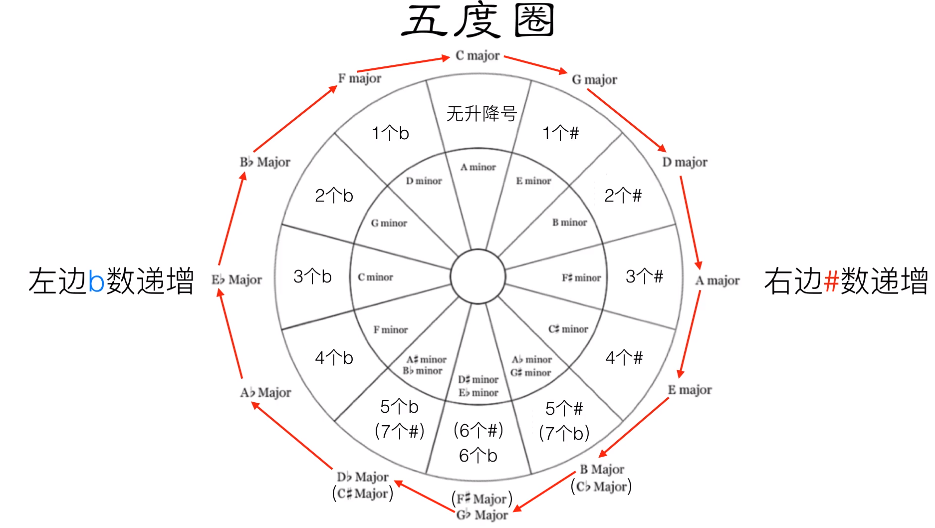

#### 为什么上图五度圈的下面有3个是同时存在2个调号?

我们以`#F大调`和`bG大调`为例，分析一下:

我们发现，有时同一条音阶有2种记谱方式(我们通常用`b`记号记谱的方式)

### [新]音符

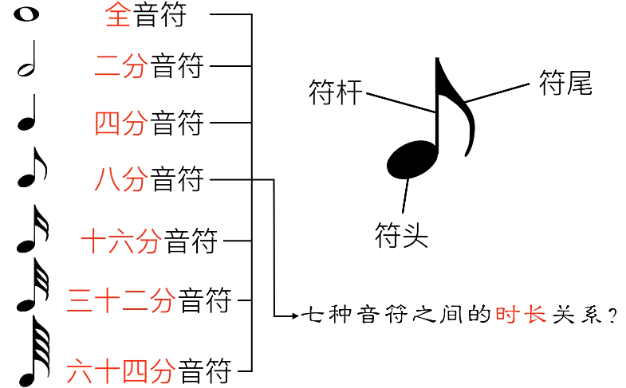

#### 音符的时长关系

如果以`全音符`占一个饼的时长为基础的话:

`二分音符`就是把饼分成2份，占其中一份:

以此类推

可以发现上面带尾巴的音符是可以连在一起的，但是音符太多的时候所有的音符连在一起显得眼花缭乱，我们可以进行分组着写:

#### 一个小节改写几个音符?

如图(简称四四拍)：

所以:

再如：

再再如:

我们发现红色箭头的尾巴没有全部连在一起:

为什么? 因为(正好分别组成一拍):

### [新]附点音符

什么是附点音符:

易错点:

eg.

如果音符写在五线谱的线上，附点该标在哪里?

### [新]休了止符

注意:

eg.

### [新]连音

如图，在4/4拍中，三个4分音符本来是3拍:

但是加上`3连音`的标记之后，就变成了2拍:

也就是，原本2拍内可以演奏2个音，变成3连音之后，现在2拍内要演奏3个音:

同理:

### [新]一节课认识所有和弦标注

什么是标注?

答: 就是各种和弦的口语简称(或书面简写)形式

上图中：`Major`英文意思是大调，`Minjor`是小调

这里，`大三和弦`中，`三音`变成`四音`，就成了`挂四和弦`,`三音`变成`二音`，就成了`挂二和弦`:

记不住怎么办? 答: 直接记住下图常用的算可以吧..吧..

### [新]同一个和弦为什么你弹得没别人好听

补充知识点:

同一个和弦为什么你弹得没别人好听:

即别人弹的色彩更丰富

#### 那么怎样才能让和弦色彩更丰富呢?

我们以下面这些和弦为例

##### 大和弦

eg1. 

`7音`是`7`，`9音`是`2`:

注意，你在即兴伴奏的时候千万不要有七和弦`CM7`，九和弦`CM9`的概念:

你要想的是，演奏根音左边的音，还是根音右边的音:

然后，根音左边的音`7`与根音的关系是`半音`，右边的音`2`和根音的关系是`全音`:

在实际演奏中，`九音`在大和弦里面，总是很好听,所以呢，使用九音可以很自由。但是七音在大和弦里面有时不好听，所以要慎重:

下面做个练习，比如:

上图中，根音左边的半音是`#1`,根音右边的全音是`3`，那么，在你的演奏中，加入`#1`或者`3`就可以让你的和弦色彩变得更丰富:

##### 小和弦

然后我们看小和弦

eg1.

七音是`5`，九音是`7`，在小和弦中，根音到七音和根音到九音，都是全音。在小和弦中，可以很自由的演奏七音，但是演奏九音要慎重:

下面做个练习，比如:

上图中，根音左边的全音是`1`，根音右边的全音是`3`:

##### 属七和弦

为什么上图有个`13音`?因为`13音`在属七和弦中蛮好听的，有点爵士的味道

然后根音到7音和九音都是全音，另外`13音`是在五音的右边，并且五音到13音也是全音,在属和弦中，这三个音都可以很自由的演奏:

下面做个练习，比如:

#### 最后我们来分析一首实际的伴奏案例

最上面的高音谱上的内容是旋律，中间的高音谱和下面的低音谱是和弦:

这一段的和声是用的`Leading Bass`：

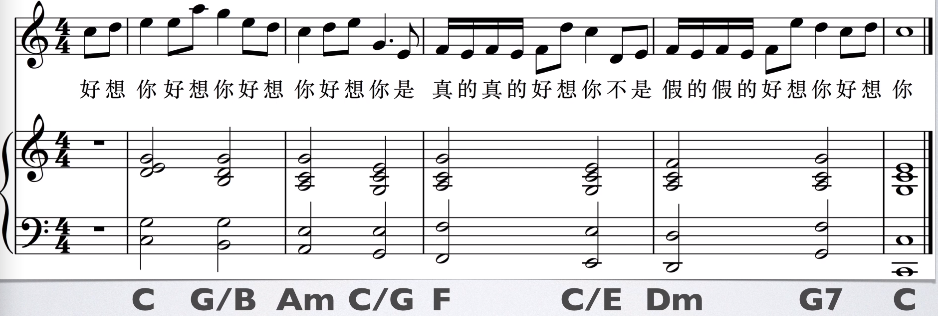

然后转位和弦就不能用于今天所学的技巧(因为转位和弦不是把1音作为最低音，而是把3/5/7/9音作为最低音的):

我们看第一个和弦`1 3 5`，根音左边是`7`，右边是`2`，在上面的钢琴中，我弹的是`2`：

同理:

### [新]别把和弦看得太死板

eg.

在`1`(低音谱)上面演奏`1 3 5`(高音谱)，你就看得懂，这是`C Major`:

在`4`(低音谱)上面演奏`4 1 6`(高音谱)，你也看得懂，这是`F Major`:

在`5`(低音谱)上面演奏`5 1 2`(高音谱)，你也看得懂，这是`属七挂四和弦`:

然后呢，`5 7 2`是`G7`和弦:

那么，现在你可能会问，这不是`G7`和弦啊?上图中并没有`4`啊!!:

上图没有`4`的解释: 难道本来演奏`5 7 2 4`的地方，没有`4`，就会变得不和谐吗?并不会。所以说，不要太死板

eg2.

在`1`(低音谱)上面演奏`2 3 5`(高音谱),居然就有人看不懂了:

上图还是`C`和弦啊

如果我在上面标个`Cadd9`,`Cadd9`总看得懂了吧:

上图中，`2`就是`九音`啊

好，当你看到`9和弦`的时候，你就只会演奏九和弦了吗?你也可以演奏成七和弦啊！！你随便弹啊，灵活点。所以，我在这里，只标记一个`C`就可以了:

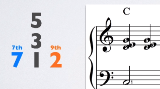

eg3.

在`5`(低音谱)上面演奏`6 1 4`(高音谱)，这就是`G7(sus4)`G7挂四和弦嘛:

然后呢，因为是挂四和弦，所以三音要变成四音:

所以，`5 6 1 4`是不是`G7挂四和弦`?

### [新]Leading Bass理论篇

* Bass: 低音
* Leading Bass: 顺阶(顺着音阶)低音

例如: 在如下五线谱中,因为在`低音谱`中是`1 7 6 5 4 3 2 5 1`，即`顺阶低音`, 所以这是`Leading Bass`:

#### 常识

* 和弦是由三个或三个以上的音，按照三度关系叠置起来。
* 主和弦：在主音（第Ⅰ级）上构成的三和弦，即1，3，5 。称为“主和弦”，记为T，主和弦出现再开头和结尾，并且接在属七和弦之后。和声的第一个弦必须是主和弦。(请参考`[新]关系大小调`章节)

#### 正片

音乐在开始的时候，一般要配`主和弦`，如果是`C自然大调`的话，一般就是配`C和弦`,Bass就是`1(do)`:

然后音乐在结束的时候，一般也是配`主和弦`,也就是有始有终:

在音乐结束的前一刻(半终止)，我们一般会配一个`属和弦`:

因为是`顺阶低音`，所以中间部分为(不懂的话记住就行):

可以看到，在`开始`我们配了`C`和弦，在`半终止`上我们配了`G`和弦，在`终止`上我们配了`C和弦`,但是在中间的`7 6 5 4 3 2`中我们该配哪些和弦呢?

首先我们把`C大调`的七个和弦写在一边，以方便配和弦:

因为最后一个和弦`7 2 4`是`减和弦`,它没什么用，我们直接排除掉:

然后我们把和弦标记写上:

首先，看这个低音,它是`7`:

在上面的和弦中，找到带`7`的和弦:

然后我们注意一个规则:

所以，这里不能配`Em`和弦:

* 弹幕解释1: 因为这里我们要的是7为根音，然而Em和弦的第二转位为735,5就跑到五音的位置上了，所以不要(五音做低音除了主和弦，其它的和弦不允许)
* 弹幕解释2: Em和弦要拿来做低音转位变成Em/b(7 3 5),但是五音做低音除了主和弦，其它的和弦不允许

所以这里就只能配`G`和弦:

因为低音是`7`,所以`5 7 2`是转位和弦，所以在G后面写个/B,指明这个和弦的低音是`7`：

接下来看这个低音，它是`6`:

在上面的和弦中，找到带`6`的和弦:

另外还有一个规则:

所以我们可以直接配`Am`:

我们再看这个低音，它是`5`:

在上面的和弦中，找到带`5`的和弦:

虽然`G`和弦在这里符合规则2，但是它是`属和弦`，属和弦有`半终止`性质,但是，我们并没有结束的意思，所以不配`G`和弦:

然后，虽然`C`和弦的`5`在这里是五音，但是它是主和弦，并没有被规则1约束:

所以这个地方可以配`C/G`和弦:

然后，`Em`也没被规则1约束,所以也可以配`Em/G`和弦:

我们再看这个低音，它是`4`:

在上面的和弦中，找到带`4`的和弦:

`F`和弦符合规则2，所以配`F`和弦:

我们再看这个低音，它是`3`:

在上面的和弦中，找到带`3`的和弦:

`Am`违反了规则1，所以排除，剩下的`C`和`Em`都可以配:

我们再看这个低音，它是`2`:

在上面的和弦中，找到带`2`的和弦:

`G`和弦违反了规则1，所以排除,那么就只剩下`Dm`和弦可以配了:

### [新]Leading Bass实用篇

这就是`Leading Bass`,因为它的低音是`1 7 6 5 4 3 2 5 1`:

然后，我们把和弦标记写上:

在上一章节里，我们说在半终止的地方要配属和弦，但在流行音乐中，我们经常在属和弦前面，加一个`Gsus4`和弦，来加强终止感:

上图中，原本在这里本应配两个`G`和弦，现在呢，就变成`Gsus4`和`G`

#### Leading Bass的作用

它几乎可以唱`30%`的流行歌曲

eg1.

还有`青春修炼手册` `好想你` `断了的弦` `星晴` `简单爱` `可惜没如果` `何必要在一起`

egx.

### [新]四度圈

什么是`四度圈`?

eg.

上图中，`x五度`反过来就是`x四度`

那么在`C自然大调`中，四度圈是从`F和弦`(解释: 大调四度圈的第一个和弦，就是大调的四级)开始，往后进行的,并且每个和弦之间都是相隔四度的，这样就组成了一个`四度圈`:

---

eg1.

eg2.

egx. `演员` `失落沙洲` `心墙` `甜甜的` `说了再见`

---

**注意:** 上面我们学习的`四度圈`和`Leading Bass`的适用范围都是`大调`的:

### 剩下的40%的和声套路(请先看`扩展知识点章节`)

`和声进行`之`1 4 5 1`(`C F G C`)

`和声进行`之`1 6 4 5`(`C Am F G`)

`和声进行`之`1 5 6 4`(欧美常用)

`和声进行`之`6 4 5 1`(`Am F G C`)

`和声进行`之`6 4 1 5`(`Am F C G`)

`和声进行`之`6 5 4 3`(`Am G F E7`)

`和声进行`之`2 5 1 6`(`Dm G C A7`)

### [新]转调和升调

#### 怎么转调

eg1. 从C调的主和弦开始，我想转到`bE`大调上去：

我就要找到`bE`大调的五级`V`(bB7和弦):

eg2.

这是好想你的副歌部分,从这个小节(红色划线处)就开始转调了:

前面是`C大调`，后面转调到了`bE大调`:

我们要通过`bE大调`的`V`五级来进行到`bE大调`：

但是，五级在这里弹四拍呢，会显得乏味，所以，我会在前面演奏挂四和弦:

那么，后面的和声进行呢，依然是`bE大调`的`Leading Bass`:

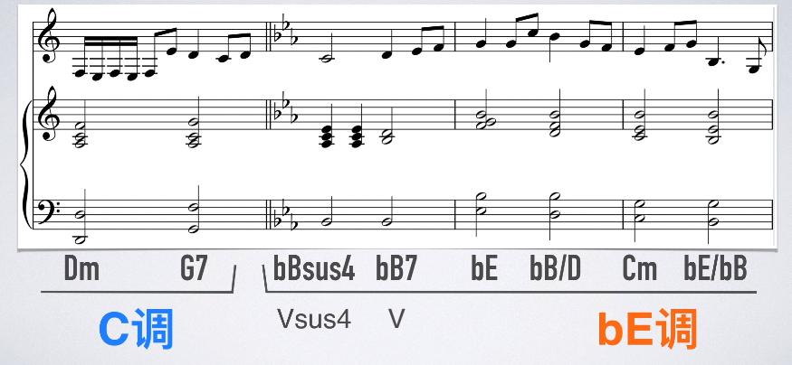

最后，有同学会问，在这个部分，为什么前面还是`bE大调`，怎么一下子就到了`E大调`呢:

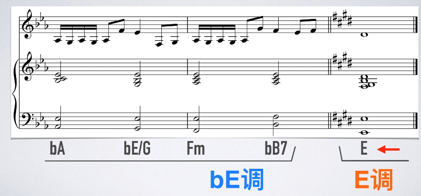

那么，请继续看下一章节`251和声进行理论`

### [新]251和声进行理论

首先我们看大调音阶,在`I` `II` `V`上分别构建`七和弦`:

我们来看它们的性质:

然后我们看小调音阶:

总结:

#### 251有什么用

提示：如果对一些概念不清晰，请回顾`[新]关系大小调`

比如有首歌，它是`C大调`，其中某个地方的和声是`Em7`后面紧接着`Dm7`,在这个地方我们可以使用`251`的技巧以丰富和声色彩:

首先，我们来看`Em7`到`Dm7`的根音相差，正好是大二度:

那么，在音程方面，符合`II`和`I`的规律:

然后，我们再看它们的和弦性质,`Em7`是小七和弦，`Dm7`是小七和弦，符合II和I的规律:

我们就试着在中间加一个`V`五级和弦,从而组成`215`进行:

那么因为`II`到`V`要是纯4度,所以根音是`A`:

而`V`是属和弦，所以是`A7`:

最后要注意的是，因为这首歌是`C大调`，C大调的`II` `V` `I`分别是这三个和弦:

所以下图中下部分是临时利用了其它调的`II` `V` `I`,简称为`离调`:

它和转调不同，因为这个临时的`I`一级正好是`C大调`的调内和弦，它是`C大调`的`II`二级:

### [新]251的运用

`2 5 1`的进行其实可以不是完整的，比如，可以只有`II`到`V`,`V`到`I`这样:

比如在`1 6 4 5`的和声进行上，我们可以使用`2 5 1`的技巧:

用法就是:

所以第一个和弦`CM7`就不能作为和弦,因为如果在`CM7`前面再配一个和弦，`CM7`就不再是第一个和弦了:

所以就只能从第二个和弦开始，它是`小七和弦`:

小七和弦可以作为`II`或者`I`：

但是，刚才已经讲得很清楚了，是在目标和弦的(`Am7`)前面配和弦:

如果把`Am7`当成`II`的话，你就不知道在它的前面该配什么和弦了:

所以就只能把它(`Am7`)当成`I`,在它的前面配一个`V`:

那么它(`Am7`)的`V`(这里看不懂的话可以回顾`关系大小调章节`)就是`E7`和弦(这里不能是`Em7`和`EM7`,因为只有`E7`是属和弦，不懂的话可以回顾`[新]一节课认识所有和弦标注`):

我们继续看下一个和弦，它是`FM7`大七和弦，大七和弦就只能作为`I`了,所以在`FM7`前面配一个`V`和弦,`FM7`的五级和弦是`C7`:

最后一个和弦是`G7`属七和弦，只能作为`V`,`V`前面配`II`，所以:

上图中: `Dm7`是D小七和弦，`Do7`是D半减七和弦。

接下来我就用钢琴给大家弹奏一下:

eg2.

上面的是原版`Leading Bass`,下面的是加了`2 5 1`的`Leading Bass`，下面我给大家分别弹奏一下，大家听下效果:

听完之后，你可能觉得还不错，但是其实加上旋律之后，听起来还是怪怪的，然后经过我这几天的研究发现，如果把转位和弦前面的新配和弦去掉，就ok了:

结论: 转位和弦不太适合作`目标和弦`:

eg3.

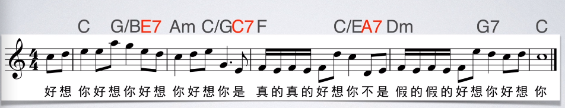

.............

### [新]小调Leading Bass

.......

### [新]小调四度圈

小调四度圈的第一个和弦，就是小调的四级。

eg. 如果是a小调的话，那么第一个和弦，就是`Dm`,然后和大调四度圈一样，依次组成四度:

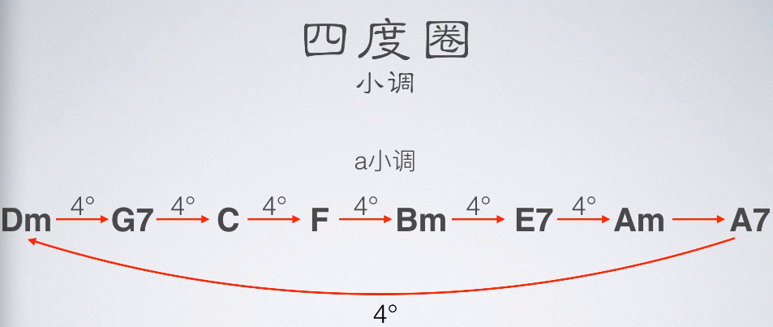

### [新]大七和弦终止法

大家都知道，音乐在结束的时候，可以配主和弦，但是，学到一定程度后，总是用主和弦，会显得无聊，所以要试试新花样(/滑稽):

所以就有了:

大家都知道，主和弦，具有让音乐开始和结束的功能,在C自然大调中，主和弦就是`CM7`C大七和弦,这就表示，主和弦就是大七和弦，大七和弦就是主和弦:

这就意味着，大七和弦也具有让音乐开始或结束的功能。

首先我们来看开始的功能,以大调为例，在我们之前学习过的和弦进行中，总是以C和弦或F和弦作为第一个和弦来开始:

比如:

接下来我们看终止功能,大家都知道，属和弦后面接主和弦:

现在我们换个思路,把它理解为属和弦后接大七和弦:

这样我们的可选择性就多了,比如，`降D Major`也是大七和弦，那么`G7`通常也可以很顺畅的进行到`bDM7`：

再比如：

虽然我们已经听完了所有的属和弦后接大七和弦的钢琴演奏，都很顺畅，但是要注意和弦与旋律的配合，一般情况下，旋律都结束在主音`1`上:

但是`1`是`B Major`(`7 #2 #4 #6`)的和弦外音,所以在`BM7`上，演奏`1`，是非常难听的,
所以这种情况下，你就需要把旋律音`1`改成离`1`最近的和弦音，离`1`最近的和弦音是`7`或`#2`:

但是如果旋律是由歌手演唱的话，让歌手唱`#2`是一个比较大的考验，但是，如果让歌手唱`7`的话，难度就会小很多:

当然了，如果是下面这种情况就不需要该变旋律了:

### [新]降六降七终止法

大家都知道，`G7`属七和弦后面一般接`C`和弦，比如蒲公英的约定:

然而，为了不那么无聊，我们会在其之间，插两个和弦:

### [新]六级终止法

大家都知道，`G7`属七和弦后面一般接`C`和弦，比如:

然而，为了不那么无聊，我们也可以在`G7`后接`Am`,并且`Am`不能作为停止，后面还得接和弦:

eg1.

eg2.

### [新]利底亚音阶终止法

大家都知道，大调音阶是:

而这七个音呢，又可以构造七条音阶,比如这条音阶叫:

这七条音阶分别是:

我们来看圈起来的红色部分是什么和弦:

最后我们发现，只有`利奥尼亚`和`利底亚`包含大七和弦,那么反过来，这也意味着，可以在大七和弦上，演奏这两条音阶。

我们知道，在自然大调里的音程关系是:

同理:

那么，在流行音乐中，很初学者都是在C和弦上演奏`伊奥尼亚`音阶，在F和弦上演奏`利底亚`音阶:

但，如果你想让你的和弦色彩更丰富的话，你可以在C和弦上演奏`利底亚`音阶,那么音阶的关系就要变成`全全全半全全半`,那么`4`就得升高变为`#4`:

同理，也可以在F和弦上演奏`伊奥尼亚`音阶,音阶关系就得变为`全全半全全全半`,那么`7`就得降低为`b7`:

eg.

以蒲公英的约定为例，最后一个和弦是C和弦，它是大七和弦，所以我们可以在这个和弦上演奏利底亚音阶:

刚才演奏的是分解和弦，现在再来看看演奏柱式和弦的效果:

### [新]大七和弦终止法II

......

### 扩展知识点 

#### 什么是1645

在五线谱中则体现在`低音谱`中:

上面的就是`4 7 3 6 2 5 1`,如果把`Bdim/F`替换成`G`,就是现在最火的`4 5 3 6 2 5 1`

---------------------------------------------------

### [旧]用理论(和弦的功能)给旋律配和弦

我们在和弦里，只有三种功能(`主 下属 属`)：

`上主` `中` `下主`没什么用,先划掉:

这个`减和弦`用的比较少，先去掉:

现在我们来看剩下的六个和弦分别属于什么功能组:

上图中，`1 3 5`属于`主`功能组，`4 6 1`属于`下属`功能组，`5 7 6`属于`属`功能组，这自是不用多说。

现在我们来看第二级的`2 4 6`属于什么功能组，我们只需要看`2 4 6`和图中圈起来的`主` `下属` `属`的共同音即可，我们观察发现`2 4 6`和`下属`和弦(`4 6 1`)有两个共同音，所以`2 4 6`具有`下属`的功能,属于`下属`功能组:

现在我们再看`III`的`3 5 7`,`3 5 7`和主和弦`1 3 5`有两个共同音，所以`3 5 7`具有`主`的功能，属于`主`功能组:

但是`II`的`3 5 7`和`V`的`5 7 2`也有两个共同的音，所以`3 5 7`也属于`属`功能组:

同理:

现在我们已经知道了它们分别属于什么功能组，接下来我们看它们的功能进行(顺序),我们先把它们各自对应的功能组标上:

* T(Tonic): 主
* S(Subdominant)：下属
* D(Dominant)：属

首先，`T`后面可以接`S`，也可以接`D`,然后，`属功能`组基本只能到`主功能`组，`属功能`组不能到`下属功能`组，但是在流行音乐里，`属功能`组可以到`下属功能`组(`Am`除外，通常是到下属功能组的`F`),`S`可以到`T`和`D`:

例如，经典的和声进行`1 5 6 4`：

下面我们来看一个给旋律配和弦的例子:

.......

### [旧]基础钢琴的编写

### [旧]钢琴分解技巧1

我们以`1 6 4 5`进行为例:

`C和弦`是`1 3 5`:

`Am`是`6 1 3`:

所以`1 6 4 5`和声进行为：

首先，把中间黑色的音提高一个`8度`(因为乐理上说`最低音`和`次低音`之间要大于等于`五度`):

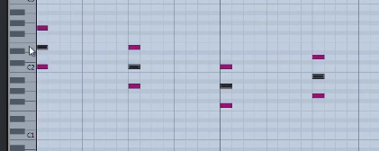

然后，把和弦变成错开成分解和弦(提示:分解和弦，在不同时刻分别弹奏一个音；柱式和弦,在同一时刻同时弹奏多个音):

再加上延音踏板:

我们听下效果，发现好像还是有点不自然，那么我们可以在加一些音上去,首先我们看第一个和弦，它是`1 3 5`,`1 3 5`和弦还可以弹`7`和`2`这两个音,比如我这里加个`2`:

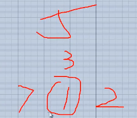

我们听下效果，发现好听多了。

同理:

现在我们听下效果。

刚才的是第一种方式，现在我们看第二种方式，就是把图中黑色部分的三个音复制并向右平移:

全部复制移动后，我们再听下效果,发现也很不错：

其实现在上面这个伴奏就已经可以唱很多歌了，比如《童年》。

我们再把上面的和弦改变一下(变化规律请看):

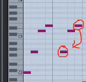

变化规律请看:

再变第二个和弦:

同理，最后为:

我们再改变下钢琴的力度，随便点就好了(记住，弹钢琴要要像弹棉花一样软软的弹):

然后我们听下效果，发现很不错。

### [旧]钢琴分解技巧2

请看如图的《周杰棍》，高音谱(右手弹奏)是持续律动(循环重复的一个旋律)，低音谱(左手弹奏)是和弦:

再如《不能说的蒲公英》(蒲公英的约定和不能说的秘密):

根据上面的套路[高音谱(右手弹奏)是持续律动(循环重复的一个旋律)，低音谱(左手弹奏)是和弦(一个是和弦的根音，另一个是和弦的五度音)]，我们现在可以给歌曲编曲。

eg1.

上面的是我们随便弹的一个持续律动，下面的是随便弹的一个和弦进行(这里用的是`1 6 4 5`)。

eg2.

eg3.

### [旧]钢琴分解技巧3

请观察下面这个`1 6 4 5`的和弦进行:

套路:下面的是和弦的两个音, 上面的旋律是对应和弦的和弦内的音。

请看,以第一个`C`和弦为例：

所以呢，我们就可以以这样的套路自由发挥,随便弹。

### [旧]钢琴柱式和弦技巧1

我们还是以`1 6 4 5`为例:

然后我们上面右手弹的三个音拉短一点，并且复制右移过去:

我们可以用上面的伴奏来唱下《童年》,(提示: 上面伴奏的弹法是左手弹一下，右手弹两下,并且每个和弦开始处同时弹下左手和右手)

再弹《听妈妈的话》，这时我们可以左手弹一下，右手弹四下

写法二(我们以`6 4 5 1`为例):

然后把中间的音提高一个`8度`(因为前面说过，最低音和次低音要>=五度):

现在色彩太单调，我们可以再给和弦分别随便加上相应和弦内的音:

复制平移：

### [旧]钢琴柱式和弦技巧2

什么是平稳进行，如图，只要不超过三度(如:5--->3)就是平稳进行:

再如，下面的`五部同向`(箭头之间是方向是一样的)，且相邻两个红色箭头之间不超过三度:

上图的和弦虽然理论上没有问题，但是这样`同向`的和弦听起来的效果却偏向网络风，或者说比较`low`。

所以我们尽量不要让所有的箭头`同向`,比如,随便把某个音变换一个8度(转位):

比如，我可能会这样弹`1 6 4 5`：

但是我们在即兴伴奏的时候，如果要考虑什么同向问题的话，我们可能会反应不过来，所以我们这里教个实用的技巧，即找到所有和弦的共同音，然后保持共同音:

然后其它的按和弦里面的音就可以了:

### [旧]钢琴柱式和弦技巧3

请观察对比下面两个`1 6 4 5`的区别:

即，每弹完最后一拍，加一个五音:

### [旧]钢琴柱式和弦技巧4

我们这次以`Leading Bass`为例:

上面低音谱虽然只有一个音，但是低音我们一般弹两个音或两个音以上:

然后，请自行观察下面的规律套路：

低音谱:

高音谱:

我们弹一下，听下效果。

#### 套路二

再在上图的基础上，把左手弹的图中两个音选中，缩短，复制成四份:

再次选中:

往后拖动一点点:

我们弹一下，听下效果。

### [旧]钢琴柱式和弦技巧(加花)

* 加花: 随便加一些很短的旋律。

我们还是以`1 6 4 5`为例,其中一种弹法是这样:

但是我现在就是不想这么弹，该如何变化：

上图中，我们在一些和弦(每个和弦都可以，好听就行)上加入了`7 1 5`这个随便想的短旋律(随便什么，好听即可)。我们听下效果

再如:

再如，还可以层层递进，第一遍`1 6 4 5`的时候上面的右手只弹一下，第二遍的时候右手弹两下:

### [旧]乐段间的过度技巧

我们知道一个乐段结束的时候是用半终止，半终止是`V`的`G`和弦,`G`和弦的前后一般是:

过度时，我们可以在`G`和弦后加几个音起过度效果,比如:

### [旧]使钢琴更人性化

..............

### [旧]踏板的处理

..............

### [旧]钢琴编写总结

..............

### [旧]吉他分解技巧1

