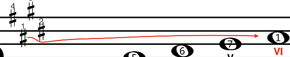

    编曲入门.md
    
    :Author: kalipy
    :Email: kalipy@debian
    :Date: 2021-05-07 22:44

### [新]认识五线谱

高音谱号中:

低音谱号中:

记住: 五线谱的低音谱表的do在上加一线上，高音谱表的do在下加一线上。

为了方便识别音，我们要记住`do`在五线谱中的位置:

在钢琴中，五线谱中的音与钢琴键之间的对应关系如图(红色的`1`是`中央C`):

**重要:**高音谱一般用右手弹，低音谱一般用左手弹,高音谱和低音谱一般(共同组成一个完整的xx和弦)同时弹奏

如上图，高低两个谱构成一个七和弦，但是高音谱只有三个音，下面低音谱怎么看？还有低音谱的那两个音代表什么，怎么判断？(这里看不懂什么是`七和弦`没关系，后面会讲)

答：低音谱表的那两个音是do，这个七和弦是左手两个do右手357

### 音的认识

`#`为升号，`b`为降号,上图`#D`升D和`bE`降E是同一个音

### 什么是半音

* 只要两个键(音)中间夹着一个键(音)，这两个键就是全音的关系
* 只要两个键(音)相邻，这两个键(音)就是半音的关系

### 音程

* 音程，指两个音级在音高上的相互关系，就是指两个音在音高上的距离而言，其单位名称叫做度。
* 音程是指两个乐音之间的音高关系，用“度”表示。以简谱为例，从1到1，或从2到2都是一度，从1到3或2到4都是三度，从1到5是五度。度是一种单位，用来衡量音与音之间的听觉上的距离。

#### 怎么判断两个音之间有多少度

只看数字，不看升降记号,上图`#4`到`7`,`4`到`7`,`4`到`b7`,`#4`到`b7`都是`4度`的距离

#### 纯 增 减 大 小 属性的由来

* 因为上面的`#4`到`7`,`4`到`7`,`4`到`b7`,`#4`到`b7`都是`4度`的距离,我们只根据`4度`这个单位并不能确定到底是`#4`到`7`还是`xx`到`yy`,所以要用`属性`来区分
* 纯: 音程为`1 4 5 8`度的两个音的关系，以`纯`基准来称呼(倍减<-减<-纯->增->倍增)
* 大小: 音程为`2 3 6 7`度的两个音的关系，以`大`基准来称呼(倍减<-减<-小<-大->增->倍增)

#### 什么是纯xx度(以钢琴标准键为标准)

以钢琴标准键为标准(起始音为`C`),叫做`纯xx度`：

上图为`纯4度`

#### 什么是倍减<-减<-纯->增->倍增

以钢琴标准键为标准(起始音为`C`),在`纯xx度`的基础上，向上升一个键(音)，则为`增`：

上图为`增4度`

---

然后在`增4度`的基础上，再向上升一个键(音)，则为`倍增`:

上图为`倍增4度`

---

减和倍减则是相反，即以钢琴标准键为标准,在`纯xx度`的基础上，向下降一个键(音)，则为`减`，然后再向下降一个键(音)，则为`倍减`

#### 非钢琴标准键盘(起始音不是`C`)上的两个音之间的音程关系怎么确定?

1. 以标准键盘为标准:

    

    

    上图`纯4度`之间夹着4个键

2. 把键数4记下，以此为参照

3. 然后我们随便找个非标准键盘的两个键，通过数这两个键夹着的键数，把之与刚才在标准键盘下记下的键数4进行比较，就可以很好的判断其关系了，比如:

    

    上图也是`纯4度`，因为在非标准键盘下两个键中间夹着的键数(4个)等于在标准键盘下两个键中间夹着的键数(4个)

4. **注意：** 如果在非标准键盘下夹着的键数比在标准键盘下夹着的键数少/多，则根据`倍减<-减<-纯->增->倍增`依次向左/右推。比如：如果非标准键盘下夹着的键盘数为`5个`，比在标准键盘下的`4个`多一个，则为`增4度`，如图(`F`和`B`的关系就是`增4度`)

    

### 和弦

* 和弦是指有一定音程关系的一组声音，即将三个或以上的音，按照三度或非三度的叠置关系，在纵向上加以结合，就称为和弦。

* 在音频器材的工业设计方面，和弦也叫复音，指的是多个音源同时发音。一般在钢琴上，是三和弦和七和弦，很少有九和弦。在吉他里，和弦一般是用扫的，也有分解的，另外一种和弦有多种按法。

* 构成和弦的诸音，叫做该和弦的和弦音。在和弦的基本形态中，最下端的一音，叫做“根音”

### 三和弦

    三和弦(Triad)的构成是由三个音按三度叠置而成的一种和弦,或称“三和音”。构成和弦的每一个音，都有名字：
    根音：和弦最下面的音。这个音是和弦的基础，在和弦的原始排列中处于最低位置。
    三音：根音上的三度音。在三和弦的原始排列中处于中间位置。
    五音：根音上的五度音称为五音。在三和弦的原始排列中处于最高位置。
    音阶各度均可作为根音，于其上方加入三音与五音而构成三和弦。

比如:

在根音的基础上，往上构2个3度(一般是大/小3度)

上图为`大三和弦`(大三度+小三度构成的三和弦叫大三和弦)

    大三和弦 = 大三度 + 小三度
    小三和弦 = 小三度 + 大三度
    增三和弦 = 大三度 + 大三度
    减三和弦 = 小三度 + 小三度

### [新]七和弦

eg.

### [新]和弦的走位

原位:

把`1`升高一个`8度`，就得到了`第一转位`:

继续把`3`升高一个`8度`，就得到了`第二转位`:

再继续把`5`升高一个`8度`，就回到了`原位`:

再如:

### [新]自然大调(听起来像12345671的音阶)

特点: 音程结构为`全全半全全全半`的音阶，为自然大调

上图中,因为这条音阶的第一个音为`1`,所以是`C大调`

虽然钢琴一共有88个键，但是一共就只有12个键(音)组成:

既然有12个键(音)，就意味着每个音可以作为第一个音构建共12条音阶,即一共有12个自然大调:

### [新]调号

12个自然大调的特点:

* `C大调`是唯一没有升降记号的大调
* 这些大调要么都是`#`升记号，要么都是`b`降记号

#### 怎么根据一条音阶的升降记号来判断这条音阶是什么调，和对应的调有几个升/降记号?

请看，下图的`4 1 5 2 6 3 7`和`7 3 6 2 5 1 4` 分别是升号调和降号调的记忆口诀:

##### 对于升记号而言的口诀

eg1. 比如一条音阶有1个`#`升记号,则调号要比第一个`#`所对应的口诀中的音高一个全音，所以是`G(5)大调`:

eg2. 再比如，一条音阶有2个`#`升记号,则调号要比第2个`#`所对应的口诀中的音高一个全音，所以是`D(2)大调`:

eg3. 以此类推

##### 对于降记号而言的口诀

eg1. 比如一条音阶有**2个**`b`降记号,则第一个`b`前面那个`b`所对应的口诀中的音就是调号，所以是`bB(b7)大调`:

eg2. 以此类推

#### 练习

请根据下面的五线谱内容说出它是什么调，以及写出该调的音阶

答:

1. 因为它有4个`#`记号，所以调号要比第4个`#`所对应的口诀中的音高一个全音，所以是`E(3)大调`

2. 4个升记号对应口诀中的:

    

3. 在五线谱中对应的音(根据口诀中圈出的音)中添加`#`记号

4. 最后结果如图:

    

#### 概念

既然有了调号，那么音的升/降记号就可以省略：

既然省略了，那么我们在实际弹钢琴的时候就要注意，弹的时候要把省略的升/降记号在内心补上，并且要弹补上`#/b`后的那个(音)键

eg. 比如我们在五线谱上看到`4`这个音，即使在五线谱上没有看到省略前的`#`记号，但是这个音就是`#4`, 在弹的时候就要弹`#4`这个键:

### [新]关系大小调

#### 自然大调

这是C自然大调，它的每个音都对应一个级数和一个属性:

我们平常听到的`主和弦` `下属和弦`等等，就是在`I` `IV`级数上构建的和弦:

再如:

#### 自然小调

小调就是以自然大调的六音作为第一个音构建的音阶

可以发现，上图中小调与大调的音完全一样，只是顺序不一样而已，又因为它们有7个共同的音，所以这俩条音阶互为`关系大小调`

再如:

这是它们在五线谱上的形式:

根据大调怎么确定小调?

答: 只需把大调的主音往下移动`小三度`即可,请看

### [新]调性

除了`自然大/小调`,其实还有`xx大小调`,转换(通过升降音)关系请看:

#### 练习

这是`E自然大调`和`#C自然小调`，请分别写出它们的`和声大/小调`和`旋律大/小调`:

为了照顾对五线谱调号不熟悉的朋友，我把被省略`#记号`的`音`标出来了(怎么来的，请参见`[新]调号`章节):

eg1. 找`E自然大调`的`和声大调`:

1. 把`自然大调`变为`和声大调`就是降低`第六音`:

    

2. `6音`是`#1`，所以`#1`降低后就是`还原1`(还原的符号键盘我打不出来，请看下图):

    

eg2. 找`E自然大调`的`旋律大调`:

1. 把`自然大调`变为`旋律大调`就是降低`第六音`和降低`第七音`

2. 所以`旋律大调`如图:

    

##### 总结

这一共的6条音阶在五线谱记谱上都是同一个调号(都是4个`#`号)，所以一个调号能写出6条音阶:

而我们之前学过14个调号，那么一共就有14个x6条=84条音阶

### [新]五声音阶

什么是`五声音阶`?

答: 在自然大调的基础上，省去`第四级音`和`第七级音`，剩下的音所组成的音阶就是`五声音阶`

原本:

去掉之后:

额外知识:

### [新]五度圈快速记住所有调号

上图中，最外圈的相邻`xx major`和`yy major`之间都隔了`纯五度`，请看`C major`->`G major`

通过五度圈，我们就可以方便记住所有调号,以及每个调号有多少个升降号:

#### 为什么上图五度圈的下面有3个是同时存在2个调号?

我们以`#F大调`和`bG大调`为例，分析一下:

我们发现，有时同一条音阶有2种记谱方式(我们通常用`b`记号记谱的方式)

### [新]音符

#### 音符的时长关系

如果以`全音符`占一个饼的时长为基础的话:

`二分音符`就是把饼分成2份，占其中一份:

以此类推

可以发现上面带尾巴的音符是可以连在一起的，但是音符太多的时候所有的音符连在一起显得眼花缭乱，我们可以进行分组着写:

#### 一个小节改写几个音符?

如图(简称四四拍)：

所以:

再如：

再再如:

我们发现红色箭头的尾巴没有全部连在一起:

为什么? 因为(正好分别组成一拍):

### [新]附点音符

什么是附点音符:

易错点:

eg.

如果音符写在五线谱的线上，附点该标在哪里?

### [新]休了止符

注意:

eg.

### [新]连音

如图，在4/4拍中，三个4分音符本来是3拍:

但是加上`3连音`的标记之后，就变成了2拍:

也就是，原本2拍内可以演奏2个音，变成3连音之后，现在2拍内要演奏3个音:

同理:

### [新]一节课认识所有和弦标注

什么是标注?

答: 就是各种和弦的口语简称(或书面简写)形式

这里，`大三和弦`中，`三音`变成`四音`，就成了`挂四和弦`,`三音`变成`二音`，就成了`挂二和弦`:

记不住怎么办? 答: 直接记住下图常用的算可以吧..吧..

### [新]同一个和弦为什么你弹得没别人好听

补充知识点:

................................................

### [新]Leading Bass理论篇

* Bass: 低音
* Leading Bass: 顺阶(顺着音阶)低音

例如: 在如下五线谱中,因为在`低音谱`中是`1 7 6 5 4 3 2 5 1`，即`顺阶低音`, 所以这是`Leading Bass`:

#### 常识

* 和弦是由三个或三个以上的音，按照三度关系叠置起来。
* 主和弦：在主音（第Ⅰ级）上构成的三和弦，即1，3，5 。称为“主和弦”，记为T，主和弦出现再开头和结尾，并且接在属七和弦之后。和声的第一个弦必须是主和弦。(请参考`[新]关系大小调`章节)

音乐在开始的时候，一般要配`主和弦`，如果是`C自然大调`的话，一般就是配`C和弦`,Bass就是`1(do)`:

然后音乐在结束的时候，一般也是配`主和弦`,也就是有始有终:

在音乐结束的前一刻(半终止)，我们一般会配一个`属和弦`:

因为是`顺阶低音`，所以中间部分为(不懂的话记住就行):

可以看到，在`开始`我们配了`C`和弦，在`半终止`上我们配了`G`和弦，在`终止`上我们配了`C和弦`,但是在中间的`7 6 5 4 3 2`中我们该配哪些和弦呢?

首先我们把`C大调`的七个和弦写在一边，以方便配和弦:

因为最后一个和弦`7 2 4`是`减和弦`,它没什么用，我们直接排除掉:

然后我们把和弦标记写上:

### [新]Leading Bass实用篇

........................

### [新]四度圈

什么是`四度圈`?

eg.

上图中，`x五度`反过来就是`x四度`

那么在`C自然大调`中，四度圈是从`F和弦`开始，往后进行的,并且每个和弦之间都是相隔四度的，这样就组成了一个`四度圈`:

---

**注意:** 上面我们学习的`四度圈`和`Leading Bass`的适用范围都是`大调`的:

### 剩下的40%的和声套路

`和声进行`之`1 4 5 1`(`C F G C`)

`和声进行`之`1 6 4 5`(`C Am F G`)

`和声进行`之`1 5 6 4`(欧美常用)

`和声进行`之`6 4 5 1`(`Am F G C`)

`和声进行`之`6 4 1 5`(`Am F C G`)

`和声进行`之`6 5 4 3`(`Am G F E7`)

`和声进行`之`2 5 1 6`(`Dm G C A7`)

### 转调和升调

...............

### 扩展知识点 

#### 什么是1645

在五线谱中则体现在`低音谱`中:

上面的就是`4 7 3 6 2 5 1`,如果把`Bdim/F`替换成`G`,就是现在最火的`4 5 3 6 2 5 1`

