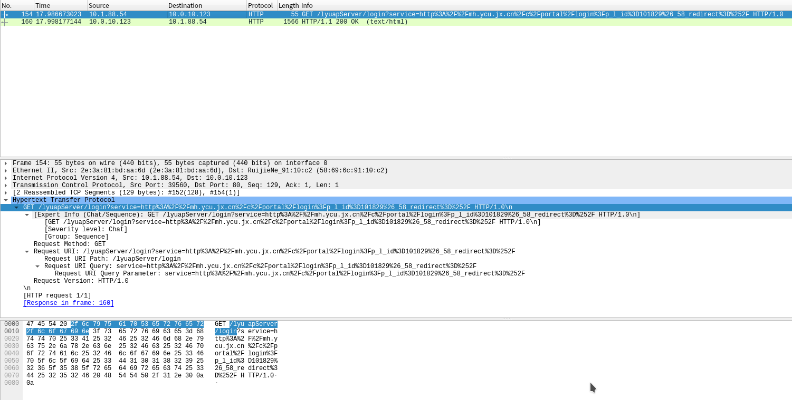
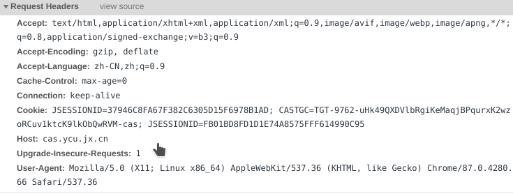
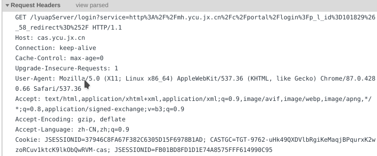
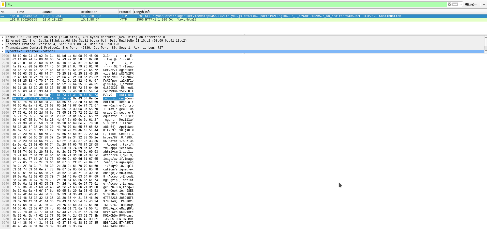

```
linux命令行下发https请求.md

:Author: kalipy
:Email: kalipy@debian
:Date: 2020-12-18 22:52
```

### test01

1. 如下，发个get请求(不要在zsh或fish中执行):
    ```
    kalipy@debian:~$ exec 8<> /dev/tcp/www.baidu.com/80
    kalipy@debian:~$ echo -e "GET / HTTP/1.0\n" 1>& 8
    kalipy@debian:~$ cat 0<& 8
    HTTP/1.0 200 OK
    Accept-Ranges: bytes
    Cache-Control: no-cache
    Content-Length: 14615
    Content-Type: text/html
    Date: Fri, 18 Dec 2020 14:56:14 GMT
    P3p: CP=" OTI DSP COR IVA OUR IND COM "
    P3p: CP=" OTI DSP COR IVA OUR IND COM "
    Pragma: no-cache
    Server: BWS/1.1
    ```

### 说明

1. `exec 8<> /dev/tcp/www.baidu.com/80`中  
    `exec`代表执行命令  
    `<>`代表标准输入和输出  
    `/dev/tcp/www.baidu.com/80`代表一个socket  
    `8`是文件描述符`fd`,这里我随便写了个8  

2. `echo -e "GET / HTTP/1.0\n" 1>& 8`中  
    `-e`表示对`\n`进行转义，`\n`是换行的意思  
    `1>`代表标准输出,`1>& 8`表示把标准输出重定向到文件描述符8,即通过echo向8中写入数据`"GET / HTTP/1.0\n"`,`"GET / HTTP/1.0\n"`是我们构造的请求头(根据http协议)  

3. `cat 0<& 8`中
    `0<& 8`表示把文件描述符8的内容重定向到标准输入,`0<`代表标准输入

4. 为什么`1>& 8`和`0<& 8`要加`&`,而不是直接`1>8`或`0<8`  
    因为`1>8`是表示创建一个文件8,把标准输出的内容写到文件8的意思,你试一下`ls  1> 8`就知道了

5. 注意:`GET / HTTP/1.0\n`中的`GET`一定要全部大写，网上的垃圾教程很多都是复制粘贴的`Get`，结果一直报错误导新人

### test02

1. 请再看:
    ```
    kalipy@debian:~$ ls /proc/self/fd/ -l
    总用量 0
    lrwx------ 1 kalipy kalipy 64 12月 18 23:54 0 -> /dev/pts/2
    lrwx------ 1 kalipy kalipy 64 12月 18 23:54 1 -> /dev/pts/2
    lrwx------ 1 kalipy kalipy 64 12月 18 23:54 2 -> /dev/pts/2
    lr-x------ 1 kalipy kalipy 64 12月 18 23:54 3 -> /proc/18428/fd
    kalipy@debian:~$ exec 8<> /dev/tcp/cas.ycu.jx.cn/80         
    kalipy@debian:~$ echo -e "GET /lyuapServer/login?service=http%3A%2F%2Fmh.ycu.jx.cn%2Fc%2Fportal%2Flogin%3Fp_l_id%3D101829%26_58_redirect%3D%252F HTTP/1.0\n" 1>& 8 
    kalipy@debian:~$ ls /proc/self/fd/ -l                                                   总用量 0
    lrwx------ 1 kalipy kalipy 64 12月 18 23:58 0 -> /dev/pts/2
    lrwx------ 1 kalipy kalipy 64 12月 18 23:58 1 -> /dev/pts/2
    lrwx------ 1 kalipy kalipy 64 12月 18 23:58 2 -> /dev/pts/2
    lr-x------ 1 kalipy kalipy 64 12月 18 23:58 3 -> /proc/18549/fd
    lrwx------ 1 kalipy kalipy 64 12月 18 23:58 8 -> 'socket:[1768172]'
    kalipy@debian:~$ cat 0<& 8                                                   
    HTTP/1.1 200 OK
    ```

2. wireshark抓包结果如下(请观察请求头):


3. 为什么不用`mitmproxy`抓包，没办法，通过`exec 8<>`走的是tcp(虽然我们的数据是http格式),`mitmproxy`识别不到我们的请求，相比之下，`wireshark`就比较厉害和智能，不但识别到，还正确的识别为了`http`协议

### test03

1. 谷歌浏览器f12,访问`http://cas.ycu.jx.cn/`


2. 点击`view source`,显示原始(raw)请求头


3. 把其复制保存到q.txt中:
    ```
    kalipy@debian:~$ more q.txt
    GET /lyuapServer/login?service=http%3A%2F%2Fmh.ycu.jx.cn%2Fc%2Fportal%2Flogin%3Fp_l_i
    d%3D101829%26_58_redirect%3D%252F HTTP/1.0
    
    Host: cas.ycu.jx.cn
    
    Connection: keep-alive
    
    Cache-Control: max-age=0
    
    Upgrade-Insecure-Requests: 1
    
    User-Agent: Mozilla/5.0 (X11; Linux x86_64) AppleWebKit/537.36 (KHTML, like Gecko) Ch
    rome/87.0.4280.66 Safari/537.36
    
    Accept: text/html,application/xhtml+xml,application/xml;q=0.9,image/avif,image/webp,i
    mage/apng,*/*;q=0.8,application/signed-exchange;v=b3;q=0.9
    
    Accept-Encoding: gzip, deflate
    
    Accept-Language: zh-CN,zh;q=0.9
    
    Cookie: JSESSIONID=37946C8FA67F382C6305D15F6978B1AD; CASTGC=TGT-9762-uHk49QXDVlbRgiKe
    MaqjBPqurxK2wzoRCuv1ktcK9lkObQwRVM-cas; JSESSIONID=FB01BD8FD1D1E74A8575FFF614990C95
    ```

4. 接下来把q.txt中的原始(raw)请求头发送给`cas.ycu.jx.cn`
    ```
    kalipy@debian:~$ exec 8<> /dev/tcp/cas.ycu.jx.cn/80
    kalipy@debian:~$ cat q.txt >& 8
    kalipy@debian:~$ cat 0<& 8
    
    HTTP/1.1 200 OK
    ```

5. wireshark抓包结果如下(请观察请求头):


6. 通过观察请求头，可以发现，`q.txt`里的内容正确的全部发送了

### 这个东西有什么用?

1. 方便测试，比如写嵌入式的网络请求，一般都是通过c语言来组装拼接构造http请求的，直接写比较容易写错，所以可以先测试，通过后，在把测试了的没问题的请求头和请求体复制到c函数中修改即可

2. 为了学习`fd`和`<>`

3. 顺便学习`wireshark`和`mitmproxy`的使用

4. 加深对http协议的理解

### 结束

1. 通过`exec 8<>`建立的socket,好像不支持`HTTP/1.1`,请求头中记得改成`HTTP/1.0`即可

2. 收尾工作，请看:
    ```
    kalipy@debian:~$ ls /proc/self/fd/ -l
    总用量 0
    lrwx------ 1 kalipy kalipy 64 12月 19 10:42 0 -> /dev/pts/2
    lrwx------ 1 kalipy kalipy 64 12月 19 10:42 1 -> /dev/pts/2
    lrwx------ 1 kalipy kalipy 64 12月 19 10:42 2 -> /dev/pts/2
    lr-x------ 1 kalipy kalipy 64 12月 19 10:42 3 -> /proc/10632/fd
    lrwx------ 1 kalipy kalipy 64 12月 19 10:42 8 -> 'socket:[192950]'
    kalipy@debian:~$ exec 8<& -
    kalipy@debian:~$ ls /proc/self/fd/ -l
    总用量 0
    lrwx------ 1 kalipy kalipy 64 12月 19 10:42 0 -> /dev/pts/2
    lrwx------ 1 kalipy kalipy 64 12月 19 10:42 1 -> /dev/pts/2
    lrwx------ 1 kalipy kalipy 64 12月 19 10:42 2 -> /dev/pts/2
    lr-x------ 1 kalipy kalipy 64 12月 19 10:42 3 -> /proc/10640/fd
    ```

3. 用完后，把`8<>`这个socket释放掉
