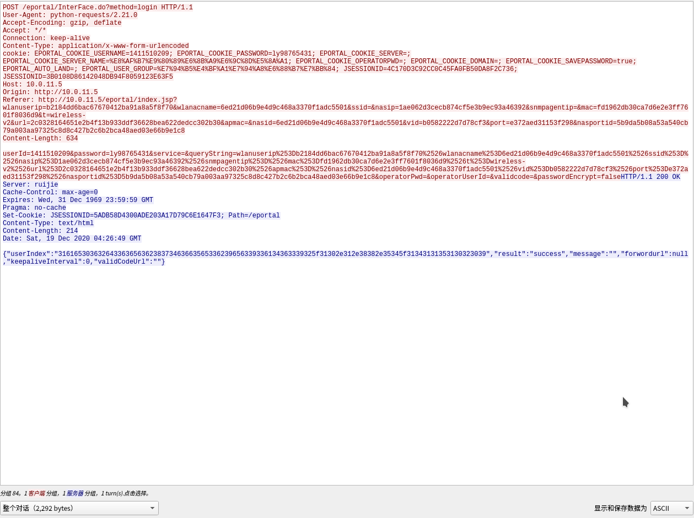
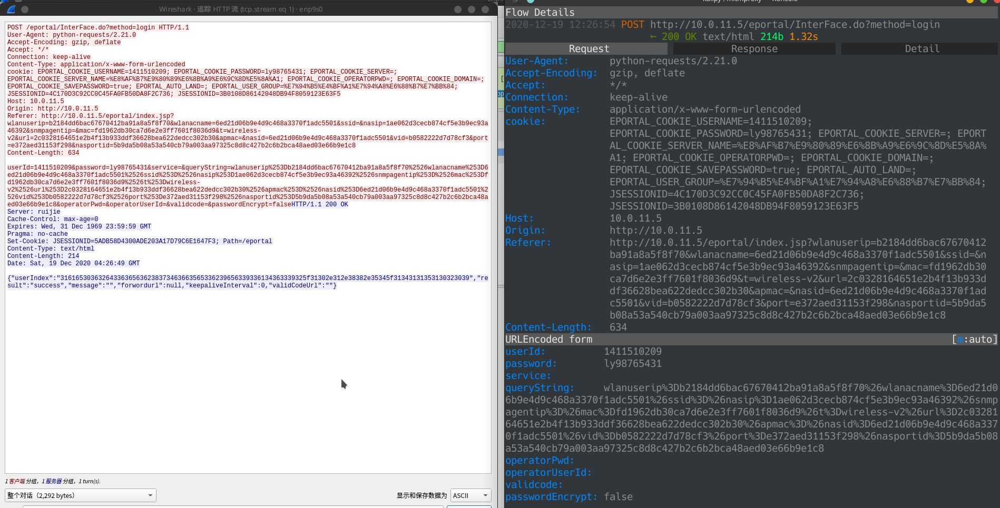

```
linux命令行下发https请求_telnet版.md

:Author: kalipy
:Email: kalipy@debian
:Date: 2020-12-19 11:01
```

1. 请看:
    ```
    kalipy@debian ~> telnet www.baidu.com 80
    Trying 14.215.177.39...
    Connected to www.a.shifen.com.
    Escape character is '^]'.
    GET / HTTP/1.0

    ```

2. 百度返回的响应:
    ```
    HTTP/1.0 200 OK
    Accept-Ranges: bytes
    Cache-Control: no-cache
    Content-Length: 14615
    Content-Type: text/html
    Date: Sat, 19 Dec 2020 03:00:52 GMT
    P3p: CP=" OTI DSP COR IVA OUR IND COM "
    P3p: CP=" OTI DSP COR IVA OUR IND COM "
    Pragma: no-cache
    Server: BWS/1.1
    Set-Cookie: BAIDUID=98B1CF697970549689EDCCBFEB05291C:FG=1; expires=Thu, 31-Dec-37 23:55:55 GMT; max-age=2147483647; path=/; domain=.baidu.com
    Set-Cookie: BIDUPSID=98B1CF697970549689EDCCBFEB05291C; expires=Thu, 31-Dec-37 23:55:55 GMT; max-age=2147483647; path=/; domain=.baidu.com
    Set-Cookie: PSTM=1608346852; expires=Thu, 31-Dec-37 23:55:55 GMT; max-age=2147483647; path=/; domain=.baidu.com
    Set-Cookie: BAIDUID=98B1CF697970549677AFF656B3B9D312:FG=1; max-age=31536000; expires=Sun, 19-Dec-21 03:00:52 GMT; domain=.baidu.com; path=/; version=1; comment=bd
    Traceid: 1608346852028878081010820079113201748617
    Vary: Accept-Encoding
    X-Ua-Compatible: IE=Edge,chrome=1
    
    <!DOCTYPE html><!--STATUS OK-->
    <html>
    ```

3. 请再看(推荐):
    ```
    kalipy@debian ~> more q.txt
    GET / HTTP/1.0
    
    kalipy@debian ~> more 1.sh 
    #! /bin/sh
    #
    # stm32fxx_telnet_start.sh
    # Copyright (C) 2020 kalipy <kalipy@debian>
    #
    # Distributed under terms of the MIT license.
    #
    (
    cat q.txt
    sleep 3
    ) | telnet www.baidu.com 80
    kalipy@debian ~> ./1.sh
    Trying 14.215.177.38...
    Connected to www.a.shifen.com.
    Escape character is '^]'.
    HTTP/1.0 200 OK

    ```

### test01

1. 请看:
    ```
    kalipy@debian ~> more 1.sh
    #! /bin/sh
    #
    # stm32fxx_telnet_start.sh
    # Copyright (C) 2020 kalipy <kalipy@debian>
    #
    # Distributed under terms of the MIT license.
    #
    (
    cat q.txt
    sleep 3
    ) | telnet cas.ycu.jx.cn 80
    kalipy@debian ~> more q.txt
    GET /lyuapServer/login?service=http%3A%2F%2Fmh.ycu.jx.cn%2Fc%2Fportal%2Flogin%3Fp_l_i
    d%3D101829%26_58_redirect%3D%252F HTTP/1.0
    Host: cas.ycu.jx.cn
    Connection: keep-alive
    Cache-Control: max-age=0
    Upgrade-Insecure-Requests: 1
    User-Agent: Mozilla/5.0 (X11; Linux x86_64) AppleWebKit/537.36 (KHTML, like Gecko) Ch
    rome/87.0.4280.66 Safari/537.36
    Accept: text/html,application/xhtml+xml,application/xml;q=0.9,image/avif,image/webp,i
    mage/apng,*/*;q=0.8,application/signed-exchange;v=b3;q=0.9
    Accept-Encoding: gzip, deflate
    Accept-Language: zh-CN,zh;q=0.9
    Cookie: JSESSIONID=37946C8FA67F382C6305D15F6978B1AD; CASTGC=TGT-9762-uHk49QXDVlbRgiKe
    MaqjBPqurxK2wzoRCuv1ktcK9lkObQwRVM-cas; JSESSIONID=FB01BD8FD1D1E74A8575FFF614990C95
    kalipy@debian ~> ./1.sh
    Trying 10.0.10.123...
    Connected to cas.ycu.jx.cn.
    Escape character is '^]'.
    HTTP/1.1 200 OK
    Server: Apache-Coyote/1.1
    Pragma: no-cache
    Expires: Thu, 01 Jan 1970 00:00:00 GMT
    Cache-Control: no-cache
    Cache-Control: no-store
    Set-Cookie: JSESSIONID=D893066141B30D60077BB037106E9C52; Path=/lyuapServer/; HttpOnly
    Content-Type: text/html;charset=UTF-8
    Content-Length: 5394
    Date: Sat, 19 Dec 2020 03:18:26 GMT
    Connection: close
    
    <!DOCTYPE html PUBLIC "-//W3C//DTD XHTML 1.0 Strict//EN" "http://www.w3.org/TR/xhtml1/DTD/xhtml1-strict.dtd">
    
    ```

### test02

1. `sudo wireshark`打开wireshark

2. 随便抓个包,比如我这里执行`python3 wifi.py`登录下校园网
    ```
    kalipy@debian:~$ python3 wifi_loginbak.py
    success
    ```

3. 然后去wireshark看抓到的包如下:


4. `mitmproxy`抓到的如下(左边为wireshark 右边为mitmproxy):


5. 由于`mitmproxy`中的原始请求头和请全体数据不好复制，所以我们选择从`wireshark`中复制数据，即把红色部分copy到q.txt中，如下:
    ```
    kalipy@debian:~$ more q.txt
    POST /eportal/InterFace.do?method=login HTTP/1.0
    User-Agent: python-requests/2.21.0
    Accept-Encoding: gzip, deflate
    Accept: */*
    Connection: keep-alive
    Content-Type: application/x-www-form-urlencoded
    cookie: EPORTAL_COOKIE_USERNAME=1411510209; EPORTAL_COOKIE_PASSWORD=ly98765431; EPORT
    AL_COOKIE_SERVER=; EPORTAL_COOKIE_SERVER_NAME=%E8%AF%B7%E9%80%89%E6%8B%A9%E6%9C%8D%E5
    %8A%A1; EPORTAL_COOKIE_OPERATORPWD=; EPORTAL_COOKIE_DOMAIN=; EPORTAL_COOKIE_SAVEPASSW
    ORD=true; EPORTAL_AUTO_LAND=; EPORTAL_USER_GROUP=%E7%94%B5%E4%BF%A1%E7%94%A8%E6%88%B7
    %E7%BB%84; JSESSIONID=4C170D3C92CC0C45FA0FB50DA8F2C736; JSESSIONID=3B0108D86142048DB9
    4F8059123E63F5
    Host: 10.0.11.5
    Origin: http://10.0.11.5
    Referer: http://10.0.11.5/eportal/index.jsp?wlanuserip=b2184dd6bac67670412ba91a8a5f8f
    70&wlanacname=6ed21d06b9e4d9c468a3370f1adc5501&ssid=&nasip=1ae062d3cecb874cf5e3b9ec93
    a46392&snmpagentip=&mac=fd1962db30ca7d6e2e3ff7601f8036d9&t=wireless-v2&url=2c03281646
    51e2b4f13b933ddf36628bea622dedcc302b30&apmac=&nasid=6ed21d06b9e4d9c468a3370f1adc5501&
    vid=b0582222d7d78cf3&port=e372aed31153f298&nasportid=5b9da5b08a53a540cb79a003aa97325c
    8d8c427b2c6b2bca48aed03e66b9e1c8
    Content-Length: 634
    
    userId=1411510209&password=ly98765431&service=&queryString=wlanuserip%253Db2184dd6bac
    67670412ba91a8a5f8f70%2526wlanacname%253D6ed21d06b9e4d9c468a3370f1adc5501%2526ssid%25
    3D%2526nasip%253D1ae062d3cecb874cf5e3b9ec93a46392%2526snmpagentip%253D%2526mac%253Dfd
    1962db30ca7d6e2e3ff7601f8036d9%2526t%253Dwireless-v2%2526url%253D2c0328164651e2b4f13b
    933ddf36628bea622dedcc302b30%2526apmac%253D%2526nasid%253D6ed21d06b9e4d9c468a3370f1ad
    c5501%2526vid%253Db0582222d7d78cf3%2526port%253De372aed31153f298%2526nasportid%253D5b
    9da5b08a53a540cb79a003aa97325c8d8c427b2c6b2bca48aed03e66b9e1c8&operatorPwd=&operatorU
    serId=&validcode=&passwordEncrypt=false
    ```

6. 用telnet发个请求试下:
    ```
    kalipy@debian:~$ more 1.sh
    (
    cat q.txt
    sleep 3
    ) | telnet 10.0.11.5 80

    kalipy@debian:~$ ./1.sh
    Trying 10.0.11.5...
    Connected to 10.0.11.5.
    Escape character is '^]'.
    HTTP/1.1 200 OK
    Server: ruijie
    Cache-Control: max-age=0
    Expires: Wed, 31 Dec 1969 23:59:59 GMT
    Pragma: no-cache
    Set-Cookie: JSESSIONID=1EC86685580948E4EB4BDE65881052BA; Path=/eportal
    Content-Type: text/html
    Content-Length: 214
    Date: Sat, 19 Dec 2020 04:42:28 GMT
    Connection: keep-alive
    
    {"userIndex":"31616530363264336365636238373463663565336239656339336134363339325f31302e312e38382e35345f31343131353130323039","result":"success","message":"","forwordurl":null,"keepaliveInterval":0,"validCodeUrl":""}Connection closed by foreign host.

    ```

7. 打开浏览器访问百度，ok,发现可以正常上网，说明请求构造成功


### 注意

1. 请求头中`Content-Length`中的大小不能填错,不然请全体中的数据将被截断或者不正确,多填了大小或少填了大小都会请求不成功!!!
    ```
    {"userIndex":null,"result":"fail","message":"用户名不能为空","forwordurl":null,"keepaliveInterval":0,"validCodeUrl":""}Connection closed by foreign host.
    ```

2. `Content-Type`字段一定要正确,因为关系到服务器对请求体数据的解析形式,其大小表示请求体数据的大小，单位为字节，如果请求体中的数据是ascii字符，而ascii字符是一个字节(实际是7个位)代表一个字符的，那么其大小就等于字符个数

3. 请求头的格式请一定要按照`wireshark`的格式那样，不要去看什么网上的复制粘贴的垃圾教程，很多都是错的，比如网上很多这样写的,即在各字段间加了空行，这是错误的，请不要加空行,请求虽然会返回`200 OK`,但是其实请求头和请求体的数据由于位置被空行错乱了，所以导致全部数据只有`GET / HTTP/1.0`这句话被服务器成功解析:
    ```
    //错误写法
    POST /eportal/InterFace.do?method=login HTTP/1.1

    User-Agent: python-requests/2.21.0

    Accept-Encoding: gzip, deflate
    ```
