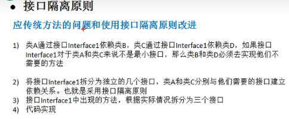
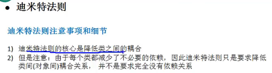
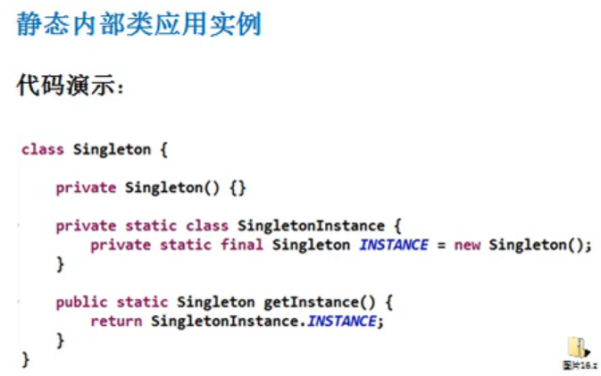

    尚学堂设计模式入门.md
    
    :Author: kalipy
    :Email: kalipy@debian
    :Date: 2021-07-05 19:42

### 经典面试题

### 为什么要用设计模式

### 单一职责原则

eg1. 违反单一职责的例子:

解决方法一,请看eg2,拆分为多个类:

eg2.

eg2缺点:

eg3.

总结

### 接口隔离原则

类图说明: 类B实现了接口1,类D实现了接口1。

eg1.

    public class T
    {
        public static void main(String args[]) {
    
        }
    }
    
    interface Interface1 {
        void operation1();
        void operation2();
        void operation3();
        void operation4();
        void operation5();
    }
    
    class B implements Interface1 {
        public void operation1() {
            System.out.println("B 实现了 operation1");
        }
        public void operation2() {
            System.out.println("B 实现了 operation2");
        }
        public void operation3() {
            System.out.println("B 实现了 operation3");
        }
        public void operation4() {
            System.out.println("B 实现了 operation4");
        }
        public void operation5() {
            System.out.println("B 实现了 operation5");
        }
    }
    
    class D implements Interface1 {
        public void operation1() {
            System.out.println("D 实现了 operation1");
        }
        public void operation2() {
            System.out.println("D 实现了 operation2");
        }
        public void operation3() {
            System.out.println("D 实现了 operation3");
        }
        public void operation4() {
            System.out.println("D 实现了 operation4");
        }
        public void operation5() {
            System.out.println("D 实现了 operation5");
        }
    }
    
    class A {//A 类通过接口Interface1依赖(使用)B类，但是只会用到1,2,3方法
        public void depend1(Interface1 i) {
            i.operation1();
        }
        
        public void depend2(Interface1 i) {
            i.operation2();
        }
        
        public void depend3(Interface1 i) {
            i.operation3();
        }
    }
    
    class C {//C 类通过接口Interface1依赖(使用)D类，但是只会用到1,4,5方法
        public void depend1(Interface1 i) {
            i.operation1();
        }
        
        public void depend4(Interface1 i) {
            i.operation4();
        }
        
        public void depend5(Interface1 i) {
            i.operation5();
        }
    }

### 接口隔离原则2

eg1缺点与解决:

请看代码eg2.

    kalipy@debian ~/b/m/设计模式相关> more T.java
    public class T
    {
        public static void main(String args[]) {
            A a = new A();
            a.depend1(new B());//A类通过接口去依赖B类
            a.depend2(new B());
            a.depend3(new B());
        }
    }
    
    interface Interface1 {
        void operation1();
    }
    
    interface Interface2 {
        void operation2();
        void operation3();
    }
    
    interface Interface3 {
        void operation4();
        void operation5();
    }
    
    class B implements Interface1, Interface2 {
        public void operation1() {
            System.out.println("B 实现了 operation1");
        }
        public void operation2() {
            System.out.println("B 实现了 operation2");
        }
        public void operation3() {
            System.out.println("B 实现了 operation3");
        }
    }
    
    class D implements Interface1, Interface3 {
        public void operation1() {
            System.out.println("D 实现了 operation1");
        }
        public void operation4() {
            System.out.println("D 实现了 operation4");
        }
        public void operation5() {
            System.out.println("D 实现了 operation5");
        }
    }
    
    class A {//A 类通过接口Interface1, Interface2依赖(使用)B类，但是只会用到1,2,3方法
        public void depend1(Interface1 i) {
            i.operation1();
        }
        
        public void depend2(Interface2 i) {
            i.operation2();
        }
        
        public void depend3(Interface2 i) {
            i.operation3();
        }
    }
    
    class C {//C 类通过接口Interface1, Interface3依赖(使用)D类，但是只会用到1,4,5方法
        public void depend1(Interface1 i) {
            i.operation1();
        }
        
        public void depend4(Interface3 i) {
            i.operation4();
        }
        
        public void depend5(Interface3 i) {
            i.operation5();
        }
    }
    kalipy@debian ~/b/m/设计模式相关> javac T.java
    kalipy@debian ~/b/m/设计模式相关> java T
    B 实现了 operation1
    B 实现了 operation2
    B 实现了 operation3

### 依赖倒转原则1

eg1.

    kalipy@debian ~/b/m/设计模式相关> more T.java
    public class T
    {
        public static void main(String args[]) {
            Person person = new Person();
            person.receive(new Email());
        }
    }
    
    class Email {
        public String getInfo() {
            return "email msg: hello world";
        }
    }
    
    //完成Person接收消息的功能
    //方式一
    class Person {
        public void receive(Email email) {
            System.out.println(email.getInfo());
        }
    }
    kalipy@debian ~/b/m/设计模式相关> javac T.java
    kalipy@debian ~/b/m/设计模式相关> java T
    email msg: hello world

eg1存在的问题:

eg1问题的解决方式:

### 依赖倒转原则2

eg2.

    kalipy@debian ~/b/m/设计模式相关> more T.java
    public class T
    {
        public static void main(String args[]) {
            Person person = new Person();
            person.receive(new Email());
            person.receive(new WeiXin());
        }
    }
    
    interface IReceiver {
        public String getInfo();
    }
    
    class Email implements IReceiver {
        public String getInfo() {
            return "email msg: hello world";
        }
    }
    
    class WeiXin implements IReceiver {
        public String getInfo() {
            return "WeiXin msg: hello world";
        }
    }
    
    //方式二
    class Person {
        public void receive(IReceiver receiver) {
            System.out.println(receiver.getInfo());
        }
    }
    kalipy@debian ~/b/m/设计模式相关> javac T.java
    kalipy@debian ~/b/m/设计模式相关> java T
    email msg: hello world
    WeiXin msg: hello world

#### 依赖关系传递的三种方式

### 依赖倒转原则小结

### 里氏替换原则1

### 里氏替换原则2

### 开闭原则1

eg1.

    kalipy@debian ~/b/m/设计模式相关> more T.java
    public class T
    {
        public static void main(String args[]) {
            GraphicEditor graphicEditor = new GraphicEditor();
            graphicEditor.drawShape(new Rectangle());
            graphicEditor.drawShape(new Circle());
        }
    }
    
    class GraphicEditor {
        public void drawShape(Shape s) {
            if (s.m_type == 1) {
                drawRectangle(s);
            } else if (s.m_type == 2) {
                drawCircle(s);
            }
        }
    
        public void drawRectangle(Shape r) {
            System.out.println("Rectanle");
        }
        
        public void drawCircle(Shape c) {
            System.out.println("Circle");
        }
    }
    
    class Shape {
        int m_type;
    }
    
    class Rectangle extends Shape {
        Rectangle() {
            super.m_type = 1;
        }
    }
    
    class Circle extends Shape {
        Circle() {
            super.m_type = 2;
        }
    }
    kalipy@debian ~/b/m/设计模式相关> javac T.java
    kalipy@debian ~/b/m/设计模式相关> java T
    Rectanle
    Circle

eg1缺点:

### 开闭原则2

eg2.

    kalipy@debian ~/b/m/设计模式相关> more T.java
    public class T
    {
        public static void main(String args[]) {
            GraphicEditor graphicEditor = new GraphicEditor();
            graphicEditor.drawShape(new Rectangle());
            graphicEditor.drawShape(new Circle());
        }
    }
    
    class GraphicEditor {
        public void drawShape(Shape s) {
            s.draw();
        }
    }
    
    abstract class Shape {
        public abstract void draw();
    }
    
    class Rectangle extends Shape {
        @Override
        public void draw() {
            System.out.println("drawRectangle");
        }
    }
    
    class Circle extends Shape {
        @Override
        public void draw() {
            System.out.println("drawCircle");
        }
    }
    kalipy@debian ~/b/m/设计模式相关> javac T.java
    kalipy@debian ~/b/m/设计模式相关> java T
    drawRectangle
    drawCircle

### 迪米特原则

eg1.

    kalipy@debian ~/b/m/设计模式相关> more T.java
    import java.util.ArrayList;
    import java.util.List;
    
    public class T
    {
        public static void main(String args[]) {
            SchoolManager schoolManager = new SchoolManager();
            schoolManager.printAllEmployee(new CollegeManager());
        }
    }
    
    class Employee {
        private String id;
    
        public void setId(String id) {
            this.id = id;
        }
    
        public String getId() {
            return id;
        }
    }
    
    //学院员工
    class CollegeEmployee {
        private String id;
    
        public void setId(String id) {
            this.id = id;
        }
    
        public String getId() {
            return id;
        }
    }
    
    //学院员工管理类
    class CollegeManager {
        public List<CollegeEmployee> getAllEmployee() {
            List<CollegeEmployee> list = new ArrayList <CollegeEmployee>();
            for (int i = 0; i < 10; i++) {
                CollegeEmployee emp = new CollegeEmployee();
                emp.setId("学院员工id= " + i);
                list.add(emp);
            }
            return list;
        }
    }
    
    //学校管理类
    class SchoolManager {
        //返回学校所有学院的员工
        public List<Employee> getAllEmployee() {
            List<Employee> list = new ArrayList<Employee>();
            for (int i = 0; i < 5; i++) {
                Employee emp = new Employee();
                emp.setId("学校总部员工id= " + i);
                list.add(emp);
            }
            return list;
        }
    
        void printAllEmployee(CollegeManager sub) {
            List<CollegeEmployee> list1 = sub.getAllEmployee();
            System.out.println("分院校员工-------------");
            for (CollegeEmployee e : list1) {
                System.out.println(e.getId());
            }
            List<Employee> list2 = this.getAllEmployee();
            System.out.println("学校总部员工-------------");
            for (Employee e : list2) {
                System.out.println(e.getId());
            }
        }
    }
    kalipy@debian ~/b/m/设计模式相关> javac T.java
    kalipy@debian ~/b/m/设计模式相关> java T
    分院校员工-------------
    学院员工id= 0
    学院员工id= 1
    学院员工id= 2
    学院员工id= 3
    学院员工id= 4
    学院员工id= 5
    学院员工id= 6
    学院员工id= 7
    学院员工id= 8
    学院员工id= 9
    学校总部员工-------------
    学校总部员工id= 0
    学校总部员工id= 1
    学校总部员工id= 2
    学校总部员工id= 3
    学校总部员工id= 4

eg1存在的问题:

### 迪米特原则2

eg1改进:

### 迪米特原则注意事项

### 合成复用原则

三种方式替代继承:

### 设计原则核心思想

### UML简介

箭头含义:

### UML类图

### 类的依赖 继承 实现

依赖:

继承:

实现:

### 类的关联 聚合 组合

关联:

聚合:

聚合与组合:

### 单例模式

#### 静态常量恶汉式

    kalipy@debian ~/b/m/设计模式相关> more T.java
    import java.util.ArrayList;
    import java.util.List;
    
    public class T
    {
        public static void main(String args[]) {
            Singleton instance1 = Singleton.getInstance(); 
            Singleton instance2 = Singleton.getInstance(); 
            System.out.println(instance1 == instance2);
        }
    }
    
    class Singleton {
        private Singleton() {
    
        }
    
        private final static Singleton instance = new Singleton();
    
        public static Singleton getInstance() {
            return instance;
        }
    }
    
    kalipy@debian ~/b/m/设计模式相关> javac T.java
    kalipy@debian ~/b/m/设计模式相关> java T
    true

#### 静态代码块恶汉式

#### 线程不安全懒汉式

#### 线程安全懒汉式

#### 同步代码块懒汉式

#### DoubleCheck

#### 静态内部类

#### 枚举

单例模式JDK源码分析

#### 单例模式注意事项

