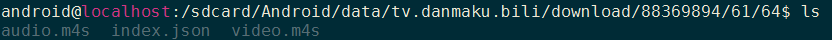
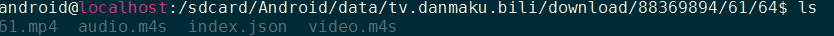
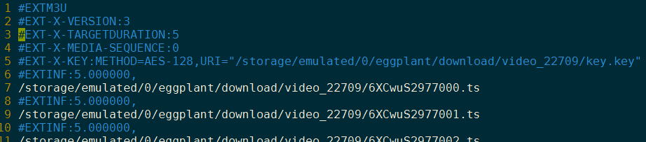
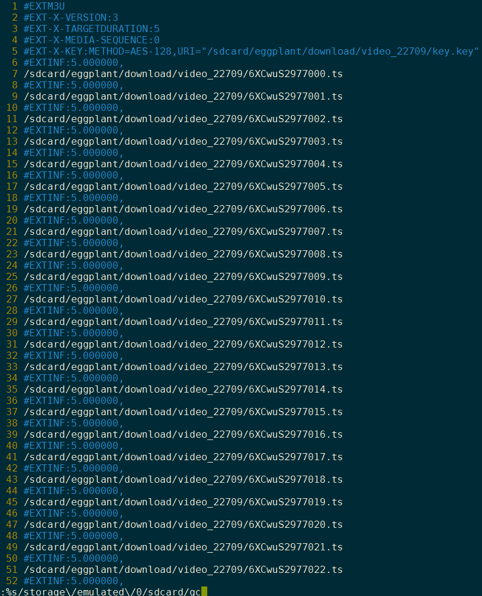
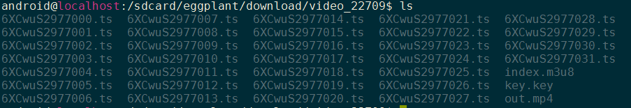

# ffmpeg视频合并或下载

### bilibili手机缓存视频合并： 
1.cd到bilibili视频缓存存放的地方:  
  

2.把video.m4s和audio.m4s用如下命令合并为out.mp4:  
`ffmpeg -i video.m4s -i audio.m4s -codec copy out.mp4  `  

3.命令运行后结果如下：  



### 加密的m3u8视频:  
`ffmpeg -i https://xxx/really.m3u8 -c copy out.mp4`


###带key的m3u8本地视频文件合并: 
1.index.m3u8内容如下：  


2.因为我用的是安卓linux，会提示找不到路径"/storage/emulated/0/"，所以把其改为"/sdcard/"即可(用vim的全局替换命令很快),替换后结果如下:  


3.输入如下命令合并加密的*.ts文件：
```  
ffmpeg -allowed_extensions ALL -protocol_whitelist "file,http,crypto,tcp" -i index.m3u8 -c copy out.mp4
```

4.ok:  


