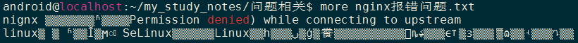

# linux命令行字符编码查看与转换

### 查看：
1.安装enca:  
`sudo apt-get install enca`

2.查看文件编码：  
`enca 文件名 -L none`

### 转换：
1.说明：  
convmv -f 源编码 -t 新编码 [选项] 文件名

?  -f <encoding> : 指定原始文本编码。

?  -t <encoding> : 指定要转换的编码。

?  -l : 列出所有已知编码字符集。

?  -c : 忽略输出中的无效字符。

?  -o <output file> : 指定输出文件，而不是在标准输出上显示。

2.使用示例：  
* ansi转utf-8:  
`iconv -f gb2312 -t utf-8 -o out.txt nginx报错问题.txt`  
转换前：  

转换后：  

