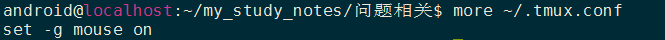

### 安装tmux
`sudo apt-get install tmux`  

### 基本操作 

新建会话：tmux new -s session-name

查看会话：tmux ls

进入会话：tmux a -t session-name

断开会话：tmux detach

关闭会话：tmux kill-session -t session-name

 

### 可能出现的问题
1.说明:  
关于 tmux 大家应该不是特别的陌生，很多人可能在网上查到了很多的设置的模式之后，发现不能运行还报错。这里统一给大家解释一下。因为用了老的配置导致的，新的版本的 tmux 中已经简化了鼠标相关的设置，请使用新的版本的配置项来设置。下面分别说一下老的配置项以及新的配置项。使用新的配置项以后就可以在 tmux 里面随意的使用鼠标来进行窗口的切换与调节大小了。  

2.tmux 新的配置项:  

新的配置项已简化为:  
`set -g mouse on`  

将他写到 ~/.tmux.conf 中然后执行:  
`tmux source ~/.tmux.conf`  
如图：  

### s实际使用
1.tmux new -s session-name进入tmux:  
`tmux new -s 1`

2.上下分屏:  
a)ctrl + b  
b)再按 "  
注意：a与b是两个步骤，请分开按，不是ctrl +b+"三个键一起按下

左右分屏：ctrl + b 再按 %

切换屏幕：ctrl + b 再按o

关闭一个终端：ctrl + b 再按x

上下分屏与左右分屏切换： ctrl + b 再按空格键

### VIM分屏指令

命令模式下：
“:vertical res 20” 。进入命令行模式前，光标所在的窗口宽度将变成全部宽度的20%。

:new，新建文件并分屏， 快捷键，Ctrl+W，然后马上按n键
:sp 水平分屏，将当前屏分为两个，水平的。   Ctrl + w, s
:vs 垂直分屏，将当前屏分为两个，垂直的。  Ctrl + w, v
:only 取消分屏，取消当前的屏，当前屏指的是光标所在屏。

关闭当前屏: Ctrl+w，c。

如何切换焦点？

Ctrl + w, w 后一个
Ctrl + w, p 前一个

Ctrl + w, h 四个方向
Ctrl + w, i
Ctrl + w, k
Ctrl + w, l

如何关闭其他窗口?

Ctrl + w, o

载入文件

:vs  文件路径/文件名      在新的垂直分屏中打开文件

:s
